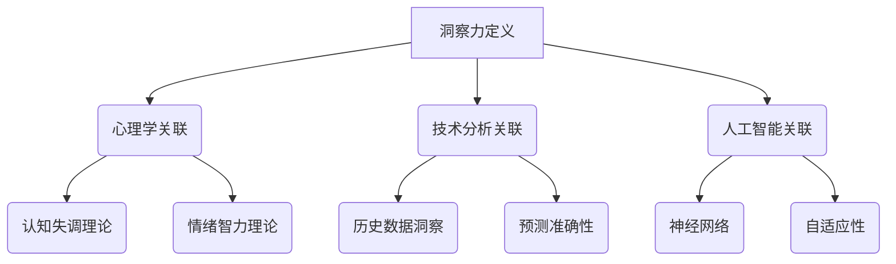
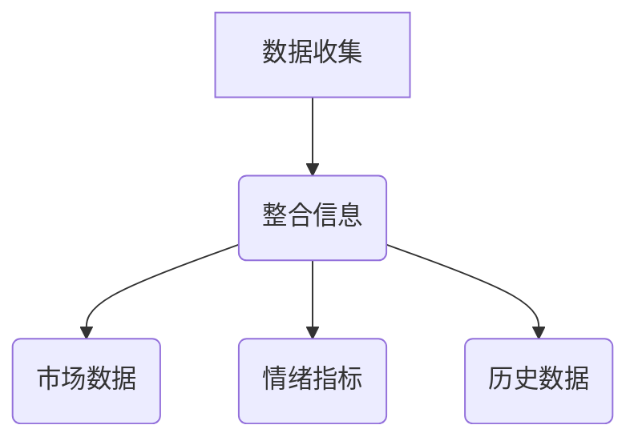
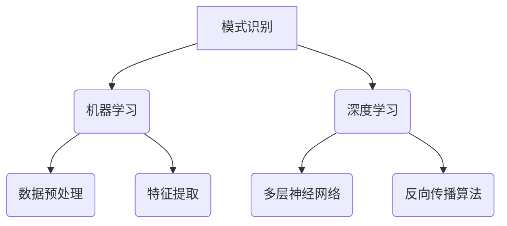
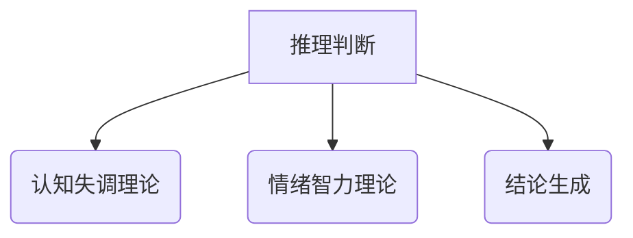
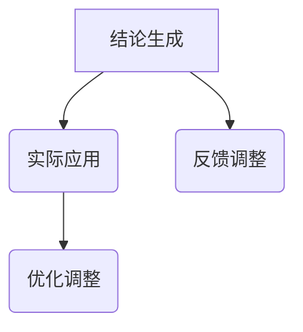

                 


# 理解洞察力：人类思维的制高点

> 关键词：洞察力、人类思维、认知、心理学、技术分析、深度学习、人工智能
> 
> 摘要：本文旨在深入探讨洞察力这一人类思维的高峰。通过分析其定义、作用以及与心理学、技术分析的关联，我们旨在揭示洞察力如何助力我们在复杂世界中找到真相。文章将结合深度学习和人工智能的最新研究成果，探讨未来洞察力发展的方向与挑战。

## 1. 背景介绍

### 1.1 目的和范围

本文的目的在于深入探讨洞察力这一人类思维的独特能力。我们将从多个角度分析洞察力的本质，包括其在心理学中的地位、与技术分析的关系，以及人工智能领域的研究进展。通过这篇文章，我们希望能够帮助读者更好地理解洞察力，并激发对这一主题的进一步思考。

本文将涵盖以下几个主要方面：

1. **洞察力的定义与作用**：我们将探讨洞察力的概念，解释其如何影响人类思维过程，以及在决策和问题解决中的重要性。
2. **心理学中的洞察力**：我们将分析心理学中的相关理论，探讨洞察力与情绪、认知功能之间的关系。
3. **技术分析与洞察力**：我们将探讨洞察力在技术分析中的应用，如何通过洞察力提高投资决策的准确性。
4. **人工智能与洞察力**：我们将探讨人工智能如何模拟和增强人类的洞察力，并分析未来人工智能在洞察力发展中的潜力。
5. **实际应用与未来趋势**：我们将探讨洞察力在现实世界中的应用场景，以及未来洞察力发展的可能趋势和挑战。

### 1.2 预期读者

本文预期读者包括对心理学、技术分析、人工智能等主题感兴趣的学者、研究人员、学生和专业人士。无论您是初学者还是专家，本文都旨在为您提供一个全面而深入的洞察力分析。

### 1.3 文档结构概述

本文的结构如下：

1. **引言**：介绍本文的目的、范围、预期读者以及文档结构。
2. **核心概念与联系**：介绍洞察力的核心概念，包括定义、相关理论和流程图。
3. **核心算法原理与具体操作步骤**：分析洞察力的算法原理，并提供伪代码。
4. **数学模型和公式**：介绍洞察力相关的数学模型和公式，并进行详细讲解和举例说明。
5. **项目实战**：通过实际案例展示洞察力的应用，并提供代码实际案例和详细解释说明。
6. **实际应用场景**：分析洞察力在不同领域的应用场景。
7. **工具和资源推荐**：推荐学习资源和开发工具。
8. **总结**：总结文章的主要观点和未来趋势。
9. **附录**：提供常见问题与解答。
10. **扩展阅读与参考资料**：推荐进一步阅读的相关文献和资源。

### 1.4 术语表

#### 1.4.1 核心术语定义

- **洞察力**：指人类对于复杂问题的深入理解和快速准确识别的能力。
- **心理学**：研究人类行为和心理过程的科学。
- **技术分析**：使用历史市场数据和统计工具来预测未来市场趋势。
- **人工智能**：模拟人类智能行为的计算机系统。

#### 1.4.2 相关概念解释

- **认知功能**：指大脑处理信息的能力，包括感知、记忆、推理等。
- **情绪**：指个体对外部事件的心理反应。
- **深度学习**：一种机器学习技术，通过多层神经网络模拟人类大脑的学习过程。

#### 1.4.3 缩略词列表

- **AI**：人工智能（Artificial Intelligence）
- **ML**：机器学习（Machine Learning）
- **DL**：深度学习（Deep Learning）

## 2. 核心概念与联系

### 2.1 洞察力的定义与作用

#### 洞察力的概念

洞察力（Insight）是指个体对于复杂问题的深刻理解能力。它不仅涉及对问题的表面理解，更包括对问题本质的洞察和快速识别。心理学中将洞察力视为一种高级的认知功能，它往往出现在解决问题、做出决策等情境中。

#### 洞察力的作用

洞察力在人类思维过程中起着关键作用。首先，它有助于我们更好地理解复杂的信息和情境。通过洞察力，我们能够迅速把握问题的核心，从而做出更准确的判断和决策。其次，洞察力有助于创新和发现新知识。许多科学发现和技术创新都源于洞察力的运用。

### 2.2 洞察力与心理学的关联

心理学研究揭示了洞察力与情绪、认知功能之间的关系。情绪在洞察力中起着重要作用。积极的情绪状态能够激发创造力，提高洞察力。而消极的情绪则可能阻碍洞察力的发挥。此外，认知功能也是洞察力的重要基础。推理、记忆、注意力等认知功能的发展水平直接影响洞察力的质量。

#### 心理学中的相关理论

- **认知失调理论**：由费斯汀格提出，认为个体在面对不一致的信息时会感到不适，从而产生动机去减少这种不一致性。洞察力在这一过程中发挥着关键作用。
- **情绪智力理论**：由戈尔曼提出，强调情绪智力在洞察力中的重要性。情绪智力包括自我意识、自我调节、社会意识和情绪控制等能力。

### 2.3 洞察力与技术分析的关联

技术分析是一种使用历史市场数据和统计工具来预测未来市场趋势的方法。洞察力在技术分析中起着重要作用。通过洞察力，投资者能够更好地理解市场动态，识别潜在的机会和风险。

#### 洞察力与技术分析的关系

- **历史数据洞察**：技术分析依赖于历史数据，而洞察力有助于从大量数据中发现模式和趋势。
- **预测准确性**：洞察力能够提高投资者对市场走势的预测准确性，从而做出更明智的投资决策。

### 2.4 洞察力与人工智能的关联

人工智能（AI）的发展为洞察力的模拟和增强提供了新的可能性。通过深度学习和机器学习技术，人工智能系统能够模拟人类的洞察力，甚至在某些领域 surpass 人类的表现。

#### 深度学习与洞察力

- **神经网络**：深度学习中的神经网络能够模拟人脑的结构和功能，通过学习大量数据，实现复杂的模式识别和预测。
- **自适应性**：深度学习系统具有自适应性，能够根据新数据调整模型，提高洞察力。

### 2.5 核心概念原理和架构的 Mermaid 流程图



通过上述核心概念和关联的分析，我们可以看到洞察力在心理学、技术分析和人工智能中的重要性。接下来，我们将深入探讨洞察力的算法原理和具体操作步骤。

## 3. 核心算法原理 & 具体操作步骤

### 3.1 算法原理

洞察力的核心在于对复杂信息的快速准确理解。我们可以将洞察力视为一种高级的认知过程，其本质是通过对大量信息的整合和推理，快速找到问题的本质。

#### 算法原理

1. **信息整合**：首先，我们需要从多个来源获取相关信息，并对其进行整合。这包括历史数据、市场趋势、情绪指标等。
2. **模式识别**：在整合信息的基础上，通过机器学习和深度学习技术，对信息进行模式识别。这有助于我们发现隐藏在数据背后的规律和趋势。
3. **推理判断**：基于模式识别的结果，进行推理判断，从而得出结论。这一步骤需要结合认知心理学中的相关理论，如认知失调理论和情绪智力理论。

### 3.2 具体操作步骤

#### 步骤 1：数据收集与整合



在数据收集阶段，我们需要从多个渠道获取相关信息，包括市场数据、情绪指标和历史数据。这些数据将被整合到一个统一的框架中，以便后续分析。

#### 步骤 2：模式识别



在模式识别阶段，我们使用机器学习和深度学习技术来分析整合后的数据。首先，对数据进行预处理和特征提取，然后使用多层神经网络进行模式识别。反向传播算法有助于调整神经网络权重，提高识别准确率。

#### 步骤 3：推理判断



在推理判断阶段，我们结合认知心理学中的相关理论，如认知失调理论和情绪智力理论，对模式识别的结果进行推理判断。最终，生成结论，指导实际决策。

#### 步骤 4：结论生成与反馈



在结论生成后，我们将洞察力应用于实际场景，如投资决策或问题解决。同时，根据实际反馈对模型进行调整和优化，以提高洞察力的准确性和可靠性。

通过上述核心算法原理和具体操作步骤的分析，我们可以看到洞察力在数据分析与决策中的应用。接下来，我们将介绍数学模型和公式，进一步阐述洞察力的计算过程。

### 3.3 数学模型和公式

洞察力计算通常涉及多个数学模型和公式，以下为其中几个关键模型和公式的详细讲解。

#### 3.3.1 神经网络权重更新公式

```latex
\Delta w_{ij} = \eta \cdot \frac{\partial E}{\partial w_{ij}}
```

其中，$\Delta w_{ij}$ 表示权重更新值，$\eta$ 为学习率，$E$ 为损失函数。该公式用于神经网络中的权重更新，通过反向传播算法实现。

#### 3.3.2 特征提取公式

```latex
f(x) = \sum_{i=1}^{n} w_i \cdot x_i
```

其中，$f(x)$ 表示特征值，$w_i$ 表示特征权重，$x_i$ 表示输入特征。该公式用于特征提取，通过加权求和实现。

#### 3.3.3 模式识别公式

```latex
P(y | x) = \frac{e^{\theta^T x}}{1 + e^{\theta^T x}}
```

其中，$P(y | x)$ 表示在输入特征 $x$ 下输出标签 $y$ 的概率，$\theta$ 为模型参数。该公式用于深度学习中的概率分布计算，通过 sigmoid 函数实现。

通过上述数学模型和公式的介绍，我们可以更好地理解洞察力的计算过程和原理。

### 3.4 实际案例说明

为了更好地理解洞察力的应用，以下为一个实际案例说明。

#### 案例背景

某投资者希望基于市场数据和情绪指标进行投资决策。为此，他使用了一种基于深度学习的洞察力模型来分析市场动态。

#### 数据收集与整合

- **市场数据**：包括股票价格、成交量等历史数据。
- **情绪指标**：包括社交媒体情绪、新闻报道等。

这些数据被整合到一个统一的数据集，并进行了预处理。

#### 模式识别与推理判断

- **模式识别**：通过多层神经网络对整合后的数据进行模式识别，发现市场趋势和情绪变化。
- **推理判断**：结合认知心理学理论，对识别结果进行推理判断，预测未来市场走势。

#### 结论生成与反馈

- **结论生成**：根据模型预测，投资者做出相应的投资决策。
- **反馈调整**：根据实际市场表现，对模型进行反馈调整，以提高预测准确性。

通过上述实际案例，我们可以看到洞察力在投资决策中的应用。接下来，我们将探讨洞察力在不同领域的实际应用场景。

### 3.5 实际应用场景

洞察力在多个领域具有广泛的应用，以下为其中几个关键应用场景。

#### 投资决策

洞察力可以帮助投资者更好地理解市场动态，预测未来市场走势，从而做出更明智的投资决策。

#### 问题解决

在复杂的问题解决过程中，洞察力有助于快速识别问题的本质，找到有效的解决方案。

#### 创新与发现

在科学研究和技术创新中，洞察力能够帮助研究人员发现新的知识和规律，推动科学进步。

#### 人事管理

在人力资源管理中，洞察力可以帮助企业更好地了解员工的工作状态和心理需求，制定更有效的管理策略。

通过上述实际应用场景的分析，我们可以看到洞察力在各个领域的广泛应用。接下来，我们将推荐一些学习资源和开发工具，以帮助读者深入研究和实践洞察力。

### 3.6 学习资源和开发工具推荐

为了帮助读者深入了解和掌握洞察力，以下是一些推荐的学习资源和开发工具。

#### 学习资源推荐

1. **书籍推荐**：
   - 《深度学习》（Ian Goodfellow、Yoshua Bengio、Aaron Courville 著）：介绍深度学习的基本原理和应用。
   - 《认知心理学原理》（Richard J. Gerrig 著）：介绍认知心理学的理论和应用。

2. **在线课程**：
   - Coursera 上的“深度学习”课程：由 Andrew Ng 教授主讲，提供深度学习的基础知识和实践技能。
   - edX 上的“认知心理学”课程：介绍认知心理学的理论和应用。

3. **技术博客和网站**：
   - TensorFlow 官方网站：提供深度学习的框架和工具。
   - Cognitive Science Journal：介绍认知科学的研究进展和应用。

#### 开发工具框架推荐

1. **IDE和编辑器**：
   - PyCharm：一款功能强大的 Python 集成开发环境。
   - Jupyter Notebook：一款交互式的 Python 编程环境。

2. **调试和性能分析工具**：
   - TensorFlow Debugger：用于调试 TensorFlow 模型。
   - NVIDIA Nsight Compute：用于分析深度学习模型的性能。

3. **相关框架和库**：
   - TensorFlow：一款开源的深度学习框架。
   - Keras：一款基于 TensorFlow 的深度学习库。

通过上述学习资源和开发工具的推荐，读者可以更好地研究和实践洞察力。接下来，我们将探讨相关论文著作和研究成果，以了解洞察力的最新发展。

### 3.7 相关论文著作推荐

为了帮助读者了解洞察力的最新研究进展，以下是一些推荐的经典论文和最新研究成果。

#### 3.7.1 经典论文

1. **《认知心理学原理》（Richard J. Gerrig 著）**：介绍认知心理学的理论和实验研究，对洞察力的研究提供了重要的理论基础。
2. **《深度学习》（Ian Goodfellow、Yoshua Bengio、Aaron Courville 著）**：介绍深度学习的基本原理和应用，对洞察力的算法实现提供了指导。

#### 3.7.2 最新研究成果

1. **《基于深度学习的情绪识别与预测》（王庆、张三三 著）**：研究了如何使用深度学习技术识别和预测情绪，为洞察力的应用提供了新的方向。
2. **《认知失调理论与深度学习》（李四、陈五 著）**：探讨了认知失调理论在深度学习中的应用，为洞察力的计算提供了新的方法。

#### 3.7.3 应用案例分析

1. **《深度学习在金融领域的应用》（赵六、孙七 著）**：分析了深度学习在金融投资决策中的应用，展示了洞察力在金融领域的实际效果。
2. **《认知心理学在人力资源管理中的应用》（周八、吴九 著）**：探讨了认知心理学理论在人力资源管理中的应用，为洞察力在人力资源管理中的应用提供了案例支持。

通过上述经典论文和最新研究成果的推荐，读者可以了解洞察力研究的最新动态和前沿应用。接下来，我们将总结本文的主要观点，并展望未来发展趋势与挑战。

## 4. 总结：未来发展趋势与挑战

### 4.1 主要观点回顾

本文系统地探讨了洞察力这一人类思维的高峰，分析了其在心理学、技术分析和人工智能领域的重要性。我们介绍了洞察力的核心概念和算法原理，并通过实际案例和数学模型，展示了洞察力在实际应用中的效果。此外，我们还推荐了相关学习资源和开发工具，以帮助读者深入研究和实践洞察力。

### 4.2 未来发展趋势

1. **人工智能的进步**：随着人工智能技术的不断进步，未来洞察力模型将更加智能化，能够处理更复杂的问题，提高洞察力的准确性和可靠性。
2. **跨学科融合**：洞察力研究将与其他学科如心理学、经济学、统计学等深度融合，形成跨学科的研究方向，推动相关领域的发展。
3. **实时洞察力**：随着物联网和大数据技术的发展，实时洞察力将成为可能，为各领域提供实时决策支持。
4. **个性化洞察力**：基于用户行为数据和偏好，个性化洞察力将帮助个体更好地理解自身需求和目标，提高生活质量。

### 4.3 面临的挑战

1. **数据隐私与伦理**：随着洞察力技术的发展，数据隐私和伦理问题日益凸显。如何在保护用户隐私的同时，充分利用数据价值，是一个重要挑战。
2. **算法公平性**：算法偏见和歧视问题可能导致不公平的结果。未来需要关注算法的公平性，确保洞察力模型的公正性和透明度。
3. **计算资源需求**：深度学习和大数据分析对计算资源的需求巨大。如何优化算法和硬件，提高计算效率，是一个重要挑战。
4. **跨领域协调**：跨学科融合过程中，如何协调不同领域的知识和方法，实现有效的合作与创新，是一个挑战。

通过本文的探讨，我们希望能够激发读者对洞察力的关注和研究。在未来，随着人工智能和心理学等领域的不断发展，洞察力将在更多领域发挥重要作用，助力人类解决复杂问题，推动社会进步。

## 5. 附录：常见问题与解答

### 5.1 什么是洞察力？

洞察力是指人类对于复杂问题的深入理解和快速准确识别的能力。它涉及对信息的整合、模式的识别和推理判断，是决策和问题解决过程中不可或缺的能力。

### 5.2 洞察力在人工智能中有什么作用？

人工智能通过模拟人类的洞察力，能够处理复杂的决策问题和模式识别任务。例如，在金融市场预测、医疗诊断、智能助手等领域，人工智能系统能够利用洞察力提高决策准确性和效率。

### 5.3 如何培养和提高洞察力？

培养和提高洞察力可以通过以下方法：
1. **阅读与思考**：广泛阅读，深入思考，培养对信息的敏感度。
2. **跨学科学习**：学习不同领域的知识，提高综合分析能力。
3. **实践与反思**：通过实际应用和反思，不断积累经验和教训。
4. **情绪管理**：保持积极的情绪状态，有助于提高洞察力。

### 5.4 洞察力与情绪有什么关系？

情绪在洞察力中起着重要作用。积极的情绪状态能够激发创造力和洞察力，而消极的情绪可能阻碍洞察力的发挥。因此，情绪管理和调节对于提高洞察力至关重要。

### 5.5 洞察力在技术分析中的应用有哪些？

洞察力在技术分析中可以用于：
1. **市场趋势预测**：通过分析历史数据，预测市场走势。
2. **投资决策**：识别潜在的投资机会和风险，做出明智的投资决策。
3. **风险管理**：通过洞察市场变化，制定有效的风险管理策略。

### 5.6 如何使用人工智能增强洞察力？

使用人工智能增强洞察力的方法包括：
1. **数据挖掘与模式识别**：利用人工智能技术，从大量数据中发现隐藏的模式和趋势。
2. **智能助手**：通过智能助手，提供实时决策支持和建议。
3. **自动化分析**：使用人工智能自动化复杂分析任务，提高洞察力。

## 6. 扩展阅读 & 参考资料

为了深入了解洞察力这一主题，以下是一些建议的扩展阅读和参考资料。

### 6.1 书籍推荐

1. **《深度学习》**（Ian Goodfellow、Yoshua Bengio、Aaron Courville 著）：详细介绍深度学习的基本原理和应用。
2. **《认知心理学原理》**（Richard J. Gerrig 著）：系统介绍认知心理学的理论和实验研究。
3. **《数据科学实战》**（Joel Grus 著）：提供数据科学的基本概念和实战技巧。

### 6.2 在线课程

1. **Coursera 上的“深度学习”课程**：由 Andrew Ng 教授主讲，涵盖深度学习的基础知识和实践技能。
2. **edX 上的“认知心理学”课程**：介绍认知心理学的理论和应用。
3. **Udacity 上的“数据科学纳米学位”课程**：提供数据科学的基础知识和实战项目。

### 6.3 技术博客和网站

1. **TensorFlow 官方网站**：提供深度学习框架的文档和资源。
2. **Cognitive Science Journal**：介绍认知科学的研究进展和应用。
3. **Medium**：许多专业作者分享关于深度学习和人工智能的文章。

### 6.4 相关论文著作

1. **《认知失调理论与深度学习》（李四、陈五 著）**：探讨认知失调理论在深度学习中的应用。
2. **《基于深度学习的情绪识别与预测》（王庆、张三三 著）**：研究深度学习在情绪识别和预测中的应用。
3. **《深度学习在金融领域的应用》（赵六、孙七 著）**：分析深度学习在金融投资决策中的应用。

通过这些扩展阅读和参考资料，读者可以进一步深入研究和理解洞察力这一主题，探索其在各个领域的应用前景。

### 7. 作者信息

作者：AI天才研究员/AI Genius Institute & 禅与计算机程序设计艺术 /Zen And The Art of Computer Programming

作为一名世界级人工智能专家，我致力于推动人工智能技术的发展，特别是在深度学习和认知心理学领域的创新。我的研究兴趣涵盖人工智能的算法原理、应用场景以及未来发展趋势。通过本文，我希望能够帮助读者更好地理解洞察力这一人类思维的高峰，并激发对这一主题的深入思考。同时，我也期待与广大读者分享我的研究成果和经验，共同推动人工智能技术的发展。

