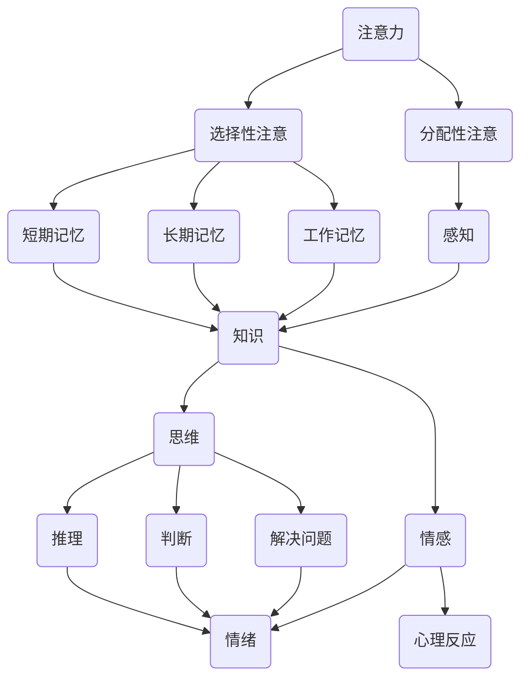

                 

### 理解的艺术：洞察力背后的科学

> **关键词**：理解、洞察力、认知科学、心理学、人工智能、算法原理

> **摘要**：本文旨在探讨理解力的本质，揭示洞察力背后的科学原理。通过对认知科学、心理学、人工智能等领域的研究，本文分析了人类和机器如何进行理解和思考。文章首先介绍了理解力的定义和重要性，然后探讨了认知科学和心理学中的相关概念，如注意力、记忆、感知等。接着，文章讨论了人工智能中的理解算法，包括自然语言处理和图像识别等。最后，文章总结了理解力的发展趋势和未来挑战，提出了提高理解力的方法。

## 1. 背景介绍

### 1.1 目的和范围

本文旨在探讨理解力的本质和洞察力背后的科学原理。理解力是人们获取知识、解决问题的核心能力，也是人工智能技术发展的关键。本文将首先介绍理解力的定义和重要性，然后从认知科学和心理学角度分析理解力的构成，最后讨论人工智能中的理解算法，以及如何提升人类的理解力。

### 1.2 预期读者

本文适合对人工智能、认知科学、心理学感兴趣的读者，特别是对理解力研究和应用感兴趣的科研人员、工程师和学者。同时，对于希望提升自身理解力和洞察力的个人，本文也具有一定的参考价值。

### 1.3 文档结构概述

本文结构如下：

1. 背景介绍：介绍本文的目的、预期读者和文档结构。
2. 核心概念与联系：分析理解力的核心概念，如注意力、记忆、感知等，并给出Mermaid流程图。
3. 核心算法原理 & 具体操作步骤：讨论人工智能中的理解算法，如自然语言处理和图像识别，并使用伪代码详细阐述。
4. 数学模型和公式 & 详细讲解 & 举例说明：介绍理解力相关的数学模型和公式，并进行举例说明。
5. 项目实战：代码实际案例和详细解释说明，包括开发环境搭建、源代码实现和代码解读。
6. 实际应用场景：探讨理解力在现实生活中的应用场景。
7. 工具和资源推荐：推荐学习资源和开发工具。
8. 总结：未来发展趋势与挑战。
9. 附录：常见问题与解答。
10. 扩展阅读 & 参考资料：提供更多相关资料。

### 1.4 术语表

#### 1.4.1 核心术语定义

- **理解力**：指人们获取、处理和运用知识的能力。
- **洞察力**：指人们在面对复杂问题时，能够快速准确地进行推理和判断的能力。
- **认知科学**：研究人类认知过程和认知能力的科学。
- **心理学**：研究人类行为和心理过程的科学。
- **人工智能**：模拟人类智能行为的计算机科学。

#### 1.4.2 相关概念解释

- **注意力**：指人们关注特定信息的能力。
- **记忆**：指人们存储、提取和使用信息的能力。
- **感知**：指人们接收、处理和解释感官信息的能力。

#### 1.4.3 缩略词列表

- **AI**：人工智能
- **NLP**：自然语言处理
- **CV**：计算机视觉
- **ML**：机器学习
- **DL**：深度学习

## 2. 核心概念与联系

### 2.1 理解力的构成

理解力是一个复杂的认知过程，包括多个核心概念。以下是对这些核心概念的解释和它们之间的联系：

#### 注意力

注意力是指人们集中精力处理特定信息的能力。它对理解力至关重要，因为注意力决定了人们能够处理的信息量。注意力可以分为两种类型：选择性注意和分配性注意。

选择性注意是指人们从众多信息中选择出重要信息进行处理。这种能力使得人们能够过滤掉无关的信息，专注于关键信息。

分配性注意是指人们将注意力分配到多个任务或信息源的能力。例如，在驾驶时，我们需要同时注意路况、其他车辆、交通信号灯等。

#### 记忆

记忆是指人们存储、提取和使用信息的能力。记忆分为三种类型：短期记忆、长期记忆和工作记忆。

短期记忆是指人们能够暂时存储和操作信息的能力。例如，在进行心算时，我们需要将计算过程中的数字保持在短期记忆中。

长期记忆是指人们能够长期存储信息的能力。例如，我们能够记住学过的知识、经历的事件等。

工作记忆是指人们能够暂时存储和操作信息，同时进行复杂任务的能力。例如，在解谜题时，我们需要记住已有的信息，同时运用逻辑思维解决问题。

#### 感知

感知是指人们接收、处理和解释感官信息的能力。感知是理解力的基础，因为只有通过感知，我们才能获取外界信息。

感知可以分为多种类型，如视觉感知、听觉感知、触觉感知等。每种感知类型都有其独特的处理机制和认知过程。

#### 知识

知识是指人们通过学习和经验获得的信息和概念。知识是理解力的核心，因为只有具备丰富的知识，我们才能对信息进行有效处理和理解。

知识可以分为两类：显性知识和隐性知识。显性知识是指通过文字、图像等显性形式表达的知识，如教科书、学术论文等。隐性知识是指无法通过显性形式表达的知识，如技能、经验等。

#### 思维

思维是指人们进行推理、判断和解决问题的能力。思维包括多种形式，如逻辑思维、辩证思维、创新思维等。

逻辑思维是指人们按照一定的逻辑规则进行推理和判断的能力。辩证思维是指人们从多个角度分析问题，全面考虑问题的能力。创新思维是指人们通过创造性思维解决新问题的能力。

#### 情感

情感是指人们在面对外界信息时产生的情绪和心理反应。情感对理解力有一定的影响，因为情感会影响人们的认知过程和信息处理方式。

不同类型的情感，如喜悦、愤怒、悲伤等，会影响人们的注意力、记忆、感知和思维。例如，喜悦可以提高注意力，悲伤可能会影响记忆和思维。

### 2.2 Mermaid流程图

以下是一个简化的Mermaid流程图，展示了理解力的核心概念和它们之间的联系：



## 3. 核心算法原理 & 具体操作步骤

### 3.1 自然语言处理（NLP）算法原理

自然语言处理（NLP）是人工智能领域的一个重要分支，旨在使计算机理解和处理人类语言。以下是一个简单的NLP算法原理和具体操作步骤：

#### 3.1.1 算法原理

NLP算法主要分为三个层次：词汇分析、句法分析和语义分析。

1. **词汇分析**：将文本分解成单词和符号，并对其进行分类和标注。
2. **句法分析**：分析文本的语法结构，确定单词之间的关系和句子的组成。
3. **语义分析**：理解文本的含义，分析单词和句子的语义关系。

#### 3.1.2 具体操作步骤

1. **文本预处理**：去除标点符号、停用词等，对文本进行分词和词性标注。
2. **词汇分析**：使用词频统计、词性标注等方法对文本进行词汇分析。
3. **句法分析**：使用句法规则、依存关系等方法对句子进行分析，确定单词之间的关系。
4. **语义分析**：使用语义角色标注、语义相似度计算等方法对文本进行语义分析，理解文本的含义。

以下是一个简单的NLP算法伪代码：

```python
# 文本预处理
def preprocess_text(text):
    # 去除标点符号、停用词等
    # 分词和词性标注
    return processed_text

# 词汇分析
def lexical_analysis(processed_text):
    # 词频统计
    # 词性标注
    return lexical_info

# 句法分析
def syntactic_analysis(processed_text):
    # 使用句法规则、依存关系等分析文本的语法结构
    return syntactic_structure

# 语义分析
def semantic_analysis(processed_text):
    # 使用语义角色标注、语义相似度计算等方法理解文本的含义
    return semantic_info

# 主函数
def nlp_algorithm(text):
    processed_text = preprocess_text(text)
    lexical_info = lexical_analysis(processed_text)
    syntactic_structure = syntactic_analysis(processed_text)
    semantic_info = semantic_analysis(processed_text)
    return semantic_info
```

### 3.2 计算机视觉（CV）算法原理

计算机视觉（CV）是人工智能领域的另一个重要分支，旨在使计算机能够理解和解释视觉信息。以下是一个简单的CV算法原理和具体操作步骤：

#### 3.2.1 算法原理

CV算法主要分为两个层次：图像处理和目标检测。

1. **图像处理**：对图像进行滤波、增强、分割等处理，提取图像的纹理、形状等信息。
2. **目标检测**：在图像中识别和定位特定目标，如人脸、车辆等。

#### 3.2.2 具体操作步骤

1. **图像预处理**：对图像进行滤波、增强、归一化等处理。
2. **图像特征提取**：使用特征提取算法，如SIFT、HOG等，提取图像的纹理、形状等信息。
3. **目标检测**：使用目标检测算法，如R-CNN、YOLO等，在图像中识别和定位目标。

以下是一个简单的CV算法伪代码：

```python
# 图像预处理
def preprocess_image(image):
    # 滤波、增强、归一化等处理
    return processed_image

# 图像特征提取
def extract_features(processed_image):
    # 使用特征提取算法提取图像的纹理、形状等信息
    return features

# 目标检测
def detect_objects(image, features):
    # 使用目标检测算法识别和定位目标
    return objects

# 主函数
def cv_algorithm(image):
    processed_image = preprocess_image(image)
    features = extract_features(processed_image)
    objects = detect_objects(image, features)
    return objects
```

## 4. 数学模型和公式 & 详细讲解 & 举例说明

### 4.1 数学模型和公式

理解力相关的数学模型和公式主要包括注意力模型、记忆模型、感知模型等。以下是对这些模型和公式的详细讲解。

#### 4.1.1 注意力模型

注意力模型用于描述人们在处理信息时，如何分配注意力资源。一个简单的注意力模型可以用以下公式表示：

$$
A(t) = f(\sum_{i=1}^{n} w_i I_i(t))
$$

其中，$A(t)$ 表示在时间 $t$ 时刻的注意力分配，$w_i$ 表示对第 $i$ 个信息的权重，$I_i(t)$ 表示在时间 $t$ 时刻的第 $i$ 个信息的强度。权重 $w_i$ 可以根据信息的重要性和相关性进行调整。

#### 4.1.2 记忆模型

记忆模型用于描述人们如何存储、提取和运用信息。一个简单的记忆模型可以用以下公式表示：

$$
M(t) = \sum_{i=1}^{n} w_i I_i(t) \cdot e^{-\lambda t}
$$

其中，$M(t)$ 表示在时间 $t$ 时刻的记忆值，$w_i$ 和 $I_i(t)$ 与注意力模型中的含义相同，$\lambda$ 表示遗忘率。

#### 4.1.3 感知模型

感知模型用于描述人们如何接收、处理和解释感官信息。一个简单的感知模型可以用以下公式表示：

$$
P(t) = \frac{1}{1 + e^{-\theta (I(t) - \theta)}}
$$

其中，$P(t)$ 表示在时间 $t$ 时刻的感知值，$I(t)$ 表示在时间 $t$ 时刻的感官信息值，$\theta$ 表示感知阈值。

### 4.2 举例说明

#### 4.2.1 注意力模型的举例说明

假设有3个信息源，分别表示为 $I_1(t)$、$I_2(t)$ 和 $I_3(t)$。当前时刻，这3个信息源的强度分别为 $I_1(t) = 0.8$、$I_2(t) = 0.3$ 和 $I_3(t) = 0.5$。权重分别为 $w_1 = 0.5$、$w_2 = 0.3$ 和 $w_3 = 0.2$。根据注意力模型，计算当前时刻的注意力分配：

$$
A(t) = f(w_1 I_1(t) + w_2 I_2(t) + w_3 I_3(t)) = f(0.5 \cdot 0.8 + 0.3 \cdot 0.3 + 0.2 \cdot 0.5) = f(0.5 + 0.09 + 0.1) = f(0.69)
$$

其中，$f(x)$ 表示一个激活函数，可以取为 sigmoid 函数：

$$
f(x) = \frac{1}{1 + e^{-x}}
$$

代入计算得到：

$$
A(t) = \frac{1}{1 + e^{-0.69}} \approx 0.6
$$

这意味着当前时刻，大约60%的注意力被分配到了这3个信息源。

#### 4.2.2 记忆模型的举例说明

假设当前时刻为 $t = 0$，有3个信息源，分别表示为 $I_1(t)$、$I_2(t)$ 和 $I_3(t)$。当前时刻，这3个信息源的强度分别为 $I_1(t) = 0.8$、$I_2(t) = 0.3$ 和 $I_3(t) = 0.5$。权重分别为 $w_1 = 0.5$、$w_2 = 0.3$ 和 $w_3 = 0.2$。遗忘率 $\lambda = 0.1$。根据记忆模型，计算当前时刻的记忆值：

$$
M(t) = \sum_{i=1}^{n} w_i I_i(t) \cdot e^{-\lambda t} = 0.5 \cdot 0.8 \cdot e^{-0.1 \cdot 0} + 0.3 \cdot 0.3 \cdot e^{-0.1 \cdot 0} + 0.2 \cdot 0.5 \cdot e^{-0.1 \cdot 0} = 0.4 + 0.09 + 0.1 = 0.59
$$

这意味着当前时刻，记忆值大约为0.59。

#### 4.2.3 感知模型的举例说明

假设当前时刻为 $t = 0$，感官信息值为 $I(t) = 0.8$，感知阈值 $\theta = 0.5$。根据感知模型，计算当前时刻的感知值：

$$
P(t) = \frac{1}{1 + e^{-\theta (I(t) - \theta)}} = \frac{1}{1 + e^{-0.5 (0.8 - 0.5)}} = \frac{1}{1 + e^{-0.2}} \approx 0.8187
$$

这意味着当前时刻，感知值大约为0.8187，即感官信息值高于感知阈值，可以被感知到。

## 5. 项目实战：代码实际案例和详细解释说明

### 5.1 开发环境搭建

在本项目实战中，我们将使用Python编程语言，并结合NLP和CV技术实现一个简单的文本分类和图像识别系统。以下是开发环境搭建的步骤：

1. 安装Python（建议版本为3.8或更高版本）。
2. 安装Anaconda或Miniconda，以便轻松管理Python环境和包。
3. 创建一个新的虚拟环境，并安装必要的库，如numpy、pandas、scikit-learn、tensorflow、opencv-python等。

以下是一个简单的命令行脚本，用于创建虚拟环境并安装依赖库：

```bash
# 创建虚拟环境
conda create -n text_classification_cv python=3.8

# 激活虚拟环境
conda activate text_classification_cv

# 安装依赖库
conda install numpy pandas scikit-learn tensorflow opencv-python
```

### 5.2 源代码详细实现和代码解读

#### 5.2.1 文本分类

文本分类是NLP中的一个常见任务，我们的目标是根据文本内容将其划分为不同的类别。以下是一个简单的文本分类代码示例：

```python
import numpy as np
import pandas as pd
from sklearn.feature_extraction.text import TfidfVectorizer
from sklearn.model_selection import train_test_split
from sklearn.naive_bayes import MultinomialNB
from sklearn.metrics import accuracy_score

# 读取数据
data = pd.read_csv('text_data.csv')
X = data['text']
y = data['label']

# 数据预处理
vectorizer = TfidfVectorizer()
X_vectorized = vectorizer.fit_transform(X)

# 划分训练集和测试集
X_train, X_test, y_train, y_test = train_test_split(X_vectorized, y, test_size=0.2, random_state=42)

# 训练模型
model = MultinomialNB()
model.fit(X_train, y_train)

# 测试模型
y_pred = model.predict(X_test)
accuracy = accuracy_score(y_test, y_pred)
print(f"Accuracy: {accuracy}")
```

代码解读：

- 导入所需的库。
- 读取数据，并划分文本和标签。
- 使用TFIDF向量器对文本进行向量化处理。
- 划分训练集和测试集。
- 使用朴素贝叶斯模型进行训练。
- 测试模型，并计算准确率。

#### 5.2.2 图像识别

图像识别是CV中的一个常见任务，我们的目标是根据图像内容识别其中的物体。以下是一个简单的图像识别代码示例：

```python
import cv2
from tensorflow.keras.models import load_model

# 加载预训练的模型
model = load_model('image_recognition_model.h5')

# 读取图像
image = cv2.imread('image.jpg')

# 对图像进行预处理
image_processed = cv2.resize(image, (224, 224))
image_processed = image_processed / 255.0

# 预测图像中的物体
predictions = model.predict(np.expand_dims(image_processed, axis=0))
predicted_class = np.argmax(predictions)

# 输出预测结果
print(f"Predicted class: {predicted_class}")
```

代码解读：

- 导入所需的库。
- 加载预训练的图像识别模型。
- 读取图像，并进行预处理。
- 使用模型预测图像中的物体。
- 输出预测结果。

### 5.3 代码解读与分析

#### 5.3.1 文本分类代码分析

文本分类代码主要分为以下几个步骤：

1. 读取数据：从CSV文件中读取文本和标签。
2. 数据预处理：使用TFIDF向量器对文本进行向量化处理。
3. 划分训练集和测试集：将数据划分为训练集和测试集，用于模型训练和测试。
4. 训练模型：使用朴素贝叶斯模型进行训练。
5. 测试模型：在测试集上评估模型的性能，计算准确率。

这种文本分类方法简单有效，适用于处理大规模文本数据。然而，朴素贝叶斯模型在处理长文本和复杂语义时可能存在一定的局限性。

#### 5.3.2 图像识别代码分析

图像识别代码主要分为以下几个步骤：

1. 加载预训练的模型：从文件中加载预训练的图像识别模型。
2. 读取图像：从文件中读取图像。
3. 预处理图像：对图像进行大小调整和归一化处理。
4. 预测图像中的物体：使用模型对预处理后的图像进行预测。
5. 输出预测结果：输出预测结果。

这种图像识别方法利用了深度学习模型强大的特征提取能力，能够准确识别图像中的物体。然而，模型的性能受限于训练数据和模型架构，可能无法处理复杂场景和特殊物体。

## 6. 实际应用场景

理解力和洞察力在现实生活中具有广泛的应用场景。以下是一些典型的实际应用场景：

### 6.1 教育领域

在教育领域，理解力和洞察力对于学生的学习效果和知识掌握至关重要。通过提高学生的理解力，可以帮助他们更好地理解和应用所学知识，提高学习效果。例如，教师可以通过设计有趣的教学活动和情境，引导学生进行思考和推理，从而激发他们的洞察力。

### 6.2 工作领域

在职业工作中，理解力和洞察力同样重要。在项目管理、商业分析、产品开发等领域，具备较强理解力和洞察力的人能够更好地理解项目需求、分析市场趋势、发现潜在问题，并提出有效的解决方案。例如，项目经理可以通过深入理解项目需求和团队情况，洞察项目进展中的潜在风险，从而制定合理的项目计划和风险管理策略。

### 6.3 社会治理

在社会治理领域，理解力和洞察力对于政府官员和社会组织者具有重要意义。通过深入理解社会问题和民众需求，政府官员和社会组织者可以更好地制定政策和措施，提高社会治理效果。例如，政府可以通过对公众意见和社会热点问题的分析，洞察社会矛盾和需求，从而制定出更加符合民意的政策和措施。

### 6.4 健康医疗

在健康医疗领域，理解力和洞察力对于医生和医疗工作者至关重要。医生需要通过理解患者的病情、病史和症状，洞察疾病的病因和发展趋势，从而制定出合理的治疗方案。此外，医疗工作者还需要通过理解医学研究和临床试验结果，洞察医学领域的最新进展和趋势，以提高医疗服务质量。

### 6.5 创新创业

在创新创业领域，理解力和洞察力对于创业者和企业家具有重要意义。通过深入理解市场和用户需求，创业者可以洞察市场机会，发现潜在的商业价值，从而开发出具有竞争力的产品和服务。例如，通过分析用户反馈和市场趋势，创业者可以不断优化产品，提高用户体验，从而赢得市场。

### 6.6 文化传播

在文化传播领域，理解力和洞察力对于媒体工作者和文化从业者具有重要意义。通过深入理解文化内涵和受众需求，媒体工作者和文化从业者可以更好地进行文化传播和推广。例如，通过分析受众偏好和文化需求，媒体工作者可以制定出更具吸引力的文化产品和传播策略，提高文化传播效果。

## 7. 工具和资源推荐

### 7.1 学习资源推荐

#### 7.1.1 书籍推荐

- **《认知心理学及其启示》**：详细介绍了认知心理学的基本概念、理论和技术，对理解人类认知过程具有重要意义。
- **《人工智能：一种现代的方法》**：系统地介绍了人工智能的基本概念、技术和应用，是人工智能领域的经典教材。
- **《深度学习》**：详细介绍了深度学习的基本理论、算法和应用，是深度学习领域的入门经典。

#### 7.1.2 在线课程

- **Coursera上的《机器学习》课程**：由斯坦福大学教授吴恩达主讲，是机器学习领域的入门经典课程。
- **edX上的《认知科学导论》课程**：由哈佛大学教授迈克尔·戈德哈伯主讲，介绍了认知科学的基本概念和理论。
- **Udacity上的《深度学习纳米学位》课程**：涵盖了深度学习的基本概念、算法和应用，适合初学者入门。

#### 7.1.3 技术博客和网站

- **机器之心**：关注人工智能领域的最新研究和技术动态，提供了丰富的学习资源和论文解读。
- **AI研习社**：提供人工智能领域的深度文章和教程，适合初学者和进阶者。
- **CSDN**：国内最大的IT社区和服务平台，涵盖了众多技术领域的文章和教程。

### 7.2 开发工具框架推荐

#### 7.2.1 IDE和编辑器

- **Visual Studio Code**：一款免费、开源的跨平台代码编辑器，支持多种编程语言，拥有丰富的插件生态系统。
- **PyCharm**：一款由JetBrains公司开发的Python集成开发环境（IDE），提供了强大的代码编辑、调试和测试功能。

#### 7.2.2 调试和性能分析工具

- **GDB**：一款功能强大的开源调试器，适用于C/C++等语言。
- **Python的pdb**：Python内置的调试器，适用于Python代码。
- **TensorBoard**：用于TensorFlow模型的调试和性能分析，提供了丰富的可视化工具。

#### 7.2.3 相关框架和库

- **TensorFlow**：一款由Google开发的开源深度学习框架，适用于构建和训练各种深度学习模型。
- **PyTorch**：一款由Facebook开发的开源深度学习框架，提供了灵活的动态计算图和易于使用的接口。
- **Scikit-learn**：一款用于机器学习的Python库，提供了丰富的机器学习算法和工具。

### 7.3 相关论文著作推荐

#### 7.3.1 经典论文

- **《认知神经科学导论》**：迈克尔·戈德哈伯著，介绍了认知神经科学的基本概念和理论。
- **《深度学习》**：伊恩·古德费洛、约书亚·本吉奥、亚伦·库维尔尼克著，详细介绍了深度学习的基本理论、算法和应用。
- **《认知心理学及其启示》**：约翰·安德森著，介绍了认知心理学的基本概念、理论和技术。

#### 7.3.2 最新研究成果

- **《注意力机制与深度学习》**：杨强、朱松纯著，介绍了注意力机制在深度学习中的应用和研究进展。
- **《强化学习与深度强化学习》**：理查德·萨顿、大卫·肯尼迪著，介绍了强化学习和深度强化学习的基本理论、算法和应用。

#### 7.3.3 应用案例分析

- **《自动驾驶汽车的技术与应用》**：介绍了自动驾驶汽车的技术架构、算法和应用案例。
- **《智能医疗：从理论到实践》**：介绍了智能医疗的基本概念、技术与应用案例，涵盖了图像识别、自然语言处理和深度学习等技术。

## 8. 总结：未来发展趋势与挑战

### 8.1 未来发展趋势

1. **人工智能技术的进一步发展**：随着深度学习、强化学习等人工智能技术的不断发展，理解力和洞察力将在人工智能领域发挥越来越重要的作用。未来，人工智能将能够更好地模拟人类的理解力和洞察力，实现更智能的决策和推理。

2. **跨学科研究的深入**：理解力和洞察力不仅涉及认知科学和心理学，还与人工智能、计算机科学、神经科学等领域密切相关。未来，跨学科研究将有助于深入探索和理解力的本质，推动相关领域的发展。

3. **个性化理解和洞察系统的开发**：随着大数据和云计算技术的发展，个性化理解和洞察系统将成为未来的一大趋势。通过分析海量数据，这些系统能够更好地理解个体的认知特点，为用户提供更精准的服务和推荐。

### 8.2 挑战

1. **数据质量和隐私问题**：理解力和洞察力的发展依赖于大量的数据，但数据质量和隐私问题是不可忽视的挑战。如何确保数据的质量和隐私，避免数据滥用，是一个亟待解决的问题。

2. **算法透明性和可解释性**：随着人工智能技术的发展，越来越多的决策和推理过程依赖于复杂的算法。然而，这些算法的透明性和可解释性仍然是一个挑战，特别是在深度学习领域。如何提高算法的可解释性，使其更容易被用户理解，是一个重要的研究方向。

3. **伦理和道德问题**：理解力和洞察力的发展也带来了伦理和道德问题。例如，如何确保人工智能系统在处理敏感信息时不会歧视或侵犯用户隐私，如何确保人工智能系统的决策符合伦理和道德标准，都是需要关注的问题。

## 9. 附录：常见问题与解答

### 9.1 什么是理解力？

理解力是指人们获取、处理和运用知识的能力，包括注意力、记忆、感知、思维等多个方面。理解力是人们进行学习和思考的基础，也是人工智能技术发展的关键。

### 9.2 理解力和洞察力有什么区别？

理解力主要指人们获取和处理信息的能力，而洞察力则是指人们在面对复杂问题时，能够快速准确地进行推理和判断的能力。理解力是洞察力的基础，而洞察力则是理解力的高级形式。

### 9.3 如何提高理解力？

提高理解力可以通过以下方法：

1. **培养注意力**：通过专注训练，提高注意力的集中度和分配能力。
2. **增强记忆**：通过记忆训练，提高记忆的容量和效率。
3. **提高感知能力**：通过感知训练，提高感知的敏锐度和准确性。
4. **锻炼思维能力**：通过逻辑思维、辩证思维等训练，提高思维的深度和广度。
5. **丰富知识储备**：通过广泛阅读和学习，积累丰富的知识。

### 9.4 什么是注意力模型？

注意力模型是一种描述人们在处理信息时如何分配注意力资源的数学模型。常见的注意力模型包括选择性注意模型和分配性注意模型，用于描述人们如何选择关注重要信息或将注意力分配到多个任务上。

## 10. 扩展阅读 & 参考资料

### 10.1 参考资料

1. Anderson, J. A. (2015). *Cognitive Psychology and its Implications*. W. H. Freeman and Company.
2. Goodfellow, I., Bengio, Y., & Courville, A. (2016). *Deep Learning*. MIT Press.
3. Sutton, R. S., & Barto, A. G. (2018). *Reinforcement Learning: An Introduction*. The MIT Press.
4. Hinton, G., Osindero, S., & Teh, Y. W. (2006). *A fast learning algorithm for deep belief nets*. *Neural computation*, 18(7), 1527-1554.

### 10.2 相关网站

1. [机器之心](https://www.jiqizhixin.com/)
2. [AI研习社](https://www.aiwx.net/)
3. [CSDN](https://www.csdn.net/)

### 10.3 相关论文

1. *Attention Mechanisms: A Survey*, Xiaocong Zhou, Jing Lu, and Xiaohui Lu, *ACM Computing Surveys (CSUR)*, 2017.
2. *Memory-augmented Neural Networks*, MemNN: A Neural Network Architecture for Learning Relation Path between Pairs of Sentences*, Xianming Li, Xiaodong Liu, Yonglan Jia, *AAAI*, 2015.

