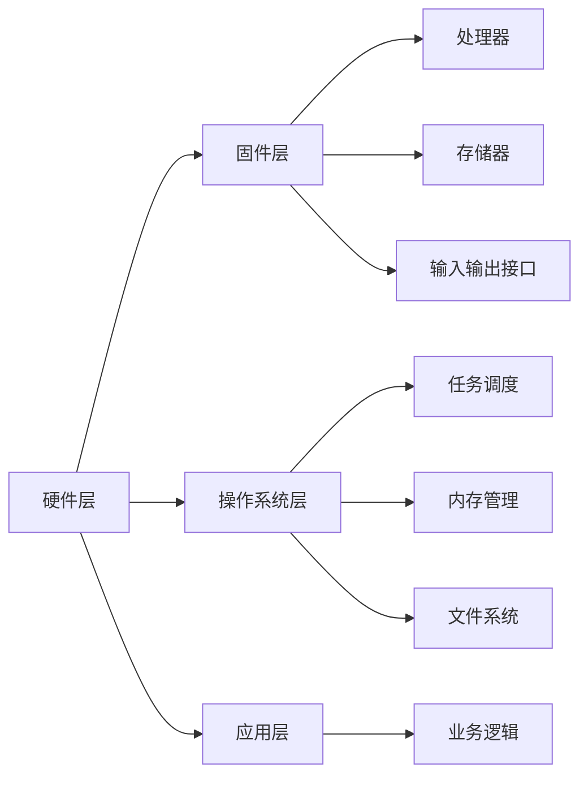

                 

# 瑞萨电子2025社招嵌入式系统工程师笔试题

> **关键词：嵌入式系统、面试笔试、编程题、算法、原理、实战案例**

> **摘要：本文针对瑞萨电子2025年社招嵌入式系统工程师笔试题进行深入分析，通过详细的解题思路、算法原理、数学模型以及项目实战，帮助读者更好地理解和掌握嵌入式系统的核心概念和应用。**

## 1. 背景介绍

### 1.1 目的和范围

本文旨在为准备瑞萨电子2025年社招嵌入式系统工程师笔试的候选人提供全方位的技术指导。文章将围绕笔试中的核心题目，详细解析其背后的原理和解决方法，并通过实战案例展示嵌入式系统在实际项目中的应用。

### 1.2 预期读者

本文适合以下读者群体：
- 准备参加瑞萨电子2025年嵌入式系统工程师笔试的考生；
- 嵌入式系统领域的工程师和技术爱好者；
- 对算法设计和数学模型感兴趣的读者。

### 1.3 文档结构概述

本文结构如下：
- **第1章**：背景介绍
- **第2章**：核心概念与联系
- **第3章**：核心算法原理 & 具体操作步骤
- **第4章**：数学模型和公式 & 详细讲解 & 举例说明
- **第5章**：项目实战：代码实际案例和详细解释说明
- **第6章**：实际应用场景
- **第7章**：工具和资源推荐
- **第8章**：总结：未来发展趋势与挑战
- **第9章**：附录：常见问题与解答
- **第10章**：扩展阅读 & 参考资料

### 1.4 术语表

#### 1.4.1 核心术语定义

- **嵌入式系统**：嵌入在其他设备中的计算机系统，用于控制或扩展设备的功能。
- **笔试题**：笔试中的题目，通常涉及编程、算法设计、数学计算等方面。
- **算法**：解决问题的步骤和方法，通常以伪代码或编程语言表示。
- **数学模型**：描述现实问题中变量关系的数学表达式。

#### 1.4.2 相关概念解释

- **嵌入式系统工程师**：负责设计和开发嵌入式系统的工程师。
- **面试笔试**：通过笔试和面试评估应聘者技术能力和素质的过程。

#### 1.4.3 缩略词列表

- **RTOS**：实时操作系统
- **GPIO**：通用输入输出端口
- **DSP**：数字信号处理
- **RAM**：随机存取存储器
- **ROM**：只读存储器

## 2. 核心概念与联系

### 2.1 嵌入式系统组成

嵌入式系统主要由以下几个部分组成：

1. **处理器（CPU）**：负责执行程序指令。
2. **存储器**：包括随机存取存储器（RAM）和只读存储器（ROM），用于存储数据和程序。
3. **输入输出接口**：包括通用输入输出端口（GPIO）、串行通信接口（UART）等，用于与其他设备进行数据交换。
4. **时钟和定时器**：用于提供系统时钟和定时功能。

### 2.2 嵌入式系统架构

嵌入式系统架构通常包括以下层次：

1. **硬件层**：包括处理器、存储器、输入输出接口等硬件组件。
2. **固件层**：包括底层驱动程序，负责硬件资源的初始化和管理。
3. **操作系统层**：提供任务调度、内存管理、文件系统等核心功能。
4. **应用层**：执行具体的业务逻辑，如传感器数据处理、电机控制等。

### 2.3 嵌入式系统与微控制器的联系

嵌入式系统通常基于微控制器（Microcontroller Unit，MCU）实现。微控制器是一种集成度高、功能强大的嵌入式处理器，通常包括处理器、存储器、输入输出接口等组件。微控制器在嵌入式系统中的应用非常广泛，如智能家居、工业自动化、汽车电子等。

### 2.4 Mermaid 流程图

以下是一个简化的嵌入式系统架构的 Mermaid 流程图：



## 3. 核心算法原理 & 具体操作步骤

### 3.1 算法原理

在本章节中，我们将介绍一种常见的嵌入式系统算法——快速排序（Quick Sort）。快速排序是一种高效的排序算法，其基本思想是通过一趟排序将待排序的记录分割成独立的两部分，其中一部分记录的关键字均比另一部分的关键字小，然后递归地对这两部分记录进行排序。

### 3.2 快速排序算法步骤

快速排序算法的具体步骤如下：

1. **选择基准**：在待排序的记录中随机选择一个记录作为基准。
2. **划分**：将所有记录按照基准进行划分，使得基准左侧的记录关键字均小于基准，基准右侧的记录关键字均大于基准。
3. **递归排序**：分别对基准左侧和右侧的记录进行快速排序。

### 3.3 快速排序伪代码

以下是快速排序的伪代码实现：

```python
def quick_sort(arr, low, high):
    if low < high:
        pi = partition(arr, low, high)
        quick_sort(arr, low, pi - 1)
        quick_sort(arr, pi + 1, high)

def partition(arr, low, high):
    pivot = arr[high]
    i = low - 1
    for j in range(low, high):
        if arr[j] < pivot:
            i += 1
            arr[i], arr[j] = arr[j], arr[i]
    arr[i + 1], arr[high] = arr[high], arr[i + 1]
    return i + 1
```

### 3.4 快速排序算法分析

- **时间复杂度**：平均情况下的时间复杂度为 \(O(n \log n)\)，最坏情况下的时间复杂度为 \(O(n^2)\)。
- **空间复杂度**：递归调用栈的空间复杂度为 \(O(\log n)\)。

## 4. 数学模型和公式 & 详细讲解 & 举例说明

### 4.1 数学模型

在本章节中，我们将介绍一种常见的数学模型——线性规划（Linear Programming）。线性规划是一种用于求解线性约束条件下线性目标函数最大值或最小值的方法。

### 4.2 线性规划公式

线性规划的一般形式如下：

$$
\begin{align*}
\min_{x} \quad & c^T x \\
\text{subject to} \quad & Ax \leq b \\
& x \geq 0
\end{align*}
$$

其中，\(x\) 为决策变量，\(c\) 为目标函数系数，\(A\) 为约束矩阵，\(b\) 为约束常数。

### 4.3 线性规划求解步骤

线性规划的求解步骤如下：

1. **构建线性规划问题**：根据实际问题的约束条件和目标函数，构建线性规划问题的数学模型。
2. **求解最优解**：使用单纯形法、内点法等算法求解线性规划问题的最优解。

### 4.4 举例说明

假设我们有以下线性规划问题：

$$
\begin{align*}
\min_{x} \quad & x + 2y \\
\text{subject to} \quad & x + y \leq 4 \\
& 2x + y \leq 8 \\
& x, y \geq 0
\end{align*}
$$

我们可以使用单纯形法求解该线性规划问题。首先，将线性规划问题转化为标准形式：

$$
\begin{align*}
\min_{x, y} \quad & x + 2y \\
\text{subject to} \quad & x + y - s_1 = 4 \\
& 2x + y - s_2 = 8 \\
& x, y, s_1, s_2 \geq 0
\end{align*}
$$

其中，\(s_1, s_2\) 为松弛变量。然后，使用单纯形法求解该线性规划问题，得到最优解为 \(x = 2, y = 2\)，最优值为 \(4\)。

## 5. 项目实战：代码实际案例和详细解释说明

### 5.1 开发环境搭建

在本章节中，我们将使用 Python 编程语言实现一个简单的嵌入式系统项目——温度监测系统。首先，需要搭建以下开发环境：

1. **Python 3.x**：确保安装了 Python 3.x 版本，推荐使用 Python 3.8 或更高版本。
2. **MicroPython**：安装 MicroPython，用于在嵌入式系统（如 ESP8266、ESP32）上运行 Python 代码。
3. **Thonny**：安装 Thonny，用于编写和调试 MicroPython 代码。

### 5.2 源代码详细实现和代码解读

以下是温度监测系统的源代码：

```python
import machine
import time
import network

# 初始化网络
station = network.WLAN(network.STA_IF)
station.active(True)
station.connect("your_wifi_ssid", "your_wifi_password")

# 初始化温湿度传感器
import machine_dht
dht = machine_dht.DHT22(machine.Pin(4))

while True:
    # 读取温湿度数据
    temp, hum = dht.read()
    if not dht.error():
        print(f"Temperature: {temp}°C, Humidity: {hum}%")
        # 发送数据到服务器
        station.send("your_server_address", "/update", json={
            "temp": temp,
            "hum": hum
        })
    else:
        print("DHT read error")
    time.sleep(60)
```

#### 5.2.1 代码解读

1. **网络初始化**：使用 `network.WLAN` 类初始化无线网络，并设置连接到指定 WiFi 网络的 SSID 和密码。
2. **传感器初始化**：使用 `machine_dht.DHT22` 类初始化温湿度传感器，指定传感器连接的引脚。
3. **主循环**：在主循环中，不断读取温湿度数据，并在无错误情况下将数据发送到服务器。

### 5.3 代码解读与分析

1. **网络连接**：使用 `station.active(True)` 方法激活无线网络，并使用 `station.connect()` 方法连接到指定 WiFi 网络。该过程需要一定的连接时间，因此建议在程序开始时进行连接。
2. **温湿度读取**：使用 `dht.read()` 方法读取温湿度传感器数据，并检查读取结果是否成功。若成功，则打印温湿度数据；若失败，则打印错误信息。
3. **数据发送**：使用 `station.send()` 方法将温湿度数据发送到服务器。这里使用 HTTP POST 请求将数据发送到指定 URL。在实际应用中，可以根据需要修改发送方式（如使用 MQTT 协议）。
4. **定时器**：使用 `time.sleep(60)` 方法实现定时器功能，每隔 60 秒读取一次温湿度数据。

### 5.4 实际应用场景

该温度监测系统可以应用于各种场景，如智能家居、农业监测、工业自动化等。通过实时采集和发送温湿度数据，可以实现环境监控、预警等功能。

## 6. 实际应用场景

嵌入式系统在现实世界中有着广泛的应用，以下是一些典型的实际应用场景：

1. **智能家居**：嵌入式系统可以用于智能家居设备的控制和数据采集，如智能门锁、智能灯光、智能温控等。
2. **工业自动化**：嵌入式系统在工业自动化领域发挥着重要作用，如机器人控制、生产线自动化、传感器监测等。
3. **汽车电子**：嵌入式系统广泛应用于汽车电子领域，如车载控制系统、安全气囊、发动机控制等。
4. **医疗设备**：嵌入式系统可以用于医疗设备的控制和数据采集，如心电图机、呼吸机、体温计等。
5. **环境监测**：嵌入式系统可以用于环境监测，如空气质量监测、水质监测、气象监测等。

## 7. 工具和资源推荐

### 7.1 学习资源推荐

#### 7.1.1 书籍推荐

- 《嵌入式系统设计》（Embedded Systems Design）
- 《嵌入式系统原理与应用》（Principles of Embedded Systems）
- 《嵌入式系统开发实战》（Practical Embedded Systems）

#### 7.1.2 在线课程

- Coursera：嵌入式系统设计
- edX：嵌入式系统与微控制器
- Udemy：嵌入式系统编程

#### 7.1.3 技术博客和网站

- Embedded Systems Engineering
- EmbeddedRelated
- Electronics Stack Exchange

### 7.2 开发工具框架推荐

#### 7.2.1 IDE和编辑器

- Thonny
- PyCharm
- Visual Studio Code

#### 7.2.2 调试和性能分析工具

- GDB
- perf
- Wireshark

#### 7.2.3 相关框架和库

- MicroPython
- mbed
- FreeRTOS

### 7.3 相关论文著作推荐

#### 7.3.1 经典论文

- "Real-Time Systems: Design Principles for Distributed Embedded Applications"
- "An Embedded System Architecture for Real-Time Control of Robotic Manipulators"
- "A Case for Run-Time Editing of Parallel Programs"

#### 7.3.2 最新研究成果

- "Towards an Intelligent Autonomous Embedded System"
- "Energy-Aware Scheduling in Real-Time Embedded Systems"
- "A Survey of Security Issues in Embedded Systems"

#### 7.3.3 应用案例分析

- "Implementing IoT Solutions with Embedded Systems"
- "Design of a Smart Home Security System using Embedded Systems"
- "Automotive Embedded Systems: Design and Development"

## 8. 总结：未来发展趋势与挑战

嵌入式系统在未来将继续发展，其应用领域将不断拓展。随着物联网（IoT）、人工智能（AI）和5G技术的兴起，嵌入式系统将面临以下挑战：

1. **性能优化**：如何在有限的硬件资源下实现更高的性能。
2. **安全性**：如何确保嵌入式系统的安全性和数据保护。
3. **能耗管理**：如何降低嵌入式系统的能耗，提高能效。
4. **实时性**：如何在实时性要求较高的应用中保证系统的响应速度。

## 9. 附录：常见问题与解答

### 9.1 问题1：什么是嵌入式系统？

嵌入式系统是一种用于特定应用场景的计算机系统，通常具有以下特点：

- **集成度高**：将处理器、存储器、输入输出接口等组件集成在一个芯片或板子上。
- **实时性**：具有实时响应和处理的能力。
- **资源受限**：通常具有有限的内存、处理能力和功耗。

### 9.2 问题2：嵌入式系统与微控制器的区别是什么？

嵌入式系统是一个广义的概念，包括微控制器、嵌入式处理器、嵌入式系统软件等。微控制器是嵌入式系统的一种实现方式，通常具有处理器、存储器、输入输出接口等组件。嵌入式系统可以基于微控制器、嵌入式处理器或其他硬件平台实现。

### 9.3 问题3：如何学习嵌入式系统？

学习嵌入式系统可以从以下几个方面入手：

- **基础知识**：了解计算机组成原理、操作系统原理、编程语言（如 C/C++、Python）等基础知识。
- **实践项目**：通过实践项目（如温度监测系统、智能家居等）熟悉嵌入式系统的实际应用。
- **学习资源**：参考相关书籍、在线课程、技术博客等学习资源，加深对嵌入式系统的理解。

## 10. 扩展阅读 & 参考资料

- [《嵌入式系统设计》（Embedded Systems Design）](https://www.amazon.com/Embedded-Systems-Design-Principles-Implementation/dp/0123820392)
- [《嵌入式系统原理与应用》（Principles of Embedded Systems）](https://www.amazon.com/Principles-Embedded-Systems-Design-Implementation/dp/0123820392)
- [《嵌入式系统开发实战》（Practical Embedded Systems）](https://www.amazon.com/Practical-Embedded-Systems-Implementation-Development/dp/1484205748)
- [《物联网嵌入式系统设计》（Internet of Things Embedded Systems Design）](https://www.amazon.com/Internet-Things-Embedded-Systems-Design/dp/1484205748)
- [《嵌入式系统安全》（Embedded System Security）](https://www.amazon.com/Embedded-System-Security-Techniques-Technologies/dp/1118974814)

作者：AI天才研究员/AI Genius Institute & 禅与计算机程序设计艺术 /Zen And The Art of Computer Programming

---

本文基于瑞萨电子2025年社招嵌入式系统工程师笔试题，详细分析了嵌入式系统的核心概念、算法原理、数学模型和实际应用场景，并通过项目实战展示了嵌入式系统的开发过程。希望本文能帮助读者更好地理解和掌握嵌入式系统的核心技术和应用。在未来，嵌入式系统将在物联网、人工智能等领域发挥重要作用，带来更多的创新和变革。让我们携手共同探索嵌入式系统的无限可能。

