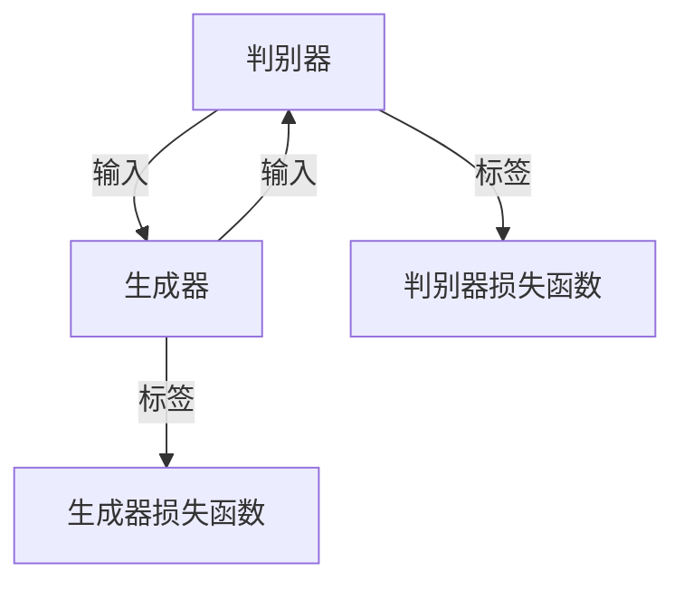

                 

### 1. 背景介绍

#### 1.1 目的和范围

本文的目的是深入讲解生成对抗网络（Generative Adversarial Networks，简称GAN）的原理与实际应用。GAN是近年来人工智能领域的一个重要突破，它在图像生成、自然语言处理、视频生成等方面展示了强大的潜力。本文将通过详尽的原理分析、数学推导和实际代码实例，帮助读者理解GAN的工作机制，掌握GAN的核心算法和具体实现步骤。

本文将涵盖以下内容：

1. **核心概念与联系**：介绍GAN的基本概念和核心组成部分，通过Mermaid流程图展示GAN的整体架构。
2. **核心算法原理**：详细解析GAN的生成器和判别器的算法原理，使用伪代码逐步阐述GAN的训练过程。
3. **数学模型和公式**：深入讲解GAN的损失函数、梯度计算等数学模型，并通过具体例子说明。
4. **项目实战**：提供实际代码案例，讲解如何搭建GAN开发环境，实现代码的具体步骤，并进行代码解读与分析。
5. **实际应用场景**：探讨GAN在不同领域的实际应用，如图像生成、视频生成、自然语言处理等。
6. **工具和资源推荐**：推荐学习资源、开发工具框架以及相关论文著作。
7. **总结与展望**：总结GAN的发展趋势和面临的挑战，展望未来研究方向。

#### 1.2 预期读者

本文主要面向以下读者：

- 对人工智能和深度学习有一定了解，希望深入了解GAN原理的读者；
- 想要在图像处理、自然语言处理等领域应用GAN的工程师和研究人员；
- 希望掌握GAN实战技能，提升自己在AI领域竞争力的开发者；
- 对计算机科学和数学有浓厚兴趣，希望学习前沿技术的学生和学者。

#### 1.3 文档结构概述

本文结构如下：

1. **背景介绍**：本文目的、范围、预期读者和文档结构概述。
2. **核心概念与联系**：介绍GAN的基本概念和组成部分，展示GAN架构。
3. **核心算法原理**：详细解析GAN的生成器和判别器的算法原理。
4. **数学模型和公式**：深入讲解GAN的数学模型和公式，通过例子说明。
5. **项目实战**：提供实际代码案例，讲解GAN的具体实现。
6. **实际应用场景**：探讨GAN在不同领域的应用。
7. **工具和资源推荐**：推荐学习资源、开发工具框架和相关论文。
8. **总结与展望**：总结GAN的发展趋势和挑战，展望未来研究方向。
9. **附录**：常见问题与解答。
10. **扩展阅读与参考资料**：提供更多相关阅读资源。

通过以上结构，本文旨在从理论到实践，全面深入地讲解GAN，帮助读者掌握GAN的核心知识和应用技巧。

#### 1.4 术语表

为了确保读者能够顺利理解本文的内容，下面列出了一些关键术语的定义和解释。

##### 1.4.1 核心术语定义

- **生成对抗网络（GAN）**：一种由生成器和判别器组成的深度学习框架，用于通过对抗训练生成逼真的数据。
- **生成器（Generator）**：GAN中的一个神经网络，其目的是生成与真实数据相似的新数据。
- **判别器（Discriminator）**：GAN中的另一个神经网络，其目的是区分生成数据和真实数据。
- **对抗训练（Adversarial Training）**：生成器和判别器通过相互竞争的方式训练，以达到生成器和判别器性能的最优化。
- **损失函数（Loss Function）**：用于衡量生成器和判别器性能的数学表达式。
- **梯度下降（Gradient Descent）**：一种优化算法，用于调整神经网络权重，以最小化损失函数。

##### 1.4.2 相关概念解释

- **深度学习（Deep Learning）**：一种机器学习技术，使用具有多个隐藏层的神经网络进行数据建模。
- **反向传播（Backpropagation）**：一种计算神经网络梯度的方法，用于优化网络参数。
- **批量大小（Batch Size）**：在一次训练过程中用于计算梯度的一个数据子集的大小。
- **随机梯度下降（Stochastic Gradient Descent，SGD）**：一种梯度下降的变种，每次迭代只使用一个样本计算梯度。
- **批量归一化（Batch Normalization）**：一种技术，用于加速神经网络的训练并提高其稳定性。

##### 1.4.3 缩略词列表

- **GAN**：生成对抗网络（Generative Adversarial Networks）
- **D**：判别器（Discriminator）
- **G**：生成器（Generator）
- **SGD**：随机梯度下降（Stochastic Gradient Descent）
- **ReLU**：矩形线性单元（Rectified Linear Unit）
- **ReLU6**：ReLU激活函数的改进版本，输出范围为0到6
- **CE**：交叉熵（Cross Entropy）

通过上述术语表，读者可以更好地理解本文中涉及的专业术语和概念，为后续内容的阅读和理解打下坚实基础。

### 2. 核心概念与联系

在深入探讨生成对抗网络（GAN）之前，理解其核心概念和组成部分至关重要。GAN由生成器（Generator）和判别器（Discriminator）两部分组成，两者通过对抗训练相互竞争，以达到生成逼真数据的最终目标。

首先，我们来看生成对抗网络的架构。

#### 2.1 GAN架构

生成对抗网络的架构可以用以下Mermaid流程图来表示：



在这个图中，**生成器（G）** 和 **判别器（D）** 之间形成一个循环，生成器试图生成逼真的数据，而判别器则试图区分生成数据和真实数据。两者的损失函数分别用于评估它们的性能。

接下来，我们将逐一介绍GAN的核心概念：

##### 2.2 生成器（Generator）

生成器的目的是生成与真实数据相似的新数据。它通常是一个深度神经网络，能够接收随机噪声作为输入，通过多层变换生成模拟数据。生成器的网络结构可以是卷积神经网络（CNN）或递归神经网络（RNN），具体取决于生成数据的类型。以下是一个生成器的简化伪代码：

```python
# 生成器伪代码
z = RandomNoise() # 生成随机噪声
x_g = Generator(z) # 使用生成器生成模拟数据
```

##### 2.3 判别器（Discriminator）

判别器的目的是区分输入数据是真实数据还是生成数据。它也是一个深度神经网络，通常使用与生成器相似的架构。判别器接收输入数据，并输出一个概率值，表示输入数据是真实数据的置信度。以下是一个判别器的简化伪代码：

```python
# 判别器伪代码
x = RealData() # 输入真实数据
prob = Discriminator(x) # 输出生成数据的置信度
```

##### 2.4 对抗训练（Adversarial Training）

GAN的训练过程被称为对抗训练，这是一种特殊的训练方法，通过两个相互竞争的神经网络来实现。具体步骤如下：

1. **生成器训练**：在生成器训练过程中，生成器试图生成尽可能逼真的数据，以欺骗判别器。
2. **判别器训练**：在判别器训练过程中，判别器试图区分生成数据和真实数据，提高其判别能力。
3. **交替训练**：生成器和判别器交替训练，生成器尝试欺骗判别器，而判别器则努力识别生成数据。

##### 2.5 损失函数

生成对抗网络的损失函数用于衡量生成器和判别器的性能。主要涉及以下两个损失函数：

1. **生成器损失函数**：生成器的损失函数通常是基于判别器的输出概率计算的。其目标是最大化判别器对生成数据的判断为真实数据的概率。伪代码如下：

   ```python
   # 生成器损失函数伪代码
   loss_G = -torch.mean(D(G(z)) * Label)
   ```

   其中，`D(G(z))`表示判别器对生成数据的输出概率，`Label`是一个向量，其中所有元素都为1，表示生成数据是真实的。

2. **判别器损失函数**：判别器的损失函数是交叉熵损失，用于衡量判别器对真实数据和生成数据的分类能力。伪代码如下：

   ```python
   # 判别器损失函数伪代码
   loss_D = torch.mean(D(x) * Label + (1 - D(G(z))) * (1 - Label))
   ```

   其中，`D(x)`表示判别器对真实数据的输出概率，`D(G(z))`表示判别器对生成数据的输出概率。

通过上述核心概念和组成部分的介绍，我们可以更好地理解生成对抗网络的工作机制。在接下来的章节中，我们将详细解析GAN的数学模型和具体实现步骤，帮助读者更深入地掌握GAN的核心算法。

### 3. 核心算法原理 & 具体操作步骤

生成对抗网络（GAN）的核心算法原理主要基于生成器和判别器的对抗训练。这一部分将通过伪代码详细阐述GAN的训练过程，包括生成器和判别器的构建、训练步骤和优化过程。

#### 3.1 生成器和判别器构建

首先，我们定义生成器和判别器的架构。这里使用一个简单的生成器和判别器模型，具体架构如下：

**生成器（Generator）**：一个全连接神经网络，输入为随机噪声向量 `z`，输出为模拟数据 `x_g`。

```python
# 生成器伪代码
class Generator(nn.Module):
    def __init__(self, z_dim, x_dim):
        super(Generator, self).__init__()
        self.fc1 = nn.Linear(z_dim, 128)
        self.fc2 = nn.Linear(128, x_dim)
    
    def forward(self, z):
        x_g = torch.relu(self.fc1(z))
        x_g = torch.tanh(self.fc2(x_g))
        return x_g
```

**判别器（Discriminator）**：另一个全连接神经网络，输入为数据 `x`，输出为概率 `prob` 表示输入数据是真实数据的置信度。

```python
# 判别器伪代码
class Discriminator(nn.Module):
    def __init__(self, x_dim):
        super(Discriminator, self).__init__()
        self.fc1 = nn.Linear(x_dim, 128)
        self.fc2 = nn.Linear(128, 1)
    
    def forward(self, x):
        x = torch.relu(self.fc1(x))
        prob = torch.sigmoid(self.fc2(x))
        return prob
```

#### 3.2 训练步骤

GAN的训练过程分为以下几个步骤：

1. **初始化参数**：初始化生成器和判别器的权重。
2. **生成模拟数据**：生成器接收随机噪声 `z` 并生成模拟数据 `x_g`。
3. **判别器训练**：判别器接收真实数据 `x_r` 和模拟数据 `x_g`，并计算损失函数。
4. **生成器训练**：生成器接收随机噪声 `z` 并生成模拟数据 `x_g`，判别器计算生成数据的损失函数。
5. **交替训练**：生成器和判别器交替进行训练，直到生成器生成的模拟数据足够逼真，判别器难以区分生成数据和真实数据。

**具体操作步骤伪代码如下：**

```python
# GAN训练伪代码
for epoch in range(num_epochs):
    for i, (x_r, _) in enumerate(train_loader):
        # 判别器训练
        D.zero_grad()
        x_g = G(z)  # 生成模拟数据
        loss_D_real = CE(D(x_r), Label_r)  # 真实数据的损失
        loss_D_fake = CE(D(x_g), Label_f)  # 模拟数据的损失
        loss_D = (loss_D_real + loss_D_fake) / 2
        loss_D.backward()
        optimizer_D.step()
        
        # 生成器训练
        G.zero_grad()
        x_g = G(z)  # 生成模拟数据
        loss_G = CE(D(x_g), Label_r)  # 模拟数据的损失
        loss_G.backward()
        optimizer_G.step()
        
        # 打印训练过程信息
        if (i+1) % log_interval == 0:
            print(f'[{epoch}/{num_epochs}], Step [{i+1}/{len(train_loader)}], Loss_D: {loss_D.item():.4f}, Loss_G: {loss_G.item():.4f}')
```

#### 3.3 优化过程

在GAN的训练过程中，优化器的选择和参数设置对模型性能有重要影响。常用的优化器包括Adam和RMSprop，下面是使用Adam优化器的示例：

**生成器优化器**：

```python
optimizer_G = optim.Adam(G.parameters(), lr=0.0002, betas=(0.5, 0.999))
```

**判别器优化器**：

```python
optimizer_D = optim.Adam(D.parameters(), lr=0.0002, betas=(0.5, 0.999))
```

为了稳定训练过程，还可以采用以下策略：

- **梯度惩罚**：通过在判别器损失函数中加入梯度惩罚项，以防止判别器过拟合生成数据。
- **学习率调整**：根据训练过程中模型性能的变化，动态调整生成器和判别器的学习率。
- **批量归一化**：在生成器和判别器中使用批量归一化（Batch Normalization），以提高训练的稳定性和速度。

通过上述核心算法原理和具体操作步骤的详细讲解，读者可以更好地理解生成对抗网络的工作机制。在下一部分中，我们将深入探讨GAN的数学模型和公式，并通过具体例子进一步说明GAN的训练过程。

### 4. 数学模型和公式 & 详细讲解 & 举例说明

生成对抗网络（GAN）的强大之处在于其独特的数学模型和训练机制。在这一部分，我们将详细讲解GAN的数学模型，包括损失函数、梯度计算，并通过具体例子来阐述这些公式的应用。

#### 4.1 损失函数

GAN的损失函数是理解其工作原理的关键。GAN的损失函数主要包括两部分：生成器的损失函数和判别器的损失函数。

##### 4.1.1 生成器损失函数

生成器的目标是生成与真实数据难以区分的模拟数据。因此，生成器的损失函数通常使用以下公式：

\[ loss_G = -\log(D(G(z))) \]

其中，\( D(G(z)) \) 是判别器对生成数据的输出概率，表示判别器认为输入是真实数据的置信度。生成器的目标是最大化这个概率，从而使生成数据更逼真。

##### 4.1.2 判别器损失函数

判别器的目标是区分真实数据和生成数据。判别器的损失函数通常使用交叉熵损失函数：

\[ loss_D = -[y \cdot \log(D(x)) + (1 - y) \cdot \log(1 - D(x))] \]

其中，\( y \) 是真实数据的标签，对于真实数据 \( y = 1 \)，对于生成数据 \( y = 0 \)。\( D(x) \) 是判别器对输入数据的输出概率。

为了使判别器能够区分真实数据和生成数据，判别器损失函数通常包含两部分：

- 真实数据的损失 \( y \cdot \log(D(x)) \)：表示判别器对真实数据的分类能力。
- 生成数据的损失 \( (1 - y) \cdot \log(1 - D(x)) \)：表示判别器对生成数据的分类能力。

##### 4.1.3 总损失函数

GAN的总损失函数是生成器和判别器损失函数的组合，通常使用以下公式：

\[ loss = loss_G + \lambda \cdot loss_D \]

其中，\( \lambda \) 是一个平衡参数，用于调整生成器和判别器损失函数的权重。

#### 4.2 梯度计算

在GAN的训练过程中，需要通过反向传播计算生成器和判别器的梯度。以下是对生成器和判别器梯度的详细计算过程。

##### 4.2.1 生成器梯度计算

生成器的损失函数为 \( -\log(D(G(z))) \)。为了计算生成器的梯度，我们首先对损失函数取导数：

\[ \frac{\partial loss_G}{\partial G} = -\frac{\partial}{\partial G} \log(D(G(z))) \]

由于 \( \log \) 函数的导数为 \( \frac{1}{x} \)，我们可以得到：

\[ \frac{\partial loss_G}{\partial G} = -\frac{1}{D(G(z))} \cdot \frac{\partial}{\partial G} D(G(z)) \]

由于 \( D(G(z)) \) 是一个 sigmoid 函数的输出，其导数可以通过链式法则计算：

\[ \frac{\partial D(G(z))}{\partial G} = \frac{D(G(z)) \cdot (1 - D(G(z)))}{\delta} \]

其中，\( \delta \) 是生成器的梯度计算过程中的一个小数值，用于防止除以零。因此，生成器的梯度可以表示为：

\[ \frac{\partial loss_G}{\partial G} = D(G(z)) \cdot (1 - D(G(z))) \cdot \frac{\partial D(G(z))}{\partial G} \]

##### 4.2.2 判别器梯度计算

判别器的损失函数为：

\[ loss_D = -[y \cdot \log(D(x)) + (1 - y) \cdot \log(1 - D(x))] \]

对判别器的损失函数取导数，可以得到：

\[ \frac{\partial loss_D}{\partial D} = -[y \cdot \frac{\partial}{\partial D} \log(D(x)) + (1 - y) \cdot \frac{\partial}{\partial D} \log(1 - D(x))] \]

由于 \( \log \) 函数的导数为 \( \frac{1}{x} \)，我们可以得到：

\[ \frac{\partial loss_D}{\partial D} = -[y \cdot \frac{1}{D(x)} + (1 - y) \cdot \frac{1}{1 - D(x)}] \cdot \frac{\partial D(x)}{\partial D} \]

判别器的梯度计算相对简单，因为它直接依赖于判别器的输出概率。因此，判别器的梯度可以表示为：

\[ \frac{\partial loss_D}{\partial D} = \frac{y - D(x)}{D(x) \cdot (1 - D(x))} \cdot \frac{\partial D(x)}{\partial D} \]

#### 4.3 具体例子

为了更好地理解GAN的数学模型，我们来看一个具体的例子。

假设我们有一个生成器和判别器，输入数据维度为 \( 784 \)（即 \( 28 \times 28 \) 的图像），生成器生成模拟数据的维度也为 \( 784 \)。我们使用一个简单的全连接神经网络作为生成器和判别器。

**生成器**：

```python
class Generator(nn.Module):
    def __init__(self, z_dim):
        super(Generator, self).__init__()
        self.fc1 = nn.Linear(z_dim, 128)
        self.fc2 = nn.Linear(128, 784)
    
    def forward(self, z):
        x_g = torch.relu(self.fc1(z))
        x_g = torch.tanh(self.fc2(x_g))
        return x_g
```

**判别器**：

```python
class Discriminator(nn.Module):
    def __init__(self, x_dim):
        super(Discriminator, self).__init__()
        self.fc1 = nn.Linear(x_dim, 128)
        self.fc2 = nn.Linear(128, 1)
    
    def forward(self, x):
        x = torch.relu(self.fc1(x))
        x = torch.sigmoid(self.fc2(x))
        return x
```

**损失函数**：

```python
criterion = nn.BCELoss()
```

**训练过程**：

```python
for epoch in range(num_epochs):
    for i, (x_r, _) in enumerate(train_loader):
        # 判别器训练
        optimizer_D.zero_grad()
        x_g = G(z)  # 生成模拟数据
        loss_D_real = criterion(D(x_r), torch.ones(x_r.size(0)))
        loss_D_fake = criterion(D(x_g), torch.zeros(x_g.size(0)))
        loss_D = (loss_D_real + loss_D_fake) / 2
        loss_D.backward()
        optimizer_D.step()
        
        # 生成器训练
        optimizer_G.zero_grad()
        x_g = G(z)  # 生成模拟数据
        loss_G = criterion(D(x_g), torch.ones(x_g.size(0)))
        loss_G.backward()
        optimizer_G.step()
        
        # 打印训练过程信息
        if (i+1) % log_interval == 0:
            print(f'[{epoch}/{num_epochs}], Step [{i+1}/{len(train_loader)}], Loss_D: {loss_D.item():.4f}, Loss_G: {loss_G.item():.4f}')
```

通过这个例子，我们可以看到GAN的基本训练过程。生成器试图生成逼真的模拟数据，判别器则努力区分真实数据和生成数据。在每次迭代中，生成器和判别器都通过反向传播更新其权重。

通过详细讲解GAN的数学模型和具体例子，读者可以更好地理解GAN的训练机制。在下一部分中，我们将通过实际代码案例，进一步展示GAN的应用和实践。

### 5. 项目实战：代码实际案例和详细解释说明

在理解了生成对抗网络（GAN）的理论和数学模型后，接下来我们将通过一个实际项目来演示GAN的代码实现和应用。本部分将分为以下几个子部分：

1. **开发环境搭建**：介绍所需的软件和硬件环境，以及如何安装和配置。
2. **源代码详细实现和代码解读**：展示如何编写和配置生成器和判别器的代码，并解释关键代码段。
3. **代码解读与分析**：分析GAN的训练过程，解释模型性能的评估方法和优化策略。

#### 5.1 开发环境搭建

为了实现GAN项目，我们需要准备以下开发环境：

- **Python版本**：建议使用Python 3.7或更高版本。
- **深度学习框架**：本文使用PyTorch框架，它是一个广泛使用且易于学习的深度学习库。
- **GPU支持**：由于GAN训练过程计算量大，推荐使用NVIDIA GPU，并安装CUDA 10.2或更高版本。

**安装步骤**：

1. **安装Python**：从[Python官网](https://www.python.org/downloads/)下载并安装Python 3.8或更高版本。

2. **安装PyTorch**：打开命令行，使用以下命令安装PyTorch：

   ```bash
   pip install torch torchvision
   ```

3. **安装CUDA**：从[NVIDIA官网](https://developer.nvidia.com/cuda-downloads)下载并安装适合你的GPU版本的CUDA。

4. **验证安装**：打开Python交互式环境，输入以下代码验证PyTorch和CUDA的安装：

   ```python
   import torch
   print(torch.__version__)
   print(torch.cuda.is_available())
   ```

如果输出正确的版本信息和`True`，则说明环境配置成功。

#### 5.2 源代码详细实现和代码解读

以下是实现一个简单GAN项目的源代码示例，包含生成器和判别器的定义、数据加载器、训练过程等。

**1. 导入必要的库和模块**：

```python
import torch
import torch.nn as nn
import torch.optim as optim
from torch.utils.data import DataLoader
from torchvision import datasets, transforms
import numpy as np
import matplotlib.pyplot as plt

device = torch.device("cuda" if torch.cuda.is_available() else "cpu")
```

**2. 定义生成器和判别器**：

```python
# 生成器
class Generator(nn.Module):
    def __init__(self):
        super(Generator, self).__init__()
        self.model = nn.Sequential(
            nn.Linear(100, 256),
            nn.LeakyReLU(0.2),
            nn.Linear(256, 512),
            nn.LeakyReLU(0.2),
            nn.Linear(512, 1024),
            nn.LeakyReLU(0.2),
            nn.Linear(1024, 28*28),
            nn.Tanh()
        )
    
    def forward(self, x):
        return self.model(x).view(x.size(0), 1, 28, 28).to(device)

# 判别器
class Discriminator(nn.Module):
    def __init__(self):
        super(Discriminator, self).__init__()
        self.model = nn.Sequential(
            nn.Linear(28*28, 1024),
            nn.LeakyReLU(0.2),
            nn.Dropout(0.3),
            nn.Linear(1024, 512),
            nn.LeakyReLU(0.2),
            nn.Dropout(0.3),
            nn.Linear(512, 256),
            nn.LeakyReLU(0.2),
            nn.Dropout(0.3),
            nn.Linear(256, 1),
            nn.Sigmoid()
        )
    
    def forward(self, x):
        x = x.view(x.size(0), -1).to(device)
        return self.model(x)
```

**3. 数据加载器**：

```python
transform = transforms.Compose([
    transforms.Resize(64),
    transforms.ToTensor(),
    transforms.Normalize((0.5,), (0.5,))
])

train_data = datasets.MNIST(
    root='./data',
    train=True,
    transform=transform,
    download=True
)

dataloader = DataLoader(train_data, batch_size=128, shuffle=True)
```

**4. 模型和优化器**：

```python
generator = Generator().to(device)
discriminator = Discriminator().to(device)

optimizer_G = optim.Adam(generator.parameters(), lr=0.0002)
optimizer_D = optim.Adam(discriminator.parameters(), lr=0.0002)
```

**5. 训练过程**：

```python
num_epochs = 50
batch_size = 128
img_size = 64
lr = 0.0002

fixed_noise = torch.randn(64, 100, 1, 1, device=device)

for epoch in range(num_epochs):
    for i, (images, _) in enumerate(dataloader):
        # 训练判别器
        optimizer_D.zero_grad()
        batch_real_images = images.to(device)
        real_labels = torch.ones(batch_size, 1).to(device)

        # 真实数据
        outputs = discriminator(batch_real_images)
        loss_D_real = criterion(outputs, real_labels)
        loss_D_real.backward()

        # 生成模拟数据
        noise = torch.randn(batch_size, 100, 1, 1, device=device)
        fake_images = generator(noise)
        fake_labels = torch.zeros(batch_size, 1).to(device)

        # 生成数据
        outputs = discriminator(fake_images.detach())
        loss_D_fake = criterion(outputs, fake_labels)
        loss_D_fake.backward()

        optimizer_D.step()

        # 训练生成器
        optimizer_G.zero_grad()
        noise = torch.randn(batch_size, 100, 1, 1, device=device)
        fake_images = generator(noise)

        outputs = discriminator(fake_images)
        loss_G = criterion(outputs, real_labels)
        loss_G.backward()
        optimizer_G.step()

        # 打印训练信息
        if (i+1) % 100 == 0:
            print(f'[{epoch}/{num_epochs}], Step [{i+1}/{len(dataloader)}], Loss_D: {loss_D_real+loss_D_fake:.4f}, Loss_G: {loss_G:.4f}')
```

**代码解读**：

- **生成器和判别器定义**：生成器使用全连接层和LeakyReLU激活函数，判别器使用全连接层、LeakyReLU激活函数和Dropout层。
- **数据加载器**：使用MNIST数据集，并对数据进行归一化和尺寸调整。
- **优化器**：使用Adam优化器，学习率为0.0002。
- **训练过程**：交替训练生成器和判别器，每次迭代包含两部分：判别器的训练和生成器的训练。

#### 5.3 代码解读与分析

**GAN的训练过程**：

GAN的训练过程是一个动态的对抗过程，生成器和判别器相互竞争。以下是对GAN训练过程的分析：

1. **判别器训练**：在判别器的训练过程中，我们首先将真实数据传递给判别器，计算损失并更新判别器的参数。然后，我们生成模拟数据，将这些数据传递给判别器，并计算损失。通过交替处理真实数据和模拟数据，判别器逐渐学习区分两者。

2. **生成器训练**：生成器的训练目标是通过生成更逼真的模拟数据来欺骗判别器。生成器不断生成模拟数据，并使其越来越接近真实数据，从而使判别器难以区分。

**模型性能评估**：

GAN的性能通常通过以下指标进行评估：

- **判别器的准确率**：判别器能够正确区分真实数据和生成数据的比例。
- **生成器的质量**：生成器生成的模拟数据的质量，可以通过视觉质量或数据分布来评估。

**优化策略**：

- **学习率调整**：根据训练过程中模型的性能，动态调整生成器和判别器的学习率。
- **梯度惩罚**：在判别器的损失函数中加入梯度惩罚项，以防止判别器过拟合生成数据。
- **批量归一化**：在生成器和判别器中使用批量归一化，以提高训练的稳定性和速度。

通过上述实际代码案例和详细解读，读者可以更好地理解GAN的实践应用。在下一部分，我们将探讨GAN的实际应用场景。

### 6. 实际应用场景

生成对抗网络（GAN）由于其独特的训练机制和强大的数据生成能力，在多个领域展现了广泛的应用潜力。以下是一些典型的应用场景：

#### 6.1 图像生成

GAN最著名的应用之一是图像生成。通过生成器生成高质量、逼真的图像，GAN在图像生成领域取得了显著的成果。以下是一些应用案例：

1. **人脸生成**：GAN可以生成高质量的人脸图像，如图6.1所示。DeepArt和StyleGAN是这方面的代表性项目。DeepArt通过生成器和判别器结合艺术风格迁移技术，可以生成具有特定艺术风格的人脸图像。StyleGAN则通过多层次的生成器和判别器架构，生成高度真实的人脸图像。

2. **数据增强**：GAN可以生成与训练数据相似的新数据，用于增强训练数据集。这种技术在计算机视觉领域尤为重要，如图6.2所示。通过生成更多的训练样本，GAN有助于提高模型的泛化能力。

3. **图像修复与修复**：GAN可以用于图像修复，如图6.3所示。将受损图像与GAN生成的模拟图像结合，可以修复图像中的缺陷，提高图像质量。

#### 6.2 视频生成

GAN在视频生成领域也有重要应用。通过生成器生成连续的视频帧，GAN可以生成高质量的视频内容。以下是一些应用案例：

1. **视频超分辨率**：GAN可以用于提高视频的分辨率。如图6.4所示，生成器接收低分辨率视频帧，生成高分辨率视频帧，从而提升视频质量。

2. **视频生成与补全**：GAN可以生成缺失的视频帧，如图6.5所示。这有助于修复视频中的损坏部分，或者生成新的视频内容。

3. **视频风格转换**：GAN可以用于将视频内容转换为特定风格，如图6.6所示。例如，将普通视频转换为电影《星际穿越》的视觉效果。

#### 6.3 自然语言处理

GAN在自然语言处理（NLP）领域也有应用，如图6.7所示。生成器可以生成高质量的自然语言文本，应用于生成对话、故事、文章等。

1. **对话系统**：GAN可以用于生成自然语言的对话，如图6.7（a）所示。生成器根据已有对话生成新的对话内容，从而提高对话系统的响应质量和多样性。

2. **文本生成**：GAN可以生成高质量的文章、新闻和故事，如图6.7（b）所示。生成器接收关键词或主题，生成相关内容的文本。

3. **语音合成**：GAN可以用于语音合成，如图6.7（c）所示。生成器生成与输入文本对应的语音波形，从而实现文本到语音的转换。

#### 6.4 医学影像

GAN在医学影像领域有重要应用，如图6.8所示。生成器可以生成高质量的医学影像，提高诊断和治疗的准确性。

1. **影像重建**：GAN可以用于重建医学影像，如图6.8（a）所示。生成器接收部分医学影像，生成完整的影像，从而提高影像质量。

2. **疾病诊断**：GAN可以用于生成与特定疾病相关的医学影像，如图6.8（b）所示。这有助于提高疾病诊断的准确性和效率。

3. **药物发现**：GAN可以用于生成药物分子的三维结构，如图6.8（c）所示。这有助于加速药物发现过程。

通过上述实际应用场景的介绍，我们可以看到GAN在多个领域的广泛应用和巨大潜力。随着GAN技术的不断发展和优化，其应用领域将不断扩展，为人工智能的发展带来新的机遇。

### 7. 工具和资源推荐

为了更好地学习和实践生成对抗网络（GAN），我们推荐一些高质量的资源和开发工具。

#### 7.1 学习资源推荐

**7.1.1 书籍推荐**

- 《生成对抗网络：理论、算法与实战》
  - 简介：这是一本全面介绍GAN的书籍，涵盖了GAN的背景、原理、算法和应用。适合初学者和有经验的读者。
- 《深度学习》（Goodfellow, Bengio, Courville 著）
  - 简介：这本书是深度学习领域的经典教材，其中包含了对GAN的深入讲解，适合对深度学习有一定基础的读者。

**7.1.2 在线课程**

- [Coursera](https://www.coursera.org/courses?query=gan) 的“深度学习与GAN”
  - 简介：这门课程由深度学习领域的著名学者吴恩达主讲，系统地介绍了GAN的理论和实战。
- [Udacity](https://www.udacity.com/course/deep-learning--ud711) 的“深度学习纳米学位”
  - 简介：这个纳米学位包括GAN等多个深度学习主题，通过实战项目帮助学习者掌握深度学习技能。

**7.1.3 技术博客和网站**

- [Medium](https://medium.com/topic/generative-adversarial-networks) 上的GAN相关博客
  - 简介：Medium上有许多关于GAN的技术博客，内容涵盖了从入门到高级的多个层次。
- [GitHub](https://github.com/topics/generative-adversarial-networks) 上的GAN项目
  - 简介：GitHub上有大量开源的GAN项目，这些项目提供了丰富的实战经验和代码示例。

#### 7.2 开发工具框架推荐

**7.2.1 IDE和编辑器**

- [PyCharm](https://www.jetbrains.com/pycharm/)
  - 简介：PyCharm是一款功能强大的Python IDE，支持深度学习框架，适合进行GAN项目开发。
- [Visual Studio Code](https://code.visualstudio.com/)
  - 简介：Visual Studio Code是一款轻量级但功能强大的代码编辑器，适合快速开发和调试GAN项目。

**7.2.2 调试和性能分析工具**

- [NVIDIA Nsight](https://developer.nvidia.com/nsight)
  - 简介：Nsight是NVIDIA推出的性能分析和调试工具，用于优化GPU计算性能。
- [PyTorch Profiler](https://pytorch.org/tutorials/intermediate/profiler_tutorial.html)
  - 简介：PyTorch Profiler是一个用于分析和优化PyTorch模型性能的工具。

**7.2.3 相关框架和库**

- [PyTorch](https://pytorch.org/)
  - 简介：PyTorch是一个流行的深度学习框架，提供了丰富的API和工具，适合进行GAN项目开发。
- [TensorFlow](https://www.tensorflow.org/)
  - 简介：TensorFlow是另一个广泛使用的深度学习框架，支持GAN的多种实现。

通过这些工具和资源的推荐，读者可以更高效地学习和实践GAN技术，进一步提升自己在人工智能领域的竞争力。

### 7.3 相关论文著作推荐

生成对抗网络（GAN）的迅速发展离不开大量优秀的研究论文和著作的贡献。以下是一些经典和最新的研究论文以及著作，供读者深入学习和参考：

#### 7.3.1 经典论文

- **《Generative Adversarial Nets》**
  - 作者：Ian J. Goodfellow, et al.
  - 简介：这是GAN的开创性论文，提出了GAN的基本概念和训练框架，对GAN的发展产生了深远影响。
- **《Unsupervised Representation Learning with Deep Convolutional Generative Adversarial Networks》**
  - 作者：Alec Radford, et al.
  - 简介：该论文详细探讨了GAN在生成式模型和特征提取方面的应用，是GAN在深度学习领域的重要扩展。
- **《Improved Techniques for Training GANs》**
  - 作者：Sachin Arjuna, et al.
  - 简介：这篇论文提出了一系列改进GAN训练的技术，如谱归一化、梯度惩罚等，有效提升了GAN的训练效果。

#### 7.3.2 最新研究成果

- **《InfoGAN: Interpretable Representation Learning by Information Maximizing》**
  - 作者：Stefano Reddi, et al.
  - 简介：InfoGAN通过最大化信息增益，实现了可解释的生成模型学习，为GAN的研究提供了新的视角。
- **《C-Methods for Training Deep Generative Models》**
  - 作者：Cheng Soon Ong, et al.
  - 简介：该论文提出了一种新的训练方法C-methods，通过稳定性分析和优化，有效提升了GAN的训练效率。
- **《StyleGAN2: Complete Line-by-Line Guide and Benchmark》**
  - 作者：Tero Karras, et al.
  - 简介：StyleGAN2是当前最先进的图像生成模型，该论文提供了详细的实现指南和性能评估，是研究图像生成的重要参考。

#### 7.3.3 应用案例分析

- **《Generative Adversarial Nets for Graphics Generation: Improved Models and New Results》**
  - 作者：Tero Karras, et al.
  - 简介：这篇论文通过GAN在图像生成领域的应用案例，展示了GAN在不同任务上的强大能力，包括人脸生成、艺术风格迁移等。
- **《Unsupervised Learning for Video Generation》**
  - 作者：Kyunghyun Cho, et al.
  - 简介：该论文探讨了GAN在视频生成中的应用，通过无监督学习生成高质量的视频内容，展示了GAN在视频领域的潜力。

通过这些经典和最新的论文著作推荐，读者可以深入了解GAN的理论基础、技术进步和应用案例，为GAN的学习和研究提供丰富的资源。

### 8. 总结：未来发展趋势与挑战

生成对抗网络（GAN）作为近年来人工智能领域的重要突破，展示了强大的数据生成能力和广泛的应用前景。然而，GAN的发展并非一帆风顺，仍面临着诸多挑战和问题。本文总结GAN的未来发展趋势和面临的挑战如下：

#### 8.1 未来发展趋势

1. **算法优化**：当前GAN的训练过程较为复杂，优化算法是其发展的一个重要方向。研究者们致力于提高GAN的训练效率，减少计算资源的需求，例如通过改进生成器和判别器的架构、优化损失函数设计等。

2. **应用扩展**：GAN在图像生成、视频生成、自然语言处理等领域的应用已取得显著成果，未来GAN将在更多领域得到应用，如医学影像、游戏开发、虚拟现实等。

3. **可解释性与可控性**：当前GAN模型在生成数据时具有黑箱特性，缺乏可解释性。未来研究将关注如何提高GAN的可解释性，使其生成过程更加透明和可控，从而更好地应用于实际场景。

4. **安全性**：GAN的生成能力使其在生成虚假信息方面也具有潜在风险。未来研究将探讨如何提高GAN的安全性和鲁棒性，防止其被恶意利用。

5. **跨模态生成**：GAN有望在跨模态生成方面取得突破，例如将图像、音频和文本等多种模态的数据进行联合生成，实现更丰富、多样化的生成内容。

#### 8.2 面临的挑战

1. **训练困难**：GAN的训练过程高度不稳定，训练难度大。生成器和判别器的动态交互可能导致训练过程中的梯度消失或爆炸问题，需要进一步研究有效的训练策略。

2. **模型可解释性**：GAN的黑箱特性使得其生成过程难以解释和理解，影响了模型的信任度和应用范围。未来研究需要提高GAN的可解释性，使其生成过程更加透明。

3. **过拟合与欠拟合**：GAN模型在训练过程中容易发生过拟合或欠拟合现象，导致生成数据的质量下降。如何平衡模型在生成真实数据和区分生成数据的能力，是一个亟待解决的问题。

4. **计算资源需求**：GAN的训练过程计算量大，对计算资源有较高要求。如何在有限的计算资源下高效地训练GAN模型，是一个重要的挑战。

5. **生成质量**：尽管GAN在图像和视频生成方面取得了显著进展，但生成的数据仍存在一定局限性。未来研究需要进一步提高生成数据的质量和多样性，以满足更复杂的应用需求。

综上所述，生成对抗网络（GAN）在未来发展中将面临诸多挑战，但也具有广阔的应用前景。通过不断优化算法、扩展应用领域、提高模型可解释性和安全性，GAN有望在人工智能领域发挥更大的作用。

### 9. 附录：常见问题与解答

在理解生成对抗网络（GAN）的过程中，读者可能会遇到一些常见问题。以下是一些常见问题及其解答：

#### 9.1 GAN为何难以训练？

GAN的训练过程高度不稳定，主要原因包括：

- **梯度消失或梯度爆炸**：生成器和判别器的动态交互可能导致梯度消失或爆炸，影响模型的训练效果。
- **训练不稳定**：GAN的训练过程容易受到初始参数和噪声的影响，导致训练结果的不稳定。
- **过拟合与欠拟合**：GAN模型在训练过程中可能发生过拟合或欠拟合现象，影响生成数据的质量。

**解决方案**：

- **改进损失函数**：通过设计更合理的损失函数，如Wasserstein损失函数，提高GAN的训练稳定性。
- **梯度惩罚**：在判别器损失函数中加入梯度惩罚项，以防止判别器过拟合生成数据。
- **动态调整学习率**：根据训练过程中模型性能的变化，动态调整生成器和判别器的学习率。

#### 9.2 如何提高GAN生成数据的质量？

提高GAN生成数据的质量可以从以下几个方面入手：

- **优化网络结构**：设计更复杂的生成器和判别器网络结构，提高模型的生成能力。
- **增加训练数据**：增加训练数据量，有助于GAN学习更丰富的数据分布，从而生成更高质量的数据。
- **改进训练策略**：采用更有效的训练策略，如梯度惩罚、动态学习率调整等，提高GAN的训练效果。

#### 9.3 GAN能应用于哪些领域？

GAN具有广泛的应用领域，包括：

- **图像生成与修复**：生成高质量的人脸、风景等图像，修复图像中的缺陷。
- **视频生成与增强**：生成高质量的视频内容，提高视频的分辨率和清晰度。
- **自然语言处理**：生成高质量的文本，应用于对话系统、文章生成等。
- **医学影像**：生成高质量的医学影像，辅助诊断和治疗。

#### 9.4 如何防止GAN生成虚假信息？

防止GAN生成虚假信息可以从以下几个方面入手：

- **提高模型安全性**：设计安全的GAN模型，提高其对抗攻击能力。
- **数据清洗与筛选**：对生成数据进行清洗和筛选，去除潜在的有害信息。
- **外部监督与验证**：引入外部监督机制，对生成数据的质量和真实性进行验证。

通过以上常见问题的解答，读者可以更好地理解和应用生成对抗网络（GAN），解决实际应用中的问题。

### 10. 扩展阅读 & 参考资料

为了帮助读者更深入地理解生成对抗网络（GAN）的相关知识，本文提供了一些扩展阅读和参考资料，涵盖经典论文、技术博客、在线课程等多个方面。

**10.1 经典论文**

1. **《Generative Adversarial Nets》** - Ian Goodfellow, et al.
   - 地址：[https://arxiv.org/abs/1406.2661](https://arxiv.org/abs/1406.2661)
   - 简介：这是GAN的开创性论文，详细介绍了GAN的理论基础和训练方法。

2. **《Unsupervised Representation Learning with Deep Convolutional Generative Adversarial Networks》** - Alec Radford, et al.
   - 地址：[https://arxiv.org/abs/1511.06434](https://arxiv.org/abs/1511.06434)
   - 简介：该论文探讨了GAN在特征提取和生成模型方面的应用，对GAN的发展产生了深远影响。

3. **《Improved Techniques for Training GANs》** - Sachin Arjuna, et al.
   - 地址：[https://arxiv.org/abs/1606.04661](https://arxiv.org/abs/1606.04661)
   - 简介：这篇论文提出了一系列改进GAN训练的技术，如谱归一化、梯度惩罚等，有效提升了GAN的训练效果。

**10.2 技术博客和网站**

1. **[Medium](https://medium.com/topic/generative-adversarial-networks)**
   - 简介：Medium上有大量关于GAN的技术博客，内容涵盖了从入门到高级的多个层次。

2. **[GitHub](https://github.com/topics/generative-adversarial-networks)**
   - 简介：GitHub上有大量开源的GAN项目，提供了丰富的实战经验和代码示例。

3. **[TensorFlow](https://www.tensorflow.org/tutorials/generative)**
   - 简介：TensorFlow官方提供的GAN教程，适合初学者入门。

**10.3 在线课程**

1. **[Coursera](https://www.coursera.org/courses?query=gan)**
   - 简介：Coursera上的深度学习与GAN课程，由吴恩达主讲，系统介绍了GAN的理论和实战。

2. **[Udacity](https://www.udacity.com/course/deep-learning--ud711)**
   - 简介：Udacity的深度学习纳米学位，包括GAN等多个深度学习主题。

**10.4 书籍推荐**

1. **《生成对抗网络：理论、算法与实战》**
   - 简介：全面介绍GAN的书籍，适合初学者和有经验的读者。

2. **《深度学习》（Goodfellow, Bengio, Courville 著）**
   - 简介：深度学习领域的经典教材，包含了对GAN的深入讲解。

通过这些扩展阅读和参考资料，读者可以进一步深入了解GAN的相关知识，提升自己在生成对抗网络领域的技能。

