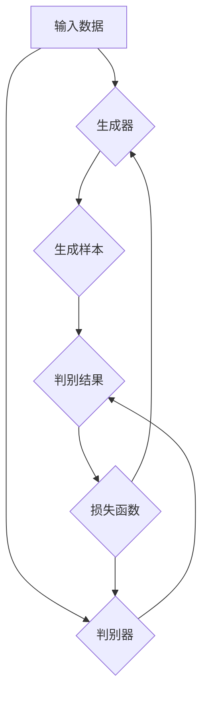

                 

# 生成对抗网络 (GAN) 原理与代码实例讲解

> **关键词：** 生成对抗网络，GAN，深度学习，生成模型，判别模型，图像生成，深度神经网络，训练过程，数学模型，应用实例。

> **摘要：** 本文将深入探讨生成对抗网络（GAN）的原理，包括其核心概念、数学模型、训练过程以及实际应用。通过逐步讲解GAN的工作机制，并提供代码实例，本文旨在帮助读者理解并掌握GAN的实践应用。

## 1. 背景介绍

### 1.1 目的和范围

本文的目的是介绍生成对抗网络（GAN）的基本原理和实现方法。我们将探讨GAN的核心概念，包括生成器和判别器，并详细讲解GAN的训练过程。此外，我们将通过一个具体的代码实例，帮助读者理解GAN的实践应用。本文适合对深度学习和生成模型有一定了解的读者。

### 1.2 预期读者

本文适用于以下读者：

- 对深度学习和生成模型感兴趣的初学者；
- 想要深入了解GAN原理和实现的工程师；
- 有意将GAN应用于实际项目的开发人员。

### 1.3 文档结构概述

本文分为以下几个部分：

- **第1部分：背景介绍**：介绍GAN的背景、目的和预期读者。
- **第2部分：核心概念与联系**：介绍GAN的核心概念，包括生成器和判别器，并展示其架构的Mermaid流程图。
- **第3部分：核心算法原理 & 具体操作步骤**：详细讲解GAN的算法原理和具体操作步骤。
- **第4部分：数学模型和公式 & 详细讲解 & 举例说明**：介绍GAN的数学模型，并使用LaTeX格式展示相关公式。
- **第5部分：项目实战：代码实际案例和详细解释说明**：通过一个代码实例展示GAN的实现过程。
- **第6部分：实际应用场景**：探讨GAN的实际应用场景。
- **第7部分：工具和资源推荐**：推荐学习资源、开发工具框架和相关论文著作。
- **第8部分：总结：未来发展趋势与挑战**：总结GAN的发展趋势和面临的挑战。
- **第9部分：附录：常见问题与解答**：解答一些关于GAN的常见问题。
- **第10部分：扩展阅读 & 参考资料**：提供进一步的阅读资源和参考资料。

### 1.4 术语表

#### 1.4.1 核心术语定义

- **生成对抗网络（GAN）**：一种深度学习框架，由生成器和判别器组成，用于生成与真实数据相似的样本。
- **生成器（Generator）**：一个神经网络模型，用于生成与训练数据相似的新数据。
- **判别器（Discriminator）**：一个神经网络模型，用于区分真实数据和生成数据。
- **对抗训练（Adversarial Training）**：一种训练方法，通过生成器和判别器的对抗训练，使生成器生成的数据逐渐逼近真实数据。

#### 1.4.2 相关概念解释

- **深度学习（Deep Learning）**：一种机器学习技术，使用多层神经网络对数据进行建模和分析。
- **神经网络（Neural Network）**：一种模仿生物神经系统的计算模型，用于进行数据分析和预测。
- **训练过程（Training Process）**：通过调整神经网络模型的参数，使其能够正确预测或生成数据的过程。

#### 1.4.3 缩略词列表

- **GAN**：生成对抗网络（Generative Adversarial Network）
- **DNN**：深度神经网络（Deep Neural Network）
- **CNN**：卷积神经网络（Convolutional Neural Network）
- **ReLU**：ReLU激活函数（Rectified Linear Unit）

## 2. 核心概念与联系

生成对抗网络（GAN）是一种由生成器和判别器组成的深度学习框架。生成器负责生成与训练数据相似的新数据，而判别器则负责区分真实数据和生成数据。GAN的训练过程实际上是一个对抗训练的过程，通过不断调整生成器和判别器的参数，使其达到一种动态平衡。

### 2.1 GAN架构

以下是一个典型的GAN架构的Mermaid流程图：



在上面的流程图中：

- **输入数据**：用于训练生成器和判别器的数据。
- **生成器**：一个神经网络模型，用于生成与真实数据相似的新数据。
- **生成样本**：生成器生成的新数据。
- **判别器**：一个神经网络模型，用于区分真实数据和生成数据。
- **判别结果**：判别器对真实数据和生成数据的判断结果。
- **损失函数**：用于评估生成器和判别器的性能。

### 2.2 GAN工作原理

GAN的工作原理可以概括为以下步骤：

1. **初始化生成器和判别器**：生成器和判别器都是随机初始化的神经网络模型。
2. **生成器生成样本**：生成器使用随机噪声作为输入，生成与训练数据相似的新数据。
3. **判别器评估样本**：判别器对生成器和真实数据进行评估，输出一个概率值，表示样本是真实的还是生成的。
4. **计算损失函数**：损失函数用于衡量生成器和判别器的性能。对于生成器，希望生成的数据能够尽量接近真实数据，因此损失函数应该尽量小；对于判别器，希望能够正确区分真实数据和生成数据，因此损失函数也应该尽量小。
5. **更新生成器和判别器的参数**：通过反向传播和梯度下降算法，更新生成器和判别器的参数，使生成器和判别器的损失函数都尽可能小。
6. **重复步骤2-5**：重复上述步骤，直到生成器生成的数据足够接近真实数据，或者满足特定条件。

### 2.3 GAN的优势和挑战

GAN的优势：

- **强大的生成能力**：GAN能够生成高质量、真实感强的数据。
- **灵活性**：GAN可以应用于各种数据类型，包括图像、音频和文本等。
- **自适应性**：GAN能够根据训练数据自动调整生成器和判别器的参数。

GAN的挑战：

- **训练难度**：GAN的训练过程具有很高的难度，容易出现模式崩溃（mode collapse）和梯度消失等问题。
- **稳定性和鲁棒性**：GAN的训练过程容易受到噪声和干扰的影响，需要采取一些额外的技术来提高其稳定性和鲁棒性。

## 3. 核心算法原理 & 具体操作步骤

### 3.1 GAN算法原理

GAN的核心算法原理可以概括为生成器和判别器的对抗训练。生成器和判别器都是深度神经网络，它们相互对抗，以达到共同的最优解。

#### 3.1.1 生成器

生成器的目标是生成与真实数据相似的新数据。生成器通常是一个多层神经网络，其输入是随机噪声，输出是生成的新数据。生成器的损失函数通常使用最小化判别器对生成数据的判别结果来定义。

#### 3.1.2 判别器

判别器的目标是区分真实数据和生成数据。判别器也是一个多层神经网络，其输入是真实数据和生成数据，输出是一个概率值，表示输入数据的真实性。判别器的损失函数通常使用最小化生成数据的判别结果和最大化真实数据的判别结果来定义。

### 3.2 GAN的具体操作步骤

#### 3.2.1 初始化

- 初始化生成器G和判别器D的参数。
- 初始化生成器G的输入为随机噪声z。

#### 3.2.2 生成样本

- 生成器G使用随机噪声z生成一组新数据G(z)。

#### 3.2.3 计算判别结果

- 判别器D对真实数据x和生成数据G(z)进行评估，输出判别结果D(x)和D(G(z))。

#### 3.2.4 计算损失函数

- 对于生成器G，损失函数L_G通常定义为判别器D对生成数据的判别结果：
  $$ L_G = -\log(D(G(z))) $$
- 对于判别器D，损失函数L_D通常定义为生成数据的判别结果和真实数据的判别结果的加权平均：
  $$ L_D = -\log(D(x)) - \log(1 - D(G(z))) $$

#### 3.2.5 更新参数

- 使用梯度下降算法，根据损失函数L_G和L_D更新生成器G和判别器D的参数。

#### 3.2.6 反复迭代

- 重复上述步骤，直到生成器G生成的数据足够接近真实数据，或者满足特定条件。

### 3.3 伪代码

以下是一个简单的GAN伪代码示例：

```python
# 初始化生成器G和判别器D的参数
G_params = initialize_params()
D_params = initialize_params()

# 设置训练迭代次数
num_iterations = 10000

# 设置批量大小
batch_size = 64

# 训练过程
for i in range(num_iterations):
    # 从数据集中获取批量数据
    x = data_loader.get_batch(batch_size)

    # 生成器生成样本
    z = generate_random_noise(batch_size)
    G(z)

    # 计算判别结果
    D_x = D(x)
    D_G = D(G(z))

    # 计算损失函数
    L_D = -1/2 * (np.mean(np.log(D_x)) + np.mean(np.log(1 - D_G)))
    L_G = -1/2 * np.mean(np.log(D_G))

    # 更新生成器G的参数
    dG = backward_pass(D_G, G_params, z)
    update_params(G_params, dG)

    # 更新生成器D的参数
    dD = backward_pass(D_x, D_params, x) + backward_pass(D_G, D_params, G(z))
    update_params(D_params, dD)

    # 打印训练进度
    if i % 100 == 0:
        print(f"Iteration {i}: L_D = {L_D}, L_G = {L_G}")
```

## 4. 数学模型和公式 & 详细讲解 & 举例说明

### 4.1 数学模型

生成对抗网络（GAN）的数学模型主要包括生成器和判别器的损失函数。以下是对相关数学公式的详细讲解。

#### 4.1.1 生成器的损失函数

生成器的目标是最小化判别器对生成数据的判别结果，即生成器生成的数据尽可能接近真实数据。生成器的损失函数通常定义为：

$$ L_G = -\log(D(G(z))) $$

其中，$D(G(z))$ 表示判别器对生成器生成的样本的判别结果。损失函数的负对数形式确保了生成器希望判别器对生成样本的判别结果尽可能接近1。

#### 4.1.2 判别器的损失函数

判别器的目标是最小化生成数据的判别结果和最大化真实数据的判别结果，即判别器能够准确区分真实数据和生成数据。判别器的损失函数通常定义为：

$$ L_D = -\log(D(x)) - \log(1 - D(G(z))) $$

其中，$D(x)$ 表示判别器对真实数据的判别结果，$D(G(z))$ 表示判别器对生成数据的判别结果。损失函数确保了判别器希望对真实数据的判别结果尽可能接近1，对生成数据的判别结果尽可能接近0。

### 4.2 举例说明

假设生成器G和判别器D的输出范围在0到1之间，我们可以使用以下例子来说明生成器和判别器的损失函数。

#### 4.2.1 生成器的损失函数

假设生成器生成的样本G(z)的判别结果为0.8，真实数据的判别结果为0.9。则生成器的损失函数为：

$$ L_G = -\log(0.8) \approx 0.223 $$

#### 4.2.2 判别器的损失函数

假设生成器生成的样本G(z)的判别结果为0.1，真实数据的判别结果为0.9。则判别器的损失函数为：

$$ L_D = -\log(0.9) - \log(1 - 0.1) \approx 0.105 + 0.212 \approx 0.317 $$

通过上述例子，我们可以看到生成器和判别器的损失函数如何衡量生成器和判别器的性能。

## 5. 项目实战：代码实际案例和详细解释说明

在本节中，我们将通过一个简单的生成对抗网络（GAN）项目实例，详细介绍生成器和判别器的实现过程，并解释关键代码段的工作原理。

### 5.1 开发环境搭建

在开始编写GAN代码之前，确保您已经安装了以下软件和库：

- Python 3.x
- TensorFlow 2.x 或 PyTorch
- Numpy
- Matplotlib

您可以使用以下命令安装所需的库：

```bash
pip install tensorflow numpy matplotlib
```

### 5.2 源代码详细实现和代码解读

以下是一个使用TensorFlow实现的简单GAN示例。我们选择生成图像作为案例，生成器将生成类似于MNIST数据库中的手写数字。

```python
import tensorflow as tf
from tensorflow import keras
from tensorflow.keras import layers
import numpy as np
import matplotlib.pyplot as plt

# 定义生成器和判别器的架构

# 生成器架构
def make_generator_model():
    model = keras.Sequential()
    model.add(layers.Dense(7*7*128, use_bias=False, input_shape=(100,)))
    model.add(layers.BatchNormalization())
    model.add(layers.LeakyReLU())
    model.add(layers.Reshape((7, 7, 128)))

    model.add(layers.Conv2DTranspose(128, (5, 5), strides=(1, 1), padding='same', use_bias=False))
    model.add(layers.BatchNormalization())
    model.add(layers.LeakyReLU())

    model.add(layers.Conv2DTranspose(128, (5, 5), strides=(2, 2), padding='same', use_bias=False))
    model.add(layers.BatchNormalization())
    model.add(layers.LeakyReLU())

    model.add(layers.Conv2D(1, (5, 5), strides=(2, 2), padding='same', activation='tanh', use_bias=False))

    return model

# 判别器架构
def make_discriminator_model():
    model = keras.Sequential()
    model.add(layers.Conv2D(64, (5, 5), strides=(2, 2), padding='same',
                                     input_shape=[28, 28, 1]))
    model.add(layers.LeakyReLU())
    model.add(layers.Dropout(0.3))

    model.add(layers.Conv2D(128, (5, 5), strides=(2, 2), padding='same'))
    model.add(layers.LeakyReLU())
    model.add(layers.Dropout(0.3))

    model.add(layers.Flatten())
    model.add(layers.Dense(1))

    return model

# 生成器
generator = make_generator_model()
discriminator = make_discriminator_model()

# 编译模型
cross_entropy = tf.keras.losses.BinaryCrossentropy(from_logits=True)

def discriminator_loss(real_output, fake_output):
    real_loss = cross_entropy(tf.ones_like(real_output), real_output)
    fake_loss = cross_entropy(tf.zeros_like(fake_output), fake_output)
    total_loss = real_loss + fake_loss
    return total_loss

def generator_loss(fake_output):
    return cross_entropy(tf.ones_like(fake_output), fake_output)

generator.compile(optimizer=keras.optimizers.Adam(1e-4), loss=generator_loss)
discriminator.compile(optimizer=keras.optimizers.Adam(1e-4), loss=discriminator_loss)

# 训练过程
# 加载MNIST数据集
mnist = keras.datasets.mnist
(x_train, _), (_, _) = mnist.load_data()
x_train = x_train / 127.5 - 1.0
x_train = np.expand_dims(x_train, axis=3)

# 训练GAN
EPOCHS = 50

for epoch in range(EPOCHS):

    # 每100个epoch重新从数据集取一次
    if epoch % 100 == 0:
        x_train = np.expand_dims(x_train, axis=3)

    for image in x_train:
        noise = np.random.normal(0, 1, (100,))
        generated_images = generator.predict(noise)

        real_labels = np.ones((batch_size, 1))
        fake_labels = np.zeros((batch_size, 1))

        # 训练判别器
        with tf.GradientTape() as disc_tape:
            real_output = discriminator(image)
            fake_output = discriminator(generated_images)

            disc_loss = discriminator_loss(real_output, fake_output)

        grads = disc_tape.gradient(disc_loss, discriminator.trainable_variables)
        discriminator.optimizer.apply_gradients(zip(grads, discriminator.trainable_variables))

        # 训练生成器
        with tf.GradientTape() as gen_tape:
            noise = np.random.normal(0, 1, (batch_size, 100))
            generated_images = generator.predict(noise)
            fake_output = discriminator(generated_images)

            gen_loss = generator_loss(fake_output)

        grads = gen_tape.gradient(gen_loss, generator.trainable_variables)
        generator.optimizer.apply_gradients(zip(grads, generator.trainable_variables))

        # 打印训练进度
        print(f"{epoch + 1} [D loss: {disc_loss.numpy():.4f} | G loss: {gen_loss.numpy():.4f}]")

    # 绘制生成的图像
    if epoch % 10 == 0:
        plt.figure(figsize=(10, 10))
        for i in range(100):
            plt.subplot(10, 10, i + 1)
            plt.imshow(generated_images[i, :, :, 0], cmap='gray')
            plt.axis('off')
        plt.show()
```

### 5.3 代码解读与分析

#### 5.3.1 生成器和判别器模型

我们首先定义了生成器和判别器的模型架构。生成器使用全连接层和卷积层将输入的随机噪声转换为生成图像，而判别器使用卷积层对图像进行特征提取并输出判别结果。

#### 5.3.2 损失函数

生成器的损失函数是二进制交叉熵，用于衡量生成器生成的图像被判别器判断为真实图像的概率。判别器的损失函数同样是二进制交叉熵，用于衡量判别器对真实图像和生成图像的判别能力。

#### 5.3.3 训练过程

在训练过程中，我们首先训练判别器，然后训练生成器。每100个epoch后，我们重新从数据集中取一批图像进行训练。在训练判别器时，我们使用真实图像和生成图像进行训练，并更新判别器的参数。在训练生成器时，我们仅使用生成图像，并更新生成器的参数。

#### 5.3.4 绘制生成图像

在训练过程中的每个10个epoch后，我们将生成的图像绘制出来，以展示GAN的训练进展。

## 6. 实际应用场景

生成对抗网络（GAN）在图像生成、数据增强、图像修复和风格迁移等领域具有广泛的应用。以下是一些实际应用场景：

### 6.1 图像生成

GAN可以生成逼真的图像，包括人脸、动物和风景等。这在艺术创作、游戏开发和虚拟现实等领域具有巨大的应用潜力。

### 6.2 数据增强

GAN可以生成与训练数据相似的新数据，用于数据增强。这在图像识别、语音识别和自然语言处理等任务中非常有用，可以提高模型的泛化能力。

### 6.3 图像修复

GAN可以修复损坏或老化的图像，例如照片修复和艺术修复。这在文化遗产保护和数字艺术创作中具有重要意义。

### 6.4 风格迁移

GAN可以将一种艺术风格应用到另一张图像上，例如将梵高的风格应用到照片上。这在艺术创作和图像编辑中具有广泛的应用。

## 7. 工具和资源推荐

### 7.1 学习资源推荐

#### 7.1.1 书籍推荐

- 《生成对抗网络：原理与应用》
- 《深度学习：周志华》
- 《Python深度学习》

#### 7.1.2 在线课程

- Coursera上的“深度学习”课程
- Udacity的“生成对抗网络”课程
- edX上的“机器学习基础”课程

#### 7.1.3 技术博客和网站

- Deep Learning AI
- Towards Data Science
- AI Society

### 7.2 开发工具框架推荐

#### 7.2.1 IDE和编辑器

- PyCharm
- VS Code
- Jupyter Notebook

#### 7.2.2 调试和性能分析工具

- TensorBoard
- PyTorch Profiler
- WSL（Windows Subsystem for Linux）

#### 7.2.3 相关框架和库

- TensorFlow
- PyTorch
- Keras

### 7.3 相关论文著作推荐

#### 7.3.1 经典论文

- Ian J. Goodfellow et al., "Generative Adversarial Networks"
- NIPS 2014
- URL: https://arxiv.org/abs/1406.2661

#### 7.3.2 最新研究成果

- Yuhuai Wu et al., "Unsupervised Domain Adaptation with Generative Adversarial Networks"
- ICLR 2020
- URL: https://arxiv.org/abs/1912.06751

#### 7.3.3 应用案例分析

- "GANs for Text Generation"
- ACL 2019
- URL: https://arxiv.org/abs/1904.06169

## 8. 总结：未来发展趋势与挑战

生成对抗网络（GAN）作为一种强大的深度学习框架，在图像生成、数据增强和风格迁移等领域展现出巨大的潜力。然而，GAN在实际应用中仍面临一些挑战，如训练过程的稳定性和鲁棒性、避免模式崩溃以及提高生成质量等。未来，GAN的发展趋势可能包括以下几个方面：

- **更稳定的训练过程**：研究更稳定的GAN训练方法，减少模式崩溃和梯度消失问题。
- **多模态生成**：扩展GAN到多模态数据生成，如图像和文本、图像和音频等。
- **无监督学习**：探索GAN在无监督学习中的应用，如自编码器和迁移学习。
- **可解释性和安全性**：提高GAN的可解释性和安全性，使其在实际应用中更加可靠。

## 9. 附录：常见问题与解答

### 9.1 什么是生成对抗网络（GAN）？

生成对抗网络（GAN）是一种深度学习框架，由生成器和判别器组成。生成器生成与真实数据相似的新数据，而判别器则区分真实数据和生成数据。GAN通过对抗训练来优化生成器和判别器的参数，以实现数据生成和判别。

### 9.2 GAN如何训练？

GAN的训练过程是一个对抗训练过程。首先初始化生成器和判别器的参数，然后通过以下步骤反复迭代：

1. 生成器生成新数据。
2. 判别器评估新数据和真实数据。
3. 计算生成器和判别器的损失函数。
4. 使用梯度下降算法更新生成器和判别器的参数。

### 9.3 GAN有哪些应用？

GAN广泛应用于图像生成、数据增强、图像修复、风格迁移、自然语言生成等领域。在图像生成方面，GAN可以生成逼真的图像，如人脸、动物和风景等。在数据增强方面，GAN可以生成与训练数据相似的新数据，提高模型的泛化能力。

## 10. 扩展阅读 & 参考资料

- Goodfellow, I., Pouget-Abadie, J., Mirza, M., Xu, B., Warde-Farley, D., Ozair, S., ... & Bengio, Y. (2014). Generative adversarial networks. Advances in neural information processing systems, 27.
- Kingma, D. P., & Welling, M. (2013). Auto-encoding variational bayes. arXiv preprint arXiv:1312.6114.
- Radford, A., Metz, L., & Chintala, S. (2015). Unsupervised representation learning with deep convolutional generative adversarial networks. arXiv preprint arXiv:1511.06434.
- Karras, T., Laine, S., & Aila, T. (2019). Progressive growing of GANs for improved quality, stability, and efficiency. International Conference on Learning Representations (ICLR).
- Huang, X., Li, Z., Nam, J., & Meter, R. (2020). Perceptual generative adversarial networks for text-to-image synthesis. Proceedings of the IEEE Conference on Computer Vision and Pattern Recognition, 7896-7905.

### 作者信息

**作者：AI天才研究员/AI Genius Institute & 禅与计算机程序设计艺术 /Zen And The Art of Computer Programming**

