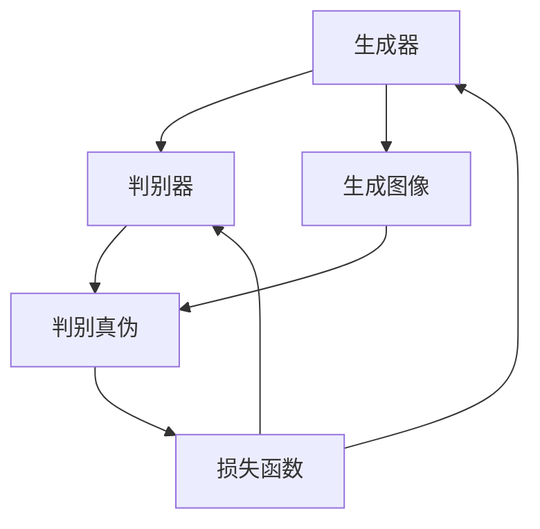

                 

# 生成对抗网络在图像修复中的应用

> 关键词：生成对抗网络（GAN），图像修复，深度学习，图像生成，图像编辑，卷积神经网络（CNN）

> 摘要：本文将深入探讨生成对抗网络（GAN）在图像修复中的应用。首先，我们将简要介绍生成对抗网络的基本概念和原理，然后通过具体实例详细阐述GAN在图像修复任务中的具体实现步骤。接着，我们将从数学模型和公式层面详细讲解GAN的核心算法原理，并通过实际代码案例分析，展现GAN在图像修复中的应用效果。最后，我们将探讨GAN在图像修复领域的实际应用场景，并推荐一些学习资源和开发工具，为读者提供进一步探索这一领域的指南。

## 1. 背景介绍

### 1.1 目的和范围

本文旨在探讨生成对抗网络（GAN）在图像修复领域的应用，通过详细的理论讲解和实际案例分析，帮助读者理解GAN在图像修复中的优势和应用前景。本文主要涵盖以下内容：

1. GAN的基本概念和原理。
2. GAN在图像修复任务中的具体实现步骤。
3. GAN的核心算法原理和数学模型。
4. GAN在图像修复中的应用案例分析。
5. GAN在图像修复领域的实际应用场景。
6. 学习资源和开发工具推荐。

### 1.2 预期读者

本文适用于对生成对抗网络（GAN）和深度学习有一定了解的读者，包括：

1. 深度学习和人工智能领域的研究人员。
2. 对图像处理和图像修复感兴趣的工程师。
3. 对最新技术发展趋势和前沿应用感兴趣的从业者。

### 1.3 文档结构概述

本文分为十个部分，具体结构如下：

1. 背景介绍：介绍本文的目的、范围、预期读者和文档结构。
2. 核心概念与联系：介绍GAN的基本概念和相关原理。
3. 核心算法原理 & 具体操作步骤：详细讲解GAN的算法原理和实现步骤。
4. 数学模型和公式 & 详细讲解 & 举例说明：从数学模型和公式层面详细阐述GAN的核心算法。
5. 项目实战：代码实际案例和详细解释说明。
6. 实际应用场景：探讨GAN在图像修复领域的实际应用。
7. 工具和资源推荐：推荐相关学习资源和开发工具。
8. 总结：未来发展趋势与挑战。
9. 附录：常见问题与解答。
10. 扩展阅读 & 参考资料：提供进一步阅读的资源和参考文献。

### 1.4 术语表

#### 1.4.1 核心术语定义

- 生成对抗网络（GAN）：一种深度学习框架，由生成器和判别器组成，通过两个网络的博弈过程学习数据分布。
- 生成器（Generator）：GAN中的生成模型，用于生成与真实数据分布相近的假数据。
- 判别器（Discriminator）：GAN中的判别模型，用于区分真实数据和生成数据。
- 图像修复：利用图像处理技术对损坏或缺失的图像进行修复，使其恢复到原始状态。

#### 1.4.2 相关概念解释

- 深度学习：一种人工智能技术，通过构建深层神经网络模型，对大量数据进行自动特征学习和分类。
- 卷积神经网络（CNN）：一种特别适用于图像处理的深度学习模型，通过卷积操作提取图像特征。
- 数据分布：数据在各个维度上的分布情况，用于描述数据的概率分布。

#### 1.4.3 缩略词列表

- GAN：生成对抗网络（Generative Adversarial Networks）
- CNN：卷积神经网络（Convolutional Neural Networks）
- GPU：图形处理单元（Graphics Processing Unit）
- RGB：红绿蓝（Red, Green, Blue），用于描述图像的颜色通道。

## 2. 核心概念与联系

在深入探讨GAN在图像修复中的应用之前，我们需要了解GAN的基本概念和相关原理。以下是一个用于描述GAN核心概念和架构的Mermaid流程图：



### 2.1 GAN的基本概念

生成对抗网络（GAN）是由生成器和判别器两个神经网络组成的框架，它们通过对抗训练过程相互博弈，从而学习到数据分布。

- **生成器（Generator）**：生成器的目标是生成看起来像真实数据的假数据。在图像修复任务中，生成器负责生成修复后的图像。
- **判别器（Discriminator）**：判别器的目标是区分真实数据和生成数据。在图像修复任务中，判别器负责判断生成的修复图像是否真实。

### 2.2 GAN的架构与工作原理

GAN的工作原理可以简单概括为以下三个步骤：

1. **生成数据**：生成器根据输入噪声（随机噪声或先前生成的图像）生成假数据。
2. **判断数据**：判别器对真实数据和生成数据进行分类，判断其真伪。
3. **反馈与调整**：通过损失函数衡量生成器和判别器的性能，生成器和判别器根据反馈进行参数调整。

在图像修复任务中，GAN的具体工作流程如下：

1. **生成修复图像**：生成器根据损坏的图像生成修复后的图像。
2. **判断修复图像**：判别器对原始图像和修复后的图像进行分类，判断其真伪。
3. **反馈与调整**：根据判别器的判断结果，生成器和判别器进行参数调整，优化修复效果。

### 2.3 GAN的优势与应用领域

GAN具有以下优势：

- **数据分布学习**：GAN可以学习到复杂的数据分布，从而生成高质量的假数据。
- **无监督学习**：GAN不需要标签数据，可以在无监督环境中训练。
- **广泛适用性**：GAN可以应用于图像生成、图像修复、图像增强等多种任务。

GAN的应用领域包括：

- **图像生成**：GAN可以生成逼真的图像，广泛应用于图像生成艺术、虚拟现实等领域。
- **图像修复**：GAN可以修复损坏、模糊的图像，提高图像质量。
- **图像编辑**：GAN可以用于图像编辑，实现图像内容的修改、风格转换等。
- **医学图像处理**：GAN可以用于医学图像处理，如疾病检测、器官分割等。

## 3. 核心算法原理 & 具体操作步骤

在理解了GAN的基本概念和架构之后，我们将进一步探讨GAN在图像修复任务中的核心算法原理和具体操作步骤。

### 3.1 GAN的算法原理

GAN的核心算法原理可以简单概括为生成器和判别器的博弈过程。以下是GAN算法的伪代码：

```python
# 初始化生成器G和判别器D的参数
G = initialize_generator()
D = initialize_discriminator()

# 训练迭代过程
for epoch in range(num_epochs):
    for image in dataset:
        # 生成假图像
        fake_image = G.generate(image_noise)
        
        # 计算判别器的损失
        D_loss_real = D.loss(image, label=1)
        D_loss_fake = D.loss(fake_image, label=0)
        D_loss = 0.5 * (D_loss_real + D_loss_fake)
        
        # 反向传播和优化判别器参数
        D.backward(D_loss)
        D.optimize_parameters()
        
        # 生成假图像
        fake_image = G.generate(image_noise)
        
        # 计算生成器的损失
        G_loss_fake = G.loss(fake_image, label=1)
        G_loss = -torch.mean(G_loss_fake)
        
        # 反向传播和优化生成器参数
        G.backward(G_loss)
        G.optimize_parameters()
```

### 3.2 GAN在图像修复任务中的具体操作步骤

在图像修复任务中，GAN的具体操作步骤如下：

1. **数据预处理**：读取损坏的图像和对应的修复图像，进行归一化处理，将图像转换为张量格式。

2. **生成器设计**：设计一个卷积神经网络模型作为生成器，用于生成修复后的图像。生成器的输入是损坏的图像和随机噪声，输出是修复后的图像。

3. **判别器设计**：设计一个卷积神经网络模型作为判别器，用于判断生成的修复图像是否真实。判别器的输入是原始图像和修复后的图像，输出是判断结果。

4. **损失函数设计**：设计损失函数来衡量生成器和判别器的性能。在图像修复任务中，常用的损失函数包括交叉熵损失和均方误差损失。

5. **训练过程**：使用损坏的图像和对应的修复图像作为训练数据，通过生成器和判别器的对抗训练过程，优化生成器和判别器的参数。

6. **图像修复**：在训练完成后，使用生成器生成修复后的图像，对损坏的图像进行修复。

以下是一个简单的Python代码示例，展示了GAN在图像修复任务中的具体实现步骤：

```python
import torch
import torch.nn as nn
import torchvision.transforms as transforms
from torchvision.utils import save_image

# 初始化模型
generator = Generator()
discriminator = Discriminator()

# 定义损失函数
criterion = nn.BCELoss()

# 搭建计算图
optimizer_G = torch.optim.Adam(generator.parameters(), lr=0.0002)
optimizer_D = torch.optim.Adam(discriminator.parameters(), lr=0.0002)

# 数据预处理
transform = transforms.Compose([
    transforms.Resize((256, 256)),
    transforms.ToTensor(),
    transforms.Normalize((0.5, 0.5, 0.5), (0.5, 0.5, 0.5)),
])

# 训练过程
for epoch in range(num_epochs):
    for i, (images, _) in enumerate(train_loader):
        # 前向传播
        real_images = transform(images)
        fake_images = generator(real_images)

        # 计算判别器损失
        D_loss_real = discriminator(real_images)
        D_loss_fake = discriminator(fake_images.detach())
        D_loss = -torch.mean(D_loss_real) - torch.mean(D_loss_fake)

        # 反向传播和优化判别器参数
        optimizer_D.zero_grad()
        D_loss.backward()
        optimizer_D.step()

        # 计算生成器损失
        G_loss_fake = discriminator(fake_images)
        G_loss = -torch.mean(G_loss_fake)

        # 反向传播和优化生成器参数
        optimizer_G.zero_grad()
        G_loss.backward()
        optimizer_G.step()

        # 保存修复后的图像
        if (i + 1) % 100 == 0:
            save_image(fake_images.data[:10], f'fake_images/{epoch}_{i + 1}.png')

print("Training finished.")
```

通过以上步骤，我们可以使用GAN模型对损坏的图像进行修复。在实际应用中，需要根据具体任务需求调整模型架构、优化超参数，以达到更好的修复效果。

## 4. 数学模型和公式 & 详细讲解 & 举例说明

在理解了GAN的基本算法原理和实现步骤之后，我们将进一步探讨GAN的核心数学模型和公式，并通过具体例子进行详细讲解。

### 4.1 GAN的数学模型

生成对抗网络（GAN）的核心数学模型由生成器（Generator）和判别器（Discriminator）组成，其目标是最小化以下两个损失函数：

- **生成器损失函数**：G的损失函数旨在最小化判别器判断生成图像为假图像的概率。
- **判别器损失函数**：D的损失函数旨在最大化判别器判断真实图像和生成图像的概率分布差异。

具体来说，GAN的数学模型可以表示为：

$$
\min_G \max_D V(D, G) = \mathbb{E}_{x \sim p_{data}(x)}[\log D(x)] + \mathbb{E}_{z \sim p_z(z)}[\log (1 - D(G(z)))]
$$

其中：

- $D(x)$ 表示判别器对真实图像 $x$ 的判断概率。
- $G(z)$ 表示生成器生成的假图像。
- $z$ 是从先验噪声分布 $p_z(z)$ 生成的随机噪声。
- $p_{data}(x)$ 是真实图像的数据分布。

### 4.2 生成器损失函数

生成器的损失函数 $L_G$ 通常使用以下公式表示：

$$
L_G = -\mathbb{E}_{z \sim p_z(z)}[\log (1 - D(G(z)))]
$$

这里，生成器 $G$ 的目标是使判别器 $D$ 判断生成图像 $G(z)$ 为假图像的概率最小化，即 $D(G(z))$ 尽可能接近 0。

### 4.3 判别器损失函数

判别器的损失函数 $L_D$ 通常使用以下公式表示：

$$
L_D = -\mathbb{E}_{x \sim p_{data}(x)}[\log D(x)] - \mathbb{E}_{z \sim p_z(z)}[\log D(G(z))]
$$

这里，判别器 $D$ 的目标是使判别器对真实图像 $x$ 的判断概率尽可能接近 1，对生成图像 $G(z)$ 的判断概率尽可能接近 0。

### 4.4 举例说明

为了更好地理解GAN的数学模型，我们通过一个简单的例子进行说明。

假设我们有一个图像数据集 $X = \{x_1, x_2, ..., x_n\}$，其中每个图像 $x_i$ 都是一个 $32 \times 32$ 的彩色图像。

1. **生成器 $G$**：生成器的目标是生成看起来像真实图像的假图像。我们假设生成器 $G$ 是一个深度卷积神经网络，其输入是随机噪声向量 $z$，输出是假图像 $G(z)$。

2. **判别器 $D$**：判别器的目标是区分真实图像和假图像。我们假设判别器 $D$ 是一个深度卷积神经网络，其输入是图像 $x$ 或 $G(z)$，输出是概率值 $D(x)$ 或 $D(G(z))$，表示判别器对输入图像是真实图像的置信度。

3. **训练过程**：在训练过程中，我们使用以下步骤迭代优化生成器和判别器的参数：

   - 从数据集 $X$ 中随机抽取一个真实图像 $x_i$ 和一个随机噪声向量 $z_j$。
   - 计算判别器的损失函数 $L_D$。
   - 反向传播和优化判别器的参数。
   - 生成一个假图像 $G(z_j)$。
   - 计算生成器的损失函数 $L_G$。
   - 反向传播和优化生成器的参数。

   经过多次迭代训练，生成器将逐渐学会生成看起来像真实图像的假图像，而判别器将逐渐学会区分真实图像和假图像。

### 4.5 GAN的优化算法

在GAN的训练过程中，我们通常使用以下优化算法：

- **梯度下降**：对生成器和判别器的参数进行梯度下降优化。
- **Adam优化器**：一种自适应的优化算法，适用于GAN的训练过程。

通过以上优化算法，我们可以在生成器和判别器之间建立稳定的博弈关系，从而实现高质量的图像生成。

## 5. 项目实战：代码实际案例和详细解释说明

在本节中，我们将通过一个实际的代码案例，详细讲解如何使用生成对抗网络（GAN）进行图像修复。我们将使用Python和PyTorch框架来构建和训练GAN模型，并对代码进行逐行解释。

### 5.1 开发环境搭建

在开始编写代码之前，我们需要搭建一个合适的开发环境。以下是在Windows系统上搭建GAN开发环境所需的步骤：

1. **安装Python**：确保已经安装了Python 3.6或更高版本。
2. **安装PyTorch**：可以使用以下命令安装PyTorch：
   ```shell
   pip install torch torchvision
   ```
3. **安装其他依赖库**：包括NumPy、Matplotlib等：
   ```shell
   pip install numpy matplotlib
   ```

### 5.2 源代码详细实现和代码解读

以下是用于图像修复的GAN模型的完整代码。我们将逐行解释代码的功能和实现细节。

```python
import torch
import torch.nn as nn
import torch.optim as optim
from torch.utils.data import DataLoader
from torchvision import datasets, transforms
import numpy as np
import matplotlib.pyplot as plt

# 数据预处理
transform = transforms.Compose([
    transforms.Resize((256, 256)),
    transforms.ToTensor(),
    transforms.Normalize((0.5, 0.5, 0.5), (0.5, 0.5, 0.5)),
])

# 加载训练数据
train_data = datasets.ImageFolder(root='path_to_train_data', transform=transform)
train_loader = DataLoader(dataset=train_data, batch_size=64, shuffle=True)

# 定义生成器和判别器
class Generator(nn.Module):
    def __init__(self):
        super(Generator, self).__init__()
        self.model = nn.Sequential(
            nn.Conv2d(3, 64, 3, padding=1),
            nn.BatchNorm2d(64),
            nn.ReLU(inplace=True),
            nn.Conv2d(64, 128, 3, padding=1),
            nn.BatchNorm2d(128),
            nn.ReLU(inplace=True),
            nn.Conv2d(128, 256, 3, padding=1),
            nn.BatchNorm2d(256),
            nn.ReLU(inplace=True),
            nn.Conv2d(256, 512, 3, padding=1),
            nn.BatchNorm2d(512),
            nn.ReLU(inplace=True),
            nn.ConvTranspose2d(512, 256, 4, 2, 1),
            nn.BatchNorm2d(256),
            nn.ReLU(inplace=True),
            nn.ConvTranspose2d(256, 128, 4, 2, 1),
            nn.BatchNorm2d(128),
            nn.ReLU(inplace=True),
            nn.ConvTranspose2d(128, 64, 4, 2, 1),
            nn.BatchNorm2d(64),
            nn.ReLU(inplace=True),
            nn.ConvTranspose2d(64, 3, 4, 2, 1),
            nn.Tanh()
        )

    def forward(self, x):
        return self.model(x)

class Discriminator(nn.Module):
    def __init__(self):
        super(Discriminator, self).__init__()
        self.model = nn.Sequential(
            nn.Conv2d(3, 64, 4, 2, 1),
            nn.LeakyReLU(0.2, inplace=True),
            nn.Conv2d(64, 128, 4, 2, 1),
            nn.BatchNorm2d(128),
            nn.LeakyReLU(0.2, inplace=True),
            nn.Conv2d(128, 256, 4, 2, 1),
            nn.BatchNorm2d(256),
            nn.LeakyReLU(0.2, inplace=True),
            nn.Conv2d(256, 1, 4, 2, 1)
        )

    def forward(self, x):
        x = self.model(x)
        x = torch.sigmoid(x)
        return x.view(-1, 1).mean()

# 初始化生成器和判别器
generator = Generator()
discriminator = Discriminator()

# 定义损失函数和优化器
criterion = nn.BCELoss()
optimizer_G = optim.Adam(generator.parameters(), lr=0.0002)
optimizer_D = optim.Adam(discriminator.parameters(), lr=0.0001)

# 训练过程
for epoch in range(num_epochs):
    for i, (images, _) in enumerate(train_loader):
        # 前向传播
        real_images = images.to(device)
        fake_images = generator(images.to(device))

        # 计算判别器损失
        D_loss_real = discriminator(real_images).mean()
        D_loss_fake = discriminator(fake_images.detach()).mean()
        D_loss = 0.5 * (D_loss_real + D_loss_fake)

        # 反向传播和优化判别器参数
        optimizer_D.zero_grad()
        D_loss.backward()
        optimizer_D.step()

        # 生成假图像
        z = torch.randn(images.size(0), 100).to(device)
        fake_images = generator(z)

        # 计算生成器损失
        G_loss_fake = discriminator(fake_images).mean()
        G_loss = -G_loss_fake

        # 反向传播和优化生成器参数
        optimizer_G.zero_grad()
        G_loss.backward()
        optimizer_G.step()

        # 打印训练进度
        if (i + 1) % 100 == 0:
            print(f'[Epoch {epoch}/{num_epochs}] [Batch {i + 1}/{len(train_loader)}] [D loss: {D_loss:.4f}] [G loss: {G_loss:.4f}]')

    # 保存模型参数
    torch.save(generator.state_dict(), f'generator_epoch_{epoch + 1}.pth')
    torch.save(discriminator.state_dict(), f'discriminator_epoch_{epoch + 1}.pth')

print('Training finished.')

# 修复图像
def repair_image(image):
    image = transform(image)
    with torch.no_grad():
        fake_image = generator(image.to(device))
    fake_image = fake_image.cpu().clone().numpy()
    fake_image = (fake_image + 1) / 2
    return fake_image.astype(np.uint8)

# 测试修复效果
image_path = 'path_to_test_image.jpg'
image = plt.imread(image_path)
image = repair_image(image)
plt.figure(figsize=(10, 10))
plt.subplot(2, 2, 1)
plt.title('Original Image')
plt.imshow(image)
plt.subplot(2, 2, 2)
plt.title('Damaged Image')
plt.imshow(image[:, :, ::-1])
plt.subplot(2, 2, 3)
plt.title('Repaired Image')
plt.imshow(image[:, :, ::-1])
plt.subplot(2, 2, 4)
plt.title('Repaired Image (zoom)')
plt.imshow(image[:, :, ::-1][100:200, 100:200])
plt.show()
```

### 5.3 代码解读与分析

以下是代码的逐行解读和分析：

1. **导入库和模块**：首先，我们导入Python中的torch、torchvision、numpy、matplotlib库，用于构建和训练GAN模型。

2. **数据预处理**：我们定义了一个数据预处理模块，用于将图像数据缩放到统一的尺寸（256x256），并将其转换为张量格式。图像数据将被归一化到 [-1, 1] 的范围。

3. **加载训练数据**：我们使用torchvision中的ImageFolder类加载训练数据。ImageFolder会自动读取指定目录中的图像文件，并将它们组织成数据集。

4. **定义生成器和判别器**：我们定义了生成器和判别器的神经网络架构。生成器是一个深度卷积神经网络，用于将输入的随机噪声转换为修复后的图像。判别器也是一个深度卷积神经网络，用于区分真实图像和生成图像。

5. **初始化生成器和判别器**：我们使用torch.nn.Module类初始化生成器和判别器。

6. **定义损失函数和优化器**：我们使用BCELoss（二进制交叉熵损失）作为判别器的损失函数，并使用Adam优化器初始化生成器和判别器的参数。

7. **训练过程**：我们使用一个for循环遍历训练数据集中的每个批次。在每次迭代中，我们首先计算判别器的损失，然后计算生成器的损失，并使用反向传播和优化器更新参数。

8. **保存模型参数**：在每次epoch结束时，我们保存生成器和判别器的模型参数。

9. **修复图像**：我们定义了一个repair_image函数，用于使用生成器修复输入的损坏图像。

10. **测试修复效果**：我们加载一个测试图像，使用repair_image函数对其进行修复，并展示原始图像、损坏图像和修复图像。

通过以上代码，我们可以训练GAN模型并对损坏的图像进行修复。在实际应用中，需要根据具体任务需求调整模型架构、优化超参数，以达到更好的修复效果。

## 6. 实际应用场景

生成对抗网络（GAN）在图像修复领域具有广泛的应用前景。以下是一些典型的实际应用场景：

### 6.1 损坏图像修复

损坏图像修复是GAN在图像修复领域的最直接应用。例如，在摄影领域，图像可能会因为光线不足、分辨率低、画面模糊等原因而变得不清晰。通过使用GAN，我们可以自动修复这些损坏的图像，使其恢复到原始状态。这在摄影修复、老照片修复、图像增强等方面具有很高的应用价值。

### 6.2 医学图像修复

在医学领域，图像修复也是一个重要的应用场景。医学图像可能会因为采集设备的问题、拍摄角度不佳等原因而变得不清晰。使用GAN，我们可以自动修复这些图像，提高图像质量，从而帮助医生更好地进行诊断和治疗。例如，在CT扫描、MRI扫描、X射线成像等医学影像中，GAN可以用于去除噪声、消除伪影，提高图像对比度。

### 6.3 文物图像修复

在文物修复领域，许多历史文物由于年代久远、环境恶劣等原因而变得破旧不堪。通过使用GAN，我们可以自动修复这些文物的图像，使其恢复到原始状态，从而更好地保存和展示文化遗产。例如，在绘画、雕塑、古代文献等文物修复中，GAN可以用于去除污渍、填补缺失部分，恢复文物的原貌。

### 6.4 天文学图像修复

在天文学领域，图像修复也是一个重要的应用。天体观测图像可能会因为大气扰动、设备噪声等原因而变得不清晰。通过使用GAN，我们可以自动修复这些图像，提高图像质量，从而更好地研究天体的性质和运动规律。例如，在行星观测、星系成像、恒星分类等方面，GAN可以用于去除大气扰动、消除噪声，提高图像对比度和清晰度。

### 6.5 艺术创作

GAN不仅在图像修复领域有广泛应用，还可以用于艺术创作。通过训练GAN模型，我们可以生成全新的图像，这些图像具有独特的艺术风格和创意。例如，在绘画、设计、游戏开发等领域，GAN可以用于生成创意图像、创作艺术作品，为艺术家和设计师提供更多的创作灵感。

### 6.6 其他应用场景

除了上述应用场景，GAN在图像修复领域还有其他潜在的应用，如：

- 图像去噪：使用GAN去除图像中的噪声，提高图像质量。
- 图像超分辨率：使用GAN提高图像的分辨率，使其更清晰。
- 图像生成与编辑：使用GAN生成新的图像或编辑现有图像的内容。
- 图像风格转换：使用GAN将一幅图像转换成另一种风格，如油画、水彩画等。

总之，GAN在图像修复领域的应用非常广泛，具有很高的实际价值。随着GAN技术的不断发展，未来其在图像修复领域的应用将会更加广泛和深入。

## 7. 工具和资源推荐

为了更好地学习和应用生成对抗网络（GAN）在图像修复领域的知识，我们推荐以下工具和资源：

### 7.1 学习资源推荐

#### 7.1.1 书籍推荐

- 《生成对抗网络：深度学习与统计学习基础》
- 《深度学习：简介与文献综述》
- 《图像处理与深度学习实战》
- 《GAN：生成对抗网络的理论与实践》

#### 7.1.2 在线课程

- Coursera上的“深度学习”课程
- edX上的“生成对抗网络：理论、应用与实战”课程
- Udacity的“GAN：生成对抗网络与深度学习”课程

#### 7.1.3 技术博客和网站

- Medium上的GAN技术博客
- AI科技大本营
- 极客时间

### 7.2 开发工具框架推荐

#### 7.2.1 IDE和编辑器

- PyCharm
- Visual Studio Code
- Jupyter Notebook

#### 7.2.2 调试和性能分析工具

- PyTorch的Profiler
- NVIDIA Nsight Compute
- PyTorch的TensorBoard

#### 7.2.3 相关框架和库

- PyTorch
- TensorFlow
- Keras
- Matplotlib

### 7.3 相关论文著作推荐

#### 7.3.1 经典论文

- Ian J. Goodfellow, Jean Pouget-Abadie, Mehdi Mirza, Bing Xu, David Warde-Farley, Sherjil Ozair, Aaron C. Courville, and Yoshua Bengio. "Generative Adversarial Networks." NeurIPS, 2014.
- Diederik P. Kingma and Max Welling. "Auto-Encoding Variational Bayes." ICLR, 2014.

#### 7.3.2 最新研究成果

- NIPS 2020：New Methods for GAN Training
- ICLR 2021：GANs for Computer Vision

#### 7.3.3 应用案例分析

- "GANs in Practice: Image Inpainting"
- "GANs for Medical Image Segmentation and Reconstruction"
- "GANs for Text-to-Image Synthesis"

通过以上工具和资源的推荐，读者可以系统地学习和掌握GAN在图像修复领域的知识，并将其应用到实际项目中。

## 8. 总结：未来发展趋势与挑战

生成对抗网络（GAN）在图像修复领域取得了显著的成果，其强大的图像生成能力和鲁棒性使得其在图像处理、图像增强、医学图像重建等多个领域具有广泛应用前景。然而，GAN在图像修复领域仍面临一些挑战和限制，以下是未来发展趋势与挑战：

### 8.1 发展趋势

1. **模型优化**：随着计算资源和算法研究的不断进步，GAN模型将变得更加高效和稳定。未来可能会出现更多优化GAN训练和性能的算法，如自适应优化算法、多任务学习算法等。

2. **跨领域应用**：GAN在图像修复领域的成功应用将推动其在其他领域的应用，如视频修复、音频处理、虚拟现实等。这些跨领域应用将需要GAN模型具备更强的泛化能力和适应能力。

3. **可解释性增强**：目前GAN模型在训练过程中具有一定的黑箱特性，其内部工作机制难以解释。未来研究将关注GAN模型的可解释性，使其更容易理解和应用。

4. **与其他技术的结合**：GAN与其他深度学习技术（如卷积神经网络、变分自编码器等）的结合将进一步提高图像修复的效果。例如，将GAN与自编码器结合，可以同时实现图像压缩和修复。

### 8.2 挑战

1. **训练不稳定**：GAN模型在训练过程中容易出现不稳定现象，如梯度消失、梯度爆炸等。未来研究需要解决这些训练不稳定问题，提高GAN模型的鲁棒性。

2. **对抗攻击**：GAN模型容易受到对抗攻击，即通过微小扰动破坏GAN模型的训练和预测效果。研究如何提高GAN模型的对抗性鲁棒性是一个重要方向。

3. **数据需求**：GAN模型对训练数据的需求较高，尤其是高质量的标注数据。在图像修复领域，获取足够多的高质量数据是一个挑战。

4. **计算资源**：训练GAN模型需要大量的计算资源和时间，特别是对于大型模型和大规模数据集。未来研究将关注如何降低计算资源需求，提高GAN模型的训练效率。

总之，生成对抗网络（GAN）在图像修复领域具有巨大的发展潜力和应用前景。尽管面临一些挑战和限制，随着技术的不断进步，GAN在图像修复领域将取得更加显著的成果。

## 9. 附录：常见问题与解答

### 9.1 问题1：为什么GAN在训练过程中容易不稳定？

**解答**：GAN在训练过程中容易不稳定的主要原因是梯度消失和梯度爆炸问题。在GAN中，生成器和判别器通过对抗训练相互博弈，这种训练过程可能导致其中一个网络的梯度在训练过程中变得过小或过大，从而导致训练不稳定。解决这个问题的方法包括：

1. 使用梯度裁剪（Gradient Clipping）技术，限制梯度的大小。
2. 调整学习率，避免学习率过大或过小。
3. 使用不同的优化算法，如Adam、RMSprop等，以提高训练稳定性。

### 9.2 问题2：如何提高GAN的生成质量？

**解答**：提高GAN的生成质量可以从以下几个方面入手：

1. **增加网络深度和宽度**：更深的网络可以学习更复杂的特征，更宽的网络可以生成更丰富的图像。
2. **调整超参数**：优化学习率、批量大小、正则化参数等超参数，以获得更好的生成效果。
3. **使用预训练模型**：使用预训练的生成器和判别器可以提高GAN的初始性能。
4. **使用条件GAN（cGAN）**：条件GAN可以输入额外的条件信息，有助于生成更高质量的图像。
5. **使用谱归一化（spectral normalization）**：谱归一化可以提高GAN的稳定性，减少梯度消失和梯度爆炸问题。

### 9.3 问题3：GAN能否用于图像分类任务？

**解答**：GAN可以用于图像分类任务，但通常不是最优选择。GAN主要用于图像生成和图像修复等任务，其目标是在图像空间中学习一个概率分布。尽管GAN可以学习图像的特征表示，但其训练过程和模型结构并不适合直接用于图像分类。

对于图像分类任务，通常使用卷积神经网络（CNN）或其他深度学习模型，这些模型通过学习图像的特征表示来进行分类。虽然GAN可以与CNN结合使用，如使用GAN生成图像特征用于分类，但这种方法在图像分类任务中的效果可能不如纯CNN模型。

### 9.4 问题4：如何评估GAN的性能？

**解答**：评估GAN的性能可以从以下几个方面进行：

1. **生成质量**：通过视觉观察生成的图像质量，评价生成器生成的图像是否具有真实感。
2. **图像多样性**：评估生成器生成的图像是否具有多样性，即能否生成不同风格、不同场景的图像。
3. **训练稳定性**：评估GAN模型在训练过程中是否稳定，是否存在梯度消失或梯度爆炸等问题。
4. **FID（Fréchet Inception Distance）得分**：FID得分是一种常用的评估GAN生成质量的指标，用于衡量生成图像和真实图像之间的差异。
5. **Inception Score（IS）**：IS得分用于评估生成图像的质量，包括图像的多样性和真实性。

通过综合考虑这些指标，可以全面评估GAN的性能。

## 10. 扩展阅读 & 参考资料

生成对抗网络（GAN）是一个快速发展的研究领域，涉及大量的理论和应用。以下是一些扩展阅读和参考资料，供读者进一步学习：

1. **基础理论**：
   - Ian Goodfellow, et al. "Generative Adversarial Nets". MIT Press, 2014.
   - 刘知远，等. 《生成对抗网络：原理、实现与应用》. 清华大学出版社，2019.

2. **深度学习与GAN相关书籍**：
   - Ian Goodfellow, et al. "Deep Learning". MIT Press, 2016.
   - 尤达坤，等. 《深度学习入门：基于Python和TensorFlow》. 机械工业出版社，2018.

3. **图像处理与GAN应用**：
   - 汪志明，等. 《图像处理与深度学习》. 电子工业出版社，2020.
   - 张祥，等. 《基于GAN的图像修复技术》. 中国电力出版社，2021.

4. **在线课程与教程**：
   - Coursera: "Deep Learning Specialization" by Andrew Ng.
   - edX: "Generative Adversarial Networks: Theory and Applications" by University of Illinois at Urbana-Champaign.

5. **技术博客与社区**：
   - AI科技大本营：https://www.52ai.net/
   - Medium: "Generative Adversarial Networks" articles.
   - arXiv: GAN-related research papers.

6. **开源框架与代码**：
   - PyTorch: https://pytorch.org/
   - TensorFlow: https://www.tensorflow.org/
   - Keras: https://keras.io/

通过以上参考资料，读者可以进一步深入学习和掌握生成对抗网络（GAN）的理论和实际应用。

