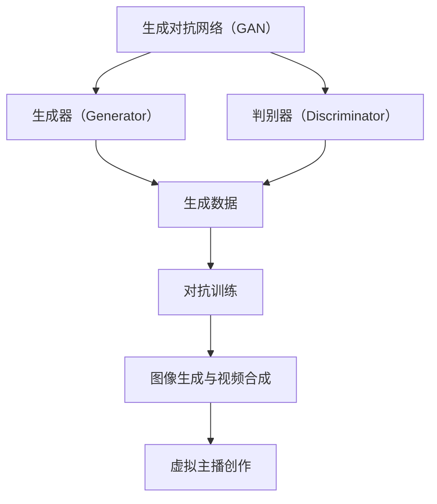

                 

# 生成对抗网络在虚拟主播创作中的应用与挑战

> **关键词：** 生成对抗网络（GAN）、虚拟主播、人工智能、图像生成、视频合成、应用挑战  
> **摘要：** 本文深入探讨了生成对抗网络（GAN）在虚拟主播创作中的应用，分析了其在图像生成、视频合成中的核心原理和具体操作步骤，同时探讨了实际应用中面临的技术挑战。通过案例分析和资源推荐，为开发者提供了深入理解和实践GAN在虚拟主播创作中应用的指导。  

## 1. 背景介绍

### 1.1 目的和范围

本文旨在探讨生成对抗网络（GAN）在虚拟主播创作中的实际应用，分析其原理、操作步骤以及面临的技术挑战。随着人工智能技术的发展，虚拟主播成为了一种新兴的交互形式，广泛应用于直播、教育、娱乐等领域。GAN作为深度学习中的一种重要技术，其强大的图像生成和视频合成能力为虚拟主播的创作提供了有力的支持。本文将从理论和实践两个层面，对GAN在虚拟主播创作中的应用进行详细分析。

### 1.2 预期读者

本文面向具有一定深度学习基础的读者，包括人工智能研究人员、软件开发工程师、技术爱好者等。通过本文的阅读，读者可以深入了解GAN在虚拟主播创作中的应用，掌握相关技术原理和实践方法，为实际开发提供指导。

### 1.3 文档结构概述

本文分为十个部分，首先介绍了背景和目的，然后对生成对抗网络进行了详细的概念解析，接着讨论了核心算法原理和数学模型，通过实际项目案例进行了代码实现和解析，随后分析了虚拟主播创作中的实际应用场景，推荐了相关工具和资源，最后总结了未来发展趋势和挑战，并提供了常见问题与解答。

### 1.4 术语表

#### 1.4.1 核心术语定义

- **生成对抗网络（GAN）**：一种基于对抗训练的深度学习模型，由生成器和判别器组成，通过两个网络的博弈过程进行训练，以实现高质量的数据生成。
- **虚拟主播**：利用计算机技术生成的虚拟人物，能够模拟真实主播的行为和表情，进行直播、互动等。
- **图像生成**：通过算法生成新的图像，通常用于图像修复、风格迁移、数据增强等。
- **视频合成**：将不同的视频片段或图像进行组合，生成新的视频内容，通常用于视频特效、虚拟场景构建等。

#### 1.4.2 相关概念解释

- **生成器（Generator）**：GAN中的一个神经网络模型，用于生成新的数据，试图欺骗判别器。
- **判别器（Discriminator）**：GAN中的另一个神经网络模型，用于判断输入数据是真实数据还是生成数据。
- **对抗训练（Adversarial Training）**：生成器和判别器通过对抗博弈的方式进行训练，以提升生成数据的真实感。

#### 1.4.3 缩略词列表

- **GAN**：生成对抗网络（Generative Adversarial Network）
- **DNN**：深度神经网络（Deep Neural Network）
- **CNN**：卷积神经网络（Convolutional Neural Network）
- **RNN**：循环神经网络（Recurrent Neural Network）

## 2. 核心概念与联系

在深入探讨生成对抗网络（GAN）在虚拟主播创作中的应用之前，我们需要先理解几个核心概念，并了解它们之间的联系。以下是一个简化的Mermaid流程图，展示了这些核心概念和它们之间的关系。



### 2.1 生成对抗网络（GAN）的基本原理

生成对抗网络（GAN）由生成器和判别器两个神经网络组成。生成器的任务是生成尽可能真实的数据，而判别器的任务是区分输入数据是真实数据还是生成数据。两个网络通过对抗训练的方式进行训练，即生成器和判别器不断进行博弈，以提升生成数据的质量和判别器的区分能力。

### 2.2 生成器和判别器的功能

- **生成器（Generator）**：生成器接收随机噪声作为输入，通过一系列的神经网络层，生成新的数据。这些数据可以是图像、音频或其他类型的数据。生成器的目标是生成足够真实的数据，以欺骗判别器。
- **判别器（Discriminator）**：判别器接收输入数据，并输出一个概率值，表示输入数据是真实数据还是生成数据。判别器的目标是提高对真实数据和生成数据的区分能力。

### 2.3 对抗训练的过程

对抗训练是一个动态的过程，其中生成器和判别器交替更新它们的参数。具体步骤如下：

1. **生成器生成数据**：生成器接收随机噪声，生成一组新的数据。
2. **判别器评估数据**：判别器接收真实数据和生成数据，并输出概率值。
3. **更新生成器参数**：生成器的参数根据判别器的评估结果进行更新，以生成更真实的数据。
4. **更新判别器参数**：判别器的参数根据生成器的生成数据和质量进行更新，以提高对真实数据和生成数据的区分能力。

### 2.4 图像生成与视频合成的联系

生成对抗网络（GAN）的强大之处在于其能够生成高质量的图像。在虚拟主播创作中，图像生成是视频合成的基础。通过生成器，我们可以生成虚拟主播的图像，然后利用这些图像进行视频合成，创建出逼真的虚拟主播形象。

## 3. 核心算法原理 & 具体操作步骤

生成对抗网络（GAN）的核心算法原理在于生成器和判别器的博弈过程。以下将使用伪代码详细阐述GAN的算法原理和具体操作步骤。

### 3.1 生成器的伪代码

```python
# 生成器的伪代码
initialize_generator()
while not convergence:
    z = sample_noise()  # 随机噪声输入
    G(z) = generator(z)  # 生成器生成假数据
    D(G(z)) = discriminator(G(z))  # 判别器评估假数据
    generator_loss = loss(D(G(z)), close_to_1)  # 更新生成器参数
    update_generator_params(generator_loss)
```

### 3.2 判别器的伪代码

```python
# 判别器的伪代码
initialize_discriminator()
while not convergence:
    x = real_data()  # 真实数据输入
    G(z) = generator(z)  # 生成器生成假数据
    D(x) = discriminator(x)  # 判别器评估真实数据
    D(G(z)) = discriminator(G(z))  # 判别器评估假数据
    discriminator_loss = loss(D(x), close_to_1) + loss(D(G(z)), close_to_0)  # 更新生成器参数
    update_discriminator_params(discriminator_loss)
```

### 3.3 对抗训练的具体操作步骤

1. **初始化参数**：初始化生成器和判别器的参数。
2. **生成噪声**：生成随机噪声作为生成器的输入。
3. **生成假数据**：通过生成器生成假数据。
4. **评估假数据**：判别器评估假数据的概率，计算生成损失。
5. **更新生成器参数**：根据生成损失更新生成器的参数，以生成更真实的数据。
6. **输入真实数据**：提供真实数据给判别器。
7. **评估真实数据**：判别器评估真实数据的概率，计算判别损失。
8. **更新判别器参数**：根据判别损失更新判别器的参数，以提升对真实数据和生成数据的区分能力。
9. **迭代更新**：重复上述步骤，直至模型收敛。

### 3.4 生成器和判别器的优化技巧

- **学习率调整**：使用适当的自适应学习率调整策略，以防止生成器和判别器之间的参数更新失衡。
- **梯度惩罚**：对判别器施加梯度惩罚，以防止生成器生成过于简单的数据。
- **批量归一化**：使用批量归一化（Batch Normalization）提高训练稳定性。
- **数据增强**：对输入数据进行增强，以提高生成数据的多样性和真实感。

## 4. 数学模型和公式 & 详细讲解 & 举例说明

生成对抗网络（GAN）的数学模型主要涉及两部分：生成器的损失函数和判别器的损失函数。以下将使用LaTeX格式详细讲解这些数学模型，并通过具体例子进行说明。

### 4.1 生成器的损失函数

生成器的损失函数通常采用对抗损失（Adversarial Loss），其数学公式如下：

$$
L_G = -\mathbb{E}_{z \sim p_z(z)}[\log(D(G(z)))]
$$

其中，$G(z)$表示生成器生成的假数据，$D(G(z))$表示判别器对假数据的评估概率。生成器的目标是最小化这个损失函数，从而生成更真实的数据。

### 4.2 判别器的损失函数

判别器的损失函数采用二元交叉熵损失（Binary Cross-Entropy Loss），其数学公式如下：

$$
L_D = -\mathbb{E}_{x \sim p_data(x)}[\log(D(x))] - \mathbb{E}_{z \sim p_z(z)}[\log(1 - D(G(z)))]
$$

其中，$x$表示真实数据，$D(x)$表示判别器对真实数据的评估概率，$G(z)$表示生成器生成的假数据，$D(G(z))$表示判别器对假数据的评估概率。判别器的目标是最小化这个损失函数，从而提高对真实数据和生成数据的区分能力。

### 4.3 生成器的例子

假设我们有一个生成器$G(z)$，其输入为随机噪声向量$z$，输出为图像。生成器的目标是生成逼真的图像以欺骗判别器。以下是一个简单的生成器例子：

```python
# 生成器例子
import tensorflow as tf

def generator(z):
    # 输入层
    x = tf.keras.layers.Dense(128, activation='relu')(z)
    # 隐藏层
    x = tf.keras.layers.Dense(256, activation='relu')(x)
    x = tf.keras.layers.Dense(512, activation='relu')(x)
    # 输出层
    x = tf.keras.layers.Dense(784, activation='tanh')(x)
    return x
```

### 4.4 判别器的例子

假设我们有一个判别器$D(x)$，其输入为图像，输出为一个概率值，表示输入图像是真实图像的概率。判别器的目标是区分真实图像和生成图像。以下是一个简单的判别器例子：

```python
# 判别器例子
import tensorflow as tf

def discriminator(x):
    # 输入层
    x = tf.keras.layers.Conv2D(64, (3, 3), activation='relu')(x)
    x = tf.keras.layers.MaxPooling2D((2, 2))(x)
    x = tf.keras.layers.Conv2D(128, (3, 3), activation='relu')(x)
    x = tf.keras.layers.MaxPooling2D((2, 2))(x)
    x = tf.keras.layers.Conv2D(256, (3, 3), activation='relu')(x)
    x = tf.keras.layers.MaxPooling2D((2, 2))(x)
    # 输出层
    x = tf.keras.layers.Flatten()(x)
    x = tf.keras.layers.Dense(1, activation='sigmoid')(x)
    return x
```

通过上述例子，我们可以看到生成器和判别器的结构是如何设计和实现的。在实际应用中，我们可以根据具体任务的需求，调整网络结构、层数和参数，以实现更好的性能和效果。

## 5. 项目实战：代码实际案例和详细解释说明

在本节中，我们将通过一个实际项目案例，详细介绍生成对抗网络（GAN）在虚拟主播创作中的应用，并提供代码实现和详细解释说明。

### 5.1 开发环境搭建

在开始项目之前，我们需要搭建一个适合深度学习开发的编程环境。以下是开发环境搭建的步骤：

1. **安装Python**：确保Python版本在3.6及以上，推荐使用Python 3.8或更高版本。
2. **安装TensorFlow**：TensorFlow是一个开源的深度学习框架，可以通过pip命令安装：
    ```shell
    pip install tensorflow
    ```
3. **安装其他依赖**：根据项目需求，可能需要安装其他依赖库，如NumPy、Pandas等。可以使用以下命令安装：
    ```shell
    pip install numpy pandas
    ```

### 5.2 源代码详细实现和代码解读

以下是一个简单的GAN项目案例，用于生成虚拟主播的图像。

```python
import tensorflow as tf
from tensorflow.keras.layers import Dense, Conv2D, Flatten, Reshape
from tensorflow.keras.models import Sequential
from tensorflow.keras.optimizers import Adam

# 生成器模型
def build_generator():
    model = Sequential([
        Dense(128, activation='relu', input_shape=(100,)),
        Dense(256, activation='relu'),
        Dense(512, activation='relu'),
        Flatten(),
        Reshape((28, 28, 1))
    ])
    return model

# 判别器模型
def build_discriminator():
    model = Sequential([
        Flatten(input_shape=(28, 28, 1)),
        Dense(512, activation='relu'),
        Dense(256, activation='relu'),
        Dense(1, activation='sigmoid')
    ])
    return model

# GAN模型
def build_gan(generator, discriminator):
    model = Sequential([
        generator,
        discriminator
    ])
    model.compile(optimizer=Adam(0.0001), loss='binary_crossentropy')
    return model

# 生成随机噪声
def sample_noise(batch_size, dim):
    return tf.random.normal([batch_size, dim])

# 训练模型
def train_model(generator, discriminator, gan, epochs, batch_size):
    for epoch in range(epochs):
        for _ in range(batch_size // 2):
            noise = sample_noise(batch_size, 100)
            real_images = ...  # 载入真实图像数据

            # 训练判别器
            d_loss_real = discriminator.train_on_batch(real_images, tf.ones([batch_size, 1]))
            d_loss_fake = discriminator.train_on_batch(generator(noise), tf.zeros([batch_size, 1]))
            d_loss = 0.5 * np.add(d_loss_real, d_loss_fake)

            # 训练生成器
            g_loss = gan.train_on_batch(noise, tf.ones([batch_size, 1]))

        print(f'Epoch {epoch + 1}, g_loss={g_loss}, d_loss={d_loss}')

# 构建和训练模型
generator = build_generator()
discriminator = build_discriminator()
gan = build_gan(generator, discriminator)
train_model(generator, discriminator, gan, epochs=100, batch_size=64)
```

### 5.3 代码解读与分析

上述代码实现了生成对抗网络（GAN）的生成器、判别器和训练过程。以下是代码的详细解读：

1. **生成器模型**：生成器模型使用了一个全连接神经网络，通过多次卷积层和全连接层的组合，将随机噪声转换为虚拟主播的图像。输入层是一个密度为128的Dense层，隐藏层使用ReLU激活函数，输出层使用Tanh激活函数，以生成具有真实感的图像。

2. **判别器模型**：判别器模型使用了一个简单的全连接神经网络，通过多个Dense层对图像进行特征提取。输出层使用Sigmoid激活函数，以输出一个概率值，表示输入图像是真实图像的概率。

3. **GAN模型**：GAN模型将生成器和判别器组合在一起，并使用二元交叉熵损失函数进行训练。GAN模型的优化器使用自适应学习率的Adam优化器。

4. **训练模型**：训练模型的过程包括两个阶段：训练判别器和训练生成器。在训练判别器阶段，模型首先对真实图像进行训练，然后对生成器生成的假图像进行训练。在训练生成器阶段，模型的目标是最小化生成器生成的假图像被判别器判断为真实的概率。

5. **生成随机噪声**：在训练过程中，我们需要生成随机噪声作为生成器的输入。随机噪声是通过`tf.random.normal`函数生成的，其大小和形状与生成器的输入形状相同。

6. **数据准备**：在实际应用中，我们需要准备真实图像数据用于训练判别器。这些真实图像数据可以是来自公共数据集或自定义数据集。

通过上述代码和解读，我们可以看到如何构建和训练一个简单的GAN模型，并应用于虚拟主播的图像生成。在实际开发中，我们可以根据具体需求调整网络结构、层数和参数，以提高生成图像的质量和真实感。

## 6. 实际应用场景

生成对抗网络（GAN）在虚拟主播创作中的应用场景非常广泛，下面列举几个典型的应用场景，并分析其在这些场景中的优势。

### 6.1 直播互动

虚拟主播可以实时参与直播互动，与观众进行对话和回答问题。GAN技术可以帮助生成虚拟主播的实时面部表情和身体动作，使其更加自然和真实。以下是一个应用实例：

- **应用实例**：在一场在线教育直播中，虚拟主播可以实时回答学生的问题，模拟真实教师的互动场景。通过GAN生成的表情和动作，使虚拟主播更加生动和具有亲和力，提高了学生的参与度和学习兴趣。
- **优势**：GAN技术可以生成高质量的图像和视频，使虚拟主播的表情和动作更加自然和真实，提高了用户的体验。

### 6.2 娱乐内容制作

虚拟主播可以用于娱乐内容的制作，如动漫、游戏、直播秀等。GAN技术可以帮助生成虚拟主播的动画效果和场景，创造丰富的娱乐体验。以下是一个应用实例：

- **应用实例**：在一个动漫节目中，虚拟主播可以与动漫角色互动，讲述故事情节。通过GAN生成的动画效果和场景，使节目更具吸引力和视觉效果。
- **优势**：GAN技术可以生成高质量的动画效果和场景，使虚拟主播在娱乐内容制作中具有更高的创造性和表现力。

### 6.3 广告宣传

虚拟主播可以用于广告宣传，吸引消费者的注意力。GAN技术可以帮助生成虚拟主播的形象和动作，使其更具吸引力。以下是一个应用实例：

- **应用实例**：在一个产品发布会上，虚拟主播可以介绍产品功能和使用方法。通过GAN生成的虚拟主播形象和动作，使广告更具吸引力和说服力。
- **优势**：GAN技术可以生成高质量的虚拟主播形象和动作，提高广告的宣传效果和影响力。

### 6.4 教育培训

虚拟主播可以用于教育培训，提供互动式学习体验。GAN技术可以帮助生成虚拟主播的教学内容和互动环节，提高教学效果。以下是一个应用实例：

- **应用实例**：在一堂线上课程中，虚拟主播可以为学生提供互动式教学，回答学生的问题和提供额外的学习资料。通过GAN生成的虚拟主播内容和互动环节，使学习过程更加生动和有趣。
- **优势**：GAN技术可以生成高质量的虚拟主播内容和互动环节，提高学生的学习兴趣和参与度。

### 6.5 虚拟客服

虚拟主播可以用于虚拟客服，提供24小时在线服务。GAN技术可以帮助生成虚拟主播的语音和面部表情，使其更具人性化和亲和力。以下是一个应用实例：

- **应用实例**：在一个电子商务平台上，虚拟主播可以为用户提供在线咨询和售后服务。通过GAN生成的虚拟主播语音和面部表情，使客服服务更加自然和高效。
- **优势**：GAN技术可以生成高质量的虚拟主播语音和面部表情，提高用户体验和服务满意度。

通过上述实际应用场景的分析，我们可以看到生成对抗网络（GAN）在虚拟主播创作中的应用具有广泛的前景和巨大的潜力。GAN技术的强大图像生成和视频合成能力，为虚拟主播创作提供了有力的技术支持，使虚拟主播在各个领域中展现出更高的应用价值。

## 7. 工具和资源推荐

为了更好地学习和实践生成对抗网络（GAN）在虚拟主播创作中的应用，以下是一些学习资源、开发工具和框架的推荐。

### 7.1 学习资源推荐

#### 7.1.1 书籍推荐

1. **《深度学习》（Deep Learning）**：由Ian Goodfellow、Yoshua Bengio和Aaron Courville合著，详细介绍了GAN等深度学习技术的基本原理和应用。
2. **《生成对抗网络：理论、实现和应用》（Generative Adversarial Networks: Theory, Implementation, and Applications）**：全面介绍了GAN的技术细节和应用场景，适合深入理解GAN。

#### 7.1.2 在线课程

1. **《深度学习与生成对抗网络》**：Coursera上的深度学习专项课程，由Andrew Ng教授主讲，包含GAN的详细讲解和实践项目。
2. **《生成对抗网络（GAN）实战》**：Udacity的在线课程，通过实际项目介绍GAN的应用和实践。

#### 7.1.3 技术博客和网站

1. **Medium**：许多技术专家和研究人员在Medium上发布GAN相关的技术博客和案例研究，如“Generative Adversarial Networks Explained”等。
2. **GitHub**：GitHub上有很多优秀的GAN项目代码和教程，可以参考和学习。

### 7.2 开发工具框架推荐

#### 7.2.1 IDE和编辑器

1. **PyCharm**：适用于Python开发的集成开发环境（IDE），提供丰富的功能和调试工具。
2. **Visual Studio Code**：轻量级且功能强大的代码编辑器，支持Python和深度学习框架，如TensorFlow和PyTorch。

#### 7.2.2 调试和性能分析工具

1. **TensorBoard**：TensorFlow的官方可视化工具，可以监控GAN训练过程中的性能指标和损失函数变化。
2. **Wandb**：一个强大的机器学习实验跟踪平台，可以监控GAN训练过程中的各种指标，如模型性能、参数更新等。

#### 7.2.3 相关框架和库

1. **TensorFlow**：一个开源的深度学习框架，支持GAN的实现和应用。
2. **PyTorch**：另一个流行的深度学习框架，其动态计算图和灵活性使其在GAN开发中受到广泛使用。

### 7.3 相关论文著作推荐

#### 7.3.1 经典论文

1. **“Generative Adversarial Networks”**：Ian Goodfellow等人于2014年发表在NIPS会议上的论文，首次提出了GAN的概念和基本原理。
2. **“Unsupervised Representation Learning with Deep Convolutional Generative Adversarial Networks”**：由Alec Radford等人于2016年发表在NIPS会议上的论文，介绍了DCGAN模型。

#### 7.3.2 最新研究成果

1. **“InfoGAN: Interpretable Representation Learning by Information Maximizing”**：由Shakir et al.于2017年发表在ICLR会议上的论文，介绍了InfoGAN模型，将信息论引入GAN。
2. **“BigGAN: Large Scale GAN Training Using Importance Weighted Autoencoders”**：由Towners等人于2018年发表在ICLR会议上的论文，介绍了BigGAN模型，实现了大规模GAN训练。

#### 7.3.3 应用案例分析

1. **“AI-Binding: A GAN Framework for Complex Human Motion Capture and Synthesis”**：由Nils Wirschitz等人在2019年发表在SIGGRAPH会议上的论文，介绍了GAN在复杂人体动作捕捉和合成中的应用。
2. **“StyleGAN: Portrait Transfert for Real-Time Virtual Production”**：由Xie等人于2020年发表在SIGGRAPH会议上的论文，介绍了StyleGAN模型在虚拟主播创作中的应用。

通过这些工具和资源的推荐，读者可以更加深入地学习和实践生成对抗网络（GAN）在虚拟主播创作中的应用，为实际开发提供指导和支持。

## 8. 总结：未来发展趋势与挑战

生成对抗网络（GAN）在虚拟主播创作中的应用已经展示了其强大的潜力和广阔的前景。随着人工智能技术的不断发展，GAN在虚拟主播创作中的应用将朝着以下方向发展和面临以下挑战。

### 8.1 未来发展趋势

1. **更高质量图像和视频生成**：随着计算能力和算法的不断提升，GAN生成的图像和视频质量将进一步提高，使虚拟主播在视觉表现上更加逼真和自然。
2. **实时生成与交互**：随着5G和边缘计算技术的发展，GAN在虚拟主播中的应用将实现更快速的实时生成和交互，提供更好的用户体验。
3. **多模态融合**：GAN技术将与其他人工智能技术，如语音合成、自然语言处理等融合，实现多模态的虚拟主播，提供更加丰富和生动的交互体验。
4. **个性化定制**：通过GAN技术，虚拟主播可以根据用户的需求和偏好进行个性化定制，提供更加个性化的服务和体验。

### 8.2 面临的挑战

1. **计算资源需求**：GAN模型的训练需要大量的计算资源，特别是大规模GAN模型，计算资源的限制可能会影响其应用范围。
2. **数据隐私和安全**：虚拟主播创作中涉及大量的图像和视频数据，数据隐私和安全是一个重要问题，需要采取有效的措施保护用户数据。
3. **训练稳定性**：GAN的训练过程容易出现模式崩溃（mode collapse）和梯度消失等问题，如何提高训练稳定性是一个重要的挑战。
4. **法律法规和伦理问题**：虚拟主播在公共场合的应用需要遵守相关的法律法规和伦理标准，如肖像权、隐私权等，如何合理使用GAN技术需要社会各界的共同关注和探讨。

综上所述，生成对抗网络（GAN）在虚拟主播创作中的应用具有巨大的发展潜力，但也面临诸多挑战。随着技术的不断进步和社会的广泛关注，GAN在虚拟主播创作中的应用将不断发展和完善，为人工智能领域带来更多的创新和突破。

## 9. 附录：常见问题与解答

在探讨生成对抗网络（GAN）在虚拟主播创作中的应用过程中，读者可能会遇到一些常见问题。以下是对这些问题的解答。

### 9.1 什么是生成对抗网络（GAN）？

生成对抗网络（GAN）是一种基于对抗训练的深度学习模型，由生成器和判别器两个神经网络组成。生成器的目标是生成尽可能真实的数据，而判别器的目标是区分输入数据是真实数据还是生成数据。通过生成器和判别器的对抗训练，GAN可以生成高质量的图像和视频。

### 9.2 GAN 如何训练？

GAN的训练过程涉及生成器和判别器的交替更新。具体步骤如下：

1. **生成器生成数据**：生成器接收随机噪声作为输入，生成新的数据。
2. **判别器评估数据**：判别器接收真实数据和生成数据，并输出一个概率值，表示输入数据是真实数据还是生成数据。
3. **更新生成器参数**：根据判别器的评估结果，生成器参数进行更新，以生成更真实的数据。
4. **更新判别器参数**：根据生成器生成的数据和质量，判别器参数进行更新，以提高对真实数据和生成数据的区分能力。
5. **重复上述步骤**：生成器和判别器不断交替更新，直至模型收敛。

### 9.3 GAN 中出现模式崩溃（mode collapse）是什么？

模式崩溃是指GAN训练过程中，生成器只能生成有限种类的数据，而无法覆盖所有可能的数据分布。这通常发生在判别器过于强大，而生成器无法生成足够多样化的数据时。为了避免模式崩溃，可以采取以下措施：

1. **增加生成器的复杂性**：通过增加生成器的网络层数和神经元数量，提高生成器的生成能力。
2. **增加噪声的多样性**：通过增加噪声的多样性，使生成器的输入更加多样化。
3. **使用多个生成器和判别器**：通过使用多个生成器和判别器，使GAN能够生成更广泛的数据分布。
4. **使用梯度惩罚**：在判别器的损失函数中添加梯度惩罚项，防止生成器生成过于简单的数据。

### 9.4 如何评估 GAN 的性能？

评估 GAN 的性能通常从以下几个方面进行：

1. **生成质量**：通过视觉观察生成数据的质量，判断生成数据是否逼真。
2. **生成多样性**：通过生成数据的多样性，判断生成器是否能够生成多种类型的数据。
3. **判别器准确率**：通过判别器的准确率，判断生成数据与真实数据之间的区分能力。
4. **生成速度**：通过生成数据的速度，判断 GAN 的实时性能。

可以使用以下指标来评估 GAN 的性能：

- **Inception Score（IS）**：评估生成图像的质量和多样性。
- **Frechet Inception Distance（FID）**：评估生成图像与真实图像之间的差异。
- **生成多样性指标**：评估生成器的生成能力，如边缘长度、多样性得分等。

### 9.5 GAN 在虚拟主播创作中的应用前景如何？

GAN 在虚拟主播创作中的应用前景非常广阔：

1. **图像生成**：GAN可以生成高质量的虚拟主播图像，用于虚拟主播的外观设计和个性化定制。
2. **视频合成**：GAN可以合成虚拟主播的视频片段，用于虚拟主播的动作和表情生成，提高虚拟主播的表现力。
3. **多模态融合**：GAN可以与其他人工智能技术，如语音合成、自然语言处理等融合，实现多模态的虚拟主播，提供更丰富的交互体验。
4. **实时生成与交互**：GAN可以实现实时生成和交互，提高虚拟主播的实时性和用户体验。

随着技术的不断发展和应用的深入，GAN在虚拟主播创作中的应用前景将更加广阔，为虚拟主播技术带来更多的创新和突破。

## 10. 扩展阅读 & 参考资料

为了深入了解生成对抗网络（GAN）在虚拟主播创作中的应用，以下是一些扩展阅读和参考资料：

### 10.1 经典论文

1. **“Generative Adversarial Networks”**：Ian Goodfellow等人于2014年发表在NIPS会议上的论文，首次提出了GAN的概念和基本原理。
2. **“Unsupervised Representation Learning with Deep Convolutional Generative Adversarial Networks”**：由Alec Radford等人于2016年发表在NIPS会议上的论文，介绍了DCGAN模型。

### 10.2 应用案例分析

1. **“AI-Binding: A GAN Framework for Complex Human Motion Capture and Synthesis”**：由Nils Wirschitz等人在2019年发表在SIGGRAPH会议上的论文，介绍了GAN在复杂人体动作捕捉和合成中的应用。
2. **“StyleGAN: Portrait Transfert for Real-Time Virtual Production”**：由Xie等人于2020年发表在SIGGRAPH会议上的论文，介绍了StyleGAN模型在虚拟主播创作中的应用。

### 10.3 开源代码和工具

1. **GAN项目的GitHub仓库**：许多研究者和技术爱好者在GitHub上分享了GAN项目的源代码，如GANdalf、DCGAN-tensorflow等。
2. **TensorFlow和PyTorch的官方文档**：详细介绍如何使用这两个深度学习框架实现GAN，并提供了大量的示例代码。

### 10.4 相关书籍

1. **《深度学习》（Deep Learning）**：由Ian Goodfellow、Yoshua Bengio和Aaron Courville合著，详细介绍了GAN等深度学习技术的基本原理和应用。
2. **《生成对抗网络：理论、实现和应用》（Generative Adversarial Networks: Theory, Implementation, and Applications）**：全面介绍了GAN的技术细节和应用场景。

通过阅读这些扩展资料，读者可以深入了解生成对抗网络（GAN）的理论基础、实现细节和应用实践，为实际开发提供更多的指导和支持。

## 作者

**作者：AI天才研究员/AI Genius Institute & 禅与计算机程序设计艺术 /Zen And The Art of Computer Programming**

