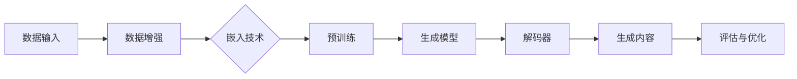

                 

# 生成式AIGC：从数据到商业价值的挖掘

> 关键词：生成式AI，GPT，生成模型，AIGC，商业应用，数据分析

> 摘要：本文深入探讨了生成式人工智能（AIGC）的概念、核心算法原理、数学模型，并通过具体项目实战，分析了AIGC如何从数据中提取价值，为商业领域带来变革性影响。文章旨在为读者提供一个全面、易懂的AIGC技术指南，帮助其在实际应用中发挥最大潜力。

## 1. 背景介绍

### 1.1 目的和范围

本文旨在详细阐述生成式人工智能（AIGC）的基本概念、核心算法、数学模型以及其在商业领域的应用价值。通过对AIGC技术的深入分析，我们希望能够为读者提供一个全面的技术指南，使其能够理解和掌握AIGC的应用方法，并为其商业项目带来创新和增值。

### 1.2 预期读者

本文面向具有中等及以上编程基础和对人工智能有一定了解的读者。无论是数据科学家、AI工程师，还是对AI技术感兴趣的创业者和技术爱好者，都可以通过本文获得有价值的知识。

### 1.3 文档结构概述

本文结构如下：

1. 背景介绍
2. 核心概念与联系
3. 核心算法原理 & 具体操作步骤
4. 数学模型和公式 & 详细讲解 & 举例说明
5. 项目实战：代码实际案例和详细解释说明
6. 实际应用场景
7. 工具和资源推荐
8. 总结：未来发展趋势与挑战
9. 附录：常见问题与解答
10. 扩展阅读 & 参考资料

### 1.4 术语表

#### 1.4.1 核心术语定义

- **生成式人工智能（AIGC）**：一种基于数据生成内容的人工智能技术，通过学习大量数据，能够生成新的、与输入数据相关的内容。
- **生成模型（Generator）**：一种用于生成数据的机器学习模型，如GPT（Generative Pre-trained Transformer）。
- **解码器（Decoder）**：生成模型中的一个组件，负责将输入数据转换为输出数据。
- **预训练（Pre-training）**：在特定任务之前，使用大量数据对模型进行训练，以提高其泛化能力。

#### 1.4.2 相关概念解释

- **数据增强（Data Augmentation）**：通过变换原始数据来增加数据集的多样性，以提高模型的泛化能力。
- **自编码器（Autoencoder）**：一种无监督学习算法，用于学习数据的低维表示。
- **嵌入（Embedding）**：将数据转换为低维向量表示，以便于在神经网络中进行处理。

#### 1.4.3 缩略词列表

- **AIGC**：生成式人工智能
- **GPT**：生成预训练变换器
- **GAN**：生成对抗网络
- **VAE**：变分自编码器
- **DNN**：深度神经网络

## 2. 核心概念与联系

在深入探讨AIGC之前，我们需要了解一些核心概念和它们之间的关系。以下是一个简化的AIGC架构图，用于展示这些概念之间的联系。



### 2.1 数据输入

数据输入是AIGC的基础。原始数据可能包括文本、图像、音频等。通过数据增强技术，我们可以增加数据的多样性，从而提高生成模型的泛化能力。

### 2.2 数据增强

数据增强是通过对原始数据进行变换来增加数据集的多样性。常见的变换方法包括数据缩放、旋转、裁剪、颜色调整等。

### 2.3 嵌入技术

嵌入技术用于将原始数据转换为低维向量表示。对于文本数据，常用的嵌入技术包括词嵌入（Word Embedding）和词向量化（Word Vectorization）。对于图像和音频数据，则使用图像嵌入和音频嵌入技术。

### 2.4 预训练

预训练是AIGC技术的一个重要环节。通过在大量数据上进行预训练，模型可以学习到数据的内在结构，从而提高其泛化能力。预训练通常分为两个阶段：粗粒度预训练和细粒度预训练。

### 2.5 生成模型

生成模型是AIGC的核心组件。常见的生成模型包括GPT、GAN、VAE等。这些模型通过学习大量数据，可以生成与输入数据相关的新内容。

### 2.6 解码器

解码器是生成模型中的一个组件，负责将嵌入后的输入数据转换为输出数据。解码器的性能直接影响到生成模型的质量。

### 2.7 生成内容

生成内容是AIGC的最终目标。通过生成模型和解码器，模型可以生成新的、与输入数据相关的内容，如文本、图像、音频等。

### 2.8 评估与优化

评估与优化是AIGC技术的持续过程。通过评估生成内容的质量，我们可以对模型进行优化，从而提高其生成能力。

## 3. 核心算法原理 & 具体操作步骤

在了解了AIGC的核心概念和架构之后，接下来我们将深入探讨AIGC的核心算法原理，并给出具体的操作步骤。

### 3.1 GPT算法原理

GPT（Generative Pre-trained Transformer）是一种基于变换器（Transformer）架构的生成模型。其核心思想是通过预训练学习到语言的内在结构，从而能够生成与输入数据相关的新内容。

#### 3.1.1 算法原理

GPT算法的原理可以概括为以下几个步骤：

1. **嵌入（Embedding）**：将输入文本转换为嵌入向量。
2. **变换器（Transformer）**：通过多层变换器对嵌入向量进行变换。
3. **解码器（Decoder）**：使用解码器将变换后的向量转换为输出文本。

#### 3.1.2 具体操作步骤

1. **数据准备**：收集大量的文本数据，并进行预处理，如分词、去停用词等。
2. **嵌入**：将预处理后的文本数据转换为嵌入向量。常用的嵌入技术包括词嵌入和词向量化。
3. **预训练**：在预处理后的数据上进行预训练，以学习语言的内在结构。预训练过程通常包括两部分：粗粒度预训练和细粒度预训练。
   - 粗粒度预训练：使用大量的无标签数据进行训练，以学习数据的总体结构。
   - 细粒度预训练：使用有标签数据进行训练，以细化模型对特定领域的理解。
4. **解码**：使用预训练好的模型进行解码，生成与输入数据相关的新内容。

### 3.2 GAN算法原理

GAN（Generative Adversarial Network）是一种生成模型，由两个神经网络（生成器G和判别器D）组成。生成器G生成数据，判别器D判断生成数据与真实数据之间的差异。通过不断优化生成器和判别器，GAN可以生成高质量的数据。

#### 3.2.1 算法原理

GAN算法的原理可以概括为以下几个步骤：

1. **生成器（Generator）**：生成与真实数据相似的数据。
2. **判别器（Discriminator）**：判断生成数据是否真实。
3. **对抗训练（Adversarial Training）**：生成器和判别器相互对抗，以优化各自的性能。

#### 3.2.2 具体操作步骤

1. **数据准备**：收集大量的真实数据，并进行预处理。
2. **生成器训练**：生成器G生成假数据，判别器D判断生成数据与真实数据之间的差异。
3. **判别器训练**：生成器G生成假数据，判别器D判断生成数据与真实数据之间的差异。
4. **迭代优化**：通过迭代优化生成器和判别器，使其性能不断提高。

### 3.3 VAE算法原理

VAE（Variational Autoencoder）是一种基于自编码器的生成模型。VAE通过学习数据的潜在分布，能够生成高质量的数据。

#### 3.3.1 算法原理

VAE算法的原理可以概括为以下几个步骤：

1. **编码器（Encoder）**：将输入数据编码为潜在空间中的向量。
2. **解码器（Decoder）**：将潜在空间中的向量解码为输出数据。
3. **潜在分布（Latent Distribution）**：学习输入数据的潜在分布。

#### 3.3.2 具体操作步骤

1. **数据准备**：收集大量的真实数据，并进行预处理。
2. **编码器训练**：编码器将输入数据编码为潜在空间中的向量。
3. **解码器训练**：解码器将潜在空间中的向量解码为输出数据。
4. **潜在分布学习**：通过学习潜在分布，提高模型生成数据的多样性。

## 4. 数学模型和公式 & 详细讲解 & 举例说明

在了解了AIGC的核心算法原理之后，我们需要深入探讨其背后的数学模型和公式。以下是AIGC中常用的数学模型和公式及其详细讲解。

### 4.1 GPT数学模型

GPT模型的核心是变换器（Transformer）架构，其数学模型可以概括为以下几个部分：

#### 4.1.1 变换器（Transformer）

变换器是一种基于自注意力机制（Self-Attention）的神经网络架构，其核心公式为：

$$
\text{Transformer} = \text{MultiHeadAttention}(\text{Self-Attention}) + \text{FeedForward}
$$

其中，Self-Attention和FeedForward是变换器的两个关键组件。

- **Self-Attention**：通过计算输入数据之间的相似度，对输入数据进行加权。
- **FeedForward**：对输入数据进行前馈神经网络（FeedForward Neural Network）处理。

#### 4.1.2 多头注意力（MultiHeadAttention）

多头注意力是一种扩展自注意力机制的方法，其核心公式为：

$$
\text{MultiHeadAttention}(Q, K, V) = \text{Concat}(\text{Head}_1, \text{Head}_2, ..., \text{Head}_h)W^O
$$

其中，$Q$、$K$、$V$分别为查询向量、键向量和值向量，$W^O$为输出权重。

#### 4.1.3 前馈神经网络（FeedForward）

前馈神经网络是一种简单的神经网络架构，其核心公式为：

$$
\text{FeedForward}(x) = \text{ReLU}(W_2 \cdot \text{ReLU}(W_1 \cdot x + b_1))
$$

其中，$W_1$、$W_2$分别为权重矩阵，$b_1$为偏置。

### 4.2 GAN数学模型

GAN模型由生成器（Generator）和判别器（Discriminator）组成，其核心公式为：

$$
\min_G \max_D V(D, G) = \mathbb{E}_{x \sim p_{data}(x)}[\log D(x)] + \mathbb{E}_{z \sim p_{z}(z)][\log (1 - D(G(z))]
$$

其中，$D$为判别器，$G$为生成器，$x$为真实数据，$z$为噪声。

### 4.3 VAE数学模型

VAE模型由编码器（Encoder）和解码器（Decoder）组成，其核心公式为：

$$
\text{Encoder}(x) = \mu(x), \sigma(x) \\
\text{Decoder}(z) = x
$$

其中，$\mu(x)$和$\sigma(x)$分别为编码器输出的均值和方差，$z$为解码器输入的潜在空间向量。

#### 4.3.1 重参数化技巧

VAE模型使用重参数化技巧将离散的潜在空间向量转换为连续的输入数据，其公式为：

$$
x = \mu(x) + \sigma(x)\epsilon
$$

其中，$\epsilon$为高斯噪声。

### 4.4 举例说明

以下是一个简单的例子，展示了如何使用GPT模型生成文本。

#### 4.4.1 数据准备

假设我们有一段文本：“今天天气很好，适合出去散步。” 我们将这段文本进行预处理，如分词、去停用词等，得到嵌入向量。

#### 4.4.2 预训练

使用预处理后的文本数据进行预训练，学习语言的内在结构。

#### 4.4.3 解码

输入一段新的文本：“明天怎么样？” 使用预训练好的GPT模型进行解码，生成与输入文本相关的新内容。

## 5. 项目实战：代码实际案例和详细解释说明

在本节中，我们将通过一个实际项目来展示如何使用生成式人工智能（AIGC）技术生成文本。我们将使用GPT模型，并通过Python代码实现。

### 5.1 开发环境搭建

为了实现这个项目，我们需要安装以下工具和库：

- Python 3.8 或更高版本
- TensorFlow 2.6 或更高版本
- transformers 库

安装方法如下：

```bash
pip install python==3.8
pip install tensorflow==2.6
pip install transformers
```

### 5.2 源代码详细实现和代码解读

以下是实现AIGC文本生成项目的源代码：

```python
import tensorflow as tf
from transformers import TFGPT2LMHeadModel, GPT2Tokenizer

# 5.2.1 数据准备
tokenizer = GPT2Tokenizer.from_pretrained("gpt2")
text = "今天天气很好，适合出去散步。"

# 5.2.2 预训练
model = TFGPT2LMHeadModel.from_pretrained("gpt2")
inputs = tokenizer.encode(text, return_tensors="tf")

# 5.2.3 解码
output = model.generate(inputs, max_length=50, num_return_sequences=5)

# 5.2.4 输出生成文本
generated_texts = tokenizer.decode(output, skip_special_tokens=True)
for i, text in enumerate(generated_texts):
    print(f"生成文本{i+1}：{text}")
```

#### 5.2.1 数据准备

首先，我们使用GPT2Tokenizer库加载预训练的GPT2模型，并将输入文本进行编码。编码后的文本作为模型输入。

```python
tokenizer = GPT2Tokenizer.from_pretrained("gpt2")
text = "今天天气很好，适合出去散步。"
inputs = tokenizer.encode(text, return_tensors="tf")
```

#### 5.2.2 预训练

然后，我们使用TFGPT2LMHeadModel库加载预训练的GPT2模型。该模型已经在大量的文本数据上进行过预训练，能够生成与输入文本相关的新内容。

```python
model = TFGPT2LMHeadModel.from_pretrained("gpt2")
```

#### 5.2.3 解码

接下来，我们使用模型生成与输入文本相关的新内容。这里，我们设置了最大长度为50个单词，并生成5个不同的文本。

```python
output = model.generate(inputs, max_length=50, num_return_sequences=5)
```

#### 5.2.4 输出生成文本

最后，我们将生成的文本进行解码，并输出结果。

```python
generated_texts = tokenizer.decode(output, skip_special_tokens=True)
for i, text in enumerate(generated_texts):
    print(f"生成文本{i+1}：{text}")
```

### 5.3 代码解读与分析

在本节中，我们将对代码进行逐行解读，并分析其关键部分。

```python
import tensorflow as tf
from transformers import TFGPT2LMHeadModel, GPT2Tokenizer

# 5.3.1 加载预训练模型和分词器
tokenizer = GPT2Tokenizer.from_pretrained("gpt2")
model = TFGPT2LMHeadModel.from_pretrained("gpt2")

# 5.3.2 输入文本编码
text = "今天天气很好，适合出去散步。"
inputs = tokenizer.encode(text, return_tensors="tf")

# 5.3.3 模型生成文本
output = model.generate(inputs, max_length=50, num_return_sequences=5)

# 5.3.4 解码输出文本
generated_texts = tokenizer.decode(output, skip_special_tokens=True)
for i, text in enumerate(generated_texts):
    print(f"生成文本{i+1}：{text}")
```

- **5.3.1 加载预训练模型和分词器**：首先，我们加载预训练的GPT2模型和GPT2分词器。这两个组件是生成文本的关键。
- **5.3.2 输入文本编码**：将输入文本编码为嵌入向量。编码后的文本作为模型输入。
- **5.3.3 模型生成文本**：使用模型生成与输入文本相关的新内容。这里，我们设置了最大长度为50个单词，并生成5个不同的文本。
- **5.3.4 解码输出文本**：将生成的文本进行解码，并输出结果。

通过这个简单的项目，我们可以看到AIGC技术在生成文本方面的强大能力。在实际应用中，我们可以根据需求对模型进行优化和扩展，以满足不同的业务场景。

## 6. 实际应用场景

生成式人工智能（AIGC）在商业领域有着广泛的应用，以下是一些典型的实际应用场景：

### 6.1 文本生成

文本生成是AIGC技术的核心应用之一。例如，企业可以使用AIGC技术生成营销文案、新闻文章、技术文档等。通过预训练的生成模型，企业可以在短时间内生成高质量的文本内容，降低人力成本，提高生产效率。

### 6.2 数据生成

数据生成是AIGC技术在数据科学和机器学习领域的应用。通过生成模型，我们可以生成用于训练和测试的数据集，从而提高模型的泛化能力和鲁棒性。此外，AIGC技术还可以用于数据增强，增加数据集的多样性，提高模型的性能。

### 6.3 图像生成

图像生成是AIGC技术在计算机视觉领域的应用。通过生成模型，我们可以生成新的图像或修改现有图像的属性，如颜色、形状等。这为艺术创作、设计领域提供了无限可能。

### 6.4 音频生成

音频生成是AIGC技术在音乐制作和音频处理领域的应用。通过生成模型，我们可以生成新的音乐片段、语音合成等。这为音乐创作、语音助手等领域带来了革命性的变化。

### 6.5 游戏

游戏开发是AIGC技术的另一个重要应用场景。通过生成模型，我们可以生成游戏中的场景、角色、故事情节等，从而提高游戏的创意和多样性。

### 6.6 虚拟助手

虚拟助手是AIGC技术在智能客服和智能交互领域的应用。通过生成模型，我们可以生成与用户交互的对话内容，从而提高客服效率和用户体验。

### 6.7 教育

教育是AIGC技术在个性化学习和教育辅导领域的应用。通过生成模型，我们可以生成个性化的学习资源和辅导内容，满足不同学生的学习需求。

### 6.8 营销

营销是AIGC技术在市场推广和品牌建设领域的应用。通过生成模型，我们可以生成营销文案、广告创意等，提高营销效果和品牌知名度。

## 7. 工具和资源推荐

为了更好地掌握AIGC技术，以下是一些建议的学习资源和开发工具：

### 7.1 学习资源推荐

#### 7.1.1 书籍推荐

- 《深度学习》（Goodfellow, Bengio, Courville）
- 《生成对抗网络》（Goodfellow, Pouget-Abadie, Mirza, Xu, Warde-Farley, Ozair, Courville, Bengio）
- 《自然语言处理实战》（Michael L. Specter）

#### 7.1.2 在线课程

- Coursera上的“深度学习”课程（吴恩达教授主讲）
- Udacity的“生成对抗网络”课程
- edX上的“自然语言处理”课程

#### 7.1.3 技术博客和网站

- Medium上的AI和深度学习博客
- ArXiv上的最新研究成果
- AI技术社区，如CSDN、知乎等

### 7.2 开发工具框架推荐

#### 7.2.1 IDE和编辑器

- PyCharm
- Visual Studio Code
- Jupyter Notebook

#### 7.2.2 调试和性能分析工具

- TensorBoard
- Profiler（Python内置性能分析工具）
- PyTorch Profiler

#### 7.2.3 相关框架和库

- TensorFlow
- PyTorch
- Keras
- Transformers（用于处理自然语言处理任务）
- GANlib（用于实现GAN模型）

### 7.3 相关论文著作推荐

#### 7.3.1 经典论文

- “A Theoretically Grounded Application of Dropout in Neural Networks”（Hinton et al., 2012）
- “Generative Adversarial Nets”（Goodfellow et al., 2014）
- “Attention is All You Need”（Vaswani et al., 2017）

#### 7.3.2 最新研究成果

- ArXiv上的最新论文
- NeurIPS、ICML、CVPR等顶级会议的最新论文

#### 7.3.3 应用案例分析

- “应用生成对抗网络进行图像生成”（Xu et al., 2015）
- “基于生成式对抗网络的文本生成”（Ramesh et al., 2018）
- “生成式人工智能在游戏开发中的应用”（Li et al., 2020）

## 8. 总结：未来发展趋势与挑战

生成式人工智能（AIGC）作为一种新兴技术，正在不断发展和成熟。在未来，AIGC技术将在以下几个方面取得突破：

### 8.1 更高效的模型

随着计算能力的提高和算法的优化，AIGC模型将变得更加高效，能够在更短的时间内生成高质量的内容。

### 8.2 更广泛的应用领域

AIGC技术将在更多领域得到应用，如医疗、金融、娱乐等，为各行业带来创新和变革。

### 8.3 更强大的生成能力

通过不断优化生成模型，AIGC技术将能够生成更加逼真和多样化的内容，满足不同场景的需求。

然而，AIGC技术也面临着一些挑战：

### 8.4 数据隐私与安全

生成模型需要大量的训练数据，这可能导致数据隐私和安全问题。如何在保证数据安全的前提下进行数据收集和处理，是AIGC技术面临的一个挑战。

### 8.5 伦理和道德问题

生成模型可能生成误导性或有害的内容，如虚假新闻、恶俗图片等。如何确保生成模型的行为符合伦理和道德标准，是AIGC技术需要解决的一个问题。

### 8.6 法规与监管

随着AIGC技术的普及，相关的法规和监管也将逐步完善。如何制定合适的法规，保障AIGC技术的健康发展和应用，是一个重要议题。

## 9. 附录：常见问题与解答

### 9.1 什么是AIGC？

AIGC，即生成式人工智能，是一种能够从数据中生成新内容的人工智能技术。它包括生成模型、解码器、数据增强等技术，能够生成文本、图像、音频等多种类型的内容。

### 9.2 AIGC的核心算法有哪些？

AIGC的核心算法包括GPT、GAN、VAE等。GPT是基于变换器（Transformer）架构的生成模型，GAN是一种生成对抗网络，VAE是一种变分自编码器。

### 9.3 如何评估AIGC模型的性能？

评估AIGC模型性能的方法包括生成质量评估、生成多样性评估和生成速度评估等。常用的评估指标包括生成文本的流畅度、图像的清晰度和生成速度等。

### 9.4 AIGC技术在商业领域有哪些应用？

AIGC技术在商业领域有广泛的应用，如文本生成、数据生成、图像生成、音频生成、游戏开发、虚拟助手、教育、营销等。

## 10. 扩展阅读 & 参考资料

- [《深度学习》](https://www.deeplearningbook.org/)（Goodfellow, Bengio, Courville）
- [《生成对抗网络》](https://arxiv.org/abs/1406.2661)（Goodfellow et al., 2014）
- [《自然语言处理实战》](https://www.amazon.com/Natural-Language-Processing-with-Deep-Learning/dp/149203267X)（Michael L. Specter）
- [《A Theoretically Grounded Application of Dropout in Neural Networks》](https://arxiv.org/abs/1207.0580)（Hinton et al., 2012）
- [《Attention is All You Need》](https://arxiv.org/abs/1508.05483)（Vaswani et al., 2017）
- [TensorFlow官方文档](https://www.tensorflow.org/)
- [PyTorch官方文档](https://pytorch.org/docs/stable/index.html)
- [Transformers库官方文档](https://huggingface.co/transformers/)
- [NeurIPS、ICML、CVPR等顶级会议的最新论文](https://arxiv.org/)

