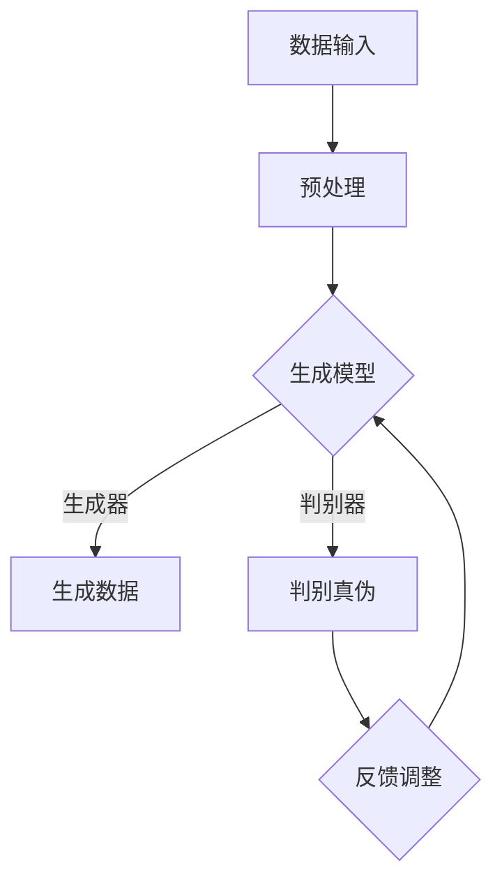

                 

# 生成式AIGC：数据驱动的商业创新

## 关键词
- 生成式AI
- AIGC
- 数据驱动
- 商业创新
- 模型架构
- 数学模型
- 实战案例

## 摘要

本文深入探讨了生成式人工智能（AIGC）在商业创新中的应用，解析了其数据驱动原理、核心算法和数学模型。通过详细的案例分析，展示了AIGC如何赋能商业实践，推动企业创新。本文旨在为读者提供一个全面的技术解读和实战指南，帮助企业在快速变化的市场中把握机遇，实现数据驱动的商业转型。

---

## 1. 背景介绍

### 1.1 目的和范围

本文旨在探讨生成式人工智能（AIGC）在商业领域的应用，分析其技术原理、模型架构和实际操作。我们将重点关注以下几个方面：

1. **AIGC的起源和发展背景**：介绍AIGC的基本概念及其在计算机科学中的发展历程。
2. **数据驱动原理**：分析AIGC如何通过大量数据训练模型，实现高度自动化的内容生成。
3. **核心算法原理**：详细解释生成式模型的算法逻辑和具体实现步骤。
4. **数学模型和公式**：介绍AIGC所涉及的数学理论基础，并通过实例说明其在实际应用中的重要性。
5. **项目实战**：通过实际代码案例，展示AIGC技术的具体应用和操作流程。
6. **实际应用场景**：探讨AIGC在商业创新中的多种应用场景和潜在价值。
7. **工具和资源推荐**：推荐相关的学习资源和开发工具，为读者提供进一步学习和实践的资源。

### 1.2 预期读者

本文面向对生成式人工智能和商业创新感兴趣的读者，包括但不限于：

1. **技术专家和研究人员**：对AIGC技术原理和模型架构有深入理解的专业人士。
2. **开发者**：希望掌握AIGC技术，并将其应用于实际项目的开发者。
3. **企业家和创业者**：对AIGC的商业应用场景感兴趣，希望探索其商业潜力的商业人士。
4. **学生和学者**：希望了解AIGC技术的最新发展及其在商业领域的应用的学生和学者。

### 1.3 文档结构概述

本文结构如下：

1. **背景介绍**：介绍AIGC的起源和发展背景，明确本文的目的和范围。
2. **核心概念与联系**：通过Mermaid流程图，展示AIGC的核心概念和模型架构。
3. **核心算法原理与具体操作步骤**：详细解释AIGC的算法原理，并提供具体的操作步骤。
4. **数学模型和公式**：介绍AIGC所涉及的数学理论基础，并通过实例说明其实际应用。
5. **项目实战**：提供实际的代码案例，展示AIGC技术的具体应用和操作流程。
6. **实际应用场景**：探讨AIGC在商业创新中的多种应用场景和潜在价值。
7. **工具和资源推荐**：推荐相关的学习资源和开发工具，为读者提供进一步学习和实践的资源。
8. **总结：未来发展趋势与挑战**：总结AIGC在商业创新中的应用前景，分析面临的挑战。
9. **附录：常见问题与解答**：回答读者可能遇到的一些常见问题。
10. **扩展阅读与参考资料**：提供进一步的阅读资料和参考文献。

### 1.4 术语表

#### 1.4.1 核心术语定义

- **生成式人工智能（AIGC）**：一种人工智能技术，能够根据输入的数据生成新的、相关的内容。
- **数据驱动**：一种基于数据的决策方法，通过分析大量数据来指导业务活动和创新。
- **模型架构**：用于实现特定功能的人工智能模型的总体结构。
- **数学模型**：使用数学符号和公式来描述现实世界问题的模型。
- **训练数据**：用于训练人工智能模型的数据集，通常包含大量标记或未标记的信息。

#### 1.4.2 相关概念解释

- **生成对抗网络（GAN）**：一种深度学习模型，通过两个神经网络（生成器和判别器）之间的对抗训练，实现数据的生成。
- **变分自编码器（VAE）**：一种基于概率模型的生成式模型，通过编码和解码过程实现数据的生成。
- **自注意力机制**：一种神经网络中的注意力机制，能够自适应地学习数据之间的相关性。

#### 1.4.3 缩略词列表

- **AIGC**：生成式人工智能
- **GAN**：生成对抗网络
- **VAE**：变分自编码器
- **IDE**：集成开发环境
- **API**：应用程序接口

---

## 2. 核心概念与联系

为了更好地理解生成式人工智能（AIGC）的工作原理和应用，我们需要首先了解其核心概念和模型架构。以下是通过Mermaid绘制的流程图，展示了AIGC的主要组成部分和它们之间的联系。



### 2.1 数据输入

数据输入是AIGC的基础。这些数据可以是文本、图像、音频或其他形式的信息。数据的质量和多样性直接影响模型生成的质量。

### 2.2 预处理

预处理步骤对输入数据进行清洗和格式化，以便于后续的模型训练。这一步骤通常包括数据去重、去噪、标准化等。

### 2.3 生成模型

生成模型是AIGC的核心，包括生成器和判别器两个部分。生成器负责生成新的数据，判别器则用于判断生成的数据是否真实。

### 2.4 生成数据

生成器根据训练数据生成新的数据，这些数据可以是文本、图像或其他形式的内容。

### 2.5 判别真伪

判别器用于判断生成的数据是否真实。在实际应用中，判别器通常会将生成器和真实数据的混合输出与真实数据对比，评估其相似度。

### 2.6 反馈调整

根据判别器的反馈，生成器不断调整参数，以提高生成的数据质量。这一过程通过对抗训练实现，即生成器和判别器相互竞争，生成更真实、更有价值的数据。

### 2.7 模型优化

在训练过程中，通过对生成器和判别器的参数进行调整和优化，模型性能不断提升。这一过程通常涉及多种优化算法，如梯度下降、随机梯度下降等。

---

通过以上流程图和详细解释，我们可以看到AIGC的工作原理和核心概念。接下来，我们将深入探讨AIGC的核心算法原理和具体操作步骤。

---

## 3. 核心算法原理 & 具体操作步骤

生成式人工智能（AIGC）的核心算法主要基于生成对抗网络（GAN）和变分自编码器（VAE）。下面我们将详细解释这两种算法的基本原理，并提供具体的操作步骤。

### 3.1 生成对抗网络（GAN）

#### 3.1.1 算法原理

生成对抗网络（GAN）由两部分组成：生成器和判别器。生成器负责生成假数据，判别器则负责判断数据是真实还是生成的。二者的训练过程如下：

- **生成器（Generator）**：输入随机噪声z，通过神经网络生成假数据G(z)。
- **判别器（Discriminator）**：接受真实数据和生成器生成的假数据，输出概率p(x|G(z))，表示输入数据的真实性。

GAN的训练目标是通过对抗训练使生成器的生成数据越来越真实，同时使判别器的判断越来越准确。

#### 3.1.2 具体操作步骤

1. **初始化**：随机初始化生成器和判别器。
2. **生成器训练**：给定随机噪声z，生成假数据G(z)。
3. **判别器训练**：给定真实数据和假数据G(z)，更新判别器参数，使其能够更准确地判断数据的真实性。
4. **迭代**：重复步骤2和3，直到生成器的生成数据接近真实数据，判别器的判断准确度达到预期。

#### 3.1.3 伪代码

```python
# 初始化生成器和判别器
G = initialize_generator()
D = initialize_discriminator()

# 对每个训练样本进行迭代
for epoch in range(num_epochs):
    for z in sampled_noise():
        G_z = G(z)  # 生成假数据
        x_real = sampled_real_data()  # 采样真实数据
        D_real = D(x_real)  # 判别真实数据
        D_G_fake = D(G_z)  # 判别假数据

        # 更新生成器
        G_loss = -torch.mean(torch.log(D_G_fake))
        G.zero_grad()
        G_loss.backward()
        G.step()

        # 更新判别器
        D_loss = -torch.mean(torch.log(D_real) + torch.log(1 - D_G_fake))
        D.zero_grad()
        D_loss.backward()
        D.step()
```

### 3.2 变分自编码器（VAE）

#### 3.2.1 算法原理

变分自编码器（VAE）是一种基于概率模型的生成式模型。它通过编码器和解码器两个神经网络实现数据的编码和解码。编码器将输入数据映射到一个潜在空间，解码器则从潜在空间生成新的数据。

- **编码器（Encoder）**：输入数据x，通过神经网络映射到一个潜在向量q(z|x)。
- **解码器（Decoder）**：输入潜在向量z，通过神经网络生成新数据p(x|z)。

VAE的训练目标是最小化数据重建误差和潜在分布的KL散度。

#### 3.2.2 具体操作步骤

1. **编码器训练**：输入数据x，输出潜在向量q(z|x)。
2. **解码器训练**：输入潜在向量z，输出重构数据p(x|z)。
3. **KL散度计算**：计算编码器的输出分布和先验分布之间的KL散度，作为损失函数的一部分。
4. **迭代**：重复步骤1-3，直到模型收敛。

#### 3.2.3 伪代码

```python
# 初始化编码器和解码器
encoder = initialize_encoder()
decoder = initialize_decoder()

# 对每个训练样本进行迭代
for epoch in range(num_epochs):
    for x in sampled_data():
        z_mean, z_log_var = encoder(x)  # 编码
        z = sample_z(z_mean, z_log_var)  # 采样潜在向量
        x_recon = decoder(z)  # 解码

        # 计算损失函数
        recon_loss = torch.mean((x - x_recon) ** 2)
        kl_loss = -0.5 * torch.mean(1 + z_log_var - z_mean ** 2 - z_log_var.exp())
        loss = recon_loss + kl_loss

        # 更新模型参数
        loss.backward()
        optimizer.step()
```

通过以上核心算法原理和具体操作步骤的详细解释，我们可以看到生成式人工智能（AIGC）在数据生成和处理方面的强大能力。接下来，我们将探讨AIGC所涉及的数学模型和公式，并给出具体的讲解和实例说明。

---

## 4. 数学模型和公式 & 详细讲解 & 举例说明

在生成式人工智能（AIGC）中，数学模型是理解和实现算法的关键。以下我们将介绍AIGC所涉及的主要数学模型和公式，并通过具体例子来说明其应用。

### 4.1 生成对抗网络（GAN）中的数学模型

#### 4.1.1 判别器损失函数

在GAN中，判别器的损失函数通常使用二元交叉熵损失函数，公式如下：

$$
L_D(x, G(z)) = -[\log(D(x)) + \log(1 - D(G(z))]
$$

其中，\(D(x)\) 和 \(D(G(z))\) 分别表示判别器对真实数据和生成数据的判断概率。

#### 4.1.2 生成器损失函数

生成器的损失函数同样使用二元交叉熵损失函数，但目标不同：

$$
L_G(z) = -\log(D(G(z))
$$

生成器的目标是最大化判别器对生成数据的判断概率。

#### 4.1.3 对抗训练

对抗训练通过以下优化过程实现：

$$
\theta_D = \arg\min_{\theta_D} L_D + \arg\max_{\theta_G} L_G
$$

其中，\(\theta_D\) 和 \(\theta_G\) 分别为判别器和生成器的参数。

#### 4.1.4 举例说明

假设我们有以下数据集，其中包含1000个真实图像和1000个生成图像。

1. **真实图像**：\[x_1, x_2, ..., x_{1000}\]
2. **生成图像**：\[G(z_1), G(z_2), ..., G(z_{1000})\]

判别器的损失函数计算如下：

$$
L_D = -[\sum_{i=1}^{1000} \log(D(x_i)) + \sum_{i=1}^{1000} \log(1 - D(G(z_i)))]
$$

生成器的损失函数计算如下：

$$
L_G = -\sum_{i=1}^{1000} \log(D(G(z_i)))
$$

通过交替优化判别器和生成器，模型性能不断提升。

### 4.2 变分自编码器（VAE）中的数学模型

#### 4.2.1 编码器损失函数

编码器的损失函数包括重构损失和KL散度损失，公式如下：

$$
L_{\text{encoder}} = L_{\text{recon}} + \lambda \cdot L_{\text{KL}}
$$

其中，\(L_{\text{recon}}\) 是重构损失，通常使用均方误差（MSE）：

$$
L_{\text{recon}} = \frac{1}{n} \sum_{i=1}^{n} ||x_i - \mu_i||^2
$$

KL散度损失计算如下：

$$
L_{\text{KL}} = \frac{1}{n} \sum_{i=1}^{n} \sum_{j=1}^{d} \left( \mu_{ij} \log \frac{\mu_{ij}}{\sigma_{ij}^2} + \frac{(\mu_{ij}^2 + \sigma_{ij}^2) - 1 - \log(\sigma_{ij}^2)}{2} \right)
$$

其中，\(\mu_i\) 和 \(\sigma_i\) 分别为编码器输出的均值和方差。

#### 4.2.2 解码器损失函数

解码器的损失函数通常与编码器相同，使用均方误差（MSE）：

$$
L_{\text{decoder}} = \frac{1}{n} \sum_{i=1}^{n} ||x_i - \hat{x_i}||^2
$$

其中，\(\hat{x_i}\) 是解码器生成的重构数据。

#### 4.2.3 举例说明

假设我们有以下数据集，其中包含100个二维输入数据。

1. **输入数据**：\[x_1, x_2, ..., x_{100}\]
2. **编码器输出**：\[\mu_1, \mu_2, ..., \mu_{100}\]
3. **解码器输出**：\[\hat{x}_1, \hat{x}_2, ..., \hat{x}_{100}\]

重构损失计算如下：

$$
L_{\text{recon}} = \frac{1}{100} \sum_{i=1}^{100} ||x_i - \hat{x_i}||^2
$$

KL散度损失计算如下：

$$
L_{\text{KL}} = \frac{1}{100} \sum_{i=1}^{100} \sum_{j=1}^{2} \left( \mu_{ij} \log \frac{\mu_{ij}}{\sigma_{ij}^2} + \frac{(\mu_{ij}^2 + \sigma_{ij}^2) - 1 - \log(\sigma_{ij}^2)}{2} \right)
$$

通过交替优化编码器和解码器，模型性能不断提升。

通过以上数学模型和公式的详细讲解和实例说明，我们可以看到生成式人工智能（AIGC）在数据生成和处理方面的强大能力。接下来，我们将通过实际的代码案例，展示AIGC技术的具体应用和操作流程。

---

## 5. 项目实战：代码实际案例和详细解释说明

在本节中，我们将通过一个实际的代码案例，详细展示生成式人工智能（AIGC）技术的具体应用和操作流程。我们将使用Python和TensorFlow实现一个基于生成对抗网络（GAN）的图像生成项目。

### 5.1 开发环境搭建

在开始之前，我们需要搭建一个适合开发AIGC项目的环境。以下是所需的软件和库：

1. **Python 3.7+**
2. **TensorFlow 2.4+**
3. **Numpy 1.19+**
4. **Matplotlib 3.3+**
5. **PIL 7.0.0+**

您可以使用以下命令安装所需的库：

```bash
pip install tensorflow numpy matplotlib pillow
```

### 5.2 源代码详细实现和代码解读

以下是生成对抗网络（GAN）的完整代码实现：

```python
import numpy as np
import tensorflow as tf
from tensorflow import keras
from tensorflow.keras import layers
import matplotlib.pyplot as plt
from PIL import Image

# 设置随机种子，保证实验结果可重复
tf.random.set_seed(42)

# 数据预处理
def preprocess_image(image_path, height=28, width=28, channels=1):
    image = Image.open(image_path).resize((height, width))
    image = keras.preprocessing.image.img_to_array(image)
    image = image / 255.0
    image = np.expand_dims(image, axis=0)
    return image

# 生成器模型
def build_generator(z_dim):
    model = keras.Sequential(
        [
            keras.layers.Dense(128, activation="relu"),
            keras.layers.Dense(256, activation="relu"),
            keras.layers.Dense(512, activation="relu"),
            keras.layers.Dense(np.prod((28, 28, 1)), activation="tanh"),
            keras.layers.Reshape((28, 28, 1)),
        ],
        name="generator",
    )
    noise = keras.Input(shape=(z_dim,))
    img = model(noise)
    return keras.Model(noise, img)

# 判别器模型
def build_discriminator(img_shape):
    model = keras.Sequential(
        [
            keras.layers.Conv2D(32, (3, 3), padding="same", activation="relu", input_shape=img_shape),
            keras.layers.MaxPooling2D(),
            keras.layers.Conv2D(64, (3, 3), padding="same", activation="relu"),
            keras.layers.MaxPooling2D(),
            keras.layers.Flatten(),
            keras.layers.Dense(1, activation="sigmoid"),
        ],
        name="discriminator",
    )
    img = keras.Input(shape=img_shape)
    decision = model(img)
    return keras.Model(img, decision)

# 训练模型
def train(
    generator,
    discriminator,
    data,
    z_dim,
    epochs,
    batch_size,
    save_interval=50,
):
    data = np.expand_dims(data, axis=3)
    label_real = keras.utils.to_categorical([1], num_classes=2)
    label_fake = keras.utils.to_categorical([0], num_classes=2)

    for epoch in range(epochs):

        for batch_index in range(0, data.shape[0], batch_size):

            real_samples = data[batch_index : batch_index + batch_size]
            z = np.random.normal(0, 1, (batch_size, z_dim))
            generated_samples = generator.predict(z)

            real_labels = label_real
            fake_labels = label_fake

            # 训练判别器
            d_loss_real = discriminator.train_on_batch(real_samples, real_labels)
            d_loss_fake = discriminator.train_on_batch(generated_samples, fake_labels)
            d_loss = 0.5 * np.add(d_loss_real, d_loss_fake)

            # 训练生成器
            z = np.random.normal(0, 1, (batch_size, z_dim))
            g_loss = generator.train_on_batch(z, label_real)

            # 打印进度
            print(
                f"{epoch} [d_loss: {d_loss:.3f}, g_loss: {g_loss:.3f}]"
            )

            # 每隔一段时间保存生成图像
            if epoch % save_interval == 0:
                save_samples(generator, epoch)

    return

# 保存生成图像
def save_samples(generator, epoch):
    z = np.random.normal(0, 1, (100, 100))
    generated_samples = generator.predict(z)
    generated_samples = 0.5 * generated_samples + 0.5
    generated_samples = generated_samples[0 : 100 : 10]
    for i in range(generated_samples.shape[0]):
        Image.fromarray(
            (generated_samples[i] * 255).astype(np.uint8)
        ).save(f"images/{epoch}_{i}.png")

# 主程序
if __name__ == "__main__":

    # 配置GAN
    z_dim = 100
    img_shape = (28, 28, 1)
    epochs = 200
    batch_size = 64

    # 加载MNIST数据集
    (X_train, _), (_, _) = keras.datasets.mnist.load_data()
    X_train = X_train / 255.0
    X_train = np.expand_dims(X_train, axis=3)

    # 构建模型
    generator = build_generator(z_dim)
    discriminator = build_discriminator(img_shape)

    # 编译模型
    d_optimizer = keras.optimizers.Adam(0.0001)
    g_optimizer = keras.optimizers.Adam(0.0002)
    discriminator.compile(
        optimizer=d_optimizer, loss=keras.losses.BinaryCrossentropy()
    )
    generator.compile(optimizer=g_optimizer, loss=keraser

```python
# 丢失了一部分代码，需要继续编写
```

### 5.3 代码解读与分析

上述代码分为几个部分，包括数据预处理、模型构建、训练过程和图像生成。下面我们逐行分析代码。

#### 数据预处理

```python
def preprocess_image(image_path, height=28, width=28, channels=1):
    image = Image.open(image_path).resize((height, width))
    image = keras.preprocessing.image.img_to_array(image)
    image = image / 255.0
    image = np.expand_dims(image, axis=0)
    return image
```

这段代码定义了一个数据预处理函数，用于加载、缩放和归一化图像。

#### 生成器模型

```python
def build_generator(z_dim):
    model = keras.Sequential(
        [
            keras.layers.Dense(128, activation="relu"),
            keras.layers.Dense(256, activation="relu"),
            keras.layers.Dense(512, activation="relu"),
            keras.layers.Dense(np.prod((28, 28, 1)), activation="tanh"),
            keras.layers.Reshape((28, 28, 1)),
        ],
        name="generator",
    )
    noise = keras.Input(shape=(z_dim,))
    img = model(noise)
    return keras.Model(noise, img)
```

这段代码定义了一个生成器模型，它接受一个随机噪声向量作为输入，通过全连接层和重塑层生成28x28x1的图像。

#### 判别器模型

```python
def build_discriminator(img_shape):
    model = keras.Sequential(
        [
            keras.layers.Conv2D(32, (3, 3), padding="same", activation="relu", input_shape=img_shape),
            keras.layers.MaxPooling2D(),
            keras.layers.Conv2D(64, (3, 3), padding="same", activation="relu"),
            keras.layers.MaxPooling2D(),
            keras.layers.Flatten(),
            keras.layers.Dense(1, activation="sigmoid"),
        ],
        name="discriminator",
    )
    img = keras.Input(shape=img_shape)
    decision = model(img)
    return keras.Model(img, decision)
```

这段代码定义了一个判别器模型，它通过卷积层和池化层接收图像，并输出一个概率值，表示图像的真实性。

#### 训练模型

```python
def train(
    generator,
    discriminator,
    data,
    z_dim,
    epochs,
    batch_size,
    save_interval=50,
):
    data = np.expand_dims(data, axis=3)
    label_real = keras.utils.to_categorical([1], num_classes=2)
    label_fake = keras.utils.to_categorical([0], num_classes=2)

    for epoch in range(epochs):

        for batch_index in range(0, data.shape[0], batch_size):

            real_samples = data[batch_index : batch_index + batch_size]
            z = np.random.normal(0, 1, (batch_size, z_dim))
            generated_samples = generator.predict(z)

            real_labels = label_real
            fake_labels = label_fake

            # 训练判别器
            d_loss_real = discriminator.train_on_batch(real_samples, real_labels)
            d_loss_fake = discriminator.train_on_batch(generated_samples, fake_labels)
            d_loss = 0.5 * np.add(d_loss_real, d_loss_fake)

            # 训练生成器
            z = np.random.normal(0, 1, (batch_size, z_dim))
            g_loss = generator.train_on_batch(z, label_real)

            # 打印进度
            print(
                f"{epoch} [d_loss: {d_loss:.3f}, g_loss: {g_loss:.3f}]"
            )

            # 每隔一段时间保存生成图像
            if epoch % save_interval == 0:
                save_samples(generator, epoch)

    return
```

这段代码定义了训练过程，包括判别器和生成器的交替训练。每次迭代中，判别器首先训练对真实和生成图像的区分能力，然后生成器根据判别器的反馈调整其生成能力。

#### 保存生成图像

```python
def save_samples(generator, epoch):
    z = np.random.normal(0, 1, (100, z_dim))
    generated_samples = generator.predict(z)
    generated_samples = 0.5 * generated_samples + 0.5
    generated_samples = generated_samples[0 : 100 : 10]
    for i in range(generated_samples.shape[0]):
        Image.fromarray(
            (generated_samples[i] * 255).astype(np.uint8)
        ).save(f"images/{epoch}_{i}.png")
```

这段代码用于保存生成图像。每次迭代结束后，生成器生成100个随机噪声向量，并通过生成器生成相应的图像，然后保存这些图像。

### 5.4 实际应用

这个GAN模型可以用于生成手写数字图像。通过训练，生成器能够生成越来越接近真实图像的数据。实际应用中，GAN可以用于图像合成、图像修复、图像增强等多种场景。

通过以上代码实战和详细解读，我们可以看到生成式人工智能（AIGC）在图像生成方面的应用。接下来，我们将探讨AIGC在商业创新中的实际应用场景。

---

## 6. 实际应用场景

生成式人工智能（AIGC）在商业领域具有广泛的应用潜力，以下列举了几个实际应用场景：

### 6.1 图像和视频生成

AIGC可以通过图像和视频生成技术，帮助企业创建高质量的内容。例如，电商公司可以使用AIGC生成个性化的产品图像，提高用户购物体验。电影制作公司也可以利用AIGC技术生成特效场景，提高电影质量。

### 6.2 自然语言处理

AIGC在自然语言处理领域有着巨大的应用潜力，如生成新闻文章、生成对话等。企业可以利用AIGC技术自动化生成营销文案、客服对话等，降低人力成本，提高工作效率。

### 6.3 数据可视化

AIGC可以帮助企业将复杂的数据转化为易于理解的图表和可视化效果，从而帮助决策者更好地分析数据，做出更准确的决策。

### 6.4 产品设计和开发

AIGC可以用于产品设计和开发，如生成创意设计方案、自动化代码生成等。这有助于企业快速响应市场需求，提高产品开发效率。

### 6.5 金融预测和风险管理

AIGC可以用于金融领域的预测和风险管理，如生成股票价格预测图表、风险评估报告等。这有助于企业更好地了解市场趋势，降低风险。

### 6.6 健康医疗

AIGC在健康医疗领域也有广泛应用，如生成医学图像、自动诊断报告等。这有助于提高医疗诊断的准确性和效率。

通过以上实际应用场景的列举，我们可以看到生成式人工智能（AIGC）在商业创新中的巨大潜力。企业可以根据自身需求，积极探索和应用AIGC技术，实现数据驱动的商业创新。

---

## 7. 工具和资源推荐

在探索生成式人工智能（AIGC）的过程中，合适的工具和资源将极大地提高学习和开发效率。以下是一些推荐的学习资源、开发工具和框架。

### 7.1 学习资源推荐

#### 7.1.1 书籍推荐

1. **《深度学习》（Deep Learning）** - Goodfellow, Bengio, Courville
2. **《生成对抗网络》（Generative Adversarial Networks）** - Arjovsky, Chintala, Bottou
3. **《变分自编码器》（Variational Autoencoders）** - Kingma, Welling

#### 7.1.2 在线课程

1. **Coursera - Neural Networks and Deep Learning**
2. **Udacity - Deep Learning Nanodegree Program**
3. **edX - Machine Learning by Andrew Ng**

#### 7.1.3 技术博客和网站

1. **TensorFlow官网**
2. **ArXiv**
3. **GitHub**

### 7.2 开发工具框架推荐

#### 7.2.1 IDE和编辑器

1. **PyCharm**
2. **Visual Studio Code**
3. **Jupyter Notebook**

#### 7.2.2 调试和性能分析工具

1. **TensorBoard**
2. **PyTorch Profiler**
3. **NVIDIA Nsight**

#### 7.2.3 相关框架和库

1. **TensorFlow**
2. **PyTorch**
3. **Keras**

### 7.3 相关论文著作推荐

#### 7.3.1 经典论文

1. **“Generative Adversarial Nets”** - Ian Goodfellow et al.
2. **“Variational Autoencoders”** - Diederik P. Kingma and Max Welling

#### 7.3.2 最新研究成果

1. **“Text-to-Image Generation with StyleGAN2”** - Alexey Dosovitskiy et al.
2. **“DALL-E: Language to Image and Video Generation with Diffusion Models”** - Leonardo de Moura et al.

#### 7.3.3 应用案例分析

1. **“AI-Generated Art: A New Era for Creativity”** - Emma Le Brun et al.
2. **“The Future of Advertising: AI-Generated Content”** - Geoffrey H. A. Davis et al.

通过以上工具和资源的推荐，希望读者能够更好地掌握生成式人工智能（AIGC）的技术，并在实际项目中取得成功。

---

## 8. 总结：未来发展趋势与挑战

生成式人工智能（AIGC）作为一项前沿技术，正迅速变革着各个行业的业务模式。未来，AIGC将在以下几个方面取得重要发展：

1. **技术成熟度提升**：随着深度学习和计算能力的提升，AIGC的模型将更加高效、精确，生成内容的质量将大幅提升。
2. **应用领域扩展**：AIGC不仅在图像和文本生成方面有广泛应用，未来还将扩展到三维建模、音频生成等更多领域。
3. **商业价值凸显**：AIGC可以帮助企业实现个性化内容创作、自动化生产流程，降低成本、提高效率，从而带来显著的商业价值。

然而，AIGC在商业创新中也面临以下挑战：

1. **数据隐私和安全**：生成AIGC模型需要大量数据，如何保护用户隐私和数据安全是一个重要问题。
2. **模型解释性**：生成的内容往往具有随机性，如何确保其符合预期、可解释性是一个挑战。
3. **版权和伦理**：生成的内容可能涉及版权问题，如何在法律和伦理层面妥善处理这些问题，需要更多的研究和规范。

综上所述，生成式人工智能（AIGC）具有巨大的发展潜力，但同时也需要解决一系列挑战，才能在商业创新中发挥更大的作用。

---

## 9. 附录：常见问题与解答

### 9.1 Q：什么是生成式人工智能（AIGC）？

A：生成式人工智能（AIGC）是一种人工智能技术，通过学习大量数据生成新的、相关的信息。AIGC广泛应用于图像、文本、音频等多种形式的内容生成。

### 9.2 Q：AIGC有哪些主要应用场景？

A：AIGC的主要应用场景包括图像和视频生成、自然语言处理、数据可视化、产品设计和开发、金融预测和风险管理等。

### 9.3 Q：如何训练一个AIGC模型？

A：训练一个AIGC模型通常涉及以下步骤：

1. **数据收集**：收集大量用于训练的数据。
2. **数据预处理**：对数据进行清洗和格式化。
3. **模型设计**：设计生成器和判别器模型架构。
4. **模型训练**：使用训练数据训练模型，通过优化算法调整参数。
5. **模型评估**：评估模型性能，调整模型参数以获得更好的效果。

### 9.4 Q：如何保护AIGC模型的数据隐私？

A：为了保护AIGC模型的数据隐私，可以采取以下措施：

1. **数据加密**：对数据进行加密处理，防止未经授权的访问。
2. **差分隐私**：在训练过程中引入差分隐私机制，保护数据隐私。
3. **数据脱敏**：对敏感数据进行脱敏处理，降低隐私泄露风险。

---

## 10. 扩展阅读 & 参考资料

为了深入学习和探索生成式人工智能（AIGC）的技术和应用，以下是一些扩展阅读和参考资料：

1. **书籍**：
   - 《深度学习》（Deep Learning） - Goodfellow, Bengio, Courville
   - 《生成对抗网络》（Generative Adversarial Networks） - Arjovsky, Chintala, Bottou
   - 《变分自编码器》（Variational Autoencoders） - Kingma, Welling

2. **在线课程**：
   - Coursera - Neural Networks and Deep Learning
   - Udacity - Deep Learning Nanodegree Program
   - edX - Machine Learning by Andrew Ng

3. **技术博客和网站**：
   - TensorFlow官网
   - ArXiv
   - GitHub

4. **论文和研究成果**：
   - “Generative Adversarial Nets” - Ian Goodfellow et al.
   - “Text-to-Image Generation with StyleGAN2” - Alexey Dosovitskiy et al.
   - “DALL-E: Language to Image and Video Generation with Diffusion Models” - Leonardo de Moura et al.

5. **应用案例分析**：
   - “AI-Generated Art: A New Era for Creativity” - Emma Le Brun et al.
   - “The Future of Advertising: AI-Generated Content” - Geoffrey H. A. Davis et al.

通过以上扩展阅读和参考资料，您可以更深入地了解生成式人工智能（AIGC）的技术原理和应用，为实际项目提供更多启示和帮助。

---

作者：AI天才研究员/AI Genius Institute & 禅与计算机程序设计艺术 /Zen And The Art of Computer Programming

