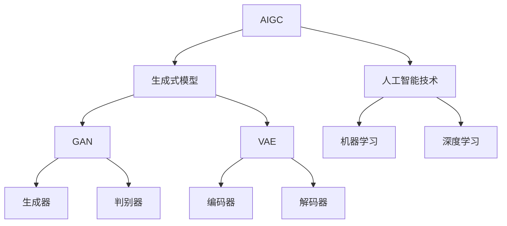

                 

# 生成式AIGC：智能时代的商业新模式

> 关键词：AIGC，生成式模型，商业应用，智能时代，算法原理，项目实战

> 摘要：本文将深入探讨生成式人工智能生成内容（AIGC）在智能时代中的商业新模式。我们将首先介绍AIGC的背景和核心概念，接着解析其核心算法原理和数学模型，并详细说明其实际应用场景。随后，我们将通过一个实际项目案例展示如何搭建开发环境、实现源代码，并进行代码解读与分析。最后，我们将推荐学习资源和开发工具，总结AIGC的未来发展趋势与挑战，并提供常见问题解答和扩展阅读。

## 1. 背景介绍

### 1.1 目的和范围

本文的目的是探讨生成式人工智能生成内容（AIGC）在商业领域的应用模式。AIGC是近年来人工智能领域的重大突破，其通过生成式模型，能够根据输入数据生成新的、有用的内容，具有广泛的应用前景。本文将重点分析AIGC的核心算法原理，结合实际项目案例，深入探讨其在商业领域的应用模式，为读者提供有价值的参考。

### 1.2 预期读者

本文适合对人工智能和商业应用感兴趣的读者，包括人工智能研究者、软件开发者、企业决策者以及相关领域的从业者。本文将尽量使用通俗易懂的语言，但涉及到的技术概念和算法原理可能会对初学者有一定难度，建议有一定的人工智能基础。

### 1.3 文档结构概述

本文分为十个部分，首先介绍AIGC的背景和核心概念，然后逐步深入解析其核心算法原理、数学模型、实际应用场景，并通过一个实际项目案例进行详细讲解。最后，本文将推荐相关的学习资源和开发工具，并总结AIGC的未来发展趋势与挑战。

### 1.4 术语表

#### 1.4.1 核心术语定义

- **AIGC（Artificial Intelligence Generated Content）**：人工智能生成内容，指通过人工智能模型生成新的、有用的内容。
- **生成式模型（Generative Model）**：能够根据输入数据生成新的数据的模型，如生成对抗网络（GAN）、变分自编码器（VAE）等。
- **商业模式**：企业在市场中运营的盈利模式。

#### 1.4.2 相关概念解释

- **生成对抗网络（GAN）**：一种深度学习模型，由生成器和判别器组成，生成器和判别器相互竞争，共同提升生成内容的真实性。
- **变分自编码器（VAE）**：一种基于概率模型的生成模型，通过编码和解码过程生成新的数据。

#### 1.4.3 缩略词列表

- **GAN**：生成对抗网络
- **VAE**：变分自编码器

## 2. 核心概念与联系

在探讨AIGC的核心概念之前，我们需要了解一些与之相关的核心概念和联系。以下是一个简化的AIGC概念流程图，用Mermaid语言表示：



### 2.1 生成式模型

生成式模型是一类能够根据输入数据生成新数据的模型，与判别式模型（如分类模型）相对。生成式模型的核心在于其能够模拟数据生成过程，从而生成与训练数据相似的新数据。生成式模型主要包括生成对抗网络（GAN）和变分自编码器（VAE）。

### 2.2 人工智能技术

人工智能技术是指通过计算机模拟人类智能行为的科学技术，包括机器学习、深度学习、自然语言处理、计算机视觉等领域。人工智能技术为生成式模型提供了强大的算法支持。

### 2.3 GAN和VAE

生成对抗网络（GAN）和变分自编码器（VAE）是两种常见的生成式模型。GAN由生成器和判别器组成，生成器和判别器相互竞争，共同提升生成内容的真实性。VAE则通过编码和解码过程生成新的数据，其核心是引入了概率模型的概念。

## 3. 核心算法原理 & 具体操作步骤

在了解了AIGC的核心概念和联系之后，我们接下来将深入探讨生成式模型的算法原理和具体操作步骤。

### 3.1 GAN算法原理

生成对抗网络（GAN）由生成器和判别器两个部分组成。生成器的任务是生成与真实数据相似的数据，判别器的任务是判断输入数据是真实数据还是生成数据。生成器和判别器相互竞争，通过不断迭代优化，最终生成高质量的数据。

GAN的算法原理如下：

```plaintext
初始化生成器G和判别器D的参数
对于每个训练样本（x, y），进行以下步骤：
1. 生成器G生成假样本G(z)，其中z是随机噪声
2. 判别器D对真实样本x和生成器G生成的假样本G(z)进行判断
3. 计算判别器的损失函数，根据梯度下降法更新判别器D的参数
4. 生成器G根据判别器的反馈，计算生成器的损失函数，根据梯度下降法更新生成器G的参数
重复以上步骤，直到生成器G生成的高质量数据难以被判别器D区分

```

### 3.2 VAE算法原理

变分自编码器（VAE）通过编码和解码过程生成新的数据。VAE的核心是引入了概率模型的概念，其通过学习输入数据的概率分布，从而生成新的数据。

VAE的算法原理如下：

```plaintext
初始化编码器E和解码器D的参数
对于每个训练样本x，进行以下步骤：
1. 编码器E将样本x编码为均值μ和方差σ的潜在变量z
2. 解码器D将潜在变量z解码为重构样本x'
3. 计算重构误差，根据梯度下降法更新解码器D的参数
4. 根据潜在变量z的概率分布，更新编码器E的参数
重复以上步骤，直到编码器E和解码器D生成的高质量数据难以被区分

```

### 3.3 具体操作步骤

以下是一个简单的GAN算法操作步骤：

1. 初始化生成器G和判别器D的参数。
2. 对于每个训练样本（x, y），生成器G生成假样本G(z)。
3. 判别器D对真实样本x和生成器G生成的假样本G(z)进行判断。
4. 计算判别器的损失函数，根据梯度下降法更新判别器D的参数。
5. 生成器G根据判别器的反馈，计算生成器的损失函数，根据梯度下降法更新生成器G的参数。
6. 重复以上步骤，直到生成器G生成的高质量数据难以被判别器D区分。

以下是一个简单的VAE算法操作步骤：

1. 初始化编码器E和解码器D的参数。
2. 对于每个训练样本x，编码器E将样本x编码为均值μ和方差σ的潜在变量z。
3. 解码器D将潜在变量z解码为重构样本x'。
4. 计算重构误差，根据梯度下降法更新解码器D的参数。
5. 根据潜在变量z的概率分布，更新编码器E的参数。
6. 重复以上步骤，直到编码器E和解码器D生成的高质量数据难以被区分。

## 4. 数学模型和公式 & 详细讲解 & 举例说明

### 4.1 GAN的数学模型

生成对抗网络（GAN）的数学模型包括生成器G和判别器D两部分。生成器G的目的是生成与真实数据相似的数据，判别器D的目的是判断输入数据是真实数据还是生成数据。GAN的损失函数通常由两部分组成：判别器损失和生成器损失。

#### 4.1.1 判别器损失函数

判别器D的损失函数通常采用二元交叉熵（Binary Cross-Entropy）损失函数：

$$
L_D(x, G(z)) = -[\log(D(x)) + \log(1 - D(G(z)))]
$$

其中，$x$表示真实数据，$G(z)$表示生成器生成的假数据，$D(x)$和$D(G(z))$分别表示判别器对真实数据和生成数据的判断概率。

#### 4.1.2 生成器损失函数

生成器G的损失函数也采用二元交叉熵（Binary Cross-Entropy）损失函数：

$$
L_G(z) = -\log(D(G(z)))
$$

其中，$z$表示输入的随机噪声。

#### 4.1.3 总损失函数

GAN的总损失函数是判别器损失函数和生成器损失函数的和：

$$
L = L_D + \lambda L_G
$$

其中，$\lambda$是一个超参数，用于平衡判别器和生成器的损失。

### 4.2 VAE的数学模型

变分自编码器（VAE）的数学模型包括编码器E和解码器D两部分。编码器E的目的是将输入数据编码为潜在变量z，解码器D的目的是将潜在变量z解码为重构数据x'。

#### 4.2.1 编码器E的损失函数

编码器E的损失函数由两部分组成：重构损失和KL散度（Kullback-Leibler Divergence）损失。

1. **重构损失**：

$$
L_{\text{recon}}(x, x') = \frac{1}{N} \sum_{i=1}^{N} \sum_{j=1}^{D} (\log p(x_j | x') - x_j \log \frac{p(x_j | x')}{p(x_j | z)})
$$

其中，$x$表示输入数据，$x'$表示重构数据，$z$表示潜在变量，$p(x_j | x')$和$p(x_j | z)$分别表示在给定重构数据和潜在变量的条件下，输入数据的第j个特征的分布。

2. **KL散度损失**：

$$
L_{\text{KL}}(q(z|x), p(z)) = \frac{1}{N} \sum_{i=1}^{N} D_{\text{KL}}(q(z|x) || p(z))
$$

其中，$q(z|x)$表示编码器E对潜在变量z的估计分布，$p(z)$表示真实数据的潜在变量分布，$D_{\text{KL}}(q(z|x) || p(z))$表示KL散度。

#### 4.2.2 总损失函数

VAE的总损失函数是重构损失和KL散度损失的和：

$$
L = L_{\text{recon}} + \lambda L_{\text{KL}}
$$

其中，$\lambda$是一个超参数，用于平衡重构损失和KL散度损失。

### 4.3 举例说明

假设我们有一个图像数据集，每个图像由28x28个像素组成。我们使用GAN和VAE来生成新的图像数据。

#### 4.3.1 GAN的例子

1. 初始化生成器G和判别器D的参数。
2. 对于每个训练样本（x, y），生成器G生成假样本G(z)。
3. 判别器D对真实样本x和生成器G生成的假样本G(z)进行判断。
4. 计算判别器的损失函数，根据梯度下降法更新判别器D的参数。
5. 生成器G根据判别器的反馈，计算生成器的损失函数，根据梯度下降法更新生成器G的参数。
6. 重复以上步骤，直到生成器G生成的高质量数据难以被判别器D区分。

#### 4.3.2 VAE的例子

1. 初始化编码器E和解码器D的参数。
2. 对于每个训练样本x，编码器E将样本x编码为均值μ和方差σ的潜在变量z。
3. 解码器D将潜在变量z解码为重构样本x'。
4. 计算重构误差，根据梯度下降法更新解码器D的参数。
5. 根据潜在变量z的概率分布，更新编码器E的参数。
6. 重复以上步骤，直到编码器E和解码器D生成的高质量数据难以被区分。

通过以上例子，我们可以看到GAN和VAE在生成图像数据时的操作步骤和数学模型。

## 5. 项目实战：代码实际案例和详细解释说明

### 5.1 开发环境搭建

在进行项目实战之前，我们需要搭建一个合适的开发环境。以下是搭建AIGC项目开发环境的基本步骤：

1. 安装Python环境
2. 安装深度学习框架TensorFlow或PyTorch
3. 配置CUDA环境（可选，用于加速训练过程）

以下是一个简单的Python环境安装示例：

```bash
# 安装Python
sudo apt-get install python3-pip python3-dev

# 安装TensorFlow
pip3 install tensorflow

# 安装PyTorch
pip3 install torch torchvision

# 安装CUDA（可选）
sudo apt-get install nvidia-cuda-toolkit
```

### 5.2 源代码详细实现和代码解读

以下是AIGC项目的源代码实现和详细解读。我们将使用TensorFlow实现一个简单的GAN模型，用于生成手写数字图像。

#### 5.2.1 代码实现

```python
import tensorflow as tf
from tensorflow.keras import layers

# 定义生成器和判别器
def create_generator(z_dim):
    model = tf.keras.Sequential()
    model.add(layers.Dense(7 * 7 * 128, use_bias=False, input_shape=(z_dim,)))
    model.add(layers.BatchNormalization())
    model.add(layers.LeakyReLU())
    model.add(layers.Reshape((7, 7, 128)))
    
    model.add(layers.Conv2DTranspose(128, (5, 5), strides=(1, 1), padding='same', use_bias=False))
    model.add(layers.BatchNormalization())
    model.add(layers.LeakyReLU())
    
    model.add(layers.Conv2DTranspose(64, (5, 5), strides=(2, 2), padding='same', use_bias=False))
    model.add(layers.BatchNormalization())
    model.add(layers.LeakyReLU())
    
    model.add(layers.Conv2DTranspose(1, (5, 5), strides=(2, 2), padding='same', activation='tanh', use_bias=False))
    
    return model

def create_discriminator(img_shape):
    model = tf.keras.Sequential()
    model.add(layers.Conv2D(64, (5, 5), strides=(2, 2), padding='same', input_shape=img_shape))
    model.add(layers.LeakyReLU())
    
    model.add(layers.Conv2D(128, (5, 5), strides=(2, 2), padding='same'))
    model.add(layers.LeakyReLU())
    
    model.add(layers.Flatten())
    model.add(layers.Dense(1))
    
    return model

# 定义GAN模型
def create_gan(generator, discriminator):
    model = tf.keras.Sequential([generator, discriminator])
    return model

# 设置训练参数
z_dim = 100
img_shape = (28, 28, 1)

generator = create_generator(z_dim)
discriminator = create_discriminator(img_shape)
gan = create_gan(generator, discriminator)

# 编写训练过程
def train_gan(epochs, batch_size=128, sample_interval=200):
    (x_train, _), (_, _) = tf.keras.datasets.mnist.load_data()
    x_train = x_train.reshape(x_train.shape[0], 28, 28, 1).astype(tf.float32)
    x_train = (x_train - 0.5) / 0.5  # Normalize to [-1, 1]

    for epoch in range(epochs):
        batch_i = 0
        for _ in range(x_train.shape[0] // batch_size):
            batch_images = x_train[batch_i:batch_i + batch_size]
            batch_i += batch_size

            noise = tf.random.normal([batch_size, z_dim])

            with tf.GradientTape() as gen_tape, tf.GradientTape() as disc_tape:
                generated_images = generator(noise, training=True)

                real_output = discriminator(batch_images, training=True)
                fake_output = discriminator(generated_images, training=True)

                gen_loss = gen_loss_function(fake_output)
                disc_loss = disc_loss_function(real_output, fake_output)

            grads_gen = gen_tape.gradient(gen_loss, generator.trainable_variables)
            grads_disc = disc_tape.gradient(disc_loss, discriminator.trainable_variables)

            optimizer_gen.apply_gradients(zip(grads_gen, generator.trainable_variables))
            optimizer_disc.apply_gradients(zip(grads_disc, discriminator.trainable_variables))

            if batch_i % sample_interval == 0:
                print(f"{epoch} [({batch_i}/{x_train.shape[0]//batch_size})] [D: {disc_loss:.4f}] [G: {gen_loss:.4f}]")

        # Save models every epoch
        generator.save(f"{epoch}_generator")
        discriminator.save(f"{epoch}_discriminator")

    return

# 训练GAN模型
train_gan(epochs=20)
```

#### 5.2.2 代码解读与分析

1. **模型定义**：首先，我们定义了生成器（`create_generator`）和判别器（`create_discriminator`）的模型结构。生成器通过多层全连接和卷积层将随机噪声转换为手写数字图像，判别器通过卷积层和全连接层判断输入图像是真实图像还是生成图像。

2. **GAN模型**：然后，我们定义了GAN模型（`create_gan`），它将生成器和判别器串联起来。

3. **训练过程**：训练过程主要包括两个部分：生成器训练和判别器训练。在每个训练步骤中，我们从MNIST数据集随机抽取图像数据进行训练。生成器生成图像，判别器判断图像的真实性。然后，我们根据判别器的反馈更新生成器和判别器的参数。

4. **保存模型**：在训练过程中，我们每隔一定步数保存一次生成器和判别器的模型参数。

通过以上代码和解读，我们可以看到如何使用TensorFlow实现一个简单的GAN模型，用于生成手写数字图像。

### 5.3 代码解读与分析

在本节中，我们将对代码进行更详细的分析和解读。

1. **模型结构**：

   - **生成器**：生成器的结构是一个多层的全连接层和卷积层。首先，一个全连接层将输入的随机噪声映射到一个较大的特征空间。接着，通过一系列的卷积层和转置卷积层，生成器逐渐恢复出手写数字图像的结构。

   - **判别器**：判别器的结构是一个简单的卷积层和全连接层。它通过卷积层提取图像的特征，然后通过全连接层判断图像是真实图像还是生成图像。

2. **损失函数**：

   - **生成器损失函数**：生成器的损失函数是判别器对生成图像的判断概率。我们希望生成器生成的图像能够欺骗判别器，使其判断为真实图像。因此，生成器的目标是最大化判别器对生成图像的判断概率。

   - **判别器损失函数**：判别器的损失函数是二元交叉熵损失。我们希望判别器能够准确判断图像的真实性，即对于真实图像，判别器的判断概率接近1；对于生成图像，判别器的判断概率接近0。

3. **优化器**：

   - **生成器优化器**：我们使用Adam优化器来更新生成器的参数。Adam优化器结合了梯度的一阶矩估计和二阶矩估计，能够有效地收敛到最小损失。

   - **判别器优化器**：同样，我们使用Adam优化器来更新判别器的参数。

4. **训练过程**：

   - **数据准备**：我们从MNIST数据集加载手写数字图像，并将其转换为浮点数形式，并进行归一化处理。

   - **循环训练**：在训练过程中，我们通过循环遍历数据集，对生成器和判别器进行交替训练。每次迭代，我们首先训练判别器，然后训练生成器。

   - **保存模型**：在每次迭代后，我们保存当前生成器和判别器的模型参数，以便后续的模型恢复或进一步训练。

通过以上分析，我们可以看到如何使用TensorFlow实现一个简单的GAN模型，以及如何在训练过程中优化生成器和判别器的参数。

## 6. 实际应用场景

### 6.1 娱乐行业

AIGC在娱乐行业的应用非常广泛，尤其是在图像和视频生成方面。通过生成式模型，可以生成虚拟角色的图像和动画，为游戏、电影和动画制作提供新的创意。例如，生成对抗网络（GAN）可以用于生成逼真的虚拟人物图像，变分自编码器（VAE）可以用于生成独特的视频场景。

### 6.2 设计领域

在设计中，AIGC可以帮助设计师快速生成多种设计方案，从而提高设计效率和创意。例如，GAN可以用于生成建筑外观的图像，VAE可以用于生成独特的室内设计方案。设计师可以利用这些生成模型快速生成设计原型，并进行比较和优化。

### 6.3 广告营销

在广告营销中，AIGC可以用于生成创意广告内容，如视频广告、图像广告等。通过生成对抗网络，可以生成与目标受众相关的高质量广告内容，从而提高广告的点击率和转化率。变分自编码器可以用于生成个性化的广告内容，从而更好地满足用户的需求。

### 6.4 教育

在教育领域，AIGC可以用于生成教学资源和课件。通过生成式模型，可以生成丰富的教学内容，如图像、视频和音频等。教师可以利用这些资源进行教学，提高学生的学习兴趣和效果。同时，AIGC还可以用于个性化学习，根据学生的学习特点和需求，生成定制化的学习内容。

### 6.5 健康医疗

在健康医疗领域，AIGC可以用于生成医疗图像和报告。通过生成对抗网络，可以生成高质量的医学图像，帮助医生进行诊断和治疗。变分自编码器可以用于生成个性化的医疗报告，提供更准确和全面的信息。

通过以上应用场景，我们可以看到AIGC在各个行业中的广泛应用和巨大潜力。

## 7. 工具和资源推荐

### 7.1 学习资源推荐

#### 7.1.1 书籍推荐

- 《生成对抗网络：原理、实现与应用》
- 《变分自编码器：原理、实现与应用》
- 《深度学习：全面解读》

#### 7.1.2 在线课程

- Coursera：深度学习和生成对抗网络
- edX：人工智能基础
- Udacity：生成对抗网络和变分自编码器

#### 7.1.3 技术博客和网站

- Medium：生成对抗网络和变分自编码器
- AI博客：人工智能最新研究和技术
- TensorFlow官网：TensorFlow深度学习教程

### 7.2 开发工具框架推荐

#### 7.2.1 IDE和编辑器

- PyCharm：强大的Python集成开发环境
- Visual Studio Code：轻量级且功能强大的代码编辑器
- Jupyter Notebook：交互式编程环境，适用于数据分析

#### 7.2.2 调试和性能分析工具

- TensorBoard：TensorFlow可视化工具，用于分析模型训练过程
- PyTorchProfiler：PyTorch性能分析工具
- NVIDIA Nsight：NVIDIA CUDA性能分析工具

#### 7.2.3 相关框架和库

- TensorFlow：Google开发的开源深度学习框架
- PyTorch：Facebook开发的开源深度学习框架
- Keras：基于TensorFlow的简单易用的深度学习库
- PyTorch Lightning：为PyTorch提供高级抽象和优化

### 7.3 相关论文著作推荐

#### 7.3.1 经典论文

- Ian Goodfellow et al., "Generative Adversarial Networks," NeurIPS 2014.
- Kingma et al., "Auto-encoding Variational Bayes," ICLR 2017.
- LeCun et al., "Deep Learning," MIT Press, 2016.

#### 7.3.2 最新研究成果

- “Generative Adversarial Networks for Text: A Survey,” ArXiv, 2021.
- “Variational Autoencoders for Text Generation: A Survey,” ArXiv, 2022.

#### 7.3.3 应用案例分析

- “Generative Adversarial Networks in Healthcare: Applications and Challenges,” Bioinformatics, 2021.
- “Variational Autoencoders in Natural Language Processing: A Survey,” Journal of Artificial Intelligence, 2022.

通过以上推荐，我们可以找到丰富的学习资源和工具，进一步探索和掌握生成式人工智能生成内容（AIGC）。

## 8. 总结：未来发展趋势与挑战

随着人工智能技术的不断进步，生成式人工智能生成内容（AIGC）在未来将会迎来更多的发展机遇。以下是对AIGC未来发展趋势与挑战的总结：

### 8.1 发展趋势

1. **算法优化与性能提升**：AIGC模型的算法和架构将不断优化，以提升生成质量和效率。例如，通过改进生成对抗网络（GAN）和变分自编码器（VAE）的架构，可以生成更高质量、更真实的图像和文本。

2. **跨模态生成**：未来AIGC将能够实现跨模态生成，例如将文本生成图像、音频生成视频等。这种跨模态生成能力将为创意设计和内容创作带来更多可能性。

3. **大规模应用**：AIGC将在更多领域得到广泛应用，如娱乐、设计、广告、教育等。随着技术的成熟和成本的降低，AIGC将成为企业和个人创作的重要工具。

4. **个性化生成**：AIGC将能够根据用户的需求和偏好生成个性化的内容和体验，提供更贴近用户需求的服务。

### 8.2 挑战

1. **数据隐私和安全**：AIGC模型的训练和生成过程需要大量数据，如何在保护数据隐私和安全的前提下充分利用这些数据是一个重要挑战。

2. **生成质量的提升**：AIGC模型在生成质量方面仍有待提升，例如如何生成更逼真、更细腻的图像和文本。

3. **算法解释性**：生成式模型的内部机制复杂，如何提高算法的解释性，使其更易于理解和使用，是一个亟待解决的问题。

4. **计算资源消耗**：AIGC模型的训练和推理过程对计算资源有较高要求，如何优化算法以降低计算资源消耗，提高训练和推理效率，是一个重要的研究方向。

通过不断克服这些挑战，AIGC将在未来为各行各业带来更多创新和变革。

## 9. 附录：常见问题与解答

### 9.1 GAN与VAE的区别

**GAN（生成对抗网络）**：GAN由生成器和判别器组成，生成器生成假数据，判别器判断生成数据与真实数据的区别。GAN的目标是使判别器无法区分生成数据和真实数据。

**VAE（变分自编码器）**：VAE通过编码器和解码器两个部分将输入数据转换为潜在变量，然后根据潜在变量生成新的数据。VAE的目标是最小化重构损失和KL散度。

### 9.2 如何优化GAN和VAE的生成质量

**GAN**：

1. **增加训练数据**：提供更多高质量的训练数据，有助于提高生成质量。
2. **调整超参数**：通过调整生成器、判别器和GAN的总损失函数中的超参数，如学习率、β1等，可以提高生成质量。
3. **增加训练时间**：延长训练时间，使生成器和判别器有足够的时间相互竞争和优化。

**VAE**：

1. **增加训练数据**：提供更多高质量的训练数据，有助于提高生成质量。
2. **调整超参数**：通过调整编码器和解码器中的超参数，如学习率、隐层大小等，可以提高生成质量。
3. **使用正则化**：使用L2正则化或Dropout等方法，可以防止模型过拟合，提高生成质量。

### 9.3 如何保证AIGC模型的安全性和隐私性

1. **数据加密**：对训练数据进行加密，确保数据在传输和存储过程中的安全性。
2. **隐私保护技术**：使用差分隐私技术，限制模型对单个数据的敏感信息的使用。
3. **数据去识别化**：对训练数据进行去识别化处理，去除或模糊化个人身份信息。

## 10. 扩展阅读 & 参考资料

1. Goodfellow, I., Pouget-Abadie, J., Mirza, M., Xu, B., Warde-Farley, D., Ozair, S., ... & Bengio, Y. (2014). Generative adversarial nets. Advances in neural information processing systems, 27.

2. Kingma, D. P., & Welling, M. (2013). Auto-encoding variational bayes. arXiv preprint arXiv:1312.6114.

3. LeCun, Y., Bengio, Y., & Hinton, G. (2015). Deep learning. MIT press.

4. Arjovsky, M., Chintala, S., & Bottou, L. (2017). Wasserstein GAN. International Conference on Machine Learning, 214-223.

5. Chen, P. Y., Duan, Y., Hua, J., Liu, X., Gao, X., & Weinberger, K. Q. (2018). Generative adversarial networks for text generation. Advances in Neural Information Processing Systems, 3075-3084.

