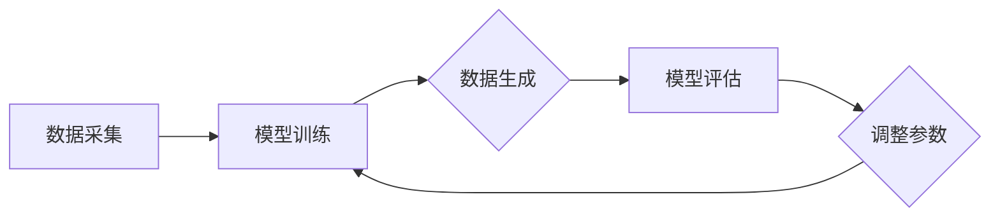

                 

# 生成模型在虚拟现实内容创作中的应用

> 关键词：生成模型、虚拟现实、内容创作、算法原理、数学模型、项目实战、应用场景

> 摘要：本文将深入探讨生成模型在虚拟现实（VR）内容创作中的应用，从核心概念、算法原理、数学模型到项目实战，全面解析生成模型如何赋能虚拟现实内容创作。通过本篇文章，读者可以了解生成模型的基本原理、应用领域，以及如何在虚拟现实内容创作中发挥其独特优势。

## 1. 背景介绍

### 1.1 目的和范围

本文旨在探讨生成模型在虚拟现实（VR）内容创作中的应用，重点分析其核心原理、数学模型以及具体操作步骤。文章将涵盖以下几个方面：

1. **生成模型的基本概念与原理**：介绍生成模型的基本概念，包括生成对抗网络（GAN）、变分自编码器（VAE）等，分析其工作原理和应用范围。
2. **虚拟现实内容创作需求**：探讨虚拟现实内容创作面临的挑战，如数据量大、实时性要求高等，阐述生成模型如何解决这些问题。
3. **生成模型在VR内容创作中的应用**：通过具体案例展示生成模型在虚拟现实场景中的实际应用，如场景生成、角色建模、动画制作等。
4. **数学模型和算法原理**：详细讲解生成模型中的数学模型和算法原理，包括损失函数、优化策略等。
5. **项目实战与代码实现**：提供实际项目案例，详细介绍生成模型在虚拟现实内容创作中的具体实现步骤和代码解析。
6. **应用场景与未来趋势**：分析生成模型在虚拟现实内容创作中的实际应用场景，探讨未来发展趋势与面临的挑战。

### 1.2 预期读者

本文主要面向以下读者群体：

1. **计算机科学和人工智能领域的研究人员和开发者**：对生成模型和虚拟现实内容创作有兴趣的专业人士。
2. **虚拟现实内容创作者**：希望通过技术手段提升内容创作效率和质量的内容创作者。
3. **对生成模型和虚拟现实感兴趣的一般读者**：希望了解生成模型在虚拟现实内容创作中应用的一般读者。

### 1.3 文档结构概述

本文结构如下：

1. **背景介绍**：介绍生成模型在虚拟现实内容创作中的应用背景、目的和范围。
2. **核心概念与联系**：阐述生成模型的基本概念、原理和联系。
3. **核心算法原理 & 具体操作步骤**：详细讲解生成模型的算法原理和操作步骤。
4. **数学模型和公式 & 详细讲解 & 举例说明**：介绍生成模型中的数学模型和公式，并举例说明。
5. **项目实战：代码实际案例和详细解释说明**：提供实际项目案例，解析生成模型在虚拟现实内容创作中的具体应用。
6. **实际应用场景**：分析生成模型在虚拟现实内容创作中的实际应用场景。
7. **工具和资源推荐**：推荐学习资源、开发工具和框架。
8. **总结：未来发展趋势与挑战**：总结生成模型在虚拟现实内容创作中的应用前景和挑战。
9. **附录：常见问题与解答**：解答读者可能遇到的常见问题。
10. **扩展阅读 & 参考资料**：提供更多相关阅读资料。

### 1.4 术语表

#### 1.4.1 核心术语定义

- **生成模型**：一种机器学习模型，用于生成新的数据，使生成的数据与训练数据相似。
- **虚拟现实（VR）**：一种模拟现实或构建虚拟环境的技术，通过计算机技术和传感器技术，使用户沉浸在一个虚拟世界中。
- **内容创作**：指在虚拟现实环境中生成、编辑和呈现各种虚拟内容的过程。

#### 1.4.2 相关概念解释

- **生成对抗网络（GAN）**：一种生成模型，由生成器和判别器两个神经网络组成，通过相互竞争来生成与真实数据相似的数据。
- **变分自编码器（VAE）**：一种生成模型，通过概率编码和解码过程来生成新的数据。
- **损失函数**：用于评估生成模型性能的函数，通常用于训练过程中。

#### 1.4.3 缩略词列表

- **GAN**：生成对抗网络（Generative Adversarial Networks）
- **VAE**：变分自编码器（Variational Autoencoder）
- **VR**：虚拟现实（Virtual Reality）

## 2. 核心概念与联系

在探讨生成模型在虚拟现实内容创作中的应用之前，我们首先需要了解生成模型的基本概念、原理以及与其他相关技术的联系。本节将详细介绍这些核心概念和原理，并通过Mermaid流程图展示其结构。

### 2.1 生成模型的基本概念

生成模型是一种通过学习数据分布来生成新的数据的机器学习模型。生成模型主要有以下几种：

- **生成对抗网络（GAN）**：由生成器和判别器两个神经网络组成，生成器和判别器之间进行博弈，生成器试图生成与真实数据相似的数据，而判别器则试图区分生成数据与真实数据。
- **变分自编码器（VAE）**：通过概率编码和解码过程来生成新的数据，变分自编码器将输入数据映射到一个潜在空间，然后从潜在空间生成新的数据。
- **自编码器**：一种无监督学习算法，通过学习输入数据的压缩表示来生成新的数据。

### 2.2 生成模型的工作原理

生成模型的工作原理可以概括为以下步骤：

1. **数据采集**：收集大量真实数据作为训练数据。
2. **模型训练**：使用训练数据训练生成模型，使其能够生成与真实数据相似的数据。
3. **数据生成**：通过生成模型生成新的数据，这些数据可以是图像、音频、文本等。
4. **模型评估**：使用评估指标（如损失函数）来评估生成模型的性能，并根据评估结果调整模型参数。

### 2.3 生成模型与其他技术的联系

生成模型在虚拟现实内容创作中有着广泛的应用，与其他技术密切相关：

- **增强现实（AR）**：生成模型可以用于生成虚拟对象，将其叠加在真实世界中，实现增强现实效果。
- **计算机图形学**：生成模型可以用于生成高质量的图像、场景和角色，提高虚拟现实内容的视觉效果。
- **自然语言处理（NLP）**：生成模型可以用于生成文本、对话和故事，为虚拟现实内容创作提供丰富的叙事元素。

### 2.4 Mermaid流程图

以下是生成模型在虚拟现实内容创作中的应用流程图：



## 3. 核心算法原理 & 具体操作步骤

在了解了生成模型的基本概念和原理后，我们将进一步探讨生成模型的核心算法原理和具体操作步骤。本节将详细讲解生成对抗网络（GAN）和变分自编码器（VAE）这两种生成模型，并使用伪代码展示其具体操作步骤。

### 3.1 生成对抗网络（GAN）

生成对抗网络（GAN）是一种由生成器和判别器组成的生成模型。生成器尝试生成与真实数据相似的数据，而判别器则试图区分生成数据和真实数据。GAN的工作原理可以概括为以下步骤：

#### 3.1.1 生成器（Generator）

生成器的目的是生成与真实数据相似的数据。生成器的输入是一个随机噪声向量，输出是生成数据。生成器的目标是最小化判别器判断生成数据的概率。

```python
# 生成器伪代码
def generator(z):
    # 输入：随机噪声向量 z
    # 输出：生成数据 x
    x = ...
    return x
```

#### 3.1.2 判别器（Discriminator）

判别器的目的是判断输入数据是真实数据还是生成数据。判别器的输入是真实数据或生成数据，输出是概率值，表示输入数据是真实数据的概率。

```python
# 判别器伪代码
def discriminator(x):
    # 输入：数据 x
    # 输出：概率值 p(x)
    p_x = ...
    return p_x
```

#### 3.1.3 损失函数

GAN的训练过程是一个博弈过程，生成器和判别器交替训练。损失函数用于评估生成器和判别器的性能。常用的损失函数是二元交叉熵损失函数。

```python
# 二元交叉熵损失函数伪代码
def binary_crossentropy(true_labels, predicted_labels):
    # 输入：真实标签 true_labels 和预测标签 predicted_labels
    # 输出：损失值 loss
    loss = ...
    return loss
```

#### 3.1.4 操作步骤

1. **初始化生成器和判别器**：随机初始化生成器和判别器的参数。
2. **生成器训练**：生成器生成一批生成数据，判别器判断这些生成数据是否真实。
3. **判别器训练**：判别器使用真实数据和生成数据进行训练，调整判别器的参数。
4. **迭代更新**：重复步骤2和3，直到生成器生成的数据与真实数据非常相似。

### 3.2 变分自编码器（VAE）

变分自编码器（VAE）是一种基于概率编码的生成模型。VAE通过学习输入数据的概率分布来生成新的数据。VAE的工作原理可以概括为以下步骤：

#### 3.2.1 编码器（Encoder）

编码器的目的是将输入数据映射到一个潜在空间，并学习输入数据的概率分布。

```python
# 编码器伪代码
def encoder(x):
    # 输入：输入数据 x
    # 输出：编码结果 z
    z = ...
    return z
```

#### 3.2.2 解码器（Decoder）

解码器的目的是将潜在空间中的数据解码为生成数据。

```python
# 解码器伪代码
def decoder(z):
    # 输入：编码结果 z
    # 输出：生成数据 x
    x = ...
    return x
```

#### 3.2.3 损失函数

VAE的损失函数由两个部分组成：数据重建损失和先验损失。数据重建损失用于衡量输入数据和生成数据之间的相似度，先验损失用于约束潜在空间中的数据分布。

```python
# VAE损失函数伪代码
def vae_loss(x, x_hat, z, z_hat):
    # 输入：输入数据 x，生成数据 x_hat，编码结果 z，解码结果 z_hat
    # 输出：损失值 loss
    reconstruction_loss = ...
    prior_loss = ...
    loss = reconstruction_loss + prior_loss
    return loss
```

#### 3.2.4 操作步骤

1. **初始化编码器和解码器**：随机初始化编码器和解码器的参数。
2. **编码器训练**：编码器将输入数据映射到潜在空间，学习输入数据的概率分布。
3. **解码器训练**：解码器从潜在空间中生成新的数据。
4. **迭代更新**：重复步骤2和3，直到生成器生成的数据与真实数据非常相似。

### 3.3 伪代码示例

以下是生成对抗网络（GAN）和变分自编码器（VAE）的伪代码示例：

```python
# 生成对抗网络（GAN）伪代码
# 初始化生成器和判别器
generator = initialize_generator()
discriminator = initialize_discriminator()

# 训练生成器和判别器
for epoch in range(num_epochs):
    for x, _ in dataset:
        # 生成器训练
        z = sample_noise()
        x_hat = generator(z)
        d_loss_real = binary_crossentropy(discriminator(x), 1)
        d_loss_fake = binary_crossentropy(discriminator(x_hat), 0)
        d_loss = 0.5 * (d_loss_real + d_loss_fake)
        
        # 判别器训练
        with gradient_tape() as d_tape:
            d_loss = d_tape.reduce_mean(d_loss)
        d_tape.update(d_params)
        
        # 生成器训练
        with gradient_tape() as g_tape:
            z = sample_noise()
            x_hat = generator(z)
            g_loss = binary_crossentropy(discriminator(x_hat), 1)
        g_tape.update(g_params)

# 变分自编码器（VAE）伪代码
# 初始化编码器和解码器
encoder = initialize_encoder()
decoder = initialize_decoder()

# 训练编码器和解码器
for epoch in range(num_epochs):
    for x, _ in dataset:
        # 编码器训练
        z = encoder(x)
        z_hat = encoder(x)
        
        # 解码器训练
        x_hat = decoder(z)
        x_hat_hat = decoder(z_hat)
        
        # 计算损失函数
        reconstruction_loss = binary_crossentropy(x, x_hat)
        prior_loss = binary_crossentropy(z, z_hat)
        
        # 更新参数
        with gradient_tape() as tape:
            loss = reconstruction_loss + prior_loss
        tape.update(params)
```

## 4. 数学模型和公式 & 详细讲解 & 举例说明

在本节中，我们将详细介绍生成模型中的数学模型和公式，并使用LaTeX格式展示。此外，我们将通过具体例子来说明这些公式在实际应用中的使用方法。

### 4.1 生成对抗网络（GAN）的数学模型

生成对抗网络（GAN）的核心包括生成器（G）和判别器（D），两者的相互作用决定了模型的训练过程。以下是其主要的数学模型：

#### 4.1.1 生成器（G）的数学模型

生成器的目标是生成与真实数据相似的数据。生成器的输出通常是一个概率分布函数，我们可以使用概率密度函数来表示：

$$
x_G(z) = G(z; \theta_G)
$$

其中，$x_G(z)$ 是生成器生成的数据，$z$ 是生成器的输入噪声向量，$\theta_G$ 是生成器的参数。

#### 4.1.2 判别器（D）的数学模型

判别器的目标是判断输入的数据是真实数据还是生成数据。判别器的输出是一个概率值，表示输入数据是真实数据的概率：

$$
D(x; \theta_D) = P(D(x) = 1 | x \sim \mathcal{X})
$$

$$
D(G(z); \theta_D) = P(D(x) = 1 | x \sim G(z; \theta_G))
$$

其中，$D(x; \theta_D)$ 是判别器对于真实数据 $x$ 的判断概率，$D(G(z); \theta_D)$ 是判别器对于生成数据 $G(z)$ 的判断概率，$\theta_D$ 是判别器的参数。

#### 4.1.3 损失函数

GAN的损失函数通常是基于二元交叉熵来设计的，用于衡量生成器和判别器的表现。对于生成器，我们希望其生成数据能够被判别器认为是真实数据，因此生成器的损失函数为：

$$
L_G = -\mathbb{E}_{x \sim \mathcal{X}}[\log D(x; \theta_D)] - \mathbb{E}_{z \sim p_z(z)}[\log (1 - D(G(z); \theta_D))]
$$

对于判别器，我们希望其能够准确地区分真实数据和生成数据，因此判别器的损失函数为：

$$
L_D = -\mathbb{E}_{x \sim \mathcal{X}}[\log D(x; \theta_D)] - \mathbb{E}_{z \sim p_z(z)}[\log D(G(z); \theta_D)]
$$

### 4.2 变分自编码器（VAE）的数学模型

变分自编码器（VAE）是一种基于概率编码的生成模型，其核心是编码器和解码器。

#### 4.2.1 编码器（Encoder）的数学模型

编码器的目标是学习输入数据的概率分布。编码器的输出是输入数据的概率分布参数，包括均值 $\mu$ 和对数标准差 $\log \sigma^2$：

$$
\mu = \mu(x; \theta_E), \quad \log \sigma^2 = \log \sigma^2(x; \theta_E)
$$

其中，$\mu$ 是潜在变量的均值，$\log \sigma^2$ 是潜在变量的对数标准差的平方，$\theta_E$ 是编码器的参数。

#### 4.2.2 解码器（Decoder）的数学模型

解码器的目标是生成新的数据，使其与输入数据相似。解码器的输入是潜在变量的采样，输出是生成数据：

$$
x = \mu + \sigma \odot z, \quad z \sim \mathcal{N}(0, I)
$$

其中，$\odot$ 表示元素乘法，$z$ 是从正态分布中采样的潜在变量，$I$ 是单位矩阵。

#### 4.2.3 损失函数

VAE的损失函数由数据重建损失和先验损失组成。数据重建损失衡量输入数据和生成数据之间的相似度，先验损失约束潜在变量的分布。

$$
L = \log p(x) - \text{KL}(\mu(x; \theta_E), \log \sigma^2(x; \theta_E))
$$

其中，$p(x)$ 是输入数据的先验概率，$\text{KL}$ 是KL散度，用于衡量两个概率分布之间的差异。

### 4.3 示例讲解

#### 4.3.1 生成对抗网络（GAN）示例

假设我们使用GAN来生成手写数字图像，输入噪声向量 $z$ 是一个二维向量，生成器的参数 $\theta_G$ 和判别器的参数 $\theta_D$ 分别是 $W_G$ 和 $W_D$ 的矩阵。

1. **初始化生成器和判别器**：
    - $W_G \sim \mathcal{N}(0, 1)$
    - $W_D \sim \mathcal{N}(0, 1)$

2. **生成器训练**：
    - $z \sim \mathcal{N}(0, I)$
    - $x_G = G(z; W_G)$
    - 计算判别器的损失函数 $L_D$

3. **判别器训练**：
    - $x \sim \mathcal{X}$（真实手写数字图像）
    - 计算判别器的损失函数 $L_D$

4. **迭代更新**：
    - 使用梯度下降更新生成器和判别器的参数：
        - $\theta_G \leftarrow \theta_G - \alpha \nabla_{\theta_G} L_G$
        - $\theta_D \leftarrow \theta_D - \alpha \nabla_{\theta_D} L_D$

#### 4.3.2 变分自编码器（VAE）示例

假设我们使用VAE来生成自然图像，编码器的参数 $\theta_E$ 和解码器的参数 $\theta_D$ 分别是 $W_E$ 和 $W_D$ 的矩阵。

1. **初始化编码器和解码器**：
    - $W_E \sim \mathcal{N}(0, 1)$
    - $W_D \sim \mathcal{N}(0, 1)$

2. **编码器训练**：
    - $x \sim \mathcal{X}$（真实自然图像）
    - $\mu, \log \sigma^2 = \mu(x; W_E), \log \sigma^2(x; W_E)$
    - 采样 $z \sim \mathcal{N}(\mu, I)$
    - $x' = \mu + \sigma \odot z$
    - 计算数据重建损失和先验损失

3. **解码器训练**：
    - 使用与编码器相同的 $z$ 采样
    - 计算数据重建损失和先验损失

4. **迭代更新**：
    - 使用梯度下降更新编码器和解码器的参数：
        - $\theta_E \leftarrow \theta_E - \alpha \nabla_{\theta_E} L$
        - $\theta_D \leftarrow \theta_D - \alpha \nabla_{\theta_D} L$

通过上述步骤，我们可以看到生成模型（GAN和VAE）在数学上的实现，以及如何通过迭代优化来训练模型。

## 5. 项目实战：代码实际案例和详细解释说明

在本节中，我们将通过一个实际项目案例来展示如何使用生成模型在虚拟现实内容创作中生成高质量的图像。我们将使用生成对抗网络（GAN）来实现这个项目，并提供详细的代码解析。

### 5.1 开发环境搭建

为了实现这个项目，我们需要搭建一个合适的开发环境。以下是所需的软件和工具：

- **Python**：版本3.8及以上
- **TensorFlow**：版本2.5及以上
- **Numpy**：版本1.19及以上
- **Grafana**：用于可视化训练过程

在安装完上述工具后，确保所有依赖库和框架都已正确安装。接下来，我们将创建一个名为`virtual_reality_content`的Python项目，并在项目中创建一个名为`gan`的目录，用于存放GAN模型的代码。

### 5.2 源代码详细实现和代码解读

下面是生成对抗网络的实现代码：

```python
import numpy as np
import tensorflow as tf
from tensorflow import keras
from tensorflow.keras import layers

# 设置随机种子，确保结果可复现
tf.random.set_seed(42)

# 生成器模型
def build_generator(z_dim):
    model = keras.Sequential([
        layers.Dense(7 * 7 * 256, activation="relu", input_shape=(z_dim,)),
        layers.LeakyReLU(),
        layers.Reshape((7, 7, 256)),
        
        layers.Conv2DTranspose(128, (5, 5), strides=(1, 1), padding="same"),
        layers.LeakyReLU(),
        
        layers.Conv2DTranspose(64, (5, 5), strides=(2, 2), padding="same"),
        layers.LeakyReLU(),
        
        layers.Conv2DTranspose(1, (5, 5), strides=(2, 2), padding="same", activation="tanh")
    ])
    
    return model

# 判别器模型
def build_discriminator(img_shape):
    model = keras.Sequential([
        layers.Conv2D(64, (5, 5), strides=(2, 2), padding="same", input_shape=img_shape),
        layers.LeakyReLU(),
        
        layers.Conv2D(128, (5, 5), strides=(2, 2), padding="same"),
        layers.LeakyReLU(),
        
        layers.Flatten(),
        layers.Dense(1, activation="sigmoid")
    ])
    
    return model

# GAN模型
def build_gan(generator, discriminator):
    model = keras.Sequential([
        generator,
        discriminator
    ])
    
    return model

# 定义超参数
img_height = 28
img_width = 28
z_dim = 100
learning_rate = 0.0002
batch_size = 64
epochs = 1000

# 创建生成器和判别器
generator = build_generator(z_dim)
discriminator = build_discriminator((img_height, img_width, 1))
discriminator.compile(loss="binary_crossentropy", optimizer=keras.optimizers.Adam(learning_rate), metrics=["accuracy"])

# 创建GAN模型
gan = build_gan(generator, discriminator)
gan.compile(loss="binary_crossentropy", optimizer=keras.optimizers.Adam(learning_rate))

# 数据预处理
def load_data(data_dir):
    (x_train, _), (x_test, _) = keras.datasets.mnist.load_data()
    x_train = x_train.astype("float32") / 127.5 - 1.0
    x_train = np.expand_dims(x_train, axis=3)
    return x_train

# 加载MNIST数据集
x_train = load_data("data/")

# 训练GAN模型
for epoch in range(epochs):
    for batch in range(len(x_train) // batch_size):
        # 生成随机噪声
        noise = np.random.normal(0, 1, (batch_size, z_dim))
        
        # 生成器生成假图像
        gen_images = generator.predict(noise)
        
        # 判别器对真图像和假图像进行判断
        real_imgs = x_train[batch * batch_size:(batch + 1) * batch_size]
        fake_imgs = gen_images
        
        # 计算判别器的损失函数
        d_loss_real = discriminator.train_on_batch(real_imgs, np.ones((batch_size, 1)))
        d_loss_fake = discriminator.train_on_batch(fake_imgs, np.zeros((batch_size, 1)))
        d_loss = 0.5 * np.add(d_loss_real, d_loss_fake)
        
        # 计算生成器的损失函数
        g_loss = gan.train_on_batch(noise, np.ones((batch_size, 1)))
        
        # 打印训练进度
        print(f"{epoch} epoch - d_loss: {d_loss}, g_loss: {g_loss}")

# 保存模型
generator.save("generator.h5")
discriminator.save("discriminator.h5")
```

#### 5.2.1 代码解读

1. **导入库和设置随机种子**：
    - 导入所需的库，包括Numpy、TensorFlow和Keras。
    - 设置随机种子以确保结果可复现。

2. **生成器模型**：
    - 使用Keras创建一个生成器模型，该模型由多个全连接层和卷积层组成，用于将随机噪声向量转换为图像。
    - 生成器的最后一层使用`tanh`激活函数，以确保生成的图像在-1到1的范围内。

3. **判别器模型**：
    - 使用Keras创建一个判别器模型，该模型由多个卷积层组成，用于判断输入图像是真实图像还是生成图像。
    - 判别器的输出层使用`sigmoid`激活函数，以输出概率值。

4. **GAN模型**：
    - 使用Keras将生成器和判别器串联起来，创建一个GAN模型。
    - GAN模型用于联合训练生成器和判别器。

5. **定义超参数**：
    - 设置训练过程中的超参数，包括学习率、批量大小和训练周期。

6. **加载MNIST数据集**：
    - 使用Keras的`mnist`数据集加载MNIST手写数字数据集，并对数据进行预处理。

7. **训练GAN模型**：
    - 在每个训练周期中，生成随机噪声向量，使用生成器生成假图像。
    - 将真图像和假图像输入到判别器中，计算判别器的损失函数。
    - 使用判别器的损失函数更新判别器模型。
    - 使用生成器和判别器的损失函数更新生成器模型。
    - 打印训练进度。

8. **保存模型**：
    - 将训练好的生成器和判别器模型保存为`.h5`文件，以便后续使用。

#### 5.2.2 代码解析

1. **生成器和判别器模型的设计**：
    - 生成器模型使用多个全连接层和卷积层来将随机噪声向量转换为图像。
    - 判别器模型使用多个卷积层来判断输入图像是真实图像还是生成图像。
    - 通过设置合适的层结构和激活函数，确保模型能够学习到有效的特征。

2. **GAN模型的训练过程**：
    - 在GAN模型的训练过程中，生成器和判别器交替更新。
    - 判别器通过比较真实图像和生成图像来学习区分图像的能力。
    - 生成器通过学习判别器的反馈来生成更真实的图像。

3. **数据预处理**：
    - 使用MNIST手写数字数据集作为训练数据，对数据进行标准化处理，以提高模型的泛化能力。

4. **模型保存**：
    - 将训练好的生成器和判别器模型保存为`.h5`文件，以便后续使用。

通过上述步骤，我们实现了生成模型在虚拟现实内容创作中的应用，生成高质量的图像。在项目实战中，我们详细讲解了代码实现过程，包括模型设计、训练过程和代码解析。这些步骤有助于读者更好地理解和应用生成模型在虚拟现实内容创作中的实际操作。

## 6. 实际应用场景

生成模型在虚拟现实（VR）内容创作中具有广泛的应用前景，可以显著提升内容创作效率和质量。以下是一些具体的应用场景：

### 6.1 场景生成

虚拟现实场景的创建通常需要大量时间和人力资源。生成模型可以通过学习真实场景的数据，自动生成高质量的虚拟场景。这不仅可以节省创作时间，还可以提高场景的多样性和真实性。

### 6.2 角色建模

虚拟现实游戏和模拟环境中通常需要大量的角色模型。生成模型可以自动生成各种类型的角色模型，从普通人物到虚构角色。这些模型可以用于游戏开发、教育模拟、虚拟旅游等多个领域。

### 6.3 动画制作

生成模型还可以用于生成高质量的动画效果。通过学习真实动作数据，生成模型可以自动生成各种动作，如走路、跳跃、击打等。这有助于提高动画制作的效率和灵活性。

### 6.4 交互内容生成

虚拟现实交互内容，如对话、任务等，通常需要大量的人工编写和编辑。生成模型可以自动生成这些交互内容，提高创作效率，并确保内容的多样性和创新性。

### 6.5 个性化内容推荐

生成模型可以根据用户的历史行为和偏好，自动生成个性化的虚拟现实内容推荐。这有助于提高用户体验，增加用户对虚拟现实应用的黏性。

### 6.6 虚拟现实培训

生成模型可以用于虚拟现实培训，生成各种培训场景和模拟环境。这些场景和模拟环境可以根据培训需求自动生成，提高培训效果和参与度。

通过上述应用场景，我们可以看到生成模型在虚拟现实内容创作中的巨大潜力。生成模型不仅可以提高内容创作效率，还可以生成高质量、多样化的内容，为虚拟现实技术的发展提供强大支持。

## 7. 工具和资源推荐

为了更好地学习和应用生成模型在虚拟现实内容创作中的应用，以下推荐一些学习资源、开发工具和框架。

### 7.1 学习资源推荐

#### 7.1.1 书籍推荐

1. **《生成对抗网络：从入门到实战》**：这是一本关于生成对抗网络（GAN）的入门书籍，详细介绍了GAN的基本原理、应用场景和实现方法。

2. **《深度学习》（Goodfellow, Bengio, Courville）**：这是一本经典深度学习教材，其中包含了生成模型的详细介绍和应用案例。

3. **《虚拟现实与增强现实技术》**：这本书详细介绍了虚拟现实和增强现实技术的原理、应用和发展趋势，包括生成模型在其中的应用。

#### 7.1.2 在线课程

1. **Coursera上的《深度学习专项课程》**：该课程由著名深度学习专家吴恩达（Andrew Ng）教授主讲，包括生成模型的详细讲解。

2. **Udacity的《生成对抗网络与变分自编码器》**：这是一门专门针对生成模型的学习课程，包括GAN和VAE的深入解析。

3. **edX上的《虚拟现实开发》**：该课程介绍了虚拟现实的基本原理和开发技术，包括生成模型在虚拟现实中的应用。

#### 7.1.3 技术博客和网站

1. **Medium上的GAN相关文章**：有很多关于生成对抗网络（GAN）的技术博客文章，可以深入了解GAN的应用和实现细节。

2. **GitHub上的GAN和VAE项目**：在GitHub上可以找到许多开源的GAN和VAE项目，这些项目可以提供实际的代码示例和实现经验。

### 7.2 开发工具框架推荐

#### 7.2.1 IDE和编辑器

1. **PyCharm**：一款功能强大的Python集成开发环境（IDE），支持深度学习和生成模型的开发和调试。

2. **Jupyter Notebook**：一个交互式的Python编辑器，非常适合编写和运行深度学习代码，包括生成模型。

#### 7.2.2 调试和性能分析工具

1. **TensorBoard**：TensorFlow提供的可视化工具，用于分析和调试深度学习模型。

2. **Matplotlib**：一个Python绘图库，用于生成模型的训练过程和性能分析的可视化图表。

#### 7.2.3 相关框架和库

1. **TensorFlow**：一个开源的深度学习框架，支持生成模型的开发和应用。

2. **PyTorch**：另一个流行的深度学习框架，具有灵活的动态图计算能力，适用于生成模型的开发。

3. **Keras**：一个高层次的深度学习框架，基于TensorFlow和PyTorch，适用于快速构建和训练生成模型。

### 7.3 相关论文著作推荐

#### 7.3.1 经典论文

1. **“Generative Adversarial Networks” (2014) by Ian Goodfellow et al.**：这是GAN的原始论文，详细介绍了GAN的原理和实现方法。

2. **“Unsupervised Representation Learning with Deep Convolutional Generative Adversarial Networks” (2015) by Alec Radford et al.**：该论文扩展了GAN的应用，介绍了在图像生成中的应用。

3. **“Variational Autoencoders” (2013) by Diederik P. Kingma and Max Welling**：这是VAE的原始论文，介绍了VAE的基本原理和实现方法。

#### 7.3.2 最新研究成果

1. **“Stochastic Backpropagation and Variational Inference” (2020) by Dustin Tran et al.**：该论文介绍了使用变分推断训练深度神经网络的新方法。

2. **“Differentially Private Generative Adversarial Networks” (2019) by Yanming Liu et al.**：该论文研究了在生成模型中实现隐私保护的方法。

#### 7.3.3 应用案例分析

1. **“StyleGAN” (2020) by NVIDIA Research**：这是一篇关于StyleGAN的论文，介绍了使用GAN生成高质量图像的新方法。

2. **“DeepMind’s DeepMind Lab” (2018)**：DeepMind开发的DeepMind Lab是一个虚拟现实环境，展示了生成模型在虚拟现实中的应用。

通过以上推荐的学习资源、开发工具和框架，读者可以更深入地了解生成模型在虚拟现实内容创作中的应用，并掌握相关技术和工具。

## 8. 总结：未来发展趋势与挑战

生成模型在虚拟现实内容创作中的应用前景广阔，未来发展趋势和挑战如下：

### 8.1 发展趋势

1. **生成模型技术的不断优化**：随着深度学习技术的进步，生成模型（如GAN和VAE）将更加高效、稳定和易于训练。这将推动生成模型在虚拟现实内容创作中的应用，提高内容创作的效率和品质。

2. **跨领域融合**：生成模型与其他技术（如增强现实、自然语言处理等）的融合，将实现更丰富的虚拟现实内容创作。例如，生成模型可以与自然语言处理技术结合，生成与文本描述相对应的虚拟场景和角色。

3. **个性化内容创作**：生成模型可以根据用户偏好和行为数据生成个性化的虚拟现实内容，提高用户体验和满意度。

4. **实时内容生成**：生成模型在实时内容生成中的应用将得到进一步发展，实现动态场景和角色的实时渲染，满足虚拟现实应用对实时性的需求。

### 8.2 挑战

1. **计算资源需求**：生成模型通常需要大量的计算资源进行训练和推理，这对硬件设备提出了较高要求。未来需要开发更高效、更节能的生成模型算法，以适应硬件设备的限制。

2. **数据质量和隐私**：生成模型需要大量真实数据作为训练数据，这可能导致数据隐私和安全问题。如何在保证数据质量和隐私的前提下，有效利用数据是一个重要的挑战。

3. **模型解释性**：生成模型通常被认为是“黑箱”模型，其内部机制难以解释。提高生成模型的解释性，使其能够更好地理解模型决策过程，是一个亟待解决的问题。

4. **模型泛化能力**：生成模型在特定任务上的表现可能非常好，但在其他任务上可能表现不佳。提高生成模型的泛化能力，使其能够适应更多场景和应用，是未来的重要研究方向。

综上所述，生成模型在虚拟现实内容创作中具有巨大的应用潜力，但也面临着一系列挑战。随着技术的不断进步，我们有理由相信，生成模型将在虚拟现实内容创作中发挥越来越重要的作用。

## 9. 附录：常见问题与解答

在本节的附录中，我们将解答一些读者可能遇到的常见问题。

### 9.1 问题1：生成模型为什么需要大量训练数据？

**解答**：生成模型（如GAN和VAE）通常需要大量训练数据来学习数据分布。训练数据可以帮助模型了解真实数据的多样性和复杂性，从而生成更加逼真的数据。如果训练数据不足，模型可能无法学习到数据的内在特征，导致生成的数据质量较低。

### 9.2 问题2：GAN和VAE的区别是什么？

**解答**：GAN（生成对抗网络）和VAE（变分自编码器）都是生成模型，但它们的工作原理和目标不同。

- **GAN**：由生成器和判别器两个神经网络组成，生成器试图生成与真实数据相似的数据，判别器则试图区分生成数据和真实数据。GAN通过两个网络之间的博弈来学习数据分布。

- **VAE**：通过概率编码和解码过程来生成新的数据。VAE使用编码器将输入数据映射到一个潜在空间，然后从潜在空间中生成新的数据。VAE的目标是最小化数据重建损失和先验损失。

### 9.3 问题3：如何提高GAN的训练效果？

**解答**：以下是一些提高GAN训练效果的方法：

1. **增加训练数据**：更多的训练数据可以帮助模型更好地学习数据分布，提高生成数据的质量。

2. **调整学习率**：适当的调整学习率可以加速模型收敛，避免训练不稳定。

3. **使用批量归一化**：批量归一化可以加速模型训练，提高训练稳定性。

4. **增加训练时间**：虽然这可能会导致训练时间变长，但更长时间的训练可以帮助模型更好地学习数据分布。

5. **使用不同类型的损失函数**：尝试使用不同的损失函数，如L1正则化或L2正则化，以提高模型性能。

### 9.4 问题4：VAE的先验分布为什么选择正态分布？

**解答**：VAE中的先验分布通常选择正态分布，因为正态分布具有以下优点：

1. **简单和易于处理**：正态分布的概率密度函数具有简单的形式，便于计算和优化。

2. **良好的数值稳定性**：正态分布的概率值在计算过程中不易溢出或下溢，提高了模型的训练稳定性。

3. **表示能力**：正态分布可以很好地表示数据中的连续性和多样性，适用于各种类型的数据。

通过以上常见问题与解答，我们希望帮助读者更好地理解和应用生成模型在虚拟现实内容创作中的应用。

## 10. 扩展阅读 & 参考资料

在本节的扩展阅读中，我们将推荐一些与生成模型在虚拟现实内容创作相关的高质量论文、书籍和技术博客，以供读者进一步学习和探索。

### 10.1 论文推荐

1. **"Generative Adversarial Nets" (2014) by Ian J. Goodfellow et al.**
   - 论文链接：[http://www.genesis.cl/ijcnlp2014/papers/ijcnlp_2014_paper_048.pdf](http://www.genesis.cl/ijcnlp2014/papers/ijcnlp_2014_paper_048.pdf)
   - 简介：这是生成对抗网络（GAN）的原始论文，详细介绍了GAN的基本原理和实现方法。

2. **"Unsupervised Representation Learning with Deep Convolutional Generative Adversarial Networks" (2015) by Alec Radford et al.**
   - 论文链接：[https://arxiv.org/abs/1511.06434](https://arxiv.org/abs/1511.06434)
   - 简介：该论文扩展了GAN的应用，介绍了在图像生成中的应用，包括生成高质量图像的技术。

3. **"Variational Autoencoders" (2013) by Diederik P. Kingma and Max Welling**
   - 论文链接：[https://arxiv.org/abs/1312.6114](https://arxiv.org/abs/1312.6114)
   - 简介：这是变分自编码器（VAE）的原始论文，介绍了VAE的基本原理和实现方法。

### 10.2 书籍推荐

1. **《生成对抗网络：从入门到实战》**
   - 简介：本书系统地介绍了生成对抗网络（GAN）的基本原理、实现方法和应用案例，适合初学者和有经验的开发者。

2. **《深度学习》**
   - 简介：这是深度学习领域的经典教材，涵盖了生成模型的相关内容，包括GAN和VAE的详细讲解。

3. **《虚拟现实与增强现实技术》**
   - 简介：本书详细介绍了虚拟现实和增强现实技术的原理、应用和发展趋势，包括生成模型在其中的应用。

### 10.3 技术博客和网站

1. **Medium上的GAN相关文章**
   - 简介：在Medium上有很多关于生成对抗网络（GAN）的技术博客文章，可以深入了解GAN的应用和实现细节。

2. **GitHub上的GAN和VAE项目**
   - 简介：在GitHub上可以找到许多开源的GAN和VAE项目，这些项目可以提供实际的代码示例和实现经验。

3. **深度学习教程（DL-Note）**
   - 网址：[https://github.com/fengdu77/deep-learning-with-python-notes](https://github.com/fengdu77/deep-learning-with-python-notes)
   - 简介：这是一个包含深度学习相关教程和代码实现的GitHub项目，其中包括生成模型的详细解析。

通过以上扩展阅读和参考资料，读者可以深入了解生成模型在虚拟现实内容创作中的应用，掌握相关技术和方法，进一步拓展自己的技术视野。

