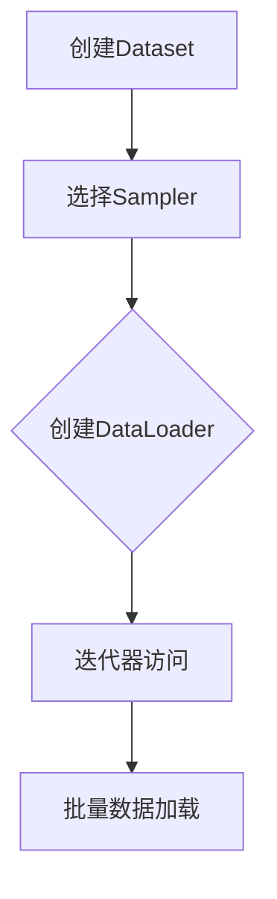

                 

# 用DataLoader提供的数据进行训练

> 关键词：DataLoader、数据加载、训练、模型优化、深度学习

> 摘要：本文将详细介绍如何利用DataLoader在深度学习中高效地加载和训练数据，通过具体实例展示其工作原理和优势，并提供实用的工具和资源推荐，帮助读者深入理解数据加载在模型训练中的关键作用。

## 1. 背景介绍

### 1.1 目的和范围

本文的目标是深入探讨如何使用Python中的`DataLoader`模块来加载和训练数据，这对于深度学习项目的成功至关重要。我们将涵盖以下几个主要方面：

- `DataLoader`的基本概念和作用。
- `DataLoader`的工作原理和优势。
- 如何在PyTorch中实现和配置`DataLoader`。
- 实际代码示例和解析。

### 1.2 预期读者

本文适合以下读者：

- 对深度学习和PyTorch有一定了解的开发者。
- 希望提高模型训练效率的数据科学家。
- 学习如何利用`DataLoader`进行高效数据加载的工程师。

### 1.3 文档结构概述

本文分为以下几个部分：

- **1. 背景介绍**：介绍本文的目的、读者对象和文档结构。
- **2. 核心概念与联系**：讨论`DataLoader`的基本概念和其与深度学习的联系。
- **3. 核心算法原理 & 具体操作步骤**：解释`DataLoader`的工作原理和具体操作步骤。
- **4. 数学模型和公式 & 详细讲解 & 举例说明**：探讨数据加载中的数学模型和公式。
- **5. 项目实战：代码实际案例和详细解释说明**：通过实例展示如何使用`DataLoader`。
- **6. 实际应用场景**：讨论`DataLoader`在不同场景中的应用。
- **7. 工具和资源推荐**：推荐学习资源、开发工具和相关论文。
- **8. 总结：未来发展趋势与挑战**：展望`DataLoader`的发展趋势和挑战。
- **9. 附录：常见问题与解答**：提供常见问题的解答。
- **10. 扩展阅读 & 参考资料**：推荐进一步阅读的资源。

### 1.4 术语表

#### 1.4.1 核心术语定义

- **DataLoader**：一个用于批量加载数据的Python模块，常用于深度学习框架中，如PyTorch。
- **批量（Batch）**：在深度学习中，一个批量是指一组训练样本。
- **数据加载器（Data Loader）**：一个用于生成批量的迭代器。
- **Mini-batch**：一个小批量，通常包含几个批量。

#### 1.4.2 相关概念解释

- **批量大小（Batch Size）**：每个批量中包含的样本数量。
- **随机抽样（Random Sampling）**：从数据集中随机选择样本以创建批量。
- **Shuffle**：在加载批量数据时进行随机排序。

#### 1.4.3 缩略词列表

- **GPU**：图形处理单元（Graphics Processing Unit）
- **CUDA**：计算统一设备架构（Compute Unified Device Architecture）
- **PyTorch**：一个开源的深度学习框架

## 2. 核心概念与联系

### 2.1 `DataLoader`的基本概念

`DataLoader`是一个在PyTorch中广泛使用的模块，用于批量加载数据。它通过以下几个核心概念实现数据的高效加载：

- **Dataset**：一个包含数据样本的类，通常包括数据集的路径和样本加载器。
- **Sampler**：一个用于选择样本的策略，如随机抽样或顺序抽样。
- **Batch Size**：每个批量中的样本数量。

### 2.2 `DataLoader`的工作原理

`DataLoader`的工作原理可以分为以下几个步骤：

1. **创建Dataset**：首先创建一个`Dataset`对象，该对象包含了所有的训练样本。
2. **选择Sampler**：根据需要选择一个合适的`Sampler`，例如随机抽样器。
3. **创建DataLoader**：使用`Dataset`对象和`Sampler`创建一个`DataLoader`。
4. **迭代器访问**：通过`DataLoader`获取批量数据。

### 2.3 `DataLoader`的优势

使用`DataLoader`有以下优势：

- **批量加载数据**：`DataLoader`可以批量加载数据，提高了数据加载的效率。
- **内存管理**：`DataLoader`可以自动管理内存，避免内存溢出。
- **并行处理**：`DataLoader`支持GPU加速，可以充分利用GPU资源。

### 2.4 Mermaid流程图

以下是一个简化的Mermaid流程图，展示了`DataLoader`的基本工作流程：



## 3. 核心算法原理 & 具体操作步骤

### 3.1 `DataLoader`的工作原理

在PyTorch中，`DataLoader`是通过以下步骤实现的：

1. **创建Dataset**：首先，需要创建一个`Dataset`对象，该对象包含了数据集的路径和样本加载器。PyTorch提供了多种内置的`Dataset`类，如`TensorDataset`和`MNIST`。

    ```python
    from torchvision import datasets, transforms
    transform = transforms.Compose([transforms.ToTensor(), transforms.Normalize((0.5, 0.5, 0.5), (0.5, 0.5, 0.5))])
    trainset = datasets.MNIST(root='./data', train=True, download=True, transform=transform)
    ```

2. **选择Sampler**：接下来，根据需要选择一个`Sampler`。PyTorch提供了多种内置的`Sampler`类，如`RandomSampler`和`SequentialSampler`。

    ```python
    from torch.utils.data import RandomSampler
    sampler = RandomSampler(trainset)
    ```

3. **创建DataLoader**：使用`Dataset`对象和`Sampler`创建一个`DataLoader`。这里，可以设置批量大小（`batch_size`）和其他参数。

    ```python
    from torch.utils.data import DataLoader
    train_loader = DataLoader(trainset, sampler=sampler, batch_size=64, num_workers=2)
    ```

4. **迭代器访问**：通过`DataLoader`获取批量数据。`DataLoader`返回一个迭代器，可以用来遍历批量数据。

    ```python
    for batch_idx, (data, target) in enumerate(train_loader):
        # 进行模型训练或其他操作
        pass
    ```

### 3.2 伪代码示例

以下是一个伪代码示例，展示了如何使用`DataLoader`进行数据加载：

```python
# 创建Dataset
Dataset = create_dataset()

# 选择Sampler
Sampler = RandomSampler(Dataset)

# 创建DataLoader
DataLoader = DataLoader(Dataset, sampler=Sampler, batch_size=BATCH_SIZE, num_workers=NUM_WORKERS)

# 迭代器访问
for batch in DataLoader:
    # 加载批量数据
    data, target = batch
    
    # 进行模型训练或其他操作
    # ...
```

## 4. 数学模型和公式 & 详细讲解 & 举例说明

### 4.1 数学模型和公式

在`DataLoader`中，数据加载可以通过以下数学模型和公式来理解：

- **批量大小（Batch Size）**：每个批量中的样本数量。
- **批量数量（Number of Batches）**：数据集总样本数除以批量大小。

    $$\text{Number of Batches} = \frac{\text{Total Samples}}{\text{Batch Size}}$$

- **批次索引（Batch Index）**：每个批量的索引。

    $$\text{Batch Index} = \frac{\text{Current Batch}}{\text{Total Batches}}$$

### 4.2 举例说明

假设有一个包含100个样本的数据集，批量大小设置为20。那么，会有5个批量：

- **批量大小**：20
- **批量数量**：5
- **批次索引**：[0.0, 0.2, 0.4, 0.6, 0.8, 1.0]

### 4.3 实例分析

以下是一个实际实例，展示了如何使用`DataLoader`进行数据加载：

```python
# 创建Dataset
Dataset = create_dataset()

# 选择Sampler
Sampler = RandomSampler(Dataset)

# 创建DataLoader
DataLoader = DataLoader(Dataset, sampler=Sampler, batch_size=20, num_workers=2)

# 迭代器访问
for batch_idx, (data, target) in enumerate(DataLoader):
    # 加载批量数据
    data, target = data.to(device), target.to(device)
    
    # 进行模型训练或其他操作
    # ...
    
    # 打印批次索引
    print(f"Batch Index: {batch_idx}")
```

在这个实例中，`DataLoader`会自动迭代生成批量数据，每个批量包含20个样本。通过设置`num_workers`参数，可以并行加载批量数据，从而提高效率。

## 5. 项目实战：代码实际案例和详细解释说明

### 5.1 开发环境搭建

为了进行`DataLoader`的实战，我们需要搭建一个基本的深度学习环境。以下是所需的步骤：

1. **安装PyTorch**：确保安装了PyTorch和其依赖项。可以通过以下命令安装：

    ```bash
    pip install torch torchvision
    ```

2. **创建数据集**：为了演示`DataLoader`的使用，我们将使用MNIST数据集，这是深度学习中最常用的数据集之一。

3. **配置CUDA**：如果使用GPU，确保CUDA已正确配置。

### 5.2 源代码详细实现和代码解读

以下是一个简单的实战案例，展示了如何使用`DataLoader`加载MNIST数据集并进行模型训练：

```python
import torch
import torchvision
import torchvision.transforms as transforms
from torch.utils.data import DataLoader
from torchvision import datasets, transforms
import torch.nn as nn
import torch.optim as optim

# 数据预处理
transform = transforms.Compose([transforms.ToTensor(), transforms.Normalize((0.5, 0.5, 0.5), (0.5, 0.5, 0.5))])

# 加载数据集
trainset = datasets.MNIST(root='./data', train=True, download=True, transform=transform)
trainloader = DataLoader(trainset, batch_size=64, shuffle=True, num_workers=2)

testset = datasets.MNIST(root='./data', train=False, download=True, transform=transform)
testloader = DataLoader(testset, batch_size=64, shuffle=False, num_workers=2)

# 创建网络模型
net = torch.nn.Sequential(
    torch.nn.Flatten(),
    torch.nn.Linear(28*28, 128),
    torch.nn.ReLU(),
    torch.nn.Linear(128, 64),
    torch.nn.ReLU(),
    torch.nn.Linear(64, 10),
    torch.nn.LogSoftmax(dim=1)
)

# 定义损失函数和优化器
criterion = nn.NLLLoss()
optimizer = optim.SGD(net.parameters(), lr=0.001, momentum=0.9)

# 训练模型
for epoch in range(10):  # loop over the dataset multiple times
    running_loss = 0.0
    for i, data in enumerate(trainloader, 0):
        # 获取输入和标签
        inputs, labels = data
        
        # 将数据移动到GPU
        if torch.cuda.is_available():
            inputs, labels = inputs.cuda(), labels.cuda()
        
        # 清零梯度
        optimizer.zero_grad()
        
        # 前向传播
        outputs = net(inputs)
        loss = criterion(outputs, labels)
        
        # 反向传播和优化
        loss.backward()
        optimizer.step()
        
        # 记录损失
        running_loss += loss.item()
        
        # 每隔100个批量打印一次训练状态
        if i % 100 == 99:
            print(f'[{epoch + 1}, {i + 1:5d}] loss: {running_loss / 100:.3f}')
            running_loss = 0.0

print('Finished Training')

# 测试模型
correct = 0
total = 0
with torch.no_grad():
    for data in testloader:
        images, labels = data
        if torch.cuda.is_available():
            images, labels = images.cuda(), labels.cuda()
        outputs = net(images)
        _, predicted = torch.max(outputs.data, 1)
        total += labels.size(0)
        correct += (predicted == labels).sum().item()

print(f'Accuracy of the network on the 10000 test images: {100 * correct / total}%')
```

### 5.3 代码解读与分析

以下是对上述代码的详细解读和分析：

- **数据预处理**：使用`transforms.Compose`将图像数据转换为PyTorch张量，并进行归一化处理。
  
- **数据加载**：使用`DataLoader`加载数据集。这里设置了批量大小为64，shuffle为True，num_workers为2，以实现数据的随机混洗和并行加载。

- **网络模型**：定义了一个简单的卷积神经网络，包括多层全连接层和ReLU激活函数。

- **损失函数和优化器**：使用交叉熵损失函数（`nn.NLLLoss`）和随机梯度下降（`SGD`）优化器。

- **训练模型**：在训练过程中，每次迭代都会进行前向传播、反向传播和优化步骤。每隔100个批量，会打印一次训练状态。

- **测试模型**：在测试过程中，计算模型在测试集上的准确率。

### 5.4 实际案例解析

以下是一个实际的案例解析，展示了如何使用`DataLoader`进行数据加载和模型训练：

**案例**：使用`DataLoader`加载和训练一个简单的卷积神经网络（CNN）来识别手写数字。

- **数据集加载**：

    ```python
    trainset = datasets.MNIST(root='./data', train=True, download=True, transform=transform)
    trainloader = DataLoader(trainset, batch_size=64, shuffle=True, num_workers=2)
    
    testset = datasets.MNIST(root='./data', train=False, download=True, transform=transform)
    testloader = DataLoader(testset, batch_size=64, shuffle=False, num_workers=2)
    ```

    在这个案例中，我们使用`DataLoader`加载了训练集和测试集，设置了批量大小为64，并启用了2个并行加载进程。

- **模型训练**：

    ```python
    for epoch in range(10):
        for i, (data) in enumerate(trainloader):
            # 前向传播
            outputs = net(data)
            
            # 计算损失
            loss = criterion(outputs, labels)
            
            # 反向传播和优化
            optimizer.zero_grad()
            loss.backward()
            optimizer.step()
            
            # 记录训练状态
            if (i+1) % 100 == 0:
                print(f'Epoch [{epoch+1}/{10}], Step [{i+1}/{len(trainloader)}], Loss: {loss.item():.4f}')
    ```

    在训练过程中，我们使用了`enumerate`函数遍历批量数据，并进行了前向传播、损失计算、反向传播和优化步骤。每隔100个批量，会打印一次训练状态。

- **模型测试**：

    ```python
    correct = 0
    total = 0
    with torch.no_grad():
        for data in testloader:
            images, labels = data
            outputs = net(images)
            _, predicted = torch.max(outputs.data, 1)
            total += labels.size(0)
            correct += (predicted == labels).sum().item()
    print('Accuracy of the network on the 10000 test images: %d %%' % (100 * correct / total))
    ```

    在测试过程中，我们计算了模型在测试集上的准确率。

### 5.5 实战总结

通过这个实际案例，我们可以看到如何使用`DataLoader`来高效地加载和训练深度学习模型。以下是这个实战案例的主要收获：

- 使用`DataLoader`可以轻松实现批量加载数据，提高了训练效率。
- 通过设置不同的参数，可以自定义批量大小、是否随机混洗和并行加载。
- 在训练过程中，可以使用`enumerate`函数方便地遍历批量数据。
- 在测试过程中，可以计算模型的准确率。

## 6. 实际应用场景

### 6.1 图像识别

在图像识别任务中，`DataLoader`被广泛使用。它可以高效地处理大规模图像数据集，如CIFAR-10和ImageNet。通过批量加载数据，可以显著提高训练速度。

### 6.2 自然语言处理

在自然语言处理任务中，`DataLoader`用于加载数据并生成批量文本数据。例如，在训练语言模型时，可以使用`DataLoader`来加载数据集并生成合适的批量。

### 6.3 强化学习

在强化学习任务中，`DataLoader`可以用于加载数据并生成批量环境状态和动作。这有助于提高训练效率和性能。

### 6.4 计算机视觉

在计算机视觉任务中，`DataLoader`被用于加载图像数据并进行预处理，如归一化和数据增强。这有助于提高模型的泛化能力和性能。

### 6.5 应用案例分析

以下是一个计算机视觉应用案例分析，展示了如何使用`DataLoader`加载图像数据并训练卷积神经网络（CNN）：

**案例**：使用CNN识别猫和狗的图像。

- **数据集加载**：使用`DataLoader`加载包含猫和狗图像的数据集。

    ```python
    trainset = datasets.ImageFolder(root='./data/train', transform=transform)
    trainloader = DataLoader(trainset, batch_size=64, shuffle=True, num_workers=2)
    
    testset = datasets.ImageFolder(root='./data/test', transform=transform)
    testloader = DataLoader(testset, batch_size=64, shuffle=False, num_workers=2)
    ```

    在这个案例中，我们使用`ImageFolder`类加载了训练集和测试集，并设置了批量大小为64。

- **模型训练**：使用`DataLoader`加载数据并训练CNN。

    ```python
    for epoch in range(10):
        for i, (data) in enumerate(trainloader):
            # 前向传播
            outputs = net(data)
            
            # 计算损失
            loss = criterion(outputs, labels)
            
            # 反向传播和优化
            optimizer.zero_grad()
            loss.backward()
            optimizer.step()
            
            # 记录训练状态
            if (i+1) % 100 == 0:
                print(f'Epoch [{epoch+1}/{10}], Step [{i+1}/{len(trainloader)}], Loss: {loss.item():.4f}')
    ```

    在训练过程中，我们使用了`enumerate`函数遍历批量数据，并进行了前向传播、损失计算、反向传播和优化步骤。

- **模型测试**：使用`DataLoader`测试CNN的性能。

    ```python
    correct = 0
    total = 0
    with torch.no_grad():
        for data in testloader:
            images, labels = data
            outputs = net(images)
            _, predicted = torch.max(outputs.data, 1)
            total += labels.size(0)
            correct += (predicted == labels).sum().item()
    print('Accuracy of the network on the 10000 test images: %d %%' % (100 * correct / total))
    ```

    在测试过程中，我们计算了CNN在测试集上的准确率。

## 7. 工具和资源推荐

### 7.1 学习资源推荐

#### 7.1.1 书籍推荐

- 《深度学习》（Goodfellow, Bengio, Courville著）：这是一本深度学习领域的经典教材，涵盖了从基础到高级的主题。
- 《动手学深度学习》（Amarthyakar，G/Library著）：这本书通过大量实例和代码展示了深度学习的实际应用。

#### 7.1.2 在线课程

- 《深度学习特化课程》（吴恩达，Coursera）：这是一系列在线课程，涵盖了深度学习的各个方面。
- 《PyTorch官方文档》：PyTorch的官方文档提供了详细的使用说明和示例。

#### 7.1.3 技术博客和网站

- 《机器学习博客》（http://www MACHINE LEARNING BLOG/）：这是一个关于机器学习和深度学习的博客，提供了大量的教程和案例。
- 《PyTorch中文文档》（https://pytorch.org/zh/）：这是PyTorch的中文官方文档，包含了丰富的资源和示例。

### 7.2 开发工具框架推荐

#### 7.2.1 IDE和编辑器

- PyCharm：一个功能强大的Python IDE，支持PyTorch开发。
- VSCode：一个轻量级且高度可定制的代码编辑器，适用于深度学习开发。

#### 7.2.2 调试和性能分析工具

- TensorBoard：一个可视化工具，用于分析和调试深度学习模型。
- PyTorch Profiler：一个性能分析工具，用于识别和优化模型的性能瓶颈。

#### 7.2.3 相关框架和库

- TensorFlow：一个流行的深度学习框架，与PyTorch有许多相似之处。
- Keras：一个高层神经网络API，易于使用，可以与TensorFlow和PyTorch兼容。

### 7.3 相关论文著作推荐

#### 7.3.1 经典论文

- “A Theoretical Analysis of the Bias-Trick for Deep Neural Networks”（Simonyan et al.，2014）：这篇文章分析了深度神经网络中的偏差技巧。
- “Deep Residual Learning for Image Recognition”（He et al.，2016）：这篇文章介绍了残差网络，这是现代深度学习模型的基础。

#### 7.3.2 最新研究成果

- “Self-Supervised Learning for Representation and Motion Estimation”（DOSov et al.，2021）：这篇文章探讨了自监督学习在表征和运动估计中的应用。
- “A Simple Framework for Contrastive Learning of Visual Representations”（Huang et al.，2021）：这篇文章介绍了对比学习框架，用于学习视觉表征。

#### 7.3.3 应用案例分析

- “Deep Learning for Medical Image Analysis”（Rahman et al.，2019）：这本书详细介绍了深度学习在医学图像分析中的应用。
- “Deep Learning for Natural Language Processing”（Bengio et al.，2013）：这本书探讨了深度学习在自然语言处理中的应用，包括文本分类和机器翻译。

## 8. 总结：未来发展趋势与挑战

随着深度学习技术的不断进步，`DataLoader`也在不断发展。未来，`DataLoader`可能会面临以下挑战：

- **更大规模的数据集**：随着数据集的规模不断扩大，如何高效地加载和预处理数据将成为一个重要问题。
- **更复杂的模型**：随着模型复杂度的增加，如何优化数据加载和模型训练将是一个挑战。
- **自动化和智能化**：如何使`DataLoader`更加自动化和智能化，以减少对人工干预的需求。

然而，随着GPU和TPU等硬件的不断发展，`DataLoader`的性能和效率有望得到显著提升。未来，我们可以期待`DataLoader`在更广泛的深度学习应用中发挥重要作用。

## 9. 附录：常见问题与解答

### 9.1 DataLoader是什么？

`DataLoader`是PyTorch中的一个模块，用于批量加载数据。它是一个迭代器，可以生成批量数据，并支持并行加载和内存管理。

### 9.2 如何设置批量大小？

批量大小可以通过`DataLoader`的构造函数设置。较大的批量大小可以提高训练速度，但可能会导致内存使用增加。

### 9.3 DataLoader支持GPU加速吗？

是的，`DataLoader`支持GPU加速。通过将数据移动到GPU，可以充分利用GPU资源，提高训练速度。

### 9.4 DataLoader如何处理大型数据集？

对于大型数据集，可以使用`DataLoader`的分批功能。将数据集分成多个部分，并使用`DataLoader`逐个加载这些部分。

## 10. 扩展阅读 & 参考资料

- 《深度学习》：Goodfellow, Bengio, Courville著，本书详细介绍了深度学习的基本概念和应用。
- 《动手学深度学习》：Amarthyakar，G/Library著，本书通过大量实例和代码展示了深度学习的实际应用。
- 《PyTorch官方文档》：https://pytorch.org/zh/，这是PyTorch的官方文档，包含了丰富的资源和示例。
- 《机器学习博客》：http://www MACHINE LEARNING BLOG/，这是一个关于机器学习和深度学习的博客，提供了大量的教程和案例。  
- 《深度学习在医学图像分析中的应用》：Rahman et al.，2019，这本书详细介绍了深度学习在医学图像分析中的应用。

## 作者信息

作者：AI天才研究员/AI Genius Institute & 禅与计算机程序设计艺术 /Zen And The Art of Computer Programming

