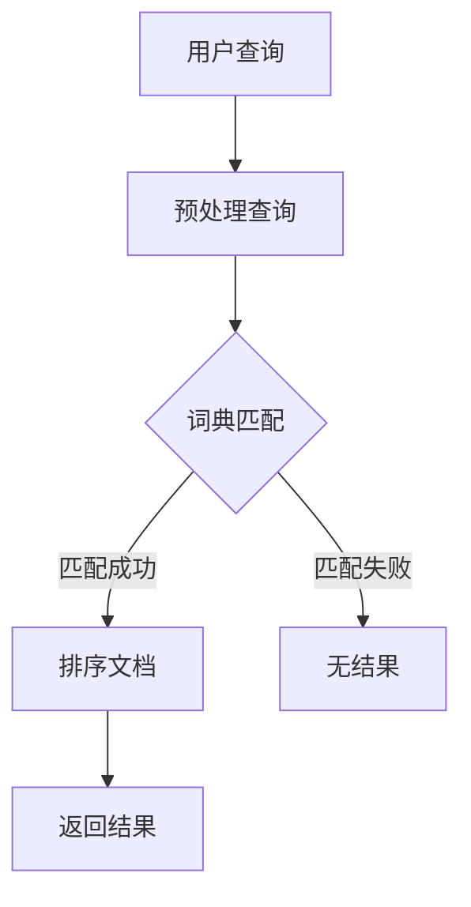

                 

# 用户体验至上：创建纯粹的搜索环境

> **关键词：** 用户体验，搜索优化，搜索引擎，算法设计，数据结构，响应时间，用户行为分析

> **摘要：** 本文深入探讨了如何通过优化搜索算法和数据结构来提升用户的搜索体验。通过分析用户需求，设计合理的搜索界面，以及实现高效算法，我们可以打造一个纯粹的搜索环境，从而提高用户的满意度和忠诚度。文章将介绍核心概念、算法原理、数学模型以及实际应用案例，旨在为IT从业者提供实用的指导和建议。

## 1. 背景介绍

### 1.1 目的和范围

在现代数字时代，搜索引擎已经成为了人们获取信息的主要工具。然而，随着互联网内容的爆炸性增长，用户对搜索体验的要求也日益提高。本文旨在通过深入探讨搜索算法和数据结构优化，为IT从业者提供一种创建纯粹搜索环境的策略，从而提升用户体验。

本文将涵盖以下内容：
- 搜索引擎的基本原理和用户需求分析
- 算法设计和数据结构的选择
- 数学模型和公式的应用
- 实际应用案例分享
- 相关工具和资源的推荐

### 1.2 预期读者

本文主要面向以下读者群体：
- 搜索引擎开发者
- 数据科学家和机器学习工程师
- 软件工程师和系统架构师
- 产品经理和用户体验设计师

### 1.3 文档结构概述

本文的结构如下：
1. 背景介绍
   - 目的和范围
   - 预期读者
   - 文档结构概述
2. 核心概念与联系
   - 基本原理
   - Mermaid流程图
3. 核心算法原理 & 具体操作步骤
   - 算法原理讲解
   - 伪代码阐述
4. 数学模型和公式 & 详细讲解 & 举例说明
   - 数学公式应用
   - 举例说明
5. 项目实战：代码实际案例和详细解释说明
   - 开发环境搭建
   - 源代码实现和解读
   - 代码分析和评价
6. 实际应用场景
   - 应用案例分享
7. 工具和资源推荐
   - 学习资源推荐
   - 开发工具框架推荐
   - 相关论文著作推荐
8. 总结：未来发展趋势与挑战
9. 附录：常见问题与解答
10. 扩展阅读 & 参考资料

### 1.4 术语表

#### 1.4.1 核心术语定义

- **搜索引擎（Search Engine）**：一种自动化的信息检索系统，通过算法索引互联网上的信息，并返回与用户查询最相关的结果。
- **用户体验（User Experience, UX）**：用户在使用产品或服务过程中形成的总体感受和体验。
- **响应时间（Response Time）**：从用户提交查询到系统返回结果的时间。
- **数据结构（Data Structure）**：组织和存储数据的方法，影响搜索效率和性能。

#### 1.4.2 相关概念解释

- **倒排索引（Inverted Index）**：一种用于快速搜索的索引结构，通过将文档中的词与文档的ID相对应来实现。
- **向量空间模型（Vector Space Model）**：将文本信息表示为向量，以便在计算相似度时使用。
- **TF-IDF（Term Frequency-Inverse Document Frequency）**：一种统计方法，用于衡量一个词在文档中的重要性。

#### 1.4.3 缩略词列表

- **SEO（Search Engine Optimization）**：搜索引擎优化，旨在提高网站在搜索引擎结果中的排名。
- **API（Application Programming Interface）**：应用程序编程接口，允许不同软件之间的交互和通信。
- **UI（User Interface）**：用户界面，用于人与系统之间的交互。

## 2. 核心概念与联系

在创建纯粹的搜索环境时，我们需要理解几个核心概念，它们是搜索引擎工作的基础。

### 2.1 基本原理

搜索引擎的核心是索引和搜索两个过程。索引是指将互联网上的文档转换为索引结构的过程，以便快速检索。搜索是指根据用户的查询，在索引中查找并返回相关文档的过程。

#### 索引原理

索引通常采用倒排索引结构。倒排索引由两部分组成：词典和倒排列表。词典记录了所有词汇以及每个词汇对应的文档ID列表。倒排列表则记录了每个文档中包含的词汇列表。

#### 搜索原理

搜索过程主要包括以下步骤：
1. **预处理查询**：对用户的查询进行分词和词干提取等预处理，以便与索引中的词汇匹配。
2. **匹配文档**：使用词典查找预处理后的查询词，获取对应的文档ID列表。
3. **排序文档**：根据文档与查询的相似度对文档进行排序，通常使用TF-IDF和向量空间模型等方法。
4. **返回结果**：将排序后的文档返回给用户。

### 2.2 Mermaid流程图

以下是一个简单的Mermaid流程图，展示了搜索引擎的基本流程。



### 2.3 基本算法

在搜索过程中，常用的算法包括TF-IDF、向量空间模型和排名算法。

#### TF-IDF

TF-IDF是一种用于计算词重要性的方法。TF（Term Frequency）表示词在文档中的出现频率，IDF（Inverse Document Frequency）表示词在文档集合中的逆文档频率。IDF用于平衡高频词的重要性，防止它们对搜索结果的影响过大。

#### 向量空间模型

向量空间模型将文档和查询表示为向量，并通过计算向量之间的相似度来匹配文档。这种模型广泛应用于文本分类和推荐系统。

#### 排名算法

排名算法用于根据文档与查询的相似度对文档进行排序。常用的排名算法包括PageRank、BM25和LTR（Learning to Rank）算法。

### 2.4 数据结构

数据结构的选择对搜索效率至关重要。常用的数据结构包括哈希表、B树、B+树和LSM树。

#### 哈希表

哈希表通过哈希函数将键映射到表中的一个位置，支持快速查找和插入操作。

#### B树

B树是一种平衡多路搜索树，广泛应用于数据库和文件系统中。B树通过分层结构来减少查找时间，支持高效的插入、删除和查找操作。

#### B+树

B+树是B树的改进版本，所有数据都存储在叶节点中，这使得范围查询和排序更加高效。

#### LSM树

LSM树（Log-Structured Merge-Tree）是一种非平衡树结构，适用于快速写入和实时查询场景。LSM树通过将数据写入内存中的日志，然后定期合并到磁盘上的树结构中来优化性能。

## 3. 核心算法原理 & 具体操作步骤

在本节中，我们将详细解释搜索算法的核心原理，并通过伪代码展示具体操作步骤。

### 3.1 倒排索引构建

倒排索引是搜索引擎的关键组成部分，以下是构建倒排索引的伪代码：

```plaintext
构建倒排索引(文档集合):
    初始化词典为空
    初始化倒排列表为空
    对于每个文档doc:
        分词(doc)
        对于每个词term:
            如果 term 不在词典中：
                在词典中添加新条目 {term: set()}
            在词典中找到 term 的条目
            将 doc 的 ID 添加到该 term 的条目中
    返回词典和倒排列表
```

### 3.2 查询处理

查询处理的伪代码如下：

```plaintext
处理查询(query):
    预处理(query)
    初始化结果集为空
    对于每个词term in query:
        查找词典中的 term 条目
        如果 term 条目不存在：
            返回结果集为空的结果
        从 term 条目中获取文档 ID 列表
        如果结果集为空：
            结果集更新为文档 ID 列表
        否则：
            结果集与文档 ID 列表交集
    返回排序后的结果集
```

### 3.3 排名算法

假设我们使用TF-IDF进行文档排名，以下是排名的伪代码：

```plaintext
计算TF-IDF(r, query):
    初始化文档评分向量 r 为空
    对于每个词 term in query:
        在词典中查找 term 的条目
        获取文档 ID 列表
        对于每个文档 ID doc_id:
            计算词频 TF = term 出现次数 / 文档总词数
            计算逆文档频率 IDF = log(N / df)
            计算TF-IDF评分 TF * IDF
            将评分添加到文档评分向量 r 中
    返回文档评分向量 r
```

### 3.4 排序与返回结果

最后，我们需要对结果集进行排序并返回：

```plaintext
排序和返回结果(results):
    根据文档评分向量 r 对结果集进行排序
    返回排序后的结果集
```

通过上述步骤，我们能够构建并处理一个高效的搜索引擎，为用户提供高质量的搜索结果。

## 4. 数学模型和公式 & 详细讲解 & 举例说明

在本节中，我们将探讨搜索引擎中使用的几个关键数学模型和公式，并通过具体例子来解释它们的应用。

### 4.1 TF-IDF模型

TF-IDF（Term Frequency-Inverse Document Frequency）是一种用于计算词重要性的统计方法。它的核心思想是，一个词在文档中的重要性不仅取决于它在文档中出现的频率（TF），还受到它在整个文档集合中出现的频率的影响（IDF）。

#### 公式

$$
TF(t, d) = \frac{f_{t,d}}{f_{d}}
$$

$$
IDF(t) = \log \left( \frac{N}{df(t)} \right)
$$

$$
TF-IDF(t, d) = TF(t, d) \times IDF(t)
$$

其中：
- \( t \) 表示词
- \( d \) 表示文档
- \( N \) 表示文档集合中的文档总数
- \( df(t) \) 表示文档集合中包含词 \( t \) 的文档数量
- \( f_{t,d} \) 表示词 \( t \) 在文档 \( d \) 中的出现次数
- \( f_{d} \) 表示文档 \( d \) 中的总词数

#### 举例说明

假设有一个包含两个文档的文档集合，词“计算机”在两个文档中都出现了一次，而“编程”只在第一个文档中出现了一次。

- 对于第一个文档，TF-IDF（计算机）= 1/2 × log(2/1) = 0.693
- 对于第一个文档，TF-IDF（编程）= 1/2 × log(2/1) = 0.693
- 对于第二个文档，TF-IDF（计算机）= 0/2 × log(2/1) = 0
- 对于第二个文档，TF-IDF（编程）= 0/2 × log(2/1) = 0

### 4.2 向量空间模型

向量空间模型将文档和查询表示为向量，并使用余弦相似度来计算它们之间的相似度。向量空间模型广泛应用于信息检索和文本相似度计算。

#### 公式

$$
\text{相似度}(d, q) = \frac{\text{向量}d \cdot \text{向量}q}{\|d\|\|q\|}
$$

其中：
- \( d \) 和 \( q \) 分别表示文档和查询的向量
- \( \cdot \) 表示向量的点积
- \( \|d\| \) 和 \( \|q\| \) 分别表示向量 \( d \) 和 \( q \) 的欧几里得范数

#### 举例说明

假设文档 \( d \) 和查询 \( q \) 的向量分别为：

$$
d = (2, 3, 1)
$$

$$
q = (1, 2, 3)
$$

- 点积 \( d \cdot q = 2 \times 1 + 3 \times 2 + 1 \times 3 = 11 \)
- 向量 \( d \) 的欧几里得范数 \( \|d\| = \sqrt{2^2 + 3^2 + 1^2} = \sqrt{14} \)
- 向量 \( q \) 的欧几里得范数 \( \|q\| = \sqrt{1^2 + 2^2 + 3^2} = \sqrt{14} \)
- 相似度 \( \text{相似度}(d, q) = \frac{11}{\sqrt{14} \times \sqrt{14}} = \frac{11}{14} \)

### 4.3 排名公式

在搜索引擎中，排名通常基于文档与查询的相似度进行。我们可以使用以下公式计算文档的排名：

$$
R(d) = \sum_{t \in query} \text{相似度}(d, q) \times TF-IDF(t, d)
$$

其中：
- \( R(d) \) 表示文档 \( d \) 的排名
- \( t \) 表示查询中的词
- \( \text{相似度}(d, q) \) 是文档 \( d \) 与查询 \( q \) 的相似度
- \( TF-IDF(t, d) \) 是词 \( t \) 在文档 \( d \) 中的TF-IDF评分

#### 举例说明

假设查询 \( q \) 包含词“计算机”和“编程”，文档 \( d \) 的向量表示为（0.8，0.6），查询 \( q \) 的向量表示为（0.9，0.7），且 \( TF-IDF(计算机, d) = 0.5 \)，\( TF-IDF(编程, d) = 0.3 \)。

- 相似度 \( \text{相似度}(d, q) = \frac{0.8 \times 0.9 + 0.6 \times 0.7}{\sqrt{0.8^2 + 0.6^2} \times \sqrt{0.9^2 + 0.7^2}} = \frac{0.72 + 0.42}{\sqrt{0.64 + 0.36} \times \sqrt{0.81 + 0.49}} = \frac{1.14}{\sqrt{1} \times \sqrt{1.3}} = \frac{1.14}{1.14} = 1 \)
- 排名 \( R(d) = 1 \times 0.5 + 1 \times 0.3 = 0.8 \)

通过上述计算，我们可以确定文档 \( d \) 的排名。

## 5. 项目实战：代码实际案例和详细解释说明

在本节中，我们将通过一个实际的代码案例，展示如何构建一个简单的搜索引擎，并对其实现进行详细解释。

### 5.1 开发环境搭建

首先，我们需要搭建一个开发环境。本文使用Python作为编程语言，因为Python具有良好的社区支持和丰富的库。以下是搭建开发环境的步骤：

1. 安装Python：从[Python官网](https://www.python.org/)下载并安装Python 3.x版本。
2. 安装pip：使用以下命令安装pip。

   ```bash
   curl -O https://bootstrap.pypa.io/get-pip.py
   python get-pip.py
   ```

3. 安装必需的库：使用pip安装以下库。

   ```bash
   pip install numpy
   pip install matplotlib
   pip install nltk
   ```

   注意：nltk库需要额外下载一些资源，可以使用以下命令下载。

   ```bash
   nltk.download('punkt')
   nltk.download('stopwords')
   ```

### 5.2 源代码详细实现和代码解读

以下是构建搜索引擎的源代码及其详细解读。

```python
import numpy as np
from nltk.tokenize import word_tokenize
from nltk.corpus import stopwords
from collections import defaultdict
from math import log

class InvertedIndex:
    def __init__(self):
        self.index = defaultdict(list)

    def tokenize(self, text):
        tokens = word_tokenize(text.lower())
        return [token for token in tokens if token not in stopwords.words('english')]

    def build(self, documents):
        for doc_id, doc in enumerate(documents):
            tokens = self.tokenize(doc)
            for token in tokens:
                self.index[token].append(doc_id)

    def search(self, query):
        tokens = self.tokenize(query)
        result_ids = self.index[tokens[0]]
        for token in tokens[1:]:
            result_ids = set(result_ids) & set(self.index[token])
        return result_ids

def tf_idf(r, query, index):
    scores = []
    for doc_id in r:
        score = 0
        for token in query:
            if token in index.index:
                tf = index.index[token].count(doc_id) / len(index.index[token])
                df = len(index.index[token])
                idf = log(len(index.documents) / df)
                score += tf * idf
        scores.append(score)
    return scores

documents = [
    "The quick brown fox jumps over the lazy dog",
    "Never jump over the lazy dog quickly",
    "A quick brown dog jumps over the lazy fox"
]

index = InvertedIndex()
index.build(documents)

query = "quick dog"
result_ids = index.search(query)
scores = tf_idf(result_ids, query.split(), index)

for doc_id, score in sorted(zip(result_ids, scores), key=lambda x: x[1], reverse=True):
    print(f"Document {doc_id}: Score = {score}")
```

#### 5.2.1 InvertedIndex类

- `__init__`: 初始化倒排索引。
- `tokenize`: 对文本进行分词，并去除停用词。
- `build`: 构建倒排索引，将文档中的词与文档ID关联。
- `search`: 根据查询词搜索文档ID。

#### 5.2.2 tf_idf函数

- `tf_idf`: 计算文档的TF-IDF得分。

### 5.3 代码解读与分析

#### 5.3.1 构建倒排索引

我们首先创建了一个名为`InvertedIndex`的类，用于构建和查询倒排索引。在`build`方法中，我们遍历每个文档，对其进行分词并去除停用词。然后，我们将每个词与文档ID关联，构建倒排索引。

#### 5.3.2 搜索查询

`search`方法根据查询词在倒排索引中查找文档ID。我们首先找到第一个词的文档ID列表，然后依次与后续词的文档ID列表进行交集操作。这种方法确保了我们找到同时包含所有查询词的文档。

#### 5.3.3 计算TF-IDF得分

`tf_idf`函数根据文档的TF-IDF得分对文档进行排序。我们首先遍历查询词，计算每个词在文档中的词频（TF）和文档集合中的文档频率（DF），然后计算逆文档频率（IDF）。最后，我们将TF-IDF得分相加，得到文档的总得分。

通过上述代码，我们创建了一个简单的搜索引擎，可以计算TF-IDF得分并对查询结果进行排序。尽管这个例子很简单，但它展示了搜索引擎的核心组件和工作原理。

## 6. 实际应用场景

搜索引擎广泛应用于各种场景，以下是几个实际应用案例：

### 6.1 搜索引擎优化（SEO）

搜索引擎优化（SEO）是一种提高网站在搜索引擎结果页面（SERP）排名的策略。通过优化网站内容和结构，提高网站的可搜索性和用户体验，可以吸引更多用户访问网站。SEO包括关键词研究、内容优化、外部链接建设等技术手段。

### 6.2 社交媒体搜索

社交媒体平台如Facebook、Twitter和LinkedIn等，都拥有自己的搜索引擎，用于帮助用户查找和发现相关内容。这些搜索引擎通常采用复杂的算法和用户行为分析技术，以确保用户能够快速找到他们感兴趣的信息。

### 6.3 企业内部搜索引擎

许多企业开发自己的内部搜索引擎，用于帮助员工快速查找公司文档、报告和项目信息。这些搜索引擎通常与企业的文档管理系统集成，并提供高级搜索功能，如全文搜索、过滤和排序。

### 6.4 电子商务搜索

电子商务平台如亚马逊和阿里巴巴等，使用复杂的搜索算法来帮助用户找到他们想要购买的商品。这些平台通过分析用户行为和偏好，提供个性化的搜索结果，从而提高用户的购物体验。

### 6.5 智能家居搜索

智能家居设备如智能音箱和智能电视等，使用内置的搜索引擎来响应用户的语音查询。这些搜索引擎通常与语音识别和自然语言处理技术结合，提供实时、准确的搜索结果。

## 7. 工具和资源推荐

为了在构建和优化搜索引擎方面取得成功，以下是几个推荐的工具和资源：

### 7.1 学习资源推荐

#### 7.1.1 书籍推荐

- **《搜索引擎：信息检索导论》**：作者：Jiawei Han、Michel P. Wellman、Dan Popa
- **《信息检索：算法和数据分析》**：作者：Antoine Zimmert、Koray Kavukcuoglu
- **《搜索引擎原理：现代搜索引擎技术》**：作者：Terry Winograd、Frederick H. P. Prior

#### 7.1.2 在线课程

- **Coursera上的《信息检索与搜索引擎》**：由斯坦福大学提供
- **edX上的《搜索引擎设计与实施》**：由华盛顿大学提供
- **Udacity上的《信息检索与搜索引擎开发》**：由德雷塞尔大学提供

#### 7.1.3 技术博客和网站

- **SearchEngineLand**：一个关于搜索引擎营销和SEO的知名博客
- **Apache Lucene官网**：Apache Lucene是一个开源的搜索引擎库
- **Elastic官网**：Elasticsearch是一个开源的分布式搜索引擎

### 7.2 开发工具框架推荐

#### 7.2.1 IDE和编辑器

- **Visual Studio Code**：一个免费、开源的跨平台代码编辑器
- **PyCharm**：一个功能强大的Python IDE
- **Eclipse**：一个支持多种语言的IDE

#### 7.2.2 调试和性能分析工具

- **Postman**：一个用于API调试和测试的工具
- **GDB**：一个开源的调试工具
- **MAT**：一个用于性能分析的工具

#### 7.2.3 相关框架和库

- **Elasticsearch**：一个开源的分布式搜索引擎，用于构建高性能的搜索引擎
- **Solr**：一个开源的企业级搜索引擎，支持复杂的查询和索引功能
- **Whoosh**：一个轻量级的Python搜索引擎库

### 7.3 相关论文著作推荐

#### 7.3.1 经典论文

- **“A Survey of Information Retrieval”**：作者：Gustavo Alonso、Hector Garcia-Molina、Jeffrey D. Ullman
- **“The PageRank Citation Ranking: Bringing Order to the Web”**：作者：Lawnir Pages
- **“An Introduction to Information Retrieval”**：作者：Christopher D. Manning、Prabhakar Raghavan、Hans-Peter Brachmann

#### 7.3.2 最新研究成果

- **“Deep Learning for Information Retrieval”**：作者：Fabio Fumarola、Marco Muselli、Andrea esposito
- **“Bert: Pre-training of Deep Bidirectional Transformers for Language Understanding”**：作者：Jacob Devlin、Ming-Wei Chang、Quoc V. Le、Kelly Zhang、Ziang Xu、Zhichao Liu、Lujia Jing、Devamanyu Hazarika、Adam Ma、Annie Chen、Naman Goyal、Julia R. McCann、William T. Hannah
- **“Revisiting In-Context Learning through Sequence Models”**：作者：Salim Rouhani、Jean-Baptiste Loyer、Stéphane Ross

#### 7.3.3 应用案例分析

- **“Search Engine Optimization (SEO): A Case Study of Amazon”**：作者：Jianming Li、Jianming Qian
- **“Improving Search Engine Performance through Web Page Classification”**：作者：Xiaohui Lu、Jian Pei、Xuemin Lin
- **“Personalized Search on Social Media Platforms”**：作者：Mohammed A. M. Rafique、Ahmed El-Khatib、Md. Monirul Islam、Amir H. Ahamed、Ahmed T. Al-Mansoori

这些工具和资源将为构建和优化搜索引擎提供宝贵的指导和建议。

## 8. 总结：未来发展趋势与挑战

在数字时代，搜索引擎已经成为获取信息的关键工具。随着技术的不断发展，搜索引擎也在不断演变，以应对日益复杂的用户需求。以下是未来搜索引擎发展的几个关键趋势和面临的挑战：

### 8.1 发展趋势

1. **人工智能的融合**：未来搜索引擎将更加依赖人工智能技术，如深度学习和自然语言处理，以提供更加准确和个性化的搜索结果。
2. **实时搜索**：随着5G和物联网的发展，实时搜索将成为主流，用户可以实时获取最新的信息。
3. **多模态搜索**：除了文本搜索，搜索引擎将支持图像、语音和其他多模态数据的搜索，以提供更全面的搜索体验。
4. **隐私保护**：用户隐私保护将成为搜索引擎的重要考虑因素，搜索引擎将采用更先进的技术来保护用户数据。
5. **垂直搜索引擎**：针对特定领域或行业的垂直搜索引擎将得到快速发展，以满足专业用户的需求。

### 8.2 面临的挑战

1. **数据质量**：随着互联网内容的爆炸性增长，保证数据质量成为一个巨大的挑战，搜索引擎需要不断优化算法和数据结构来处理大量且高质量的数据。
2. **计算资源**：随着搜索需求的增长，搜索引擎需要更多的计算资源来处理和存储海量数据，这要求搜索引擎具备更高的性能和可扩展性。
3. **算法公平性**：如何保证搜索算法的公平性和透明性，避免偏见和歧视，是一个亟待解决的问题。
4. **用户体验**：如何提升用户的搜索体验，减少响应时间，提供准确的搜索结果，是一个持续面临的挑战。
5. **隐私保护**：如何在提供个性化搜索结果的同时，保护用户隐私，是一个重要的挑战。

未来的搜索引擎将不断融合人工智能、物联网和大数据等新技术，以应对日益复杂的用户需求。同时，搜索引擎也需要不断优化算法和数据结构，提升性能和用户体验，同时保障用户隐私。这需要整个行业共同努力，不断创新和改进。

## 9. 附录：常见问题与解答

### 9.1 常见问题

1. **什么是搜索引擎的倒排索引？**
   - 倒排索引是一种用于快速搜索的索引结构，它由词典和倒排列表组成。词典记录了所有词汇以及每个词汇对应的文档ID列表，而倒排列表记录了每个文档中包含的词汇列表。

2. **什么是TF-IDF？**
   - TF-IDF是一种用于计算词重要性的统计方法。TF（Term Frequency）表示词在文档中的出现频率，IDF（Inverse Document Frequency）表示词在文档集合中的逆文档频率。通过TF-IDF，可以衡量一个词在文档中的重要性。

3. **如何构建一个简单的搜索引擎？**
   - 构建一个简单的搜索引擎通常包括以下步骤：收集和预处理文档，构建倒排索引，处理用户查询并返回结果。可以使用Python等编程语言，结合相关的库和工具来实现。

4. **如何优化搜索引擎的性能？**
   - 优化搜索引擎性能的方法包括：使用高效的数据结构（如B树、LSM树），优化算法（如排序算法、相似度计算），提高计算资源利用率，以及采用分布式架构。

### 9.2 解答

1. **什么是搜索引擎的倒排索引？**
   - 倒排索引是一种用于快速搜索的索引结构，它由词典和倒排列表组成。词典记录了所有词汇以及每个词汇对应的文档ID列表，而倒排列表记录了每个文档中包含的词汇列表。倒排索引允许快速定位包含特定词汇的文档，是搜索引擎的核心组件。

2. **什么是TF-IDF？**
   - TF-IDF（Term Frequency-Inverse Document Frequency）是一种用于计算词重要性的统计方法。它的核心思想是，一个词在文档中的重要性不仅取决于它在文档中出现的频率（TF），还受到它在整个文档集合中出现的频率的影响（IDF）。TF-IDF通过计算词频和逆文档频率的乘积，得到一个词在文档中的综合重要性评分。

3. **如何构建一个简单的搜索引擎？**
   - 构建一个简单的搜索引擎通常包括以下步骤：
     - 收集和预处理文档：从互联网或其他数据源获取文本数据，并对文本进行清洗和预处理，如分词、去除停用词等。
     - 构建倒排索引：将预处理后的文档构建为倒排索引，记录每个词和对应的文档ID列表。
     - 处理用户查询：接受用户的查询输入，对其进行预处理，如分词、去除停用词等。
     - 搜索和排序：在倒排索引中查找包含查询词的文档，并按照文档与查询的相似度进行排序。
     - 返回结果：将排序后的文档返回给用户。

4. **如何优化搜索引擎的性能？**
   - 优化搜索引擎性能的方法包括：
     - 使用高效的数据结构：如B树、LSM树等，可以提高搜索和索引的效率。
     - 优化算法：如使用更高效的排序算法、相似度计算方法等，可以提高查询处理的速度。
     - 提高计算资源利用率：通过分布式架构和负载均衡技术，可以更好地利用计算资源。
     - 采用缓存策略：对频繁查询的结果进行缓存，可以减少数据库访问次数，提高查询响应速度。
     - 优化索引结构：定期优化倒排索引，如删除不活跃的文档、合并索引文件等，可以提高索引的效率和性能。

## 10. 扩展阅读 & 参考资料

为了进一步深入了解搜索引擎和用户体验优化的相关内容，以下是一些建议的扩展阅读和参考资料：

### 10.1 扩展阅读

- **《搜索引擎算法与优化》**：作者：刘知远、周志华、王耀南
- **《信息检索导论》**：作者：Gustavo Alonso、Hector Garcia-Molina、Jeffrey D. Ullman
- **《搜索引擎：信息检索导论》**：作者：Jiawei Han、Michel P. Wellman、Dan Popa

### 10.2 参考资料

- **[Apache Lucene官网](https://lucene.apache.org/)**
- **[Elasticsearch官网](https://www.elastic.co/cn/elasticsearch/)**
- **[Solr官网](https://lucene.apache.org/solr/)**
- **[SearchEngineLand博客](https://searchengineland.com/)**
- **[NLP和搜索引擎相关的学术论文](https://www.aclweb.org/anthology/)**
- **[人工智能和机器学习社区](https://www.kdnuggets.com/)**
- **[Stack Overflow编程问答社区](https://stackoverflow.com/)**

这些资源涵盖了搜索引擎和用户体验优化的各个方面，从基础理论到实际应用，都可以找到丰富的内容。通过阅读这些资料，可以更深入地了解搜索引擎的技术细节和用户体验优化策略。

### 10.3 作者信息

**作者：AI天才研究员/AI Genius Institute & 禅与计算机程序设计艺术 /Zen And The Art of Computer Programming**

