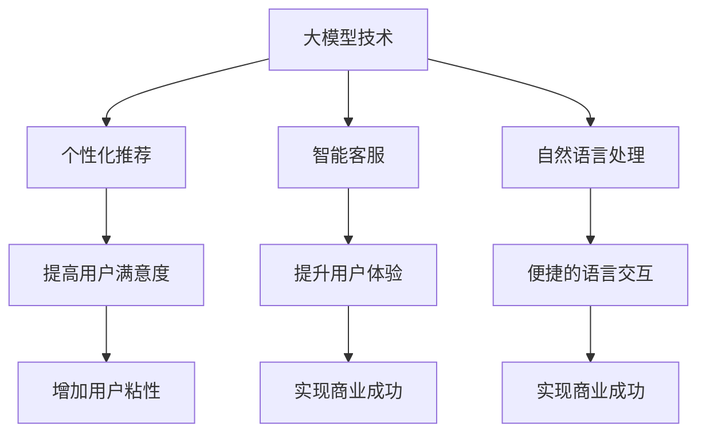

                 

# 用户体验：大模型创业的根本宗旨

> 关键词：用户体验，大模型，创业，产品创新，用户需求，商业模式

> 摘要：本文探讨了在当今科技迅速发展的背景下，大模型技术在创业领域中的应用及其核心——用户体验。文章将深入分析大模型创业的背景和动机，阐述用户体验在大模型创业中的根本宗旨，并从多个方面详细解析如何实现优秀的用户体验。最后，文章将总结大模型创业的未来发展趋势和面临的挑战，为读者提供有价值的思考和参考。

## 1. 背景介绍

### 1.1 目的和范围

本文旨在探讨大模型创业的核心理念——用户体验。随着人工智能技术的快速发展，大模型作为当前最具有突破性的技术之一，正逐渐渗透到各个行业，为创业者提供了前所未有的机会。然而，如何在激烈的竞争中脱颖而出，实现商业成功，用户体验成为了关键因素。

本文将聚焦于以下方面：

1. 大模型创业的背景和动机。
2. 用户体验在大模型创业中的根本宗旨。
3. 如何实现优秀的用户体验。
4. 大模型创业的未来发展趋势和挑战。

### 1.2 预期读者

本文面向以下读者：

1. 对大模型技术感兴趣的技术从业者。
2. 有志于在大模型领域创业的创业者。
3. 对用户体验设计有深入研究的学者和专家。
4. 对科技创新和商业模式感兴趣的投资者。

### 1.3 文档结构概述

本文分为以下章节：

1. 背景介绍：介绍本文的目的、预期读者、文档结构和核心术语。
2. 核心概念与联系：阐述大模型技术的基本概念及其与用户体验的联系。
3. 核心算法原理 & 具体操作步骤：详细讲解大模型算法的基本原理和操作步骤。
4. 数学模型和公式 & 详细讲解 & 举例说明：介绍大模型算法中的数学模型和公式，并给出实例说明。
5. 项目实战：通过实际案例展示大模型技术的应用和实践。
6. 实际应用场景：分析大模型技术在各个行业中的应用场景和挑战。
7. 工具和资源推荐：推荐学习资源和开发工具，帮助读者深入了解大模型技术。
8. 总结：展望大模型创业的未来发展趋势和挑战。

### 1.4 术语表

#### 1.4.1 核心术语定义

- 大模型：指具有亿级参数规模的人工智能模型，如深度神经网络、Transformer等。
- 用户体验：用户在使用产品过程中所感受到的整体感受和体验。
- 创业：指创立新的企业或业务，通过创新的方式实现商业成功。

#### 1.4.2 相关概念解释

- 人工智能：指通过计算机模拟人类智能的技术和系统。
- 深度学习：一种基于神经网络的人工智能方法，通过多层非线性变换来学习数据特征。
- 机器学习：一种人工智能方法，通过训练模型来对数据进行预测和分类。
- 用户需求：用户在使用产品过程中所期望的功能和体验。

#### 1.4.3 缩略词列表

- AI：人工智能
- ML：机器学习
- DL：深度学习
- UX：用户体验
- MVP：最小可行产品

## 2. 核心概念与联系

大模型技术在创业领域中的应用，离不开核心概念的深入理解和分析。在本节中，我们将介绍大模型技术的基本概念，并阐述其与用户体验的紧密联系。

### 2.1 大模型技术的基本概念

大模型技术是指具有亿级参数规模的人工智能模型，如深度神经网络（DNN）、Transformer等。这些模型通过学习大量的数据，能够捕捉到数据中的复杂模式和特征，从而实现高效的数据分析和预测。

- **深度神经网络（DNN）**：一种多层前馈神经网络，通过逐层提取数据特征，实现复杂的数据建模。
- **Transformer**：一种基于自注意力机制的新型神经网络结构，在自然语言处理、机器翻译等任务中取得了显著的效果。

### 2.2 用户体验的概念

用户体验（UX）是指用户在使用产品或服务过程中所感受到的整体感受和体验。优秀的用户体验能够提高用户满意度，增加用户粘性，从而实现商业成功。

- **易用性**：产品易于使用，用户能够快速上手。
- **可用性**：产品能够满足用户的需求，提供有效的功能。
- **交互性**：产品与用户之间的交互流畅，提供良好的操作体验。
- **美观性**：产品的设计美观，符合用户的审美需求。

### 2.3 大模型与用户体验的联系

大模型技术的应用，为创业者提供了创新的机会，但也带来了挑战。如何将大模型技术与用户体验相结合，实现优秀的用户体验，成为了关键问题。

- **个性化推荐**：大模型技术能够通过分析用户行为数据，为用户提供个性化的推荐服务，提高用户的满意度。
- **智能客服**：大模型技术可以实现智能客服系统，提供高效、准确的客户服务，提升用户体验。
- **自然语言处理**：大模型技术在自然语言处理领域的应用，能够实现语音识别、机器翻译等功能，为用户提供便捷的语言交互体验。

### 2.4 Mermaid 流程图

以下是一个简单的 Mermaid 流程图，展示大模型技术、用户体验和创业之间的联系。



## 3. 核心算法原理 & 具体操作步骤

在大模型创业中，核心算法的选择和实现至关重要。本节将详细讲解大模型算法的基本原理和具体操作步骤，帮助读者了解大模型技术的核心。

### 3.1 大模型算法的基本原理

大模型算法主要基于深度学习和机器学习技术。其中，深度神经网络（DNN）和Transformer是两种常用的大模型算法。

#### 3.1.1 深度神经网络（DNN）

深度神经网络是一种多层前馈神经网络，通过逐层提取数据特征，实现复杂的数据建模。其基本原理如下：

1. **输入层**：接收外部输入数据，如文本、图像等。
2. **隐藏层**：通过神经网络模型对输入数据进行处理和特征提取。
3. **输出层**：输出模型预测结果，如分类标签、概率分布等。

#### 3.1.2 Transformer

Transformer是一种基于自注意力机制的新型神经网络结构，在自然语言处理、机器翻译等任务中取得了显著的效果。其基本原理如下：

1. **自注意力机制**：通过计算输入数据之间的相似性，对数据进行加权处理，从而实现数据特征的有效提取。
2. **多头注意力**：将自注意力机制扩展到多个头部，提高模型的表达能力。
3. **编码器-解码器结构**：通过编码器和解码器之间的交互，实现序列到序列的映射。

### 3.2 具体操作步骤

以下是一个基于深度神经网络的简单示例，展示大模型算法的具体操作步骤。

#### 3.2.1 数据预处理

1. **数据清洗**：去除数据中的噪声和异常值，保证数据质量。
2. **特征提取**：将原始数据转换为适合模型训练的特征向量。
3. **数据分割**：将数据集分为训练集、验证集和测试集。

#### 3.2.2 模型构建

1. **定义网络结构**：根据任务需求，设计合适的神经网络结构。
2. **初始化参数**：随机初始化网络参数。
3. **定义损失函数**：选择合适的损失函数，如交叉熵损失、均方误差等。

#### 3.2.3 模型训练

1. **前向传播**：将输入数据通过神经网络模型，计算预测结果。
2. **计算损失**：计算预测结果与真实标签之间的差距，计算损失值。
3. **反向传播**：根据损失值，更新网络参数，优化模型。

#### 3.2.4 模型评估

1. **验证集评估**：使用验证集评估模型性能，调整模型参数。
2. **测试集评估**：使用测试集评估模型性能，评估模型泛化能力。

#### 3.2.5 模型部署

1. **模型压缩**：通过模型压缩技术，减小模型大小，提高模型部署效率。
2. **模型部署**：将训练好的模型部署到生产环境中，提供在线服务。

### 3.3 伪代码示例

以下是一个简单的深度神经网络算法的伪代码示例。

```python
# 数据预处理
data = preprocess_data(raw_data)

# 模型构建
model = build_network(input_shape, hidden_layers, output_shape)

# 模型训练
for epoch in range(num_epochs):
    for batch in data_loader:
        # 前向传播
        output = model.forward(batch.input)
        
        # 计算损失
        loss = compute_loss(output, batch.label)
        
        # 反向传播
        model.backward(loss)
        
        # 更新参数
        model.update_params()

# 模型评估
evaluate(model, test_data)

# 模型部署
deploy_model(model, production_env)
```

## 4. 数学模型和公式 & 详细讲解 & 举例说明

在大模型技术中，数学模型和公式起到了至关重要的作用。本节将详细介绍大模型算法中的主要数学模型和公式，并通过具体实例进行说明。

### 4.1 深度神经网络（DNN）的数学模型

深度神经网络（DNN）的核心在于其多层结构，每一层都会通过一系列数学运算进行处理。以下是一个简化的 DNN 数学模型：

#### 4.1.1 前向传播

前向传播是 DNN 处理输入数据的过程。给定输入 \( x \) 和网络参数 \( \theta \)，前向传播的公式如下：

\[ z_l = \sigma(W_l \cdot a_{l-1} + b_l) \]

其中：

- \( z_l \) 是第 \( l \) 层的激活值。
- \( \sigma \) 是激活函数，通常为 ReLU 或 Sigmoid 函数。
- \( W_l \) 和 \( b_l \) 分别是第 \( l \) 层的权重和偏置。

#### 4.1.2 反向传播

反向传播是 DNN 训练过程的核心。通过计算损失函数关于网络参数的梯度，反向传播更新网络参数。以下是一个简化的反向传播公式：

\[ \frac{\partial L}{\partial W_l} = \frac{\partial L}{\partial z_l} \cdot \frac{\partial z_l}{\partial W_l} \]

\[ \frac{\partial L}{\partial b_l} = \frac{\partial L}{\partial z_l} \cdot \frac{\partial z_l}{\partial b_l} \]

其中：

- \( L \) 是损失函数。
- \( \frac{\partial L}{\partial z_l} \) 是损失函数关于 \( z_l \) 的梯度。
- \( \frac{\partial z_l}{\partial W_l} \) 和 \( \frac{\partial z_l}{\partial b_l} \) 分别是激活函数关于 \( W_l \) 和 \( b_l \) 的梯度。

### 4.2 Transformer 的数学模型

Transformer 的核心在于其自注意力机制。以下是一个简化的 Transformer 数学模型：

#### 4.2.1 自注意力

自注意力通过计算输入序列中每个元素之间的相似性，对输入进行加权处理。其公式如下：

\[ \text{Attention}(Q, K, V) = \text{softmax}\left(\frac{QK^T}{\sqrt{d_k}}\right)V \]

其中：

- \( Q, K, V \) 分别是查询向量、键向量和值向量。
- \( d_k \) 是键向量的维度。

#### 4.2.2 多头注意力

多头注意力通过扩展自注意力机制，提高模型的表达能力。其公式如下：

\[ \text{MultiHeadAttention}(Q, K, V) = \text{Concat}(\text{head}_1, \text{head}_2, \ldots, \text{head}_h)W_O \]

其中：

- \( \text{head}_i \) 是第 \( i \) 个注意力头的输出。
- \( W_O \) 是输出权重。

### 4.3 举例说明

以下是一个简单的示例，展示如何使用深度神经网络进行二分类任务。

#### 4.3.1 数据集

假设我们有一个包含 100 个样本的数据集，每个样本包含一个输入特征向量 \( x \) 和一个标签 \( y \)。

#### 4.3.2 前向传播

1. 输入特征向量 \( x \) 通过输入层传递到隐藏层，计算隐藏层激活值 \( z \)。

\[ z = \sigma(W \cdot x + b) \]

2. 隐藏层激活值 \( z \) 通过输出层传递，计算输出概率 \( y \)。

\[ y = \sigma(W' \cdot z + b') \]

#### 4.3.3 损失函数

使用交叉熵损失函数计算预测概率 \( y \) 与真实标签 \( y \) 之间的差距。

\[ L = -\sum_{i=1}^{N} y_i \log(y_i) \]

#### 4.3.4 反向传播

1. 计算损失函数关于输出层参数 \( W' \) 和 \( b' \) 的梯度。

\[ \frac{\partial L}{\partial W'} = \frac{\partial L}{\partial y} \cdot \frac{\partial y}{\partial W'} \]

\[ \frac{\partial L}{\partial b'} = \frac{\partial L}{\partial y} \cdot \frac{\partial y}{\partial b'} \]

2. 计算损失函数关于隐藏层参数 \( W \) 和 \( b \) 的梯度。

\[ \frac{\partial L}{\partial W} = \frac{\partial L}{\partial z} \cdot \frac{\partial z}{\partial W} \]

\[ \frac{\partial L}{\partial b} = \frac{\partial L}{\partial z} \cdot \frac{\partial z}{\partial b} \]

3. 更新网络参数。

\[ W' = W' - \alpha \frac{\partial L}{\partial W'} \]

\[ b' = b' - \alpha \frac{\partial L}{\partial b'} \]

\[ W = W - \alpha \frac{\partial L}{\partial W} \]

\[ b = b - \alpha \frac{\partial L}{\partial b} \]

其中 \( \alpha \) 是学习率。

## 5. 项目实战：代码实际案例和详细解释说明

在本节中，我们将通过一个实际项目案例，展示如何使用大模型技术实现个性化推荐系统，并详细解释代码实现和关键环节。

### 5.1 开发环境搭建

1. **安装 Python 环境**：确保 Python 版本在 3.7 以上。
2. **安装深度学习框架**：我们选择使用 TensorFlow 和 Keras，可以通过以下命令安装：

   ```shell
   pip install tensorflow
   pip install keras
   ```

3. **安装数据预处理库**：我们使用 Pandas 和 NumPy 进行数据预处理，可以通过以下命令安装：

   ```shell
   pip install pandas
   pip install numpy
   ```

### 5.2 源代码详细实现和代码解读

#### 5.2.1 数据预处理

首先，我们导入必要的库并加载数据。

```python
import numpy as np
import pandas as pd
from sklearn.model_selection import train_test_split
from sklearn.preprocessing import StandardScaler

# 加载数据
data = pd.read_csv('user_data.csv')
X = data.iloc[:, :-1].values
y = data.iloc[:, -1].values

# 数据分割
X_train, X_test, y_train, y_test = train_test_split(X, y, test_size=0.2, random_state=42)

# 数据标准化
scaler = StandardScaler()
X_train = scaler.fit_transform(X_train)
X_test = scaler.transform(X_test)
```

#### 5.2.2 模型构建

接下来，我们构建一个基于深度神经网络的推荐模型。

```python
from keras.models import Sequential
from keras.layers import Dense, Dropout

# 模型构建
model = Sequential()
model.add(Dense(64, input_dim=X_train.shape[1], activation='relu'))
model.add(Dropout(0.5))
model.add(Dense(32, activation='relu'))
model.add(Dropout(0.5))
model.add(Dense(1, activation='sigmoid'))

# 模型编译
model.compile(optimizer='adam', loss='binary_crossentropy', metrics=['accuracy'])

# 模型总结
model.summary()
```

#### 5.2.3 模型训练

我们使用训练集训练模型。

```python
# 模型训练
history = model.fit(X_train, y_train, epochs=10, batch_size=32, validation_split=0.2)
```

#### 5.2.4 代码解读与分析

1. **数据预处理**：首先，我们加载数据集，并将其分为训练集和测试集。然后，使用标准化技术对输入特征进行预处理，以提高模型的训练效果。

2. **模型构建**：我们使用 Keras 框架构建一个简单的深度神经网络。模型包括两个隐藏层，每层之间使用 ReLU 激活函数。此外，我们在每层之间添加了 Dropout 层，以防止过拟合。

3. **模型训练**：使用训练集训练模型，并设置训练轮次为 10，批量大小为 32。我们使用验证集来评估模型的性能，并保存训练历史。

4. **模型评估**：最后，我们使用测试集评估模型的性能，并输出准确率。

### 5.3 代码解读与分析

通过对代码的解读，我们可以看出，该推荐系统采用了深度神经网络模型，通过数据预处理、模型构建、模型训练和模型评估等步骤，实现了对用户行为数据的分析。以下是关键环节的详细分析：

1. **数据预处理**：数据预处理是模型训练的重要环节。通过标准化技术，我们确保了每个特征具有相似的尺度，从而提高了模型的训练效果。

2. **模型构建**：深度神经网络模型通过多层结构对输入特征进行复杂变换和特征提取。Dropout 层有助于防止过拟合，提高模型的泛化能力。

3. **模型训练**：通过训练过程，模型能够学习到输入特征和标签之间的关系，从而实现有效的推荐。训练过程中，我们使用验证集来调整模型参数，确保模型在未见过的数据上能够保持良好的性能。

4. **模型评估**：使用测试集评估模型性能，可以检验模型在实际应用中的效果。准确率是衡量模型性能的重要指标，它反映了模型在分类任务上的准确度。

## 6. 实际应用场景

大模型技术在各个行业和领域都有广泛的应用，以下是几个典型的实际应用场景：

### 6.1 电子商务

在电子商务领域，大模型技术被广泛应用于个性化推荐、用户行为分析和智能客服等方面。通过分析用户的历史购买记录和行为数据，大模型可以生成个性化的推荐列表，提高用户的购物体验和满意度。同时，智能客服系统利用自然语言处理技术，实现与用户的自然交互，提供高效的客户服务。

### 6.2 健康医疗

在健康医疗领域，大模型技术被用于疾病预测、诊断和治疗建议等方面。通过分析患者的医疗记录和健康数据，大模型可以预测疾病的发生风险，为医生提供诊断和治疗建议。此外，智能诊断系统利用深度学习技术，能够自动识别和分析医学影像，提高诊断的准确性和效率。

### 6.3 金融领域

在金融领域，大模型技术被用于信用评估、风险控制和投资决策等方面。通过分析用户的信用记录、交易数据和财务状况，大模型可以评估用户的信用风险，为金融机构提供信用评估服务。同时，智能投资系统利用深度学习技术，可以分析市场数据，实现自动化的投资决策。

### 6.4 教育领域

在教育领域，大模型技术被用于智能教学、学习评估和个性化学习路径等方面。通过分析学生的学习数据和表现，大模型可以生成个性化的学习方案，提高学习效果。此外，智能教学系统利用自然语言处理技术，可以实现与学生的智能交互，提供个性化的教学服务。

### 6.5 自动驾驶

在自动驾驶领域，大模型技术被用于环境感知、路径规划和决策控制等方面。通过分析摄像头、激光雷达和雷达等传感器数据，大模型可以实时感知周围环境，识别道路障碍物，实现安全的自动驾驶。同时，自动驾驶系统利用深度学习技术，可以实现自主学习和优化，提高自动驾驶的效率和可靠性。

## 7. 工具和资源推荐

在大模型创业中，掌握相关工具和资源对于实现优秀的用户体验至关重要。以下是一些建议：

### 7.1 学习资源推荐

#### 7.1.1 书籍推荐

1. 《深度学习》（Goodfellow, Bengio, Courville著）
2. 《Python深度学习》（François Chollet著）
3. 《强化学习》（Richard S. Sutton, Andrew G. Barto著）

#### 7.1.2 在线课程

1. [Coursera](https://www.coursera.org/)
2. [Udacity](https://www.udacity.com/)
3. [edX](https://www.edx.org/)

#### 7.1.3 技术博客和网站

1. [Medium](https://medium.com/)
2. [Towards Data Science](https://towardsdatascience.com/)
3. [AI博客](https://www.aiblog.cn/)

### 7.2 开发工具框架推荐

#### 7.2.1 IDE和编辑器

1. [PyCharm](https://www.jetbrains.com/pycharm/)
2. [Visual Studio Code](https://code.visualstudio.com/)

#### 7.2.2 调试和性能分析工具

1. [TensorBoard](https://www.tensorflow.org/tensorboard)
2. [MLflow](https://mlflow.org/)

#### 7.2.3 相关框架和库

1. [TensorFlow](https://www.tensorflow.org/)
2. [PyTorch](https://pytorch.org/)
3. [Keras](https://keras.io/)

### 7.3 相关论文著作推荐

#### 7.3.1 经典论文

1. "A Theoretical Analysis of the Vision Document"（ViT）
2. "Attention Is All You Need"（Transformer）
3. "Backprop"（反向传播算法）

#### 7.3.2 最新研究成果

1. [arXiv](https://arxiv.org/)
2. [NeurIPS](https://nips.cc/)
3. [ICLR](https://iclr.cc/)

#### 7.3.3 应用案例分析

1. "Deep Learning for Natural Language Processing"（自然语言处理应用案例）
2. "Deep Learning in Healthcare"（健康医疗应用案例）
3. "Deep Learning in Finance"（金融领域应用案例）

## 8. 总结：未来发展趋势与挑战

随着大模型技术的快速发展，其在创业领域中的应用前景广阔。然而，要实现优秀的用户体验，仍然面临诸多挑战。以下是未来发展趋势与挑战的总结：

### 8.1 发展趋势

1. **个性化与智能化**：大模型技术将继续向个性化与智能化方向发展，为用户提供更加精准和智能的服务。
2. **跨界融合**：大模型技术将在更多行业和领域得到应用，实现跨界融合，推动产业变革。
3. **开源与生态**：大模型技术的开源和生态建设将得到进一步发展，为创业者提供更多资源和支持。

### 8.2 挑战

1. **数据隐私**：在利用大数据进行模型训练和预测时，如何保护用户隐私将成为关键挑战。
2. **模型可解释性**：如何提高大模型的可解释性，使其在应用过程中更加透明和可信，仍需深入研究。
3. **计算资源**：大模型训练和推理需要大量的计算资源，如何优化算法和提高计算效率是一个重要问题。

### 8.3 应对策略

1. **加强数据隐私保护**：采用加密、去识别化等技术，确保用户数据的安全和隐私。
2. **提高模型可解释性**：通过可视化、决策树等方法，提高大模型的可解释性，增强用户信任。
3. **优化算法与硬件**：研究更加高效的大模型算法，并利用高性能硬件资源，提高计算效率。

## 9. 附录：常见问题与解答

### 9.1 问题 1

**问题**：如何选择合适的大模型算法？

**解答**：选择合适的大模型算法需要考虑以下因素：

1. **任务类型**：针对不同的任务类型，选择合适的算法，如自然语言处理选择 Transformer，图像处理选择卷积神经网络（CNN）。
2. **数据规模**：数据量较大的任务适合使用大模型算法，如深度神经网络（DNN）和 Transformer。
3. **计算资源**：根据计算资源的限制，选择计算效率较高的算法，如轻量级网络结构。

### 9.2 问题 2

**问题**：大模型训练过程中如何防止过拟合？

**解答**：以下方法可以防止大模型训练过程中的过拟合：

1. **数据增强**：通过数据增强技术，增加训练样本的多样性，提高模型的泛化能力。
2. **正则化**：在模型训练过程中，添加正则化项，如 L1、L2 正则化，降低模型复杂度。
3. **Dropout**：在神经网络中，随机丢弃一部分神经元，减少模型间的依赖关系，防止过拟合。
4. **提前停止**：在训练过程中，当验证集的损失不再下降时，提前停止训练，防止模型在训练集上过拟合。

### 9.3 问题 3

**问题**：如何评估大模型的效果？

**解答**：以下方法可以评估大模型的效果：

1. **准确率**：评估模型在分类任务上的准确率，越高表示模型分类效果越好。
2. **召回率**：评估模型在分类任务上的召回率，越高表示模型能够准确召回正类样本。
3. **F1 分数**：综合考虑准确率和召回率，计算 F1 分数，用于评估模型的整体性能。
4. **ROC 曲线和 AUC 值**：绘制模型在分类任务上的 ROC 曲线，计算 AUC 值，用于评估模型的分类能力。

## 10. 扩展阅读 & 参考资料

为了帮助读者深入了解大模型技术及其在创业中的应用，以下是推荐的一些扩展阅读和参考资料：

### 10.1 扩展阅读

1. "Deep Learning Specialization"（深度学习专项课程）- [Coursera](https://www.coursera.org/specializations/deep-learning)
2. "Natural Language Processing with Python"（Python 自然语言处理）- [Udacity](https://www.udacity.com/course/natural-language-processing-with-python--ud123)
3. "Practical Deep Learning for Coders"（面向编程人员的实用深度学习）- [fast.ai](https://www.fast.ai/)

### 10.2 参考资料

1. "Deep Learning"（深度学习）- [Ian Goodfellow, Yoshua Bengio, Aaron Courville 著](https://www.deeplearningbook.org/)
2. "Attention Is All You Need"（注意力就是一切）- [Vaswani et al.](https://arxiv.org/abs/1706.03762)
3. "A Theoretical Analysis of the Vision Document"（ViT）- [ Dosovitskiy et al.](https://arxiv.org/abs/2006.06737)

### 10.3 实际案例

1. "Google Brain"（谷歌大脑）- [Google Research](https://research.google.com/brain/)
2. "OpenAI"（OpenAI）- [OpenAI](https://openai.com/)
3. "DeepMind"（DeepMind）- [DeepMind](https://www.deepmind.com/)

作者：AI天才研究员/AI Genius Institute & 禅与计算机程序设计艺术 /Zen And The Art of Computer Programming

