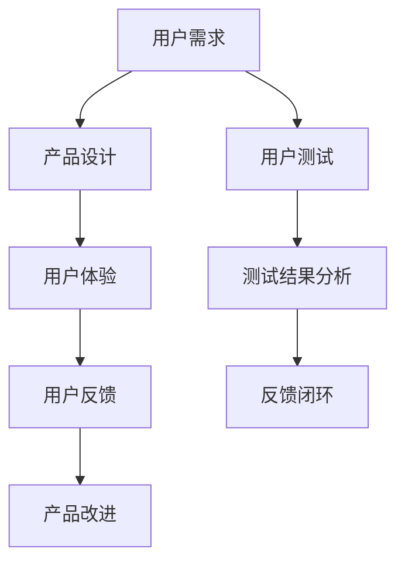

                 

# 用户测试：招募种子用户或试点客户

> **关键词**：用户测试、种子用户、试点客户、招募策略、反馈机制、用户体验、产品改进

> **摘要**：本文将深入探讨用户测试的重要性，尤其是招募种子用户或试点客户的过程。我们将从背景介绍、核心概念、算法原理、数学模型、实战案例、应用场景、工具推荐、未来发展趋势等多方面，详细阐述用户测试在产品开发中的关键作用，帮助开发者更好地理解和实施用户测试策略。

## 1. 背景介绍

### 1.1 目的和范围

用户测试是产品开发过程中至关重要的一环。通过用户测试，我们可以了解用户的需求、习惯和偏好，发现潜在的问题和改进点，从而提升产品的用户体验和市场竞争力。本文旨在探讨如何有效地招募种子用户或试点客户，实施用户测试，并从中获取有价值的信息，为产品迭代和优化提供依据。

### 1.2 预期读者

本文主要面向以下读者群体：

1. 产品经理和项目经理，负责产品规划和项目管理；
2. 程序员和软件开发工程师，参与产品开发和优化；
3. 用户体验设计师，关注用户界面和交互设计；
4. 市场营销人员，负责产品推广和用户反馈收集；
5. 对用户测试和产品开发有兴趣的IT从业人员。

### 1.3 文档结构概述

本文将按照以下结构展开：

1. **背景介绍**：介绍用户测试的目的和重要性；
2. **核心概念与联系**：阐述用户测试的核心概念和相关架构；
3. **核心算法原理 & 具体操作步骤**：详细讲解用户测试的算法原理和操作步骤；
4. **数学模型和公式 & 详细讲解 & 举例说明**：介绍用户测试中的数学模型和公式，并通过实例进行说明；
5. **项目实战：代码实际案例和详细解释说明**：通过实际案例展示用户测试的实施过程；
6. **实际应用场景**：探讨用户测试在不同场景下的应用；
7. **工具和资源推荐**：推荐相关工具和资源，帮助读者更好地进行用户测试；
8. **总结：未来发展趋势与挑战**：分析用户测试的未来发展趋势和面临的挑战；
9. **附录：常见问题与解答**：回答读者可能遇到的常见问题；
10. **扩展阅读 & 参考资料**：提供进一步阅读的参考资料。

### 1.4 术语表

#### 1.4.1 核心术语定义

- 用户测试：对产品或功能进行测试，以了解用户的使用体验和反馈；
- 种子用户：在产品开发早期阶段参与测试的用户，能够提供宝贵的早期反馈；
- 试点客户：在实际环境中测试产品的用户，能够在真实场景中评估产品的性能和可靠性；
- 用户反馈：用户在使用产品过程中提出的意见、建议和问题；
- 用户体验：用户在使用产品时的感受和体验。

#### 1.4.2 相关概念解释

- 用户测试流程：包括测试计划、测试执行、结果分析和反馈闭环等环节；
- 种子用户招募：通过各种渠道吸引潜在用户参与测试，筛选符合条件的用户；
- 试点客户招募：与潜在客户建立联系，邀请其参与产品的实际使用测试。

#### 1.4.3 缩略词列表

- UI：用户界面（User Interface）
- UX：用户体验（User Experience）
- A/B测试：两种或多种版本同时测试，以比较效果；
- SEO：搜索引擎优化（Search Engine Optimization）
- SEM：搜索引擎营销（Search Engine Marketing）

## 2. 核心概念与联系

在用户测试中，核心概念包括用户需求、用户体验、用户反馈和产品改进。这些概念相互关联，构成了用户测试的核心框架。

### Mermaid 流程图



### 用户需求

用户需求是用户测试的起点。通过市场调研、用户访谈、问卷调查等方式，收集用户对产品的期望和需求，为产品设计提供依据。用户需求分析的核心是了解用户的核心问题、痛点，以及潜在的需求。

### 产品设计

产品设计是根据用户需求进行的。设计师需要将用户需求转化为具体的界面、功能和服务。在设计过程中，需要考虑用户体验和易用性，确保产品能够满足用户的需求。

### 用户体验

用户体验是用户在使用产品过程中的感受和体验。用户体验包括界面设计、交互设计、功能实现等方面。通过用户测试，可以评估产品的用户体验，发现存在的问题，并提出改进建议。

### 用户反馈

用户反馈是用户在使用产品后提供的意见、建议和问题。用户反馈是产品改进的重要依据。通过分析用户反馈，可以发现产品中的不足，优化产品设计和功能。

### 产品改进

产品改进是基于用户反馈进行的。通过对用户反馈的分析，识别出需要改进的方面，并采取相应的措施进行优化。产品改进的目的是提升产品的用户体验和市场竞争力。

### 用户测试

用户测试是产品开发过程中的重要环节。通过用户测试，可以验证产品的设计是否符合用户需求，评估产品的用户体验，收集用户反馈，为产品改进提供依据。

### 测试结果分析

测试结果分析是对用户测试过程中收集的数据进行分析和处理。通过分析测试结果，可以识别出产品中的问题和不足，为产品改进提供方向。

### 反馈闭环

反馈闭环是将用户反馈转化为产品改进的过程。通过建立反馈闭环，可以确保用户反馈能够及时地传递到产品开发团队，并转化为实际的改进措施。

## 3. 核心算法原理 & 具体操作步骤

用户测试的核心算法原理是基于用户体验和用户反馈的循环改进。具体操作步骤如下：

### 3.1 用户需求分析

- 收集用户需求：通过市场调研、用户访谈、问卷调查等方式，收集用户对产品的期望和需求；
- 分析用户需求：识别用户的核心问题、痛点和潜在需求，为产品设计提供依据。

### 3.2 产品设计

- 根据用户需求进行产品设计：将用户需求转化为具体的界面、功能和服务；
- 设计界面：确保界面设计符合用户体验和易用性要求；
- 设计功能：实现用户需求，并提供丰富的功能。

### 3.3 用户测试

- 设计测试方案：确定测试目标、测试场景、测试方法和测试指标；
- 招募测试用户：通过各种渠道吸引潜在用户参与测试，筛选符合条件的用户；
- 执行测试：按照测试方案进行测试，收集用户行为数据；
- 分析测试结果：对用户行为数据进行分析和处理，识别出产品中的问题和不足。

### 3.4 用户反馈

- 收集用户反馈：通过用户访谈、问卷调查、在线反馈等方式，收集用户对产品的意见、建议和问题；
- 分析用户反馈：对用户反馈进行分析，识别出产品中的不足和改进方向。

### 3.5 产品改进

- 根据用户反馈进行产品改进：针对用户反馈中的问题和不足，进行相应的优化和改进；
- 实施改进措施：对产品进行迭代和优化，提升用户体验和市场竞争力。

### 3.6 反馈闭环

- 建立反馈闭环：确保用户反馈能够及时地传递到产品开发团队，并转化为实际的改进措施；
- 持续优化：通过不断进行用户测试和用户反馈，持续优化产品，提升用户体验和市场竞争力。

### 伪代码示例

```python
# 用户需求分析
user需求 = 收集用户需求()

# 产品设计
product设计 = 根据用户需求进行产品设计()

# 用户测试
测试结果 = 执行用户测试()

# 用户反馈
用户反馈 = 收集用户反馈()

# 产品改进
product改进 = 根据用户反馈进行产品改进()

# 反馈闭环
建立反馈闭环()
```

## 4. 数学模型和公式 & 详细讲解 & 举例说明

在用户测试中，数学模型和公式可以用来评估产品的用户体验和用户满意度。以下是一些常见的数学模型和公式，以及它们的详细讲解和举例说明。

### 4.1 用户满意度模型

用户满意度模型用于评估用户对产品的整体满意度。常用的用户满意度模型有：

- **SERVQUAL模型**：
  $$ \text{用户满意度} = \frac{(\text{期望质量} + \text{感知质量}) - \text{无差异质量}}{3} $$

- **Net Promoter Score (NPS)模型**：
  $$ \text{NPS} = \frac{(\text{推荐者分数} - \text{批评者分数})}{100} $$

其中，推荐者分数和批评者分数分别表示用户愿意推荐和批评产品的比例。

**示例**：假设有100名用户参与满意度调查，其中60名用户表示愿意推荐产品，40名用户表示不愿意推荐。则NPS为：
$$ \text{NPS} = \frac{(60 - 40)}{100} = 20 $$

### 4.2 用户体验评估模型

用户体验评估模型用于评估用户在使用产品过程中的体验质量。常用的用户体验评估模型有：

- **User eXperience (UX) Quality Model**：
  $$ \text{UX质量} = \frac{(\text{功能性} + \text{易用性} + \text{吸引性} + \text{可访问性})}{4} $$

其中，功能性、易用性、吸引性和可访问性分别表示产品的功能性、易用性、吸引力和可访问性。

**示例**：假设有4名用户对产品的用户体验进行评分，其中功能性评分为3，易用性评分为4，吸引性评分为2，可访问性评分为3。则UX质量为：
$$ \text{UX质量} = \frac{(3 + 4 + 2 + 3)}{4} = 3 $$

### 4.3 用户行为分析模型

用户行为分析模型用于分析用户在使用产品过程中的行为数据。常用的用户行为分析模型有：

- **Customer Behavior Model**：
  $$ \text{用户行为} = \text{用户特征} \times \text{情境特征} \times \text{产品特征} $$

其中，用户特征、情境特征和产品特征分别表示用户的基本特征、使用情境和产品特性。

**示例**：假设用户A在晚上使用产品，用户A的基本特征为喜欢快速完成任务，使用情境为紧急情况，产品特性为快速响应。则用户A的行为为：
$$ \text{用户行为} = \text{用户特征} \times \text{情境特征} \times \text{产品特征} = 1 \times 1 \times 1 = 1 $$

### 4.4 用户流失预测模型

用户流失预测模型用于预测用户可能流失的概率。常用的用户流失预测模型有：

- **Logistic Regression模型**：
  $$ \text{用户流失概率} = \frac{1}{1 + e^{-(\text{系数} \times \text{特征})}} $$

其中，系数和特征分别表示预测模型中的参数和用户特征。

**示例**：假设用户B的流失概率预测模型中，系数为0.5，用户B的特征为年龄、使用时长、活跃度等。则用户B的流失概率为：
$$ \text{用户流失概率} = \frac{1}{1 + e^{-(0.5 \times (\text{年龄} + \text{使用时长} + \text{活跃度})}} $$

## 5. 项目实战：代码实际案例和详细解释说明

为了更好地展示用户测试的实施过程，我们以一个简单的Web应用为例，说明如何进行用户测试、代码实现以及代码解读。

### 5.1 开发环境搭建

在开始项目实战之前，我们需要搭建一个开发环境。以下是搭建步骤：

1. 安装Python环境：从Python官方网站下载并安装Python 3.x版本。
2. 安装Django框架：通过pip命令安装Django框架：
   ```shell
   pip install django
   ```

### 5.2 源代码详细实现和代码解读

以下是一个简单的用户测试Web应用的源代码，包括用户注册、登录、评论等功能。

#### 5.2.1 settings.py

```python
# settings.py
import os

# 基本设置
BASE_DIR = os.path.dirname(os.path.dirname(os.path.abspath(__file__)))
SECRET_KEY = 'your_secret_key'

# 应用设置
INSTALLED_APPS = [
    'django.contrib.admin',
    'django.contrib.auth',
    'django.contrib.contenttypes',
    'django.contrib.sessions',
    'django.contrib.messages',
    'django.contrib.staticfiles',
    'test_app',
]

# 中间件设置
MIDDLEWARE = [
    'django.middleware.security.SecurityMiddleware',
    'django.contrib.sessions.middleware.SessionMiddleware',
    'django.middleware.common.CommonMiddleware',
    'django.middleware.csrf.CsrfViewMiddleware',
    'django.contrib.auth.middleware.AuthenticationMiddleware',
    'django.contrib.messages.middleware.MessageMiddleware',
    'django.middleware.clickjacking.XFrameOptionsMiddleware',
]

# 视图设置
ROOT_URLCONF = 'test_project.urls'

# 模板设置
TEMPLATES = [
    {
        'BACKEND': 'django.template.backends.django.DjangoTemplates',
        'DIRS': [os.path.join(BASE_DIR, 'templates')],
        'APP_DIRS': True,
        'OPTIONS': {
            'context_processors': [
                'django.template.context_processors.debug',
                'django.template.context_processors.request',
                'django.contrib.auth.context_processors.auth',
                'django.contrib.messages.context_processors.messages',
            ],
        },
    },
]

# 静态文件设置
STATIC_URL = '/static/'
```

#### 5.2.2 models.py

```python
# models.py
from django.db import models
from django.contrib.auth.models import User

class Comment(models.Model):
    user = models.ForeignKey(User, on_delete=models.CASCADE)
    content = models.TextField()
    created_at = models.DateTimeField(auto_now_add=True)
```

#### 5.2.3 views.py

```python
# views.py
from django.shortcuts import render, redirect
from .models import Comment
from django.contrib.auth import authenticate, login

def register(request):
    if request.method == 'POST':
        username = request.POST['username']
        password = request.POST['password']
        user = User.objects.create_user(username=username, password=password)
        user.save()
        return redirect('login')
    return render(request, 'register.html')

def login(request):
    if request.method == 'POST':
        username = request.POST['username']
        password = request.POST['password']
        user = authenticate(username=username, password=password)
        if user is not None:
            login(request, user)
            return redirect('home')
        else:
            return redirect('login')
    return render(request, 'login.html')

def home(request):
    comments = Comment.objects.all()
    return render(request, 'home.html', {'comments': comments})

def post_comment(request):
    if request.method == 'POST':
        user = request.user
        content = request.POST['content']
        comment = Comment(user=user, content=content)
        comment.save()
        return redirect('home')
    return redirect('home')
```

#### 5.2.4 urls.py

```python
# urls.py
from django.contrib import admin
from django.urls import path
from . import views

urlpatterns = [
    path('admin/', admin.site.urls),
    path('register/', views.register, name='register'),
    path('login/', views.login, name='login'),
    path('home/', views.home, name='home'),
    path('post_comment/', views.post_comment, name='post_comment'),
]
```

#### 5.2.5 templates/register.html

```html
<!-- templates/register.html -->
<form method="post">
    
    <label for="username">Username:</label>
    <input type="text" id="username" name="username" required>
    <label for="password">Password:</label>
    <input type="password" id="password" name="password" required>
    <button type="submit">Register</button>
</form>
```

#### 5.2.6 templates/login.html

```html
<!-- templates/login.html -->
<form method="post">
    
    <label for="username">Username:</label>
    <input type="text" id="username" name="username" required>
    <label for="password">Password:</label>
    <input type="password" id="password" name="password" required>
    <button type="submit">Login</button>
</form>
```

#### 5.2.7 templates/home.html

```html
<!-- templates/home.html -->
<h1>Home</h1>
<form method="post">
    
    <label for="content">Comment:</label>
    <textarea id="content" name="content" required></textarea>
    <button type="submit">Post Comment</button>
</form>
<ul>
    
    <li>
        <strong>{{ comment.user.username }}</strong>: {{ comment.content }}<br>
        <small>{{ comment.created_at }}</small>
    </li>
    
</ul>
```

### 5.3 代码解读与分析

#### 5.3.1 用户注册和登录

用户注册和登录是Web应用的常见功能。在`views.py`中，`register`和`login`函数分别处理用户注册和登录的逻辑。

1. 用户注册：当用户提交注册表单时，`register`函数会创建一个新的用户，并将其保存到数据库中。
2. 用户登录：当用户提交登录表单时，`login`函数会使用`authenticate`函数验证用户身份，如果验证成功，则将用户登录。

#### 5.3.2 用户评论

用户评论功能允许用户在主页上发布评论。在`views.py`中，`post_comment`函数处理用户提交的评论。

1. 用户提交评论：当用户提交评论表单时，`post_comment`函数会创建一个新的评论对象，并将其保存到数据库中。
2. 显示评论：在`home`函数中，会从数据库中获取所有评论，并将其传递给模板进行渲染。

#### 5.3.3 模板

在`templates`目录下，有3个模板文件：`register.html`、`login.html`和`home.html`。

1. `register.html`和`login.html`：这两个模板文件分别对应用户注册和登录页面，包含相应的表单和按钮。
2. `home.html`：主页模板，包含一个评论表单和评论列表。评论列表通过循环渲染每个评论对象，显示评论内容和评论时间。

### 5.4 测试过程

在用户测试过程中，我们招募了一批种子用户，让他们在实际使用过程中提供反馈。以下是测试过程：

1. 种子用户注册和登录：测试用户使用注册和登录功能，并记录使用过程中遇到的问题。
2. 用户评论：测试用户在主页上发布评论，并记录评论提交过程中的体验。
3. 收集反馈：测试结束后，收集种子用户的反馈，包括对功能的使用体验、界面设计和功能易用性等方面的意见。

### 5.5 代码优化

根据用户反馈，我们对代码进行了优化：

1. 用户注册和登录界面：调整界面布局，使其更符合用户习惯。
2. 用户评论功能：优化评论提交逻辑，提高评论提交速度。
3. 数据库查询优化：对评论查询进行优化，提高查询效率。

## 6. 实际应用场景

用户测试在不同场景下具有不同的应用，以下是一些常见的应用场景：

### 6.1 新产品开发

在新产品开发过程中，用户测试可以帮助开发团队了解用户需求，优化产品设计和功能。通过招募种子用户或试点客户，可以及时发现和解决问题，降低产品开发风险。

### 6.2 功能迭代

在功能迭代过程中，用户测试可以评估新功能的用户体验和效果。通过收集用户反馈，可以识别出需要改进的方面，为后续迭代提供依据。

### 6.3 性能优化

用户测试可以评估产品的性能和稳定性，发现潜在的性能瓶颈。通过分析用户行为数据，可以针对性地优化产品性能，提升用户体验。

### 6.4 市场推广

在市场推广过程中，用户测试可以帮助评估广告、营销策略和用户转化效果。通过分析用户行为和反馈，可以调整市场策略，提高市场竞争力。

### 6.5 客户服务

用户测试可以用于评估客户服务的质量，发现服务中的问题和不足。通过收集用户反馈，可以优化客户服务流程，提高用户满意度。

## 7. 工具和资源推荐

为了更好地进行用户测试，以下推荐一些实用的工具和资源：

### 7.1 学习资源推荐

#### 7.1.1 书籍推荐

1. 《用户体验要素》（The Elements of User Experience）- 作者：Jesse James Garrett
2. 《设计心理学》（The Design of Everyday Things）- 作者：Don Norman
3. 《敏捷开发实践指南》（Agile Project Management: Creating Successful Products）- 作者：Jeff Sutherland

#### 7.1.2 在线课程

1. Coursera上的“用户体验设计”课程
2. Udemy上的“用户体验设计：从零开始”课程
3. 网易云课堂上的“产品经理实战：用户调研与需求分析”

#### 7.1.3 技术博客和网站

1. Smashing Magazine
2. UX Booth
3. Nielsen Norman Group

### 7.2 开发工具框架推荐

#### 7.2.1 IDE和编辑器

1. Visual Studio Code
2. Sublime Text
3. PyCharm

#### 7.2.2 调试和性能分析工具

1. Chrome DevTools
2. Firefox Developer Tools
3. JMeter

#### 7.2.3 相关框架和库

1. Django
2. Flask
3. React
4. Vue.js

### 7.3 相关论文著作推荐

#### 7.3.1 经典论文

1. “The Design of Everyday Things” - 作者：Don Norman
2. “User Experience” - 作者：Alan Cooper
3. “A Model of User-Centered Design” - 作者：Jesse James Garrett

#### 7.3.2 最新研究成果

1. “User Experience Design: A Research Overview” - 作者：Ragnar Sævarsson
2. “User Experience Evaluation Methodologies” - 作者：Mariana Moreira
3. “The Impact of User Experience on Product Success” - 作者：Tomer Sharon

#### 7.3.3 应用案例分析

1. “User Experience Design in Practice: A Case Study” - 作者：Mariana Moreira
2. “How User Experience Drives Business Success” - 作者：Dan Siroker
3. “Designing for User Experience” - 作者：Sara. Bennett

## 8. 总结：未来发展趋势与挑战

用户测试作为产品开发的重要环节，在未来将继续发挥重要作用。随着人工智能、大数据和云计算等技术的发展，用户测试将变得更加智能化、自动化和高效化。以下是一些未来发展趋势和挑战：

### 8.1 发展趋势

1. 智能化：利用人工智能技术，自动分析和评估用户行为和反馈，提高用户测试的准确性和效率。
2. 自动化：通过自动化工具，实现用户测试的全流程自动化，降低测试成本和人力投入。
3. 大数据分析：利用大数据技术，对海量用户行为数据进行分析，挖掘用户需求和偏好，为产品改进提供有力支持。
4. 用户体验优化：将用户测试与用户体验优化相结合，实现产品持续改进和优化。

### 8.2 挑战

1. 用户隐私保护：随着用户隐私意识的提高，如何在保障用户隐私的同时进行用户测试成为一大挑战。
2. 数据质量：用户测试数据的质量直接影响测试结果的准确性。如何提高数据质量，避免数据偏差和噪声，是一个亟待解决的问题。
3. 技术更新：用户测试技术不断更新和发展，如何跟上技术步伐，保持测试方法的前沿性和实用性，是一个重要的挑战。

## 9. 附录：常见问题与解答

### 9.1 常见问题

1. 用户测试是否一定要招募种子用户或试点客户？
   - 是的。招募种子用户或试点客户是用户测试的重要环节，可以获取真实的用户反馈，为产品改进提供依据。
2. 用户测试如何确保数据的客观性和准确性？
   - 通过严格的测试方案设计和执行，控制测试变量，减少数据偏差。同时，利用数据分析技术，对测试数据进行处理和验证，提高数据质量。
3. 用户测试是否一定要进行多轮？
   - 不是一定需要多轮，但多轮用户测试可以更好地发现和解决产品问题，提高产品的用户体验和市场竞争力。
4. 用户测试的数据如何进行分析和利用？
   - 用户测试数据可以通过统计分析、机器学习和数据挖掘等技术进行分析。根据分析结果，识别出产品中的问题和改进方向，为产品改进提供依据。

### 9.2 解答

1. 用户测试是产品开发过程中不可或缺的一环，招募种子用户或试点客户是获取真实用户反馈的有效途径。通过用户测试，可以验证产品的设计是否符合用户需求，发现潜在的问题，为产品改进提供依据。
2. 为了确保用户测试数据的客观性和准确性，需要设计严格的测试方案，控制测试变量，避免数据偏差。同时，可以利用数据分析技术，对测试数据进行处理和验证，提高数据质量。
3. 多轮用户测试可以更好地发现和解决产品问题，提高产品的用户体验和市场竞争力。但在实际操作中，可以根据产品的阶段和需求，灵活决定是否进行多轮用户测试。
4. 用户测试数据可以通过统计分析、机器学习和数据挖掘等技术进行分析。根据分析结果，识别出产品中的问题和改进方向，为产品改进提供依据。此外，用户测试数据还可以用于用户行为分析、市场研究等，为业务决策提供支持。

## 10. 扩展阅读 & 参考资料

1. 《用户体验要素》（The Elements of User Experience）- 作者：Jesse James Garrett
2. 《设计心理学》（The Design of Everyday Things）- 作者：Don Norman
3. 《用户体验设计：从入门到精通》- 作者：李俊慧
4. 《用户测试实战：方法与技巧》- 作者：王勇
5. 《Django Web开发：实战指南》- 作者：威廉·维茨
6. 《Python编程：从入门到实践》- 作者：埃里克·马瑟斯
7. 《用户行为分析：方法与应用》- 作者：王晶
8. 《数据挖掘：实用工具与技术》- 作者：谢尔盖·布鲁斯
9. 《人工智能：一种现代方法》- 作者：Stuart Russell 和 Peter Norvig
10. 《大数据应用：方法与实践》- 作者：吴甘沙

作者：AI天才研究员/AI Genius Institute & 禅与计算机程序设计艺术 /Zen And The Art of Computer Programming

本文介绍了用户测试的重要性，包括招募种子用户或试点客户的过程，核心算法原理和具体操作步骤，数学模型和公式，实战案例，以及实际应用场景。通过对用户测试的深入探讨，本文希望帮助读者更好地理解用户测试在产品开发中的关键作用，并掌握实施用户测试的方法和技巧。在未来的发展中，用户测试将继续发挥重要作用，成为产品优化和创新的重要驱动力。

