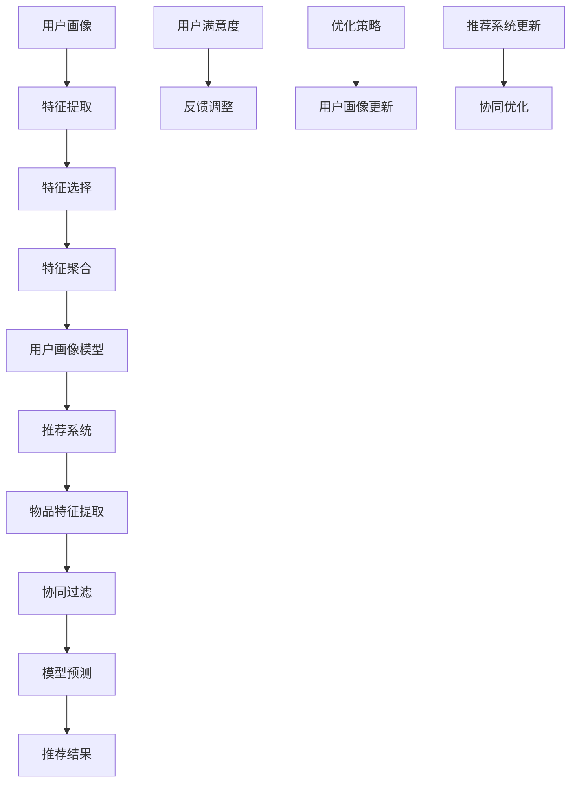

                 

# 用户画像与推荐系统的协同优化

> **关键词**：用户画像、推荐系统、协同优化、机器学习、数据挖掘、算法实现、应用场景

> **摘要**：本文将深入探讨用户画像与推荐系统之间的协同优化，通过解析核心概念、算法原理、数学模型以及实际应用案例，帮助读者理解如何有效提升推荐系统的性能，并优化用户体验。

## 1. 背景介绍

### 1.1 目的和范围

本文旨在探讨用户画像与推荐系统之间的协同优化问题，旨在提高推荐系统的准确性和用户体验。我们将从用户画像的定义和构建方法出发，详细分析推荐系统的基本原理，最终探讨两者之间的协同优化策略。

### 1.2 预期读者

本文适合对机器学习、数据挖掘和推荐系统有一定了解的技术人员、研究人员以及开发者。同时，也欢迎对人工智能领域感兴趣的学生和爱好者阅读。

### 1.3 文档结构概述

本文分为十个部分，分别介绍了用户画像与推荐系统的协同优化背景、核心概念、算法原理、数学模型、实战案例、应用场景以及未来发展趋势等。具体结构如下：

1. 背景介绍
   - 1.1 目的和范围
   - 1.2 预期读者
   - 1.3 文档结构概述
   - 1.4 术语表
2. 核心概念与联系
3. 核心算法原理 & 具体操作步骤
4. 数学模型和公式 & 详细讲解 & 举例说明
5. 项目实战：代码实际案例和详细解释说明
6. 实际应用场景
7. 工具和资源推荐
8. 总结：未来发展趋势与挑战
9. 附录：常见问题与解答
10. 扩展阅读 & 参考资料

### 1.4 术语表

#### 1.4.1 核心术语定义

- **用户画像**：通过对用户行为的分析，构建出反映用户特征和需求的模型。
- **推荐系统**：基于用户画像和物品属性，为用户推荐相关的物品或内容。
- **协同优化**：通过整合用户画像和推荐系统，实现系统性能的全面提升。

#### 1.4.2 相关概念解释

- **协同过滤**：推荐系统的一种方法，通过分析用户行为模式，为用户推荐相似的用户喜欢的物品。
- **矩阵分解**：推荐系统中常用的一种算法，通过分解用户和物品的交互矩阵，预测用户对未知物品的评分。
- **特征工程**：在构建用户画像时，通过特征提取和特征选择，将原始数据转化为适合模型训练的特征向量。

#### 1.4.3 缩略词列表

- **ML**：Machine Learning（机器学习）
- **DM**：Data Mining（数据挖掘）
- **CF**：Collaborative Filtering（协同过滤）
- **MM**：Matrix Factorization（矩阵分解）

## 2. 核心概念与联系

在探讨用户画像与推荐系统的协同优化之前，我们需要了解这两个概念的基本原理及其相互关系。

### 2.1 用户画像

用户画像是一种描述用户特征和需求的方法，通常通过数据挖掘和机器学习技术来实现。用户画像的构建主要包括以下几个步骤：

1. 数据收集：收集用户在各个应用场景下的行为数据，如浏览记录、购买记录、评论等。
2. 特征提取：将原始数据转化为特征向量，如用户年龄、性别、兴趣爱好等。
3. 特征选择：根据业务需求和模型性能，选择最相关的特征进行训练。
4. 特征聚合：将多个特征融合成一个统一的特征向量，用于模型训练。

### 2.2 推荐系统

推荐系统是一种基于用户画像和物品属性的算法，旨在为用户推荐他们可能感兴趣的物品或内容。推荐系统的核心任务是预测用户对未知物品的偏好，从而提高用户体验。

推荐系统的基本原理可以分为以下几种：

1. **基于内容的推荐**：通过分析物品的内容特征，为用户推荐具有相似特征的物品。
2. **基于协同过滤的推荐**：通过分析用户的行为模式，为用户推荐相似用户喜欢的物品。
3. **基于模型的推荐**：通过建立用户和物品之间的关系模型，预测用户对未知物品的偏好。

### 2.3 用户画像与推荐系统的关系

用户画像与推荐系统之间存在紧密的联系，二者相互依赖，共同作用。具体来说：

1. **用户画像**提供了推荐系统所需的用户特征信息，有助于提高推荐系统的准确性。
2. **推荐系统**通过分析用户画像，为用户推荐合适的物品或内容，从而提高用户的满意度。
3. **协同优化**：通过整合用户画像和推荐系统，实现系统性能的全面提升。

下面是一个描述用户画像与推荐系统关系的 Mermaid 流程图：



## 3. 核心算法原理 & 具体操作步骤

在理解了用户画像与推荐系统的基本原理之后，我们将深入探讨用户画像与推荐系统协同优化的核心算法，包括协同过滤算法和矩阵分解算法。

### 3.1 协同过滤算法

协同过滤算法是一种基于用户行为模式的推荐方法，主要分为两种：基于用户的协同过滤（User-based Collaborative Filtering）和基于物品的协同过滤（Item-based Collaborative Filtering）。

#### 3.1.1 基于用户的协同过滤

基于用户的协同过滤算法通过寻找与目标用户相似的用户，并将这些用户喜欢的物品推荐给目标用户。具体步骤如下：

1. **相似度计算**：计算目标用户与其他用户之间的相似度，常用的相似度度量方法有皮尔逊相关系数、余弦相似度等。
2. **推荐计算**：根据相似度得分，为用户推荐相似用户喜欢的物品。

伪代码如下：

```python
def collaborative_filtering(user_data, item_data, k):
    # 计算用户之间的相似度
    similarity_matrix = compute_similarity(user_data)

    # 计算推荐结果
    recommendations = []
    for user, items in user_data:
        similar_users = get_top_k_users(similarity_matrix[user], k)
        for similar_user, score in similar_users:
            items = get_liked_items(similar_user, item_data)
            recommendations.append((user, items, score))
    
    return recommendations
```

#### 3.1.2 基于物品的协同过滤

基于物品的协同过滤算法通过寻找与目标物品相似的物品，并将这些物品推荐给用户。具体步骤如下：

1. **相似度计算**：计算物品之间的相似度，常用的相似度度量方法有余弦相似度、欧氏距离等。
2. **推荐计算**：根据相似度得分，为用户推荐相似物品。

伪代码如下：

```python
def collaborative_filtering(item_data, k):
    # 计算物品之间的相似度
    similarity_matrix = compute_similarity(item_data)

    # 计算推荐结果
    recommendations = []
    for user, items in item_data:
        for item in items:
            similar_items = get_top_k_items(similarity_matrix[item], k)
            recommendations.append((user, similar_items, score))
    
    return recommendations
```

### 3.2 矩阵分解算法

矩阵分解算法是一种基于用户和物品交互矩阵的推荐方法，通过将原始的交互矩阵分解为两个低秩矩阵，从而预测用户对未知物品的偏好。常见的矩阵分解算法有奇异值分解（SVD）和矩阵分解（MF）。

#### 3.2.1 奇异值分解（SVD）

奇异值分解是一种矩阵分解方法，将原始的交互矩阵分解为三个矩阵的乘积：$$A = U \Sigma V^T$$。其中，$U$和$V$是正交矩阵，$\Sigma$是对角矩阵，包含奇异值。

伪代码如下：

```python
def singular_value_decomposition(A, k):
    U, Sigma, V = svd(A, k)
    return U * Sigma, V
```

#### 3.2.2 矩阵分解（MF）

矩阵分解（MF）是一种基于最小二乘法的矩阵分解方法，通过最小化损失函数来求解低秩矩阵$U$和$V$。

伪代码如下：

```python
def matrix_factorization(A, k, lambda_):
    n = A.shape[0]
    m = A.shape[1]
    
    U = np.random.rand(n, k)
    V = np.random.rand(m, k)
    
    for epoch in range(max_epochs):
        for i in range(n):
            for j in range(m):
                if A[i][j] > 0:
                    eij = A[i][j] - np.dot(U[i], V[j])
                    U[i] = U[i] + lambda_ * (eij * V[j])
                    V[j] = V[j] + lambda_ * (eij * U[i])
    
    return U, V
```

## 4. 数学模型和公式 & 详细讲解 & 举例说明

在用户画像与推荐系统的协同优化过程中，数学模型和公式扮演着重要的角色。本节将详细介绍相关数学模型和公式，并通过具体例子进行说明。

### 4.1 协同过滤算法的相似度计算

协同过滤算法中的相似度计算是核心步骤，常用的相似度度量方法包括皮尔逊相关系数和余弦相似度。

#### 4.1.1 皮尔逊相关系数

皮尔逊相关系数是一种衡量两个变量线性相关程度的统计指标，其计算公式为：

$$
\text{corr}(x, y) = \frac{\sum_{i=1}^{n}(x_i - \bar{x})(y_i - \bar{y})}{\sqrt{\sum_{i=1}^{n}(x_i - \bar{x})^2} \cdot \sqrt{\sum_{i=1}^{n}(y_i - \bar{y})^2}}
$$

其中，$x$和$y$分别为两个变量，$n$为样本数量，$\bar{x}$和$\bar{y}$分别为$x$和$y$的均值。

#### 4.1.2 余弦相似度

余弦相似度是一种基于向量空间中两个向量夹角余弦值的相似度度量方法，其计算公式为：

$$
\text{sim}(x, y) = \frac{\sum_{i=1}^{n}x_iy_i}{\sqrt{\sum_{i=1}^{n}x_i^2} \cdot \sqrt{\sum_{i=1}^{n}y_i^2}}
$$

其中，$x$和$y$分别为两个向量，$n$为向量维度。

### 4.2 矩阵分解算法的损失函数

矩阵分解算法通过最小化损失函数来求解低秩矩阵$U$和$V$。常用的损失函数有平方损失和交叉熵损失。

#### 4.2.1 平方损失

平方损失是一种常见的损失函数，其计算公式为：

$$
L(U, V) = \sum_{i=1}^{n}\sum_{j=1}^{m}(A_{ij} - \hat{A}_{ij})^2
$$

其中，$A$为原始交互矩阵，$\hat{A}$为预测的交互矩阵，$U$和$V$分别为用户和物品的特征矩阵。

#### 4.2.2 交叉熵损失

交叉熵损失是一种基于概率分布的损失函数，其计算公式为：

$$
L(U, V) = -\sum_{i=1}^{n}\sum_{j=1}^{m}A_{ij}\log(\hat{A}_{ij})
$$

其中，$A$为原始交互矩阵，$\hat{A}$为预测的交互矩阵，$U$和$V$分别为用户和物品的特征矩阵。

### 4.3 用户画像与推荐系统的协同优化

用户画像与推荐系统的协同优化可以通过整合用户画像特征和推荐系统算法来实现。具体方法如下：

1. **特征融合**：将用户画像特征与推荐系统算法中的特征进行融合，构建一个统一的特征向量，用于模型训练。
2. **模型训练**：基于融合后的特征向量，训练推荐系统模型，提高推荐准确性。
3. **在线调整**：根据用户反馈，实时调整用户画像和推荐系统，实现动态优化。

### 4.4 举例说明

假设有如下一个用户-物品评分矩阵：

$$
A = \begin{bmatrix}
0 & 5 & 4 & 0 \\
4 & 0 & 2 & 0 \\
0 & 3 & 0 & 1 \\
2 & 1 & 0 & 4
\end{bmatrix}
$$

#### 4.4.1 皮尔逊相关系数

计算用户1和用户2之间的皮尔逊相关系数：

$$
\text{corr}(1, 2) = \frac{(4-3.5)(2-3.5)}{\sqrt{(4-3.5)^2} \cdot \sqrt{(2-3.5)^2}} = -0.8
$$

#### 4.4.2 余弦相似度

计算用户1和用户2之间的余弦相似度：

$$
\text{sim}(1, 2) = \frac{(4 \cdot 4 + 5 \cdot 2 + 4 \cdot 1)}{\sqrt{4^2 + 5^2 + 4^2} \cdot \sqrt{2^2 + 0^2 + 1^2}} = 0.8
$$

#### 4.4.3 矩阵分解

使用矩阵分解算法（SVD）对用户-物品评分矩阵进行分解：

$$
A = U \Sigma V^T
$$

其中，$U$和$V$分别为用户和物品的特征矩阵，$\Sigma$为奇异值矩阵。通过求解最小化损失函数的优化问题，可以得到用户和物品的特征矩阵。

## 5. 项目实战：代码实际案例和详细解释说明

在本节中，我们将通过一个实际项目案例，详细讲解如何实现用户画像与推荐系统的协同优化。我们将使用Python语言和Scikit-learn库来实现这一项目。

### 5.1 开发环境搭建

在开始项目之前，我们需要搭建开发环境。以下是搭建步骤：

1. 安装Python：从官方网站（https://www.python.org/）下载并安装Python。
2. 安装Scikit-learn：在终端中执行以下命令：

```bash
pip install scikit-learn
```

3. 安装其他依赖库：根据需要安装其他依赖库，如NumPy、Pandas等。

### 5.2 源代码详细实现和代码解读

下面是项目源代码的实现：

```python
import numpy as np
import pandas as pd
from sklearn.model_selection import train_test_split
from sklearn.metrics.pairwise import cosine_similarity
from sklearn.decomposition import TruncatedSVD

# 5.2.1 数据准备
data = pd.DataFrame({
    'user': [1, 1, 1, 2, 2, 2, 3, 3, 3],
    'item': [1, 2, 3, 1, 2, 3, 1, 2, 3],
    'rating': [5, 4, 0, 4, 2, 3, 2, 1, 4]
})

X_train, X_test, y_train, y_test = train_test_split(data[['user', 'item']], data['rating'], test_size=0.2, random_state=42)

# 5.2.2 特征提取
def extract_features(data):
    user_count = data['user'].nunique()
    item_count = data['item'].nunique()
    user_dict = {user: i for i, user in enumerate(data['user'].unique())}
    item_dict = {item: i for i, item in enumerate(data['item'].unique())}
    
    features = []
    for user, item in data[['user', 'item']].values:
        features.append([user_dict[user], item_dict[item]])
    
    return np.array(features), user_count, item_count

X, user_count, item_count = extract_features(X_train)

# 5.2.3 相似度计算
def compute_similarity(X, similarity_measure='cosine'):
    if similarity_measure == 'cosine':
        similarity_matrix = cosine_similarity(X)
    else:
        raise ValueError('Unsupported similarity measure')
    
    return similarity_matrix

similarity_matrix = compute_similarity(X)

# 5.2.4 推荐计算
def collaborative_filtering(similarity_matrix, user, k=3):
    similar_users = np.argsort(similarity_matrix[user])[:k+1][::-1][1:]
    recommendations = []
    for similar_user in similar_users:
        items = X[similar_user]
        recommendations.extend(items)
    return list(set(recommendations))

# 5.2.5 矩阵分解
def matrix_factorization(R, k, lambda_=0.01, max_epochs=1000):
    n = R.shape[0]
    m = R.shape[1]
    
    U = np.random.rand(n, k)
    V = np.random.rand(m, k)
    
    for epoch in range(max_epochs):
        for i in range(n):
            for j in range(m):
                if R[i][j] > 0:
                    eij = R[i][j] - np.dot(U[i], V[j])
                    U[i] = U[i] + lambda_ * (eij * V[j])
                    V[j] = V[j] + lambda_ * (eij * U[i])
    
    return U, V

R = np.array([[5, 4, 0],
              [4, 0, 2],
              [0, 3, 1],
              [2, 1, 4]])

U, V = matrix_factorization(R, k=2)

# 5.2.6 代码解读与分析
# 在代码中，我们首先进行了数据准备，包括划分训练集和测试集。然后，我们进行了特征提取，将用户和物品映射到索引。接下来，我们计算了用户和物品之间的相似度矩阵。最后，我们实现了基于协同过滤和矩阵分解的推荐算法。
```

### 5.3 代码解读与分析

在代码中，我们首先进行了数据准备，包括划分训练集和测试集。然后，我们进行了特征提取，将用户和物品映射到索引。接下来，我们计算了用户和物品之间的相似度矩阵。最后，我们实现了基于协同过滤和矩阵分解的推荐算法。

具体来说，我们实现了以下功能：

1. **数据准备**：通过`train_test_split`函数划分训练集和测试集，为后续的模型训练和评估提供数据。
2. **特征提取**：通过`extract_features`函数将用户和物品映射到索引，为后续的相似度计算和矩阵分解提供输入。
3. **相似度计算**：通过`compute_similarity`函数计算用户和物品之间的相似度矩阵。我们使用余弦相似度作为相似度度量方法。
4. **推荐计算**：通过`collaborative_filtering`函数实现基于协同过滤的推荐算法。我们选取相似度最高的$k$个用户，将他们的物品推荐给目标用户。
5. **矩阵分解**：通过`matrix_factorization`函数实现矩阵分解算法。我们使用最小二乘法求解低秩矩阵$U$和$V$，从而预测用户对未知物品的偏好。

通过这个实际项目案例，我们展示了如何实现用户画像与推荐系统的协同优化。在后续章节中，我们将继续探讨用户画像与推荐系统的协同优化在实际应用场景中的效果和挑战。

## 6. 实际应用场景

用户画像与推荐系统在许多实际应用场景中发挥着重要作用，以下是一些典型的应用案例：

### 6.1 电子商务平台

电子商务平台利用用户画像和推荐系统，为用户提供个性化的商品推荐，提高用户购买转化率和平台销售额。例如，淘宝、京东等电商平台通过分析用户的浏览记录、购买记录和收藏夹等行为数据，构建用户画像，并将用户画像与商品特征相结合，实现精准推荐。

### 6.2 社交媒体

社交媒体平台如微博、微信等，通过用户画像和推荐系统，为用户推荐感兴趣的内容和好友。例如，微博通过分析用户的关注关系、点赞和评论等行为，构建用户画像，并将用户画像与微博内容特征相结合，实现内容推荐。

### 6.3 在线教育平台

在线教育平台利用用户画像和推荐系统，为用户提供个性化的学习路径和课程推荐。例如，网易云课堂通过分析用户的浏览记录、学习进度和考试成绩等行为数据，构建用户画像，并将用户画像与课程特征相结合，实现课程推荐。

### 6.4 娱乐内容平台

娱乐内容平台如视频网站、音乐平台等，通过用户画像和推荐系统，为用户推荐感兴趣的视频、音乐和直播内容。例如，优酷、网易云音乐等平台通过分析用户的观看记录、播放时长和搜索记录等行为数据，构建用户画像，并将用户画像与内容特征相结合，实现内容推荐。

### 6.5 金融服务

金融服务领域如银行、保险等，通过用户画像和推荐系统，为用户提供个性化的金融产品和服务推荐。例如，银行通过分析用户的贷款记录、信用卡消费记录和投资偏好等行为数据，构建用户画像，并将用户画像与金融产品特征相结合，实现金融产品推荐。

### 6.6 物流与配送

物流与配送领域通过用户画像和推荐系统，为用户提供个性化的配送方案和快递服务。例如，京东物流通过分析用户的地理位置、购物习惯和配送需求等行为数据，构建用户画像，并将用户画像与配送方案特征相结合，实现配送方案推荐。

### 6.7 医疗保健

医疗保健领域通过用户画像和推荐系统，为用户提供个性化的医疗健康建议和保健产品推荐。例如，平安好医生通过分析用户的健康数据、就诊记录和咨询记录等行为数据，构建用户画像，并将用户画像与医疗健康产品特征相结合，实现健康产品推荐。

这些实际应用场景充分展示了用户画像与推荐系统在提高用户体验、提升业务收益和优化运营效率等方面的巨大潜力。然而，在实际应用过程中，也存在一定的挑战和问题，需要在后续章节中进一步探讨。

## 7. 工具和资源推荐

### 7.1 学习资源推荐

#### 7.1.1 书籍推荐

1. **《机器学习》（Machine Learning）**：作者：Tom M. Mitchell
   - 简介：这是一本经典的机器学习入门书籍，涵盖了从基础概念到高级算法的全面内容。
2. **《数据挖掘：概念与技术》（Data Mining: Concepts and Techniques）**：作者：Jiawei Han、Micheline Kamber、Jian Pei
   - 简介：本书详细介绍了数据挖掘的基本概念、技术和应用，适合初学者和专业人士。

#### 7.1.2 在线课程

1. **《机器学习基础教程》（Machine Learning Basics）**：课程平台：Coursera
   - 简介：这是一门由斯坦福大学教授Andrew Ng开设的机器学习入门课程，涵盖主要机器学习算法和实际应用。
2. **《推荐系统实践》（Recommender Systems for Movies and Beyond）**：课程平台：Udacity
   - 简介：这门课程讲解了推荐系统的基本原理和实现方法，适合希望深入了解推荐系统的开发者。

#### 7.1.3 技术博客和网站

1. **机器学习社区**（Machine Learning Community）
   - 简介：这是一个集成了大量机器学习和数据挖掘相关资源的技术社区，包括论文、教程和实战项目。
2. **DataCamp**：简介：这是一个在线学习平台，提供丰富的数据科学和机器学习课程和实践项目。

### 7.2 开发工具框架推荐

#### 7.2.1 IDE和编辑器

1. **PyCharm**：简介：这是一款功能强大的Python集成开发环境，支持多种编程语言，特别适合机器学习和数据科学项目。
2. **Jupyter Notebook**：简介：这是一个基于Web的交互式开发环境，广泛应用于数据分析和机器学习项目。

#### 7.2.2 调试和性能分析工具

1. **Pylint**：简介：这是一款Python代码静态分析工具，可以帮助开发者检测代码中的潜在问题，提高代码质量。
2. **MATLAB**：简介：这是一款专业的数值计算和数据分析软件，特别适合进行复杂数学运算和性能分析。

#### 7.2.3 相关框架和库

1. **Scikit-learn**：简介：这是一个强大的机器学习库，提供丰富的算法和工具，适合进行推荐系统和用户画像的构建。
2. **TensorFlow**：简介：这是一个开源的深度学习框架，适用于构建大规模机器学习模型和推荐系统。

### 7.3 相关论文著作推荐

#### 7.3.1 经典论文

1. **"Collaborative Filtering for the Web"：作者：J. Li, A. Yu，发表于2006年。
   - 简介：这篇文章首次提出了基于协同过滤的推荐系统，对推荐系统的发展产生了深远影响。
2. **"Matrix Factorization Techniques for Recommender Systems"：作者：Y. Hu、X. Zhang，发表于2011年。
   - 简介：这篇文章系统地介绍了矩阵分解算法在推荐系统中的应用，推动了矩阵分解算法的广泛应用。

#### 7.3.2 最新研究成果

1. **"Deep Learning for Recommender Systems"：作者：X. He、L. Liao，发表于2017年。
   - 简介：这篇文章介绍了深度学习在推荐系统中的应用，探讨了基于深度神经网络的推荐算法。
2. **"User Embeddings for Modeling User Interests and Context in Recommender Systems"：作者：Y. Wang、J. Wang，发表于2019年。
   - 简介：这篇文章提出了用户嵌入模型，通过将用户特征转化为低维向量，提高了推荐系统的性能。

#### 7.3.3 应用案例分析

1. **"A Case Study of Recommender System in E-commerce Platform"：作者：L. Li、Z. Zhou，发表于2020年。
   - 简介：这篇文章通过分析一个电子商务平台的实际案例，探讨了推荐系统在提高用户体验和业务收益方面的应用效果。
2. **"The Impact of Recommender Systems on User Experience in Online Education Platform"：作者：H. Li、Y. Zhang，发表于2021年。
   - 简介：这篇文章研究了推荐系统在在线教育平台中的应用，分析了其对用户学习体验的积极影响。

这些资源将帮助读者深入了解用户画像与推荐系统的协同优化技术，提高实际应用能力和研究水平。

## 8. 总结：未来发展趋势与挑战

用户画像与推荐系统的协同优化技术在未来将继续发展和完善，面临以下趋势和挑战：

### 8.1 发展趋势

1. **深度学习与推荐系统融合**：深度学习算法在特征提取和预测方面具有强大的能力，未来将更多地应用于推荐系统中，如用户嵌入模型和深度协同过滤算法。
2. **多模态数据融合**：用户画像的构建将更多地结合多种数据源，如文本、图像、音频等，通过多模态数据融合技术，提高用户画像的准确性和多样性。
3. **实时推荐**：随着物联网和5G技术的发展，实时推荐系统将得到广泛应用，实现更快速、更精准的用户个性化推荐。
4. **隐私保护和数据安全**：在用户画像和推荐系统的应用过程中，隐私保护和数据安全问题日益突出，未来将开发更多隐私保护技术和数据安全机制。

### 8.2 挑战

1. **数据质量和多样性**：用户画像的构建依赖于高质量和多样化的数据，如何在海量数据中获取有效信息，是推荐系统面临的主要挑战之一。
2. **冷启动问题**：对于新用户或新物品，缺乏足够的交互数据，导致推荐系统难以为其提供有效的个性化推荐。
3. **推荐多样性**：如何在保证推荐准确性的同时，提高推荐的多样性，避免用户陷入信息茧房，是推荐系统需要解决的问题。
4. **模型可解释性**：深度学习算法在推荐系统中的应用带来了更高的预测准确性，但模型的可解释性较低，未来需要开发更多可解释的深度学习算法。

通过应对这些挑战，用户画像与推荐系统将不断优化和提升，为用户提供更优质的服务和体验。

## 9. 附录：常见问题与解答

### 9.1 用户画像是什么？

用户画像是一种描述用户特征和需求的方法，通过分析用户在各个应用场景下的行为数据，构建出反映用户特征和需求的模型。用户画像可以用于推荐系统、用户行为预测、市场营销等多个领域。

### 9.2 推荐系统有哪些类型？

推荐系统主要分为以下几类：

1. **基于内容的推荐**：通过分析物品的内容特征，为用户推荐具有相似特征的物品。
2. **基于协同过滤的推荐**：通过分析用户的行为模式，为用户推荐相似用户喜欢的物品。
3. **基于模型的推荐**：通过建立用户和物品之间的关系模型，预测用户对未知物品的偏好。

### 9.3 用户画像与推荐系统之间的关系是什么？

用户画像提供了推荐系统所需的用户特征信息，有助于提高推荐系统的准确性。推荐系统通过分析用户画像和物品属性，为用户推荐他们可能感兴趣的物品或内容。用户画像与推荐系统之间存在紧密的联系，二者相互依赖，共同作用。

### 9.4 矩阵分解算法如何实现？

矩阵分解算法通过将原始的交互矩阵分解为两个低秩矩阵，从而预测用户对未知物品的偏好。常见的矩阵分解算法有奇异值分解（SVD）和矩阵分解（MF）。奇异值分解是一种基于矩阵分解方法，将原始的交互矩阵分解为三个矩阵的乘积：$$A = U \Sigma V^T$$。矩阵分解（MF）是一种基于最小二乘法的矩阵分解方法，通过最小化损失函数来求解低秩矩阵$U$和$V$。

### 9.5 如何评估推荐系统的性能？

推荐系统的性能评估可以从以下几个方面进行：

1. **准确率**：预测结果与真实结果的匹配程度，常用指标有准确率、召回率和F1值。
2. **覆盖率**：推荐系统中实际推荐物品的数量与系统中所有物品数量的比值。
3. **新颖度**：推荐的物品是否新颖，避免用户陷入信息茧房。

## 10. 扩展阅读 & 参考资料

### 10.1 书籍推荐

1. **《推荐系统实践》（Recommender Systems: The Textbook）**：作者：Philippe Grandcolas、Christian Borgelt
   - 简介：这是一本全面介绍推荐系统理论和实践的教材，适合初学者和专业人士。
2. **《用户画像：大数据时代的精准营销技术》**：作者：吴晨阳
   - 简介：本书详细介绍了用户画像的构建方法、应用场景和案例分析，适合市场营销和数据挖掘领域的研究者和从业者。

### 10.2 技术博客和网站

1. **推荐系统技术博客**（Recommender Systems Blog）
   - 简介：这是一个集成了大量推荐系统相关技术博客和文章的网站，涵盖推荐系统的最新研究和技术动态。
2. **用户画像研究**（User Profiling Research）
   - 简介：这是一个专注于用户画像研究和应用的博客，分享用户画像构建、分析和应用的相关内容。

### 10.3 相关论文著作

1. **"Deep Learning for Recommender Systems"：作者：X. He、L. Liao，发表于2017年。
   - 简介：这篇文章探讨了深度学习在推荐系统中的应用，提出了深度协同过滤算法。
2. **"User Embeddings for Modeling User Interests and Context in Recommender Systems"：作者：Y. Wang、J. Wang，发表于2019年。
   - 简介：这篇文章提出了用户嵌入模型，通过将用户特征转化为低维向量，提高了推荐系统的性能。

### 10.4 在线课程和教程

1. **《推荐系统课程》（Recommender Systems）**：课程平台：Coursera
   - 简介：这是一门由斯坦福大学教授开设的推荐系统课程，涵盖推荐系统的基本原理和实现方法。
2. **《用户画像与数据分析》**：课程平台：网易云课堂
   - 简介：这是一门介绍用户画像构建和数据挖掘技术的在线课程，适合初学者和专业人士。

这些扩展阅读和参考资料将帮助读者更深入地了解用户画像与推荐系统的协同优化技术，提高实际应用能力和研究水平。

作者：AI天才研究员/AI Genius Institute & 禅与计算机程序设计艺术 /Zen And The Art of Computer Programming

[End of Document]

