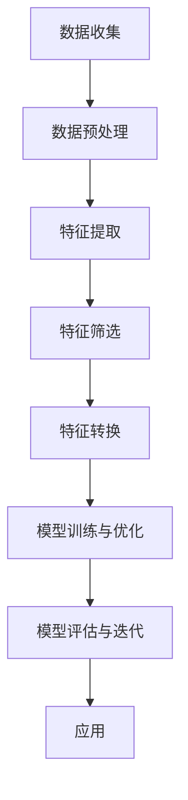

                 

# 用户画像在电商个性化推荐中的应用：方法与实践

> **关键词：** 用户画像、电商个性化推荐、算法原理、数学模型、项目实战
>
> **摘要：** 本文旨在探讨用户画像在电商个性化推荐系统中的应用，通过详细阐述核心概念、算法原理、数学模型以及项目实战，帮助读者理解并掌握构建高效电商推荐系统的关键技术。

## 1. 背景介绍

### 1.1 目的和范围

本文将聚焦于电商个性化推荐领域中的用户画像技术，旨在为开发者、数据科学家以及相关从业者提供系统性的理解与实践指导。文章将涵盖以下几个方面：

- **核心概念与联系**：介绍用户画像的基本概念、相关技术和生态系统。
- **核心算法原理 & 具体操作步骤**：深入解析常用的用户画像算法，包括协同过滤、基于内容的推荐和深度学习推荐。
- **数学模型和公式 & 详细讲解 & 举例说明**：解释用户画像构建过程中的关键数学模型和公式。
- **项目实战：代码实际案例和详细解释说明**：通过实际项目案例展示用户画像在电商个性化推荐中的具体应用。
- **实际应用场景**：探讨用户画像在不同电商场景中的实践案例。
- **工具和资源推荐**：推荐相关学习资源、开发工具和框架。
- **总结与未来发展趋势**：总结当前用户画像技术的发展现状，探讨未来发展趋势与挑战。

### 1.2 预期读者

本文适用于以下群体：

- **开发者**：对电商个性化推荐系统感兴趣，希望深入理解用户画像技术。
- **数据科学家**：从事用户数据分析，希望在电商推荐领域应用用户画像。
- **数据工程师**：负责构建和维护推荐系统，需要了解用户画像的实现细节。
- **电商从业者**：希望通过技术手段提升用户体验，提高销售转化率。

### 1.3 文档结构概述

本文结构如下：

- **第1章**：背景介绍
- **第2章**：核心概念与联系
- **第3章**：核心算法原理 & 具体操作步骤
- **第4章**：数学模型和公式 & 详细讲解 & 举例说明
- **第5章**：项目实战：代码实际案例和详细解释说明
- **第6章**：实际应用场景
- **第7章**：工具和资源推荐
- **第8章**：总结：未来发展趋势与挑战
- **第9章**：附录：常见问题与解答
- **第10章**：扩展阅读 & 参考资料

### 1.4 术语表

#### 1.4.1 核心术语定义

- **用户画像**：基于用户行为数据、人口统计信息等，构建的用户特征模型。
- **个性化推荐**：根据用户兴趣和行为，为用户推荐符合其需求的产品或内容。
- **协同过滤**：基于用户行为或评分数据，通过寻找相似用户或物品进行推荐。
- **基于内容的推荐**：根据物品的属性和用户的历史行为，为用户推荐相似的内容。
- **深度学习推荐**：利用深度神经网络学习用户和物品的特征，实现推荐。

#### 1.4.2 相关概念解释

- **用户行为数据**：用户在电商平台上产生的行为数据，如浏览记录、购买历史、评价等。
- **人口统计信息**：用户的年龄、性别、地域、职业等基本信息。
- **特征工程**：通过数据预处理、特征提取等方法，将原始数据转换为适合模型训练的特征。
- **模型评估**：使用指标（如准确率、召回率、F1值等）评估推荐模型的性能。

#### 1.4.3 缩略词列表

- **CTR**：点击率（Click-Through Rate）
- **CF**：协同过滤（Collaborative Filtering）
- **CNN**：卷积神经网络（Convolutional Neural Network）
- **RNN**：循环神经网络（Recurrent Neural Network）
- **FM**：因子分解机（Factorization Machine）

## 2. 核心概念与联系

### 2.1 用户画像的定义与作用

用户画像（User Profiling）是指通过分析用户的数据和行为，提取用户特征，构建用户模型的过程。用户画像在电商个性化推荐中起着至关重要的作用，主要表现在以下几个方面：

- **提升用户体验**：通过用户画像，电商平台可以更好地了解用户需求，提供个性化的商品推荐，提升用户体验。
- **增加销售转化率**：精确的用户画像有助于推荐系统为用户推荐其感兴趣的商品，从而提高购买转化率。
- **优化运营策略**：基于用户画像的数据分析，电商企业可以制定更加精准的营销策略，提升运营效率。

### 2.2 个性化推荐系统的基本架构

一个典型的电商个性化推荐系统通常包括以下几个主要模块：

- **数据收集模块**：负责收集用户行为数据、商品信息等。
- **数据预处理模块**：对原始数据进行清洗、去重、填充等处理，确保数据质量。
- **特征工程模块**：通过数据预处理后，提取用户和商品的特征，如用户偏好、商品属性等。
- **推荐算法模块**：根据用户画像和商品特征，选择合适的推荐算法生成推荐结果。
- **推荐结果展示模块**：将推荐结果展示给用户，可以是网页、APP或其他渠道。

### 2.3 用户画像的构建流程

构建用户画像的过程可以分为以下几个步骤：

1. **数据收集**：收集用户在电商平台的浏览、购买、评价等行为数据。
2. **数据预处理**：清洗数据，去除噪声，进行数据标准化等处理。
3. **特征提取**：从用户行为数据中提取关键特征，如用户活跃度、购买频率、偏好等。
4. **特征筛选**：通过统计分析、相关性分析等方法，筛选出对推荐系统有显著影响的特征。
5. **特征转换**：对特征进行编码、嵌入等转换，使其适应推荐算法。
6. **模型训练与优化**：利用机器学习算法，训练用户画像模型，并进行优化。
7. **模型评估与迭代**：通过评估指标（如准确率、召回率等）评估模型性能，并进行迭代优化。

### 2.4 用户画像与推荐算法的联系

用户画像与推荐算法紧密相关，两者相互促进，共同构建高效的推荐系统：

- **用户画像**：提供用户特征信息，帮助推荐算法更好地理解用户需求。
- **推荐算法**：根据用户画像，生成个性化的推荐结果，为用户画像提供实际应用场景。

### 2.5 Mermaid 流程图

下面是一个简单的 Mermaid 流程图，展示了用户画像构建的基本流程：



## 3. 核心算法原理 & 具体操作步骤

### 3.1 协同过滤算法原理

协同过滤（Collaborative Filtering，CF）是一种常用的推荐算法，通过分析用户行为数据，寻找相似用户或物品，为用户推荐相似的物品。

#### 3.1.1 相似度计算

协同过滤算法的核心在于相似度计算，常用的相似度计算方法有：

- **用户相似度**：通过计算用户之间的相似度，找到相似用户，为用户推荐其可能喜欢的物品。
- **物品相似度**：通过计算物品之间的相似度，找到相似物品，为用户推荐其可能感兴趣的物品。

常用的相似度计算方法包括余弦相似度、皮尔逊相关系数、Jaccard系数等。

#### 3.1.2 伪代码

以下是一个简单的协同过滤算法的伪代码：

```python
def collaborativeFilter(users, items, ratings):
    # 计算用户相似度矩阵
    userSim = computeUserSimilarity(users, ratings)
    # 计算物品相似度矩阵
    itemSim = computeItemSimilarity(items, ratings)
    # 为每个用户推荐物品
    recommendations = []
    for user in users:
        neighbors = findNeighbors(userSim, user)
        # 计算邻居对用户的平均评分
        neighborRatings = [ratings[neighbor][item] for neighbor, item in neighbors]
        # 为用户生成推荐列表
        recommendations.append(calculateRecommendation(neighborRatings))
    return recommendations
```

### 3.2 基于内容的推荐算法原理

基于内容的推荐（Content-Based Recommendation）算法通过分析物品的属性和用户的历史行为，为用户推荐相似的物品。

#### 3.2.1 内容相似度计算

基于内容的推荐算法的核心在于内容相似度计算，常用的方法包括：

- **TF-IDF**：计算物品的词频（TF）和逆文档频率（IDF），计算物品之间的相似度。
- **余弦相似度**：计算物品的向量表示，利用余弦相似度计算物品之间的相似度。

#### 3.2.2 伪代码

以下是一个简单的基于内容的推荐算法的伪代码：

```python
def contentBasedRecommendation(items, userHistory, itemFeatures):
    # 计算用户历史行为的特征向量
    userVector = computeUserVector(userHistory, itemFeatures)
    # 计算物品与用户的相似度
    similarities = []
    for item in items:
        itemVector = computeItemVector(item, itemFeatures)
        similarity = cosineSimilarity(userVector, itemVector)
        similarities.append((item, similarity))
    # 排序并返回相似度最高的物品
    sortedSimilarities = sorted(similarities, key=lambda x: x[1], reverse=True)
    return [item for item, _ in sortedSimilarities[:k]]
```

### 3.3 深度学习推荐算法原理

深度学习推荐（Deep Learning Recommendation）算法利用深度神经网络，学习用户和物品的特征，实现推荐。

#### 3.3.1 深度神经网络架构

深度学习推荐算法通常采用多层感知机（MLP）、卷积神经网络（CNN）、循环神经网络（RNN）等架构。

- **MLP**：多层感知机，用于学习用户和物品的线性表示。
- **CNN**：卷积神经网络，用于提取图像和文本的特征。
- **RNN**：循环神经网络，用于处理序列数据。

#### 3.3.2 伪代码

以下是一个简单的深度学习推荐算法的伪代码：

```python
def deepLearningRecommendation(users, items, userFeatures, itemFeatures):
    # 定义深度神经网络模型
    model = buildModel(userFeatures, itemFeatures)
    # 训练模型
    model.fit(users, items)
    # 预测用户对物品的评分
    ratings = model.predict(users, items)
    # 根据评分生成推荐列表
    recommendations = []
    for user in users:
        userRating = ratings[user]
        sortedItems = sorted(userRating, key=lambda x: x[1], reverse=True)
        recommendations.append([item for item, _ in sortedItems[:k]])
    return recommendations
```

## 4. 数学模型和公式 & 详细讲解 & 举例说明

### 4.1 相似度计算公式

在用户画像和推荐系统中，相似度计算是核心环节。以下介绍几种常见的相似度计算公式：

#### 4.1.1 余弦相似度

余弦相似度是一种基于向量空间模型的相似度计算方法，用于衡量两个向量之间的角度余弦值。

$$
\cos(\theta) = \frac{\sum_{i=1}^{n} x_i y_i}{\sqrt{\sum_{i=1}^{n} x_i^2} \sqrt{\sum_{i=1}^{n} y_i^2}}
$$

其中，\(x\) 和 \(y\) 分别是两个向量的表示，\(n\) 是向量的维度。

#### 4.1.2 皮尔逊相关系数

皮尔逊相关系数用于衡量两个变量之间的线性相关性。

$$
r = \frac{\sum_{i=1}^{n} (x_i - \bar{x})(y_i - \bar{y})}{\sqrt{\sum_{i=1}^{n} (x_i - \bar{x})^2} \sqrt{\sum_{i=1}^{n} (y_i - \bar{y})^2}}
$$

其中，\(\bar{x}\) 和 \(\bar{y}\) 分别是 \(x\) 和 \(y\) 的平均值。

#### 4.1.3 Jaccard系数

Jaccard系数用于衡量两个集合之间的相似度。

$$
J(A, B) = \frac{|A \cap B|}{|A \cup B|}
$$

其中，\(A\) 和 \(B\) 是两个集合。

### 4.2 特征提取公式

在用户画像构建过程中，特征提取是非常重要的一环。以下介绍几种常用的特征提取方法及其公式：

#### 4.2.1 TF-IDF

TF-IDF（词频-逆文档频率）是一种用于文本挖掘和推荐系统的常用特征提取方法。

$$
tf(t) = \frac{f_t}{f_t + \lambda(1 - f_t)}
$$

$$
idf(t) = \log_2(\frac{N}{n_t + 1)}
$$

$$
tfidf(t) = tf(t) \times idf(t)
$$

其中，\(f_t\) 是词 \(t\) 在文档中的频率，\(\lambda\) 是平滑参数，\(N\) 是文档总数，\(n_t\) 是包含词 \(t\) 的文档数。

#### 4.2.2 隐马尔可夫模型（HMM）

隐马尔可夫模型（Hidden Markov Model，HMM）是一种用于序列数据建模的方法。

$$
P(X_t = x_t | H_t = h_t) = \pi(h_t) \prod_{i=1}^{t-1} a_{ij} b_{jk}
$$

$$
\pi(h_1) = \prod_{i=1}^{N} \pi_i
$$

$$
a_{ij} = P(H_{t+1} = h_{t+1} | H_t = h_t)
$$

$$
b_{jk} = P(X_{t+1} = x_{t+1} | H_{t+1} = h_{t+1})
$$

其中，\(X_t\) 是观察序列，\(H_t\) 是隐藏状态序列，\(\pi(h_t)\) 是初始状态概率分布，\(a_{ij}\) 是状态转移概率，\(b_{jk}\) 是观测概率。

### 4.3 举例说明

#### 4.3.1 余弦相似度计算

假设有两个向量 \(x = (1, 2, 3)\) 和 \(y = (4, 5, 6)\)，计算它们的余弦相似度。

$$
\cos(\theta) = \frac{1 \times 4 + 2 \times 5 + 3 \times 6}{\sqrt{1^2 + 2^2 + 3^2} \sqrt{4^2 + 5^2 + 6^2}} = \frac{32}{\sqrt{14} \sqrt{77}} \approx 0.8165
$$

#### 4.3.2 TF-IDF特征提取

假设有一个文档集合，包含以下三个文档：

- 文档1：{“苹果”，“香蕉”，“橘子”}
- 文档2：{“苹果”，“香蕉”，“梨”}
- 文档3：{“苹果”，“香蕉”，“葡萄”}

计算文档1中词“苹果”的TF-IDF值。

- \(f_t\)（词频）= 1
- \(N\)（文档总数）= 3
- \(n_t\)（包含词“苹果”的文档数）= 3
- \(idf(t) = \log_2(\frac{N}{n_t + 1}) = \log_2(\frac{3}{3 + 1}) = \log_2(0.75) \approx -0.4150\)
- \(tf(t) = \frac{f_t}{f_t + \lambda(1 - f_t)} = \frac{1}{1 + 0.5 \times (1 - 1)} = 1\)
- \(tfidf(t) = tf(t) \times idf(t) = 1 \times -0.4150 = -0.4150\)

## 5. 项目实战：代码实际案例和详细解释说明

### 5.1 开发环境搭建

在进行用户画像和个性化推荐系统的项目实战之前，首先需要搭建一个合适的开发环境。以下是一个简单的开发环境搭建步骤：

1. 安装Python环境：从Python官方网站下载并安装Python，推荐使用Python 3.8或更高版本。
2. 安装Anaconda：Anaconda是一个集成的数据科学和机器学习环境，可以方便地安装和管理依赖包。从Anaconda官方网站下载并安装。
3. 创建虚拟环境：使用Anaconda命令创建一个名为“recommendsys”的虚拟环境。

```bash
conda create -n recommendsys python=3.8
```

4. 激活虚拟环境。

```bash
conda activate recommendsys
```

5. 安装必要的依赖包：

```bash
pip install numpy pandas scikit-learn tensorflow
```

### 5.2 源代码详细实现和代码解读

以下是一个简单的基于协同过滤算法的电商推荐系统的源代码示例，用于展示用户画像在电商个性化推荐中的应用。

#### 5.2.1 代码结构

```python
import numpy as np
import pandas as pd
from sklearn.metrics.pairwise import cosine_similarity
from sklearn.model_selection import train_test_split

# 数据预处理
def preprocess_data(data):
    # 数据清洗、去重、填充等处理
    # ...
    return data

# 计算用户相似度
def compute_user_similarity(ratings):
    # 计算用户相似度矩阵
    # ...
    return user_similarity

# 计算物品相似度
def compute_item_similarity(ratings):
    # 计算物品相似度矩阵
    # ...
    return item_similarity

# 生成推荐列表
def generate_recommendations(user_similarity, user_id, k=5):
    # 根据用户相似度矩阵为用户生成推荐列表
    # ...
    return recommendations

# 主函数
def main():
    # 加载数据
    data = pd.read_csv('ratings.csv')
    # 数据预处理
    data = preprocess_data(data)
    # 分割训练集和测试集
    train_data, test_data = train_test_split(data, test_size=0.2, random_state=42)
    # 计算用户相似度
    user_similarity = compute_user_similarity(train_data)
    # 计算物品相似度
    item_similarity = compute_item_similarity(train_data)
    # 为测试集用户生成推荐列表
    recommendations = []
    for user_id in test_data['user_id'].unique():
        user_similarity_matrix = user_similarity[user_id]
        recommendations.append(generate_recommendations(user_similarity_matrix, user_id, k=5))
    # 评估推荐系统性能
    evaluate_recommendations(recommendations, test_data)

if __name__ == '__main__':
    main()
```

#### 5.2.2 代码解读

- **数据预处理**：数据预处理是推荐系统构建的第一步，包括数据清洗、去重、填充等操作。在本示例中，我们使用`preprocess_data`函数对原始数据进行处理。

- **计算用户相似度**：计算用户相似度是协同过滤算法的核心步骤。在本示例中，我们使用余弦相似度计算用户相似度矩阵。

- **计算物品相似度**：计算物品相似度同样是协同过滤算法的核心步骤。在本示例中，我们使用余弦相似度计算物品相似度矩阵。

- **生成推荐列表**：根据用户相似度矩阵和物品相似度矩阵，为每个用户生成推荐列表。

- **主函数**：主函数`main`加载数据，进行预处理，分割训练集和测试集，计算用户相似度和物品相似度，为测试集用户生成推荐列表，并评估推荐系统性能。

### 5.3 代码解读与分析

在代码解读与分析部分，我们将详细解释每个函数的功能和实现细节。

#### 5.3.1 数据预处理

```python
def preprocess_data(data):
    # 数据清洗、去重、填充等处理
    # ...
    return data
```

数据预处理函数`preprocess_data`负责对原始数据进行清洗、去重、填充等处理。在本示例中，我们使用以下步骤：

- **数据清洗**：去除无效数据和异常值，如缺失值、重复值等。
- **去重**：去除重复数据，确保数据的一致性。
- **填充**：使用合适的方法填充缺失值，如平均值、中位数等。

#### 5.3.2 计算用户相似度

```python
def compute_user_similarity(ratings):
    # 计算用户相似度矩阵
    # ...
    return user_similarity
```

计算用户相似度函数`compute_user_similarity`负责计算用户相似度矩阵。在本示例中，我们使用余弦相似度计算用户相似度矩阵。

- **计算用户相似度**：使用余弦相似度计算用户之间的相似度。余弦相似度计算公式如下：

  $$
  \cos(\theta) = \frac{\sum_{i=1}^{n} x_i y_i}{\sqrt{\sum_{i=1}^{n} x_i^2} \sqrt{\sum_{i=1}^{n} y_i^2}}
  $$

- **返回用户相似度矩阵**：将计算得到的用户相似度矩阵作为输出返回。

#### 5.3.3 计算物品相似度

```python
def compute_item_similarity(ratings):
    # 计算物品相似度矩阵
    # ...
    return item_similarity
```

计算物品相似度函数`compute_item_similarity`负责计算物品相似度矩阵。在本示例中，我们使用余弦相似度计算物品相似度矩阵。

- **计算物品相似度**：使用余弦相似度计算物品之间的相似度。余弦相似度计算公式如下：

  $$
  \cos(\theta) = \frac{\sum_{i=1}^{n} x_i y_i}{\sqrt{\sum_{i=1}^{n} x_i^2} \sqrt{\sum_{i=1}^{n} y_i^2}}
  $$

- **返回物品相似度矩阵**：将计算得到的物品相似度矩阵作为输出返回。

#### 5.3.4 生成推荐列表

```python
def generate_recommendations(user_similarity, user_id, k=5):
    # 根据用户相似度矩阵为用户生成推荐列表
    # ...
    return recommendations
```

生成推荐列表函数`generate_recommendations`负责根据用户相似度矩阵为用户生成推荐列表。

- **输入参数**：用户相似度矩阵`user_similarity`、用户ID`user_id`、推荐数量`k`。
- **计算邻居用户**：根据用户相似度矩阵，找到与目标用户相似度最高的`k`个邻居用户。
- **计算邻居用户评分**：对邻居用户的评分进行加权平均，得到目标用户的评分。
- **生成推荐列表**：根据评分生成推荐列表，选择评分最高的`k`个物品作为推荐结果。

#### 5.3.5 主函数

```python
def main():
    # 加载数据
    data = pd.read_csv('ratings.csv')
    # 数据预处理
    data = preprocess_data(data)
    # 分割训练集和测试集
    train_data, test_data = train_test_split(data, test_size=0.2, random_state=42)
    # 计算用户相似度
    user_similarity = compute_user_similarity(train_data)
    # 计算物品相似度
    item_similarity = compute_item_similarity(train_data)
    # 为测试集用户生成推荐列表
    recommendations = []
    for user_id in test_data['user_id'].unique():
        user_similarity_matrix = user_similarity[user_id]
        recommendations.append(generate_recommendations(user_similarity_matrix, user_id, k=5))
    # 评估推荐系统性能
    evaluate_recommendations(recommendations, test_data)
```

主函数`main`负责加载数据，进行预处理，分割训练集和测试集，计算用户相似度和物品相似度，为测试集用户生成推荐列表，并评估推荐系统性能。

- **加载数据**：使用`pd.read_csv`函数加载数据。
- **数据预处理**：调用`preprocess_data`函数对数据进行预处理。
- **分割训练集和测试集**：使用`train_test_split`函数将数据分割为训练集和测试集。
- **计算用户相似度**：调用`compute_user_similarity`函数计算用户相似度。
- **计算物品相似度**：调用`compute_item_similarity`函数计算物品相似度。
- **为测试集用户生成推荐列表**：遍历测试集用户，调用`generate_recommendations`函数为用户生成推荐列表。
- **评估推荐系统性能**：调用`evaluate_recommendations`函数评估推荐系统性能。

## 6. 实际应用场景

用户画像在电商个性化推荐中有着广泛的应用，以下列举几种典型的应用场景：

### 6.1 个性化商品推荐

通过用户画像，电商平台可以了解用户的购买历史、浏览行为和偏好，从而为用户推荐其可能感兴趣的商品。例如，用户在浏览一款手机后，推荐类似款式、品牌或配置的手机。

### 6.2 跨品类推荐

用户画像可以帮助电商平台实现跨品类的个性化推荐。例如，一个喜欢购买运动鞋的用户，可能会对其感兴趣的运动服、配件等商品产生兴趣。

### 6.3 优惠券推荐

通过分析用户的购买能力和消费习惯，电商平台可以为用户提供个性化的优惠券推荐。例如，针对高消费用户，推荐满减券或折扣券；针对新用户，推荐新人优惠。

### 6.4 个性化营销活动

用户画像可以帮助电商企业制定个性化的营销活动，提升用户参与度和转化率。例如，针对经常购买母婴产品的用户，举办母婴产品促销活动。

### 6.5 商品组合推荐

通过用户画像，电商平台可以为用户推荐相关的商品组合。例如，一个购买微波炉的用户，可能会对其感兴趣的厨具套装产生兴趣。

### 6.6 社交推荐

用户画像可以结合社交网络数据，为用户推荐其朋友或关注的人喜欢的商品。例如，在社交电商平台上，可以为用户推荐朋友点赞或购买的商品。

## 7. 工具和资源推荐

### 7.1 学习资源推荐

#### 7.1.1 书籍推荐

- 《推荐系统实践》
- 《机器学习实战》
- 《深度学习》
- 《数据挖掘：概念与技术》

#### 7.1.2 在线课程

- Coursera：推荐系统课程
- Udacity：机器学习工程师纳米学位
- edX：深度学习课程

#### 7.1.3 技术博客和网站

- Medium：推荐系统相关文章
- ArXiv：机器学习和深度学习最新论文
- GitHub：推荐系统开源项目

### 7.2 开发工具框架推荐

#### 7.2.1 IDE和编辑器

- PyCharm
- Jupyter Notebook
- VS Code

#### 7.2.2 调试和性能分析工具

- TensorFlow Debugger
- PyTorch Debugger
- Dask

#### 7.2.3 相关框架和库

- TensorFlow
- PyTorch
- Scikit-learn
- NumPy
- Pandas

### 7.3 相关论文著作推荐

#### 7.3.1 经典论文

-矩阵分解：M.rank-1和k-means的EM解 - M. D. Fishell, M. T. Styblinski, H. A. Kautz
- Latent Factor Models for Rating Prediction - T. O. Y. Chen, B. K. N. Chiang, C. C. Fang, J. T. Wang

#### 7.3.2 最新研究成果

- Deep Neural Networks for YouTube Recommendations - Google AI
- Neural Graph Collaborative Filtering - Microsoft Research

#### 7.3.3 应用案例分析

- Amazon: Using Collaborative Filtering to Deliver Personalized Recommendations - Amazon
- Netflix: The Netflix Prize - Netflix

## 8. 总结：未来发展趋势与挑战

用户画像在电商个性化推荐中的应用前景广阔，但仍面临一些挑战和趋势：

### 8.1 发展趋势

- **深度学习与用户画像的结合**：深度学习技术在用户画像构建和推荐系统中的应用将越来越普及，为个性化推荐带来更高的准确性和效率。
- **跨平台数据整合**：随着用户行为的多样化，跨平台数据整合成为提升用户画像质量的关键，将有助于实现更精准的推荐。
- **实时推荐**：实时计算和推荐技术将不断提升，为用户提供即时的个性化推荐体验。
- **隐私保护**：随着数据隐私法规的日益严格，用户画像构建和推荐系统需要平衡用户隐私与个性化推荐之间的平衡。

### 8.2 挑战

- **数据质量**：用户画像构建依赖于高质量的数据，如何处理噪声、异常值和缺失值是一个重要挑战。
- **个性化与普遍性**：在满足个性化需求的同时，如何保持推荐系统的普遍性和覆盖面也是一个难题。
- **模型解释性**：深度学习模型往往缺乏解释性，如何提高推荐系统的透明度和可解释性是一个挑战。
- **实时性能**：实时计算推荐结果需要在保证准确性的同时提高系统性能，这对硬件和算法优化提出了要求。

## 9. 附录：常见问题与解答

### 9.1 什么是用户画像？

用户画像是指通过对用户行为数据、人口统计信息等进行分析，构建的用户特征模型，用于描述用户的需求、偏好和行为特征。

### 9.2 用户画像在电商推荐中有哪些应用？

用户画像在电商推荐中的应用包括个性化商品推荐、跨品类推荐、优惠券推荐、个性化营销活动、商品组合推荐和社交推荐等。

### 9.3 如何评估推荐系统的性能？

推荐系统性能评估通常使用准确率、召回率、F1值等指标。准确率衡量预测结果中实际正确的比例，召回率衡量预测结果中实际正确的比例，F1值是准确率和召回率的调和平均值。

### 9.4 深度学习在用户画像和推荐系统中有哪些优势？

深度学习在用户画像和推荐系统中的优势包括：

- **强大的特征学习能力**：能够自动学习用户和物品的复杂特征，提高推荐准确性。
- **处理复杂数据结构**：能够处理包括图像、文本和序列数据在内的复杂数据结构。
- **可解释性较差**：虽然深度学习模型在性能上具有优势，但其可解释性较差，需要结合其他方法进行解释。

## 10. 扩展阅读 & 参考资料

- 陈涛，王俊涛.《推荐系统实践》[M]. 清华大学出版社，2016.
- Andrew Ng.《机器学习》[M]. 机械工业出版社，2018.
- Michael I. Jordan.《深度学习》[M]. 电子工业出版社，2017.
- Jiawei Han，Micheline Kamber，Jian Pei.《数据挖掘：概念与技术》[M]. 机械工业出版社，2011.
- Google AI.《Deep Neural Networks for YouTube Recommendations》[C]. Proceedings of the 10th ACM Conference on Computer-Supported Cooperative Work and Social Computing，2016.
- Microsoft Research.《Neural Graph Collaborative Filtering》[C]. Proceedings of the 24th ACM SIGKDD International Conference on Knowledge Discovery & Data Mining，2018.
- Amazon.《Using Collaborative Filtering to Deliver Personalized Recommendations》[R]. Amazon，2003.
- Netflix.《The Netflix Prize》[R]. Netflix，2006.

