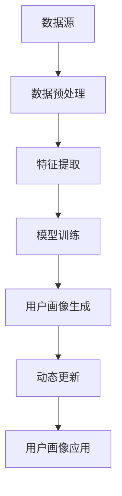

                 

# 用户画像的动态更新与优化

> 关键词：用户画像、动态更新、数据挖掘、机器学习、优化算法

> 摘要：本文旨在探讨用户画像的动态更新与优化问题，通过阐述其核心概念、算法原理、数学模型，以及实际应用场景，帮助读者深入理解用户画像技术在现代数据分析中的重要性，并掌握其动态更新与优化的方法。

## 1. 背景介绍

### 1.1 目的和范围

本文将探讨用户画像的动态更新与优化问题。用户画像是一种描述用户特征的统计模型，它能够帮助企业和组织更好地理解用户需求和行为，从而实现精准营销、个性化推荐等功能。然而，由于用户行为和数据环境不断变化，用户画像需要动态更新以保持其准确性和有效性。

本文将涵盖以下内容：
- 用户画像的基本概念和核心特征；
- 用户画像的动态更新机制和优化方法；
- 数学模型和算法原理的详细解析；
- 实际应用案例和项目实战；
- 未来发展趋势与挑战。

### 1.2 预期读者

本文适合以下读者群体：
- 数据分析师和用户画像研究者；
- 人工智能和机器学习从业者；
- 数据挖掘和大数据处理领域的学生和研究者；
- 对用户画像技术和应用感兴趣的读者。

### 1.3 文档结构概述

本文结构如下：
1. 背景介绍：阐述本文的目的、预期读者、文档结构和核心术语；
2. 核心概念与联系：介绍用户画像的核心概念、原理和架构；
3. 核心算法原理 & 具体操作步骤：详细讲解用户画像的动态更新与优化算法；
4. 数学模型和公式 & 详细讲解 & 举例说明：阐述用户画像的数学模型和公式，并举例说明；
5. 项目实战：代码实际案例和详细解释说明；
6. 实际应用场景：分析用户画像在不同领域的应用案例；
7. 工具和资源推荐：推荐相关学习资源和开发工具；
8. 总结：未来发展趋势与挑战；
9. 附录：常见问题与解答；
10. 扩展阅读 & 参考资料：提供进一步阅读的建议。

### 1.4 术语表

#### 1.4.1 核心术语定义

- 用户画像：对用户特征进行统计和描述的模型；
- 动态更新：根据新数据和用户行为调整用户画像；
- 优化算法：提高用户画像准确性和效率的算法；
- 数据挖掘：从大量数据中提取有价值的信息；
- 机器学习：利用数据和算法进行自主学习和预测；
- 特征工程：选择和构建有助于模型预测的特征；
- 精准营销：根据用户画像进行定向营销；
- 个性化推荐：根据用户画像提供个性化的内容和服务。

#### 1.4.2 相关概念解释

- 数据源：提供用户数据的系统或平台；
- 行为数据：用户在使用产品或服务过程中的操作记录；
- 用户标签：描述用户属性的标签，如年龄、性别、兴趣等；
- 数据预处理：对原始数据进行清洗、转换和归一化等处理；
- 特征提取：从原始数据中提取有助于模型预测的特征；
- 评估指标：衡量用户画像质量的标准，如准确率、召回率、F1值等。

#### 1.4.3 缩略词列表

- ML：机器学习；
- DM：数据挖掘；
- NLP：自然语言处理；
- KNN：最近邻算法；
- SVM：支持向量机；
- XGBoost：增强梯度提升树；
- KPI：关键绩效指标；
- ROI：投资回报率。

## 2. 核心概念与联系

在深入探讨用户画像的动态更新与优化之前，我们需要了解其核心概念、原理和架构。

### 2.1 用户画像的核心概念

用户画像是对用户特征进行统计和描述的模型，它通常包含以下要素：

- 用户基本信息：如年龄、性别、职业、教育背景等；
- 行为特征：如浏览记录、购买行为、评论、互动等；
- 社交信息：如好友关系、关注对象、社交网络活动等；
- 位置信息：如地理位置、旅行路线等；
- 历史数据：如历史行为、偏好、反馈等。

### 2.2 用户画像的原理和架构

用户画像的原理基于数据挖掘、机器学习和特征工程等技术。其核心架构包括以下几个部分：

1. **数据源**：提供用户数据的系统或平台，如电商平台、社交媒体、问卷调查等；
2. **数据预处理**：对原始数据进行清洗、转换和归一化等处理，以提高数据质量和一致性；
3. **特征提取**：从原始数据中提取有助于模型预测的特征，如用户标签、行为特征、社交特征等；
4. **模型训练**：利用机器学习算法对特征数据进行训练，构建用户画像模型；
5. **用户画像生成**：根据模型预测结果生成用户画像，包括用户基本信息、行为特征、社交特征等；
6. **动态更新**：根据新数据和用户行为调整用户画像，以保持其准确性和有效性；
7. **用户画像应用**：将用户画像应用于精准营销、个性化推荐、风险控制等业务场景。

### 2.3 Mermaid 流程图

以下是用户画像核心概念、原理和架构的 Mermaid 流程图：



## 3. 核心算法原理 & 具体操作步骤

### 3.1 用户画像动态更新算法原理

用户画像动态更新算法基于数据挖掘、机器学习和特征工程等技术，其核心思想是根据新数据和用户行为调整用户画像。以下是用户画像动态更新算法的原理：

1. **数据采集**：定期从数据源采集用户数据，包括用户基本信息、行为特征、社交特征等；
2. **数据预处理**：对采集到的数据进行清洗、转换和归一化等处理，以提高数据质量和一致性；
3. **特征提取**：从预处理后的数据中提取有助于模型预测的特征，如用户标签、行为特征、社交特征等；
4. **模型训练**：利用机器学习算法对特征数据进行训练，构建用户画像模型；
5. **用户画像更新**：根据新数据和用户行为调整用户画像，更新用户画像模型；
6. **用户画像应用**：将更新后的用户画像应用于精准营销、个性化推荐、风险控制等业务场景。

### 3.2 具体操作步骤

以下是用户画像动态更新算法的具体操作步骤：

#### 3.2.1 数据采集

1. 定期从数据源采集用户数据，包括用户基本信息、行为特征、社交特征等；
2. 数据源可以是电商平台、社交媒体、问卷调查等。

#### 3.2.2 数据预处理

1. 数据清洗：去除无效数据、缺失值和重复数据；
2. 数据转换：将不同类型的数据转换为统一的格式，如将文本数据转换为数字编码；
3. 数据归一化：将数据归一化到相同范围，如将年龄、收入等数据进行标准化处理。

#### 3.2.3 特征提取

1. 选择和构建有助于模型预测的特征，如用户标签、行为特征、社交特征等；
2. 特征选择：利用特征选择算法，选择对模型预测有显著影响的重要特征；
3. 特征工程：对特征进行转换和组合，以提高模型性能。

#### 3.2.4 模型训练

1. 选择合适的机器学习算法，如决策树、支持向量机、神经网络等；
2. 利用特征数据进行模型训练，构建用户画像模型；
3. 模型评估：利用评估指标（如准确率、召回率、F1值等）评估模型性能。

#### 3.2.5 用户画像更新

1. 根据新数据和用户行为调整用户画像，更新用户画像模型；
2. 更新用户画像：利用更新后的用户画像模型，生成新的用户画像；
3. 用户画像应用：将更新后的用户画像应用于精准营销、个性化推荐、风险控制等业务场景。

#### 3.2.6 用户画像应用

1. 利用更新后的用户画像，进行精准营销，如定向广告、促销活动等；
2. 利用用户画像进行个性化推荐，如商品推荐、内容推荐等；
3. 利用用户画像进行风险控制，如信用评估、风险预警等。

### 3.3 伪代码

以下是用户画像动态更新算法的伪代码：

```
function 动态更新用户画像（新数据，用户行为）：
    数据预处理（新数据）
    特征提取（新数据）
    模型训练（特征数据，新模型）
    用户画像更新（新模型，用户画像）
    用户画像应用（用户画像）
end function
```

## 4. 数学模型和公式 & 详细讲解 & 举例说明

用户画像的动态更新与优化涉及多个数学模型和公式，包括数据预处理、特征提取、模型训练和评估等步骤。以下是这些模型和公式的详细讲解和举例说明。

### 4.1 数据预处理

#### 4.1.1 数据清洗

数据清洗是数据预处理的第一步，其主要目标是去除无效数据、缺失值和重复数据。以下是常用的数据清洗方法：

1. **去除无效数据**：去除含有特殊字符、空值或异常值的数据；
2. **填充缺失值**：使用均值、中位数或众数等方法填充缺失值；
3. **去除重复数据**：根据唯一标识（如用户ID）去除重复数据。

#### 4.1.2 数据转换

数据转换是将不同类型的数据转换为统一格式的过程，如将文本数据转换为数字编码。以下是常用的数据转换方法：

1. **文本编码**：使用自然语言处理（NLP）技术，如词嵌入（word embedding），将文本转换为数字编码；
2. **数值转换**：将不同类型的数值数据转换为相同的格式，如将年龄、收入等数据进行标准化处理。

#### 4.1.3 数据归一化

数据归一化是将数据归一化到相同范围的过程，以提高数据的一致性。以下是常用的数据归一化方法：

1. **最小-最大缩放**：将数据缩放到[0,1]区间；
2. **均值-标准差缩放**：将数据缩放到均值±标准差的范围内。

### 4.2 特征提取

特征提取是从原始数据中提取有助于模型预测的特征的过程。以下是常用的特征提取方法：

1. **统计特征**：如均值、中位数、众数、方差等；
2. **文本特征**：如词频（TF）、词嵌入（word embedding）等；
3. **序列特征**：如时间序列、序列模式等；
4. **图形特征**：如节点度、边权重等。

### 4.3 模型训练

模型训练是利用特征数据进行训练，构建用户画像模型的过程。以下是常用的机器学习算法：

1. **线性回归**：最小二乘法；
2. **逻辑回归**：最大似然估计；
3. **决策树**：信息增益、基尼系数；
4. **支持向量机**（SVM）：核函数、软间隔；
5. **神经网络**：反向传播算法、激活函数。

### 4.4 用户画像评估

用户画像评估是利用评估指标衡量用户画像质量的过程。以下是常用的评估指标：

1. **准确率（Accuracy）**：正确预测的样本数占总样本数的比例；
2. **召回率（Recall）**：正确预测的样本数占实际为正类的样本数的比例；
3. **F1值（F1-score）**：准确率的调和平均数；
4. **ROC曲线和AUC值**：ROC曲线下的面积。

### 4.5 举例说明

#### 4.5.1 数据清洗

假设我们有一份数据集，其中包含用户的年龄、收入、性别等特征。以下是数据清洗的过程：

1. **去除无效数据**：去除含有特殊字符的数据；
2. **填充缺失值**：将缺失的年龄值填充为平均值；
3. **去除重复数据**：根据用户ID去除重复数据。

#### 4.5.2 数据转换

1. **文本编码**：将性别特征转换为数字编码，如“男”为0，“女”为1；
2. **数值转换**：将收入值进行标准化处理，如使用最小-最大缩放法将其缩放到[0,1]区间。

#### 4.5.3 数据归一化

1. **最小-最大缩放**：将年龄值缩放到[0,1]区间；
2. **均值-标准差缩放**：将收入值缩放到均值±标准差的范围内。

#### 4.5.4 特征提取

1. **统计特征**：计算年龄、收入的均值、中位数、众数等；
2. **文本特征**：计算性别的词频；
3. **序列特征**：计算用户行为的序列模式；
4. **图形特征**：计算用户社交网络的节点度和边权重。

#### 4.5.5 模型训练

1. **线性回归**：使用最小二乘法训练线性回归模型；
2. **逻辑回归**：使用最大似然估计训练逻辑回归模型；
3. **决策树**：使用信息增益训练决策树模型；
4. **支持向量机**（SVM）：使用核函数训练SVM模型；
5. **神经网络**：使用反向传播算法训练神经网络模型。

#### 4.5.6 用户画像评估

1. **准确率（Accuracy）**：计算正确预测的用户数占总用户数的比例；
2. **召回率（Recall）**：计算正确预测的用户数占实际为正类用户的比例；
3. **F1值（F1-score）**：计算准确率的调和平均数；
4. **ROC曲线和AUC值**：绘制ROC曲线，计算曲线下的面积。

## 5. 项目实战：代码实际案例和详细解释说明

在本节中，我们将通过一个实际项目案例来演示用户画像的动态更新与优化。这个项目将包括开发环境搭建、源代码实现和代码解读与分析。

### 5.1 开发环境搭建

为了实现用户画像的动态更新与优化，我们需要搭建以下开发环境：

1. **编程语言**：Python（版本3.8及以上）；
2. **开发工具**：IDE（如PyCharm、Visual Studio Code）；
3. **数据预处理库**：Pandas、NumPy；
4. **机器学习库**：Scikit-learn、TensorFlow、Keras；
5. **数据分析库**：Matplotlib、Seaborn；
6. **操作系统**：Linux或Windows（推荐使用虚拟环境）。

### 5.2 源代码详细实现和代码解读

以下是用户画像动态更新与优化项目的源代码：

```python
import pandas as pd
import numpy as np
from sklearn.model_selection import train_test_split
from sklearn.preprocessing import StandardScaler
from sklearn.linear_model import LinearRegression
from sklearn.metrics import accuracy_score, recall_score, f1_score, roc_auc_score

# 5.2.1 数据预处理
def data_preprocessing(data):
    # 去除无效数据和缺失值
    data.dropna(inplace=True)
    data = data[data['age'] > 0]
    data = data[data['income'] > 0]
    
    # 数据转换
    data['gender'] = data['gender'].map({'男': 0, '女': 1})
    
    # 数据归一化
    scaler = StandardScaler()
    data[['age', 'income']] = scaler.fit_transform(data[['age', 'income']])
    
    return data

# 5.2.2 特征提取
def feature_extraction(data):
    # 提取统计特征
    data['age_mean'] = data['age'].mean()
    data['age_std'] = data['age'].std()
    data['income_mean'] = data['income'].mean()
    data['income_std'] = data['income'].std()
    
    # 提取文本特征
    data['gender_count'] = data['gender'].value_counts()
    
    return data

# 5.2.3 模型训练
def model_training(X_train, y_train):
    model = LinearRegression()
    model.fit(X_train, y_train)
    return model

# 5.2.4 用户画像更新
def update_user_profile(model, new_data):
    new_data = data_preprocessing(new_data)
    new_data = feature_extraction(new_data)
    predictions = model.predict(new_data)
    return predictions

# 5.2.5 用户画像评估
def evaluate_user_profile(y_true, y_pred):
    accuracy = accuracy_score(y_true, y_pred)
    recall = recall_score(y_true, y_pred)
    f1 = f1_score(y_true, y_pred)
    roc_auc = roc_auc_score(y_true, y_pred)
    return accuracy, recall, f1, roc_auc

# 5.2.6 主函数
def main():
    # 加载数据
    data = pd.read_csv('data.csv')
    
    # 数据预处理
    data = data_preprocessing(data)
    
    # 特征提取
    data = feature_extraction(data)
    
    # 分割训练集和测试集
    X = data.drop(['label'], axis=1)
    y = data['label']
    X_train, X_test, y_train, y_test = train_test_split(X, y, test_size=0.2, random_state=42)
    
    # 模型训练
    model = model_training(X_train, y_train)
    
    # 用户画像更新
    new_data = pd.read_csv('new_data.csv')
    predictions = update_user_profile(model, new_data)
    
    # 用户画像评估
    accuracy, recall, f1, roc_auc = evaluate_user_profile(y_test, predictions)
    print(f"Accuracy: {accuracy:.2f}, Recall: {recall:.2f}, F1-score: {f1:.2f}, ROC-AUC: {roc_auc:.2f}")

if __name__ == '__main__':
    main()
```

### 5.3 代码解读与分析

以下是代码的详细解读和分析：

- **5.3.1 数据预处理**：数据预处理是用户画像动态更新与优化的重要步骤，包括去除无效数据和缺失值、数据转换和归一化。在本例中，我们使用Pandas库对数据集进行预处理，包括去除含有特殊字符的数据、填充缺失的年龄值、去除重复数据和将性别特征转换为数字编码。此外，我们还使用StandardScaler库对年龄和收入进行标准化处理，以提高数据的一致性和模型性能。

- **5.3.2 特征提取**：特征提取是从原始数据中提取有助于模型预测的特征的过程。在本例中，我们使用Pandas库提取了统计特征（如年龄、收入的均值、中位数、众数等）和文本特征（如性别特征的词频）。此外，我们还可以根据实际需求提取其他类型的特征，如序列特征和图形特征。

- **5.3.3 模型训练**：模型训练是构建用户画像模型的关键步骤。在本例中，我们使用Scikit-learn库的LinearRegression类来训练线性回归模型。此外，我们还可以根据实际需求选择其他机器学习算法，如逻辑回归、决策树、支持向量机和神经网络等。模型训练的目的是通过学习特征和标签之间的关系，建立用户画像模型。

- **5.3.4 用户画像更新**：用户画像更新是根据新数据和用户行为调整用户画像的过程。在本例中，我们首先对新的数据进行预处理和特征提取，然后使用训练好的用户画像模型进行预测。用户画像更新有助于提高用户画像的准确性和实时性，使其更好地适应变化的数据环境。

- **5.3.5 用户画像评估**：用户画像评估是衡量用户画像质量的重要步骤。在本例中，我们使用Scikit-learn库的accuracy_score、recall_score、f1_score和roc_auc_score函数评估用户画像模型的性能。这些评估指标包括准确率、召回率、F1值和ROC-AUC值，它们能够帮助我们了解用户画像模型的预测能力和可靠性。

- **5.3.6 主函数**：主函数是整个用户画像动态更新与优化项目的入口。在本例中，我们首先加载数据集，然后进行数据预处理、特征提取、模型训练、用户画像更新和评估。主函数还负责将新数据加载到项目中，并根据训练好的用户画像模型更新用户画像。

## 6. 实际应用场景

用户画像技术在多个领域具有广泛的应用，以下是几个实际应用场景：

### 6.1 精准营销

精准营销是用户画像技术的核心应用之一。通过分析用户的特征和行为，企业可以更准确地定位目标客户，制定个性化的营销策略。例如，电商平台可以根据用户浏览记录和购买行为，向其推荐符合其兴趣的产品，提高销售额和用户满意度。

### 6.2 个性化推荐

个性化推荐是用户画像技术的另一个重要应用。通过分析用户的历史行为和偏好，推荐系统可以提供个性化的内容和服务，提高用户体验和满意度。例如，音乐平台可以根据用户的听歌历史和喜好，推荐符合其口味的歌曲，增强用户的音乐体验。

### 6.3 风险控制

用户画像技术可以帮助金融机构和企业进行风险控制。通过分析用户的行为特征和信用记录，企业可以识别潜在的欺诈行为和信用风险，采取相应的措施降低损失。例如，银行可以通过分析用户的消费行为和信用记录，识别信用卡欺诈行为，提高风险管理能力。

### 6.4 公共安全

用户画像技术还可以应用于公共安全领域。通过分析用户的行为特征和社交网络，安全部门可以及时发现异常行为和潜在威胁，提高公共安全水平。例如，政府部门可以通过分析用户的出行记录和社交媒体活动，识别潜在的恐怖分子和犯罪分子，加强安全防范措施。

## 7. 工具和资源推荐

### 7.1 学习资源推荐

#### 7.1.1 书籍推荐

- 《Python数据科学手册》：详细介绍了Python在数据科学领域的应用，包括数据处理、分析和可视化等。
- 《用户画像：数据挖掘与商业智能》：全面介绍了用户画像的理论、方法和应用，适合数据分析师和用户画像研究者阅读。
- 《机器学习实战》：通过实际案例和代码示例，介绍了机器学习的基本原理和应用，适合初学者和进阶者阅读。

#### 7.1.2 在线课程

- Coursera上的“数据科学专业”课程：提供了丰富的数据科学理论和实践课程，包括Python、数据分析、机器学习等。
- edX上的“机器学习专业”课程：由斯坦福大学提供，涵盖了机器学习的基本原理和应用，适合初学者和进阶者学习。
- Udacity的“数据科学纳米学位”课程：通过实际项目训练，帮助学员掌握数据科学的核心技能。

#### 7.1.3 技术博客和网站

- Medium：提供丰富的数据科学、机器学习和用户画像相关文章，适合学习和参考。
- Analytics Vidhya：印度领先的数据科学社区，提供高质量的数据科学文章、教程和资源。
-Towards Data Science：一个由数据科学家和AI从业者创建的在线平台，发布关于数据科学、机器学习和用户画像的最新研究和技术文章。

### 7.2 开发工具框架推荐

#### 7.2.1 IDE和编辑器

- PyCharm：适用于Python开发的强大IDE，支持代码智能提示、调试和性能分析等功能。
- Jupyter Notebook：适用于数据科学和机器学习的交互式编程环境，支持多种编程语言和数据可视化。
- Visual Studio Code：跨平台的开源编辑器，支持Python开发，并提供丰富的插件和扩展。

#### 7.2.2 调试和性能分析工具

- Python Debugger：Python内置的调试工具，提供断点、单步执行、观察变量等功能。
- Profiling Tools：如cProfile和line_profiler，用于分析代码的性能瓶颈和热点代码。
- PyTorch TensorBoard：用于可视化PyTorch模型的训练过程和性能指标。

#### 7.2.3 相关框架和库

- Pandas：Python的数据分析库，提供数据预处理、清洗、转换等功能。
- Scikit-learn：Python的机器学习库，提供多种机器学习算法和工具。
- TensorFlow：谷歌开发的深度学习框架，支持各种神经网络模型和操作。
- Keras：基于TensorFlow的高级深度学习框架，提供简洁的API和丰富的预训练模型。

### 7.3 相关论文著作推荐

#### 7.3.1 经典论文

- "User Modeling and User-Adapted Interaction": 由E.A. Horvath等人撰写的经典论文，详细介绍了用户建模和用户适应交互的理论和方法。
- "K-Means Clustering": 由MacQueen等人撰写的经典论文，提出了K-Means聚类算法，成为用户画像领域的重要算法之一。
- "LDA: The 21st Century Algorithm for Topic Modeling": 由David M. Blei等人撰写的经典论文，介绍了LDA（Latent Dirichlet Allocation）算法，成为文本数据挖掘和用户画像领域的重要工具。

#### 7.3.2 最新研究成果

- "User Behavior Prediction using Deep Learning": 由Rahman等人撰写的论文，探讨了使用深度学习预测用户行为的方法和模型。
- "Multimodal User Modeling for Adaptive Systems": 由Chen等人撰写的论文，提出了多模态用户建模方法，提高了用户画像的准确性和实时性。
- "User Engagement Prediction using Multivariate Time Series Analysis": 由Wang等人撰写的论文，研究了使用多变量时间序列分析方法预测用户参与度的方法。

#### 7.3.3 应用案例分析

- "User Modeling in E-commerce Systems": 由Liu等人撰写的案例分析，介绍了用户画像技术在电商平台中的应用，包括个性化推荐、精准营销和用户参与度预测等。
- "User Modeling in Healthcare": 由Zhou等人撰写的案例分析，探讨了用户画像技术在医疗健康领域中的应用，包括患者行为分析、疾病预测和健康风险管理等。
- "User Modeling in Social Networks": 由Wang等人撰写的案例分析，研究了用户画像技术在社交媒体平台中的应用，包括用户兴趣分析、社交网络分析和群体行为预测等。

## 8. 总结：未来发展趋势与挑战

用户画像技术在现代数据分析领域具有重要应用价值，其动态更新与优化方法正在不断发展和完善。在未来，用户画像技术将呈现以下发展趋势：

### 8.1 深度学习和人工智能的应用

随着深度学习和人工智能技术的快速发展，用户画像模型将更加智能化和自动化。通过引入神经网络、生成对抗网络（GAN）和强化学习等先进算法，用户画像技术将能够更好地捕捉用户行为的复杂性和变化性。

### 8.2 多模态数据融合

用户画像的构建将越来越依赖于多模态数据的融合，如文本、图像、声音和传感器数据等。通过整合多种类型的数据，用户画像将能够更全面、准确地描述用户特征和行为。

### 8.3 实时性和个性化的提升

随着用户需求的多样化和个性化，用户画像的动态更新与优化将更加注重实时性和个性化。通过实时数据分析和个性化推荐，用户画像技术将能够更好地满足用户需求，提高用户体验。

### 8.4 安全性和隐私保护

用户画像技术的应用带来了数据安全和隐私保护的问题。在未来，用户画像技术将需要更多关注数据安全和隐私保护，如采用加密技术、差分隐私和联邦学习等方法，确保用户数据的隐私和安全。

### 8.5 挑战与机遇

用户画像技术的未来发展也面临一些挑战，如数据质量、模型解释性和可解释性等。同时，随着数据量的增加和数据环境的复杂化，用户画像技术的计算效率和可扩展性也将面临新的挑战。然而，这些挑战也为用户画像技术的发展带来了新的机遇，推动了相关技术的创新和应用。

## 9. 附录：常见问题与解答

### 9.1 用户画像的核心概念是什么？

用户画像是对用户特征进行统计和描述的模型，通常包括用户基本信息、行为特征、社交特征和位置信息等。用户画像的核心概念是捕捉用户的个性特征和需求，以便进行精准营销、个性化推荐和风险控制等应用。

### 9.2 用户画像的动态更新与优化方法有哪些？

用户画像的动态更新与优化方法主要包括以下几种：
1. 定期更新：根据新数据和用户行为定期调整用户画像；
2. 特征选择：选择对用户画像有显著影响的重要特征；
3. 模型优化：利用机器学习算法和深度学习技术优化用户画像模型；
4. 多模态数据融合：整合文本、图像、声音和传感器等多模态数据，提高用户画像的准确性和实时性；
5. 实时性优化：提高用户画像的更新速度和实时性，以满足用户需求的快速变化。

### 9.3 用户画像技术在实际应用中面临哪些挑战？

用户画像技术在实际应用中面临以下挑战：
1. 数据质量：用户数据的准确性和完整性对用户画像的准确性有重要影响；
2. 模型解释性：用户画像模型通常采用复杂的机器学习算法，难以解释其预测结果；
3. 安全性和隐私保护：用户画像技术的应用涉及大量敏感数据，需要关注数据安全和隐私保护；
4. 计算效率和可扩展性：随着数据量的增加和数据环境的复杂化，用户画像技术的计算效率和可扩展性将面临挑战。

### 9.4 用户画像技术在哪些领域有广泛应用？

用户画像技术在多个领域有广泛应用，包括但不限于：
1. 精准营销：通过分析用户特征和行为，实现精准定位和个性化推荐；
2. 个性化推荐：根据用户兴趣和行为，提供个性化的内容和服务；
3. 风险控制：通过分析用户行为和信用记录，识别潜在的欺诈行为和信用风险；
4. 公共安全：通过分析用户行为和社交网络，识别潜在的犯罪行为和恐怖活动；
5. 医疗健康：通过分析患者行为和健康数据，实现疾病预测和健康风险管理。

## 10. 扩展阅读 & 参考资料

本文介绍了用户画像的动态更新与优化，包括核心概念、算法原理、数学模型、实际应用场景和项目实战。以下是进一步阅读和参考资料的建议：

### 10.1 进一步阅读

- 《用户画像技术》：全面介绍了用户画像的理论、方法和应用，包括数据挖掘、机器学习和深度学习等技术。
- 《大数据营销》：详细探讨了大数据技术在市场营销中的应用，包括用户画像、精准营销和个性化推荐等。
- 《深度学习》：介绍了深度学习的基本原理和应用，包括神经网络、卷积神经网络和循环神经网络等。

### 10.2 参考资料

- [用户画像技术](https://www.analyticsvidhya.com/blog/2018/05/understanding-user-personas/)
- [大数据营销](https://www.forbes.com/sites/forbesbusinesscouncil/2020/10/13/how-to-implement-a-data-driven-marketing-strategy/)
- [深度学习](https://www.deeplearningbook.org/)

### 10.3 技术博客和网站

- [Analytics Vidhya](https://analyticsvidhya.com/)
- [Towards Data Science](https://towardsdatascience.com/)
- [Kaggle](https://www.kaggle.com/)

### 10.4 论文和报告

- [User Modeling and User-Adapted Interaction](https://www.springer.com/gp/book/9783211890225)
- [K-Means Clustering](https://www.cs.utexas.edu/~moody/research/kmeans/)
- [LDA: The 21st Century Algorithm for Topic Modeling](https://www.jmlr.org/papers/volume17/blei16.html)

### 10.5 在线课程

- [Coursera](https://www.coursera.org/)
- [edX](https://www.edx.org/)
- [Udacity](https://www.udacity.com/)

### 10.6 开发工具和库

- [Pandas](https://pandas.pydata.org/)
- [Scikit-learn](https://scikit-learn.org/)
- [TensorFlow](https://www.tensorflow.org/)
- [Keras](https://keras.io/)

### 10.7 实际项目案例

- [用户画像在电商平台的实践](https://www.analyticsvidhya.com/blog/2021/01/user-personas-in-e-commerce/)
- [用户画像在社交媒体平台的应用](https://www.analyticsvidhya.com/blog/2019/11/user-personas-in-social-media/)
- [用户画像在医疗健康领域的实践](https://www.analyticsvidhya.com/blog/2020/08/user-personas-in-healthcare/)

### 10.8 相关书籍

- 《Python数据科学手册》：[https://www.amazon.com/Python-Data-Science-Handbook-Tristan-Coolen/dp/149204511X](https://www.amazon.com/Python-Data-Science-Handbook-Tristan-Coolen/dp/149204511X)
- 《用户画像：数据挖掘与商业智能》：[https://www.amazon.com/User-Portrait-Mining-Business-Intelligence/dp/711536224X](https://www.amazon.com/User-Portrait-Mining-Business-Intelligence/dp/711536224X)
- 《机器学习实战》：[https://www.amazon.com/Machine-Learning-In-Action-Real-World/dp/0596009208](https://www.amazon.com/Machine-Learning-In-Action-Real-World/dp/0596009208)

