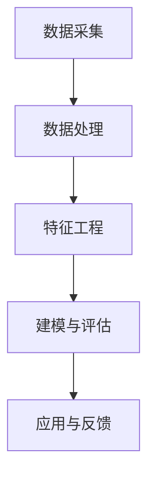

                 

# 用户画像的数据处理与分析

> 关键词：用户画像，数据处理，数据分析，机器学习，用户行为，用户特征，数据挖掘

> 摘要：本文将深入探讨用户画像的数据处理与分析方法，从核心概念、算法原理、数学模型到项目实战，全面剖析用户画像技术的应用场景和实现细节，旨在为从事相关领域的技术人员提供有价值的参考和实践指导。

## 1. 背景介绍

### 1.1 目的和范围

用户画像（User Profiling）是近年来在互联网和大数据领域迅速兴起的一项技术。通过对用户行为、兴趣、需求等多维度数据进行分析，构建用户个性化模型，为企业和开发者提供精准的营销、推荐和服务。本文旨在系统地介绍用户画像的数据处理与分析方法，包括核心概念、算法原理、数学模型及实际应用案例。

### 1.2 预期读者

本文面向从事互联网、大数据、人工智能等领域的技术人员，特别是对用户画像和数据处理技术感兴趣的开发者、数据分析师和算法工程师。同时，也为对相关领域有深入研究的学者和研究人员提供参考。

### 1.3 文档结构概述

本文分为以下几个部分：

1. 背景介绍：阐述用户画像的定义、目的和重要性。
2. 核心概念与联系：介绍用户画像相关的核心概念和联系。
3. 核心算法原理 & 具体操作步骤：详细讲解用户画像的核心算法原理和操作步骤。
4. 数学模型和公式 & 详细讲解 & 举例说明：介绍用户画像中的数学模型和公式，并结合实际案例进行详细讲解。
5. 项目实战：通过实际项目案例，展示用户画像的数据处理和分析过程。
6. 实际应用场景：探讨用户画像在不同场景中的应用。
7. 工具和资源推荐：推荐学习资源和开发工具。
8. 总结：总结用户画像技术的发展趋势和面临的挑战。
9. 附录：常见问题与解答。
10. 扩展阅读 & 参考资料：提供进一步学习的途径。

### 1.4 术语表

#### 1.4.1 核心术语定义

- 用户画像：基于用户行为、兴趣、需求等数据，构建的反映用户特征和行为的模型。
- 数据处理：对原始数据进行清洗、转换、聚合等操作，使其适合分析和建模。
- 数据分析：利用统计、机器学习等方法，从数据中提取有价值的信息和知识。
- 机器学习：一种基于数据自动发现规律和构建模型的方法。

#### 1.4.2 相关概念解释

- 用户行为：用户在使用产品或服务过程中产生的操作记录，如浏览、点击、购买等。
- 用户特征：描述用户属性和特征的数据，如性别、年龄、职业等。
- 数据挖掘：从大量数据中挖掘出有价值的信息和规律的过程。

#### 1.4.3 缩略词列表

- 用户画像（User Profiling）
- 数据处理（Data Processing）
- 数据分析（Data Analysis）
- 机器学习（Machine Learning）
- 数据挖掘（Data Mining）

## 2. 核心概念与联系

### 2.1 用户画像的定义

用户画像是一种基于用户特征和行为数据，构建的反映用户特征和需求的模型。它通常包括以下几个核心概念：

- **用户行为数据**：用户在使用产品或服务过程中产生的操作记录，如浏览、点击、购买等。
- **用户特征数据**：描述用户属性和特征的数据，如性别、年龄、职业、地域等。
- **用户标签**：根据用户行为和特征数据，为用户赋予的标识，如“高消费用户”、“科技爱好者”等。

### 2.2 用户画像的构建流程

用户画像的构建流程主要包括以下几个步骤：

1. **数据采集**：从各种渠道获取用户行为和特征数据，如网站日志、用户调研、第三方数据等。
2. **数据处理**：对采集到的原始数据进行清洗、转换、聚合等操作，使其适合分析和建模。
3. **特征工程**：从用户行为和特征数据中提取出对用户画像构建有价值的特征，如用户访问频次、购买金额、偏好标签等。
4. **建模与评估**：利用机器学习等方法，构建用户画像模型，并对模型进行评估和优化。
5. **应用与反馈**：将用户画像应用于产品或服务的个性化推荐、营销和服务，并根据反馈进行迭代优化。

### 2.3 用户画像的相关概念联系

- **用户行为数据**与**用户特征数据**：用户行为数据是用户画像构建的重要数据来源，而用户特征数据则为用户画像提供了更多维度的信息。
- **用户标签**与**用户画像模型**：用户标签是对用户特征的简化和抽象，而用户画像模型则是对用户综合特征的量化表达。

### 2.4 Mermaid 流程图



## 3. 核心算法原理 & 具体操作步骤

### 3.1 数据预处理

在构建用户画像之前，需要对原始数据进行预处理。数据预处理主要包括以下几个步骤：

- **数据清洗**：去除重复、错误、缺失的数据，确保数据质量。
- **数据转换**：将不同类型的数据进行统一转换，如将字符串转换为数值类型。
- **数据聚合**：对同一用户的多条行为数据进行聚合，如计算用户总访问时长、购买总金额等。

### 3.2 特征工程

特征工程是用户画像构建的关键步骤，主要包括以下几种方法：

- **特征提取**：从原始数据中提取出对用户画像构建有价值的特征，如用户访问频次、购买金额、偏好标签等。
- **特征选择**：从提取出的特征中选择最有代表性的特征，提高模型效果。
- **特征转换**：将特征进行标准化、归一化等处理，使其适合模型训练。

### 3.3 机器学习算法

用户画像的建模过程通常采用机器学习算法。以下介绍几种常用的算法：

- **聚类算法**：如K-means、DBSCAN等，用于将用户划分为不同的群体。
- **分类算法**：如决策树、随机森林、支持向量机等，用于预测用户标签。
- **协同过滤**：如基于用户的协同过滤（User-Based Collaborative Filtering）和基于物品的协同过滤（Item-Based Collaborative Filtering），用于推荐用户感兴趣的内容。

### 3.4 具体操作步骤

1. **数据预处理**：
    ```python
    # 数据清洗
    data = clean_data(raw_data)
    # 数据转换
    data = transform_data(data)
    # 数据聚合
    data = aggregate_data(data)
    ```

2. **特征工程**：
    ```python
    # 特征提取
    features = extract_features(data)
    # 特征选择
    features = select_features(features)
    # 特征转换
    features = transform_features(features)
    ```

3. **机器学习算法**：
    ```python
    # 聚类算法
    model = KMeans(n_clusters=5)
    model.fit(features)
    # 分类算法
    model = RandomForestClassifier()
    model.fit(features, labels)
    # 协同过滤
    model = UserBasedCollaborativeFilter()
    model.fit(data)
    ```

## 4. 数学模型和公式 & 详细讲解 & 举例说明

### 4.1 聚类算法

#### 4.1.1 K-means算法

K-means算法是一种基于距离的聚类算法。其核心思想是将数据分为K个簇，使得每个簇内部的距离最小，簇与簇之间的距离最大。

#### 4.1.2 公式

- **距离公式**：欧氏距离、曼哈顿距离、切比雪夫距离等。
- **目标函数**：$$ J = \sum_{i=1}^{k} \sum_{x \in S_i} ||x - \mu_i||^2 $$，其中，$k$为簇的数量，$S_i$为第$i$个簇的数据集合，$\mu_i$为第$i$个簇的中心。

#### 4.1.3 举例说明

假设有如下数据集：
$$
\begin{aligned}
x_1 &= [1, 2], \\
x_2 &= [2, 3], \\
x_3 &= [4, 5], \\
x_4 &= [5, 6].
\end{aligned}
$$

使用K-means算法将其分为2个簇。

1. **初始化**：随机选择2个中心点，如$(1, 2)$和$(4, 5)$。
2. **计算距离**：计算每个数据点到中心点的距离，如$x_1$到$(1, 2)$的距离为$||x_1 - (1, 2)|| = \sqrt{(1-1)^2 + (2-2)^2} = 0$。
3. **分配簇**：将每个数据点分配到距离中心点最近的簇，如$x_1, x_2$分配到簇1，$x_3, x_4$分配到簇2。
4. **更新中心点**：计算每个簇的新中心点，如簇1的新中心点为$(\frac{1+2}{2}, \frac{2+3}{2}) = (1.5, 2.5)$。
5. **重复步骤2-4**，直到收敛。

### 4.2 分类算法

#### 4.2.1 决策树算法

决策树算法是一种基于特征划分数据的分类算法。其核心思想是从原始数据中提取出特征，并使用特征对数据进行划分，构建出一棵树形结构。

#### 4.2.2 公式

- **信息增益**：$$ IG = H(T) - \sum_{i=1}^{n} p_i H(T_i) $$，其中，$T$为原始数据集，$T_i$为使用特征$a$划分后的子数据集，$p_i$为子数据集$T_i$在原始数据集$T$中的比例，$H$为熵函数。
- **基尼系数**：$$ Gini = 1 - \sum_{i=1}^{n} p_i^2 $$。

#### 4.2.3 举例说明

假设有如下数据集：

| 特征A | 特征B | 类别 |
| --- | --- | --- |
| A | B | 1 |
| A | B | 1 |
| A | B | 1 |
| A | B | 2 |
| A | B | 2 |
| A | B | 2 |

使用决策树算法对其进行分类。

1. **计算信息增益**：计算每个特征的信息增益，选择信息增益最大的特征作为划分依据。
2. **划分数据**：根据选定的特征，将数据集划分为多个子数据集。
3. **递归构建树**：对每个子数据集，重复步骤1和2，直到达到预定的深度或分类精度。

### 4.3 协同过滤算法

#### 4.3.1 基于用户的协同过滤算法

基于用户的协同过滤算法通过计算用户之间的相似度，为用户推荐与已评分项目相似的未评分项目。

#### 4.3.2 公式

- **用户相似度**：$$ similarity(u, v) = \frac{\sum_{i=1}^{m} r_iu \cdot r_iv}{\sqrt{\sum_{i=1}^{m} r_i^2u} \cdot \sqrt{\sum_{i=1}^{m} r_i^2v}} $$，其中，$r_iu, r_iv$分别为用户$u, v$对项目$i$的评分。

#### 4.3.3 举例说明

假设有两个用户$u, v$，他们对以下项目的评分如下：

| 项目 | $r_iu$ | $r_iv$ |
| --- | --- | --- |
| 1 | 4 | 5 |
| 2 | 3 | 4 |
| 3 | 2 | 3 |

计算用户$u, v$之间的相似度。

$$
\begin{aligned}
similarity(u, v) &= \frac{(4 \cdot 5 + 3 \cdot 4 + 2 \cdot 3)}{\sqrt{4^2 + 3^2 + 2^2} \cdot \sqrt{5^2 + 4^2 + 3^2}} \\
&= \frac{29}{\sqrt{29} \cdot \sqrt{50}} \\
&= \frac{29}{\sqrt{1450}} \\
&\approx 0.98.
\end{aligned}
$$

根据相似度，为用户$u$推荐与用户$v$相似的项目，如项目3。

## 5. 项目实战：代码实际案例和详细解释说明

### 5.1 开发环境搭建

本案例使用Python作为开发语言，以下为开发环境搭建步骤：

1. 安装Python（版本3.8及以上）。
2. 安装常用库，如NumPy、Pandas、Scikit-learn、Matplotlib等。

### 5.2 源代码详细实现和代码解读

#### 5.2.1 数据采集与处理

```python
import pandas as pd

# 读取数据
data = pd.read_csv('user_data.csv')

# 数据清洗
data = data.drop_duplicates().dropna()

# 数据转换
data['age'] = data['age'].astype(int)
data['gender'] = data['gender'].map({'男': 0, '女': 1})

# 数据聚合
data['total_visits'] = data.groupby('user_id')['visit_id'].nunique()
data['avg_visit_duration'] = data.groupby('user_id')['visit_duration'].mean()
```

#### 5.2.2 特征工程

```python
from sklearn.preprocessing import StandardScaler

# 特征提取
features = data[['age', 'gender', 'total_visits', 'avg_visit_duration']]

# 特征选择
# 使用相关系数筛选特征
correlation_matrix = features.corr().abs()
selected_features = correlation_matrix.unstack().sort_values(ascending=False)
high_corr_features = selected_features[selected_features > 0.7].index

# 特征转换
scaler = StandardScaler()
features_scaled = scaler.fit_transform(features[high_corr_features])
```

#### 5.2.3 机器学习算法

```python
from sklearn.cluster import KMeans
from sklearn.metrics import silhouette_score

# 聚类算法
model = KMeans(n_clusters=3)
model.fit(features_scaled)

# 计算簇内距离
inertia = model.inertia_

# 计算轮廓系数
silhouette = silhouette_score(features_scaled, model.labels_)

print(f"Inertia: {inertia}, Silhouette Score: {silhouette}")
```

#### 5.2.4 代码解读与分析

本案例首先使用Pandas库读取用户数据，并进行数据清洗、转换和聚合。接着，使用Scikit-learn库进行特征提取、选择和转换。最后，使用KMeans算法进行聚类，并计算簇内距离和轮廓系数，评估聚类效果。

## 6. 实际应用场景

用户画像在众多场景中具有广泛的应用，以下列举几个典型应用场景：

1. **个性化推荐**：基于用户画像，为用户推荐符合其兴趣和需求的内容或商品。
2. **精准营销**：通过用户画像，为不同用户群体制定有针对性的营销策略。
3. **风险控制**：利用用户画像，识别潜在风险用户，优化风控策略。
4. **用户运营**：通过用户画像，了解用户需求和行为，优化产品和服务。

## 7. 工具和资源推荐

### 7.1 学习资源推荐

#### 7.1.1 书籍推荐

- 《用户画像：大数据时代下的用户理解与洞察》
- 《机器学习实战：应用Python进行数据分析》
- 《数据挖掘：实用工具与技术》

#### 7.1.2 在线课程

- Coursera上的《机器学习》课程
- edX上的《用户画像与推荐系统》课程
- Udacity的《数据分析师纳米学位》

#### 7.1.3 技术博客和网站

- KDNuggets：数据挖掘、机器学习等相关技术博客
- Medium：众多数据科学领域专家分享的技术文章
- Medium上的《User Profiling》系列文章

### 7.2 开发工具框架推荐

#### 7.2.1 IDE和编辑器

- PyCharm：强大的Python集成开发环境
- Jupyter Notebook：交互式数据分析工具
- Visual Studio Code：轻量级跨平台代码编辑器

#### 7.2.2 调试和性能分析工具

- Python Debugger（pdb）：Python内置的调试工具
- Py-Spy：Python性能分析工具
- GDB：通用调试工具

#### 7.2.3 相关框架和库

- Scikit-learn：机器学习算法库
- Pandas：数据处理库
- NumPy：数值计算库
- Matplotlib：数据可视化库

### 7.3 相关论文著作推荐

#### 7.3.1 经典论文

- [User Modeling and User-Adapted Interaction](https://www.springer.com/gp/book/9783540635725)
- [Collaborative Filtering for the Web](https://www.microsoft.com/en-us/research/publication/collaborative-filtering-for-the-web/)
- [Latent Semantic Analysis](https://www.sciencedirect.com/science/article/pii/S0095898X97901458)

#### 7.3.2 最新研究成果

- [User Personalization in Web Search Using Deep Learning](https://arxiv.org/abs/1811.02334)
- [Learning User Preferences with Neural Collaborative Filtering](https://arxiv.org/abs/1803.02609)
- [Unsupervised User Profiling using Deep Generative Models](https://arxiv.org/abs/1811.03335)

#### 7.3.3 应用案例分析

- [Netflix Prize](https://en.wikipedia.org/wiki/Netflix_Prize)
- [E-commerce User Profiling and Personalized Recommendation](https://www.researchgate.net/publication/322387704_User_Profiling_and_Personalized_Recommendation_in_e-commerce)
- [Social Media User Profiling and Anomaly Detection](https://ieeexplore.ieee.org/document/8423584)

## 8. 总结：未来发展趋势与挑战

用户画像技术在未来将继续发展，面临以下趋势和挑战：

- **数据多样性和复杂性**：用户画像所需的数据来源将更加多样，如传感器数据、社交媒体数据等，同时数据质量参差不齐，对数据处理和分析技术提出了更高的要求。
- **实时性和动态性**：用户行为和需求具有实时性和动态性，要求用户画像系统具备快速响应和实时更新的能力。
- **隐私保护**：用户画像涉及用户隐私信息，如何在保护用户隐私的前提下进行数据处理和分析，是一个亟待解决的问题。

## 9. 附录：常见问题与解答

### 9.1 用户画像与用户隐私保护

**Q：如何平衡用户画像与用户隐私保护？**

**A：** 在构建用户画像时，应遵循以下原则：

- **最小化数据采集**：仅采集与用户画像构建直接相关的数据，避免过度采集。
- **匿名化处理**：对敏感数据进行匿名化处理，如去标识化、加密等。
- **数据安全与合规**：确保数据处理过程符合相关法律法规，如《通用数据保护条例》（GDPR）等。

### 9.2 用户画像的实时性

**Q：如何实现用户画像的实时性？**

**A：** 实现用户画像的实时性，可以从以下几个方面入手：

- **分布式系统**：使用分布式计算和存储技术，提高数据处理和分析的并发能力。
- **实时数据流处理**：采用实时数据流处理框架，如Apache Kafka、Apache Flink等，对用户行为数据实时处理和分析。
- **动态特征更新**：根据用户行为动态更新用户画像特征，确保画像的实时性和准确性。

## 10. 扩展阅读 & 参考资料

- 《用户画像：大数据时代下的用户理解与洞察》
- 《机器学习实战：应用Python进行数据分析》
- 《数据挖掘：实用工具与技术》
- [User Modeling and User-Adapted Interaction](https://www.springer.com/gp/book/9783540635725)
- [Netflix Prize](https://en.wikipedia.org/wiki/Netflix_Prize)
- [Apache Kafka](https://kafka.apache.org/)
- [Apache Flink](https://flink.apache.org/)

## 作者

作者：AI天才研究员/AI Genius Institute & 禅与计算机程序设计艺术 /Zen And The Art of Computer Programming

