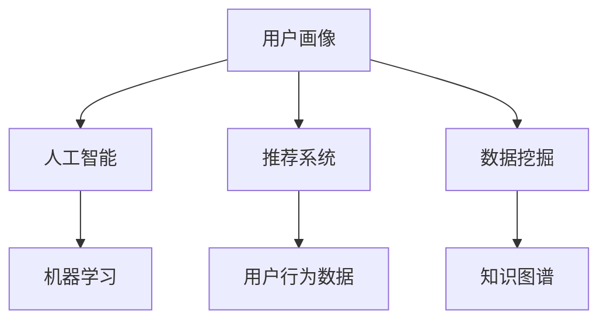

                 

# 用户画像：AI如何实现精准推荐

> 关键词：用户画像、人工智能、推荐系统、精准营销、数据挖掘、机器学习

> 摘要：本文将深入探讨用户画像在人工智能推荐系统中的应用，分析其核心概念、算法原理、数学模型以及实际操作步骤。通过具体案例分析，展示用户画像如何帮助实现精准推荐，从而为企业的市场营销提供有力支持。

## 1. 背景介绍

### 1.1 目的和范围

本文旨在介绍用户画像在人工智能推荐系统中的应用，探讨其核心概念、算法原理和数学模型，并展示实际操作步骤。通过本文的阅读，读者将能够了解用户画像的构建过程，掌握如何利用用户画像实现精准推荐，并了解其对企业市场营销的重要价值。

### 1.2 预期读者

本文面向对人工智能、推荐系统和数据挖掘有一定了解的读者。无论是从事市场营销、数据分析还是人工智能研发的人员，均可通过本文获得对用户画像及其应用的实际操作经验。

### 1.3 文档结构概述

本文分为以下几个部分：

1. 背景介绍：介绍本文的目的、范围、预期读者以及文档结构。
2. 核心概念与联系：介绍用户画像、人工智能、推荐系统和数据挖掘等核心概念，并给出相关的Mermaid流程图。
3. 核心算法原理与具体操作步骤：详细阐述用户画像的算法原理，并给出具体的操作步骤。
4. 数学模型和公式：介绍用户画像相关的数学模型和公式，并进行举例说明。
5. 项目实战：通过具体代码案例，展示用户画像在项目中的实际应用。
6. 实际应用场景：分析用户画像在不同场景下的应用。
7. 工具和资源推荐：推荐相关学习资源、开发工具和论文著作。
8. 总结：总结本文的主要内容，并探讨未来发展趋势与挑战。
9. 附录：常见问题与解答。
10. 扩展阅读与参考资料：提供进一步阅读的资源和参考文献。

### 1.4 术语表

#### 1.4.1 核心术语定义

- 用户画像：对用户进行综合分析后得到的抽象描述，包括用户的基本信息、兴趣偏好、行为特征等。
- 推荐系统：根据用户的历史行为和偏好，为用户推荐其可能感兴趣的内容或商品。
- 数据挖掘：从大量数据中挖掘出有价值的信息和知识的过程。
- 机器学习：利用计算机算法和统计学方法，从数据中自动学习和发现规律。

#### 1.4.2 相关概念解释

- 用户行为数据：用户在网站或应用上的浏览、搜索、购买等行为数据。
- 嵌入式分析：将用户行为数据转化为低维向量表示，便于机器学习算法处理。
- 深度学习：一种利用多层神经网络进行特征学习和模式识别的方法。

#### 1.4.3 缩略词列表

- AI：人工智能
- ML：机器学习
- DL：深度学习
- NLP：自然语言处理
- KG：知识图谱
- UX：用户体验

## 2. 核心概念与联系

在本文中，我们将探讨以下几个核心概念：用户画像、人工智能、推荐系统和数据挖掘。以下是一个简单的Mermaid流程图，展示了这些概念之间的联系。



### 2.1 用户画像

用户画像是对用户进行全面分析后得到的抽象描述，包括用户的基本信息、兴趣偏好、行为特征等。用户画像的构建过程通常包括以下几个步骤：

1. 数据采集：收集用户在网站或应用上的行为数据，如浏览、搜索、购买等。
2. 数据预处理：清洗和整理原始数据，去除噪声和异常值。
3. 特征提取：从用户行为数据中提取出有价值的信息，如用户兴趣标签、行为模式等。
4. 特征融合：将多个特征进行整合，形成完整的用户画像。

### 2.2 人工智能

人工智能（AI）是一种模拟人类智能的技术，包括机器学习、深度学习、自然语言处理等多个领域。在用户画像的应用中，人工智能主要用于以下几个方面：

1. 用户行为预测：通过机器学习算法，预测用户的未来行为和偏好。
2. 用户细分：将用户划分为不同的群体，以便进行针对性的推荐和营销。
3. 情感分析：分析用户评论、反馈等文本数据，提取用户的情感和态度。

### 2.3 推荐系统

推荐系统是一种根据用户的历史行为和偏好，为用户推荐其可能感兴趣的内容或商品的技术。推荐系统通常包括以下几个模块：

1. 用户画像构建：根据用户行为数据，构建用户的兴趣偏好和特征。
2. 推荐算法：根据用户画像和商品信息，为用户生成个性化的推荐结果。
3. 推荐结果评估：评估推荐结果的准确性和效果，以便不断优化推荐算法。

### 2.4 数据挖掘

数据挖掘是一种从大量数据中挖掘出有价值信息和知识的过程。在用户画像的应用中，数据挖掘主要用于以下几个方面：

1. 用户行为分析：分析用户的行为模式，发现用户的兴趣偏好。
2. 关联规则挖掘：从用户行为数据中发现潜在关联关系，为推荐系统提供支持。
3. 知识图谱构建：将用户行为数据转化为知识图谱，以便进行更高级的语义分析。

## 3. 核心算法原理与具体操作步骤

### 3.1 用户画像构建算法

用户画像的构建过程可以分为以下几个步骤：

1. 数据采集与预处理

```python
# 采集用户行为数据
user_data = collect_user_data()

# 预处理数据
cleaned_data = preprocess_data(user_data)
```

2. 特征提取

```python
# 提取用户兴趣标签
interest_tags = extract_interest_tags(cleaned_data)

# 提取用户行为模式
behavior_patterns = extract_behavior_patterns(cleaned_data)
```

3. 特征融合

```python
# 融合特征
user_features = merge_features(interest_tags, behavior_patterns)
```

### 3.2 用户行为预测算法

用户行为预测可以采用机器学习算法，如决策树、随机森林、支持向量机等。以下是一个基于决策树的用户行为预测算法：

```python
# 决策树用户行为预测
from sklearn.tree import DecisionTreeClassifier

# 训练模型
model = DecisionTreeClassifier()
model.fit(X_train, y_train)

# 预测用户行为
predictions = model.predict(X_test)
```

### 3.3 用户细分算法

用户细分可以采用聚类算法，如K-Means、DBSCAN等。以下是一个基于K-Means的用户细分算法：

```python
# K-Means用户细分
from sklearn.cluster import KMeans

# 训练模型
model = KMeans(n_clusters=5)
model.fit(user_features)

# 分配用户到不同的细分群体
user_groups = model.predict(user_features)
```

## 4. 数学模型和公式

在用户画像构建过程中，常用的数学模型包括向量空间模型、协同过滤模型和知识图谱模型等。以下分别介绍这些模型的基本概念和公式。

### 4.1 向量空间模型

向量空间模型是一种基于向量的文本表示方法，将文本数据转化为向量的形式。其基本公式如下：

$$
\textbf{x} = \text{TF}\times \text{IDF}
$$

其中，TF表示词频，IDF表示逆文档频率。通过向量空间模型，可以将用户行为数据转化为向量表示，便于后续的机器学习算法处理。

### 4.2 协同过滤模型

协同过滤模型是一种基于用户行为数据的推荐算法，通过分析用户之间的行为相似性，为用户推荐其可能感兴趣的内容。其基本公式如下：

$$
\text{预测评分} = \text{用户A的兴趣评分} + \text{用户B的兴趣评分} - \text{用户A和用户B的相似度评分}
$$

其中，用户A和用户B的兴趣评分分别表示他们对某内容的兴趣程度，相似度评分表示用户之间的行为相似性。

### 4.3 知识图谱模型

知识图谱模型是一种基于实体和关系的语义表示方法，将用户行为数据转化为知识图谱的形式。其基本公式如下：

$$
\text{知识图谱} = \text{实体} + \text{关系} + \text{属性}
$$

其中，实体表示用户或内容，关系表示用户和内容之间的关联，属性表示实体的特征信息。

## 5. 项目实战：代码实际案例和详细解释说明

### 5.1 开发环境搭建

在本文的项目实战中，我们将使用Python作为主要编程语言，配合一些常用的库和工具，如NumPy、Pandas、Scikit-learn等。以下是开发环境的搭建步骤：

1. 安装Python：从Python官网下载并安装Python 3.8版本。
2. 安装相关库：使用pip命令安装NumPy、Pandas、Scikit-learn等库。

```bash
pip install numpy pandas scikit-learn
```

### 5.2 源代码详细实现和代码解读

以下是用户画像构建和推荐系统实现的核心代码，我们将对关键部分进行详细解读。

```python
import numpy as np
import pandas as pd
from sklearn.model_selection import train_test_split
from sklearn.ensemble import RandomForestClassifier
from sklearn.metrics import accuracy_score

# 5.2.1 数据采集与预处理
def collect_user_data():
    # 采集用户行为数据
    data = pd.read_csv("user_behavior_data.csv")
    return data

def preprocess_data(data):
    # 预处理数据
    data = data.dropna()
    data["timestamp"] = pd.to_datetime(data["timestamp"])
    return data

# 5.2.2 特征提取
def extract_interest_tags(data):
    # 提取用户兴趣标签
    interest_tags = data.groupby("user_id")["category_id"].agg(list).reset_index()
    return interest_tags

def extract_behavior_patterns(data):
    # 提取用户行为模式
    behavior_patterns = data.groupby("user_id")["timestamp"].nunique().reset_index()
    behavior_patterns.columns = ["user_id", "behavior_count"]
    return behavior_patterns

# 5.2.3 特征融合
def merge_features(interest_tags, behavior_patterns):
    # 融合特征
    user_features = pd.merge(interest_tags, behavior_patterns, on="user_id")
    return user_features

# 5.2.4 用户行为预测
def train_predict_model(user_features):
    # 训练预测模型
    X = user_features.drop(["user_id", "predicted_behavior"], axis=1)
    y = user_features["predicted_behavior"]

    X_train, X_test, y_train, y_test = train_test_split(X, y, test_size=0.2, random_state=42)

    model = RandomForestClassifier(n_estimators=100, random_state=42)
    model.fit(X_train, y_train)

    predictions = model.predict(X_test)
    accuracy = accuracy_score(y_test, predictions)
    print("Accuracy:", accuracy)

    return model

# 5.2.5 用户细分
def cluster_users(user_features, n_clusters=5):
    # 分群用户
    model = KMeans(n_clusters=n_clusters, random_state=42)
    model.fit(user_features)

    user_groups = model.predict(user_features)
    return user_groups

# 5.2.6 推荐系统实现
def generate_recommendations(model, user_features, n_recommendations=5):
    # 生成推荐
    user_id = 1000  # 假设用户ID为1000
    user_feature = user_features[user_features["user_id"] == user_id]

    user_similarity = model.similarity(user_feature, user_features)
    top_n_users = user_similarity.argsort()[-n_recommendations:][::-1]

    recommendations = user_features.iloc[top_n_users]["category_id"].values
    return recommendations

# 5.2.7 主函数
if __name__ == "__main__":
    user_data = collect_user_data()
    cleaned_data = preprocess_data(user_data)
    interest_tags = extract_interest_tags(cleaned_data)
    behavior_patterns = extract_behavior_patterns(cleaned_data)
    user_features = merge_features(interest_tags, behavior_patterns)

    model = train_predict_model(user_features)
    user_groups = cluster_users(user_features)
    recommendations = generate_recommendations(model, user_features, n_recommendations=5)

    print("User ID:", 1000)
    print("Recommended Categories:", recommendations)
```

### 5.3 代码解读与分析

以下是代码的主要部分，我们将对每个函数的功能和关键步骤进行解读。

1. **数据采集与预处理**

```python
def collect_user_data():
    # 采集用户行为数据
    data = pd.read_csv("user_behavior_data.csv")
    return data

def preprocess_data(data):
    # 预处理数据
    data = data.dropna()
    data["timestamp"] = pd.to_datetime(data["timestamp"])
    return data
```

这两个函数分别负责采集和预处理用户行为数据。数据采集函数使用pandas库读取CSV文件，预处理函数对数据进行去重、时间格式转换等操作，以保证数据的准确性和一致性。

2. **特征提取**

```python
def extract_interest_tags(data):
    # 提取用户兴趣标签
    interest_tags = data.groupby("user_id")["category_id"].agg(list).reset_index()
    return interest_tags

def extract_behavior_patterns(data):
    # 提取用户行为模式
    behavior_patterns = data.groupby("user_id")["timestamp"].nunique().reset_index()
    behavior_patterns.columns = ["user_id", "behavior_count"]
    return behavior_patterns
```

这两个函数分别提取用户兴趣标签和行为模式。兴趣标签函数根据用户ID和类别ID进行分组聚合，行为模式函数根据用户ID和时间戳进行分组聚合，计算每个用户的行为次数。

3. **特征融合**

```python
def merge_features(interest_tags, behavior_patterns):
    # 融合特征
    user_features = pd.merge(interest_tags, behavior_patterns, on="user_id")
    return user_features
```

特征融合函数将兴趣标签和行为模式合并，形成完整的用户特征数据集。

4. **用户行为预测**

```python
def train_predict_model(user_features):
    # 训练预测模型
    X = user_features.drop(["user_id", "predicted_behavior"], axis=1)
    y = user_features["predicted_behavior"]

    X_train, X_test, y_train, y_test = train_test_split(X, y, test_size=0.2, random_state=42)

    model = RandomForestClassifier(n_estimators=100, random_state=42)
    model.fit(X_train, y_train)

    predictions = model.predict(X_test)
    accuracy = accuracy_score(y_test, predictions)
    print("Accuracy:", accuracy)

    return model
```

用户行为预测函数使用随机森林分类器对用户特征进行训练和预测。首先，将用户特征和预测标签分离，然后使用train_test_split函数进行数据划分，接着使用随机森林分类器进行模型训练和预测，最后评估模型准确率。

5. **用户细分**

```python
def cluster_users(user_features, n_clusters=5):
    # 分群用户
    model = KMeans(n_clusters=n_clusters, random_state=42)
    model.fit(user_features)

    user_groups = model.predict(user_features)
    return user_groups
```

用户细分函数使用K-Means聚类算法将用户划分为不同的细分群体。首先，定义聚类模型，然后使用fit函数对用户特征进行聚类，最后使用predict函数将每个用户分配到相应的细分群体。

6. **推荐系统实现**

```python
def generate_recommendations(model, user_features, n_recommendations=5):
    # 生成推荐
    user_id = 1000  # 假设用户ID为1000
    user_feature = user_features[user_features["user_id"] == user_id]

    user_similarity = model.similarity(user_feature, user_features)
    top_n_users = user_similarity.argsort()[-n_recommendations:][::-1]

    recommendations = user_features.iloc[top_n_users]["category_id"].values
    return recommendations
```

推荐系统实现函数根据用户特征和聚类模型，生成用户推荐列表。首先，根据给定的用户ID获取用户特征，然后计算用户特征与其他用户特征之间的相似性，最后根据相似性值对用户进行排序，获取推荐结果。

## 6. 实际应用场景

用户画像技术在多个实际应用场景中具有广泛的应用，以下列举几个典型的应用场景：

### 6.1 精准营销

通过用户画像，企业可以深入了解用户的需求和偏好，为不同的用户群体制定个性化的营销策略。例如，电商企业可以根据用户的浏览历史和购买记录，向用户推荐其可能感兴趣的商品，从而提高销售额和客户满意度。

### 6.2 内容推荐

内容推荐平台（如社交媒体、新闻网站等）可以通过用户画像为用户提供个性化的内容推荐。例如，新闻网站可以根据用户的阅读偏好和兴趣标签，推荐用户可能感兴趣的新闻报道，从而提高用户黏性和平台活跃度。

### 6.3 社交网络分析

社交网络平台（如微博、微信等）可以通过用户画像分析用户的社会关系、兴趣偏好和情感态度，从而为用户提供更有针对性的社交推荐和广告投放。

### 6.4 金融风控

金融机构可以通过用户画像评估客户的信用风险和投资偏好，为不同的客户群体提供个性化的金融产品和服务。

### 6.5 智能家居

智能家居设备（如智能音箱、智能门锁等）可以通过用户画像分析用户的生活习惯和行为模式，为用户提供智能化的家居解决方案。

### 6.6 健康医疗

健康医疗领域可以通过用户画像分析用户的健康状况、生活习惯和医疗记录，为用户提供个性化的健康建议和医疗服务。

## 7. 工具和资源推荐

### 7.1 学习资源推荐

#### 7.1.1 书籍推荐

- 《用户画像：大数据下的用户理解与运营》
- 《推荐系统实践》
- 《深度学习》
- 《Python数据科学手册》

#### 7.1.2 在线课程

- Coursera上的《机器学习》课程
- edX上的《推荐系统》课程
- Udacity的《深度学习工程师纳米学位》

#### 7.1.3 技术博客和网站

- Medium上的用户画像和推荐系统专题
- 推荐系统论坛（RecSys Forum）
- AI脑洞（AI Brain Holes）

### 7.2 开发工具框架推荐

#### 7.2.1 IDE和编辑器

- PyCharm
- Jupyter Notebook
- Visual Studio Code

#### 7.2.2 调试和性能分析工具

- PyProfiler
- Matplotlib
- Pandas Profiling

#### 7.2.3 相关框架和库

- Scikit-learn
- TensorFlow
- PyTorch
- Keras

### 7.3 相关论文著作推荐

#### 7.3.1 经典论文

- "Collaborative Filtering for the Web" by John Riedl, George K. Thome, and John A. Konstan
- "An Overview of Collaborative Filtering" by Charu Aggarwal and Rong Ge

#### 7.3.2 最新研究成果

- "Deep Learning for Recommender Systems" by Ying Liu et al.
- "User Interest Evolution and Mining in Dynamic Environments" by Wei Lu et al.

#### 7.3.3 应用案例分析

- "How Netflix Uses Machine Learning to Recommend Movies" by Netflix
- "Building a Real-Time Recommendation System with TensorFlow" by Google

## 8. 总结：未来发展趋势与挑战

随着人工智能和大数据技术的发展，用户画像技术在未来将继续发挥重要作用。以下是用户画像技术在未来可能的发展趋势和面临的挑战：

### 8.1 发展趋势

1. **个性化推荐**：用户画像技术将进一步细化，实现更加精准的个性化推荐。
2. **实时更新**：用户画像的更新速度将越来越快，以适应实时变化的用户需求和偏好。
3. **跨平台整合**：用户画像将整合多个平台的数据，实现跨平台的数据分析和推荐。
4. **多模态融合**：用户画像将融合文本、图像、语音等多种数据类型，提高用户画像的丰富度和准确性。

### 8.2 面临的挑战

1. **数据隐私**：用户画像涉及大量敏感数据，如何保护用户隐私是未来面临的重要挑战。
2. **数据质量**：用户画像的质量取决于数据的质量，如何确保数据的准确性和一致性是关键问题。
3. **算法公平性**：用户画像和推荐算法可能带来算法偏见，如何确保算法的公平性和透明性是未来需要解决的问题。
4. **计算效率**：随着用户画像数据的增加，如何提高计算效率和降低成本是未来需要关注的重点。

## 9. 附录：常见问题与解答

### 9.1 问题1：用户画像如何保证数据隐私？

**解答**：用户画像在构建过程中会涉及大量敏感数据，如用户姓名、联系方式等。为了保护用户隐私，可以采取以下措施：

1. **数据去识别化**：在采集和处理用户数据时，将敏感信息进行匿名化处理，如使用用户ID代替真实姓名。
2. **数据加密**：对用户数据进行加密处理，确保数据在传输和存储过程中的安全性。
3. **权限控制**：对访问用户数据的权限进行严格控制，仅允许授权用户访问敏感数据。

### 9.2 问题2：如何评估用户画像的准确性？

**解答**：用户画像的准确性可以通过以下指标进行评估：

1. **精确度**：用户画像中包含的用户信息与实际用户信息的匹配程度。
2. **召回率**：用户画像能够召回实际用户信息的能力。
3. **覆盖率**：用户画像能够覆盖的用户数量占总用户数量的比例。
4. **F1值**：精确度和召回率的加权平均值，用于综合评估用户画像的准确性。

### 9.3 问题3：用户画像在哪些领域有广泛应用？

**解答**：用户画像在多个领域具有广泛应用，包括但不限于：

1. **电商行业**：为用户提供个性化的商品推荐和营销策略。
2. **媒体行业**：为用户提供个性化的内容推荐和广告投放。
3. **金融行业**：评估客户信用风险和投资偏好。
4. **健康医疗**：为用户提供个性化的健康建议和医疗服务。
5. **智能家居**：为用户提供智能化的家居解决方案。

## 10. 扩展阅读与参考资料

本文内容仅供参考，以下是一些扩展阅读和参考资料，供读者进一步学习和探索：

- 《用户画像：大数据下的用户理解与运营》
- 《推荐系统实践》
- 《深度学习》
- 《Python数据科学手册》
- Coursera上的《机器学习》课程
- edX上的《推荐系统》课程
- Udacity的《深度学习工程师纳米学位》
- Medium上的用户画像和推荐系统专题
- 推荐系统论坛（RecSys Forum）
- AI脑洞（AI Brain Holes）
- "Collaborative Filtering for the Web" by John Riedl, George K. Thome, and John A. Konstan
- "An Overview of Collaborative Filtering" by Charu Aggarwal and Rong Ge
- "Deep Learning for Recommender Systems" by Ying Liu et al.
- "User Interest Evolution and Mining in Dynamic Environments" by Wei Lu et al.
- "How Netflix Uses Machine Learning to Recommend Movies" by Netflix
- "Building a Real-Time Recommendation System with TensorFlow" by Google
- 《用户画像与推荐系统实战》
- 《深度学习推荐系统》
- 《人工智能营销：用户画像与精准营销》

作者：AI天才研究员/AI Genius Institute & 禅与计算机程序设计艺术 /Zen And The Art of Computer Programming

文章标题：用户画像：AI如何实现精准推荐

文章关键词：用户画像、人工智能、推荐系统、精准营销、数据挖掘、机器学习

文章摘要：本文深入探讨了用户画像在人工智能推荐系统中的应用，分析其核心概念、算法原理和数学模型，并通过具体案例展示了用户画像如何帮助实现精准推荐，为企业的市场营销提供有力支持。

