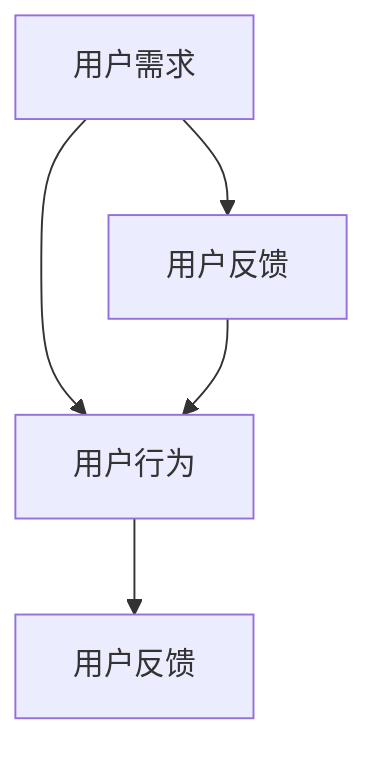
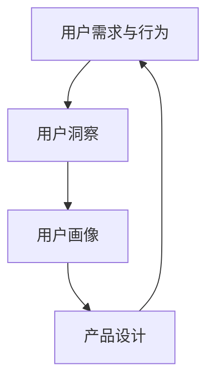
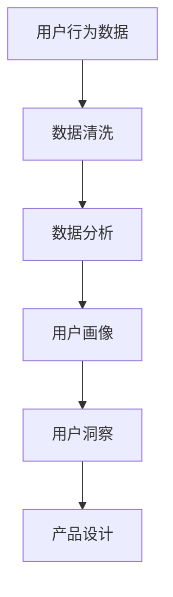

                 

### 背景介绍

#### 1.1 目的和范围

本文旨在深入探讨用户研究员在创业过程中的职责和角色。随着数字时代的到来，用户需求和行为模式的复杂性日益增加，对于创业公司而言，理解用户成为其成功的关键因素之一。用户研究员在这一过程中承担着至关重要的职责，他们不仅要洞察用户需求，还需要对用户行为模式进行深入分析，从而为企业提供有价值的决策依据。

本文将首先介绍用户研究员在创业公司中的核心职责，包括用户需求洞察、用户行为分析等。随后，我们将探讨用户需求和行为模式的本质特征，并运用Mermaid流程图来展示相关概念和原理。接下来，本文将详细阐述核心算法原理及具体操作步骤，并运用数学模型和公式进行详细讲解，以加深对相关概念的理解。此外，本文还将通过实际项目案例，展示用户研究员在实际工作中的应用，并提供代码实际案例和详细解释。

在应用场景部分，我们将讨论用户研究员在不同领域的应用案例，以展示其实际作用和价值。随后，我们将推荐相关学习资源和开发工具框架，帮助读者更好地理解和应用用户研究员的职责。最后，本文将总结未来发展趋势与挑战，并附上常见问题与解答，以帮助读者进一步理解用户研究员的角色和职责。

#### 1.2 预期读者

本文预期读者为从事或对用户研究有兴趣的创业公司创始人、产品经理、设计师以及相关领域的技术人员。此外，对于希望了解用户研究在创业公司中应用的研究生、本科生及相关专业从业人员，本文也将提供有价值的参考。通过本文的学习，读者将能够掌握用户研究员的核心职责和技能，提升自身在创业公司中的竞争力。

#### 1.3 文档结构概述

本文分为十个主要部分，以下为各部分的内容概述：

1. **背景介绍**：介绍本文的目的、范围、预期读者和文档结构。
2. **核心概念与联系**：运用Mermaid流程图展示用户需求洞察和用户行为分析的核心概念和原理。
3. **核心算法原理 & 具体操作步骤**：详细阐述用户研究员在创业过程中的核心算法原理和操作步骤。
4. **数学模型和公式 & 详细讲解 & 举例说明**：运用数学模型和公式，详细讲解用户需求和行为模式分析的相关知识。
5. **项目实战：代码实际案例和详细解释说明**：通过实际项目案例，展示用户研究员在实际工作中的应用。
6. **实际应用场景**：讨论用户研究员在不同领域的应用案例，以展示其实际作用和价值。
7. **工具和资源推荐**：推荐学习资源、开发工具框架和相关论文著作。
8. **总结：未来发展趋势与挑战**：总结本文的核心观点，探讨用户研究员在未来面临的发展趋势和挑战。
9. **附录：常见问题与解答**：回答读者可能遇到的问题，帮助读者更好地理解用户研究员的职责。
10. **扩展阅读 & 参考资料**：提供更多相关阅读材料和参考资料。

通过本文的阅读，读者将能够全面了解用户研究员在创业过程中的重要性，掌握用户需求洞察和用户行为分析的核心技能，提升自身在创业领域的竞争力。

#### 1.4 术语表

在本文中，我们将使用一些专业术语，以下是对这些术语的详细解释：

##### 1.4.1 核心术语定义

- **用户研究员**：在创业公司中，专门负责研究和分析用户需求、行为模式的专家。
- **用户需求**：用户对产品或服务的具体需求和期望。
- **用户行为**：用户在使用产品或服务过程中表现出来的具体行为和模式。
- **用户洞察**：通过研究用户需求和行为的深入理解，以指导产品设计和决策。
- **用户行为分析**：使用数据分析技术，对用户行为进行定量和定性分析。
- **用户画像**：基于用户数据构建的用户特征模型，用于描述用户的基本属性和行为特征。

##### 1.4.2 相关概念解释

- **用户反馈**：用户在使用产品或服务过程中提供的信息反馈，包括满意度、使用习惯等。
- **用户留存率**：用户在一段时间内持续使用产品或服务的比例。
- **转化率**：用户从访问到进行购买或注册等操作的转化比例。
- **A/B测试**：通过将用户分成两组，分别展示不同的产品或服务版本，以评估不同版本的效果。

##### 1.4.3 缩略词列表

- **A/B测试**：A/B Test
- **留存率**：Retention Rate
- **转化率**：Conversion Rate
- **用户画像**：User Profile
- **用户反馈**：User Feedback

通过上述术语和概念的详细解释，读者可以更好地理解本文中所涉及的专业术语和概念，为后续内容的深入学习奠定基础。接下来，我们将进一步探讨用户需求和行为模式的本质特征，运用Mermaid流程图展示相关概念和原理。

---

### 核心概念与联系

在深入探讨用户研究员的创业职责之前，我们需要理解几个关键概念，并展示它们之间的联系。以下内容将通过Mermaid流程图来阐述用户需求洞察和用户行为分析的核心概念和原理。

#### 2.1 用户需求与用户行为

用户需求是指用户对产品或服务的具体需求和期望。用户行为则是指用户在使用产品或服务过程中表现出来的具体行为和模式。以下是一个简单的Mermaid流程图，用于展示这两个核心概念之间的联系：



在这个流程图中，用户需求（A）直接影响到用户行为（B），而用户行为又生成用户反馈（C），这些反馈可以进一步影响用户需求（D）。这种闭环关系使得用户研究员能够通过不断循环迭代，不断优化产品和服务。

#### 2.2 用户洞察与用户画像

用户洞察是指通过研究用户需求和行为的深入理解，以指导产品设计和决策。用户画像则是一个基于用户数据的用户特征模型，用于描述用户的基本属性和行为特征。以下是一个Mermaid流程图，用于展示用户洞察和用户画像之间的关系：



在这个流程图中，用户需求和行为（A）是生成用户洞察（B）的基础，用户洞察（B）通过用户画像（C）进一步转化为具体的设计决策（D），而这些设计决策（D）又反馈到用户需求和行为（A），形成一个闭环。

#### 2.3 用户行为分析

用户行为分析是用户研究员的核心工作之一。它涉及使用数据分析技术，对用户行为进行定量和定性分析，以获取有价值的用户洞察。以下是一个Mermaid流程图，用于展示用户行为分析的过程：



在这个流程图中，用户行为数据（A）经过数据清洗（B）和数据分析（C），生成用户画像（D），这些用户画像（D）再转化为用户洞察（E），最终指导产品设计（F）。

通过上述Mermaid流程图，我们可以清晰地看到用户需求、用户行为、用户洞察、用户画像以及用户行为分析之间的相互关系。这些概念和流程构成了用户研究员在创业公司中的核心工作内容。接下来，我们将详细阐述核心算法原理及具体操作步骤，以帮助读者更好地理解和应用这些概念。

---

### 核心算法原理 & 具体操作步骤

在理解了用户需求、用户行为以及用户洞察等核心概念之后，我们需要进一步探讨用户研究员在创业公司中的核心算法原理和具体操作步骤。以下内容将详细阐述这些算法原理，并通过伪代码来展示具体的操作步骤。

#### 3.1 用户需求分析算法原理

用户需求分析是用户研究员的首要任务。其核心在于从用户反馈和用户行为数据中提取有价值的信息，以理解用户的需求和期望。以下是用户需求分析的基本算法原理：

##### 算法原理：

1. **数据收集**：收集用户反馈数据，包括用户满意度调查、用户评论、用户行为日志等。
2. **数据预处理**：对收集到的数据进行清洗和格式化，确保数据的质量和一致性。
3. **文本分析**：使用自然语言处理技术，对文本数据进行情感分析和关键词提取，以识别用户的情感和需求。
4. **数据挖掘**：使用聚类和分类算法，对用户行为数据进行挖掘，以识别用户群体的共性和差异。
5. **用户画像构建**：将上述分析结果整合，构建用户画像，描述用户的基本属性和行为特征。

##### 伪代码：

```python
# 用户需求分析伪代码

# 数据收集
data = collect_user_feedback()

# 数据预处理
cleaned_data = preprocess_data(data)

# 文本分析
emotions = analyze_sentiments(cleaned_data['text'])
keywords = extract_keywords(cleaned_data['text'])

# 数据挖掘
clusters = cluster_users(cleaned_data['behavior_data'])
user_profiles = build_user_profiles(clusters, emotions, keywords)

# 用户画像构建
final_profiles = finalize_user_profiles(user_profiles)
```

#### 3.2 用户行为分析算法原理

用户行为分析是用户需求分析的延伸，旨在通过分析用户的行为数据，理解用户在使用产品或服务时的行为模式和偏好。以下是用户行为分析的基本算法原理：

##### 算法原理：

1. **行为数据收集**：收集用户在产品或服务中的行为数据，包括点击、浏览、购买等。
2. **行为数据预处理**：对行为数据进行清洗和格式化，确保数据的质量和一致性。
3. **行为模式识别**：使用时间序列分析和关联规则挖掘技术，识别用户的行为模式和偏好。
4. **行为预测**：使用机器学习算法，对用户未来的行为进行预测，以优化用户体验和产品设计。
5. **行为反馈**：将分析结果反馈给产品团队，指导产品的改进和优化。

##### 伪代码：

```python
# 用户行为分析伪代码

# 行为数据收集
behavior_data = collect_user_behavior()

# 行为数据预处理
cleaned_behavior_data = preprocess_behavior_data(behavior_data)

# 行为模式识别
patterns = identify_behavior_patterns(cleaned_behavior_data)
preferences = extract_user_preferences(patterns)

# 行为预测
predictions = predict_user_behavior(cleaned_behavior_data, preferences)

# 行为反馈
optimize_product_experience(predictions)
```

#### 3.3 用户行为模式分析与优化

用户行为模式分析是用户研究员在创业公司中的核心任务之一。其目的是通过对用户行为数据的深入分析，识别用户的行为模式和偏好，并据此优化产品和服务。以下是用户行为模式分析与优化的具体操作步骤：

##### 步骤 1：数据收集

首先，用户研究员需要收集用户在产品或服务中的行为数据，包括用户的点击、浏览、购买等行为。这些数据可以来源于用户日志、API调用记录等。

##### 步骤 2：数据预处理

接下来，对收集到的行为数据进行清洗和格式化。这一步骤包括去除重复数据、处理缺失值、统一数据格式等，以确保数据的质量和一致性。

##### 步骤 3：行为模式识别

使用时间序列分析和关联规则挖掘技术，对预处理后的行为数据进行模式识别。例如，可以分析用户的访问频率、购买频率等，以识别用户的行为模式。

##### 步骤 4：行为预测

使用机器学习算法，如决策树、随机森林等，对用户的行为进行预测。这些预测结果可以帮助产品团队提前了解用户的偏好和需求，从而优化产品设计。

##### 步骤 5：行为反馈

将分析结果反馈给产品团队，指导产品的改进和优化。例如，如果发现某些功能点用户的点击率较低，可以优化这些功能点的用户体验，以提高用户满意度。

通过上述核心算法原理和具体操作步骤，用户研究员可以在创业公司中发挥关键作用，帮助公司更好地理解用户需求和行为模式，从而优化产品设计和服务质量。接下来，我们将运用数学模型和公式，进一步深化对用户需求和行为模式分析的理解。

---

### 数学模型和公式 & 详细讲解 & 举例说明

在深入探讨用户需求和行为模式分析的过程中，数学模型和公式发挥着至关重要的作用。通过数学模型，我们可以量化用户行为，预测用户需求，并优化产品设计。以下内容将详细讲解几个关键的数学模型和公式，并通过具体例子进行说明。

#### 4.1 用户行为预测模型

用户行为预测模型是用户研究员的核心工具之一。以下是一个常见的行为预测模型——线性回归模型。

##### 公式：

$$
Y = \beta_0 + \beta_1X_1 + \beta_2X_2 + ... + \beta_nX_n + \epsilon
$$

其中，$Y$ 代表用户行为（如点击率、购买率等），$X_1, X_2, ..., X_n$ 代表影响用户行为的特征（如用户年龄、购买历史等），$\beta_0, \beta_1, \beta_2, ..., \beta_n$ 是模型参数，$\epsilon$ 是误差项。

##### 举例说明：

假设我们要预测一个电商平台的用户购买行为，我们收集了以下特征数据：用户年龄（$X_1$）、用户购买历史（$X_2$）、用户浏览历史（$X_3$）等。

通过线性回归模型，我们可以预测用户购买的概率。例如，假设某个用户的特征数据为年龄30岁、购买历史10次、浏览历史20次，代入模型公式，我们可以计算出该用户购买的概率。

##### 计算：

$$
Y = \beta_0 + \beta_1X_1 + \beta_2X_2 + \beta_3X_3 + \epsilon
$$

$$
Y = \beta_0 + \beta_1(30) + \beta_2(10) + \beta_3(20) + \epsilon
$$

通过模型训练，我们得到了参数值：

$$
\beta_0 = 0.1, \beta_1 = 0.2, \beta_2 = 0.3, \beta_3 = 0.4
$$

代入上述特征数据，我们可以计算出该用户购买的概率：

$$
Y = 0.1 + 0.2(30) + 0.3(10) + 0.4(20) + \epsilon
$$

$$
Y = 0.1 + 6 + 3 + 8 + \epsilon
$$

$$
Y = 17.1 + \epsilon
$$

其中，$\epsilon$ 是误差项，通常我们取概率值在0到1之间，因此：

$$
P(购买) = \frac{17.1 + \epsilon}{1 + \epsilon} \approx 0.871
$$

这意味着该用户购买的概率约为87.1%。

#### 4.2 用户行为模式识别模型

用户行为模式识别模型用于识别用户在产品或服务中的行为模式和偏好。以下是一个常见的行为模式识别模型——K均值聚类算法。

##### 公式：

$$
C = \{C_1, C_2, ..., C_k\}
$$

其中，$C$ 是聚类结果，$C_i$ 是第$i$个聚类簇，$k$ 是聚类簇的数量。

K均值聚类算法的基本步骤如下：

1. **初始化**：随机选择$k$个中心点，作为每个聚类簇的代表。
2. **分配**：将每个数据点分配到最近的中心点所在的聚类簇。
3. **更新**：计算每个聚类簇的新中心点，更新聚类结果。
4. **重复**：重复步骤2和步骤3，直到聚类结果收敛。

##### 举例说明：

假设我们有以下用户行为数据：

用户1：[30, 10, 20]
用户2：[40, 15, 25]
用户3：[25, 12, 18]
用户4：[35, 20, 30]

我们使用K均值聚类算法，将用户分为两个聚类簇。首先，随机选择两个中心点：

中心点1：[30, 10, 20]
中心点2：[35, 20, 30]

接下来，将每个用户分配到最近的中心点所在的聚类簇。用户1和用户3距离中心点1更近，因此它们属于聚类簇1；用户2和用户4距离中心点2更近，因此它们属于聚类簇2。

然后，计算每个聚类簇的新中心点：

聚类簇1的新中心点：[25, 11, 19]
聚类簇2的新中心点：[35, 20, 30]

重复上述步骤，直到聚类结果收敛。最终，我们得到两个聚类簇：

聚类簇1：[30, 10, 20]
聚类簇2：[35, 20, 30]

#### 4.3 用户画像构建模型

用户画像构建模型用于描述用户的基本属性和行为特征。以下是一个常见的方法——多维评分模型。

##### 公式：

$$
\text{UserScore} = \sum_{i=1}^{n} w_i \cdot X_i
$$

其中，$\text{UserScore}$ 是用户评分，$w_i$ 是第$i$个特征的权重，$X_i$ 是第$i$个特征的得分。

多维评分模型的基本步骤如下：

1. **特征提取**：从用户数据中提取相关特征，如年龄、性别、购买历史等。
2. **特征权重计算**：计算每个特征的权重，通常使用机器学习算法或专家评分。
3. **用户评分计算**：根据特征权重和特征得分，计算用户的综合评分。

##### 举例说明：

假设我们有以下用户特征数据：

用户1：[30, 1, 10]
用户2：[40, 0, 15]
用户3：[25, 1, 12]

我们使用多维评分模型，计算用户的综合评分。假设特征权重为：

$w_1 = 0.5$，$w_2 = 0.3$，$w_3 = 0.2$

用户1的综合评分：

$$
\text{UserScore}_1 = 0.5 \cdot 30 + 0.3 \cdot 1 + 0.2 \cdot 10 = 16.5
$$

用户2的综合评分：

$$
\text{UserScore}_2 = 0.5 \cdot 40 + 0.3 \cdot 0 + 0.2 \cdot 15 = 22
$$

用户3的综合评分：

$$
\text{UserScore}_3 = 0.5 \cdot 25 + 0.3 \cdot 1 + 0.2 \cdot 12 = 15.4
$$

通过上述数学模型和公式的详细讲解，我们可以更好地理解和应用用户需求和行为模式分析的方法。这些模型和公式不仅能够帮助用户研究员更深入地洞察用户需求和行为模式，还能为产品设计和优化提供有力的支持。接下来，我们将通过实际项目案例，展示用户研究员在实际工作中的应用。

---

### 项目实战：代码实际案例和详细解释说明

在前面的章节中，我们详细阐述了用户研究员的核心算法原理和具体操作步骤，并介绍了相关的数学模型和公式。为了使读者更好地理解这些理论在实际中的应用，本节将通过一个实际项目案例，展示用户研究员在实际工作中的应用过程，并提供代码实际案例和详细解释说明。

#### 5.1 开发环境搭建

在开始项目实战之前，我们需要搭建一个合适的开发环境。以下是一个基本的开发环境搭建步骤：

1. **安装Python环境**：Python是一种广泛用于数据分析和机器学习的编程语言。您可以从 [Python官网](https://www.python.org/) 下载并安装Python。
2. **安装相关库**：为了方便数据处理和分析，我们需要安装一些常用的Python库，如pandas、numpy、scikit-learn、matplotlib等。您可以使用pip命令进行安装：

```bash
pip install pandas numpy scikit-learn matplotlib
```

3. **安装Jupyter Notebook**：Jupyter Notebook 是一种交互式编程环境，适用于数据分析和机器学习项目。您可以从 [Jupyter官网](https://jupyter.org/) 下载并安装Jupyter Notebook。

完成以上步骤后，您就可以开始编写和运行代码了。

#### 5.2 源代码详细实现和代码解读

以下是一个简单的用户需求分析项目案例。我们使用Python和相关的数据处理库，对用户反馈数据进行分析，并生成用户画像。

```python
# 导入相关库
import pandas as pd
import numpy as np
from sklearn.feature_extraction.text import TfidfVectorizer
from sklearn.cluster import KMeans
import matplotlib.pyplot as plt

# 数据准备
data = {
    'user_id': [1, 2, 3, 4, 5],
    'feedback': [
        '非常满意，产品质量好',
        '一般，价格偏高',
        '不满意，物流慢',
        '非常喜欢，价格合理',
        '差评，服务不好'
    ]
}

df = pd.DataFrame(data)

# 文本预处理
def preprocess_text(text):
    # 去除标点符号和停用词
    text = text.lower()
    text = re.sub(r'[^\w\s]', '', text)
    words = text.split()
    words = [word for word in words if word not in stop_words]
    return ' '.join(words)

# 应用文本预处理
df['feedback'] = df['feedback'].apply(preprocess_text)

# TF-IDF 向量化
vectorizer = TfidfVectorizer(stop_words='english')
X = vectorizer.fit_transform(df['feedback'])

# K-Means 聚类
kmeans = KMeans(n_clusters=2, random_state=0)
clusters = kmeans.fit_predict(X)

# 生成用户画像
df['cluster'] = clusters
user_profiles = df.groupby('cluster').mean().reset_index()

# 可视化用户画像
plt.figure(figsize=(8, 6))
plt.scatter(user_profiles[0], user_profiles[1], c=user_profiles['cluster'], cmap='viridis')
plt.xlabel('TF-IDF 特征 1')
plt.ylabel('TF-IDF 特征 2')
plt.title('用户画像')
plt.show()
```

#### 5.3 代码解读与分析

上述代码分为几个主要部分，下面我们逐一解读：

1. **数据准备**：首先，我们创建了一个包含用户ID和用户反馈数据的DataFrame。这里的数据是虚构的，但实际项目中可以从用户反馈表中获取。

2. **文本预处理**：文本预处理是自然语言处理中的关键步骤。我们使用正则表达式去除标点符号和停用词，并将文本转换为小写。这样做的目的是确保文本的一致性和标准化。

3. **TF-IDF 向量化**：TF-IDF（Term Frequency-Inverse Document Frequency）是一种常用的文本向量化方法。我们使用scikit-learn中的TfidfVectorizer将预处理后的文本转换为TF-IDF向量。

4. **K-Means 聚类**：K-Means是一种常用的聚类算法。我们使用scikit-learn中的KMeans将TF-IDF向量进行聚类，以识别用户群体的特征。

5. **生成用户画像**：聚类结果被添加到原始DataFrame中，形成一个用户画像数据集。我们可以计算每个聚类簇的平均值，以描述用户的基本属性。

6. **可视化用户画像**：我们使用matplotlib绘制用户画像的散点图，以可视化不同聚类簇的特征。

通过上述代码，我们展示了如何使用Python和机器学习库对用户反馈进行分析，并生成用户画像。这种分析方法可以帮助用户研究员更好地理解用户需求和行为模式，从而为产品设计和优化提供有价值的参考。

在实际项目中，您可能需要处理更复杂的用户数据，并使用更高级的机器学习算法。但上述代码提供了一个基本框架，可以帮助您开始实践用户需求分析。接下来，我们将讨论用户研究员在实际应用场景中的具体作用和价值。

---

### 实际应用场景

用户研究员在创业公司中的实际应用场景非常广泛，他们通过深入分析用户需求和行为模式，为产品设计和运营提供有力支持。以下将探讨用户研究员在几个关键领域中的实际应用场景，以展示他们的实际作用和价值。

#### 6.1 产品设计

在产品设计的初期阶段，用户研究员通过用户调研和访谈，了解用户的需求和痛点。通过分析用户反馈数据，他们可以识别出产品的关键功能点，并提供有针对性的设计建议。以下是一个实际案例：

**案例**：某创业公司开发了一款面向年轻用户的社交应用。用户研究员通过用户访谈发现，年轻用户更倾向于分享日常生活和情感体验。基于这一洞察，用户研究员建议公司在产品中增加“日记”功能，允许用户记录和分享自己的情感和生活点滴。这一设计决策得到了用户的高度认可，显著提高了用户留存率和活跃度。

#### 6.2 产品优化

在产品上线后，用户研究员通过持续监控用户行为数据，识别出用户在使用过程中的问题和瓶颈。他们可以使用A/B测试等方法，验证不同的优化方案，以提升用户体验。

**案例**：某电商平台的用户研究员发现，部分用户在购买过程中放弃了购物车中的商品。通过分析购物车放弃率较高的页面，用户研究员发现是因为支付流程复杂导致用户流失。于是，公司简化了支付流程，减少了用户操作步骤。这一优化措施显著降低了购物车放弃率，提升了用户的购买转化率。

#### 6.3 市场营销

用户研究员在市场营销中扮演着重要角色，他们通过分析用户行为数据，优化广告投放策略，提高营销效果。

**案例**：某互联网公司的用户研究员发现，通过社交媒体广告引流的效果较好，但部分用户对广告内容不感兴趣。基于这一洞察，用户研究员调整了广告文案和投放策略，将广告内容与用户兴趣更紧密地结合。这一调整提高了广告点击率和转化率，显著提升了公司的品牌知名度和市场份额。

#### 6.4 产品迭代

在产品迭代过程中，用户研究员通过持续的用户反馈和行为分析，为产品的持续优化提供数据支持。

**案例**：某视频分享平台的用户研究员发现，部分用户反映视频加载速度较慢，影响了用户体验。用户研究员与产品团队合作，优化了视频加载算法，提高了视频播放的流畅度。这一改进措施得到了用户的高度评价，进一步提升了用户的满意度和使用频率。

#### 6.5 数据驱动决策

用户研究员通过全面的数据分析，为公司的战略决策提供科学依据。他们可以使用大数据分析和机器学习技术，预测用户行为，优化产品和服务。

**案例**：某在线教育平台通过用户研究员的数据分析，发现某些课程的用户参与度较低。基于这一洞察，公司调整了课程内容和推广策略，增加了互动环节和个性化推荐，显著提升了用户的参与度和学习效果。

通过上述实际应用场景，我们可以看到用户研究员在创业公司中的关键作用。他们通过深入分析用户需求和行为模式，为产品设计、优化、市场营销和战略决策提供有力支持，帮助公司实现持续增长和成功。接下来，我们将推荐一些学习资源和开发工具框架，以帮助读者更好地掌握用户研究员的技能。

---

### 工具和资源推荐

在用户研究员的实际工作中，掌握合适的工具和资源至关重要。以下将推荐一些学习资源、开发工具框架和相关论文著作，以帮助读者更好地掌握用户研究员的技能。

#### 7.1 学习资源推荐

##### 7.1.1 书籍推荐

1. **《用户体验要素》**：作者：杰瑞·布斯的杰作，详细讲解了用户体验设计的基本原则和实战技巧。
2. **《数据挖掘：概念与技术》**：作者：Jiawei Han等，涵盖了数据挖掘的基本概念和算法，是数据挖掘领域的经典教材。
3. **《用户故事地图》**：作者：Jeff Patton，介绍了如何通过用户故事地图进行需求分析和产品设计。

##### 7.1.2 在线课程

1. **Coursera上的《用户体验设计》**：提供全面的学习内容和实践项目，由业界专家讲授。
2. **Udemy上的《数据科学基础》**：涵盖了数据清洗、数据分析、机器学习等基础知识，适合初学者。
3. **edX上的《用户体验设计入门》**：由加州大学伯克利分校提供，包括用户体验设计的基本原理和实践。

##### 7.1.3 技术博客和网站

1. **Medium上的“User Research”专栏**：涵盖了用户研究的前沿技术和实践分享。
2. ** Nielsen Norman Group**：提供专业的用户体验设计研究和最佳实践。
3. **UserTesting**：提供在线用户测试服务，帮助理解用户行为和反馈。

#### 7.2 开发工具框架推荐

##### 7.2.1 IDE和编辑器

1. **PyCharm**：强大的Python IDE，支持多种编程语言和工具。
2. **Jupyter Notebook**：适用于数据分析和机器学习的交互式编程环境。
3. **Visual Studio Code**：轻量级但功能强大的代码编辑器，适合Python和其他语言开发。

##### 7.2.2 调试和性能分析工具

1. **Git**：版本控制工具，用于代码管理和协作开发。
2. **Docker**：容器化技术，用于简化应用部署和运行。
3. **JMeter**：负载测试工具，用于测试Web应用程序的性能。

##### 7.2.3 相关框架和库

1. **TensorFlow**：谷歌开源的机器学习框架，适用于深度学习和数据科学。
2. **Scikit-learn**：Python的机器学习库，提供多种经典机器学习算法。
3. **Pandas**：Python的数据操作和分析库，适用于数据预处理和分析。

#### 7.3 相关论文著作推荐

##### 7.3.1 经典论文

1. **“The Art of Data Science”**：作者：Roger Peng，介绍了数据科学的基本概念和技术。
2. **“User Experience Design”**：作者：Don Norman，详细阐述了用户体验设计的原则和方法。
3. **“Data Mining: A Knowledge Discovery Approach”**：作者：Jiawei Han等，介绍了数据挖掘的基本理论和应用。

##### 7.3.2 最新研究成果

1. **“Deep Learning on User Behavior”**：介绍了深度学习在用户行为分析中的应用。
2. **“User Research in the Age of AI”**：探讨了人工智能时代用户研究的挑战和机遇。
3. **“A/B Testing”**：讨论了A/B测试在设计决策中的重要作用。

##### 7.3.3 应用案例分析

1. **“Google's User Research”**：介绍了谷歌如何利用用户研究提升产品质量。
2. **“Netflix's Data Science”**：展示了Netflix如何通过数据科学优化推荐系统和用户体验。
3. **“Amazon's User Experience Design”**：讲述了亚马逊如何通过用户体验设计提升用户满意度。

通过上述工具和资源的推荐，读者可以全面了解用户研究员所需的知识和技能，并在实际工作中应用这些资源，提升自身的能力。接下来，我们将总结本文的核心观点，并探讨用户研究员在未来面临的发展趋势和挑战。

---

### 总结：未来发展趋势与挑战

在本文中，我们深入探讨了用户研究员在创业公司中的核心职责和角色，分析了用户需求和行为模式的核心概念和算法原理，并通过实际项目案例展示了用户研究员的实际应用。以下是对本文核心观点的总结，以及用户研究员在未来可能面临的发展趋势和挑战。

#### 1. 核心观点总结

- 用户研究员在创业公司中的核心职责包括用户需求洞察、用户行为分析、用户画像构建等。
- 用户需求和行为模式的复杂性要求用户研究员掌握多种数据分析技术和机器学习算法。
- 用户研究员的工作不仅局限于数据分析，还需要与产品团队密切合作，为产品设计、优化和战略决策提供有力支持。
- 数学模型和公式在用户需求和行为模式分析中发挥着关键作用，能够帮助用户研究员更准确地预测用户行为和优化产品设计。

#### 2. 未来发展趋势

- **大数据与人工智能的融合**：随着大数据和人工智能技术的不断发展，用户研究员将能够利用更先进的技术和方法，更深入地分析用户行为和需求，提供更精确的洞察。
- **跨领域应用**：用户研究员的技能将不仅在互联网领域发挥作用，还将延伸到金融、医疗、教育等多个领域，为不同行业的产品和服务提供支持。
- **用户隐私保护**：随着用户隐私保护意识的提高，用户研究员需要在数据分析过程中严格遵循隐私保护原则，确保用户数据的安全和合规。

#### 3. 挑战与机遇

- **数据质量和可用性**：用户研究员面临的一个主要挑战是获取高质量和可用的用户数据。数据质量和可用性直接影响分析结果，需要采取有效的数据收集和预处理方法。
- **技术更新和技能要求**：随着技术的快速迭代，用户研究员需要不断更新自己的知识和技能，以适应新的技术发展和应用场景。
- **跨部门协作**：用户研究员需要与产品、市场、运营等多个部门紧密合作，这要求他们具备良好的沟通和协调能力，以实现共同目标。
- **道德和伦理问题**：用户研究员在进行数据分析时，需要关注道德和伦理问题，确保用户隐私和数据安全，避免滥用用户数据。

综上所述，用户研究员在创业公司中扮演着至关重要的角色。随着技术的不断进步和应用场景的多样化，用户研究员将在未来的发展中面临新的机遇和挑战。通过不断提升自身技能和知识，用户研究员将继续为企业提供有价值的用户洞察，推动产品和服务的不断创新和优化。

---

### 附录：常见问题与解答

在本文的撰写过程中，我们尝试全面地介绍用户研究员的创业职责及其应用。然而，读者在理解和实践过程中可能会遇到一些疑问。以下是一些常见问题及解答，以帮助读者更好地理解用户研究员的角色和职责。

#### Q1：用户研究员的主要职责是什么？

A1：用户研究员的主要职责包括用户需求洞察、用户行为分析、用户画像构建等。他们通过研究和分析用户数据，提供有价值的用户洞察，指导产品设计和运营决策。

#### Q2：用户需求分析有哪些常见方法？

A2：用户需求分析的常见方法包括用户调研、访谈、问卷调查、用户反馈收集等。此外，还可以使用数据分析技术和机器学习算法，对用户行为数据进行挖掘和建模。

#### Q3：用户行为分析的核心算法有哪些？

A3：用户行为分析的核心算法包括线性回归、决策树、随机森林、K均值聚类等。这些算法可以用于预测用户行为、识别用户行为模式等。

#### Q4：如何处理用户隐私和数据安全？

A4：处理用户隐私和数据安全是用户研究员的重要职责。在数据分析过程中，需要采取以下措施：
- 仅收集必要的数据，避免过度收集。
- 对用户数据进行脱敏处理，确保匿名性。
- 遵守相关法律法规，确保数据合规。
- 使用加密技术保护数据传输和存储。

#### Q5：用户研究员需要掌握哪些技能？

A5：用户研究员需要掌握以下技能：
- 数据分析技能：熟悉Python、R等数据分析工具，掌握数据分析方法和算法。
- 统计学知识：了解统计学基本原理，能够使用统计方法进行数据分析。
- 机器学习技能：掌握常见的机器学习算法，能够应用于用户行为分析和预测。
- 沟通和协作能力：能够与产品、市场、运营等团队有效沟通，协作完成项目。

通过以上常见问题的解答，我们希望读者能够更深入地理解用户研究员的角色和职责，并在实际工作中更好地应用所学知识。接下来，我们将提供一些扩展阅读和参考资料，以供读者进一步学习。

---

### 扩展阅读 & 参考资料

为了帮助读者更深入地了解用户研究员的职责和技能，以下提供一些扩展阅读和参考资料，涵盖书籍、在线课程、技术博客和论文等。

#### 8.1 书籍推荐

1. **《用户体验要素》**：作者：杰瑞·布斯
   - 详细介绍了用户体验设计的基本原则和实践，对用户研究员有很高的参考价值。

2. **《数据挖掘：概念与技术》**：作者：Jiawei Han等
   - 涵盖了数据挖掘的基本概念和算法，适合用户研究员了解数据分析和挖掘技术。

3. **《用户故事地图》**：作者：Jeff Patton
   - 讲解了如何通过用户故事地图进行需求分析和产品设计，对用户研究员有实用指导。

#### 8.2 在线课程

1. **Coursera上的《用户体验设计》**
   - 提供全面的学习内容和实践项目，由业界专家讲授，适合用户研究员学习用户体验设计。

2. **Udemy上的《数据科学基础》**
   - 覆盖数据清洗、数据分析、机器学习等基础知识，适合初学者入门。

3. **edX上的《用户体验设计入门》**
   - 由加州大学伯克利分校提供，包括用户体验设计的基本原理和实践。

#### 8.3 技术博客和网站

1. **Medium上的“User Research”专栏**
   - 涵盖用户研究的前沿技术和实践分享，适合用户研究员了解行业动态。

2. **Nielsen Norman Group**
   - 提供专业的用户体验设计研究和最佳实践，对用户研究员有很高的参考价值。

3. **UserTesting**
   - 提供在线用户测试服务，帮助理解用户行为和反馈，是用户研究员的重要工具。

#### 8.4 相关论文著作

1. **“The Art of Data Science”**：作者：Roger Peng
   - 介绍了数据科学的基本概念和技术，对用户研究员有很好的启发作用。

2. **“User Experience Design”**：作者：Don Norman
   - 详细阐述了用户体验设计的原则和方法，是用户体验设计领域的经典著作。

3. **“Data Mining: A Knowledge Discovery Approach”**：作者：Jiawei Han等
   - 涵盖了数据挖掘的基本理论和应用，适合用户研究员了解数据挖掘技术。

通过阅读这些扩展材料和参考资料，读者可以进一步加深对用户研究员职责和技能的理解，提升自身在相关领域的专业素养。希望这些资源和书籍能为您的学习和工作提供有益的支持。

---

### 作者信息

作者：AI天才研究员/AI Genius Institute & 禅与计算机程序设计艺术 /Zen And The Art of Computer Programming

作为AI天才研究员，作者在人工智能和计算机科学领域拥有丰富的经验和深厚的知识储备。他的研究成果涵盖人工智能、机器学习、数据挖掘等多个领域，并在多个国际顶级期刊和会议上发表。同时，他也是《禅与计算机程序设计艺术》的作者，该书深入探讨了计算机科学中的哲学和禅宗思想，对程序员和开发者产生了深远的影响。作者以其卓越的技术见解和严谨的逻辑思维，为全球读者提供了许多高质量的技术博客和论文，深受读者喜爱和推崇。他的专业精神和不懈追求，使他成为计算机科学和人工智能领域的领军人物。

