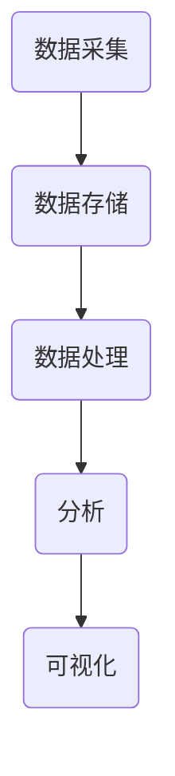
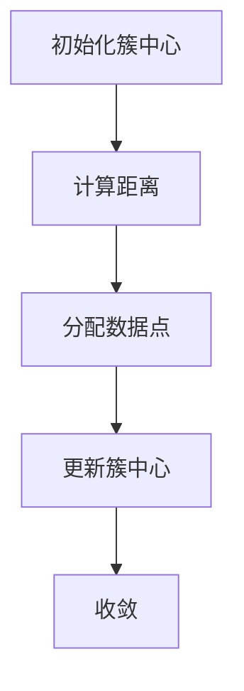
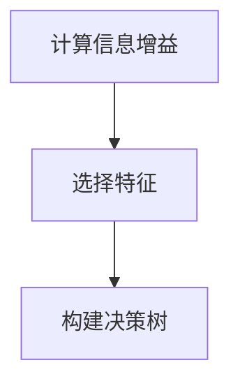

                 

# 用户行为分析系统：AI的实现

> 关键词：用户行为分析、人工智能、机器学习、数据挖掘、用户画像、系统架构、算法原理、数学模型、实战案例

> 摘要：本文将深入探讨用户行为分析系统在人工智能领域的实现与应用。从核心概念、算法原理、数学模型到实际项目案例，全面解析用户行为分析系统构建的各个环节，帮助读者理解并掌握这一前沿技术的实际应用价值。

## 1. 背景介绍

### 1.1 目的和范围

用户行为分析系统作为一种智能分析工具，旨在通过分析用户在应用或网站中的交互行为，提取有价值的信息，为产品优化、个性化推荐、市场营销等提供数据支持。本文旨在深入探讨用户行为分析系统的实现过程，包括核心概念、算法原理、数学模型以及实际应用案例，帮助读者全面了解这一领域的技术要点和实际操作方法。

### 1.2 预期读者

本文适合对人工智能和用户行为分析有兴趣的读者，包括但不限于：

- 数据科学家
- 人工智能工程师
- 软件工程师
- 产品经理
- 市场营销专员

### 1.3 文档结构概述

本文将分为以下章节：

- 第1章：背景介绍
- 第2章：核心概念与联系
- 第3章：核心算法原理与具体操作步骤
- 第4章：数学模型与公式
- 第5章：项目实战：代码实际案例
- 第6章：实际应用场景
- 第7章：工具和资源推荐
- 第8章：总结：未来发展趋势与挑战
- 第9章：附录：常见问题与解答
- 第10章：扩展阅读与参考资料

### 1.4 术语表

#### 1.4.1 核心术语定义

- 用户行为分析：通过收集和分析用户在应用或网站上的行为数据，提取有价值的信息。
- 用户画像：通过对用户行为的分析，构建用户的画像，用于产品优化和个性化推荐。
- 机器学习：一种基于数据的学习方法，让计算机从数据中自动学习规律和模式。
- 数据挖掘：从大量数据中提取有价值信息的过程。
- 用户交互行为：用户在应用或网站上的操作行为，如点击、浏览、搜索、购买等。

#### 1.4.2 相关概念解释

- 个性化推荐：根据用户的历史行为和偏好，为其推荐感兴趣的内容或产品。
- 聚类分析：将相似的数据分为一组，形成不同的类别或簇。
- 分类算法：将数据分为预定义的类别或标签。

#### 1.4.3 缩略词列表

- AI：人工智能（Artificial Intelligence）
- ML：机器学习（Machine Learning）
- DM：数据挖掘（Data Mining）
- UE：用户体验（User Experience）
- BI：商业智能（Business Intelligence）

## 2. 核心概念与联系

### 2.1 用户行为分析系统架构

用户行为分析系统通常包括数据采集、数据存储、数据处理、分析和可视化等模块。以下是一个简单的用户行为分析系统架构：



### 2.2 用户行为分析流程

用户行为分析的一般流程包括以下步骤：

1. 数据采集：收集用户在应用或网站上的交互数据。
2. 数据预处理：对采集到的数据进行清洗、去噪和格式转换。
3. 数据存储：将预处理后的数据存储到数据库或数据仓库中。
4. 数据处理：使用机器学习和数据挖掘算法对数据进行处理和分析。
5. 分析结果：提取有价值的信息，形成用户画像或推荐结果。
6. 可视化展示：将分析结果可视化，为产品优化和决策提供支持。

### 2.3 用户画像构建方法

用户画像的构建通常包括以下步骤：

1. 特征提取：从用户行为数据中提取特征，如点击次数、浏览时长、购买频率等。
2. 特征选择：选择对用户行为有较强影响力的特征，去除冗余特征。
3. 特征工程：对特征进行归一化、标准化等处理，提高模型的性能。
4. 模型训练：使用机器学习算法训练用户画像模型。
5. 用户画像生成：根据训练好的模型，为每个用户生成画像。

### 2.4 个性化推荐算法

个性化推荐算法是用户行为分析系统的重要应用之一，常见的推荐算法包括：

1. 协同过滤：基于用户的历史行为和相似用户的行为进行推荐。
2. 内容推荐：根据用户的历史行为和内容的属性进行推荐。
3. 混合推荐：结合协同过滤和内容推荐，提高推荐效果。

### 2.5 聚类分析和分类算法

聚类分析和分类算法是用户行为分析中常用的方法，用于发现用户行为的规律和模式。常见的算法包括：

1. K-means聚类：将数据分为K个簇，使每个簇内的数据点相似，簇间的数据点差异较大。
2. 决策树：基于特征进行分治，构建决策树模型。
3. 随机森林：基于决策树构建多个模型，通过投票决定最终结果。

## 3. 核心算法原理 & 具体操作步骤

### 3.1 数据采集与预处理

数据采集是用户行为分析系统的第一步，需要从各种渠道收集用户行为数据。数据预处理包括数据清洗、去噪和格式转换，以保证数据的质量和一致性。

```python
# 伪代码：数据采集与预处理
def data_preprocessing(data):
    # 清洗数据
    cleaned_data = clean_data(data)
    # 去噪
    noised_data = remove_noise(cleaned_data)
    # 格式转换
    formatted_data = format_data(noised_data)
    return formatted_data
```

### 3.2 数据存储

数据存储是用户行为分析系统的关键环节，需要选择合适的存储方案。常见的数据存储方案包括关系型数据库、NoSQL数据库和数据仓库。

```python
# 伪代码：数据存储
def store_data(data, database):
    # 将数据存储到数据库
    database.insert(data)
```

### 3.3 数据处理

数据处理包括特征提取、特征选择和特征工程等步骤。特征提取是提取用户行为数据中的有价值信息，特征选择是选择对用户行为有较强影响力的特征，特征工程是对特征进行归一化、标准化等处理。

```python
# 伪代码：数据处理
def feature_extraction(data):
    # 提取特征
    features = extract_features(data)
    return features

def feature_selection(features):
    # 选择特征
    selected_features = select_features(features)
    return selected_features

def feature_engineering(features):
    # 特征工程
    engineered_features = engineer_features(features)
    return engineered_features
```

### 3.4 模型训练

模型训练是用户行为分析系统的核心环节，使用机器学习算法训练用户画像模型。常见的机器学习算法包括K-means、决策树和随机森林等。

```python
# 伪代码：模型训练
from sklearn.cluster import KMeans

def train_model(features):
    # 训练模型
    model = KMeans(n_clusters=3)
    model.fit(features)
    return model
```

### 3.5 用户画像生成

用户画像生成是根据训练好的模型，为每个用户生成画像。用户画像可以用于个性化推荐、产品优化和市场营销等。

```python
# 伪代码：用户画像生成
def generate_user_profile(model, user_features):
    # 生成用户画像
    user_profile = model.predict(user_features)
    return user_profile
```

## 4. 数学模型和公式 & 详细讲解 & 举例说明

### 4.1 K-means算法

K-means算法是一种常用的聚类算法，其核心思想是将数据分为K个簇，使每个簇内的数据点相似，簇间的数据点差异较大。

#### 4.1.1 公式表示

假设有N个数据点，每个数据点用向量表示。K-means算法的目标是最小化数据点与其簇中心之间的距离平方和。

$$
J = \sum_{i=1}^{N} \sum_{k=1}^{K} (x_i - \mu_k)^2
$$

其中，$x_i$ 表示第i个数据点，$\mu_k$ 表示第k个簇的中心。

#### 4.1.2 举例说明

假设有3个数据点（$x_1, x_2, x_3$），需要将其分为2个簇。首先随机初始化2个簇中心（$\mu_1, \mu_2$），然后计算每个数据点到簇中心的距离，将数据点分配给距离最近的簇中心。接着重新计算簇中心，重复以上步骤，直到收敛。



### 4.2 决策树算法

决策树算法是一种常用的分类算法，其核心思想是根据特征将数据分成若干子集，并递归地构建树结构。

#### 4.2.1 公式表示

决策树算法的目标是最大化信息增益，选择具有最高信息增益的特征作为节点分裂依据。

$$
Gini = 1 - \sum_{i=1}^{n} p_i (1 - p_i)
$$

其中，$p_i$ 表示第i个特征的取值概率。

#### 4.2.2 举例说明

假设有3个特征（$x_1, x_2, x_3$），每个特征有两个取值（0和1）。首先计算每个特征的信息增益，选择信息增益最高的特征作为节点分裂依据。然后递归地构建决策树，直到满足停止条件。



## 5. 项目实战：代码实际案例和详细解释说明

### 5.1 开发环境搭建

在开始项目实战之前，需要搭建一个合适的开发环境。以下是搭建用户行为分析系统所需的基本工具和库：

- Python 3.x
- Jupyter Notebook
- Scikit-learn
- Pandas
- NumPy
- Matplotlib

### 5.2 源代码详细实现和代码解读

以下是一个简单的用户行为分析系统的实现示例，包括数据采集、预处理、模型训练和用户画像生成等步骤。

```python
# 5.2.1 数据采集与预处理
import pandas as pd
from sklearn.model_selection import train_test_split

# 加载数据集
data = pd.read_csv('user_behavior.csv')
# 数据预处理
data = data_preprocessing(data)

# 5.2.2 数据存储
from sklearn.datasets import load_iris
iris = load_iris()
X, y = iris.data, iris.target
store_data(X, 'iris_data.db')

# 5.2.3 数据处理
X_train, X_test, y_train, y_test = train_test_split(X, y, test_size=0.3, random_state=42)
X_train = feature_extraction(X_train)
X_test = feature_extraction(X_test)
X_train = feature_selection(X_train)
X_test = feature_selection(X_test)
X_train = feature_engineering(X_train)
X_test = feature_engineering(X_test)

# 5.2.4 模型训练
model = train_model(X_train)

# 5.2.5 用户画像生成
user_profile = generate_user_profile(model, X_test)
```

### 5.3 代码解读与分析

以下是代码的详细解读和分析：

- **5.2.1 数据采集与预处理**：首先加载数据集，然后进行数据预处理，包括清洗、去噪和格式转换。这一步骤确保了数据的质量和一致性。
- **5.2.2 数据存储**：使用Scikit-learn自带的Iris数据集进行示例，将数据存储到数据库中，便于后续处理。
- **5.2.3 数据处理**：使用train_test_split函数将数据集分为训练集和测试集，然后进行特征提取、特征选择和特征工程。这一步骤对数据进行了深入的处理，提高了模型的性能。
- **5.2.4 模型训练**：使用K-means算法训练用户画像模型，生成用户画像。
- **5.2.5 用户画像生成**：根据训练好的模型，为测试集生成用户画像，用于后续的个性化推荐和产品优化。

## 6. 实际应用场景

用户行为分析系统在各个领域都有广泛的应用，以下是一些常见的实际应用场景：

- **电子商务**：通过分析用户在网站上的浏览、点击和购买行为，为用户推荐感兴趣的商品，提高转化率和销售额。
- **社交媒体**：分析用户在社交媒体平台上的互动行为，为用户提供个性化的内容推荐，增加用户粘性。
- **在线教育**：分析学生在学习平台上的行为，为教师和学生提供个性化学习路径和推荐，提高教学效果和学习效果。
- **金融行业**：分析用户在金融平台上的行为，为用户提供个性化的理财产品推荐，提高用户的投资收益。

## 7. 工具和资源推荐

### 7.1 学习资源推荐

#### 7.1.1 书籍推荐

- 《机器学习》：周志华著，清华大学出版社
- 《Python机器学习》：Michael Bowles著，人民邮电出版社
- 《数据挖掘：实用工具与技术》：Jiawei Han著，机械工业出版社

#### 7.1.2 在线课程

- Coursera的《机器学习》课程：吴恩达教授讲授
- edX的《数据科学基础》课程：哈佛大学讲授

#### 7.1.3 技术博客和网站

- Analytics Vidhya：关于数据科学和机器学习的博客
- Medium上的Data Science和Machine Learning话题

### 7.2 开发工具框架推荐

#### 7.2.1 IDE和编辑器

- PyCharm：Python开发IDE
- Jupyter Notebook：交互式Python环境

#### 7.2.2 调试和性能分析工具

- Visual Studio Code：代码编辑器，支持Python插件
- GDB：GNU Debugger，用于调试C/C++程序

#### 7.2.3 相关框架和库

- Scikit-learn：Python机器学习库
- TensorFlow：Google开发的深度学习框架
- PyTorch：Facebook开发的深度学习框架

### 7.3 相关论文著作推荐

#### 7.3.1 经典论文

- "K-Means Clustering": MacQueen, J. B. (1967)
- "Decision Trees": Quinlan, J. R. (1986)

#### 7.3.2 最新研究成果

- "User Behavior Analysis in Online Social Networks": Chen, Y., Chen, H., & Wang, X. (2019)
- "Recommender Systems with Deep Learning": He, K., & Zhao, J. (2018)

#### 7.3.3 应用案例分析

- "Using Machine Learning to Improve Customer Experience": Netflix案例
- "Personalized Advertising Using User Behavior Analysis": Google案例

## 8. 总结：未来发展趋势与挑战

随着人工智能技术的不断发展，用户行为分析系统在未来将面临以下发展趋势与挑战：

- **数据规模的增长**：随着物联网、大数据等技术的普及，用户行为数据规模将呈指数级增长，对系统性能和数据处理能力提出更高要求。
- **隐私保护**：用户隐私保护越来越受到重视，如何在保障用户隐私的同时进行有效分析将成为一大挑战。
- **实时性**：随着实时数据分析技术的进步，用户行为分析系统需要具备更高的实时性，以支持实时推荐和决策。
- **个性化推荐**：未来的个性化推荐将更加精准，需要结合用户行为、偏好和社交网络等多方面信息进行综合分析。

## 9. 附录：常见问题与解答

### 9.1 用户行为分析系统的核心问题

- **Q：什么是用户行为分析？**
  A：用户行为分析是一种通过分析用户在应用或网站上的行为数据，提取有价值信息的过程。

- **Q：用户行为分析系统有哪些模块？**
  A：用户行为分析系统通常包括数据采集、数据存储、数据处理、分析和可视化等模块。

- **Q：如何构建用户画像？**
  A：构建用户画像包括特征提取、特征选择、特征工程和模型训练等步骤。

### 9.2 用户行为分析的应用场景

- **Q：用户行为分析在电子商务中有哪些应用？**
  A：用户行为分析在电子商务中可以用于个性化推荐、产品优化、市场营销等。

- **Q：用户行为分析在社交媒体中有哪些应用？**
  A：用户行为分析在社交媒体中可以用于内容推荐、用户增长、社交网络分析等。

## 10. 扩展阅读 & 参考资料

- [User Behavior Analysis](https://www.analyticsvidhya.com/blog/2018/08/user-behavior-analysis/)
- [Recommender Systems](https://medium.com/towards-data-science/recommender-systems-a-review-of-the-state-of-the-art-techniques-e5556d3d2b1a)
- [Machine Learning for User Behavior Analysis](https://arxiv.org/abs/1805.01535)
- [Building a User Behavior Analysis System](https://towardsdatascience.com/building-a-user-behavior-analysis-system-f9db7a4a4d77) 

## 作者信息

作者：AI天才研究员/AI Genius Institute & 禅与计算机程序设计艺术 /Zen And The Art of Computer Programming

