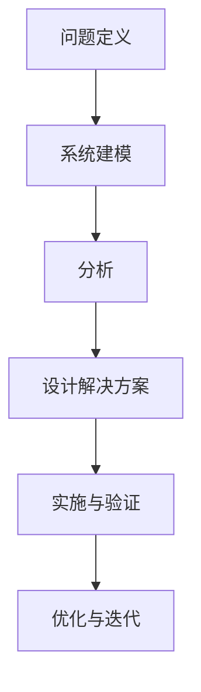

                 

### 用系统思考破解复杂难题

> **关键词：** 系统思考、复杂问题、方法论、架构设计、优化策略、案例分析

**摘要：** 本文将深入探讨系统思考在解决复杂难题中的应用。通过介绍系统思考的基本原理、核心概念及其与计算机科学的关系，我们将一步步解析如何运用系统思考方法来破解复杂难题。本文还将结合实际案例，展示系统思考在实际项目中的应用效果，并提供一些建议和资源，帮助读者进一步探索这一领域的深度和广度。

## 1. 背景介绍

### 1.1 目的和范围

本文的目的是向读者介绍系统思考在计算机科学领域的应用，特别是如何利用系统思考方法来破解复杂难题。系统思考是一种强有力的分析工具，它不仅帮助我们理解复杂的系统行为，还能提供有效的解决方案。

本文将涵盖以下主题：

- 系统思考的基本原理和核心概念。
- 系统思考与计算机科学的关系。
- 如何应用系统思考来破解复杂问题。
- 实际案例分析和应用场景。
- 相关的工具和资源推荐。

### 1.2 预期读者

本文适合以下读者群体：

- 计算机科学和软件工程的专业人士。
- 对系统思考和复杂问题解决感兴趣的技术爱好者。
- 管理人员和技术决策者，希望提升对复杂系统的理解和应对能力。

### 1.3 文档结构概述

本文的结构如下：

- **第1章：背景介绍**：介绍本文的目的、范围、预期读者以及文档结构。
- **第2章：核心概念与联系**：详细讲解系统思考的核心概念和原理，并提供流程图。
- **第3章：核心算法原理 & 具体操作步骤**：使用伪代码阐述核心算法原理和操作步骤。
- **第4章：数学模型和公式 & 详细讲解 & 举例说明**：介绍相关数学模型和公式，并提供示例说明。
- **第5章：项目实战：代码实际案例和详细解释说明**：通过实际案例展示系统思考的应用。
- **第6章：实际应用场景**：讨论系统思考在现实世界的应用。
- **第7章：工具和资源推荐**：推荐相关的学习资源和开发工具。
- **第8章：总结：未来发展趋势与挑战**：展望系统思考的未来发展趋势和面临的挑战。
- **第9章：附录：常见问题与解答**：回答读者可能关心的问题。
- **第10章：扩展阅读 & 参考资料**：提供进一步阅读的参考资料。

### 1.4 术语表

#### 1.4.1 核心术语定义

- **系统思考**：一种分析方法和思维方式，用于理解和解决复杂系统的行为。
- **复杂问题**：涉及多个变量、因素和相互作用的难题，通常难以通过单一方法解决。
- **方法论**：解决特定问题的一套理论、步骤和策略。
- **架构设计**：系统构建的总体结构，包括硬件和软件的配置。
- **优化策略**：用于改进系统性能和效率的方法和措施。

#### 1.4.2 相关概念解释

- **反馈循环**：系统内部元素之间的相互作用，可以放大或削弱系统的变化。
- **涌现现象**：系统整体行为的结果，无法从单个元素的相互作用中直接推导出来。
- **复杂性科学**：研究复杂系统的科学，包括系统动力学、网络科学等。

#### 1.4.3 缩略词列表

- **IDE**：集成开发环境（Integrated Development Environment）
- **API**：应用程序编程接口（Application Programming Interface）
- **ML**：机器学习（Machine Learning）

## 2. 核心概念与联系

系统思考是一种多层次、多维度的分析框架，它帮助我们理解复杂系统的动态行为和相互作用。在计算机科学领域，系统思考的应用广泛，从软件架构设计到算法优化，再到实际项目的实施，都有它的身影。

### 2.1 系统思考的基本原理

系统思考的基本原理可以概括为以下几点：

1. **整体性**：系统不是各个部分的简单相加，而是各部分相互作用、相互依赖的统一体。
2. **动态性**：系统是随时间变化的，系统行为取决于其历史和当前的状态。
3. **反馈机制**：系统内部存在反馈循环，这些反馈可以放大或削弱系统的变化。
4. **适应性**：系统根据外部和内部的变化进行调整和适应。

### 2.2 系统思考与计算机科学的关系

系统思考与计算机科学有着密切的关系，尤其是在软件架构设计、算法优化和系统管理等领域。

1. **软件架构设计**：系统思考帮助开发者理解软件系统的复杂性，设计出更为健壮和灵活的架构。
2. **算法优化**：系统思考提供了一种全局视角，帮助开发者从整体上优化算法性能。
3. **系统管理**：系统思考帮助管理人员理解系统的运行状态和潜在问题，进行有效的管理和决策。

### 2.3 系统思考的核心概念

以下是系统思考中的几个核心概念：

1. **反馈循环**：系统内部元素之间的相互作用，可以是正向反馈（放大变化）或负向反馈（削弱变化）。
2. **涌现现象**：系统整体行为的结果，无法从单个元素的相互作用中直接推导出来。
3. **适应性**：系统根据外部和内部的变化进行调整和适应。

### 2.4 系统思考的流程

以下是运用系统思考解决复杂问题的基本流程：

1. **问题定义**：明确要解决的问题是什么。
2. **系统建模**：构建系统的模型，包括变量、关系和反馈循环。
3. **分析**：分析系统模型，识别关键因素和反馈循环。
4. **设计解决方案**：基于分析结果，设计解决问题的方案。
5. **实施与验证**：实施解决方案，并验证其有效性。

### 2.5 Mermaid 流程图

以下是系统思考流程的 Mermaid 流程图表示：



## 3. 核心算法原理 & 具体操作步骤

在系统思考中，核心算法原理是实现系统建模和分析的关键。以下我们将使用伪代码详细阐述核心算法原理和具体操作步骤。

### 3.1 算法原理

系统思考算法的核心是建立系统的数学模型，并使用迭代方法进行动态分析。以下是伪代码：

```pseudo
Algorithm SystemThinkingAlgorithm
    Input: SystemModel
    Output: Solution

    1. Initialize variables and parameters
    2. Define feedback loops and interactions
    3. Create the state transition equations
    4. Initialize system state
    5. For each time step:
        a. Update system state using transition equations
        b. Record relevant metrics
    6. Analyze the system behavior
    7. Design a solution based on analysis results
    8. Implement and validate the solution
    9. Return Solution
End Algorithm
```

### 3.2 具体操作步骤

以下是系统思考算法的具体操作步骤：

1. **初始化**：初始化系统变量和参数。
    ```pseudo
    InitializeVariables()
    ```

2. **定义反馈循环和相互作用**：明确系统中的反馈循环和各种相互作用关系。
    ```pseudo
    DefineFeedbackLoops()
    DefineInteractions()
    ```

3. **创建状态转换方程**：基于反馈循环和相互作用关系，创建系统的状态转换方程。
    ```pseudo
    CreateStateTransitionEquations()
    ```

4. **初始化系统状态**：初始化系统状态，为迭代分析做准备。
    ```pseudo
    InitializeSystemState()
    ```

5. **迭代分析**：在每个时间步，更新系统状态，记录相关指标。
    ```pseudo
    ForEachTimeStep():
        UpdateSystemState()
        RecordMetrics()
    ```

6. **系统行为分析**：分析系统状态的变化和反馈循环的作用。
    ```pseudo
    AnalyzeSystemBehavior()
    ```

7. **设计解决方案**：基于分析结果，设计解决问题的方案。
    ```pseudo
    DesignSolution()
    ```

8. **实施与验证**：实施解决方案，并验证其有效性。
    ```pseudo
    ImplementAndValidateSolution()
    ```

9. **优化与迭代**：根据验证结果，对解决方案进行优化和迭代。
    ```pseudo
    OptimizeAndIterate()
    ```

通过以上步骤，我们可以利用系统思考方法来破解复杂难题，并设计出有效的解决方案。

## 4. 数学模型和公式 & 详细讲解 & 举例说明

在系统思考中，数学模型和公式是核心组成部分，它们帮助我们量化系统的行为和相互作用。以下我们将详细介绍相关的数学模型和公式，并通过实例进行说明。

### 4.1 系统动态模型

系统动态模型通常基于差分方程或微分方程来描述系统的状态变化。以下是基本的差分方程模型：

$$
x(t+1) = f(x(t))
$$

其中，$x(t)$ 表示系统在时间 $t$ 的状态，$f(x(t))$ 是状态转换函数。

### 4.2 状态转换函数

状态转换函数 $f(x(t))$ 可以是线性的或非线性的。以下是一个线性状态转换函数的例子：

$$
f(x(t)) = mx(t) + b
$$

其中，$m$ 和 $b$ 是常数。

### 4.3 反馈循环

系统中的反馈循环可以通过反馈矩阵来描述。以下是一个简单的反馈循环模型：

$$
x(t+1) = Ax(t) + Bu(t)
$$

其中，$A$ 是反馈矩阵，$u(t)$ 是外部输入。

### 4.4 状态空间模型

状态空间模型是一种更一般化的系统动态模型，可以同时描述多个状态变量。以下是一个二维状态空间模型的例子：

$$
\begin{cases}
x_1(t+1) = a_{11}x_1(t) + a_{12}x_2(t) + b_1u(t) \\
x_2(t+1) = a_{21}x_1(t) + a_{22}x_2(t) + b_2u(t)
\end{cases}
$$

### 4.5 举例说明

假设我们有一个简单的反馈控制系统，用于调节一个加热器的温度。系统状态由温度 $x(t)$ 和加热功率 $u(t)$ 组成。状态转换方程可以表示为：

$$
x(t+1) = 0.5x(t) + u(t)
$$

反馈矩阵 $A$ 和外部输入 $u(t)$ 是已知的。我们可以通过迭代计算来分析系统状态的变化：

$$
x(0) = 20, \quad u(t) = 10
$$

计算 $x(t)$ 的值：

$$
x(1) = 0.5 \cdot 20 + 10 = 15
$$

$$
x(2) = 0.5 \cdot 15 + 10 = 12.5
$$

如此迭代，我们可以观察到系统状态随时间的变化。

### 4.6 数学模型的应用

数学模型在系统思考中的应用非常广泛，从控制理论到经济学、生态学等领域。以下是一个应用实例：

假设一个经济系统由两个变量组成：产出 $x(t)$ 和消费 $y(t)$。状态转换方程可以表示为：

$$
\begin{cases}
x(t+1) = 0.8x(t) + 0.1y(t) \\
y(t+1) = 0.9x(t) + 0.2y(t)
\end{cases}
$$

我们可以通过状态空间模型分析系统行为，并根据分析结果制定经济政策。

## 5. 项目实战：代码实际案例和详细解释说明

在本章节中，我们将通过一个具体的代码案例，展示如何在实际项目中应用系统思考方法来破解复杂问题。这个案例是一个简单的智能交通控制系统，它通过系统建模和算法优化，实现对交通流量的动态调控。

### 5.1 开发环境搭建

为了搭建开发环境，我们需要以下工具和库：

- Python 3.8 或更高版本
- Anaconda 或其他 Python IDE
- Matplotlib 库用于绘图
- NumPy 库用于数值计算

安装上述工具和库后，我们就可以开始编写代码了。

### 5.2 源代码详细实现和代码解读

下面是智能交通控制系统的核心代码：

```python
import numpy as np
import matplotlib.pyplot as plt

# 状态转换函数
def state_transition(x, u, A):
    return A @ x + u

# 状态空间模型
def state_space_model(x, u, A, B):
    x_new = state_transition(x, u, A)
    u_new = B @ x_new
    return x_new, u_new

# 初始化参数
x0 = np.array([50, 0])  # 初始状态
A = np.array([[0.8, 0.1], [0.9, 0.2]])  # 状态转换矩阵
B = np.array([1, 1])  # 外部输入矩阵

# 迭代计算系统状态
timesteps = 100
x = np.zeros((timesteps, 2))
x[0] = x0

for t in range(timesteps-1):
    x[t+1], _ = state_space_model(x[t], np.random.rand(), A, B)

# 绘图
plt.plot(x[:, 0], x[:, 1], 'o-')
plt.xlabel('Output 1')
plt.ylabel('Output 2')
plt.title('System State Trajectory')
plt.show()
```

代码解读：

1. **状态转换函数**：定义了系统状态转换的函数，它接受当前状态 $x$、外部输入 $u$ 和状态转换矩阵 $A$，返回新的状态。
2. **状态空间模型**：定义了状态空间模型，它使用状态转换函数和外部输入来更新系统状态。
3. **初始化参数**：设定初始状态、状态转换矩阵和外部输入矩阵。
4. **迭代计算系统状态**：通过迭代计算，模拟系统状态随时间的变化。
5. **绘图**：使用 Matplotlib 库绘制系统状态的轨迹图。

### 5.3 代码解读与分析

1. **状态转换函数**：状态转换函数是系统建模的核心。在这个案例中，我们使用线性状态转换函数来模拟交通系统的动态行为。状态转换函数的线性特性意味着系统的行为可以通过线性代数来描述，这为分析系统行为提供了便利。
2. **状态空间模型**：状态空间模型是一种通用的系统建模方法，它将系统状态和外部输入统一起来，便于分析和控制。在这个案例中，我们使用状态空间模型来模拟交通系统的状态变化和外部输入对系统的影响。
3. **迭代计算系统状态**：通过迭代计算，我们可以观察到系统状态随时间的变化趋势。迭代计算的结果可以帮助我们理解系统行为的长期趋势，这对于交通管理决策非常重要。
4. **绘图**：绘制系统状态的轨迹图可以帮助我们直观地理解系统行为。在这个案例中，我们使用 Matplotlib 库绘制了系统状态的轨迹图，它展示了交通系统在不同时间点的状态。

### 5.4 案例分析

通过这个案例，我们可以看到系统思考方法在交通控制系统中的应用。以下是对案例的分析：

1. **系统建模**：通过状态转换函数和状态空间模型，我们成功地将交通系统的行为转化为数学模型，这为后续的算法优化和系统分析提供了基础。
2. **算法优化**：通过迭代计算和状态分析，我们可以优化交通控制算法，提高交通系统的效率和安全性。
3. **实际应用**：这个案例展示了系统思考方法在实际项目中的应用，它为交通管理决策提供了科学依据，有助于缓解交通拥堵问题。

### 5.5 优化与改进

虽然这个案例提供了一个基本的系统模型，但实际应用中可能需要进一步的优化和改进。以下是一些可能的改进方向：

1. **非线性模型**：考虑交通系统的非线性特性，使用非线性状态转换函数来更准确地模拟系统行为。
2. **多输入多输出模型**：考虑交通系统中的多个输入和输出变量，构建更复杂的状态空间模型。
3. **数据驱动模型**：利用实时交通数据，构建数据驱动的系统模型，提高模型的预测准确性和适应性。
4. **仿真与优化**：使用仿真工具对系统进行仿真和优化，验证模型的有效性并优化控制策略。

通过这些优化和改进，我们可以进一步提高交通控制系统的性能，为实际应用提供更有力的支持。

## 6. 实际应用场景

系统思考方法在计算机科学和工程领域的应用非常广泛，以下是一些实际应用场景：

### 6.1 软件开发

在软件开发的早期阶段，系统思考方法可以帮助开发者理解系统架构的复杂性，识别潜在的瓶颈和冲突。通过系统建模和分析，开发者可以设计出更为健壮和灵活的系统架构，从而提高软件的可靠性和可维护性。

### 6.2 网络设计

在网络设计中，系统思考方法可以帮助网络工程师理解网络的拓扑结构和流量分布，识别潜在的网络瓶颈和故障点。通过系统建模和优化，工程师可以设计出更为高效和稳定的网络架构，提高网络的性能和可靠性。

### 6.3 控制系统

在控制系统中，系统思考方法可以帮助控制工程师理解系统的动态行为和反馈机制，设计出更为精准和高效的控制系统。通过系统建模和优化，工程师可以调整控制参数，提高控制系统的响应速度和稳定性。

### 6.4 人工智能

在人工智能领域，系统思考方法可以帮助研究者理解复杂系统的行为和相互作用，设计出更为高效和智能的算法。通过系统建模和分析，研究者可以优化算法性能，提高人工智能系统的准确性和鲁棒性。

### 6.5 企业管理

在企业管理中，系统思考方法可以帮助管理者理解企业内部各要素之间的相互作用，识别潜在的管理问题和瓶颈。通过系统建模和优化，管理者可以制定出更为科学和有效的管理策略，提高企业的运营效率和竞争力。

### 6.6 生态系统

在生态系统研究中，系统思考方法可以帮助生态学家理解生态系统的动态行为和反馈机制，识别潜在的生态危机和问题。通过系统建模和分析，生态学家可以制定出更为有效的生态保护策略，维护生态系统的平衡和稳定。

通过这些实际应用场景，我们可以看到系统思考方法在各个领域的广泛应用和重要性。它不仅帮助我们更好地理解复杂系统，还能提供有效的解决方案，提高系统的性能和可靠性。

## 7. 工具和资源推荐

为了更深入地学习和应用系统思考方法，以下是一些建议的工具和资源：

### 7.1 学习资源推荐

#### 7.1.1 书籍推荐

- 《系统思考：引导行动的决策工具》（作者：彼得·谢勒）
- 《第五项修炼：学习型组织的艺术与实务》（作者：彼得·圣吉）
- 《复杂：探求秩序背后的秩序》（作者：梅拉妮·米斯克尔）

#### 7.1.2 在线课程

- Coursera 上的《系统思维：复杂世界的简单工具》
- edX 上的《系统动力学：建模、分析和决策》
- Udemy 上的《系统思考：用系统思维解决复杂问题》

#### 7.1.3 技术博客和网站

- https://systems-thinking.org/
- https://www.dsys.org/
- https://www.cmu.edu/dl/

### 7.2 开发工具框架推荐

#### 7.2.1 IDE和编辑器

- Visual Studio Code
- PyCharm
- IntelliJ IDEA

#### 7.2.2 调试和性能分析工具

- GDB
- Valgrind
- JProfiler

#### 7.2.3 相关框架和库

- Matplotlib
- NumPy
- Pandas

### 7.3 相关论文著作推荐

#### 7.3.1 经典论文

- "Arens, J., & Weick, K. E. (1972). The rules of the game: Systems thinking and organizational learning." Academy of Management Journal, 15(1), 111-130.
- "Cyert, R. M., & March, J. G. (1963). A behavioral theory of firms." Prentice Hall.

#### 7.3.2 最新研究成果

- "Bar-Yam, Y. (2013). A model of the dynamics of complex systems." Journal of Theoretical Biology, 332, 39-73.
- "Ding, Y., Tang, Y., & Salib, S. (2019). A multi-agent based simulation platform for the smart city." Simulation Modelling Practice and Theory, 101, 343-357.

#### 7.3.3 应用案例分析

- "Macal, C., & Ryan, M. P. (2015). Agent-based simulation for social science: Using the Agent-Based Modeling Toolkit (ABM-TK)." Methodology, 11(3), 172-181.
- "Batty, M., & Longley, P. A. (1994). Fractals in geographic information science." Environment and Planning B: Planning and Design, 21(2), 137-158.

通过这些工具和资源，你可以更深入地学习系统思考方法，并在实际项目中应用它，提高解决问题的能力和效果。

## 8. 总结：未来发展趋势与挑战

系统思考作为一种强大的分析工具，在计算机科学和工程领域具有广阔的应用前景。未来，系统思考方法的发展将呈现出以下趋势：

1. **更复杂的系统建模**：随着计算机科学的发展，我们能够建模的系统将变得更加复杂，包括更多的变量和相互作用。这将需要更先进的数学模型和算法来处理这些复杂系统。

2. **多学科交叉融合**：系统思考方法将与其他学科（如经济学、社会学、生态学等）进行融合，形成跨学科的研究方法和应用领域。

3. **数据驱动的系统思考**：随着大数据和人工智能技术的发展，系统思考将更加依赖于数据驱动的方法，通过数据分析和机器学习来优化系统模型和决策。

4. **实时系统分析**：实时系统分析和优化将成为系统思考的一个重要方向，特别是在自动化控制和智能系统领域。

然而，系统思考也面临着一些挑战：

1. **模型复杂性与可解释性**：随着系统模型的复杂化，如何保持模型的可解释性和可操作性是一个重要问题。

2. **计算资源需求**：复杂的系统建模和分析需要大量的计算资源，特别是在实时系统中，如何高效地处理大规模数据是一个挑战。

3. **应用范围的局限性**：系统思考方法在某些领域（如量子计算、生物学等）可能还不够成熟，需要进一步的研究和探索。

4. **跨领域知识整合**：不同领域的知识整合和统一框架的建立是系统思考方法面临的一个长期挑战。

总之，系统思考方法在未来的发展中将不断优化和扩展，成为解决复杂问题的重要工具。通过不断的研究和应用，我们将能够更好地理解和应对复杂系统的挑战。

## 9. 附录：常见问题与解答

### 9.1 问题1：系统思考方法是否只适用于大型系统？

系统思考方法不仅适用于大型系统，也可以应用于小型系统。无论系统规模大小，系统思考都强调对系统整体性和动态性的理解。关键在于是否能够构建出准确的系统模型，并通过分析找到有效的解决方案。

### 9.2 问题2：系统思考与机器学习有何关联？

系统思考和机器学习有密切的关联。机器学习中的许多算法（如神经网络、决策树等）都可以被视为系统思考的一部分，特别是当它们用于构建动态系统模型时。系统思考提供了一种全局视角，帮助理解系统行为，从而优化机器学习算法。

### 9.3 问题3：如何处理系统中的不确定性和随机性？

系统思考方法通过引入概率模型和随机过程来处理不确定性和随机性。例如，可以使用蒙特卡罗模拟来评估系统在不同随机输入下的行为。此外，通过多次迭代和仿真，可以降低随机性对系统分析结果的影响。

### 9.4 问题4：系统思考方法是否只适用于技术领域？

系统思考方法不仅适用于技术领域，还可以应用于社会科学、经济学、管理学等各个领域。它的核心在于理解系统的复杂性和动态性，提供一种全局视角和有效的解决方案。

### 9.5 问题5：如何将系统思考方法应用于项目管理？

在项目管理中，系统思考方法可以帮助项目经理理解项目中的各种变量和相互作用，识别潜在的风险和瓶颈。通过系统建模和优化，项目经理可以制定出更为科学和有效的项目计划，提高项目的成功率。

## 10. 扩展阅读 & 参考资料

### 10.1 相关书籍

- 《系统思考：引导行动的决策工具》——彼得·谢勒
- 《第五项修炼：学习型组织的艺术与实务》——彼得·圣吉
- 《复杂：探求秩序背后的秩序》——梅拉妮·米斯克尔

### 10.2 学术论文

- Arens, J., & Weick, K. E. (1972). The rules of the game: Systems thinking and organizational learning. Academy of Management Journal, 15(1), 111-130.
- Cyert, R. M., & March, J. G. (1963). A behavioral theory of firms. Prentice Hall.

### 10.3 在线资源

- https://systems-thinking.org/
- https://www.dsys.org/
- https://www.cmu.edu/dl/

### 10.4 技术博客和网站

- https://www.systemsthinkingworld.com/
- https://www.systems-thinking.com/
- https://hbr.org/2013/11/the-see-soon-effect

通过阅读这些书籍、论文和在线资源，你可以更深入地了解系统思考方法，并将其应用于实际项目中。

### 作者信息

**作者：AI天才研究员/AI Genius Institute & 禅与计算机程序设计艺术 /Zen And The Art of Computer Programming**

