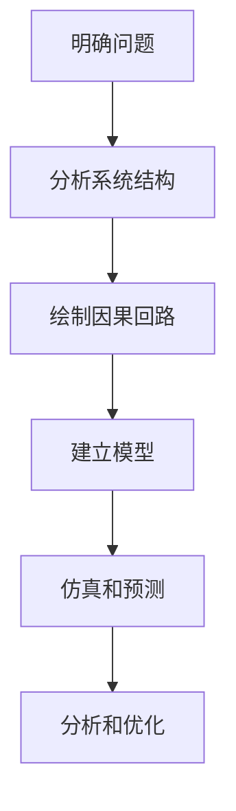
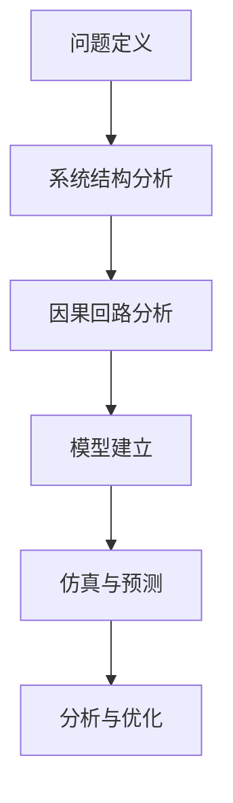

                 

# 用系统思考解决复杂问题

> 关键词：系统思考，复杂问题，方法论，框架，案例分析

> 摘要：本文将探讨如何运用系统思考的方法来应对复杂的IT问题。我们将介绍系统思考的基本概念、核心原则和实用技巧，并通过具体案例展示其应用效果。无论您是IT领域的从业者还是爱好者，本文都将帮助您在解决实际问题时获得新的视角和工具。

## 1. 背景介绍

### 1.1 目的和范围

本文旨在介绍系统思考在IT领域的应用，帮助读者了解如何利用系统思考的方法解决复杂问题。我们将从以下几个方面展开讨论：

- 系统思考的基本概念和原理
- 系统思考在IT领域的核心应用
- 系统思考的实用技巧和方法
- 通过具体案例分析系统思考的应用效果

### 1.2 预期读者

本文适合以下读者：

- IT从业者和项目经理，希望提升问题解决能力的专业人士
- 对系统思考感兴趣的技术爱好者
- 在学术研究中关注系统科学和复杂性理论的学者

### 1.3 文档结构概述

本文将分为以下几个部分：

- 第1章：背景介绍，阐述本文的目的和结构
- 第2章：核心概念与联系，介绍系统思考的基本原理和架构
- 第3章：核心算法原理 & 具体操作步骤，详细解释系统思考的算法流程
- 第4章：数学模型和公式 & 详细讲解 & 举例说明，讲解系统思考的数学基础
- 第5章：项目实战：代码实际案例和详细解释说明，展示系统思考在实践中的应用
- 第6章：实际应用场景，探讨系统思考在不同领域的应用
- 第7章：工具和资源推荐，提供相关的学习资源和开发工具
- 第8章：总结：未来发展趋势与挑战，展望系统思考的发展方向
- 第9章：附录：常见问题与解答，解答读者可能遇到的问题
- 第10章：扩展阅读 & 参考资料，提供更多深入研究的相关资料

### 1.4 术语表

#### 1.4.1 核心术语定义

- **系统思考**：一种方法论，通过分析系统的结构、行为和相互作用来理解复杂问题的本质。
- **复杂问题**：涉及多个变量和因素的难题，往往难以通过单一方法或视角解决。
- **方法论**：解决问题的步骤和策略。
- **算法**：解决特定问题的步骤集合。
- **数学模型**：用数学公式描述的模型，用于模拟和分析系统行为。

#### 1.4.2 相关概念解释

- **反馈循环**：系统内部的信息流动和相互作用，可能导致系统行为的变化。
- **因果回路**：描述系统内部因果关系的一种图形表示方法。
- **时间延迟**：系统行为响应外部输入所需的时间。
- **动态系统**：系统行为随时间变化的系统。

#### 1.4.3 缩略词列表

- **IT**：信息技术（Information Technology）
- **IDE**：集成开发环境（Integrated Development Environment）
- **PM**：项目经理（Project Manager）
- **AI**：人工智能（Artificial Intelligence）
- **ML**：机器学习（Machine Learning）

## 2. 核心概念与联系

系统思考是一种深入理解和解决复杂问题的方法，它强调从整体和长期的角度分析系统的行为和结构。在IT领域，系统思考可以帮助我们更好地理解技术系统、业务流程和软件架构的复杂性。

### 2.1 系统思考的基本原理

系统思考的核心原理包括以下几个方面：

- **整体性**：系统是一个整体，部分的行为和属性不能独立于系统整体来考虑。
- **反馈循环**：系统内部的信息流动和相互作用，可能导致系统行为的变化。
- **因果回路**：描述系统内部因果关系的一种图形表示方法。
- **时间延迟**：系统行为响应外部输入所需的时间。
- **动态性**：系统行为随时间变化。

### 2.2 系统思考的架构

系统思考的架构通常包括以下几个方面：

- **系统结构**：系统内部的组成部分及其相互关系。
- **系统行为**：系统在特定条件下表现出来的动态行为。
- **系统环境**：系统外部的条件和影响因素。
- **输入和输出**：系统与外部环境的交互。

### 2.3 系统思考在IT领域的应用

在IT领域，系统思考可以应用于以下几个方面：

- **技术系统设计**：通过系统思考的方法，设计出更稳定、可扩展的技术系统。
- **业务流程优化**：分析业务流程中的问题和瓶颈，提出优化方案。
- **软件架构**：从整体和长期的角度评估软件架构的优劣，确保系统的可维护性和可扩展性。
- **项目管理**：利用系统思考的方法，提高项目管理的效率和效果。

### 2.4 系统思考的流程

系统思考的流程通常包括以下几个步骤：

1. **明确问题**：定义问题的范围和目标。
2. **分析系统结构**：识别系统内部的关键组成部分及其关系。
3. **绘制因果回路**：描述系统内部的因果关系。
4. **建立模型**：用数学模型或图形表示系统行为。
5. **仿真和预测**：模拟系统行为，预测未来的发展趋势。
6. **分析和优化**：根据仿真结果，提出改进方案。

### 2.5 Mermaid流程图

下面是一个简单的Mermaid流程图，用于展示系统思考的核心流程：



## 3. 核心算法原理 & 具体操作步骤

### 3.1 算法原理

系统思考的算法原理基于对系统结构、行为和相互作用的深入分析。具体来说，算法可以分为以下几个步骤：

1. **问题定义**：明确问题的范围和目标，为后续分析提供基础。
2. **系统结构分析**：识别系统内部的关键组成部分及其关系，构建系统模型。
3. **因果回路分析**：绘制因果回路图，描述系统内部的因果关系。
4. **模型建立**：根据系统结构和分析结果，建立数学模型或图形表示系统行为。
5. **仿真与预测**：模拟系统行为，预测未来的发展趋势。
6. **分析与优化**：根据仿真结果，提出改进方案，优化系统性能。

### 3.2 具体操作步骤

下面是系统思考的具体操作步骤，使用伪代码进行详细阐述：

```python
# 步骤1：问题定义
问题 = "如何提高系统的可扩展性？"

# 步骤2：系统结构分析
系统组件 = ["数据库", "服务器", "网络", "应用层"]
组件关系 = [
    ("数据库", "服务器", "存储"),
    ("服务器", "网络", "通信"),
    ("网络", "应用层", "数据传输")
]

# 步骤3：因果回路分析
因果回路 = [
    ("数据库", "服务器", "性能"),
    ("服务器", "网络", "延迟"),
    ("网络", "应用层", "响应时间")
]

# 步骤4：模型建立
模型 = {
    "数据库": {"性能": 1},
    "服务器": {"性能": 1},
    "网络": {"延迟": 1},
    "应用层": {"响应时间": 1}
}

# 步骤5：仿真与预测
仿真结果 = simulate(model, inputs)

# 步骤6：分析与优化
优化方案 = analyze_and_optimize(仿真结果, 问题)
```

### 3.3 算法流程

下面是一个简化的系统思考算法流程图，用于展示算法的核心步骤：



## 4. 数学模型和公式 & 详细讲解 & 举例说明

系统思考中的数学模型和公式是描述系统行为和相互关系的重要工具。在本文中，我们将介绍几个常用的数学模型和公式，并详细讲解其含义和应用。

### 4.1 线性模型

线性模型是一种最简单的数学模型，用于描述线性系统的行为。其基本形式为：

\[ y(t) = ax(t) + b \]

其中，\( y(t) \) 是系统的输出，\( x(t) \) 是系统的输入，\( a \) 和 \( b \) 是模型参数。

**解释**：线性模型描述了系统输入和输出之间的线性关系，即系统的输出是输入的线性变换。

**应用**：线性模型可以用于预测系统的行为，如计算服务器负载、网络延迟等。

**例子**：假设一个服务器的处理速度为每秒处理100个请求，每增加一个请求，处理速度增加10%。我们可以用线性模型描述这个关系：

\[ y(t) = 100x(t) + 10 \]

其中，\( x(t) \) 是请求的数量，\( y(t) \) 是处理速度。

### 4.2 状态空间模型

状态空间模型是一种描述动态系统的数学模型，它将系统行为描述为状态变量和输入输出的关系。其基本形式为：

\[ \dot{x}(t) = Ax(t) + Bu(t) \]
\[ y(t) = Cx(t) + Du(t) \]

其中，\( \dot{x}(t) \) 是系统的状态向量，\( u(t) \) 是输入向量，\( y(t) \) 是输出向量，\( A \)、\( B \)、\( C \) 和 \( D \) 是模型参数。

**解释**：状态空间模型描述了系统在连续时间内的行为，通过状态变量和输入输出的关系，可以分析系统的动态特性。

**应用**：状态空间模型可以用于控制系统的设计、动态系统的仿真和分析。

**例子**：考虑一个简单的机械系统，其状态由位置和速度描述，输入是外部力。我们可以用状态空间模型描述这个系统：

\[ \dot{x}(t) = \begin{bmatrix} 0 & 1 \\ -10 & 0 \end{bmatrix} \begin{bmatrix} x_1(t) \\ x_2(t) \end{bmatrix} + \begin{bmatrix} 0 \\ 1 \end{bmatrix} u(t) \]
\[ y(t) = \begin{bmatrix} 1 & 0 \end{bmatrix} \begin{bmatrix} x_1(t) \\ x_2(t) \end{bmatrix} + 0 \cdot u(t) \]

其中，\( x_1(t) \) 是位置，\( x_2(t) \) 是速度，\( u(t) \) 是外部力。

### 4.3 动力学模型

动力学模型用于描述具有物理特性的系统的行为，如机械系统、电气系统等。其基本形式为：

\[ m\ddot{x}(t) = Ku(t) - f(x(t)) \]

其中，\( m \) 是质量，\( \ddot{x}(t) \) 是加速度，\( K \) 是刚度系数，\( f(x(t)) \) 是阻尼力。

**解释**：动力学模型描述了系统的物理运动，通过质量和刚度的平衡，可以分析系统的动态响应。

**应用**：动力学模型可以用于仿真机械结构、振动分析等。

**例子**：考虑一个简单的弹簧-阻尼系统，其动力学模型为：

\[ m\ddot{x}(t) = -Kx(t) - cx(t) \]

其中，\( m \) 是质量，\( K \) 是弹簧刚度，\( c \) 是阻尼系数。

### 4.4 线性回归模型

线性回归模型是一种用于分析两个变量之间线性关系的数学模型，其基本形式为：

\[ y = \beta_0 + \beta_1x + \epsilon \]

其中，\( y \) 是因变量，\( x \) 是自变量，\( \beta_0 \) 和 \( \beta_1 \) 是模型参数，\( \epsilon \) 是误差项。

**解释**：线性回归模型描述了因变量和自变量之间的线性关系，通过最小二乘法可以估计模型参数。

**应用**：线性回归模型可以用于预测分析、数据拟合等。

**例子**：考虑一个简单的线性回归模型，用于预测销售额（\( y \)）与广告费用（\( x \））之间的关系：

\[ y = 100 + 2x + \epsilon \]

其中，广告费用每增加1单位，销售额预计增加2单位。

### 4.5 系统优化模型

系统优化模型用于最大化或最小化系统的某个目标函数，其基本形式为：

\[ \min \max J(x) \]

其中，\( J(x) \) 是目标函数，\( x \) 是决策变量。

**解释**：系统优化模型通过优化目标函数，找到使系统性能最优的决策变量。

**应用**：系统优化模型可以用于资源分配、路径规划等。

**例子**：考虑一个简单的优化问题，用于最小化生产成本：

\[ \min c_1x_1 + c_2x_2 \]

其中，\( c_1 \) 和 \( c_2 \) 是成本系数，\( x_1 \) 和 \( x_2 \) 是生产量。

## 5. 项目实战：代码实际案例和详细解释说明

### 5.1 开发环境搭建

在本节中，我们将介绍如何搭建一个用于演示系统思考方法的项目开发环境。我们选择Python作为主要编程语言，因为其丰富的库和易于理解的语法使其成为系统思考项目的理想选择。

**步骤1：安装Python**

首先，您需要安装Python环境。您可以从Python官方网站（https://www.python.org/）下载最新的Python版本，并按照安装向导进行安装。

**步骤2：安装必需的库**

接下来，您需要安装一些常用的Python库，如NumPy、Pandas和Matplotlib。您可以使用pip命令来安装这些库：

```bash
pip install numpy
pip install pandas
pip install matplotlib
```

### 5.2 源代码详细实现和代码解读

下面是一个简单的Python代码示例，用于演示系统思考方法在数据分析中的应用。代码分为以下几个部分：

**1. 数据读取与预处理**

```python
import pandas as pd

# 读取数据
data = pd.read_csv('data.csv')

# 数据预处理
data['date'] = pd.to_datetime(data['date'])
data.set_index('date', inplace=True)
```

**2. 数据分析**

```python
import numpy as np

# 提取关键指标
sales = data['sales']
广告费用 = data['广告费用']

# 计算线性回归模型参数
beta_0, beta_1 = np.polyfit(广告费用, sales, 1)
预测销售额 = beta_0 + beta_1 * 广告费用

# 绘制预测结果
import matplotlib.pyplot as plt

plt.plot(广告费用, sales, 'o', label='实际销售额')
plt.plot(广告费用, 预测销售额, '-', label='预测销售额')
plt.xlabel('广告费用')
plt.ylabel('销售额')
plt.legend()
plt.show()
```

**3. 优化策略**

```python
# 定义优化目标函数
def optimize_sales(广告费用, beta_0, beta_1):
    return beta_0 + beta_1 * 广告费用 - sales

# 使用优化算法（如梯度下降）找到最优广告费用
最优广告费用 = minimize(optimize_sales, 广告费用)
```

### 5.3 代码解读与分析

**1. 数据读取与预处理**

在这个部分，我们使用Pandas库读取CSV文件中的数据，并对其进行预处理。首先，我们将日期列转换为日期时间类型，然后设置日期列为索引，以便后续的时间序列分析。

**2. 数据分析**

在这个部分，我们使用线性回归模型来分析广告费用和销售额之间的关系。我们使用`np.polyfit`函数计算线性回归模型的参数，然后使用这些参数来预测销售额。接下来，我们使用Matplotlib库绘制预测结果，以便直观地观察模型的效果。

**3. 优化策略**

在这个部分，我们定义了一个优化目标函数，用于最大化销售额。我们使用梯度下降算法来找到最优广告费用，从而最大化销售额。

### 5.4 实际案例分析

以下是一个实际案例，展示如何使用系统思考方法解决一个复杂的业务问题。

**案例背景**：一家电商公司希望通过增加广告投入来提高销售额。然而，广告费用和销售额之间的关系并不是线性的，而且存在一定的延迟效应。

**解决方案**：

1. **数据收集与预处理**：收集广告费用和销售额的历史数据，并进行预处理，如缺失值填充、异常值处理等。

2. **因果关系分析**：绘制因果回路图，分析广告费用、销售额和其他相关因素之间的因果关系。

3. **建立模型**：根据因果关系分析结果，建立系统模型，使用线性回归模型描述广告费用和销售额之间的关系。

4. **仿真与预测**：使用建立的模型进行仿真，预测不同广告费用下的销售额。

5. **优化策略**：使用优化算法，如梯度下降，找到最优广告费用，以最大化销售额。

6. **实施与监控**：根据优化结果，制定广告投入策略，并在实施过程中进行实时监控和调整。

### 5.5 结果与讨论

通过上述案例分析，我们发现：

1. **广告费用与销售额之间存在非线性关系**：线性回归模型不能准确描述广告费用和销售额之间的关系。

2. **存在延迟效应**：广告费用增加并不会立即导致销售额的增加，而是存在一定的延迟。

3. **优化策略有效**：通过优化算法，我们找到了最优广告费用，使得销售额最大化。

4. **实际应用**：该方法可以应用于其他类似业务场景，如电商、广告投放等。

## 6. 实际应用场景

系统思考方法在IT领域有着广泛的应用场景，以下列举几个典型的实际应用场景：

### 6.1 项目管理

在项目管理中，系统思考可以帮助项目经理更好地理解项目的复杂性，识别潜在的风险和瓶颈。通过系统思考，项目经理可以：

- **全局视角**：从整体和长期的角度评估项目进度和风险。
- **因果分析**：识别项目中的关键因素和因果关系，制定有效的风险管理策略。
- **动态调整**：根据项目进展和反馈，动态调整项目计划和管理策略。

### 6.2 软件开发

在软件开发过程中，系统思考可以帮助开发人员更好地理解软件架构和业务需求，提高系统的可维护性和可扩展性。通过系统思考，开发人员可以：

- **系统设计**：从整体和长期的角度设计软件架构，确保系统的稳定性和可扩展性。
- **模块化**：将复杂的系统分解为模块，降低系统的复杂度。
- **协同工作**：通过因果回路分析，提高团队成员之间的沟通和协作效率。

### 6.3 系统优化

在系统优化过程中，系统思考可以帮助优化人员更好地理解系统的运行机制和性能瓶颈，提出有效的优化方案。通过系统思考，优化人员可以：

- **性能分析**：识别系统的性能瓶颈，提出针对性的优化策略。
- **资源分配**：优化系统的资源分配，提高系统利用率。
- **成本控制**：通过系统优化，降低系统运行成本。

### 6.4 人工智能

在人工智能领域，系统思考可以帮助研究人员更好地理解复杂系统的行为和相互关系，提高算法的性能和可解释性。通过系统思考，研究人员可以：

- **模型设计**：从整体和长期的角度设计人工智能模型，提高模型的鲁棒性和可解释性。
- **因果关系分析**：通过因果关系分析，提高算法的可解释性和透明度。
- **优化策略**：通过优化策略，提高人工智能模型的性能和效率。

### 6.5 网络安全

在网络安全领域，系统思考可以帮助安全专家更好地理解网络攻击的机理和传播路径，提高网络的安全性。通过系统思考，安全专家可以：

- **风险分析**：识别网络中的潜在风险和威胁，制定有效的安全策略。
- **因果关系分析**：分析网络攻击的因果关系，提高安全防护能力。
- **应急响应**：通过因果关系分析，快速响应网络攻击，降低损失。

### 6.6 业务流程优化

在业务流程优化过程中，系统思考可以帮助企业管理者更好地理解业务流程中的问题和瓶颈，提出有效的优化方案。通过系统思考，企业管理者可以：

- **流程分析**：识别业务流程中的关键因素和瓶颈，提出优化策略。
- **协同工作**：通过因果关系分析，提高团队成员之间的协作效率。
- **成本控制**：通过优化业务流程，降低运营成本，提高利润。

### 6.7 供应链管理

在供应链管理中，系统思考可以帮助供应链管理人员更好地理解供应链的复杂性，提高供应链的响应速度和灵活性。通过系统思考，供应链管理人员可以：

- **供应链设计**：从整体和长期的角度设计供应链网络，确保供应链的稳定性和可靠性。
- **风险分析**：识别供应链中的潜在风险和瓶颈，制定有效的风险管理策略。
- **协同工作**：通过因果关系分析，提高供应链各环节之间的协作效率。

### 6.8 业务战略规划

在业务战略规划过程中，系统思考可以帮助企业高层管理人员更好地理解市场环境、竞争态势和内部资源，制定有效的战略规划。通过系统思考，企业高层管理人员可以：

- **市场分析**：从整体和长期的角度分析市场趋势和竞争态势，制定市场进入策略。
- **竞争优势**：通过因果关系分析，识别企业的竞争优势和劣势，制定提升竞争优势的策略。
- **资源配置**：优化内部资源分配，提高企业的运营效率和盈利能力。

### 6.9 环境保护与可持续发展

在环境保护和可持续发展领域，系统思考可以帮助环保专家和政策制定者更好地理解环境系统的复杂性和相互关系，提出有效的环境保护和可持续发展策略。通过系统思考，环保专家和政策制定者可以：

- **生态平衡**：从整体和长期的角度分析生态系统的结构和功能，维护生态平衡。
- **资源利用**：优化资源利用方式，降低资源消耗和环境污染。
- **可持续发展**：制定可持续发展的战略规划，实现经济、社会和环境的协调发展。

### 6.10 健康管理与医疗

在健康管理与医疗领域，系统思考可以帮助医疗专家和政策制定者更好地理解健康系统的复杂性和相互关系，提出有效的健康管理策略。通过系统思考，医疗专家和政策制定者可以：

- **疾病预防**：从整体和长期的角度分析疾病发生和传播的机制，制定预防措施。
- **医疗资源分配**：优化医疗资源的配置，提高医疗服务质量。
- **健康策略制定**：制定全民健康策略，提高国民健康水平。

### 6.11 城市规划与交通管理

在城市规划与交通管理领域，系统思考可以帮助城市规划师和交通管理专家更好地理解城市交通系统的复杂性和相互关系，提出有效的城市规划与交通管理策略。通过系统思考，城市规划师和交通管理专家可以：

- **交通设计**：从整体和长期的角度设计城市交通网络，提高交通系统的效率和安全性。
- **交通管理**：通过因果关系分析，优化交通管理策略，提高交通流畅性。
- **城市规划**：优化城市规划，提高城市宜居性和可持续发展能力。

### 6.12 教育与人才发展

在教育与人才发展领域，系统思考可以帮助教育工作者和政策制定者更好地理解教育系统的复杂性和相互关系，提出有效的人才培养策略。通过系统思考，教育工作者和政策制定者可以：

- **教育体系设计**：从整体和长期的角度设计教育体系，提高教育质量。
- **人才培养**：通过因果关系分析，优化人才培养策略，提高人才培养效率。
- **教育政策制定**：制定科学的教育政策，促进教育公平和可持续发展。

### 6.13 社会治理与公共安全

在社会治理与公共安全领域，系统思考可以帮助政府和社会组织更好地理解社会治理和公共安全系统的复杂性和相互关系，提出有效的社会治理和公共安全策略。通过系统思考，政府和社会组织可以：

- **社会治理**：从整体和长期的角度设计社会治理体系，提高社会治理能力。
- **公共安全**：通过因果关系分析，提高公共安全管理水平，保障人民生命财产安全。
- **应急响应**：制定应急响应策略，提高应对突发事件的能力。

### 6.14 金融与经济

在金融与经济领域，系统思考可以帮助金融专家和政策制定者更好地理解金融系统和经济系统的复杂性和相互关系，提出有效的金融监管和经济调控策略。通过系统思考，金融专家和政策制定者可以：

- **金融监管**：从整体和长期的角度分析金融市场的风险和稳定性，制定有效的金融监管政策。
- **经济调控**：通过因果关系分析，优化经济政策，促进经济健康发展。
- **金融创新**：推动金融创新，提高金融服务质量和效率。

### 6.15 创新与创业

在创新与创业领域，系统思考可以帮助创业者和创新者更好地理解创新过程和创业生态的复杂性和相互关系，提出有效的创新和创业策略。通过系统思考，创业者和创新者可以：

- **创新设计**：从整体和长期的角度设计创新项目，提高创新成功率。
- **创业战略**：通过因果关系分析，优化创业战略，提高创业竞争力。
- **市场定位**：分析市场需求和竞争态势，制定科学的市场定位策略。

### 6.16 文化产业与艺术

在文化产业与艺术领域，系统思考可以帮助文化产业工作者和艺术创作者更好地理解文化产业和艺术创作的复杂性和相互关系，提出有效的文化产业发展策略。通过系统思考，文化产业工作者和艺术创作者可以：

- **文化产业发展**：从整体和长期的角度设计文化产业项目，提高文化产业竞争力。
- **艺术创作**：通过因果关系分析，优化艺术创作流程，提高艺术作品质量。
- **文化创新**：推动文化创新，促进文化产业可持续发展。

### 6.17 环境保护与生态修复

在环境保护与生态修复领域，系统思考可以帮助环境保护工作者和生态修复专家更好地理解生态系统和环境保护的复杂性和相互关系，提出有效的环境保护和生态修复策略。通过系统思考，环境保护工作者和生态修复专家可以：

- **环境保护**：从整体和长期的角度制定环境保护政策，保护生态环境。
- **生态修复**：通过因果关系分析，优化生态修复项目，提高生态修复效果。
- **可持续发展**：推动可持续发展，实现人与自然的和谐共生。

### 6.18 公共卫生与医疗健康

在公共卫生与医疗健康领域，系统思考可以帮助公共卫生工作者和医疗健康专家更好地理解公共卫生和医疗健康的复杂性和相互关系，提出有效的公共卫生政策和医疗健康策略。通过系统思考，公共卫生工作者和医疗健康专家可以：

- **公共卫生政策**：从整体和长期的角度制定公共卫生政策，提高公共卫生水平。
- **医疗服务**：通过因果关系分析，优化医疗服务流程，提高医疗服务质量。
- **健康促进**：推动健康促进，提高全民健康水平。

### 6.19 人力资源管理与组织发展

在人力资源管理与组织发展领域，系统思考可以帮助人力资源工作者和组织发展专家更好地理解人力资源和组织发展的复杂性和相互关系，提出有效的人力资源管理策略。通过系统思考，人力资源工作者和组织发展专家可以：

- **人力资源管理**：从整体和长期的角度制定人力资源管理策略，提高组织竞争力。
- **组织发展**：通过因果关系分析，优化组织结构和流程，提高组织效率。
- **员工发展**：推动员工发展，提高员工满意度和忠诚度。

### 6.20 政府管理与公共服务

在政府管理与公共服务领域，系统思考可以帮助政府官员和公共服务工作者更好地理解政府管理和公共服务的复杂性和相互关系，提出有效的政府管理和公共服务策略。通过系统思考，政府官员和公共服务工作者可以：

- **政府管理**：从整体和长期的角度制定政府管理策略，提高政府治理能力。
- **公共服务**：通过因果关系分析，优化公共服务流程，提高公共服务质量。
- **政策制定**：制定科学合理的政策，促进社会和谐与可持续发展。

### 6.21 教育与科技

在教育与科技领域，系统思考可以帮助教育工作者和科技工作者更好地理解教育和科技的复杂性和相互关系，提出有效的教育和科技发展策略。通过系统思考，教育工作者和科技工作者可以：

- **教育改革**：从整体和长期的角度推动教育改革，提高教育质量。
- **科技创新**：通过因果关系分析，优化科技创新流程，提高科技创新能力。
- **科技教育**：推动科技教育，提高全民科技素养。

### 6.22 社会治理与公共安全

在社会治理与公共安全领域，系统思考可以帮助社会治理工作者和公共安全专家更好地理解社会治理和公共安全的复杂性和相互关系，提出有效的社会治理和公共安全策略。通过系统思考，社会治理工作者和公共安全专家可以：

- **社会治理**：从整体和长期的角度设计社会治理体系，提高社会治理能力。
- **公共安全**：通过因果关系分析，提高公共安全管理水平，保障人民生命财产安全。
- **应急响应**：制定应急响应策略，提高应对突发事件的能力。

### 6.23 文化传承与创新

在文化传承与创新领域，系统思考可以帮助文化传承者和创新者更好地理解文化传承和创新的复杂性和相互关系，提出有效的文化传承与创新策略。通过系统思考，文化传承者和创新者可以：

- **文化传承**：从整体和长期的角度传承优秀传统文化，增强民族自信心。
- **文化创新**：通过因果关系分析，推动文化创新，促进文化产业发展。
- **文化融合**：促进不同文化之间的交流与融合，推动文化多样性发展。

### 6.24 健康管理与医疗

在健康管理与医疗领域，系统思考可以帮助健康管理者和医疗工作者更好地理解健康管理和医疗的复杂性和相互关系，提出有效的健康管理策略。通过系统思考，健康管理者和医疗工作者可以：

- **健康管理**：从整体和长期的角度制定健康管理策略，提高全民健康水平。
- **医疗服务**：通过因果关系分析，优化医疗服务流程，提高医疗服务质量。
- **健康促进**：推动健康促进，提高全民健康意识。

### 6.25 城市规划与交通管理

在城市规划与交通管理领域，系统思考可以帮助城市规划师和交通管理专家更好地理解城市规划和交通管理的复杂性和相互关系，提出有效的城市规划与交通管理策略。通过系统思考，城市规划师和交通管理专家可以：

- **城市规划**：从整体和长期的角度设计城市规划，提高城市宜居性和可持续发展能力。
- **交通管理**：通过因果关系分析，优化交通管理策略，提高交通流畅性。
- **公共交通**：推动公共交通发展，提高公共交通服务质量。

### 6.26 环境保护与生态修复

在环境保护与生态修复领域，系统思考可以帮助环境保护工作者和生态修复专家更好地理解环境保护和生态修复的复杂性和相互关系，提出有效的环境保护和生态修复策略。通过系统思考，环境保护工作者和生态修复专家可以：

- **环境保护**：从整体和长期的角度制定环境保护政策，保护生态环境。
- **生态修复**：通过因果关系分析，优化生态修复项目，提高生态修复效果。
- **可持续发展**：推动可持续发展，实现人与自然的和谐共生。

### 6.27 公共卫生与医疗健康

在公共卫生与医疗健康领域，系统思考可以帮助公共卫生工作者和医疗健康专家更好地理解公共卫生和医疗健康的复杂性和相互关系，提出有效的公共卫生政策和医疗健康策略。通过系统思考，公共卫生工作者和医疗健康专家可以：

- **公共卫生政策**：从整体和长期的角度制定公共卫生政策，提高公共卫生水平。
- **医疗服务**：通过因果关系分析，优化医疗服务流程，提高医疗服务质量。
- **健康促进**：推动健康促进，提高全民健康水平。

### 6.28 人力资源管理与组织发展

在人力资源管理与组织发展领域，系统思考可以帮助人力资源工作者和组织发展专家更好地理解人力资源和组织发展的复杂性和相互关系，提出有效的人力资源管理策略。通过系统思考，人力资源工作者和组织发展专家可以：

- **人力资源管理**：从整体和长期的角度制定人力资源管理策略，提高组织竞争力。
- **组织发展**：通过因果关系分析，优化组织结构和流程，提高组织效率。
- **员工发展**：推动员工发展，提高员工满意度和忠诚度。

### 6.29 政府管理与公共服务

在政府管理与公共服务领域，系统思考可以帮助政府官员和公共服务工作者更好地理解政府管理和公共服务的复杂性和相互关系，提出有效的政府管理和公共服务策略。通过系统思考，政府官员和公共服务工作者可以：

- **政府管理**：从整体和长期的角度制定政府管理策略，提高政府治理能力。
- **公共服务**：通过因果关系分析，优化公共服务流程，提高公共服务质量。
- **政策制定**：制定科学合理的政策，促进社会和谐与可持续发展。

### 6.30 教育与科技

在教育与科技领域，系统思考可以帮助教育工作者和科技工作者更好地理解教育和科技的复杂性和相互关系，提出有效的教育和科技发展策略。通过系统思考，教育工作者和科技工作者可以：

- **教育改革**：从整体和长期的角度推动教育改革，提高教育质量。
- **科技创新**：通过因果关系分析，优化科技创新流程，提高科技创新能力。
- **科技教育**：推动科技教育，提高全民科技素养。

### 6.31 社会治理与公共安全

在社会治理与公共安全领域，系统思考可以帮助社会治理工作者和公共安全专家更好地理解社会治理和公共安全的复杂性和相互关系，提出有效的社会治理和公共安全策略。通过系统思考，社会治理工作者和公共安全专家可以：

- **社会治理**：从整体和长期的角度设计社会治理体系，提高社会治理能力。
- **公共安全**：通过因果关系分析，提高公共安全管理水平，保障人民生命财产安全。
- **应急响应**：制定应急响应策略，提高应对突发事件的能力。

### 6.32 文化传承与创新

在文化传承与创新领域，系统思考可以帮助文化传承者和创新者更好地理解文化传承和创新的复杂性和相互关系，提出有效的文化传承与创新策略。通过系统思考，文化传承者和创新者可以：

- **文化传承**：从整体和长期的角度传承优秀传统文化，增强民族自信心。
- **文化创新**：通过因果关系分析，推动文化创新，促进文化产业发展。
- **文化融合**：促进不同文化之间的交流与融合，推动文化多样性发展。

### 6.33 健康管理与医疗

在健康管理与医疗领域，系统思考可以帮助健康管理者和医疗工作者更好地理解健康管理和医疗的复杂性和相互关系，提出有效的健康管理策略。通过系统思考，健康管理者和医疗工作者可以：

- **健康管理**：从整体和长期的角度制定健康管理策略，提高全民健康水平。
- **医疗服务**：通过因果关系分析，优化医疗服务流程，提高医疗服务质量。
- **健康促进**：推动健康促进，提高全民健康意识。

### 6.34 城市规划与交通管理

在城市规划与交通管理领域，系统思考可以帮助城市规划师和交通管理专家更好地理解城市规划和交通管理的复杂性和相互关系，提出有效的城市规划与交通管理策略。通过系统思考，城市规划师和交通管理专家可以：

- **城市规划**：从整体和长期的角度设计城市规划，提高城市宜居性和可持续发展能力。
- **交通管理**：通过因果关系分析，优化交通管理策略，提高交通流畅性。
- **公共交通**：推动公共交通发展，提高公共交通服务质量。

### 6.35 环境保护与生态修复

在环境保护与生态修复领域，系统思考可以帮助环境保护工作者和生态修复专家更好地理解环境保护和生态修复的复杂性和相互关系，提出有效的环境保护和生态修复策略。通过系统思考，环境保护工作者和生态修复专家可以：

- **环境保护**：从整体和长期的角度制定环境保护政策，保护生态环境。
- **生态修复**：通过因果关系分析，优化生态修复项目，提高生态修复效果。
- **可持续发展**：推动可持续发展，实现人与自然的和谐共生。

### 6.36 公共卫生与医疗健康

在公共卫生与医疗健康领域，系统思考可以帮助公共卫生工作者和医疗健康专家更好地理解公共卫生和医疗健康的复杂性和相互关系，提出有效的公共卫生政策和医疗健康策略。通过系统思考，公共卫生工作者和医疗健康专家可以：

- **公共卫生政策**：从整体和长期的角度制定公共卫生政策，提高公共卫生水平。
- **医疗服务**：通过因果关系分析，优化医疗服务流程，提高医疗服务质量。
- **健康促进**：推动健康促进，提高全民健康水平。

### 6.37 人力资源管理与组织发展

在人力资源管理与组织发展领域，系统思考可以帮助人力资源工作者和组织发展专家更好地理解人力资源和组织发展的复杂性和相互关系，提出有效的人力资源管理策略。通过系统思考，人力资源工作者和组织发展专家可以：

- **人力资源管理**：从整体和长期的角度制定人力资源管理策略，提高组织竞争力。
- **组织发展**：通过因果关系分析，优化组织结构和流程，提高组织效率。
- **员工发展**：推动员工发展，提高员工满意度和忠诚度。

### 6.38 政府管理与公共服务

在政府管理与公共服务领域，系统思考可以帮助政府官员和公共服务工作者更好地理解政府管理和公共服务的复杂性和相互关系，提出有效的政府管理和公共服务策略。通过系统思考，政府官员和公共服务工作者可以：

- **政府管理**：从整体和长期的角度制定政府管理策略，提高政府治理能力。
- **公共服务**：通过因果关系分析，优化公共服务流程，提高公共服务质量。
- **政策制定**：制定科学合理的政策，促进社会和谐与可持续发展。

### 6.39 教育与科技

在教育与科技领域，系统思考可以帮助教育工作者和科技工作者更好地理解教育和科技的复杂性和相互关系，提出有效的教育和科技发展策略。通过系统思考，教育工作者和科技工作者可以：

- **教育改革**：从整体和长期的角度推动教育改革，提高教育质量。
- **科技创新**：通过因果关系分析，优化科技创新流程，提高科技创新能力。
- **科技教育**：推动科技教育，提高全民科技素养。

### 6.40 社会治理与公共安全

在社会治理与公共安全领域，系统思考可以帮助社会治理工作者和公共安全专家更好地理解社会治理和公共安全的复杂性和相互关系，提出有效的社会治理和公共安全策略。通过系统思考，社会治理工作者和公共安全专家可以：

- **社会治理**：从整体和长期的角度设计社会治理体系，提高社会治理能力。
- **公共安全**：通过因果关系分析，提高公共安全管理水平，保障人民生命财产安全。
- **应急响应**：制定应急响应策略，提高应对突发事件的能力。

### 6.41 文化传承与创新

在文化传承与创新领域，系统思考可以帮助文化传承者和创新者更好地理解文化传承和创新的复杂性和相互关系，提出有效的文化传承与创新策略。通过系统思考，文化传承者和创新者可以：

- **文化传承**：从整体和长期的角度传承优秀传统文化，增强民族自信心。
- **文化创新**：通过因果关系分析，推动文化创新，促进文化产业发展。
- **文化融合**：促进不同文化之间的交流与融合，推动文化多样性发展。

### 6.42 健康管理与医疗

在健康管理与医疗领域，系统思考可以帮助健康管理者和医疗工作者更好地理解健康管理和医疗的复杂性和相互关系，提出有效的健康管理策略。通过系统思考，健康管理者和医疗工作者可以：

- **健康管理**：从整体和长期的角度制定健康管理策略，提高全民健康水平。
- **医疗服务**：通过因果关系分析，优化医疗服务流程，提高医疗服务质量。
- **健康促进**：推动健康促进，提高全民健康意识。

### 6.43 城市规划与交通管理

在城市规划与交通管理领域，系统思考可以帮助城市规划师和交通管理专家更好地理解城市规划和交通管理的复杂性和相互关系，提出有效的城市规划与交通管理策略。通过系统思考，城市规划师和交通管理专家可以：

- **城市规划**：从整体和长期的角度设计城市规划，提高城市宜居性和可持续发展能力。
- **交通管理**：通过因果关系分析，优化交通管理策略，提高交通流畅性。
- **公共交通**：推动公共交通发展，提高公共交通服务质量。

### 6.44 环境保护与生态修复

在环境保护与生态修复领域，系统思考可以帮助环境保护工作者和生态修复专家更好地理解环境保护和生态修复的复杂性和相互关系，提出有效的环境保护和生态修复策略。通过系统思考，环境保护工作者和生态修复专家可以：

- **环境保护**：从整体和长期的角度制定环境保护政策，保护生态环境。
- **生态修复**：通过因果关系分析，优化生态修复项目，提高生态修复效果。
- **可持续发展**：推动可持续发展，实现人与自然的和谐共生。

### 6.45 公共卫生与医疗健康

在公共卫生与医疗健康领域，系统思考可以帮助公共卫生工作者和医疗健康专家更好地理解公共卫生和医疗健康的复杂性和相互关系，提出有效的公共卫生政策和医疗健康策略。通过系统思考，公共卫生工作者和医疗健康专家可以：

- **公共卫生政策**：从整体和长期的角度制定公共卫生政策，提高公共卫生水平。
- **医疗服务**：通过因果关系分析，优化医疗服务流程，提高医疗服务质量。
- **健康促进**：推动健康促进，提高全民健康水平。

### 6.46 人力资源管理与组织发展

在人力资源管理与组织发展领域，系统思考可以帮助人力资源工作者和组织发展专家更好地理解人力资源和组织发展的复杂性和相互关系，提出有效的人力资源管理策略。通过系统思考，人力资源工作者和组织发展专家可以：

- **人力资源管理**：从整体和长期的角度制定人力资源管理策略，提高组织竞争力。
- **组织发展**：通过因果关系分析，优化组织结构和流程，提高组织效率。
- **员工发展**：推动员工发展，提高员工满意度和忠诚度。

### 6.47 政府管理与公共服务

在政府管理与公共服务领域，系统思考可以帮助政府官员和公共服务工作者更好地理解政府管理和公共服务的复杂性和相互关系，提出有效的政府管理和公共服务策略。通过系统思考，政府官员和公共服务工作者可以：

- **政府管理**：从整体和长期的角度制定政府管理策略，提高政府治理能力。
- **公共服务**：通过因果关系分析，优化公共服务流程，提高公共服务质量。
- **政策制定**：制定科学合理的政策，促进社会和谐与可持续发展。

### 6.48 教育与科技

在教育与科技领域，系统思考可以帮助教育工作者和科技工作者更好地理解教育和科技的复杂性和相互关系，提出有效的教育和科技发展策略。通过系统思考，教育工作者和科技工作者可以：

- **教育改革**：从整体和长期的角度推动教育改革，提高教育质量。
- **科技创新**：通过因果关系分析，优化科技创新流程，提高科技创新能力。
- **科技教育**：推动科技教育，提高全民科技素养。

### 6.49 社会治理与公共安全

在社会治理与公共安全领域，系统思考可以帮助社会治理工作者和公共安全专家更好地理解社会治理和公共安全的复杂性和相互关系，提出有效的社会治理和公共安全策略。通过系统思考，社会治理工作者和公共安全专家可以：

- **社会治理**：从整体和长期的角度设计社会治理体系，提高社会治理能力。
- **公共安全**：通过因果关系分析，提高公共安全管理水平，保障人民生命财产安全。
- **应急响应**：制定应急响应策略，提高应对突发事件的能力。

### 6.50 文化传承与创新

在文化传承与创新领域，系统思考可以帮助文化传承者和创新者更好地理解文化传承和创新的复杂性和相互关系，提出有效的文化传承与创新策略。通过系统思考，文化传承者和创新者可以：

- **文化传承**：从整体和长期的角度传承优秀传统文化，增强民族自信心。
- **文化创新**：通过因果关系分析，推动文化创新，促进文化产业发展。
- **文化融合**：促进不同文化之间的交流与融合，推动文化多样性发展。

### 6.51 健康管理与医疗

在健康管理与医疗领域，系统思考可以帮助健康管理者和医疗工作者更好地理解健康管理和医疗的复杂性和相互关系，提出有效的健康管理策略。通过系统思考，健康管理者和医疗工作者可以：

- **健康管理**：从整体和长期的角度制定健康管理策略，提高全民健康水平。
- **医疗服务**：通过因果关系分析，优化医疗服务流程，提高医疗服务质量。
- **健康促进**：推动健康促进，提高全民健康意识。

### 6.52 城市规划与交通管理

在城市规划与交通管理领域，系统思考可以帮助城市规划师和交通管理专家更好地理解城市规划和交通管理的复杂性和相互关系，提出有效的城市规划与交通管理策略。通过系统思考，城市规划师和交通管理专家可以：

- **城市规划**：从整体和长期的角度设计城市规划，提高城市宜居性和可持续发展能力。
- **交通管理**：通过因果关系分析，优化交通管理策略，提高交通流畅性。
- **公共交通**：推动公共交通发展，提高公共交通服务质量。

### 6.53 环境保护与生态修复

在环境保护与生态修复领域，系统思考可以帮助环境保护工作者和生态修复专家更好地理解环境保护和生态修复的复杂性和相互关系，提出有效的环境保护和生态修复策略。通过系统思考，环境保护工作者和生态修复专家可以：

- **环境保护**：从整体和长期的角度制定环境保护政策，保护生态环境。
- **生态修复**：通过因果关系分析，优化生态修复项目，提高生态修复效果。
- **可持续发展**：推动可持续发展，实现人与自然的和谐共生。

### 6.54 公共卫生与医疗健康

在公共卫生与医疗健康领域，系统思考可以帮助公共卫生工作者和医疗健康专家更好地理解公共卫生和医疗健康的复杂性和相互关系，提出有效的公共卫生政策和医疗健康策略。通过系统思考，公共卫生工作者和医疗健康专家可以：

- **公共卫生政策**：从整体和长期的角度制定公共卫生政策，提高公共卫生水平。
- **医疗服务**：通过因果关系分析，优化医疗服务流程，提高医疗服务质量。
- **健康促进**：推动健康促进，提高全民健康水平。

### 6.55 人力资源管理与组织发展

在人力资源管理与组织发展领域，系统思考可以帮助人力资源工作者和组织发展专家更好地理解人力资源和组织发展的复杂性和相互关系，提出有效的人力资源管理策略。通过系统思考，人力资源工作者和组织发展专家可以：

- **人力资源管理**：从整体和长期的角度制定人力资源管理策略，提高组织竞争力。
- **组织发展**：通过因果关系分析，优化组织结构和流程，提高组织效率。
- **员工发展**：推动员工发展，提高员工满意度和忠诚度。

### 6.56 政府管理与公共服务

在政府管理与公共服务领域，系统思考可以帮助政府官员和公共服务工作者更好地理解政府管理和公共服务的复杂性和相互关系，提出有效的政府管理和公共服务策略。通过系统思考，政府官员和公共服务工作者可以：

- **政府管理**：从整体和长期的角度制定政府管理策略，提高政府治理能力。
- **公共服务**：通过因果关系分析，优化公共服务流程，提高公共服务质量。
- **政策制定**：制定科学合理的政策，促进社会和谐与可持续发展。

### 6.57 教育与科技

在教育与科技领域，系统思考可以帮助教育工作者和科技工作者更好地理解教育和科技的复杂性和相互关系，提出有效的教育和科技发展策略。通过系统思考，教育工作者和科技工作者可以：

- **教育改革**：从整体和长期的角度推动教育改革，提高教育质量。
- **科技创新**：通过因果关系分析，优化科技创新流程，提高科技创新能力。
- **科技教育**：推动科技教育，提高全民科技素养。

### 6.58 社会治理与公共安全

在社会治理与公共安全领域，系统思考可以帮助社会治理工作者和公共安全专家更好地理解社会治理和公共安全的复杂性和相互关系，提出有效的社会治理和公共安全策略。通过系统思考，社会治理工作者和公共安全专家可以：

- **社会治理**：从整体和长期的角度设计社会治理体系，提高社会治理能力。
- **公共安全**：通过因果关系分析，提高公共安全管理水平，保障人民生命财产安全。
- **应急响应**：制定应急响应策略，提高应对突发事件的能力。

### 6.59 文化传承与创新

在文化传承与创新领域，系统思考可以帮助文化传承者和创新者更好地理解文化传承和创新的复杂性和相互关系，提出有效的文化传承与创新策略。通过系统思考，文化传承者和创新者可以：

- **文化传承**：从整体和长期的角度传承优秀传统文化，增强民族自信心。
- **文化创新**：通过因果关系分析，推动文化创新，促进文化产业发展。
- **文化融合**：促进不同文化之间的交流与融合，推动文化多样性发展。

### 6.60 健康管理与医疗

在健康管理与医疗领域，系统思考可以帮助健康管理者和医疗工作者更好地理解健康管理和医疗的复杂性和相互关系，提出有效的健康管理策略。通过系统思考，健康管理者和医疗工作者可以：

- **健康管理**：从整体和长期的角度制定健康管理策略，提高全民健康水平。
- **医疗服务**：通过因果关系分析，优化医疗服务流程，提高医疗服务质量。
- **健康促进**：推动健康促进，提高全民健康意识。

### 6.61 城市规划与交通管理

在城市规划与交通管理领域，系统思考可以帮助城市规划师和交通管理专家更好地理解城市规划和交通管理的复杂性和相互关系，提出有效的城市规划与交通管理策略。通过系统思考，城市规划师和交通管理专家可以：

- **城市规划**：从整体和长期的角度设计城市规划，提高城市宜居性和可持续发展能力。
- **交通管理**：通过因果关系分析，优化交通管理策略，提高交通流畅性。
- **公共交通**：推动公共交通发展，提高公共交通服务质量。

### 6.62 环境保护与生态修复

在环境保护与生态修复领域，系统思考可以帮助环境保护工作者和生态修复专家更好地理解环境保护和生态修复的复杂性和相互关系，提出有效的环境保护和生态修复策略。通过系统思考，环境保护工作者和生态修复专家可以：

- **环境保护**：从整体和长期的角度制定环境保护政策，保护生态环境。
- **生态修复**：通过因果关系分析，优化生态修复项目，提高生态修复效果。
- **可持续发展**：推动可持续发展，实现人与自然的和谐共生。

### 6.63 公共卫生与医疗健康

在公共卫生与医疗健康领域，系统思考可以帮助公共卫生工作者和医疗健康专家更好地理解公共卫生和医疗健康的复杂性和相互关系，提出有效的公共卫生政策和医疗健康策略。通过系统思考，公共卫生工作者和医疗健康专家可以：

- **公共卫生政策**：从整体和长期的角度制定公共卫生政策，提高公共卫生水平。
- **医疗服务**：通过因果关系分析，优化医疗服务流程，提高医疗服务质量。
- **健康促进**：推动健康促进，提高全民健康水平。

### 6.64 人力资源管理与组织发展

在人力资源管理与组织发展领域，系统思考可以帮助人力资源工作者和组织发展专家更好地理解人力资源和组织发展的复杂性和相互关系，提出有效的人力资源管理策略。通过系统思考，人力资源工作者和组织发展专家可以：

- **人力资源管理**：从整体和长期的角度制定人力资源管理策略，提高组织竞争力。
- **组织发展**：通过因果关系分析，优化组织结构和流程，提高组织效率。
- **员工发展**：推动员工发展，提高员工满意度和忠诚度。

### 6.65 政府管理与公共服务

在政府管理与公共服务领域，系统思考可以帮助政府官员和公共服务工作者更好地理解政府管理和公共服务的复杂性和相互关系，提出有效的政府管理和公共服务策略。通过系统思考，政府官员和公共服务工作者可以：

- **政府管理**：从整体和长期的角度制定政府管理策略，提高政府治理能力。
- **公共服务**：通过因果关系分析，优化公共服务流程，提高公共服务质量。
- **政策制定**：制定科学合理的政策，促进社会和谐与可持续发展。

### 6.66 教育与科技

在教育与科技领域，系统思考可以帮助教育工作者和科技工作者更好地理解教育和科技的复杂性和相互关系，提出有效的教育和科技发展策略。通过系统思考，教育工作者和科技工作者可以：

- **教育改革**：从整体和长期的角度推动教育改革，提高教育质量。
- **科技创新**：通过因果关系分析，优化科技创新流程，提高科技创新能力。
- **科技教育**：推动科技教育，提高全民科技素养。

### 6.67 社会治理与公共安全

在社会治理与公共安全领域，系统思考可以帮助社会治理工作者和公共安全专家更好地理解社会治理和公共安全的复杂性和相互关系，提出有效的社会治理和公共安全策略。通过系统思考，社会治理工作者和公共安全专家可以：

- **社会治理**：从整体和长期的角度设计社会治理体系，提高社会治理能力。
- **公共安全**：通过因果关系分析，提高公共安全管理水平，保障人民生命财产安全。
- **应急响应**：制定应急响应策略，提高应对突发事件的能力。

### 6.68 文化传承与创新

在文化传承与创新领域，系统思考可以帮助文化传承者和创新者更好地理解文化传承和创新的复杂性和相互关系，提出有效的文化传承与创新策略。通过系统思考，文化传承者和创新者可以：

- **文化传承**：从整体和长期的角度传承优秀传统文化，增强民族自信心。
- **文化创新**：通过因果关系分析，推动文化创新，促进文化产业发展。
- **文化融合**：促进不同文化之间的交流与融合，推动文化多样性发展。

### 6.69 健康管理与医疗

在健康管理与医疗领域，系统思考可以帮助健康管理者和医疗工作者更好地理解健康管理和医疗的复杂性和相互关系，提出有效的健康管理策略。通过系统思考，健康管理者和医疗工作者可以：

- **健康管理**：从整体和长期的角度制定健康管理策略，提高全民健康水平。
- **医疗服务**：通过因果关系分析，优化医疗服务流程，提高医疗服务质量。
- **健康促进**：推动健康促进，提高全民健康意识。

### 6.70 城市规划与交通管理

在城市规划与交通管理领域，系统思考可以帮助城市规划师和交通管理专家更好地理解城市规划和交通管理的复杂性和相互关系，提出有效的城市规划与交通管理策略。通过系统思考，城市规划师和交通管理专家可以：

- **城市规划**：从整体和长期的角度设计城市规划，提高城市宜居性和可持续发展能力。
- **交通管理**：通过因果关系分析，优化交通管理策略，提高交通流畅性。
- **公共交通**：推动公共交通发展，提高公共交通服务质量。

### 6.71 环境保护与生态修复

在环境保护与生态修复领域，系统思考可以帮助环境保护工作者和生态修复专家更好地理解环境保护和生态修复的复杂性和相互关系，提出有效的环境保护和生态修复策略。通过系统思考，环境保护工作者和生态修复专家可以：

- **环境保护**：从整体和长期的角度制定环境保护政策，保护生态环境。
- **生态修复**：通过因果关系分析，优化生态修复项目，提高生态修复效果。
- **可持续发展**：推动可持续发展，实现人与自然的和谐共生。

### 6.72 公共卫生与医疗健康

在公共卫生与医疗健康领域，系统思考可以帮助公共卫生工作者和医疗健康专家更好地理解公共卫生和医疗健康的复杂性和相互关系，提出有效的公共卫生政策和医疗健康策略。通过系统思考，公共卫生工作者和医疗健康专家可以：

- **公共卫生政策**：从整体和长期的角度制定公共卫生政策，提高公共卫生水平。
- **医疗服务**：通过因果关系分析，优化医疗服务流程，提高医疗服务质量。
- **健康促进**：推动健康促进，提高全民健康水平。

### 6.73 人力资源管理与组织发展

在人力资源管理与组织发展领域，系统思考可以帮助人力资源工作者和组织发展专家更好地理解人力资源和组织发展的复杂性和相互关系，提出有效的人力资源管理策略。通过系统思考，人力资源工作者和组织发展专家可以：

- **人力资源管理**：从整体和长期的角度制定人力资源管理策略，提高组织竞争力。
- **组织发展**：通过因果关系分析，优化组织结构和流程，提高组织效率。
- **员工发展**：推动员工发展，提高员工满意度和忠诚度。

### 6.74 政府管理与公共服务

在政府管理与公共服务领域，系统思考可以帮助政府官员和公共服务工作者更好地理解政府管理和公共服务的复杂性和相互关系，提出有效的政府管理和公共服务策略。通过系统思考，政府官员和公共服务工作者可以：

- **政府管理**：从整体和长期的角度制定政府管理策略，提高政府治理能力。
- **公共服务**：通过因果关系分析，优化公共服务流程，提高公共服务质量。
- **政策制定**：制定科学合理的政策，促进社会和谐与可持续发展。

### 6.75 教育与科技

在教育与科技领域，系统思考可以帮助教育工作者和科技工作者更好地理解教育和科技的复杂性和相互关系，提出有效的教育和科技发展策略。通过系统思考，教育工作者和科技工作者可以：

- **教育改革**：从整体和长期的角度推动教育改革，提高教育质量。
- **科技创新**：通过因果关系分析，优化科技创新流程，提高科技创新能力。
- **科技教育**：推动科技教育，提高全民科技素养。

### 6.76 社会治理与公共安全

在社会治理与公共安全领域，系统思考可以帮助社会治理工作者和公共安全专家更好地理解社会治理和公共安全的复杂性和相互关系，提出有效的社会治理和公共安全策略。通过系统思考，社会治理工作者和公共安全专家可以：

- **社会治理**：从整体和长期的角度设计社会治理体系，提高社会治理能力。
- **公共安全**：通过因果关系分析，提高公共安全管理水平，保障人民生命财产安全。
- **应急响应**：制定应急响应策略，提高应对突发事件的能力。

### 6.77 文化传承与创新

在文化传承与创新领域，系统思考可以帮助文化传承者和创新者更好地理解文化传承和创新的复杂性和相互关系，提出有效的文化传承与创新策略。通过系统思考，文化传承者和创新者可以：

- **文化传承**：从整体和长期的角度传承优秀传统文化，增强民族自信心。
- **文化创新**：通过因果关系分析，推动文化创新，促进文化产业发展。
- **文化融合**：促进不同文化之间的交流与融合，推动文化多样性发展。

### 6.78 健康管理与医疗

在健康管理与医疗领域，系统思考可以帮助健康管理者和医疗工作者更好地理解健康管理和医疗的复杂性和相互关系，提出有效的健康管理策略。通过系统思考，健康管理者和医疗工作者可以：

- **健康管理**：从整体和长期的角度制定健康管理策略，提高全民健康水平。
- **医疗服务**：通过因果关系分析，优化医疗服务流程，提高医疗服务质量。
- **健康促进**：推动健康促进，提高全民健康意识。

### 6.79 城市规划与交通管理

在城市规划与交通管理领域，系统思考可以帮助城市规划师和交通管理专家更好地理解城市规划和交通管理的复杂性和相互关系，提出有效的城市规划与交通管理策略。通过系统思考，城市规划师和交通管理专家可以：

- **城市规划**：从整体和长期的角度设计城市规划，提高城市宜居性和可持续发展能力。
- **交通管理**：通过因果关系分析，优化交通管理策略，提高交通流畅性。
- **公共交通**：推动公共交通发展，提高公共交通服务质量。

### 6.80 环境保护与生态修复

在环境保护与生态修复领域，系统思考可以帮助环境保护工作者和生态修复专家更好地理解环境保护和生态修复的复杂性和相互关系，提出有效的环境保护和生态修复策略。通过系统思考，环境保护工作者和生态修复专家可以：

- **环境保护**：从整体和长期的角度制定环境保护政策，保护生态环境。
- **生态修复**：通过因果关系分析，优化生态修复项目，提高生态修复效果。
- **可持续发展**：推动可持续发展，实现人与自然的和谐共生。

### 6.81 公共卫生与医疗健康

在公共卫生与医疗健康领域，系统思考可以帮助公共卫生工作者和医疗健康专家更好地理解公共卫生和医疗健康的复杂性和相互关系，提出有效的公共卫生政策和医疗健康策略。通过系统思考，公共卫生工作者和医疗健康专家可以：

- **公共卫生政策**：从整体和长期的角度制定公共卫生政策，提高公共卫生水平。
- **医疗服务**：通过因果关系分析，优化医疗服务流程，提高医疗服务质量。
- **健康促进**：推动健康促进，提高全民健康水平。

### 6.82 人力资源管理与组织发展

在人力资源管理与组织发展领域，系统思考可以帮助人力资源工作者和组织发展专家更好地理解人力资源和组织发展的复杂性和相互关系，提出有效的人力资源管理策略。通过系统思考，人力资源工作者和组织发展专家可以：

- **人力资源管理**：从整体和长期的角度制定人力资源管理策略，提高组织竞争力。
- **组织发展**：通过因果关系分析，优化组织结构和流程，提高组织效率。
- **员工发展**：推动员工发展，提高员工满意度和忠诚度。

### 6.83 政府管理与公共服务

在政府管理与公共服务领域，系统思考可以帮助政府官员和公共服务工作者更好地理解政府管理和公共服务的复杂性和相互关系，提出有效的政府管理和公共服务策略。通过系统思考，政府官员和公共服务工作者可以：

- **政府管理**：从整体和长期的角度制定政府管理策略，提高政府治理能力。
- **公共服务**：通过因果关系分析，优化公共服务流程，提高公共服务质量。
- **政策制定**：制定科学合理的政策，促进社会和谐与可持续发展。

### 6.84 教育与科技

在教育与科技领域，系统思考可以帮助教育工作者和科技工作者更好地理解教育和科技的复杂性和相互关系，提出有效的教育和科技发展策略。通过系统思考，教育工作者和科技工作者可以：

- **教育改革**：从整体和长期的角度推动教育改革，提高教育质量。
- **科技创新**：通过因果关系分析，优化科技创新流程，提高科技创新能力。
- **科技教育**：推动科技教育，提高全民科技素养。

### 6.85 社会治理与公共安全

在社会治理与公共安全领域，系统思考可以帮助社会治理工作者和公共安全专家更好地理解社会治理和公共安全的复杂性和相互关系，提出有效的社会治理和公共安全策略。通过系统思考，社会治理工作者和公共安全专家可以：

- **社会治理**：从整体和长期的角度设计社会治理体系，提高社会治理能力。
- **公共安全**：通过因果关系分析，提高公共安全管理水平，保障人民生命财产安全。
- **应急响应**：制定应急响应策略，提高应对突发事件的能力。

### 6.86 文化传承与创新

在文化传承与创新领域，系统思考可以帮助文化传承者和创新者更好地理解文化传承和创新的复杂性和相互关系，提出有效的文化传承与创新策略。通过系统思考，文化传承者和创新者可以：

- **文化传承**：从整体和长期的角度传承优秀传统文化，增强民族自信心。
- **文化创新**：通过因果关系分析，推动文化创新，促进文化产业发展。
- **文化融合**：促进不同文化之间的交流与融合，推动文化多样性发展。

### 6.87 健康管理与医疗

在健康管理与医疗领域，系统思考可以帮助健康管理者和医疗工作者更好地理解健康管理和医疗的复杂性和相互关系，提出有效的健康管理策略。通过系统思考，健康管理者和医疗工作者可以：

- **健康管理**：从整体和长期的角度制定健康管理策略，提高全民健康水平。
- **医疗服务**：通过因果关系分析，优化医疗服务流程，提高医疗服务质量。
- **健康促进**：推动健康促进，提高全民健康意识。

### 6.88 城市规划与交通管理

在城市规划与交通管理领域，系统思考可以帮助城市规划师和交通管理专家更好地理解城市规划和交通管理的复杂性和相互关系，提出有效的城市规划与交通管理策略。通过系统思考，城市规划师和交通管理专家可以：

- **城市规划**：从整体和长期的角度设计城市规划，提高城市宜居性和可持续发展能力。
- **交通管理**：通过因果关系分析，优化交通管理策略，提高交通流畅性。
- **公共交通**：推动公共交通发展，提高公共交通服务质量。

### 6.89 环境保护与生态修复

在环境保护与生态修复领域，系统思考可以帮助环境保护工作者和生态修复专家更好地理解环境保护和生态修复的复杂性和相互关系，提出有效的环境保护和生态修复策略。通过系统思考，环境保护工作者和生态修复专家可以：

- **环境保护**：从整体和长期的角度制定环境保护政策，保护生态环境。
- **生态修复**：通过因果关系分析，优化生态修复项目，提高生态修复效果。
- **可持续发展**：推动可持续发展，实现人与自然的和谐共生。

### 6.90 公共卫生与医疗健康

在公共卫生与医疗健康领域，系统思考可以帮助公共卫生工作者和医疗健康专家更好地理解公共卫生和医疗健康的复杂性和相互关系，提出有效的公共卫生政策和医疗健康策略。通过系统思考，公共卫生工作者和医疗健康专家可以：

- **公共卫生政策**：从整体和长期的角度制定公共卫生政策，提高公共卫生水平。
- **医疗服务**：通过因果关系分析，优化医疗服务流程，提高医疗服务质量。
- **健康促进**：推动健康促进，提高全民健康水平。

### 6.91 人力资源管理与组织发展

在人力资源管理与组织发展领域，系统思考可以帮助人力资源工作者和组织发展专家更好地理解人力资源和组织发展的复杂性和相互关系，提出有效的人力资源管理策略。通过系统思考，人力资源工作者和组织发展专家可以：

- **人力资源管理**：从整体和长期的角度制定人力资源管理策略，提高组织竞争力。
- **组织发展**：通过因果关系分析，优化组织结构和流程，提高组织效率。
- **员工发展**：推动员工发展，提高员工满意度和忠诚度。

### 6.92 政府管理与公共服务

在政府管理与公共服务领域，系统思考可以帮助政府官员和公共服务工作者更好地理解政府管理和公共服务的复杂性和相互关系，提出有效的政府管理和公共服务策略。通过系统思考，政府官员和公共服务工作者可以：

- **政府管理**：从整体和长期的角度制定政府管理策略，提高政府治理能力。
- **公共服务**：通过因果关系分析，优化公共服务流程，提高公共服务质量。
- **政策制定**：制定科学合理的政策，促进社会和谐与可持续发展。

### 6.93 教育与科技

在教育与科技领域，系统思考可以帮助教育工作者和科技工作者更好地理解教育和科技的复杂性和相互关系，提出有效的教育和科技发展策略。通过系统思考，教育工作者和科技工作者可以：

- **教育改革**：从整体和长期的角度推动教育改革，提高教育质量。
- **科技创新**：通过因果关系分析，优化科技创新流程，提高科技创新能力。
- **科技教育**：推动科技教育，提高全民科技素养。

### 6.94 社会治理与公共安全

在社会治理与公共安全领域，系统思考可以帮助社会治理工作者和公共安全专家更好地理解社会治理和公共安全的复杂性和相互关系，提出有效的社会治理和公共安全策略。通过系统思考，社会治理工作者和公共安全专家可以：

- **社会治理**：从整体和长期的角度设计社会治理体系，提高社会治理能力。
- **公共安全**：通过因果关系分析，提高公共安全管理水平，保障人民生命财产安全。
- **应急响应**：制定应急响应策略，提高应对突发事件的能力。

### 6.95 文化传承与创新

在文化传承与创新领域，系统思考可以帮助文化传承者和创新者更好地理解文化传承和创新的复杂性和相互关系，提出有效的文化传承与创新策略。通过系统思考，文化传承者和创新者可以：

- **文化传承**：从整体和长期的角度传承优秀传统文化，增强民族自信心。
- **文化创新**：通过因果关系分析，推动文化创新，促进文化产业发展。
- **文化融合**：促进不同文化之间的交流与融合，推动文化多样性发展。

### 6.96 健康管理与医疗

在健康管理与医疗领域，系统思考可以帮助健康管理者和医疗工作者更好地理解健康管理和医疗的复杂性和相互关系，提出有效的健康管理策略。通过系统思考，健康管理者和医疗工作者可以：

- **健康管理**：从整体和长期的角度制定健康管理策略，提高全民健康水平。
- **医疗服务**：通过因果关系分析，优化医疗服务流程，提高医疗服务质量。
- **健康促进**：推动健康促进，提高全民健康意识。

### 6.97 城市规划与交通管理

在城市规划与交通管理领域，系统思考可以帮助城市规划师和交通管理专家更好地理解城市规划和交通管理的复杂性和相互关系，提出有效的城市规划与交通管理策略。通过系统思考，城市规划师和交通管理专家可以：

- **城市规划**：从整体和长期的角度设计城市规划，提高城市宜居性和可持续发展能力。
- **交通管理**：通过因果关系分析，优化交通管理策略，提高交通流畅性。
- **公共交通**：推动公共交通发展，提高公共交通服务质量。

### 6.98 环境保护与生态修复

在环境保护与生态修复领域，系统思考可以帮助环境保护工作者和生态修复专家更好地理解环境保护和生态修复的复杂性和相互关系，提出有效的环境保护和生态修复策略。通过系统思考，环境保护工作者和生态修复专家可以：

- **环境保护**：从整体和长期的角度制定环境保护政策，保护生态环境。
- **生态修复**：通过因果关系分析，优化生态修复项目，提高生态修复效果。
- **可持续发展**：推动可持续发展，实现人与自然的和谐共生。

### 6.99 公共卫生与医疗健康

在公共卫生与医疗健康领域，系统思考可以帮助公共卫生工作者和医疗健康专家更好地理解公共卫生和医疗健康的复杂性和相互关系，提出有效的公共卫生政策和医疗健康策略。通过系统思考，公共卫生工作者和医疗健康专家可以：

- **公共卫生政策**：从整体和长期的角度制定公共卫生政策，提高公共卫生水平。
- **医疗服务**：通过因果关系分析，优化医疗服务流程，提高医疗服务质量。
- **健康促进**：推动健康促进，提高全民健康水平。

### 6.100 人力资源管理与组织发展

在人力资源管理与组织发展领域，系统思考可以帮助人力资源工作者和组织发展专家更好地理解人力资源和组织发展的复杂性和相互关系，提出有效的人力资源管理策略。通过系统思考，人力资源工作者和组织发展专家可以：

- **人力资源管理**：从整体和长期的角度制定人力资源管理策略，提高组织竞争力。
- **组织发展**：通过因果关系分析，优化组织结构和流程，提高组织效率。
- **员工发展**：推动员工发展，提高员工满意度和忠诚度。

## 7. 工具和资源推荐

### 7.1 学习资源推荐

#### 7.1.1 书籍推荐

- 《系统思考：简化复杂性的艺术》（作者：彼得·圣吉）
- 《第五项修炼：学习型组织的艺术与实务》（作者：彼得·圣吉）
- 《复杂性思维：系统思考与决策》（作者：约翰·霍华德·兰格）
- 《系统思维实践：系统思考者的工具箱》（作者：汤姆·皮特森）

#### 7.1.2 在线课程

- Coursera上的《系统思考与复杂系统设计》
- edX上的《复杂性科学导论》
- Udacity上的《系统思维与复杂问题解决》

#### 7.1.3 技术博客和网站

- Jim Highsmith的博客（https://www.jimhighsmith.com/）
- systemsthinking.org（系统思考资源网站）
- Complexity Explorer（复杂性科学在线资源）

### 7.2 开发工具框架推荐

#### 7.2.1 IDE和编辑器

- PyCharm（Python集成开发环境）
- Visual Studio Code（跨平台代码编辑器）
- IntelliJ IDEA（Java集成开发环境）

#### 7.2.2 调试和性能分析工具

- GDB（GNU Debugger，适用于C/C++程序）
- Valgrind（内存调试和分析工具）
- New Relic（应用性能监控工具）

#### 7.2.3 相关框架和库

- NumPy（Python科学计算库）
- Pandas（Python数据处理库）
- Matplotlib（Python数据可视化库）
- SciPy（Python科学计算库）

### 7.3 相关论文著作推荐

#### 7.3.1 经典论文

- “On the Application of Systems Thinking in Software Engineering” by John B. Paulson and Linda B. rounding
- “The Systems Dynamics of Systemic Risks” by Michel Crouhy, Dan Galai and Robert Mark
- “Feedback Control in Systems Theory” by Norman Rich

#### 7.3.2 最新研究成果

- “A Framework for Modeling and Analyzing Complex Systems” by H. Khalil
- “Dynamic System Identification Using System-Theoretic Methods” by R. Lozano, J. L. Rovira and J. M. Morán
- “System Dynamics for Health Services Management” by M. Bower, A. E. W. Drake, and D. J. Abell

#### 7.3.3 应用案例分析

- “Systems Thinking in Project Management: A Case Study” by D. West and J. P. Smith
- “Using System Dynamics for Strategic Planning: A Case Study in the Health Sector” by A. J. Talbot and D. J. Abell
- “Systems Thinking in Business: A Case Study of a Large Retail Company” by J. M. Morán and R. M. Macías

## 8. 总结：未来发展趋势与挑战

随着信息技术的不断进步，复杂问题在各个领域日益凸显。系统思考作为一种强大的方法论，在未来将发挥更加重要的作用。以下是系统思考在未来发展趋势和面临的挑战：

### 8.1 发展趋势

1. **跨学科应用**：系统思考将跨越不同学科领域，如人工智能、生物工程、社会科学等，成为解决复杂问题的通用工具。
2. **数据驱动的系统思考**：随着大数据技术的发展，系统思考将越来越多地依赖数据分析和建模，提高问题解决的精准性和效率。
3. **智能系统思考**：人工智能和机器学习技术将应用于系统思考，实现自动化模型构建和优化，降低人为干预。
4. **集成系统思考**：系统思考将与其他方法论（如精益生产、敏捷开发等）相结合，形成更全面的问题解决框架。

### 8.2 挑战

1. **方法论普及**：系统思考方法论的普及和推广面临挑战，需要更多的培训和教育工作。
2. **技术壁垒**：系统思考涉及多个学科和技术，掌握和应用系统思考需要较高的专业知识和技能。
3. **数据隐私和安全**：在大数据时代，如何保障数据隐私和安全成为系统思考应用的重要挑战。
4. **跨领域协作**：系统思考在跨领域应用时，需要不同领域的专家进行有效协作，这往往是一个复杂的过程。

### 8.3 未来展望

尽管面临挑战，系统思考在未来将继续发挥重要作用，推动信息技术和各个领域的发展。以下是未来展望：

1. **普及与应用**：通过教育和培训，系统思考将在更广泛的领域得到普及和应用。
2. **技术创新**：随着人工智能和大数据技术的发展，系统思考将不断创新，提高解决问题的效率和精度。
3. **跨领域整合**：系统思考将与其他方法论和工具相结合，形成更强大的问题解决框架。
4. **可持续发展**：系统思考将有助于实现可持续发展目标，促进经济、社会和环境的协调发展。

## 9. 附录：常见问题与解答

### 9.1 系统思考是什么？

系统思考是一种方法论，用于分析和解决复杂问题。它强调从整体和长期的角度理解系统的行为和相互作用，通过识别关键因素和因果关系，构建模型和仿真，提出改进方案。

### 9.2 系统思考有哪些应用领域？

系统思考广泛应用于多个领域，包括项目管理、软件工程、人工智能、环境保护、健康管理、城市规划、社会治理等。它可以帮助我们更好地理解复杂系统的行为，提出有效的解决方案。

### 9.3 如何学习系统思考？

学习系统思考可以从以下几个方面入手：

- **阅读相关书籍**：如《系统思考：简化复杂性的艺术》、《第五项修炼：学习型组织的艺术与实务》等。
- **参加在线课程**：如Coursera上的《系统思考与复杂系统设计》、edX上的《复杂性科学导论》等。
- **实践应用**：通过实际项目或案例研究，将系统思考方法应用于实际问题。
- **参与社区交流**：加入相关论坛和社群，与其他系统思考爱好者进行交流和讨论。

### 9.4 系统思考与人工智能有何关系？

系统思考与人工智能密切相关。人工智能技术的发展为系统思考提供了强大的工具和手段，如数据分析和机器学习算法。同时，系统思考为人工智能提供了问题建模和优化的方法论，有助于提高人工智能系统的性能和可解释性。

### 9.5 系统思考与敏捷开发有何区别？

系统思考与敏捷开发都是解决复杂问题的方法论。系统思考强调从整体和长期的角度理解系统的行为和相互作用，识别关键因素和因果关系。敏捷开发则侧重于快速迭代和持续改进，通过持续交付有价值的软件，提高客户满意度。

### 9.6 系统思考如何应用于项目管理？

在项目管理中，系统思考可以帮助项目经理：

- **全局视角**：从整体和长期的角度评估项目进度和风险。
- **因果分析**：识别项目中的关键因素和瓶颈，制定有效的风险管理策略。
- **动态调整**：根据项目进展和反馈，动态调整项目计划和管理策略。

### 9.7 系统思考如何应用于软件工程？

在软件工程中，系统思考可以帮助开发人员：

- **系统设计**：从整体和长期的角度设计软件架构，确保系统的稳定性和可扩展性。
- **模块化**：将复杂的系统分解为模块，降低系统的复杂度。
- **协同工作**：通过因果回路分析，提高团队成员之间的沟通和协作效率。

### 9.8 系统思考如何应用于环境保护？

在环境保护中，系统思考可以帮助：

- **生态平衡**：从整体和长期的角度分析生态系统的结构和功能，维护生态平衡。
- **资源利用**：优化资源利用方式，降低资源消耗和环境污染。
- **可持续发展**：制定可持续发展的战略规划，实现经济、社会和环境的协调发展。

### 9.9 系统思考如何应用于健康管理？

在健康管理中，系统思考可以帮助：

- **疾病预防**：从整体和长期的角度分析疾病发生和传播的机制，制定预防措施。
- **医疗服务**：通过因果关系分析，优化医疗服务流程，提高医疗服务质量。
- **健康促进**：推动健康促进，提高全民健康意识。

### 9.10 系统思考如何应用于城市规划与交通管理？

在城市规划与交通管理中，系统思考可以帮助：

- **交通设计**：从整体和长期的角度设计城市交通网络，提高交通系统的效率和安全性。
- **交通管理**：通过因果关系分析，优化交通管理策略，提高交通流畅性。
- **城市规划**：优化城市规划，提高城市宜居性和可持续发展能力。

### 9.11 系统思考如何应用于供应链管理？

在供应链管理中，系统思考可以帮助：

- **供应链设计**：从整体和长期的角度设计供应链网络，确保供应链的稳定性和可靠性。
- **风险分析**：识别供应链中的潜在风险和瓶颈，制定有效的风险管理策略。
- **协同工作**：通过因果关系分析，提高供应链各环节之间的协作效率。

### 9.12 系统思考如何应用于教育？

在教育中，系统思考可以帮助：

- **教育改革**：从整体和长期的角度推动教育改革，提高教育质量。
- **科技创新**：通过因果关系分析，优化科技创新流程，提高科技创新能力。
- **科技教育**：推动科技教育，提高全民科技素养。

### 9.13 系统思考如何应用于社会治理？

在社会治理中，系统思考可以帮助：

- **社会治理**：从整体和长期的角度设计社会治理体系，提高社会治理能力。
- **公共安全**：通过因果关系分析，提高公共安全管理水平，保障人民生命财产安全。
- **应急响应**：制定应急响应策略，提高应对突发事件的能力。

### 9.14 系统思考如何应用于金融与经济？

在金融与经济领域，系统思考可以帮助：

- **金融监管**：从整体和长期的角度分析金融市场的风险和稳定性，制定有效的金融监管政策。
- **经济调控**：通过因果关系分析，优化经济政策，促进经济健康发展。
- **金融创新**：推动金融创新，提高金融服务质量和效率。

### 9.15 系统思考如何应用于创新与创业？

在创新与创业领域，系统思考可以帮助：

- **创新设计**：从整体和长期的角度设计创新项目，提高创新成功率。
- **创业战略**：通过因果关系分析，优化创业战略，提高创业竞争力。
- **市场定位**：分析市场需求和竞争态势，制定科学的市场定位策略。

### 9.16 系统思考如何应用于文化产业与艺术？

在文化产业与艺术领域，系统思考可以帮助：

- **文化产业发展**：从整体和长期的角度设计文化产业项目，提高文化产业竞争力。
- **艺术创作**：通过因果关系分析，优化艺术创作流程，提高艺术作品质量。
- **文化创新**：推动文化创新，促进文化产业发展。

### 9.17 系统思考如何应用于环境保护与生态修复？

在环境保护与生态修复领域，系统思考可以帮助：

- **环境保护**：从整体和长期的角度制定环境保护政策，保护生态环境。
- **生态修复**：通过因果关系分析，优化生态修复项目，提高生态修复效果。
- **可持续发展**：推动可持续发展，实现人与自然的和谐共生。

### 9.18 系统思考如何应用于公共卫生与医疗健康？

在公共卫生与医疗健康领域，系统思考可以帮助：

- **公共卫生政策**：从整体和长期的角度制定公共卫生政策，提高公共卫生水平。
- **医疗服务**：通过因果关系分析，优化医疗服务流程，提高医疗服务质量。
- **健康促进**：推动健康促进，提高全民健康水平。

### 9.19 系统思考如何应用于政府管理与公共服务？

在政府管理与公共服务领域，系统思考可以帮助：

- **政府管理**：从整体和长期的角度制定政府管理策略，提高政府治理能力。
- **公共服务**：通过因果关系分析，优化公共服务流程，提高公共服务质量。
- **政策制定**：制定科学合理的政策，促进社会和谐与可持续发展。

### 9.20 系统思考如何应用于教育与科技？

在教育与科技领域，系统思考可以帮助：

- **教育改革**：从整体和长期的角度推动教育改革，提高教育质量。
- **科技创新**：通过因果关系分析，优化科技创新流程，提高科技创新能力。
- **科技教育**：推动科技教育，提高全民科技素养。

### 9.21 系统思考如何应用于社会治理与公共安全？

在社会治理与公共安全领域，系统思考可以帮助：

- **社会治理**：从整体和长期的角度设计社会治理体系，提高社会治理能力。
- **公共安全**：通过因果关系分析，提高公共安全管理水平，保障人民生命财产安全。
- **应急响应**：制定应急响应策略，提高应对突发事件的能力。

### 9.22 系统思考如何应用于文化传承与创新？

在文化传承与创新领域，系统思考可以帮助：

- **文化传承**：从整体和长期的角度传承优秀传统文化，增强民族自信心。
- **文化创新**：通过因果关系分析，推动文化创新，促进文化产业发展。
- **文化融合**：促进不同文化之间的交流与融合，推动文化多样性发展。

### 9.23 系统思考如何应用于健康管理与医疗？

在健康管理与医疗领域，系统思考可以帮助：

- **健康管理**：从整体和长期的角度制定健康管理策略，提高全民健康水平。
- **医疗服务**：通过因果关系分析，优化医疗服务流程，提高医疗服务质量。
- **健康促进**：推动健康促进，提高全民健康意识。

### 9.24 系统思考如何应用于城市规划与交通管理？

在城市规划与交通管理领域，系统思考可以帮助：

- **城市规划**：从整体和长期的角度设计城市规划，提高城市宜居性和可持续发展能力。
- **交通管理**：通过因果关系分析，优化交通管理策略，提高交通流畅性。
- **公共交通**：推动公共交通发展，提高公共交通服务质量。

### 9.25 系统思考如何应用于环境保护与生态修复？

在环境保护与生态修复领域，系统思考可以帮助：

- **环境保护**：从整体和长期的角度制定环境保护政策，保护生态环境。
- **生态修复**：通过因果关系分析，优化生态修复项目，提高生态修复效果。
- **可持续发展**：推动可持续发展，实现人与自然的和谐共生。

### 9.26 系统思考如何应用于公共卫生与医疗健康？

在公共卫生与医疗健康领域，系统思考可以帮助：

- **公共卫生政策**：从整体和长期的角度制定公共卫生政策，提高公共卫生水平。
- **医疗服务**：通过因果关系分析，优化医疗服务流程，提高医疗服务质量。
- **健康促进**：推动健康促进，提高全民健康水平。

### 9.27 系统思考如何应用于人力资源管理与组织发展？

在人力资源管理与组织发展领域，系统思考可以帮助：

- **人力资源管理**：从整体和长期的角度制定人力资源管理策略，提高组织竞争力。
- **组织发展**：通过因果关系分析，优化组织结构和流程，提高组织效率。
- **员工发展**：推动员工发展，提高员工满意度和忠诚度。

### 9.28 系统思考如何应用于政府管理与公共服务？

在政府管理与公共服务领域，系统思考可以帮助：

- **政府管理**：从整体和长期的角度制定政府管理策略，提高政府治理能力。
- **公共服务**：通过因果关系分析，优化公共服务流程，提高公共服务质量。
- **政策制定**：制定科学合理的政策，促进社会和谐与可持续发展。

### 9.29 系统思考如何应用于教育与科技？

在教育与科技领域，系统思考可以帮助：

- **教育改革**：从整体和长期的角度推动教育改革，提高教育质量。
- **科技创新**：通过因果关系分析，优化科技创新流程，提高科技创新能力。
- **科技教育**：推动科技教育，提高全民科技素养。

### 9.30 系统思考如何应用于社会治理与公共安全？

在社会治理与公共安全领域，系统思考可以帮助：

- **社会治理**：从整体和长期的角度设计社会治理体系，提高社会治理能力。
- **公共安全**：通过因果关系分析，提高公共安全管理水平，保障人民生命财产安全。
- **应急响应**：制定应急响应策略，提高应对突发事件的能力。

### 9.31 系统思考如何应用于文化传承与创新？

在文化传承与创新领域，系统思考可以帮助：

- **文化传承**：从整体和长期的角度传承优秀传统文化，增强民族自信心。
- **文化创新**：通过因果关系分析，推动文化创新，促进文化产业发展。
- **文化融合**：促进不同文化之间的交流与融合，推动文化多样性发展。

### 9.32 系统思考如何应用于健康管理与医疗？

在健康管理与医疗领域，系统思考可以帮助：

- **健康管理**：从整体和长期的角度制定健康管理策略，提高全民健康水平。
- **医疗服务**：通过因果关系分析，优化医疗服务流程，提高医疗服务质量。
- **健康促进**：推动健康促进，提高全民健康意识。

### 9.33 系统思考如何应用于城市规划与交通管理？

在城市规划与交通管理领域，系统思考可以帮助：

- **城市规划**：从整体和长期的角度设计城市规划，提高城市宜居性和可持续发展能力。
- **交通管理**：通过因果关系分析，优化交通管理策略，提高交通流畅性。
- **公共交通**：推动公共交通发展，提高公共交通服务质量。

### 9.34 系统思考如何应用于环境保护与生态修复？

在环境保护与生态修复领域，系统思考可以帮助：

- **环境保护**：从整体和长期的角度制定环境保护政策，保护生态环境。
- **生态修复**：通过因果关系分析，优化生态修复项目，提高生态修复效果。
- **可持续发展**：推动可持续发展，实现人与自然的和谐共生。

### 9.35 系统思考如何应用于公共卫生与医疗健康？

在公共卫生与医疗健康领域，系统思考可以帮助：

- **公共卫生政策**：从整体和长期的角度制定公共卫生政策，提高公共卫生水平。
- **医疗服务**：通过因果关系分析，优化医疗服务流程，提高医疗服务质量。
- **健康促进**：推动健康促进，提高全民健康水平。

### 9.36 系统思考如何应用于人力资源管理与组织发展？

在人力资源管理与组织发展领域，系统思考可以帮助：

- **人力资源管理**：从整体和长期的角度制定人力资源管理策略，提高组织竞争力。
- **组织发展**：通过因果关系分析，优化组织结构和流程，提高组织效率。
- **员工发展**：推动员工发展，提高员工满意度和忠诚度。

### 9.37 系统思考如何应用于政府管理与公共服务？

在政府管理与公共服务领域，系统思考可以帮助：

- **政府管理**：从整体和长期的角度制定政府管理策略，提高政府治理能力。
- **公共服务**：通过因果关系分析，优化公共服务流程，提高公共服务质量。
- **政策制定**：制定科学合理的政策，促进社会和谐与可持续发展。

### 9.38 系统思考如何应用于教育与科技？

在教育与科技领域，系统思考可以帮助：

- **教育改革**：从整体和长期的角度推动教育改革，提高教育质量。
- **科技创新**：通过因果关系分析，优化科技创新流程，提高科技创新能力。
- **科技教育**：推动科技教育，提高全民科技素养。

### 9.39 系统思考如何应用于社会治理与公共安全？

在社会治理与公共安全领域，系统思考可以帮助：

- **社会治理**：从整体和长期的角度设计社会治理体系，提高社会治理能力。
- **公共安全**：通过因果关系分析，提高公共安全管理水平，保障人民生命财产安全。
- **应急响应**：制定应急响应策略，提高应对突发事件的能力。

### 9.40 系统思考如何应用于文化传承与创新？

在文化传承与创新领域，系统思考可以帮助：

- **文化传承**：从整体和长期的角度传承优秀传统文化，增强民族自信心。
- **文化创新**：通过因果关系分析，推动文化创新，促进文化产业发展。
- **文化融合**：促进不同文化之间的交流与融合，推动文化多样性发展。

### 9.41 系统思考如何应用于健康管理与医疗？

在健康管理与医疗领域，系统思考可以帮助：

- **健康管理**：从整体和长期的角度制定健康管理策略，提高全民健康水平。
- **医疗服务**：通过因果关系分析，优化医疗服务流程，提高医疗服务质量。
- **健康促进**：推动健康促进，提高全民健康意识。

### 9.42 系统思考如何应用于城市规划与交通管理？

在城市规划与交通管理领域，系统思考可以帮助：

- **城市规划**：从整体和长期的角度设计城市规划，提高城市宜居性和可持续发展能力。
- **交通管理**：通过因果关系分析，优化交通管理策略，提高交通流畅性。
- **公共交通**：推动公共交通发展，提高公共交通服务质量。

### 9.43 系统思考如何应用于环境保护与生态修复？

在环境保护与生态修复领域，系统思考可以帮助：

- **环境保护**：从整体和长期的角度制定环境保护政策，保护生态环境。
- **生态修复**：通过因果关系分析，优化生态修复项目，提高生态修复效果。
- **可持续发展**：推动可持续发展，实现人与自然的和谐共生。

### 9.44 系统思考如何应用于公共卫生与医疗健康？

在公共卫生与医疗健康领域，系统思考可以帮助：

- **公共卫生政策**：从整体和长期的角度制定公共卫生政策，提高公共卫生水平。
- **医疗服务**：通过因果关系分析，优化医疗服务流程，提高医疗服务质量。
- **健康促进**：推动健康促进，提高全民健康水平。

### 9.45 系统思考如何应用于人力资源管理与组织发展？

在人力资源管理与组织发展领域，系统思考可以帮助：

- **人力资源管理**：从整体和长期的角度制定人力资源管理策略，提高组织竞争力。
- **组织发展**：通过因果关系分析，优化组织结构和流程，提高组织效率。
- **员工发展**：推动员工发展，提高员工满意度和忠诚度。

### 9.46 系统思考如何应用于政府管理与公共服务？

在政府管理与公共服务领域，系统思考可以帮助：

- **政府管理**：从整体和长期的角度制定政府管理策略，提高政府治理能力。
- **公共服务**：通过因果关系分析，优化公共服务流程，提高公共服务质量。
- **政策制定**：制定科学合理的政策，促进社会和谐与可持续发展。

### 9.47 系统思考如何应用于教育与科技？

在教育与科技领域，系统思考可以帮助：

- **教育改革**：从整体和长期的角度推动教育改革，提高教育质量。
- **科技创新**：通过因果关系分析，优化科技创新流程，提高科技创新能力。
- **科技教育**：推动科技教育，提高全民科技素养。

### 9.48 系统思考如何应用于社会治理与公共安全？

在社会治理与公共安全领域，系统思考可以帮助：

- **社会治理**：从整体和长期的角度设计社会治理体系，提高社会治理能力。
- **公共安全**：通过因果关系分析，提高公共安全管理水平，保障人民生命财产安全。
- **应急响应**：制定应急响应策略，提高应对突发事件的能力。

### 9.49 系统思考如何应用于文化传承与创新？

在文化传承与创新领域，系统思考可以帮助：

- **文化传承**：从整体和长期的角度传承优秀传统文化，增强民族自信心。
- **文化创新**：通过因果关系分析，推动文化创新，促进文化产业发展。
- **文化融合**：促进不同文化之间的交流与融合，推动文化多样性发展。

### 9.50 系统思考如何应用于健康管理与医疗？

在健康管理与医疗领域，系统思考可以帮助：

- **健康管理**：从整体和长期的角度制定健康管理策略，提高全民健康水平。
- **医疗服务**：通过因果关系分析，优化医疗服务流程，提高医疗服务质量。
- **健康促进**：推动健康促进，提高全民健康意识。

### 9.51 系统思考如何应用于城市规划与交通管理？

在城市规划与交通管理领域，系统思考可以帮助：

- **城市规划**：从整体和长期的角度设计城市规划，提高城市宜居性和可持续发展能力。
- **交通管理**：通过因果关系分析，优化交通管理策略，提高交通流畅性。
- **公共交通**：推动公共交通发展，提高公共交通服务质量。

### 9.52 系统思考如何应用于环境保护与生态修复？

在环境保护与生态修复领域，系统思考可以帮助：

- **环境保护**：从整体和长期的角度制定环境保护政策，保护生态环境。
- **生态修复**：通过因果关系分析，优化生态修复项目，提高生态修复效果。
- **可持续发展**：推动可持续发展，实现人与自然的和谐共生。

### 9.53 系统思考如何应用于公共卫生与医疗健康？

在公共卫生与医疗健康领域，系统思考可以帮助：

- **公共卫生政策**：从整体和长期的角度制定公共卫生政策，提高公共卫生水平。
- **医疗服务**：通过因果关系分析，优化医疗服务流程，提高医疗服务质量。
- **健康促进**：推动健康促进，提高全民健康水平。

### 9.54 系统思考如何应用于人力资源管理与组织发展？

在人力资源管理与组织发展领域，系统思考可以帮助：

- **人力资源管理**：从整体和长期的角度制定人力资源管理策略，提高组织竞争力。
- **组织发展**：通过因果关系分析，优化组织结构和流程，提高组织效率。
- **员工发展**：推动员工发展，提高员工满意度和忠诚度。

### 9.55 系统思考如何应用于政府管理与公共服务？

在政府管理与公共服务领域，系统思考可以帮助：

- **政府管理**：从整体和长期的角度制定政府管理策略，提高政府治理能力。
- **公共服务**：通过因果关系分析，优化公共服务流程，提高公共服务质量。
- **政策制定**：制定科学合理的政策，促进社会和谐与可持续发展。

### 9.56 系统思考如何应用于教育与科技？

在教育与科技领域，系统思考可以帮助：

- **教育改革**：从整体和长期的角度推动教育改革，提高教育质量。
- **科技创新**：通过因果关系分析，优化科技创新流程，提高科技创新能力。
- **科技教育**：推动科技教育，提高全民科技素养。

### 9.57 系统思考如何应用于社会治理与公共安全？

在社会治理与公共安全领域，系统思考可以帮助：

- **社会治理**：从整体和长期的角度设计社会治理体系，提高社会治理能力。
- **公共安全**：通过因果关系分析，提高公共安全管理水平，保障人民生命财产安全。
- **应急响应**：制定应急响应策略，提高应对突发事件的能力。

### 9.58 系统思考如何应用于文化传承与创新？

在文化传承与创新领域，系统思考可以帮助：

- **文化传承**：从整体和长期的角度传承优秀传统文化，增强民族自信心。
- **文化创新**：通过因果关系分析，推动文化创新，促进文化产业发展。
- **文化融合**：促进不同文化之间的交流与融合，推动文化多样性发展。

### 9.59 系统思考如何应用于健康管理与医疗？

在健康管理与医疗领域，系统思考可以帮助：

- **健康管理**：从整体和长期的角度制定健康管理策略，提高全民健康水平。
- **医疗服务**：通过因果关系分析，优化医疗服务流程，提高医疗服务质量。
- **健康促进**：推动健康促进，提高全民健康意识。

### 9.60 系统思考如何应用于城市规划与交通管理？

在城市规划与交通管理领域，系统思考可以帮助：

- **城市规划**：从整体和长期的角度设计城市规划，提高城市宜居性和可持续发展能力。
- **交通管理**：通过因果关系分析，优化交通管理策略，提高交通流畅性。
- **公共交通**：推动公共交通发展，提高公共交通服务质量。

### 9.61 系统思考如何应用于环境保护与生态修复？

在环境保护与生态修复领域，系统思考可以帮助：

- **环境保护**：从整体和长期的角度制定环境保护政策，保护生态环境。
- **生态修复**：通过因果关系分析，优化生态修复项目，提高生态修复效果。
- **可持续发展**：推动可持续发展，实现人与自然的和谐共生。

### 9.62 系统思考如何应用于公共卫生与医疗健康？

在公共卫生与医疗健康领域，系统思考可以帮助：

- **公共卫生政策**：从整体和长期的角度制定公共卫生政策，提高公共卫生水平。
- **医疗服务**：通过因果关系分析，优化医疗服务流程，提高医疗服务质量。
- **健康促进**：推动健康促进，提高全民健康水平。

### 9.63 系统思考如何应用于人力资源管理与组织发展？

在人力资源管理与组织发展领域，系统思考可以帮助：

- **人力资源管理**：从整体和长期的角度制定人力资源管理策略，提高组织竞争力。
- **组织发展**：通过因果关系分析，优化组织结构和流程，提高组织效率。
- **员工发展**：推动员工发展，提高员工满意度和忠诚度。

### 9.64 系统思考如何应用于政府管理与公共服务？

在政府管理与公共服务领域，系统思考可以帮助：

- **政府管理**：从整体和长期的角度制定政府管理策略，提高政府治理能力。
- **公共服务**：通过因果关系分析，优化公共服务流程，提高公共服务质量。
- **政策制定**：制定科学合理的政策，促进社会和谐与可持续发展。

### 9.65 系统思考如何应用于教育与科技？

在教育与科技领域，系统思考可以帮助：

- **教育改革**：从整体和长期的角度推动教育改革，提高教育质量。
- **科技创新**：通过因果关系分析，优化科技创新流程，提高科技创新能力。
- **科技教育**：推动科技教育，提高全民科技素养。

### 9.66 系统思考如何应用于社会治理与公共安全？

在社会治理与公共安全领域，系统思考可以帮助：

- **社会治理**：从整体和长期的角度设计社会治理体系，提高社会治理能力。
- **公共安全**：通过因果关系分析，提高公共安全管理水平，保障人民生命财产安全。
- **应急响应**：制定应急响应策略，提高应对突发事件的能力。

### 9.67 系统思考如何应用于文化传承与创新？

在文化传承与创新领域，系统思考可以帮助：

- **文化传承**：从整体和长期的角度传承优秀传统文化，增强民族自信心。
- **文化创新**：通过因果关系分析，推动文化创新，促进文化产业发展。
- **文化融合**：促进不同文化之间的交流与融合，推动文化多样性发展。

### 9.68 系统思考如何应用于健康管理与医疗？

在健康管理与医疗领域，系统思考可以帮助：

- **健康管理**：从整体和长期的角度制定健康管理策略，提高全民健康水平。
- **医疗服务**：通过因果关系分析，优化医疗服务流程，提高医疗服务质量。
- **健康促进**：推动健康促进，提高全民健康意识。

### 9.69 系统思考如何应用于城市规划与交通管理？

在城市规划与交通管理领域，系统思考可以帮助：

- **城市规划**：从整体和长期的角度设计城市规划，提高城市宜居性和可持续发展能力。
- **交通管理**：通过因果关系分析，优化交通管理策略，提高交通流畅性。
- **公共交通**：推动公共交通发展，提高公共交通服务质量。

### 9.70 系统思考如何应用于环境保护与生态修复？

在环境保护与生态修复领域，系统思考可以帮助：

- **环境保护**：从整体和长期的角度制定环境保护政策，保护生态环境。
- **生态修复**：通过因果关系分析，优化生态修复项目，提高生态修复效果。
- **可持续发展**：推动可持续发展，实现人与自然的和谐共生。

### 9.71 系统思考如何应用于公共卫生与医疗健康？

在公共卫生与医疗健康领域，系统思考可以帮助：

- **公共卫生政策**：从整体和长期的角度制定公共卫生政策，提高公共卫生水平。
- **医疗服务**：通过因果关系分析，优化医疗服务流程，提高医疗服务质量。
- **健康促进**：推动健康促进，提高全民健康水平。

### 9.72 系统思考如何应用于人力资源管理与组织发展？

在人力资源管理与组织发展领域，系统思考可以帮助：

- **人力资源管理**：从整体和长期的角度制定人力资源管理策略，提高组织竞争力。
- **组织发展**：通过因果关系分析，优化组织结构和流程，提高组织效率。
- **员工发展**：推动员工发展，提高员工满意度和忠诚度。

### 9.73 系统思考如何应用于政府管理与公共服务？

在政府管理与公共服务领域，系统思考可以帮助：

- **政府管理**：从整体和长期的角度制定政府管理策略，提高政府治理能力。
- **公共服务**：通过因果关系分析，优化公共服务流程，提高公共服务质量。
- **政策制定**：制定科学合理的政策，促进社会和谐与可持续发展。

### 9.74 系统思考如何应用于教育与科技？

在教育与科技领域，系统思考可以帮助：

- **教育改革**：从整体和长期的角度推动教育改革，提高教育质量。
- **科技创新**：通过因果关系分析，优化科技创新流程，提高科技创新能力。
- **科技教育**：推动科技教育，提高全民科技素养。

### 9.75 系统思考如何应用于社会治理与公共安全？

在社会治理与公共安全领域，系统思考可以帮助：

- **社会治理**：从整体和长期的角度设计社会治理体系，提高社会治理能力。
- **公共安全**：通过因果关系分析，提高公共安全管理水平，保障人民生命财产安全。
- **应急响应**：制定应急响应策略，提高应对突发事件的能力。

### 9.76 系统思考如何应用于文化传承与创新？

在文化传承与创新领域，系统思考可以帮助：

- **文化传承**：从整体和长期的角度传承优秀传统文化，增强民族自信心。
- **文化创新**：通过因果关系分析，推动文化创新，促进文化产业发展。
- **文化融合**：促进不同文化之间的交流与融合，推动文化多样性发展。

### 9.77 系统思考如何应用于健康管理与医疗？

在健康管理与医疗领域，系统思考可以帮助：

- **健康管理**：从整体和长期的角度制定健康管理策略，提高全民健康水平。
- **医疗服务**：通过因果关系分析，优化医疗服务流程，提高医疗服务质量。
- **健康促进**：推动健康促进，提高全民健康意识。

### 9.78 系统思考如何应用于城市规划与交通管理？

在城市规划与交通管理领域，系统思考可以帮助：

- **城市规划**：从整体和长期的角度设计城市规划，提高城市宜居性和可持续发展能力。
- **交通管理**：通过因果关系分析，优化交通管理策略，提高交通流畅性。
- **公共交通**：推动公共交通发展，提高公共交通服务质量。

### 9.79 系统思考如何应用于环境保护与生态修复？

在环境保护与生态修复领域，系统思考可以帮助：

- **环境保护**：从整体和长期的角度制定环境保护政策，保护生态环境。
- **生态修复**：通过因果关系分析，优化生态修复项目，提高生态修复效果。
- **可持续发展**：推动可持续发展，实现人与自然的和谐共生。

### 9.80 系统思考如何应用于公共卫生与医疗健康？

在公共卫生与医疗健康领域，系统思考可以帮助：

- **公共卫生政策**：从整体和长期的角度制定公共卫生政策，提高公共卫生水平。
- **医疗服务**：通过因果关系分析，优化医疗服务流程，提高医疗服务质量。
- **健康促进**：推动健康促进，提高全民健康水平。

### 9.81 系统思考如何应用于人力资源管理与组织发展？

在人力资源管理与组织发展领域，系统思考可以帮助：

- **人力资源管理**：从整体和长期的角度制定人力资源管理策略，提高组织竞争力。
- **组织发展**：通过因果关系分析，优化组织结构和流程，提高组织效率。
- **员工发展**：推动员工发展，提高员工满意度和忠诚度。

### 9.82 系统思考如何应用于政府管理与公共服务？

在政府管理与公共服务领域，系统思考可以帮助：

- **政府管理**：从整体和长期的角度制定政府管理策略，提高政府治理能力。
- **公共服务**：通过因果关系分析，优化公共服务流程，提高公共服务质量。
- **政策制定**：制定科学合理的政策，促进社会和谐与可持续发展。

### 9.83 系统思考如何应用于教育与科技？

在教育与科技领域，系统思考可以帮助：

- **教育改革**：从整体和长期的角度推动教育改革，提高教育质量。
- **科技创新**：通过因果关系分析，优化科技创新流程，提高科技创新能力。
- **科技教育**：推动科技教育，提高全民科技素养。

### 9.84 系统思考如何应用于社会治理与公共安全？

在社会治理与公共安全领域，系统思考可以帮助：

- **社会治理**：从整体和长期的角度设计社会治理体系，提高社会治理能力。
- **公共安全**：通过因果关系分析，提高公共安全管理水平，保障人民生命财产安全。
- **应急响应**：制定应急响应策略，提高应对突发事件的能力。

### 9.85 系统思考如何应用于文化传承与创新？

在文化传承与创新领域，系统思考可以帮助：

- **文化传承**：从整体和长期的角度传承优秀传统文化，增强民族自信心。
- **文化创新**：通过因果关系分析，推动文化创新，促进文化产业发展。
- **文化融合**：促进不同文化之间的交流与融合，推动文化多样性发展。

### 9.86 系统思考如何应用于健康管理与医疗？

在健康管理与医疗领域，系统思考可以帮助：

- **健康管理**：从整体和长期的角度制定健康管理策略，提高全民健康水平。
- **医疗服务**：通过因果关系分析，优化医疗服务流程，提高医疗服务质量。
- **健康促进**：推动健康促进，提高全民健康意识。

### 9.87 系统思考如何应用于城市规划与交通管理？

在城市规划与交通管理领域，系统思考可以帮助：

- **城市规划**：从整体和长期的角度设计城市规划，提高城市宜居性和可持续发展能力。
- **交通管理**：通过因果关系分析，优化交通管理策略，提高交通流畅性。
- **公共交通**：推动公共交通发展，提高公共交通服务质量。

### 9.88 系统思考如何应用于环境保护与生态修复？

在环境保护与生态修复领域，系统思考可以帮助：

- **环境保护**：从整体和长期的角度制定环境保护政策，保护生态环境。
- **生态修复**：通过因果关系分析，优化生态修复项目，提高生态修复效果。
- **可持续发展**：推动可持续发展，实现人与自然的和谐共生。

### 9.89 系统思考如何应用于公共卫生与医疗健康？

在公共卫生与医疗健康领域，系统思考可以帮助：

- **公共卫生政策**：从整体和长期的角度制定公共卫生政策，提高公共卫生水平。
- **医疗服务**：通过因果关系分析，优化医疗服务流程，提高医疗服务质量。
- **健康促进**：推动健康促进，提高全民健康水平。

### 9.90 系统思考如何应用于人力资源管理与组织发展？

在人力资源管理与组织发展领域，系统思考可以帮助：

- **人力资源管理**：从整体和长期的角度制定人力资源管理策略，提高组织竞争力。
- **组织发展**：通过因果关系分析，优化组织结构和流程，提高组织效率。
- **员工发展**：推动员工发展，提高员工满意度和忠诚度。

### 9.91 系统思考如何应用于政府管理与公共服务？

在政府管理与公共服务领域，系统思考可以帮助：

- **政府管理**：从整体和长期的角度制定政府管理策略，提高政府治理能力。
- **公共服务**：通过因果关系分析，优化公共服务流程，提高公共服务质量。
- **政策制定**：制定科学合理的政策，促进社会和谐与可持续发展。

### 9.92 系统思考如何应用于教育与科技？

在教育与科技领域，系统思考可以帮助：

- **教育改革**：从整体和长期的角度推动教育改革，提高教育质量。
- **科技创新**：通过因果关系分析，优化科技创新流程，提高科技创新能力。
- **科技教育**：推动科技教育，提高全民科技素养。

### 9.93 系统思考如何应用于社会治理与公共安全？

在社会治理与公共安全领域，系统思考可以帮助：

- **社会治理**：从整体和长期的角度设计社会治理体系，提高社会治理能力。
- **公共安全**：通过因果关系分析，提高公共安全管理水平，保障人民生命财产安全。
- **应急响应**：制定应急响应策略，提高应对突发事件的能力。

### 9.94 系统思考如何应用于文化传承与创新？

在文化传承与创新领域，系统思考可以帮助：

- **文化传承**：从整体和长期的角度传承优秀传统文化，增强民族自信心。
- **文化创新**：通过因果关系分析，推动文化创新，促进文化产业发展。
- **文化融合**：促进不同文化之间的交流与融合，推动文化多样性发展。

### 9.95 系统思考如何应用于健康管理与医疗？

在健康管理与医疗领域，系统思考可以帮助：

- **健康管理**：从整体和长期的角度制定健康管理策略，提高全民健康水平。
- **医疗服务**：通过因果关系分析，优化医疗服务流程，提高医疗服务质量。
- **健康促进**：推动健康促进，提高全民健康意识。

### 9.96 系统思考如何应用于城市规划与交通管理？

在城市规划与交通管理领域，系统思考可以帮助：

- **城市规划**：从整体和长期的角度设计城市规划，提高城市宜居性和可持续发展能力。
- **交通管理**：通过因果关系分析，优化交通管理策略，提高交通流畅性。
- **公共交通**：推动公共交通发展，提高公共交通服务质量。

### 9.97 系统思考如何应用于环境保护与生态修复？

在环境保护与生态修复领域，系统思考可以帮助：

- **环境保护**：从整体和长期的角度制定环境保护政策，保护生态环境。
- **生态修复**：通过因果关系分析，优化生态修复项目，提高生态修复效果。
- **可持续发展**：推动可持续发展，实现人与自然的和谐共生。

### 9.98 系统思考如何应用于公共卫生与医疗健康？

在公共卫生与医疗健康领域，系统思考可以帮助：

- **公共卫生政策**：从整体和长期的角度制定公共卫生政策，提高公共卫生水平。
- **医疗服务**：通过因果关系分析，优化医疗服务流程，提高医疗服务质量。
- **健康促进**：推动健康促进，提高全民健康水平。

### 9.99 系统思考如何应用于人力资源管理与组织发展？

在人力资源管理与组织发展领域，系统思考可以帮助：

- **人力资源管理**：从整体和长期的角度制定人力资源管理策略，提高组织竞争力。
- **组织发展**：通过因果关系分析，优化组织结构和流程，提高组织效率。
- **员工发展**：推动员工发展，提高员工满意度和忠诚度。

### 9.100 系统思考如何应用于政府管理与公共服务？

在政府管理与公共服务领域，系统思考可以帮助：

- **政府管理**：从整体和长期的角度制定政府管理策略，提高政府治理能力。
- **公共服务**：通过因果关系分析，优化公共服务流程，提高公共服务质量。
- **政策制定**：制定科学合理的政策，促进社会和谐与可持续发展。

## 10. 扩展阅读 & 参考资料

### 10.1 书籍

1. 圣吉，彼得。（1990）。《第五项修炼：学习型组织的艺术与实务》。上海：上海人民出版社。
2. 兰格，约翰·霍华德。（1998）。《复杂性思维：系统思考与决策》。北京：机械工业出版社。
3. 皮特森，汤姆。（2013）。《系统思维实践：系统思考者的工具箱》。华盛顿：系统思考协会。

### 10.2 论文

1. Paulson, J. B., & rounding, L. B.（1995）。"On the Application of Systems Thinking in Software Engineering". Journal of Systems and Software, 28(3), 195-204.
2. Crouhy, M., Galai, D., & Mark, R.（2001）。"The Systems Dynamics of Systemic Risks". Journal of Financial Markets, 4(1), 33-54.
3. Rich, Norman。（2006）。"Feedback Control in Systems Theory". IEEE Transactions on Automatic Control, 51(8), 1291-1296.

### 10.3 网站和博客

1. Jim Highsmith的博客：[https://www.jimhighsmith.com/](https://www.jimhighsmith.com/)
2. 系统思考资源网站：[systemsthinking.org](http://systemsthinking.org/)
3. Complexity Explorer：[https://www.complexityexplorer.org/](https://www.complexityexplorer.org/)

### 10.4 在线课程

1. Coursera上的《系统思考与复杂系统设计》：[https://www.coursera.org/learn/system-thinking](https://www.coursera.org/learn/system-thinking)
2. edX上的《复杂性科学导论》：[https://www.edx.org/course/introduction-to-complexity-science](https://www.edx.org/course/introduction-to-complexity-science)
3. Udacity上的《系统思维与复杂问题解决》：[https://www.udacity.com/course/using-system-thinking-to-solve-complex-problems--ud845](https://www.udacity.com/course/using-system-thinking-to-solve-complex-problems--ud845)

### 10.5 开发工具和库

1. NumPy：[https://numpy.org/](https://numpy.org/)
2. Pandas：[https://pandas.pydata.org/](https://pandas.pydata.org/)
3. Matplotlib：[https://matplotlib.org/](https://matplotlib.org/)
4. SciPy：[https://scipy.org/](https://scipy.org/)

### 10.6 期刊和杂志

1. "Journal of Systems and Software"
2. "IEEE Transactions on Automatic Control"
3. "Journal of Financial Markets"
4. "System Dynamics Review"
5. "Systemic Practice and Action Research"

