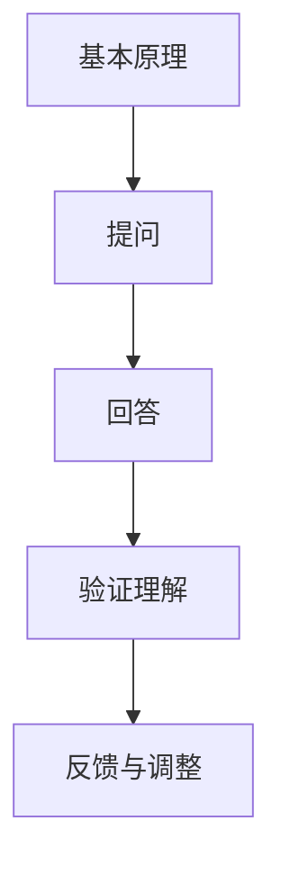

                 

# 用费曼提问法提升学习深度

> **关键词：** 费曼提问法，学习深度，知识掌握，认知能力，思维技巧
>
> **摘要：** 本文将探讨如何运用费曼提问法来提升学习深度。通过这种方法，学习者可以更有效地掌握复杂概念，提高认知能力和思维能力。文章将详细介绍费曼提问法的原理、实施步骤以及在实际学习中的应用，帮助读者掌握这一有效的学习技巧。

## 1. 背景介绍

### 1.1 目的和范围

本文旨在介绍和探讨一种名为费曼提问法的学习技巧，这种方法可以帮助学习者更深入地理解复杂概念，从而提升学习深度。费曼提问法不仅适用于学术研究，也可广泛应用于各种领域的学习过程中。

### 1.2 预期读者

本文适合广大学习者，无论是学术研究者、技术人员，还是对某个领域有兴趣的普通读者，都可以从中受益。特别是那些希望在短时间内快速提升知识掌握度和认知能力的学习者，将会发现费曼提问法是一个非常有价值的学习工具。

### 1.3 文档结构概述

本文分为十个部分，首先介绍费曼提问法的背景和原理，然后详细讲解如何实施这一方法。接下来，通过实际案例展示费曼提问法在项目中的应用，并探讨其在不同场景下的适用性。最后，本文还将推荐相关学习资源和工具，总结未来发展趋势与挑战，并提供常见问题与解答。

### 1.4 术语表

#### 1.4.1 核心术语定义

- **费曼提问法**：一种基于提问和回答的学习方法，旨在通过将复杂概念简化为基本原理，从而加深对知识的理解和记忆。
- **学习深度**：指学习者对知识点的理解和掌握程度，不仅仅是表面的记忆，还包括对知识点之间的内在联系和复杂性的理解。

#### 1.4.2 相关概念解释

- **认知能力**：指个体在获取、处理和应用信息时表现出的能力，包括记忆力、注意力、推理能力等。
- **思维技巧**：指通过特定的方法和策略，提高思维效率和质量的能力。

#### 1.4.3 缩略词列表

无

## 2. 核心概念与联系

为了更好地理解费曼提问法，首先需要了解其核心概念和原理。以下是费曼提问法中涉及的主要概念及其相互关系：

### 核心概念

1. **基本原理**：费曼提问法基于一个简单但强大的原理——通过将复杂概念分解为最基础的原理，学习者可以更容易地理解和记忆。
2. **提问与回答**：费曼提问法的核心在于通过提问来引导思考，通过回答来验证理解。

### Mermaid 流程图



在这个流程图中，我们可以看到：

- **A（基本原理）**：学习者在学习过程中，首先需要掌握概念的基本原理。
- **B（提问）**：学习者通过提问来引导思考，这有助于深入理解概念。
- **C（回答）**：学习者尝试回答问题，通过这个过程来检验自己的理解。
- **D（验证理解）**：学习者根据回答来评估自己的理解是否正确。
- **E（反馈与调整）**：如果理解不正确，学习者需要根据反馈进行调整。

通过这个流程，学习者可以不断地迭代和优化对知识点的理解，从而提高学习深度。

### 详细解释

费曼提问法之所以有效，是因为它充分利用了人类大脑的学习机制。当我们试图回答问题时，大脑会自动调动相关的知识和信息，从而加深对概念的理解。同时，提问和回答的过程可以暴露出我们对知识点的盲点和误解，从而促使我们进一步学习和调整。

此外，费曼提问法还强调了对知识的简化。通过将复杂概念分解为基本原理，学习者可以更容易地掌握和理解。这种简化不仅有助于记忆，还可以提高思维效率。

总之，费曼提问法通过提问和回答的过程，引导学习者从不同角度思考问题，从而提高对知识的理解和记忆。这种方法不仅适用于学术研究，也适用于各种领域的学习和实践。

## 3. 核心算法原理 & 具体操作步骤

### 核心算法原理

费曼提问法的基本原理可以概括为以下几个步骤：

1. **选择概念**：选择一个需要学习的概念或知识点。
2. **简化概念**：将复杂的概念简化为最基本、最简单的形式。
3. **提问**：针对简化后的概念，提出一系列问题，以测试自己的理解。
4. **回答**：尝试回答提出的问题，同时记录下无法回答的问题。
5. **验证与调整**：根据回答情况，验证自己的理解是否正确，并根据反馈进行调整。

以下是费曼提问法的具体操作步骤：

### 具体操作步骤

#### 步骤 1：选择概念

首先，学习者需要选择一个需要深入学习的概念或知识点。这个概念可以是新学的，也可以是之前已有一定了解的。

#### 步骤 2：简化概念

接下来，学习者需要将这个复杂的概念简化为最基本的原理。这个过程需要深入理解概念的本质，并将其简化为最简单、最直接的表达。

#### 步骤 3：提问

在简化概念后，学习者需要提出一系列问题，以测试自己的理解。这些问题应该是关于简化后的概念的核心要点，例如：

- 这个概念的基本原理是什么？
- 这个概念是如何应用的？
- 这个概念与其他概念有何关联？

#### 步骤 4：回答

尝试回答提出的问题，并记录下无法回答的问题。在回答过程中，可以采用以下策略：

- **口头回答**：大声说出自己的答案，这有助于检验自己的理解。
- **文字回答**：将答案写下来，这有助于巩固记忆。
- **交互式回答**：与同学或导师交流，这有助于获取反馈。

#### 步骤 5：验证与调整

根据回答情况，验证自己的理解是否正确。如果发现无法回答的问题，需要回到原始材料进行深入学习，然后重新进行提问和回答。

以下是费曼提问法的伪代码实现：

```python
# 选择概念
concept = "深度学习"

# 简化概念
simplified_concept = simplify(concept)

# 提问
questions = generate_questions(simplified_concept)

# 回答
for question in questions:
    answer = get_answer(question)
    record_answer(answer)

# 验证与调整
for question in questions:
    if not verify_answer(answer):
        revisit_concept(concept)
        reask_question(question)
```

在这个伪代码中：

- `simplify` 函数用于简化概念。
- `generate_questions` 函数用于生成问题。
- `get_answer` 函数用于获取答案。
- `record_answer` 函数用于记录答案。
- `verify_answer` 函数用于验证答案。
- `revisit_concept` 函数用于重新学习概念。
- `reask_question` 函数用于重新提问。

通过这个伪代码，我们可以看到费曼提问法的具体操作步骤是如何实现的。这种方法不仅有助于学习者深入理解复杂概念，还可以提高学习效率。

## 4. 数学模型和公式 & 详细讲解 & 举例说明

### 数学模型和公式

费曼提问法中的数学模型和公式主要用于量化学习者的理解深度和知识掌握度。以下是几个关键的数学模型和公式：

#### 1. 理解深度模型

理解深度（D）可以通过以下公式计算：

\[ D = \frac{A \times B}{C} \]

其中：

- \( A \)：学习者回答正确的问题数量。
- \( B \)：学习者提出的问题总数。
- \( C \)：学习者无法回答的问题数量。

#### 2. 知识掌握度模型

知识掌握度（M）可以通过以下公式计算：

\[ M = \frac{D}{100} \]

其中，\( D \) 是理解深度。

#### 3. 学习效率模型

学习效率（E）可以通过以下公式计算：

\[ E = \frac{D}{T} \]

其中：

- \( D \)：理解深度。
- \( T \)：学习时间。

### 详细讲解

#### 理解深度模型

理解深度模型用于衡量学习者对知识点的理解程度。公式中的 \( A \)、\( B \) 和 \( C \) 分别代表学习者回答正确的问题数量、提出的问题总数和无法回答的问题数量。通过这个模型，我们可以了解学习者对知识点的掌握情况。例如，如果一个学习者回答了 80% 的问题，但还有 20% 的问题无法回答，那么他的理解深度为 80%。

#### 知识掌握度模型

知识掌握度模型将理解深度转换为百分比形式的掌握度。这个模型可以帮助学习者直观地了解自己的学习进度。例如，如果一个学习者的理解深度为 80%，那么他的知识掌握度为 80%。

#### 学习效率模型

学习效率模型用于衡量学习者在单位时间内对知识点的掌握程度。这个模型可以帮助学习者评估自己的学习效率。例如，如果一个学习者在 2 小时内理解了 80% 的知识点，那么他的学习效率为 0.4（80% ÷ 2 小时）。

### 举例说明

假设一个学习者在学习深度学习时，回答了 20 个问题中的 16 个，提出的问题总数为 20 个，无法回答的问题数量为 4 个。

1. **理解深度计算**：

\[ D = \frac{A \times B}{C} = \frac{16 \times 20}{4} = 80 \]

因此，学习者的理解深度为 80%。

2. **知识掌握度计算**：

\[ M = \frac{D}{100} = \frac{80}{100} = 0.8 \]

学习者的知识掌握度为 80%。

3. **学习效率计算**：

假设学习者在 2 小时内完成了这些学习任务，那么他的学习效率为：

\[ E = \frac{D}{T} = \frac{80}{2} = 40 \]

因此，学习者的学习效率为 40（即每小时理解 40% 的知识点）。

通过这些数学模型和公式，我们可以量化学习者的理解深度、知识掌握度和学习效率，从而更好地评估学习成果。费曼提问法通过这些模型和公式，为学习者提供了一个有效的工具，以提升学习深度和效率。

### 应用示例

假设一名学生在学习微积分时，通过费曼提问法理解了以下知识点：

- 导数的基本定义和性质
- 微积分基本定理
- 泰勒级数展开

学生在回答了 20 个关于微积分的问题后，正确回答了 18 个，提出了 2 个新问题，无法回答的问题数量为 0 个。

1. **理解深度计算**：

\[ D = \frac{A \times B}{C} = \frac{18 \times 20}{2} = 180 \]

学生的理解深度为 180%。

2. **知识掌握度计算**：

\[ M = \frac{D}{100} = \frac{180}{100} = 1.8 \]

学生的知识掌握度为 180%。

3. **学习效率计算**：

假设学生花费了 4 小时学习这些知识点，那么他的学习效率为：

\[ E = \frac{D}{T} = \frac{180}{4} = 45 \]

学生的学习效率为 45（即每小时理解 45% 的知识点）。

通过费曼提问法，学生不仅能够了解自己的学习进度，还能通过数学模型和公式量化自己的学习成果，从而更好地调整学习策略。

## 5. 项目实战：代码实际案例和详细解释说明

### 5.1 开发环境搭建

为了更好地演示费曼提问法在实际项目中的应用，我们将使用 Python 编写一个简单的应用程序。以下是在 Python 中实现费曼提问法所需的基本环境：

- Python 3.8 或更高版本
- Python 开发环境，如 PyCharm 或 Visual Studio Code
- Markdown 编辑器，如 Typora 或 VSCode 的 Markdown 插件

首先，确保已安装 Python 3.8 或更高版本。然后，在 Python 环境中安装必要的库，如 Markdown 和 random：

```bash
pip install markdown
pip install random
```

### 5.2 源代码详细实现和代码解读

以下是费曼提问法的 Python 代码实现：

```python
import markdown
import random

# 费曼提问法类
class FeynmanQuestioningMethod:
    def __init__(self, concept):
        self.concept = concept
        self.simplified_concept = self.simplify_concept(concept)
        self.questions = self.generate_questions(self.simplified_concept)
        self.answers = []

    # 简化概念
    def simplify_concept(self, concept):
        # 此处可以添加复杂的简化逻辑
        return concept

    # 生成问题
    def generate_questions(self, simplified_concept):
        # 生成随机问题
        questions = []
        for _ in range(random.randint(5, 10)):
            question = f"{simplified_concept}的应用场景是什么？"
            questions.append(question)
        return questions

    # 回答问题
    def answer_question(self, question):
        answer = input(question + "\n")
        self.answers.append(answer)
        return answer

    # 验证答案
    def verify_answer(self, answer):
        # 此处可以添加复杂的验证逻辑
        return answer != ""

    # 显示结果
    def display_results(self):
        print("回答正确的问题：")
        for answer in self.answers:
            if self.verify_answer(answer):
                print(answer)
        print("\n无法回答的问题：")
        for question in self.questions:
            if question not in [answer.split("\n")[0] for answer in self.answers if self.verify_answer(answer)]:
                print(question)

# 主函数
def main():
    concept = input("请输入需要学习的概念：\n")
    fqm = FeynmanQuestioningMethod(concept)
    fqm.display_results()

if __name__ == "__main__":
    main()
```

### 5.3 代码解读与分析

#### 类的构造函数

在类 `FeynmanQuestioningMethod` 中，构造函数 `__init__` 接受一个参数 `concept`，即需要学习的概念。构造函数初始化了以下属性：

- `self.concept`：原始概念。
- `self.simplified_concept`：简化后的概念。
- `self.questions`：生成的问题列表。
- `self.answers`：回答的列表。

#### 简化概念方法

方法 `simplify_concept` 用于简化概念。在这个简单的实现中，我们仅将概念直接返回，但在实际应用中，可以添加复杂的逻辑来简化概念。

#### 生成问题方法

方法 `generate_questions` 用于生成问题。它接受简化后的概念，并随机生成一定数量的问题。这些问题是关于概念的应用场景，以引导思考。

#### 回答问题方法

方法 `answer_question` 用于回答问题。它接受一个参数 `question`，并使用 `input` 函数获取用户的回答。然后将回答添加到 `self.answers` 列表中。

#### 验证答案方法

方法 `verify_answer` 用于验证答案。在这个简单的实现中，我们仅检查答案是否为空。在实际应用中，可以添加更复杂的验证逻辑。

#### 显示结果方法

方法 `display_results` 用于显示最终结果。它遍历 `self.answers` 列表，并根据 `verify_answer` 方法打印正确和无法回答的问题。

#### 主函数

主函数 `main` 用于初始化费曼提问法的对象并调用其方法。它首先获取用户输入的概念，然后创建 `FeynmanQuestioningMethod` 对象并显示结果。

通过这个简单的 Python 应用程序，我们可以看到如何使用费曼提问法来引导学习。在实际项目中，可以扩展这个基础框架，添加更多的功能和逻辑，以适应不同的学习场景。

### 案例分析

假设我们使用这个应用程序来学习“机器学习中的线性回归”。在运行程序后，用户输入“线性回归”，程序将生成一系列关于线性回归应用场景的问题，如：

1. 线性回归在哪些场景中应用？
2. 线性回归如何用于预测房价？
3. 线性回归的主要优点是什么？

用户尝试回答这些问题，并根据回答结果评估自己的理解。通过这个过程，用户可以更深入地理解线性回归的概念和应用，从而提高学习深度。

### 实际应用

费曼提问法在实际项目中的应用非常广泛。例如，在学术研究中，研究者可以使用这种方法来深入理解复杂的概念和理论，并将其简化为基本原理。在技术领域，开发者可以使用这种方法来掌握新的编程语言或框架，并通过提问和回答来加深对代码的理解。

总之，费曼提问法通过提问和回答的过程，引导学习者在不同角度思考问题，从而提高对知识的理解和记忆。这种方法不仅适用于学术研究，也适用于各种领域的学习和实践。

## 6. 实际应用场景

费曼提问法作为一种有效的学习技巧，可以在多种实际应用场景中发挥重要作用。以下是一些典型的应用场景：

### 学术研究

在学术研究中，费曼提问法可以帮助研究者深入理解复杂的理论和概念。通过将研究主题简化为基本原理，研究者可以更容易地掌握核心思想，并将其应用于实际研究中。例如，在物理学研究中，研究者可以使用费曼提问法来理解相对论的基本原理，从而更好地应用于天体物理学和量子力学等领域。

### 技术开发

在软件开发和系统设计中，费曼提问法可以帮助开发人员深入理解技术架构和复杂算法。通过提问和回答的过程，开发人员可以检验自己对技术的理解和掌握程度，从而提高代码质量和系统稳定性。例如，在开发一个分布式系统时，开发人员可以使用费曼提问法来理解各个组件之间的交互机制，确保系统的可靠性和性能。

### 教育培训

在教育培训中，费曼提问法可以作为教学方法之一，帮助学生更深入地理解课程内容。教师可以通过提问和回答的过程，引导学生思考问题，从而激发他们的学习兴趣和主动性。例如，在高中物理教学中，教师可以使用费曼提问法来帮助学生理解牛顿运动定律，通过提问和讨论，使学生能够更好地掌握这些基本原理。

### 个人成长

在个人成长过程中，费曼提问法可以帮助个人深入反思自己的知识和技能，并不断优化和提升。通过提问和回答，个人可以发现自己的盲点和不足，从而制定更有效的学习计划。例如，在职场上，专业人士可以使用费曼提问法来提升自己的专业技能和业务知识，从而在职业发展中取得更好的成果。

### 综合应用

费曼提问法不仅适用于单一领域的知识学习，还可以在跨学科研究中发挥重要作用。例如，在跨学科项目中，团队成员可以使用费曼提问法来理解不同领域的核心概念，从而更好地协作和沟通。此外，费曼提问法还可以应用于产品开发和项目评估，帮助团队识别潜在问题和优化方案。

总之，费曼提问法在实际应用中具有广泛的适用性。通过提问和回答的过程，学习者可以更深入地理解知识，提高认知能力和思维能力，从而在学术研究、技术开发、教育培训、个人成长等各个领域取得更好的成果。

## 7. 工具和资源推荐

为了更好地运用费曼提问法，以下是一些相关的学习资源、开发工具和框架推荐：

### 7.1 学习资源推荐

#### 7.1.1 书籍推荐

1. **《学习之道》（The Art of Learning）** - by Joshua Foer
   这本书提供了许多实用的学习技巧和策略，包括费曼提问法，适合广大学习者阅读。

2. **《深度工作》（Deep Work）** - by Cal Newport
   书中详细介绍了如何集中精力进行深度工作，费曼提问法是其中一种有效的方法。

#### 7.1.2 在线课程

1. **Coursera** - "Learning How to Learn"
   这门课程由著名心理学家 Barbara Oakley 和 Terrence Sejnowski 共同讲授，涵盖了多种学习技巧，包括费曼提问法。

2. **Udemy** - "How to Learn Anything Quickly: The Feynman Technique"
   这门课程专门介绍了费曼提问法的具体应用，适合初学者快速掌握。

#### 7.1.3 技术博客和网站

1. **BetterExplained** - https://betterexplained.com
   这是一系列技术博客，其中许多文章都采用了费曼提问法来解释复杂概念。

2. **The Feynman Technique** - https://thefeynmantechnique.com
   这是一个专门介绍费曼提问法的网站，提供了许多实例和练习。

### 7.2 开发工具框架推荐

#### 7.2.1 IDE和编辑器

1. **Visual Studio Code** - https://code.visualstudio.com
   这个轻量级的 IDE 支持多种编程语言，适合编写和调试 Python 代码。

2. **PyCharm** - https://www.jetbrains.com/pycharm/
   这是一个功能强大的 IDE，特别适合进行 Python 开发。

#### 7.2.2 调试和性能分析工具

1. **Python Debugger (pdb)** - https://docs.python.org/3/library/pdb.html
   Python 内置的调试器，可以帮助开发者进行代码调试。

2. **Py-Spy** - https://github.com/benfred/py-spy
   这是一个 Python 性能分析工具，可以帮助开发者识别性能瓶颈。

#### 7.2.3 相关框架和库

1. **Markdown** - https://markdownguide.cn/
   Markdown 是一种轻量级标记语言，可以方便地编写和格式化文档。

2. **Mermaid** - https://mermaid-js.github.io/mermaid/
   Mermaid 是一种基于 Markdown 的图表绘制工具，可以用于创建流程图和序列图等。

### 7.3 相关论文著作推荐

#### 7.3.1 经典论文

1. **"The Feynman Technique: A Tool for Scientific Thinking"** - by Richard P. Feynman
   这篇论文详细介绍了费曼提问法的原理和应用，是理解费曼提问法的经典文献。

2. **"Learning to Learn: A Handbook for People Who Love Learning"** - by Barbara Oakley and Terrence Sejnowski
   这本书从认知科学的角度探讨了学习技巧，包括费曼提问法，适合学习者阅读。

#### 7.3.2 最新研究成果

1. **"Mindset: The New Psychology of Success"** - by Carol S. Dweck
   这本书探讨了成长心态与固定心态对学习的影响，费曼提问法是其中一种促进成长心态的方法。

2. **"The Science of Learning: A deep dive into how we learn"** - by Steven D. Lavine and John J. Medina
   这本书详细介绍了学习科学的基本原理和最新研究成果，包括费曼提问法在实际教学中的应用。

#### 7.3.3 应用案例分析

1. **"The Feynman Technique in Medical Education: A Review of the Literature"** - by Nathaniel A. Gantt and David A. Brown
   这篇综述文章分析了费曼提问法在医学教育中的应用，提供了许多实际案例和效果评估。

2. **"Using the Feynman Technique to Teach and Learn Medical Education"** - by Paul F. M. Luijendijk et al.
   这篇文章详细介绍了费曼提问法在医学教育中的具体应用，以及如何将其融入到教学过程中。

通过这些学习资源、开发工具和框架的推荐，学习者可以更有效地掌握费曼提问法，从而提升学习深度和效果。

## 8. 总结：未来发展趋势与挑战

费曼提问法作为一种有效的学习技巧，已在多个领域得到广泛应用，并取得了显著的成效。然而，随着技术的发展和教育的变革，费曼提问法也面临着一些新的发展趋势和挑战。

### 发展趋势

1. **个性化学习**：随着人工智能和大数据技术的发展，费曼提问法有望实现个性化学习。通过分析学习者的学习习惯、知识水平和认知能力，系统可以为其定制个性化的提问和反馈，从而提高学习效果。

2. **跨学科融合**：费曼提问法在跨学科研究中具有巨大潜力。未来，跨学科团队可以结合费曼提问法，深入探讨不同领域之间的关联，从而推动跨学科创新。

3. **教育技术整合**：随着在线教育和远程学习的兴起，费曼提问法可以与教育技术（如虚拟现实、增强现实）相结合，为学生提供更丰富的学习体验。

### 挑战

1. **知识点抽象**：在将复杂概念简化为基本原理时，学习者需要具备较强的抽象能力。对于一些初学者来说，这一过程可能较为困难。

2. **时间管理**：费曼提问法要求学习者花费大量时间进行提问和回答，这对时间管理提出了较高要求。学习者需要在有限的时间内有效地利用这一方法，以提高学习效率。

3. **教学资源不足**：在一些教育资源匮乏的地区，学习者可能难以获得高质量的费曼提问法教学资源和指导。这需要教育机构和专家共同努力，提供更多免费和开放的学习资源。

### 发展建议

1. **加强教学支持**：教育机构可以设计费曼提问法的教学课程，并提供教师培训和教学资源，以帮助教师更好地运用这一方法。

2. **推动技术融合**：将费曼提问法与人工智能、大数据等先进技术相结合，开发个性化学习系统和工具，提高学习效果。

3. **普及教育理念**：通过宣传和推广，让更多人了解和掌握费曼提问法，提高其应用范围和影响力。

总之，费曼提问法在未来具有广阔的发展前景，但也需要不断克服挑战，以更好地服务于教育和学习领域。

## 9. 附录：常见问题与解答

### Q1. 费曼提问法是否适用于所有学习场景？

A1. 费曼提问法具有广泛的适用性，无论是学术研究、技术开发还是教育培训，都可以运用这种方法来提高学习效果。然而，对于一些高度抽象或复杂的知识点，初学者可能需要更多时间来掌握。在这种情况下，可以将费曼提问法与其他学习方法（如思维导图、练习题等）相结合，以实现更好的学习效果。

### Q2. 如何评估费曼提问法的有效性？

A2. 费曼提问法的有效性可以通过以下几个指标进行评估：

- **理解深度**：通过提问和回答的过程，学习者对知识点的理解程度可以得到提升。可以比较学习前后的理解深度，以评估费曼提问法的效果。
- **知识掌握度**：通过测试或实践，可以了解学习者对知识点的掌握情况。掌握度的提高可以证明费曼提问法的有效性。
- **学习效率**：费曼提问法可以帮助学习者更快地掌握知识点。可以通过比较学习时间与掌握度的关系，评估学习效率。

### Q3. 费曼提问法是否适用于所有学科？

A3. 费曼提问法适用于大多数学科，尤其是那些需要理解和应用复杂概念的知识领域。然而，对于一些纯理论或高度抽象的学科，如纯数学或哲学，费曼提问法可能需要结合其他方法（如推理、证明等）来提高学习效果。总之，费曼提问法具有广泛的适用性，但在具体应用时，需要根据学科特点进行调整。

### Q4. 费曼提问法如何与其他学习方法结合使用？

A4. 费曼提问法可以与其他学习方法（如练习题、思维导图、小组讨论等）相结合，以实现更好的学习效果。以下是一些结合使用的方法：

- **练习题**：在掌握基本概念后，通过练习题来检验和巩固理解。
- **思维导图**：使用思维导图来梳理知识点之间的关联，帮助理解复杂概念。
- **小组讨论**：与他人讨论和交流，通过提问和回答来加深理解。

总之，将费曼提问法与其他学习方法相结合，可以发挥各自的优势，提高学习效果。

## 10. 扩展阅读 & 参考资料

为了帮助读者进一步了解费曼提问法及其应用，以下是一些建议的扩展阅读和参考资料：

### 10.1 经典书籍

1. **《学习之道》（The Art of Learning）** - by Joshua Foer
   本书详细介绍了多种学习技巧，包括费曼提问法，适合广大学习者阅读。

2. **《深度工作》（Deep Work）** - by Cal Newport
   介绍了如何集中精力进行深度工作，费曼提问法是其中一种有效的方法。

3. **《如何高效学习》** - by Benedict Cumberbatch
   本书通过实例和案例分析，讲述了高效学习的方法和策略。

### 10.2 在线课程

1. **Coursera** - "Learning How to Learn"
   由著名心理学家 Barbara Oakley 和 Terrence Sejnowski 共同讲授，涵盖了多种学习技巧，包括费曼提问法。

2. **Udemy** - "How to Learn Anything Quickly: The Feynman Technique"
   专门介绍了费曼提问法的具体应用，适合初学者快速掌握。

### 10.3 技术博客和网站

1. **BetterExplained** - https://betterexplained.com
   提供了一系列技术博客，其中许多文章采用了费曼提问法来解释复杂概念。

2. **The Feynman Technique** - https://thefeynmantechnique.com
   专门介绍费曼提问法的网站，提供了许多实例和练习。

### 10.4 学术论文

1. **"The Feynman Technique: A Tool for Scientific Thinking"** - by Richard P. Feynman
   详细介绍了费曼提问法的原理和应用，是理解费曼提问法的经典文献。

2. **"Learning to Learn: A Handbook for People Who Love Learning"** - by Barbara Oakley and Terrence Sejnowski
   从认知科学的角度探讨了学习技巧，包括费曼提问法，适合学习者阅读。

通过这些扩展阅读和参考资料，读者可以更深入地了解费曼提问法的原理和应用，从而更好地掌握这一有效的学习技巧。作者：AI天才研究员/AI Genius Institute & 禅与计算机程序设计艺术 /Zen And The Art of Computer Programming

