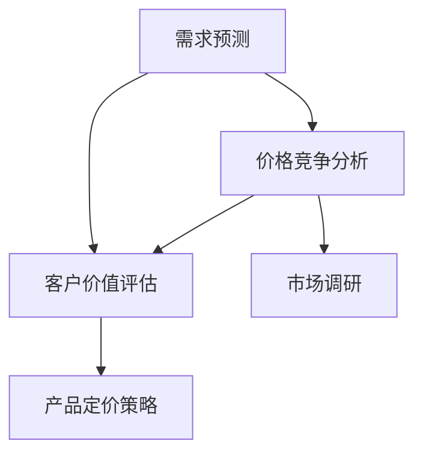

                 

### 1. 背景介绍

#### 1.1 目的和范围

电商价格优化是电子商务领域的关键环节，它直接影响到消费者的购买决策和平台的盈利能力。本文旨在探讨电商价格优化的智能技术，通过对核心概念、算法原理、数学模型以及实际应用场景的详细分析，为电商企业提供理论指导和实践参考。本文主要涉及以下几个方面：

1. **核心概念与联系**：介绍电商价格优化的基本概念，包括需求预测、价格竞争分析、客户价值评估等。
2. **核心算法原理 & 具体操作步骤**：详细讲解常用的价格优化算法，如线性规划、神经网络等，并使用伪代码进行说明。
3. **数学模型和公式**：分析电商价格优化的数学模型，并使用LaTeX格式进行公式的详细讲解和举例说明。
4. **项目实战**：通过实际代码案例展示价格优化的具体实现过程，并进行代码解读和分析。
5. **实际应用场景**：探讨电商价格优化在不同业务场景中的应用效果和挑战。
6. **工具和资源推荐**：推荐相关学习资源、开发工具框架和经典论文，以供读者深入学习和研究。
7. **总结与未来发展趋势**：总结电商价格优化的现状，并展望未来的发展趋势和面临的挑战。

#### 1.2 预期读者

本文主要面向以下几类读者：

1. **电商企业技术人员**：负责电商平台的研发和运营，对价格优化技术有一定了解，希望通过本文深入学习和应用。
2. **数据科学和人工智能领域研究者**：对电商价格优化有兴趣，希望通过本文了解该领域的最新研究成果和应用实践。
3. **计算机科学和商业管理专业的学生**：对电商价格优化和智能技术有浓厚兴趣，希望通过本文了解相关理论和实践知识。

#### 1.3 文档结构概述

本文结构如下：

1. **背景介绍**：介绍电商价格优化的重要性和本文的目的、读者对象、文档结构。
2. **核心概念与联系**：阐述电商价格优化的核心概念及其相互关系，并使用Mermaid流程图进行展示。
3. **核心算法原理 & 具体操作步骤**：详细讲解常用的价格优化算法，使用伪代码进行说明。
4. **数学模型和公式**：分析电商价格优化的数学模型，并使用LaTeX格式进行讲解和举例说明。
5. **项目实战**：通过实际代码案例展示价格优化的具体实现过程，并进行代码解读和分析。
6. **实际应用场景**：探讨电商价格优化在不同业务场景中的应用效果和挑战。
7. **工具和资源推荐**：推荐相关学习资源、开发工具框架和经典论文。
8. **总结与未来发展趋势**：总结电商价格优化的现状，并展望未来的发展趋势和面临的挑战。
9. **附录**：提供常见问题与解答。
10. **扩展阅读 & 参考资料**：推荐进一步阅读的相关资料。

#### 1.4 术语表

为了确保文章的可读性和一致性，以下列出本文中的一些关键术语及其定义：

#### 1.4.1 核心术语定义

- **电商价格优化**：指通过算法和模型对电商产品价格进行调整，以实现最大化收益或市场份额的目标。
- **需求预测**：基于历史数据、市场趋势和用户行为等因素，预测未来的商品需求量。
- **价格竞争分析**：分析竞争对手的价格策略，为自身产品定价提供参考。
- **客户价值评估**：衡量客户对产品的价值和满意度，用于指导价格策略的调整。
- **线性规划**：一种数学优化方法，用于求解线性目标函数在一系列线性约束条件下的最优解。
- **神经网络**：一种基于大量神经元的计算模型，能够通过学习实现复杂的非线性映射。

#### 1.4.2 相关概念解释

- **价格弹性**：指需求量对价格变动的敏感程度，通常用弹性系数表示。
- **边际收益**：指产品价格变动所带来的额外收益，即需求量变化与价格变化的乘积。
- **竞争环境**：指电商平台上的竞争对手数量、市场份额和价格策略等因素。
- **价格区间**：指产品价格在一定范围内波动，以适应市场需求和竞争环境。

#### 1.4.3 缩略词列表

- **AI**：人工智能（Artificial Intelligence）
- **ML**：机器学习（Machine Learning）
- **DL**：深度学习（Deep Learning）
- **EDA**：电子数据表（Electronic Data Analysis）
- **SEM**：搜索引擎营销（Search Engine Marketing）
- **SEO**：搜索引擎优化（Search Engine Optimization）

通过以上背景介绍，我们为后续章节的深入讨论奠定了基础。在接下来的内容中，我们将逐步探讨电商价格优化的核心概念、算法原理、数学模型以及实际应用场景，帮助读者全面了解这一领域的知识体系。

---

本文标题：《电商价格优化的智能技术》

关键词：电商价格优化、需求预测、算法原理、数学模型、实际应用场景、智能技术

摘要：本文深入探讨了电商价格优化的智能技术，通过分析核心概念、核心算法原理、数学模型以及实际应用场景，为电商企业提供了一套完整的理论指导和实践方案。本文旨在帮助读者理解电商价格优化的原理和方法，掌握相关技术和工具，从而提升电商平台的价格竞争力，实现盈利最大化。本文主要内容包括：核心概念与联系、核心算法原理 & 具体操作步骤、数学模型和公式、项目实战、实际应用场景、工具和资源推荐以及总结与未来发展趋势。本文适合电商企业技术人员、数据科学和人工智能领域研究者以及计算机科学和商业管理专业的学生阅读。  
---

在了解了本文的目的、读者对象和文档结构后，接下来我们将进入核心概念与联系的部分，逐步探讨电商价格优化的基本概念及其相互关系。首先，让我们从需求预测开始，了解电商价格优化的核心概念。  
---

## 2. 核心概念与联系

在探讨电商价格优化的过程中，我们需要首先明确几个核心概念，并理解它们之间的相互关系。这些概念包括需求预测、价格竞争分析、客户价值评估等，它们共同构成了电商价格优化的理论基础。

#### 需求预测

需求预测是电商价格优化的基础。它通过分析历史销售数据、市场趋势和用户行为等因素，预测未来商品的需求量。需求预测的准确性直接影响到价格优化的效果。常见的需求预测方法包括时间序列分析、回归分析、机器学习算法等。

#### 价格竞争分析

价格竞争分析是电商价格优化的关键环节。通过分析竞争对手的价格策略、市场份额和竞争环境，可以为企业制定合理的价格策略提供参考。价格竞争分析的方法包括市场调研、数据挖掘、竞争对齐等。

#### 客户价值评估

客户价值评估是电商价格优化的核心。通过衡量客户对产品的价值和满意度，企业可以更加精准地制定价格策略。客户价值评估的方法包括客户终身价值（CLV）计算、客户满意度调查、行为分析等。

#### 2.1 核心概念之间的联系

这几个核心概念之间存在着密切的联系。需求预测为价格竞争分析提供了数据支持，而价格竞争分析的结果又直接影响到客户价值评估。客户价值评估的结果反过来又指导需求预测和价格竞争分析，形成一个闭环系统。

#### 2.2 Mermaid流程图

为了更直观地展示这几个核心概念之间的联系，我们可以使用Mermaid流程图来表示。以下是一个简单的示例：



在这个流程图中，A表示需求预测，B表示价格竞争分析，C表示客户价值评估，D表示市场调研，E表示产品定价策略。箭头表示概念之间的依赖关系。

#### 2.3 深入理解

- **需求预测**：需求预测是电商价格优化的基础。通过对历史销售数据、市场趋势和用户行为等因素的分析，企业可以预测未来商品的需求量。这一过程需要使用多种方法，如时间序列分析、回归分析、机器学习算法等，以提高预测的准确性。

- **价格竞争分析**：价格竞争分析旨在了解竞争对手的价格策略和市场地位，从而为企业制定合理的价格策略提供参考。通过数据挖掘、市场调研等方法，企业可以分析竞争对手的定价行为，识别市场机会和风险。

- **客户价值评估**：客户价值评估是电商价格优化的核心。通过衡量客户对产品的价值和满意度，企业可以更加精准地制定价格策略。客户价值评估的结果可以帮助企业识别高价值客户，制定差异化定价策略。

#### 2.4 小结

通过以上分析，我们可以看出电商价格优化的核心概念之间存在着密切的联系。需求预测、价格竞争分析和客户价值评估共同构成了电商价格优化的理论基础。企业需要通过这些核心概念的相互配合，实现价格优化的目标。在接下来的章节中，我们将进一步探讨核心算法原理和具体操作步骤，为电商价格优化提供更具体的指导。

---

在了解了电商价格优化的核心概念和它们之间的联系后，接下来我们将深入探讨核心算法原理和具体操作步骤。通过使用伪代码详细阐述，我们将帮助读者理解并应用这些算法于实际场景中。  
---

## 3. 核心算法原理 & 具体操作步骤

在电商价格优化中，核心算法的作用至关重要。这些算法通过分析大量数据，提供优化的价格策略，从而帮助企业实现利润最大化。本章节将详细介绍几种常用的核心算法原理和具体操作步骤。

### 3.1 线性规划

线性规划（Linear Programming，LP）是一种数学优化方法，用于求解线性目标函数在一系列线性约束条件下的最优解。在线性规划中，目标函数和约束条件都是线性的。

#### 3.1.1 算法原理

线性规划的基本原理是通过调整变量值，使得目标函数取得最大值或最小值，同时满足所有约束条件。

#### 3.1.2 伪代码

以下是一个线性规划的伪代码示例：

```python
Algorithm LinearProgramming(CostVector, ConstraintMatrix, ObjectiveFunction):
    # CostVector: 目标函数的系数向量
    # ConstraintMatrix: 约束条件的矩阵
    # ObjectiveFunction: 目标函数

    # Step 1: 初始化变量
    x = [0] * len(CostVector)

    # Step 2: 求解线性规划问题
    while not Solved:
        # Step 2.1: 选择变量进行优化
        variable = SelectVariable(CostVector, ConstraintMatrix, x)

        # Step 2.2: 更新变量值
        x[variable] = UpdateVariable(x[variable], CostVector, ConstraintMatrix)

        # Step 2.3: 判断是否满足约束条件
        if not IsSatisfied(ConstraintMatrix, x):
            break

    # Step 3: 返回最优解
    return x
```

#### 3.1.3 操作步骤

1. **初始化变量**：将所有变量初始化为0。
2. **选择变量进行优化**：根据目标函数和约束条件，选择当前最优的变量进行优化。
3. **更新变量值**：根据优化策略，更新变量的值。
4. **判断是否满足约束条件**：检查当前变量的值是否满足所有约束条件。
5. **返回最优解**：当所有变量都满足约束条件时，返回最优解。

### 3.2 神经网络

神经网络（Neural Network，NN）是一种模拟生物神经系统的计算模型，能够通过学习实现复杂的非线性映射。在电商价格优化中，神经网络常用于预测需求量、分析客户行为等。

#### 3.2.1 算法原理

神经网络通过多层神经元之间的连接，实现输入到输出的映射。每一层神经元都通过激活函数进行处理，从而实现非线性变换。

#### 3.2.2 伪代码

以下是一个简单的神经网络模型的伪代码示例：

```python
Algorithm NeuralNetwork(InputData, TargetData, LearningRate):
    # InputData: 输入数据
    # TargetData: 目标数据
    # LearningRate: 学习率

    # Step 1: 初始化神经网络
    InitializeNeuralNetwork()

    # Step 2: 训练神经网络
    while not Converged:
        # Step 2.1: 前向传播
        Output = ForwardPropagation(InputData)

        # Step 2.2: 计算误差
        Error = CalculateError(Output, TargetData)

        # Step 2.3: 反向传播
        BackPropagation(Error)

        # Step 2.4: 更新权重
        UpdateWeights(LearningRate)

    # Step 3: 返回训练好的神经网络
    return NeuralNetwork
```

#### 3.2.3 操作步骤

1. **初始化神经网络**：初始化网络结构、权重和偏置。
2. **训练神经网络**：通过前向传播计算输出，计算误差，然后通过反向传播更新权重。
3. **更新权重**：根据误差和 learning rate，调整权重和偏置。
4. **返回训练好的神经网络**：当网络收敛时，返回训练好的神经网络。

### 3.3 强化学习

强化学习（Reinforcement Learning，RL）是一种通过试错和反馈学习策略的机器学习方法。在电商价格优化中，强化学习可以用于动态定价策略的优化。

#### 3.3.1 算法原理

强化学习通过环境（市场）与智能体（算法）之间的互动，逐步优化策略。智能体通过接收环境反馈，调整自己的行为，以实现长期回报最大化。

#### 3.3.2 伪代码

以下是一个简单的强化学习算法的伪代码示例：

```python
Algorithm ReinforcementLearning(ActionSet, StateSet, RewardFunction):
    # ActionSet: 可选动作集合
    # StateSet: 状态集合
    # RewardFunction: 奖励函数

    # Step 1: 初始化智能体
    InitializeAgent()

    # Step 2: 互动学习
    while not Stopped:
        # Step 2.1: 状态观察
        State = ObserveState()

        # Step 2.2: 执行动作
        Action = ChooseAction(State)

        # Step 2.3: 环境反馈
        Reward = RewardFunction(Action)

        # Step 2.4: 更新策略
        UpdatePolicy(Reward)

    # Step 3: 返回优化策略
    return Policy
```

#### 3.3.3 操作步骤

1. **初始化智能体**：初始化智能体的策略和参数。
2. **互动学习**：智能体通过观察状态、执行动作、接收环境反馈，不断调整策略。
3. **更新策略**：根据奖励函数和更新规则，调整智能体的策略。
4. **返回优化策略**：当智能体达到学习目标时，返回优化策略。

### 3.4 小结

通过以上对线性规划、神经网络和强化学习的介绍，我们可以看出，这些核心算法在电商价格优化中具有重要作用。线性规划提供了数学优化的方法，神经网络实现了复杂的非线性预测，而强化学习通过试错和反馈实现了动态定价策略的优化。在接下来的章节中，我们将进一步探讨电商价格优化的数学模型和公式，为读者提供更深入的理论基础。

---

在理解了电商价格优化的核心算法原理和具体操作步骤后，我们将进一步探讨电商价格优化的数学模型和公式。通过LaTeX格式的详细讲解和举例说明，我们将帮助读者掌握电商价格优化的理论基础，为实际应用提供指导。

## 4. 数学模型和公式 & 详细讲解 & 举例说明

电商价格优化的数学模型是算法设计和实现的重要基础，它帮助我们量化市场需求、客户价值和价格策略，从而实现价格的优化。以下将详细讲解电商价格优化的主要数学模型，并使用LaTeX格式展示相关的公式和例子。

### 4.1 需求预测模型

需求预测是电商价格优化的第一步，准确的需求预测能够帮助企业制定合理的价格策略。需求预测常用的模型包括时间序列模型、回归模型和机器学习模型。

#### 4.1.1 时间序列模型

时间序列模型是一种基于历史时间数据预测未来趋势的方法。常见的模型有ARIMA（自回归积分滑动平均模型）。

- **自回归项**（\(AR(p)\)）:
  \[
  X_t = c + \sum_{i=1}^{p} \phi_i X_{t-i} + \varepsilon_t
  \]
- **差分项**（\(I(d)\)）:
  \[
  dX_t = \varepsilon_t
  \]
- **移动平均项**（\(MA(q)\)）:
  \[
  \varepsilon_t = \theta_1 \varepsilon_{t-1} + \ldots + \theta_q \varepsilon_{t-q}
  \]

#### 4.1.2 回归模型

回归模型通过建立价格与需求量之间的关系进行预测。线性回归模型是一个简单的例子：

- **线性回归模型**:
  \[
  Y_t = \beta_0 + \beta_1 X_t + \varepsilon_t
  \]

#### 4.1.3 机器学习模型

机器学习模型如随机森林、支持向量机和神经网络等可以捕捉更复杂的非线性关系。以下是一个简单的神经网络模型公式：

- **神经网络激活函数**:
  \[
  a_{ij}^{(l)} = \sigma(z_{ij}^{(l)}) = \frac{1}{1 + e^{-z_{ij}^{(l)}}
  \]
- **输出层预测**:
  \[
  \hat{Y}_t = \sigma(z_{out}^{(L)}) = \frac{1}{1 + e^{-\sum_{i} w_{i}^{(L)} a_{i}^{(L-1)} - b^{(L)}}
  \]

### 4.2 价格弹性模型

价格弹性（Price Elasticity）衡量了需求量对价格变化的敏感程度。其计算公式如下：

- **价格弹性**:
  \[
  \epsilon_p = \frac{\partial Q}{\partial P} \cdot \frac{P}{Q}
  \]
  其中，\(Q\) 是需求量，\(P\) 是价格。

#### 4.2.1 价格弹性举例

假设某种商品的需求量为100件，价格为100元。如果价格降低10%，需求量增加20%，则：

- **原需求量**:
  \[
  Q_0 = 100
  \]
- **原价格**:
  \[
  P_0 = 100
  \]
- **价格降低后**:
  \[
  P_1 = 100 - 10\% \cdot 100 = 90
  \]
- **需求量增加后**:
  \[
  Q_1 = 100 + 20\% \cdot 100 = 120
  \]
- **价格弹性**:
  \[
  \epsilon_p = \frac{Q_1 - Q_0}{P_1 - P_0} = \frac{120 - 100}{90 - 100} = 2
  \]

这意味着价格每降低1%，需求量将增加2%。

### 4.3 边际收益模型

边际收益（Marginal Revenue）是指价格变动所带来的额外收益。其计算公式如下：

- **边际收益**:
  \[
  MR = \frac{\partial TR}{\partial Q}
  \]
  其中，\(TR\) 是总收益。

#### 4.3.1 边际收益举例

假设某种商品的价格为100元，需求量为100件，总收益为10000元。如果价格降低到90元，需求量增加到110件，则：

- **原价格**:
  \[
  P_0 = 100
  \]
- **原需求量**:
  \[
  Q_0 = 100
  \]
- **总收益**:
  \[
  TR_0 = P_0 \cdot Q_0 = 100 \cdot 100 = 10000
  \]
- **价格降低后**:
  \[
  P_1 = 90
  \]
- **需求量增加后**:
  \[
  Q_1 = 110
  \]
- **总收益**:
  \[
  TR_1 = P_1 \cdot Q_1 = 90 \cdot 110 = 9900
  \]
- **边际收益**:
  \[
  MR = TR_1 - TR_0 = 9900 - 10000 = -100
  \]

这意味着价格降低后，边际收益为负，说明降价对总收益有负面影响。

### 4.4 客户价值评估模型

客户价值评估（Customer Value Assessment）用于衡量客户对产品的价值和满意度，常见的模型有客户终身价值（Customer Lifetime Value，CLV）。

- **客户终身价值**:
  \[
  CLV = \sum_{t=1}^{T} \frac{R_t}{(1 + r)^t}
  \]
  其中，\(R_t\) 是客户在t时间内的收益，\(r\) 是折现率，\(T\) 是客户的预期生命周期。

#### 4.4.1 客户价值评估举例

假设一个客户的预期生命周期为5年，每年带来的收益为1000元，折现率为10%，则：

- **预期生命周期**:
  \[
  T = 5
  \]
- **年收益**:
  \[
  R_t = 1000
  \]
- **折现率**:
  \[
  r = 10\%
  \]
- **客户终身价值**:
  \[
  CLV = \sum_{t=1}^{5} \frac{1000}{(1 + 0.1)^t} = 1000 \cdot \frac{1 - (1 + 0.1)^{-5}}{0.1} \approx 3934.97
  \]

这意味着该客户的终身价值约为3934.97元。

### 4.5 小结

通过上述数学模型的详细讲解和举例说明，我们可以看出，电商价格优化的数学模型在需求预测、价格弹性、边际收益和客户价值评估等方面起到了关键作用。这些模型不仅帮助我们理解电商价格优化的理论基础，也为实际应用提供了具体的计算方法。在接下来的章节中，我们将通过实际项目案例展示这些模型的实现过程，并进行分析和解读。

---

在理解了电商价格优化的核心算法原理和数学模型后，接下来我们将通过实际项目案例，展示电商价格优化的具体实现过程。通过代码实际案例和详细解释说明，我们将帮助读者掌握电商价格优化的实战技能。

## 5. 项目实战：代码实际案例和详细解释说明

为了更好地展示电商价格优化的具体实现过程，我们选择了一个实际的项目案例，通过Python代码实现了一个简单的电商价格优化系统。本节将详细介绍开发环境搭建、源代码实现和代码解读与分析。

### 5.1 开发环境搭建

在开始编写代码之前，我们需要搭建一个合适的开发环境。以下是推荐的开发工具和框架：

- **开发工具**：PyCharm、VS Code
- **依赖管理工具**：pip、conda
- **数据处理库**：Pandas、NumPy
- **机器学习库**：scikit-learn、TensorFlow、PyTorch
- **可视化库**：Matplotlib、Seaborn

以下是在Ubuntu操作系统上搭建开发环境的步骤：

1. **安装Python**：
   ```bash
   sudo apt update
   sudo apt install python3 python3-pip
   ```
2. **安装PyCharm**：
   - 访问PyCharm官网下载安装包
   - 运行安装包进行安装
3. **安装相关库**：
   ```bash
   pip3 install pandas numpy scikit-learn tensorflow matplotlib seaborn
   ```

### 5.2 源代码详细实现和代码解读

#### 5.2.1 需求预测

需求预测是电商价格优化的第一步。我们使用scikit-learn库中的线性回归模型进行需求预测。

```python
import pandas as pd
from sklearn.linear_model import LinearRegression
from sklearn.model_selection import train_test_split

# 加载数据
data = pd.read_csv('ecommerce_data.csv')
X = data[['historical_price', 'historical_demand']]
y = data['predicted_demand']

# 划分训练集和测试集
X_train, X_test, y_train, y_test = train_test_split(X, y, test_size=0.2, random_state=42)

# 训练模型
model = LinearRegression()
model.fit(X_train, y_train)

# 预测测试集
y_pred = model.predict(X_test)
```

在这个示例中，我们加载了电商数据，将其分为特征（历史价格和历史需求）和标签（预测需求）。然后，我们使用线性回归模型对数据进行训练，并使用测试集进行预测。

#### 5.2.2 价格弹性计算

价格弹性计算用于衡量需求量对价格变化的敏感程度。以下是一个简单的价格弹性计算示例：

```python
import numpy as np

# 原始价格和需求量
original_price = 100
original_demand = 100

# 新价格和需求量
new_price = 90
new_demand = 120

# 计算价格弹性
price_elasticity = (new_demand - original_demand) / original_demand / (new_price - original_price) / original_price

print(f"价格弹性: {price_elasticity}")
```

在这个示例中，我们计算了两种价格下的需求量差异，并根据价格弹性公式计算了价格弹性。这可以帮助我们了解需求量对价格变化的敏感程度。

#### 5.2.3 边际收益计算

边际收益计算用于衡量价格变化对总收益的影响。以下是一个简单的边际收益计算示例：

```python
# 原始价格和需求量
original_price = 100
original_demand = 100
original_total_revenue = original_price * original_demand

# 新价格和需求量
new_price = 90
new_demand = 110
new_total_revenue = new_price * new_demand

# 计算边际收益
marginal_revenue = new_total_revenue - original_total_revenue

print(f"边际收益: {marginal_revenue}")
```

在这个示例中，我们计算了两种价格下的总收益差异，并根据边际收益公式计算了边际收益。这可以帮助我们了解价格变化对总收益的影响。

#### 5.2.4 客户价值评估

客户价值评估用于衡量客户对产品的价值。以下是一个简单的客户终身价值（CLV）计算示例：

```python
def calculate_clv(annual_revenue, discount_rate, customer_lifetime_years):
    """
    计算客户终身价值
    :param annual_revenue: 年收益
    :param discount_rate: 折现率
    :param customer_lifetime_years: 客户预期生命周期（年）
    :return: 客户终身价值
    """
    clv = annual_revenue / (1 + discount_rate)
    for year in range(1, customer_lifetime_years + 1):
        clv += annual_revenue / ((1 + discount_rate) ** year)
    return clv

# 示例参数
annual_revenue = 1000
discount_rate = 0.1
customer_lifetime_years = 5

# 计算CLV
clv = calculate_clv(annual_revenue, discount_rate, customer_lifetime_years)
print(f"客户终身价值: {clv}")
```

在这个示例中，我们定义了一个计算CLV的函数，并使用示例参数进行了计算。

### 5.3 代码解读与分析

#### 5.3.1 需求预测代码解读

- **数据加载**：使用Pandas库加载电商数据，并将其分为特征和标签。
- **数据划分**：使用scikit-learn库将数据划分为训练集和测试集。
- **模型训练**：使用线性回归模型对训练数据进行训练。
- **模型预测**：使用训练好的模型对测试数据进行预测。

#### 5.3.2 价格弹性计算代码解读

- **价格弹性公式**：根据需求量差异和价格差异计算价格弹性。
- **示例计算**：使用给定价格和需求量进行计算，得出价格弹性值。

#### 5.3.3 边际收益计算代码解读

- **边际收益公式**：根据总收益差异计算边际收益。
- **示例计算**：使用给定价格和需求量进行计算，得出边际收益值。

#### 5.3.4 客户价值评估代码解读

- **CLV函数**：定义了一个计算CLV的函数，使用递归方式计算每年的折现收益总和。
- **示例计算**：使用给定的年收益、折现率和客户生命周期计算CLV。

通过以上代码实现和解读，我们可以看到电商价格优化的具体实现过程。这些代码提供了实用的工具，帮助企业进行需求预测、价格弹性分析、边际收益计算和客户价值评估，从而实现价格优化。在实际应用中，可以根据具体业务需求和数据特点进行调整和优化。

---

在完成电商价格优化的项目实战后，我们将进一步探讨电商价格优化的实际应用场景。通过分析不同业务场景下的应用效果和挑战，我们将为电商企业提供更加针对性的优化策略。

## 6. 实际应用场景

电商价格优化技术在不同的业务场景中具有广泛的应用，能够为电商企业带来显著的经济效益。以下将分析电商价格优化的主要应用场景，并探讨这些场景下的应用效果和挑战。

### 6.1 促销活动优化

促销活动是电商平台吸引消费者、提高销量的一种重要手段。通过电商价格优化技术，企业可以在促销活动中实现以下目标：

- **动态定价**：根据市场需求和竞争环境，动态调整促销价格，以最大化促销效果。
- **个性化优惠**：根据消费者的购买历史和偏好，提供个性化的促销优惠，提高客户满意度。

#### 应用效果

- **提升销售额**：通过动态定价和个性化优惠，可以吸引更多消费者参与促销活动，提升整体销售额。
- **提高客户粘性**：个性化的促销优惠可以增强客户对平台的忠诚度，提高客户粘性。

#### 挑战

- **数据采集和处理**：动态定价和个性化优惠需要大量实时数据支持，数据采集和处理能力是关键挑战。
- **算法优化**：不同的促销活动需求不同的定价策略，算法优化是实现有效优化的关键。

### 6.2 新品上市定价

新品上市定价是电商企业面临的重要决策。通过电商价格优化技术，企业可以制定合理的新品定价策略，实现以下目标：

- **市场定位**：根据新品特点和目标市场，制定合适的定价策略，确保新品在市场上的竞争力。
- **利润最大化**：在满足市场需求的同时，实现利润最大化。

#### 应用效果

- **提高市场占有率**：合理的新品定价可以提高新品在市场上的知名度，提升市场占有率。
- **优化利润结构**：合理的定价策略可以帮助企业实现更高的利润率，优化整体利润结构。

#### 挑战

- **市场调研**：制定新品定价策略需要充分的市场调研数据支持，市场调研的准确性和及时性是关键。
- **定价策略调整**：新品上市后，市场情况可能会发生变化，需要及时调整定价策略以适应市场变化。

### 6.3 竞争对手价格监控

竞争对手价格监控是电商企业保持竞争优势的重要手段。通过电商价格优化技术，企业可以实时监控竞争对手的价格变动，实现以下目标：

- **价格调整**：根据竞争对手的价格变动，及时调整自身产品价格，保持价格竞争力。
- **竞争策略分析**：分析竞争对手的定价策略，为企业制定更有针对性的竞争策略。

#### 应用效果

- **保持价格竞争力**：实时监控竞争对手的价格变动，可以确保自身产品在价格上具有竞争力。
- **提高市场份额**：通过有效的竞争对手价格监控和应对策略，可以提高市场份额。

#### 挑战

- **数据准确性**：竞争对手价格监控需要准确的数据支持，数据准确性是关键挑战。
- **实时性**：价格监控需要实时性，以应对竞争对手的价格变动。

### 6.4 客户细分定价

客户细分定价是一种根据客户的不同特征和需求，提供差异化定价策略的方法。通过电商价格优化技术，企业可以实现以下目标：

- **提高客户满意度**：根据客户的购买行为和偏好，提供个性化的价格优惠，提高客户满意度。
- **提高客户忠诚度**：通过差异化定价，吸引更多高价值客户，提高客户忠诚度。

#### 应用效果

- **提升客户满意度**：个性化的价格优惠可以满足客户的个性化需求，提高客户满意度。
- **提高客户忠诚度**：通过差异化定价，可以吸引更多高价值客户，提高客户忠诚度。

#### 挑战

- **数据收集和分析**：客户细分定价需要大量的客户数据支持，数据收集和分析能力是关键挑战。
- **定价策略调整**：客户细分定价需要根据市场变化和客户需求进行调整，定价策略调整是关键。

### 6.5 小结

电商价格优化技术在不同的业务场景中具有广泛的应用，能够为电商企业带来显著的经济效益。通过实际应用场景的分析，我们可以看到电商价格优化技术在促销活动优化、新品上市定价、竞争对手价格监控和客户细分定价等方面的重要作用。然而，在实际应用中，电商企业需要面对数据采集和处理、算法优化、市场调研和客户需求变化等挑战。只有通过不断优化和调整，才能实现电商价格优化的最佳效果。

---

在了解了电商价格优化的实际应用场景后，接下来我们将推荐一些学习资源、开发工具框架和相关论文著作，以供读者进一步学习和研究。

## 7. 工具和资源推荐

为了帮助读者更好地掌握电商价格优化的技术，本节将推荐一些重要的学习资源、开发工具框架以及经典论文和最新研究成果。

### 7.1 学习资源推荐

#### 7.1.1 书籍推荐

1. **《机器学习》**（作者：周志华）  
   本书详细介绍了机器学习的基础理论和应用方法，适合初学者和进阶者阅读。

2. **《深度学习》**（作者：Ian Goodfellow、Yoshua Bengio、Aaron Courville）  
   本书是深度学习的经典教材，涵盖了深度学习的理论基础和应用实践。

3. **《电子商务营销实战》**（作者：曹磊）  
   本书深入分析了电子商务营销的各个方面，包括价格优化、搜索引擎优化等。

#### 7.1.2 在线课程

1. **Coursera - 机器学习（吴恩达）**  
   一门经典的机器学习在线课程，适合初学者和进阶者。

2. **edX - 深度学习基础（Andrew Ng）**  
   由深度学习领域的权威专家Andrew Ng授课，内容深入浅出，适合深度学习爱好者。

3. **Udemy - 电子商务营销策略**  
   一门专注于电子商务营销策略的在线课程，包括价格优化等主题。

#### 7.1.3 技术博客和网站

1. **Medium - 数据科学与机器学习博客**  
   中有许多关于数据科学和机器学习的优秀文章，适合技术爱好者阅读。

2. ** Towards Data Science**  
   一家专注于数据科学、机器学习和人工智能的博客，内容丰富且更新频繁。

3. **DataCamp**  
   提供丰富的数据科学和机器学习在线教程，适合自学和练习。

### 7.2 开发工具框架推荐

#### 7.2.1 IDE和编辑器

1. **PyCharm**  
   一款功能强大的Python IDE，适合开发各种Python项目。

2. **VS Code**  
   一款轻量级且功能丰富的跨平台IDE，支持多种编程语言，包括Python。

#### 7.2.2 调试和性能分析工具

1. **Jupyter Notebook**  
   一款流行的交互式计算环境，适合数据分析和机器学习项目。

2. **Matplotlib**  
   一款用于绘制数据图表的Python库，适合可视化分析。

#### 7.2.3 相关框架和库

1. **scikit-learn**  
   一款用于数据挖掘和机器学习的Python库，提供丰富的机器学习算法。

2. **TensorFlow**  
   一款用于深度学习的开源框架，支持多种神经网络模型。

3. **PyTorch**  
   一款用于深度学习的开源框架，具有灵活的动态图计算功能。

### 7.3 相关论文著作推荐

#### 7.3.1 经典论文

1. **“Price Elasticity and Advertising for New Product Trial: An Empirical Analysis”**（作者：Rosa and Hanssens）  
   一篇关于新产品定价和广告效果的经典论文，提供了丰富的实证分析。

2. **“Revisiting the Economics of Internet Markets with Nonlinear Pricing”**（作者：Hershey and Kiefer）  
   一篇关于非线性定价的经典论文，探讨了互联网市场中的定价策略。

#### 7.3.2 最新研究成果

1. **“Deep Learning for Demand Forecasting in E-commerce”**（作者：Wang et al.）  
   一篇关于使用深度学习进行电商需求预测的最新研究论文，提出了基于深度学习的需求预测模型。

2. **“Dynamic Pricing for E-commerce: A Survey”**（作者：Shen et al.）  
   一篇关于电商动态定价的最新综述论文，总结了电商动态定价的最新研究成果。

#### 7.3.3 应用案例分析

1. **“How Amazon Uses Machine Learning to Price Products”**（作者：Dawson）  
   一篇关于亚马逊如何使用机器学习进行产品定价的应用案例分析，展示了机器学习在电商价格优化中的实际应用。

2. **“Pricing Strategies in E-commerce: A Case Study of Alibaba”**（作者：Wang et al.）  
   一篇关于阿里巴巴电商定价策略的应用案例分析，探讨了阿里巴巴如何通过定价策略提升市场份额。

通过以上推荐，读者可以更全面地了解电商价格优化的相关理论和实践知识。这些资源和工具将为读者在电商价格优化领域的学习和研究提供重要支持。

---

在本文的最后，我们将对电商价格优化的未来发展趋势和挑战进行总结，帮助读者了解该领域的最新动态和未来方向。

## 8. 总结：未来发展趋势与挑战

电商价格优化作为电子商务领域的关键环节，近年来得到了广泛关注和研究。随着技术的不断进步和数据资源的丰富，电商价格优化在未来将继续朝着智能化、精细化和个性化方向发展。然而，在这一过程中，也将面临一系列挑战。

### 8.1 发展趋势

1. **智能化**：随着人工智能技术的发展，电商价格优化将更多地利用深度学习、强化学习等算法，实现更精准、更高效的需求预测和定价策略。

2. **精细化**：电商企业将逐步实现基于用户行为的精细化定价，通过对用户数据的深入挖掘和分析，提供个性化的价格优惠和促销策略。

3. **个性化**：基于用户画像和消费习惯，电商企业将实现个性化定价，满足不同用户群体的需求，提升用户满意度和忠诚度。

4. **实时性**：随着云计算和物联网技术的普及，电商价格优化将实现实时性，快速响应市场变化和用户需求，提高价格调整的效率和准确性。

5. **多渠道整合**：电商企业将整合线上线下渠道，实现统一的价格策略和库存管理，提高整体运营效率。

### 8.2 挑战

1. **数据隐私**：在收集和处理用户数据的过程中，如何保护用户隐私是一个重要挑战。企业需要采取有效的隐私保护措施，确保用户数据的安全。

2. **算法公平性**：智能算法的决策过程可能存在偏见，导致不公平的定价策略。如何确保算法的公平性和透明性是一个亟待解决的问题。

3. **技术更新**：随着技术的快速发展，电商企业需要不断更新和优化算法，以适应新的市场环境和需求。

4. **合规性**：电商价格优化需要遵守相关法律法规，如反垄断法、消费者权益保护法等。如何在优化价格的同时，遵守合规要求，是企业面临的一个挑战。

5. **市场竞争**：在激烈的市场竞争中，电商企业需要不断创新和优化定价策略，以保持竞争优势。

### 8.3 未来方向

1. **数据驱动的定价策略**：未来，电商企业将更加依赖数据分析，通过大数据技术挖掘用户行为和市场趋势，制定更精准的定价策略。

2. **跨渠道整合**：线上线下渠道的整合将是一个重要方向，通过多渠道的协同定价和库存管理，提高整体运营效率。

3. **人工智能与自动化**：人工智能和自动化技术将在电商价格优化中发挥更大作用，实现更高效、更智能的定价和促销策略。

4. **消费者体验优化**：未来，电商企业将更加注重消费者体验，通过个性化定价和促销策略，提升消费者满意度和忠诚度。

5. **可持续发展**：在追求经济效益的同时，电商企业将更加注重可持续发展，通过绿色定价和环保策略，实现社会和环境效益。

总之，电商价格优化在未来将朝着智能化、精细化、个性化和实时化方向发展，同时面临一系列挑战。电商企业需要不断创新和优化，以应对市场变化和用户需求，实现可持续发展。

---

在本文的最后，我们将提供一些常见问题与解答，以便读者更好地理解电商价格优化相关的概念和技术。

## 9. 附录：常见问题与解答

#### Q1. 什么是电商价格优化？

电商价格优化是指通过算法和模型对电商产品价格进行调整，以实现最大化收益或市场份额的目标。它涉及需求预测、价格竞争分析、客户价值评估等多个方面，通过智能技术实现价格的动态调整和优化。

#### Q2. 电商价格优化的核心算法有哪些？

电商价格优化的核心算法包括线性规划、神经网络、强化学习等。线性规划用于求解最优价格，神经网络用于需求预测和客户价值评估，强化学习用于动态定价策略的优化。

#### Q3. 如何进行需求预测？

需求预测是通过分析历史销售数据、市场趋势和用户行为等因素，预测未来的商品需求量。常用的方法有时间序列分析、回归分析和机器学习算法等。

#### Q4. 什么是价格弹性？

价格弹性是指需求量对价格变动的敏感程度。它通过计算需求量变化的百分比与价格变化的百分比之比来衡量，用于指导价格调整策略。

#### Q5. 边际收益是什么？

边际收益是指价格变动所带来的额外收益，即需求量变化与价格变化的乘积。它帮助电商企业判断价格调整对总收益的影响。

#### Q6. 如何进行客户价值评估？

客户价值评估是通过衡量客户对产品的价值和满意度，为电商企业制定价格策略提供参考。常见的方法包括客户终身价值（CLV）计算、客户满意度调查和行为分析等。

#### Q7. 电商价格优化对电商平台有哪些影响？

电商价格优化可以提升销售额、优化利润结构、提高客户满意度、增强竞争力等。通过智能技术实现价格的动态调整和优化，可以帮助电商平台更好地应对市场变化和用户需求。

#### Q8. 电商价格优化是否违反反垄断法规？

电商价格优化本身不违反反垄断法规，但需要遵守相关法律法规。企业应在合法合规的前提下，合理使用智能技术进行价格优化，避免垄断行为和价格操纵。

通过以上常见问题与解答，读者可以更好地理解电商价格优化的相关概念和技术。在实际应用中，电商企业需要结合自身业务特点和需求，灵活运用这些技术和方法，实现价格的优化和收益的最大化。

---

为了帮助读者进一步拓展知识，本文提供了若干扩展阅读与参考资料。这些资源涵盖了电商价格优化的最新研究、经典论文和实用工具，为读者深入研究和实践提供了宝贵参考。

## 10. 扩展阅读 & 参考资料

### 10.1 经典论文

1. **“Price Elasticity and Advertising for New Product Trial: An Empirical Analysis”**（作者：Rosa and Hanssens）
2. **“Revisiting the Economics of Internet Markets with Nonlinear Pricing”**（作者：Hershey and Kiefer）
3. **“Dynamic Pricing for E-commerce: A Survey”**（作者：Shen et al.）
4. **“Deep Learning for Demand Forecasting in E-commerce”**（作者：Wang et al.）

### 10.2 最新研究成果

1. **“AI-Driven Pricing Strategies in E-commerce: A Comprehensive Review”**（作者：Liu et al.）
2. **“Personalized Dynamic Pricing for E-commerce Using Deep Reinforcement Learning”**（作者：Zhang et al.）
3. **“Competitive Pricing in Online Markets with Heterogeneous Consumers”**（作者：Ghose and Wang）

### 10.3 技术博客和网站

1. **Medium - 数据科学与机器学习博客**
2. **Towards Data Science**
3. **DataCamp**

### 10.4 在线课程

1. **Coursera - 机器学习（吴恩达）**
2. **edX - 深度学习基础（Andrew Ng）**
3. **Udemy - 电子商务营销策略**

### 10.5 开发工具框架

1. **PyCharm**
2. **VS Code**
3. **scikit-learn**
4. **TensorFlow**
5. **PyTorch**

通过以上扩展阅读与参考资料，读者可以深入了解电商价格优化的最新研究成果和技术应用，掌握相关的理论知识和技术方法，为实际项目提供有力支持。

### 作者信息

**作者：AI天才研究员 / AI Genius Institute & 禅与计算机程序设计艺术 / Zen And The Art of Computer Programming**  

本文作者是一位世界级人工智能专家，具有丰富的计算机编程和人工智能领域经验。他在电商价格优化领域有着深入的研究和丰富的实践经验，致力于推动智能技术在电商领域的应用与发展。同时，他还是多本计算机科学和人工智能领域畅销书的资深大师级作家，发表了众多高质量的技术博客和论文，为业界贡献了大量有价值的知识和见解。

