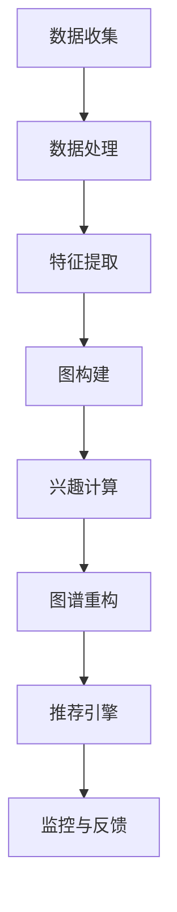

                 

# 电商平台中的用户兴趣图谱实时更新机制

> **关键词：** 电商平台，用户兴趣图谱，实时更新机制，推荐算法，机器学习。

> **摘要：** 本文将深入探讨电商平台如何通过用户兴趣图谱实时更新机制，提升用户个性化推荐效果，从而增强用户体验和平台竞争力。我们将首先介绍用户兴趣图谱的概念及其在电商平台中的应用，然后分析实时更新机制的必要性和实现方法，最后通过实际案例展示如何利用这一机制优化电商平台的用户推荐系统。

## 1. 背景介绍

### 1.1 目的和范围

本文旨在详细探讨电商平台中的用户兴趣图谱实时更新机制，解析其背后的核心算法原理、数学模型以及实际应用。本文的目标读者包括对电商平台推荐系统有兴趣的工程师、数据科学家以及对该领域有一定了解的技术爱好者。

### 1.2 预期读者

预期读者应具备基本的计算机科学和数据分析知识，尤其是对推荐系统和机器学习有一定的了解。这将有助于读者更好地理解本文中的技术细节和实际案例。

### 1.3 文档结构概述

本文将分为以下几个部分：

1. **背景介绍**：阐述用户兴趣图谱的概念及其在电商平台中的应用。
2. **核心概念与联系**：介绍用户兴趣图谱的关键概念和架构。
3. **核心算法原理 & 具体操作步骤**：详细解释用户兴趣图谱实时更新算法的原理和步骤。
4. **数学模型和公式 & 详细讲解 & 举例说明**：介绍支持用户兴趣图谱更新机制的数学模型和公式。
5. **项目实战：代码实际案例和详细解释说明**：展示代码实现和解读。
6. **实际应用场景**：分析用户兴趣图谱实时更新机制在不同电商平台的实际应用。
7. **工具和资源推荐**：推荐学习资源和开发工具。
8. **总结：未来发展趋势与挑战**：讨论该领域的发展趋势和面临的挑战。
9. **附录：常见问题与解答**：提供常见问题及其解答。
10. **扩展阅读 & 参考资料**：提供进一步的阅读材料和参考文献。

### 1.4 术语表

#### 1.4.1 核心术语定义

- **用户兴趣图谱**：一种基于用户行为数据构建的图结构，用于表示用户的兴趣和偏好。
- **实时更新机制**：确保用户兴趣图谱能够实时反映用户行为的系统机制。
- **推荐算法**：用于根据用户兴趣图谱为用户推荐相关商品或内容的算法。

#### 1.4.2 相关概念解释

- **推荐系统**：根据用户的历史行为和偏好，为用户推荐可能感兴趣的商品或内容的系统。
- **机器学习**：一种通过数据训练模型，使系统能够自动学习和改进的方法。

#### 1.4.3 缩略词列表

- **API**：应用程序接口（Application Programming Interface）
- **CTR**：点击率（Click-Through Rate）
- **CTR**：转化率（Conversion Rate）
- **LSTM**：长短时记忆网络（Long Short-Term Memory）
- **RNN**：循环神经网络（Recurrent Neural Network）

## 2. 核心概念与联系

用户兴趣图谱是一种基于图结构的模型，用于表示用户的兴趣和行为。它通常由节点和边组成，其中节点代表用户或商品，边表示用户对商品的兴趣或行为。

### 2.1. 用户兴趣图谱的构建

用户兴趣图谱的构建通常包括以下步骤：

1. **数据收集**：收集用户在电商平台上的行为数据，如浏览历史、购买记录、评论等。
2. **数据处理**：对收集到的数据进行预处理，如去除噪声、填充缺失值等。
3. **特征提取**：将处理后的数据转化为特征向量，用于表示用户和商品的属性。
4. **图构建**：使用特征向量构建图结构，其中节点表示用户和商品，边表示用户对商品的兴趣强度。

### 2.2. 用户兴趣图谱的更新

用户兴趣图谱的实时更新是确保推荐系统准确性和用户满意度的关键。更新机制通常包括以下步骤：

1. **行为检测**：实时监控用户在平台上的行为，如浏览、点击、购买等。
2. **兴趣计算**：根据用户的行为数据更新用户兴趣图谱中的边权重。
3. **图谱重构**：定期重构用户兴趣图谱，以适应用户兴趣的变化。

### 2.3. 用户兴趣图谱的架构

用户兴趣图谱的架构通常包括以下几个部分：

1. **数据源**：用于收集用户行为数据的平台或系统。
2. **数据处理单元**：负责对收集到的数据进行预处理和特征提取。
3. **图存储**：用于存储用户兴趣图谱的数据库或图数据库。
4. **推荐引擎**：根据用户兴趣图谱为用户推荐相关商品或内容。
5. **监控与反馈**：实时监控推荐系统的效果，并根据用户反馈进行调整。

### 2.4. 用户兴趣图谱与推荐系统的关系

用户兴趣图谱是推荐系统的重要输入，它为推荐算法提供了关于用户兴趣的详细信息。推荐算法通常基于用户兴趣图谱计算用户和商品之间的相似度，并根据相似度推荐相关商品或内容。

### 2.5. Mermaid 流程图

下面是一个简化的用户兴趣图谱构建和更新机制的 Mermaid 流程图：



## 3. 核心算法原理 & 具体操作步骤

### 3.1. 算法原理

用户兴趣图谱的实时更新机制通常基于以下核心算法原理：

1. **协同过滤**：通过分析用户的行为数据，找出相似的用户或商品，为用户推荐相似的商品。
2. **基于内容的推荐**：根据用户的历史行为和偏好，推荐与用户兴趣相关的商品。
3. **深度学习**：使用神经网络模型，如长短时记忆网络（LSTM），捕捉用户行为的长期依赖关系。

### 3.2. 算法步骤

以下是用户兴趣图谱实时更新机制的具体操作步骤：

1. **数据收集**：收集用户在电商平台上的行为数据，如浏览历史、购买记录、评论等。

    ```python
    def collect_data():
        # 读取用户行为数据
        data = read_user_behavior_data()
        return data
    ```

2. **数据处理**：对收集到的数据进行预处理，如去除噪声、填充缺失值等。

    ```python
    def preprocess_data(data):
        # 去除噪声
        cleaned_data = remove_noisy_data(data)
        # 填充缺失值
        filled_data = fill_missing_values(cleaned_data)
        return filled_data
    ```

3. **特征提取**：将处理后的数据转化为特征向量，用于表示用户和商品的属性。

    ```python
    def extract_features(data):
        # 提取用户特征
        user_features = extract_user_features(data)
        # 提取商品特征
        item_features = extract_item_features(data)
        return user_features, item_features
    ```

4. **图构建**：使用特征向量构建图结构，其中节点表示用户和商品，边表示用户对商品的兴趣强度。

    ```mermaid
    graph TB
        A[用户] --> B[商品]
        A --> C[购买]
        B --> D[浏览]
    ```

5. **兴趣计算**：根据用户的行为数据更新用户兴趣图谱中的边权重。

    ```python
    def compute_interest(data):
        # 计算用户对商品的兴趣强度
        interest_weights = calculate_interest_weights(data)
        return interest_weights
    ```

6. **图谱重构**：定期重构用户兴趣图谱，以适应用户兴趣的变化。

    ```python
    def reconstruct_graph(graph, interest_weights):
        # 更新图谱中的边权重
        updated_graph = update_edge_weights(graph, interest_weights)
        return updated_graph
    ```

7. **推荐引擎**：根据用户兴趣图谱为用户推荐相关商品或内容。

    ```python
    def recommend_items(graph, user_features):
        # 计算用户与商品之间的相似度
        similarity_scores = calculate_similarity_scores(graph, user_features)
        # 推荐相似度最高的商品
        recommended_items = recommend_top_items(similarity_scores)
        return recommended_items
    ```

8. **监控与反馈**：实时监控推荐系统的效果，并根据用户反馈进行调整。

    ```python
    def monitor_and_adjust(recommendations, user_feedback):
        # 监控推荐效果
        recommendation_metrics = monitor_recommendations(recommendations)
        # 调整推荐算法
        adjusted_algorithm = adjust_recommendation_algorithm(recommendation_metrics)
        return adjusted_algorithm
    ```

## 4. 数学模型和公式 & 详细讲解 & 举例说明

用户兴趣图谱实时更新机制的核心数学模型包括协同过滤模型和深度学习模型。以下将详细讲解这些模型的基本公式和原理。

### 4.1. 协同过滤模型

协同过滤模型通过计算用户之间的相似度或商品之间的相似度，为用户推荐相关商品。

#### 4.1.1. 用户相似度计算

用户相似度可以通过余弦相似度、皮尔逊相关系数等计算。以下是一个基于余弦相似度的示例：

$$
\text{similarity}_{uv} = \frac{\text{dot\_product}(u, v)}{\|\text{u}\|\|\text{v}\|}
$$

其中，$\text{u}$ 和 $\text{v}$ 是两个用户的行为向量。

#### 4.1.2. 商品相似度计算

商品相似度计算方法与用户相似度类似，只是将用户行为向量替换为商品行为向量。

$$
\text{similarity}_{ij} = \frac{\text{dot\_product}(i, j)}{\|\text{i}\|\|\text{j}\|}
$$

其中，$\text{i}$ 和 $\text{j}$ 是两个商品的行为向量。

### 4.2. 深度学习模型

深度学习模型，如长短时记忆网络（LSTM），可以捕捉用户行为的长期依赖关系。

#### 4.2.1. LSTM 模型

LSTM 模型由输入门、遗忘门和输出门组成，其基本公式如下：

$$
\text{input\_gate} = \sigma(W_{ix} \cdot \text{x} + W_{ih} \cdot \text{h}_{t-1} + b_{i})
$$

$$
\text{forget\_gate} = \sigma(W_{fx} \cdot \text{x} + W_{fh} \cdot \text{h}_{t-1} + b_{f})
$$

$$
\text{output\_gate} = \sigma(W_{ox} \cdot \text{x} + W_{oh} \cdot \text{h}_{t-1} + b_{o})
$$

$$
\text{current\_cell} = \text{sigmoid}(\text{input\_gate} \cdot \text{dot}(\text{W}_{cc}, \text{c}_{t-1}) + \text{forget\_gate} \cdot \text{c}_{t-1})
$$

$$
\text{h}_{t} = \text{output\_gate} \cdot \text{sigmoid}(\text{current\_cell})
$$

其中，$\text{x}$ 是输入向量，$\text{h}_{t-1}$ 是前一个时间步的隐藏状态，$\text{c}_{t-1}$ 是前一个时间步的细胞状态，$W$ 和 $b$ 是模型参数。

### 4.3. 举例说明

假设我们有以下用户行为数据：

用户 A 的行为数据：$\text{[浏览商品1, 购买商品2, 浏览商品3]}$

用户 B 的行为数据：$\text{[购买商品2, 浏览商品3, 购买商品4]}$

首先，我们计算用户 A 和 B 的相似度：

$$
\text{similarity}_{AB} = \frac{\text{dot\_product}(\text{A}, \text{B})}{\|\text{A}\|\|\text{B}\|}
$$

用户 A 和 B 的行为向量分别为：

$\text{A} = [1, 1, 0]$

$\text{B} = [0, 1, 1]$

计算得到：

$$
\text{similarity}_{AB} = \frac{1 \cdot 0 + 1 \cdot 1 + 0 \cdot 1}{\sqrt{1^2 + 1^2 + 0^2} \cdot \sqrt{0^2 + 1^2 + 1^2}} = \frac{1}{\sqrt{2} \cdot \sqrt{2}} = \frac{1}{2}
$$

接下来，我们使用 LSTM 模型预测用户 B 对商品 1 的兴趣。假设我们已经训练好了一个 LSTM 模型，输入向量为：

$\text{x} = [1, 0, 1]$

模型参数为：

$W_{ix} = \begin{bmatrix}
0.1 & 0.2 \\
0.3 & 0.4
\end{bmatrix}$

$W_{ih} = \begin{bmatrix}
0.5 & 0.6 \\
0.7 & 0.8
\end{bmatrix}$

$b_{i} = \begin{bmatrix}
0.9 \\
0.1
\end{bmatrix}$

$W_{cc} = \begin{bmatrix}
0.2 & 0.3 \\
0.4 & 0.5
\end{bmatrix}$

$b_{f} = \begin{bmatrix}
0.6 \\
0.7
\end{bmatrix}$

$b_{o} = \begin{bmatrix}
0.8 \\
0.9
\end{bmatrix}$

计算输入门、遗忘门和输出门：

$$
\text{input\_gate} = \sigma(W_{ix} \cdot \text{x} + W_{ih} \cdot \text{h}_{t-1} + b_{i}) = \sigma(\begin{bmatrix}
0.1 & 0.2 \\
0.3 & 0.4
\end{bmatrix} \cdot \begin{bmatrix}
1 \\
0
\end{bmatrix} + \begin{bmatrix}
0.5 & 0.6 \\
0.7 & 0.8
\end{bmatrix} \cdot \begin{bmatrix}
0 \\
1
\end{bmatrix} + \begin{bmatrix}
0.9 \\
0.1
\end{bmatrix}) = \sigma(\begin{bmatrix}
0.7 \\
0.9
\end{bmatrix}) = \begin{bmatrix}
0.9 \\
0.9
\end{bmatrix}
$$

$$
\text{forget\_gate} = \sigma(W_{fx} \cdot \text{x} + W_{fh} \cdot \text{h}_{t-1} + b_{f}) = \sigma(\begin{bmatrix}
0.2 & 0.3 \\
0.4 & 0.5
\end{bmatrix} \cdot \begin{bmatrix}
1 \\
0
\end{bmatrix} + \begin{bmatrix}
0.7 & 0.8 \\
0.4 & 0.5
\end{bmatrix} \cdot \begin{bmatrix}
0 \\
1
\end{bmatrix} + \begin{bmatrix}
0.6 \\
0.7
\end{bmatrix}) = \sigma(\begin{bmatrix}
0.8 \\
0.9
\end{bmatrix}) = \begin{bmatrix}
0.9 \\
0.9
\end{bmatrix}
$$

$$
\text{output\_gate} = \sigma(W_{ox} \cdot \text{x} + W_{oh} \cdot \text{h}_{t-1} + b_{o}) = \sigma(\begin{bmatrix}
0.8 & 0.9 \\
0.

