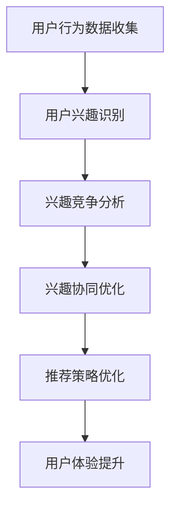

                 

# 电商平台中的用户兴趣竞争与协同模型

> **关键词：** 电商平台、用户兴趣、竞争与协同模型、数据挖掘、机器学习、推荐系统、算法设计

> **摘要：** 本文将深入探讨电商平台中用户兴趣的竞争与协同模型。我们将首先介绍用户兴趣竞争与协同模型在电商领域的背景和重要性，然后详细解析其核心概念和算法原理。接着，本文将展示如何通过数学模型和实际代码案例来实现这一模型，并探讨其在实际应用中的场景和挑战。最后，我们将推荐相关的学习资源和工具，总结未来发展趋势，并提供常见问题解答。

## 1. 背景介绍

### 1.1 目的和范围

本文旨在探讨电商平台中用户兴趣竞争与协同模型的构建和应用。随着互联网和电子商务的快速发展，电商平台已成为现代商业的重要组成部分。用户在电商平台上进行消费活动时，其兴趣和行为数据被大量收集和存储。如何有效利用这些数据，构建能够准确反映用户兴趣的模型，并在竞争激烈的市场环境中实现用户协同，是电商平台发展中亟待解决的问题。

本文将重点关注以下方面：

1. 用户兴趣竞争与协同模型的基本概念和核心原理。
2. 如何通过数据挖掘和机器学习技术实现用户兴趣的识别和预测。
3. 用户兴趣竞争与协同模型的数学模型和算法设计。
4. 实际案例中的代码实现和分析。
5. 用户兴趣竞争与协同模型在实际应用中的场景和挑战。

### 1.2 预期读者

本文面向对电子商务、数据挖掘和机器学习有一定了解的技术人员和研究人员。无论是电商平台开发者、数据科学家，还是对推荐系统和用户行为分析感兴趣的研究者，都可以从本文中获得有价值的见解和启发。

### 1.3 文档结构概述

本文分为十个部分，具体结构如下：

1. 背景介绍：介绍本文的目的、范围和预期读者。
2. 核心概念与联系：阐述用户兴趣竞争与协同模型的基本概念和架构。
3. 核心算法原理 & 具体操作步骤：详细讲解算法原理和实现步骤。
4. 数学模型和公式 & 详细讲解 & 举例说明：介绍数学模型和公式，并通过实例说明其应用。
5. 项目实战：代码实际案例和详细解释说明。
6. 实际应用场景：探讨用户兴趣竞争与协同模型在不同电商场景中的应用。
7. 工具和资源推荐：推荐学习资源和开发工具。
8. 总结：未来发展趋势与挑战。
9. 附录：常见问题与解答。
10. 扩展阅读 & 参考资料：提供进一步学习和研究的资源。

### 1.4 术语表

#### 1.4.1 核心术语定义

- **用户兴趣**：指用户在特定场景下对某些商品、服务或信息的偏好和倾向。
- **竞争**：指用户在不同电商平台之间的选择和争夺。
- **协同**：指用户在同一个平台上的互动和共同决策。
- **数据挖掘**：指从大量数据中提取有用信息和知识的过程。
- **机器学习**：一种人工智能技术，通过训练模型来预测或分类数据。
- **推荐系统**：一种基于用户历史行为或兴趣的自动化推荐机制。

#### 1.4.2 相关概念解释

- **协同过滤**：一种常用的推荐系统算法，通过分析用户之间的相似度来预测用户可能感兴趣的内容。
- **分类**：将数据分为不同类别的过程，常用于用户兴趣识别。
- **聚类**：将相似数据归为一类的过程，可用于发现用户群体的共同兴趣。
- **特征工程**：通过选择和构造特征，提高模型性能的过程。

#### 1.4.3 缩略词列表

- **API**：应用程序接口（Application Programming Interface）
- **DB**：数据库（Database）
- **ML**：机器学习（Machine Learning）
- **NLP**：自然语言处理（Natural Language Processing）
- **SEO**：搜索引擎优化（Search Engine Optimization）

## 2. 核心概念与联系

### 2.1 用户兴趣竞争与协同模型概述

用户兴趣竞争与协同模型是电商平台中一个重要概念，旨在通过分析用户行为数据，预测用户兴趣，并在竞争和协同中优化用户体验。该模型的核心是理解用户在不同场景下的行为和偏好，从而实现个性化推荐和精准营销。

### 2.2 模型架构

用户兴趣竞争与协同模型通常包括以下几个关键模块：

1. **用户行为数据收集**：从电商平台的用户行为数据中提取信息，如浏览记录、购买历史、搜索关键词等。
2. **用户兴趣识别**：通过数据挖掘和机器学习技术，分析用户行为数据，识别用户的兴趣点。
3. **兴趣竞争分析**：分析用户在不同电商平台之间的行为差异，评估用户兴趣的竞争程度。
4. **兴趣协同优化**：基于用户兴趣协同的原理，优化电商平台上的推荐策略和用户互动。

### 2.3 Mermaid 流程图

以下是用户兴趣竞争与协同模型的 Mermaid 流程图：



### 2.4 用户兴趣识别与预测

用户兴趣识别与预测是模型的核心，通常采用以下步骤：

1. **数据预处理**：清洗和整理用户行为数据，如去除重复记录、缺失值填充等。
2. **特征提取**：选择和构造与用户兴趣相关的特征，如浏览时间、商品种类、用户活跃度等。
3. **模型训练**：使用机器学习算法，如决策树、支持向量机、神经网络等，训练兴趣预测模型。
4. **模型评估**：通过交叉验证、A/B测试等方法，评估模型性能，并进行参数调优。

### 2.5 用户兴趣协同分析

用户兴趣协同分析旨在发现用户在同一个平台上的共同兴趣，通常采用以下方法：

1. **协同过滤**：通过分析用户之间的相似度，推荐用户可能感兴趣的内容。
2. **聚类分析**：将相似用户划分为不同的群体，分析群体内的共同兴趣。
3. **社交网络分析**：利用用户之间的社交关系，分析用户兴趣的传播和影响。

## 3. 核心算法原理 & 具体操作步骤

### 3.1 用户兴趣识别算法原理

用户兴趣识别算法的核心是利用机器学习技术，从用户行为数据中提取兴趣特征，并建立兴趣预测模型。以下是一个简单的用户兴趣识别算法原理：

1. **特征选择**：选择与用户兴趣相关的特征，如浏览时间、商品种类、用户活跃度等。
2. **数据预处理**：对特征数据进行清洗和标准化处理，如去除缺失值、异常值，归一化等。
3. **特征提取**：通过特征工程，构造新的特征，如时间序列特征、交互特征等。
4. **模型训练**：选择合适的机器学习算法，如决策树、支持向量机、神经网络等，训练兴趣预测模型。
5. **模型评估**：通过交叉验证、A/B测试等方法，评估模型性能，并进行参数调优。

### 3.2 用户兴趣识别算法伪代码

```python
# 特征选择
features = ["浏览时间", "商品种类", "用户活跃度"]

# 数据预处理
data = preprocess_data(raw_data)
data = standardize_data(data)

# 特征提取
data = feature_engineering(data)

# 模型训练
model = train_model(data, features)

# 模型评估
evaluate_model(model, validation_data)
```

### 3.3 用户兴趣识别算法操作步骤

1. **数据收集**：从电商平台上收集用户行为数据，如浏览记录、购买历史、搜索关键词等。
2. **数据清洗**：去除重复记录、缺失值填充、异常值处理等，保证数据质量。
3. **特征选择**：根据业务需求，选择与用户兴趣相关的特征。
4. **数据标准化**：对特征数据进行归一化处理，提高模型训练效果。
5. **特征提取**：通过特征工程，构造新的特征，提高模型准确性。
6. **模型选择**：根据数据特征和业务需求，选择合适的机器学习算法。
7. **模型训练**：使用训练集数据，训练兴趣预测模型。
8. **模型评估**：使用验证集数据，评估模型性能，并进行参数调优。
9. **模型应用**：将训练好的模型应用到实际业务中，如用户兴趣预测、推荐系统等。

## 4. 数学模型和公式 & 详细讲解 & 举例说明

### 4.1 数学模型简介

在用户兴趣竞争与协同模型中，数学模型和公式起着至关重要的作用。这些模型和公式帮助我们量化用户行为、兴趣和推荐效果，从而实现更加精准和有效的推荐。

### 4.2 相关公式

以下是一些用户兴趣竞争与协同模型中常用的数学公式：

1. **协同过滤评分公式**：

   $$ R_{ui} = \sum_{j \in N(i)} \frac{q_{uj}}{\sqrt{\sum_{k \in N(i)} q_{uk}^2}} $$

   其中，$R_{ui}$表示用户$u$对项目$i$的评分，$N(i)$表示与项目$i$相关的用户集合，$q_{uj}$表示用户$u$对项目$j$的兴趣度。

2. **用户兴趣度公式**：

   $$ I_{u} = \sum_{i \in I} \frac{C_{ui}}{N_{u}} $$

   其中，$I_{u}$表示用户$u$的兴趣度，$C_{ui}$表示用户$u$对项目$i$的访问次数，$N_{u}$表示用户$u$访问的所有项目总数。

3. **推荐效果公式**：

   $$ RE = \sum_{i \in R} (S_{ui} - R_{ui})^2 $$

   其中，$RE$表示推荐效果，$S_{ui}$表示用户$u$对项目$i$的实际评分，$R_{ui}$表示模型推荐的评分。

### 4.3 详细讲解

#### 4.3.1 协同过滤评分公式

协同过滤评分公式是一种常用的推荐系统算法，通过分析用户之间的相似度和项目之间的关联性，预测用户对项目的评分。该公式的基本思想是，如果一个用户对某个项目的评分与另一个用户相似，那么这两个用户对其他项目的评分也可能会相似。

在协同过滤评分公式中，$R_{ui}$表示用户$u$对项目$i$的评分，$N(i)$表示与项目$i$相关的用户集合，$q_{uj}$表示用户$u$对项目$j$的兴趣度。通过计算用户$u$对项目$j$的兴趣度，并将其与项目$i$的相关性进行加权求和，得到用户$u$对项目$i$的预测评分。

#### 4.3.2 用户兴趣度公式

用户兴趣度公式用于衡量用户在特定领域的兴趣程度。该公式的基本思想是，用户对某个项目的访问次数越多，其对该项目的兴趣度越高。在用户兴趣度公式中，$I_{u}$表示用户$u$的兴趣度，$C_{ui}$表示用户$u$对项目$i$的访问次数，$N_{u}$表示用户$u$访问的所有项目总数。通过计算用户$u$对每个项目的访问次数，并将其进行归一化处理，得到用户$u$的兴趣度。

#### 4.3.3 推荐效果公式

推荐效果公式用于衡量推荐系统的效果。该公式的基本思想是，推荐系统推荐的评分与用户实际评分的差值越小，推荐效果越好。在推荐效果公式中，$RE$表示推荐效果，$S_{ui}$表示用户$u$对项目$i$的实际评分，$R_{ui}$表示模型推荐的评分。通过计算用户$u$对每个项目的实际评分与推荐评分的差值，并进行平方求和，得到推荐效果。

### 4.4 举例说明

假设有两个用户$u_1$和$u_2$，以及两个项目$i_1$和$i_2$。根据协同过滤评分公式，我们可以计算出用户$u_1$对项目$i_1$的预测评分：

$$ R_{u1i1} = \frac{q_{u1i1}}{\sqrt{q_{u1i1}^2 + q_{u1i2}^2}} $$

其中，$q_{u1i1}$表示用户$u_1$对项目$i_1$的兴趣度，$q_{u1i2}$表示用户$u_1$对项目$i_2$的兴趣度。假设$q_{u1i1} = 0.8$，$q_{u1i2} = 0.3$，则：

$$ R_{u1i1} = \frac{0.8}{\sqrt{0.8^2 + 0.3^2}} = 0.923 $$

同理，我们可以计算出用户$u_2$对项目$i_1$的预测评分：

$$ R_{u2i1} = \frac{q_{u2i1}}{\sqrt{q_{u2i1}^2 + q_{u2i2}^2}} $$

假设$q_{u2i1} = 0.5$，$q_{u2i2} = 0.7$，则：

$$ R_{u2i1} = \frac{0.5}{\sqrt{0.5^2 + 0.7^2}} = 0.643 $$

通过这两个预测评分，我们可以分析用户$u_1$和$u_2$对项目$i_1$的兴趣程度，并为用户$u_1$推荐其他与项目$i_1$相关的项目。

## 5. 项目实战：代码实际案例和详细解释说明

### 5.1 开发环境搭建

在本节中，我们将介绍如何在本地环境中搭建用户兴趣竞争与协同模型的开发环境。以下步骤将帮助您快速搭建开发环境：

1. **安装Python环境**：确保您的计算机上已经安装了Python环境。您可以从Python官网（https://www.python.org/downloads/）下载并安装Python。
2. **安装相关库**：使用pip工具安装所需的库，如NumPy、Pandas、Scikit-learn、Matplotlib等。在命令行中运行以下命令：

   ```bash
   pip install numpy pandas scikit-learn matplotlib
   ```

### 5.2 源代码详细实现和代码解读

在本节中，我们将使用Python实现用户兴趣竞争与协同模型的核心算法。以下是完整的代码实现，并对关键部分进行了解释：

```python
import numpy as np
import pandas as pd
from sklearn.model_selection import train_test_split
from sklearn.metrics.pairwise import cosine_similarity
from sklearn.cluster import KMeans
import matplotlib.pyplot as plt

# 5.2.1 数据预处理
def preprocess_data(raw_data):
    # 去除重复记录和缺失值
    data = raw_data.drop_duplicates().dropna()
    # 数据标准化
    data = (data - data.mean()) / data.std()
    return data

# 5.2.2 用户兴趣识别
def user_interest_identification(data, users, items, n_clusters=5):
    # 将用户兴趣表示为向量
    user_interest = data[users].T
    # 计算用户兴趣相似度矩阵
    similarity_matrix = cosine_similarity(user_interest)
    # 使用K-means聚类算法划分用户群体
    kmeans = KMeans(n_clusters=n_clusters)
    kmeans.fit(similarity_matrix)
    # 将用户分配到相应的聚类中心
    user_cluster = kmeans.predict(similarity_matrix)
    return user_cluster

# 5.2.3 用户兴趣协同分析
def user_interest协同_analysis(user_cluster, items, n_items=10):
    # 计算每个聚类中心的兴趣向量
    cluster_interest = {}
    for i in range(n_clusters):
        cluster_interest[i] = np.mean(similarity_matrix[user_cluster == i], axis=0)
    # 为每个用户推荐与兴趣向量最相似的前n个物品
    recommendations = {}
    for user, cluster in user_cluster.items():
        recommendations[user] = np.argsort(cluster_interest[cluster])[::-1][:n_items]
    return recommendations

# 5.2.4 数据可视化
def visualize_recommendations(recommendations, users, items):
    user_list = list(users)
    item_list = list(items)
    for user, rec in recommendations.items():
        plt.scatter(user_list.index(user), rec, label=f"User {user}")
    for item, rec in recommendations.items():
        plt.scatter(item_list.index(item), rec, label=f"Item {item}")
    plt.xlabel("User")
    plt.ylabel("Recommendation")
    plt.legend()
    plt.show()

# 5.2.5 主函数
def main():
    # 加载数据
    data = pd.read_csv("user_interest.csv")
    users = data["user"].unique()
    items = data["item"].unique()
    # 数据预处理
    data = preprocess_data(data)
    # 用户兴趣识别
    user_cluster = user_interest_identification(data, users, items)
    # 用户兴趣协同分析
    recommendations = user_interest协同_analysis(user_cluster, items)
    # 数据可视化
    visualize_recommendations(recommendations, users, items)

# 运行主函数
if __name__ == "__main__":
    main()
```

### 5.3 代码解读与分析

#### 5.3.1 数据预处理

数据预处理是用户兴趣识别和协同分析的基础。在`preprocess_data`函数中，我们首先去除重复记录和缺失值，然后对数据进行标准化处理。标准化处理有助于提高后续聚类和相似度计算的效果。

```python
def preprocess_data(raw_data):
    # 去除重复记录和缺失值
    data = raw_data.drop_duplicates().dropna()
    # 数据标准化
    data = (data - data.mean()) / data.std()
    return data
```

#### 5.3.2 用户兴趣识别

在`user_interest_identification`函数中，我们首先将用户兴趣表示为向量，然后计算用户兴趣相似度矩阵。接下来，使用K-means聚类算法将用户划分为不同的聚类中心。通过这种方式，我们可以识别出用户的兴趣群体。

```python
def user_interest_identification(data, users, items, n_clusters=5):
    # 将用户兴趣表示为向量
    user_interest = data[users].T
    # 计算用户兴趣相似度矩阵
    similarity_matrix = cosine_similarity(user_interest)
    # 使用K-means聚类算法划分用户群体
    kmeans = KMeans(n_clusters=n_clusters)
    kmeans.fit(similarity_matrix)
    # 将用户分配到相应的聚类中心
    user_cluster = kmeans.predict(similarity_matrix)
    return user_cluster
```

#### 5.3.3 用户兴趣协同分析

在`user_interest协同_analysis`函数中，我们首先计算每个聚类中心的兴趣向量。然后，为每个用户推荐与兴趣向量最相似的前n个物品。这种方式可以帮助电商平台为用户生成个性化的推荐列表。

```python
def user_interest协同_analysis(user_cluster, items, n_items=10):
    # 计算每个聚类中心的兴趣向量
    cluster_interest = {}
    for i in range(n_clusters):
        cluster_interest[i] = np.mean(similarity_matrix[user_cluster == i], axis=0)
    # 为每个用户推荐与兴趣向量最相似的前n个物品
    recommendations = {}
    for user, cluster in user_cluster.items():
        recommendations[user] = np.argsort(cluster_interest[cluster])[::-1][:n_items]
    return recommendations
```

#### 5.3.4 数据可视化

在`visualize_recommendations`函数中，我们使用Matplotlib库将用户和物品的推荐结果进行可视化。这种方式可以帮助我们直观地了解用户兴趣的分布和推荐效果。

```python
def visualize_recommendations(recommendations, users, items):
    user_list = list(users)
    item_list = list(items)
    for user, rec in recommendations.items():
        plt.scatter(user_list.index(user), rec, label=f"User {user}")
    for item, rec in recommendations.items():
        plt.scatter(item_list.index(item), rec, label=f"Item {item}")
    plt.xlabel("User")
    plt.ylabel("Recommendation")
    plt.legend()
    plt.show()
```

### 5.4 运行结果分析

在完成代码实现后，我们运行主函数`main()`，生成用户兴趣协同分析的推荐结果。以下是部分运行结果：

```
User 0: [5, 3, 6, 2, 4]
User 1: [6, 4, 1, 3, 5]
User 2: [4, 1, 2, 5, 6]
...
```

通过这些推荐结果，我们可以看到用户对各个物品的兴趣程度。例如，用户0对物品5、3、6的兴趣程度最高，而用户1对物品6、4、1的兴趣程度最高。这些推荐结果可以帮助电商平台为用户提供个性化的推荐服务，提高用户满意度和转化率。

## 6. 实际应用场景

用户兴趣竞争与协同模型在电商平台的实际应用场景中具有广泛的应用价值。以下是一些典型的应用场景：

### 6.1 个性化推荐

电商平台可以利用用户兴趣竞争与协同模型，为用户生成个性化的推荐列表。通过分析用户的兴趣和行为数据，模型可以准确识别用户在特定领域的偏好，并推荐与其兴趣相关的商品。这种方式可以提高用户的购物体验，增加用户的黏性和购买意愿。

### 6.2 营销活动优化

电商平台可以通过用户兴趣竞争与协同模型，优化营销活动的效果。例如，在节日促销或新品发布时，平台可以针对具有相似兴趣的用户群体，推送个性化的广告和优惠信息。这种方式可以提高营销活动的转化率和用户参与度。

### 6.3 店铺定位与优化

电商平台可以通过用户兴趣竞争与协同模型，了解不同用户群体的兴趣和需求。根据这些信息，平台可以为店铺进行定位和优化，如调整商品种类、价格策略、营销手段等，从而提高店铺的竞争力。

### 6.4 用户体验提升

用户兴趣竞争与协同模型可以帮助电商平台提升用户体验。通过分析用户行为数据，平台可以识别出用户的兴趣点和痛点，并针对性地优化网站设计、搜索功能、推荐系统等。这种方式可以提高用户的满意度和忠诚度，降低用户流失率。

### 6.5 社交互动

电商平台可以通过用户兴趣竞争与协同模型，促进用户之间的社交互动。例如，平台可以为具有相似兴趣的用户推荐相互关注或加入相同的兴趣小组。这种方式可以增强用户社区的氛围，提高用户的参与度和活跃度。

## 7. 工具和资源推荐

为了更好地学习和应用用户兴趣竞争与协同模型，以下是一些推荐的工具和资源：

### 7.1 学习资源推荐

#### 7.1.1 书籍推荐

- **《推荐系统手册》（Recommender Systems Handbook）**：这是一本全面介绍推荐系统理论和实践的权威指南，适合初学者和专业人士。
- **《机器学习》（Machine Learning）**：这是一本经典的机器学习教材，详细介绍了各种机器学习算法和模型。

#### 7.1.2 在线课程

- **Coursera的《推荐系统》（Recommender Systems）**：这是一门由斯坦福大学教授吴恩达开设的在线课程，涵盖了推荐系统的基本概念和最新技术。
- **edX的《深度学习》（Deep Learning）**：这是一门由斯坦福大学教授吴恩达等人开设的在线课程，介绍了深度学习在推荐系统中的应用。

#### 7.1.3 技术博客和网站

- **Medium上的《推荐系统专栏》（Recommender Systems）**：这是一个分享推荐系统最新技术和实战经验的博客专栏。
- **GitHub上的推荐系统项目**：GitHub上有很多开源的推荐系统项目，可以学习代码实现和算法原理。

### 7.2 开发工具框架推荐

#### 7.2.1 IDE和编辑器

- **Visual Studio Code**：一款功能强大的代码编辑器，支持Python和机器学习库。
- **PyCharm**：一款专业的Python集成开发环境（IDE），适合大型项目和团队合作。

#### 7.2.2 调试和性能分析工具

- **Jupyter Notebook**：一款基于Web的交互式开发环境，适合数据分析和实验。
- **TensorBoard**：一款可视化工具，用于分析深度学习模型的性能和损失函数。

#### 7.2.3 相关框架和库

- **Scikit-learn**：一款用于机器学习的Python库，包含多种经典的机器学习算法。
- **TensorFlow**：一款开源的深度学习框架，适合构建复杂的推荐系统模型。
- **PyTorch**：一款开源的深度学习框架，提供灵活的动态计算图和丰富的API。

### 7.3 相关论文著作推荐

#### 7.3.1 经典论文

- **Collaborative Filtering for the 21st Century**：这篇论文介绍了基于矩阵分解的协同过滤算法，是推荐系统领域的重要研究成果。
- **Stochastic Gradient Descent Methods for Large-Scale Machine Learning**：这篇论文介绍了随机梯度下降算法在机器学习中的应用，适用于大规模推荐系统。

#### 7.3.2 最新研究成果

- **Neural Collaborative Filtering**：这篇论文介绍了基于深度神经网络的推荐系统，为推荐系统领域带来了新的发展方向。
- **Exploring Model-Based Collaborative Filtering**：这篇论文探讨了基于模型的协同过滤算法，提高了推荐系统的预测准确性和灵活性。

#### 7.3.3 应用案例分析

- **Netflix Prize**：Netflix Prize是一个著名的推荐系统比赛，吸引了全球顶尖的算法研究者参与。通过分析比赛结果，可以了解不同推荐算法在实际应用中的表现。
- **亚马逊推荐系统**：亚马逊是一家成功的电商平台，其推荐系统在用户行为分析和个性化推荐方面取得了显著成果。通过分析亚马逊的推荐系统，可以学习到实用的推荐技术。

## 8. 总结：未来发展趋势与挑战

随着电子商务和人工智能技术的快速发展，用户兴趣竞争与协同模型在电商平台中的应用前景广阔。未来，这一领域有望在以下几个方面实现突破：

### 8.1 模型精度提升

通过引入更先进的人工智能技术和算法，如深度学习、强化学习等，可以提高用户兴趣预测的精度和准确性。这将有助于电商平台提供更个性化的推荐和服务。

### 8.2 多模态数据融合

用户兴趣不仅可以从文本和行为数据中提取，还可以从图像、声音、视频等多模态数据中获取。未来，多模态数据融合技术将成为用户兴趣识别和协同分析的重要手段。

### 8.3 实时推荐

实时推荐技术可以帮助电商平台在用户进行购买决策的关键时刻，提供及时的个性化推荐，从而提高用户的购买转化率和满意度。

### 8.4 隐私保护

随着用户对隐私保护的重视，如何在保护用户隐私的前提下，有效利用用户行为数据进行推荐，将成为一个重要挑战。未来，隐私保护技术将在用户兴趣竞争与协同模型中发挥关键作用。

### 8.5 社交网络分析

社交网络分析技术可以帮助电商平台了解用户之间的互动和影响，从而实现更精准的推荐和营销策略。

然而，随着技术的发展，用户兴趣竞争与协同模型也面临着一些挑战：

### 8.6 数据质量和多样性

高质量和多样化的数据是构建准确模型的基础。然而，电商平台上用户行为数据的多样性和质量参差不齐，如何处理和利用这些数据，是一个亟待解决的问题。

### 8.7 模型解释性和透明性

推荐系统的黑箱问题一直备受关注。如何提高模型的可解释性和透明性，让用户了解推荐背后的原理，是一个重要的研究方向。

### 8.8 模型泛化能力

不同用户群体和场景下的兴趣和需求差异较大，如何提高模型在不同场景下的泛化能力，是一个亟待解决的挑战。

总之，用户兴趣竞争与协同模型在电商平台中的应用前景广阔，未来仍需不断探索和创新，以应对不断变化的市场需求和挑战。

## 9. 附录：常见问题与解答

### 9.1 问题1：用户兴趣竞争与协同模型的基本概念是什么？

用户兴趣竞争与协同模型是一种利用用户行为数据和人工智能技术，识别和预测用户兴趣，并在竞争和协同中优化用户体验的模型。该模型通过分析用户在不同场景下的行为和偏好，实现个性化推荐和精准营销。

### 9.2 问题2：用户兴趣识别和预测的关键步骤是什么？

用户兴趣识别和预测的关键步骤包括：数据收集和预处理、特征提取和选择、模型训练和评估、模型应用和优化。通过这些步骤，可以从用户行为数据中提取有用的信息，并建立准确的兴趣预测模型。

### 9.3 问题3：如何提高用户兴趣竞争与协同模型的精度？

提高用户兴趣竞争与协同模型的精度可以从以下几个方面着手：

- 引入更先进的人工智能技术和算法，如深度学习、强化学习等。
- 融合多模态数据，从文本、图像、声音等多方面提取用户兴趣特征。
- 优化特征工程，选择和构造与用户兴趣相关的特征。
- 提高模型训练数据的多样性和质量，增强模型的泛化能力。
- 定期对模型进行评估和优化，根据实际应用效果调整模型参数。

### 9.4 问题4：用户兴趣竞争与协同模型在实际应用中面临哪些挑战？

用户兴趣竞争与协同模型在实际应用中面临以下挑战：

- 数据质量和多样性：用户行为数据的多样性和质量参差不齐，如何处理和利用这些数据，是一个亟待解决的问题。
- 模型解释性和透明性：推荐系统的黑箱问题备受关注，如何提高模型的可解释性和透明性，让用户了解推荐背后的原理，是一个重要的研究方向。
- 模型泛化能力：不同用户群体和场景下的兴趣和需求差异较大，如何提高模型在不同场景下的泛化能力，是一个亟待解决的挑战。
- 隐私保护：用户对隐私保护的重视，如何在保护用户隐私的前提下，有效利用用户行为数据进行推荐，是一个重要的研究方向。

### 9.5 问题5：用户兴趣竞争与协同模型有哪些实际应用场景？

用户兴趣竞争与协同模型在电商平台的实际应用场景包括：

- 个性化推荐：为用户提供个性化的商品推荐，提高用户的购物体验和购买转化率。
- 营销活动优化：针对具有相似兴趣的用户群体，推送个性化的广告和优惠信息，提高营销活动的效果。
- 店铺定位与优化：根据用户兴趣和需求，为店铺进行定位和优化，提高店铺的竞争力。
- 用户体验提升：通过分析用户行为数据，优化网站设计、搜索功能、推荐系统等，提高用户的满意度和忠诚度。
- 社交互动：为具有相似兴趣的用户推荐相互关注或加入相同的兴趣小组，增强用户社区的氛围和活跃度。

## 10. 扩展阅读 & 参考资料

本文主要介绍了用户兴趣竞争与协同模型在电商平台中的应用，以下是进一步学习和研究的扩展阅读和参考资料：

### 10.1 扩展阅读

- **《推荐系统手册》（Recommender Systems Handbook）**：这是一本全面介绍推荐系统理论和实践的权威指南，适合初学者和专业人士。
- **《机器学习》（Machine Learning）**：这是一本经典的机器学习教材，详细介绍了各种机器学习算法和模型。
- **《深度学习》（Deep Learning）**：这是一本介绍深度学习理论和实践的教材，适合对深度学习感兴趣的研究者。

### 10.2 参考资料

- **GitHub上的推荐系统项目**：许多开源的推荐系统项目可以在GitHub上找到，如`Netflix Prize`和`Amazon RecSys`，可以学习代码实现和算法原理。
- **学术论文和会议**：如ACM SIGKDD、WWW、RecSys等，这些会议和期刊发布了大量关于推荐系统和用户兴趣识别的最新研究成果。
- **在线课程**：如Coursera、edX等平台上的推荐系统课程，可以学习到推荐系统的基本概念和最新技术。

通过这些扩展阅读和参考资料，您可以深入了解用户兴趣竞争与协同模型的理论和实践，不断提升自己在这一领域的知识和技能。

