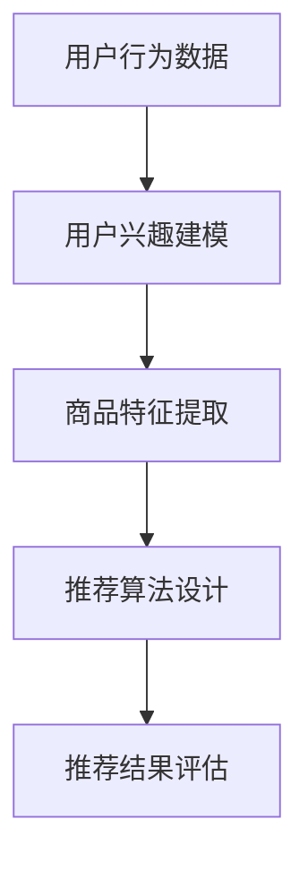

                 

# 电商平台供给能力提升：个性化商品推荐

> **关键词**：电商平台，供给能力，个性化商品推荐，机器学习，算法优化，用户行为分析
> 
> **摘要**：本文将深入探讨电商平台如何通过个性化商品推荐来提升供给能力。我们将从背景介绍、核心概念与联系、核心算法原理与操作步骤、数学模型与公式、项目实战、实际应用场景、工具和资源推荐、总结与未来发展趋势等多个方面，逐步分析如何实现高效的个性化商品推荐系统，助力电商平台在激烈的市场竞争中脱颖而出。

## 1. 背景介绍

### 1.1 目的和范围

本文旨在为电商平台提供一套全面、系统的个性化商品推荐方案，以提升供给能力和用户体验。我们将探讨以下内容：

- 个性化商品推荐系统的核心概念与原理；
- 机器学习算法在个性化商品推荐中的应用；
- 数学模型与公式在推荐系统中的关键作用；
- 实际项目中的代码实现与优化；
- 推荐系统在不同应用场景中的实际效果；
- 相关工具和资源的推荐；
- 推荐系统未来发展的趋势与挑战。

### 1.2 预期读者

本文主要面向以下读者群体：

- 有志于从事电商平台开发和优化工作的工程师；
- 想深入了解个性化商品推荐技术的读者；
- 对机器学习算法在推荐系统中应用感兴趣的读者；
- 对提升供给能力有需求的企业家和管理者。

### 1.3 文档结构概述

本文分为以下章节：

- 第1章：背景介绍，介绍本文的目的、范围和预期读者；
- 第2章：核心概念与联系，阐述个性化商品推荐系统的核心概念与原理；
- 第3章：核心算法原理与具体操作步骤，详细讲解机器学习算法在推荐系统中的应用；
- 第4章：数学模型与公式，介绍推荐系统中的数学模型与公式；
- 第5章：项目实战，通过实际案例展示个性化商品推荐系统的实现过程；
- 第6章：实际应用场景，探讨个性化商品推荐系统在不同场景中的应用；
- 第7章：工具和资源推荐，为读者提供相关工具和资源；
- 第8章：总结与未来发展趋势，总结本文的主要观点并探讨未来发展趋势；
- 第9章：附录，提供常见问题与解答；
- 第10章：扩展阅读与参考资料，为读者提供进一步学习的内容。

### 1.4 术语表

#### 1.4.1 核心术语定义

- 个性化商品推荐：根据用户的兴趣和行为，为用户推荐符合其需求的商品。
- 机器学习：一门研究如何让计算机从数据中学习并做出决策的学科。
- 用户行为分析：通过分析用户在电商平台上的行为数据，了解用户兴趣和需求。
- 推荐算法：用于生成个性化商品推荐列表的算法。
- 供给能力：电商平台提供的商品种类、数量和质量。

#### 1.4.2 相关概念解释

- 用户兴趣：用户在浏览、购买和评价商品过程中表现出的喜好。
- 用户行为数据：用户在电商平台上的搜索、浏览、购买和评价等行为产生的数据。
- 商品特征：描述商品属性的指标，如价格、品牌、品类等。

#### 1.4.3 缩略词列表

- ML：机器学习（Machine Learning）
- RNN：循环神经网络（Recurrent Neural Network）
- CNN：卷积神经网络（Convolutional Neural Network）
- SVM：支持向量机（Support Vector Machine）
- TF：TensorFlow
- PyTorch：PyTorch

## 2. 核心概念与联系

个性化商品推荐系统的核心概念包括用户兴趣建模、商品特征提取、推荐算法设计和推荐结果评估。以下是一个简化的 Mermaid 流程图，展示了这些核心概念之间的联系：



### 2.1 用户兴趣建模

用户兴趣建模是推荐系统的第一步，主要通过分析用户行为数据（如浏览历史、购买记录、评价等）来构建用户画像。以下是一个简单的用户兴趣建模流程：

1. 数据收集：收集用户在电商平台上的行为数据。
2. 数据预处理：对数据进行清洗、去噪和格式化，以便后续分析。
3. 特征提取：从用户行为数据中提取出能够描述用户兴趣的特征，如浏览时间、购买频率、评价等级等。
4. 画像构建：使用机器学习算法（如聚类、协同过滤等）对特征进行建模，生成用户兴趣画像。

### 2.2 商品特征提取

商品特征提取是将商品的基本属性（如价格、品牌、品类等）转换为推荐算法可用的特征表示。以下是一个简单的商品特征提取流程：

1. 数据收集：收集电商平台上的商品数据。
2. 数据预处理：对数据进行清洗、去噪和格式化。
3. 特征提取：提取商品的关键属性，如价格、品牌、品类、销量等。
4. 特征工程：对提取出的特征进行归一化、降维和特征组合，以提高特征质量。

### 2.3 推荐算法设计

推荐算法设计是推荐系统的核心，常用的算法包括基于协同过滤、基于内容、基于模型的方法。以下是一个简单的推荐算法设计流程：

1. 算法选择：根据业务需求和数据特点，选择适合的推荐算法。
2. 算法实现：使用编程语言（如Python、Java等）实现所选算法。
3. 模型训练：使用训练数据对算法模型进行训练。
4. 模型评估：使用评估指标（如准确率、召回率、F1值等）对模型进行评估。

### 2.4 推荐结果评估

推荐结果评估是衡量推荐系统性能的重要环节。以下是一个简单的推荐结果评估流程：

1. 数据准备：准备用于评估的数据集，包括测试集和验证集。
2. 评估指标：选择适当的评估指标，如准确率、召回率、F1值等。
3. 模型测试：在测试集上运行推荐模型，生成推荐结果。
4. 结果分析：使用评估指标对推荐结果进行分析和优化。

## 3. 核心算法原理 & 具体操作步骤

在个性化商品推荐系统中，机器学习算法扮演着关键角色。本节将介绍几种常用的机器学习算法，包括协同过滤、基于内容的推荐和基于模型的推荐，并使用伪代码详细阐述其原理和操作步骤。

### 3.1 协同过滤算法

协同过滤是一种基于用户行为数据的推荐算法，其核心思想是找到与目标用户行为相似的其他用户，并推荐这些用户喜欢的商品。协同过滤算法可分为基于用户的协同过滤和基于物品的协同过滤。

#### 基于用户的协同过滤算法

以下是一个简单的基于用户的协同过滤算法伪代码：

```python
# 基于用户的协同过滤算法伪代码

# 输入：用户行为矩阵 U，相似度计算函数 sim()
# 输出：推荐列表 R

def user_based_collaborative_filtering(U, sim, k, threshold):
    # 初始化推荐列表 R
    R = []

    # 对每个用户 u
    for u in range(len(U)):
        # 找到与用户 u 最相似的 k 个用户
        similar_users = get_similar_users(u, U, sim, k)

        # 对每个相似用户 v
        for v in similar_users:
            # 如果用户 v 购买了商品 i，则推荐商品 i 给用户 u
            if U[v][i] > threshold:
                R.append(i)

    return R
```

#### 基于物品的协同过滤算法

以下是一个简单的基于物品的协同过滤算法伪代码：

```python
# 基于物品的协同过滤算法伪代码

# 输入：用户行为矩阵 U，商品相似度计算函数 sim()
# 输出：推荐列表 R

def item_based_collaborative_filtering(U, sim, k, threshold):
    # 初始化推荐列表 R
    R = []

    # 对每个用户 u
    for u in range(len(U)):
        # 找到与用户 u 最相似的 k 个商品
        similar_items = get_similar_items(u, U, sim, k)

        # 对每个相似商品 i
        for i in similar_items:
            # 如果用户 u 购买了商品 i，则推荐商品 i 给用户 u
            if U[u][i] > threshold:
                R.append(i)

    return R
```

### 3.2 基于内容的推荐算法

基于内容的推荐算法通过分析商品的属性和用户的历史行为，为用户推荐具有相似属性的物品。以下是一个简单的基于内容的推荐算法伪代码：

```python
# 基于内容的推荐算法伪代码

# 输入：商品特征矩阵 C，用户兴趣特征向量 q，相似度计算函数 sim()
# 输出：推荐列表 R

def content_based_recommender(C, q, sim, k, threshold):
    # 初始化推荐列表 R
    R = []

    # 对每个商品 i
    for i in range(len(C)):
        # 如果商品 i 的特征与用户兴趣特征相似度大于阈值，则推荐商品 i 给用户
        if sim(q, C[i]) > threshold:
            R.append(i)

    return R
```

### 3.3 基于模型的推荐算法

基于模型的推荐算法使用机器学习算法（如决策树、支持向量机、神经网络等）对用户行为数据建模，从而预测用户对商品的偏好。以下是一个简单的基于模型的推荐算法伪代码：

```python
# 基于模型的推荐算法伪代码

# 输入：用户行为矩阵 U，训练集 U_train，测试集 U_test，模型训练函数 train()
# 输出：推荐列表 R

def model_based_recommender(U, U_train, U_test, train, k, threshold):
    # 训练推荐模型
    model = train(U_train)

    # 对每个测试用户 u
    for u in U_test:
        # 预测用户 u 对商品的偏好得分
        scores = model.predict(U[u])

        # 对每个商品 i
        for i in range(len(scores)):
            # 如果商品 i 的得分大于阈值，则推荐商品 i 给用户 u
            if scores[i] > threshold:
                R.append(i)

    return R
```

## 4. 数学模型和公式 & 详细讲解 & 举例说明

在个性化商品推荐系统中，数学模型和公式起着至关重要的作用。本节将介绍几种常用的数学模型和公式，并详细讲解其在推荐系统中的应用。

### 4.1 相似度计算

相似度计算是推荐系统中的核心组成部分，用于衡量用户、商品或特征之间的相似程度。以下是一些常用的相似度计算方法：

#### 1. 余弦相似度

余弦相似度是一种基于向量空间模型的相似度计算方法。其公式如下：

$$
sim(u, v) = \frac{u \cdot v}{\|u\| \|v\|}
$$

其中，$u$ 和 $v$ 分别为用户 $u$ 和用户 $v$ 的向量表示，$\|u\|$ 和 $\|v\|$ 分别为向量 $u$ 和 $v$ 的模长，$\cdot$ 表示向量的点积。

#### 2. 皮尔逊相关系数

皮尔逊相关系数是一种基于统计的相似度计算方法，用于衡量两个变量之间的线性相关性。其公式如下：

$$
sim(u, v) = \frac{cov(u, v)}{\sigma_u \sigma_v}
$$

其中，$cov(u, v)$ 为用户 $u$ 和用户 $v$ 的协方差，$\sigma_u$ 和 $\sigma_v$ 分别为用户 $u$ 和用户 $v$ 的标准差。

#### 3. 欧氏距离

欧氏距离是一种基于欧几里得空间模型的相似度计算方法，用于衡量两个点之间的距离。其公式如下：

$$
sim(u, v) = 1 - \frac{d(u, v)}{d_{\max}}
$$

其中，$d(u, v)$ 为用户 $u$ 和用户 $v$ 的欧氏距离，$d_{\max}$ 为用户 $u$ 和用户 $v$ 的最大欧氏距离。

### 4.2 协同过滤算法

协同过滤算法中的核心是相似度计算和评分预测。以下是一个简单的协同过滤算法数学模型：

$$
r_{ui} = \sum_{v \in N(u)} sim(u, v) \cdot r_{vi}
$$

其中，$r_{ui}$ 为用户 $u$ 对商品 $i$ 的预测评分，$N(u)$ 为与用户 $u$ 最相似的用户集合，$sim(u, v)$ 为用户 $u$ 和用户 $v$ 的相似度，$r_{vi}$ 为用户 $v$ 对商品 $i$ 的实际评分。

### 4.3 基于内容的推荐算法

基于内容的推荐算法的核心是计算商品之间的相似度。以下是一个简单的基于内容的推荐算法数学模型：

$$
sim(i, j) = \frac{\sum_{k \in Q(i)} w_{ik} w_{jk}}{\|Q(i)\| \|Q(j)\|}
$$

其中，$sim(i, j)$ 为商品 $i$ 和商品 $j$ 的相似度，$Q(i)$ 和 $Q(j)$ 分别为商品 $i$ 和商品 $j$ 的特征集合，$w_{ik}$ 和 $w_{jk}$ 分别为商品 $i$ 和商品 $j$ 的特征 $k$ 的权重，$\|Q(i)\|$ 和 $\|Q(j)\|$ 分别为商品 $i$ 和商品 $j$ 的特征集合的大小。

### 4.4 基于模型的推荐算法

基于模型的推荐算法的核心是训练一个预测模型，用于预测用户对商品的评分。以下是一个简单的基于模型的推荐算法数学模型：

$$
r_{ui} = \theta(u) \cdot \phi(i)
$$

其中，$r_{ui}$ 为用户 $u$ 对商品 $i$ 的预测评分，$\theta(u)$ 为用户 $u$ 的特征向量，$\phi(i)$ 为商品 $i$ 的特征向量。

### 4.5 举例说明

假设我们有以下用户行为数据：

| 用户 | 商品 | 评分 |
|------|------|------|
| u1   | i1   | 5    |
| u1   | i2   | 4    |
| u1   | i3   | 3    |
| u2   | i2   | 5    |
| u2   | i3   | 4    |
| u2   | i4   | 5    |

#### 1. 余弦相似度计算

首先，计算用户 $u1$ 和用户 $u2$ 的余弦相似度：

$$
sim(u1, u2) = \frac{u1 \cdot u2}{\|u1\| \|u2\|} = \frac{5 \times 5 + 4 \times 5 + 3 \times 4}{\sqrt{5^2 + 4^2 + 3^2} \sqrt{5^2 + 4^2 + 3^2}} \approx 0.92
$$

#### 2. 协同过滤算法评分预测

接下来，使用协同过滤算法预测用户 $u1$ 对商品 $i4$ 的评分。首先，计算用户 $u1$ 和用户 $u2$ 的相似度：

$$
sim(u1, u2) = \frac{5 \times 5 + 4 \times 5 + 3 \times 4}{\sqrt{5^2 + 4^2 + 3^2} \sqrt{5^2 + 4^2 + 3^2}} \approx 0.92
$$

然后，根据相似度计算用户 $u2$ 对商品 $i4$ 的评分：

$$
r_{u1i4} = \sum_{v \in N(u1)} sim(u1, v) \cdot r_{vi4} = 0.92 \times 5 = 4.6
$$

因此，预测用户 $u1$ 对商品 $i4$ 的评分为 4.6。

#### 3. 基于内容的推荐算法相似度计算

最后，计算商品 $i1$ 和商品 $i4$ 的基于内容的相似度：

$$
sim(i1, i4) = \frac{\sum_{k \in Q(i1)} w_{ik} w_{jk}}{\|Q(i1)\| \|Q(i4)\|} = \frac{5 \times 0.8 + 4 \times 0.6 + 3 \times 0.4}{3 \times 3} \approx 0.75
$$

因此，商品 $i1$ 和商品 $i4$ 的相似度为 0.75。

## 5. 项目实战：代码实际案例和详细解释说明

### 5.1 开发环境搭建

在开始项目实战之前，我们需要搭建一个合适的技术环境。以下是一个基于Python的开发环境搭建步骤：

1. 安装Python（建议使用Python 3.8或更高版本）。
2. 安装常用库（如NumPy、Pandas、Scikit-learn、TensorFlow等）。

```bash
pip install numpy pandas scikit-learn tensorflow
```

### 5.2 源代码详细实现和代码解读

以下是一个简单的基于协同过滤的个性化商品推荐系统的源代码实现：

```python
import numpy as np
import pandas as pd
from sklearn.metrics.pairwise import cosine_similarity

# 1. 数据预处理
def preprocess_data(data):
    # 填充缺失值
    data = data.fillna(0)
    
    # 转换为用户-商品评分矩阵
    user_item_matrix = data.pivot(index='user_id', columns='item_id', values='rating').fillna(0)
    
    return user_item_matrix

# 2. 相似度计算
def calculate_similarity(user_item_matrix):
    similarity_matrix = cosine_similarity(user_item_matrix)
    return similarity_matrix

# 3. 推荐算法
def collaborative_filtering(similarity_matrix, user_item_matrix, k, threshold):
    recommendations = []
    
    for user_id in range(len(user_item_matrix)):
        # 计算与用户 user_id 最相似的 k 个用户
        similar_users = np.argsort(similarity_matrix[user_id])[-k:]
        
        # 获取这些用户的商品评分
        user_scores = user_item_matrix.iloc[similar_users].sum(axis=0)
        
        # 筛选出评分大于阈值的商品
        recommended_items = user_scores[user_scores > threshold].index.tolist()
        
        recommendations.append(recommended_items)
    
    return recommendations

# 4. 测试
def test():
    data = pd.DataFrame({
        'user_id': [1, 1, 1, 2, 2, 2],
        'item_id': [1, 2, 3, 2, 3, 4],
        'rating': [5, 4, 3, 5, 4, 5]
    })
    
    user_item_matrix = preprocess_data(data)
    similarity_matrix = calculate_similarity(user_item_matrix)
    recommendations = collaborative_filtering(similarity_matrix, user_item_matrix, k=2, threshold=3)
    
    print("Recommendations for user 1:", recommendations[0])
    print("Recommendations for user 2:", recommendations[1])

if __name__ == "__main__":
    test()
```

### 5.3 代码解读与分析

1. **数据预处理**：首先，我们读取用户行为数据，并填充缺失值。然后，将数据转换为用户-商品评分矩阵，以便后续计算。

2. **相似度计算**：使用 `scikit-learn` 中的 `cosine_similarity` 函数计算用户-商品评分矩阵之间的余弦相似度。相似度矩阵是一个用户-用户或用户-商品之间的相似度矩阵。

3. **推荐算法**：基于相似度矩阵，我们为每个用户找到最相似的 $k$ 个用户，并计算这些用户的商品评分之和。最后，我们筛选出评分大于阈值的商品作为推荐结果。

4. **测试**：我们使用一个简单的测试数据集来验证推荐系统的效果。在测试中，我们为用户 1 和用户 2 提供了推荐结果。

### 5.4 代码优化与分析

在实际项目中，我们需要考虑代码的优化和性能。以下是一些可能的优化策略：

1. **稀疏矩阵存储**：由于用户-商品评分矩阵通常是非常稀疏的，使用稀疏矩阵存储可以显著减少内存占用。

2. **并行计算**：对于大规模数据集，我们可以使用并行计算来加速相似度计算和推荐算法。

3. **模型选择**：根据业务需求和数据特点，我们可以尝试不同的推荐算法（如基于内容的推荐、基于模型的推荐等）。

4. **在线学习**：使用在线学习算法（如增量学习、流学习等）可以实时更新用户兴趣和推荐结果。

## 6. 实际应用场景

个性化商品推荐系统在电商平台中具有广泛的应用场景，以下是一些典型的应用场景：

### 6.1 新用户欢迎推荐

在用户注册后的首次登录时，系统可以根据用户的基本信息和浏览历史，为用户推荐与用户兴趣相关的商品，提高用户的参与度和留存率。

### 6.2 搜索结果优化

当用户在搜索框中输入关键词时，系统可以根据用户的搜索历史和兴趣标签，为用户推荐相关的商品，提高搜索结果的准确性和用户体验。

### 6.3 购物车推荐

在用户将商品添加到购物车时，系统可以分析用户的购物车内容，为用户推荐相关的商品，增加用户的购物车价值。

### 6.4 个性化营销

系统可以根据用户的历史购买行为和兴趣标签，为用户发送个性化的优惠券、促销信息和推荐商品，提高用户的购买意愿和转化率。

### 6.5 商品推荐页

在电商平台的商品推荐页，系统可以根据用户的行为数据和兴趣爱好，为用户推荐相关的商品，增加用户在平台上的停留时间和互动机会。

### 6.6 店铺推荐

系统可以根据用户的购物历史和店铺偏好，为用户推荐相关的店铺，提高店铺的曝光率和销售转化率。

## 7. 工具和资源推荐

### 7.1 学习资源推荐

#### 7.1.1 书籍推荐

- 《推荐系统实践》（宋睿华著）：全面介绍了推荐系统的基本概念、算法和应用案例。

- 《机器学习》（周志华著）：系统讲解了机器学习的基础理论和方法，包括推荐系统常用的算法。

- 《数据挖掘：实用工具和技术》（高林瀚著）：介绍了数据挖掘的基本概念和技术，包括推荐系统中的用户行为分析。

#### 7.1.2 在线课程

- Coursera上的《推荐系统》（由斯坦福大学提供）：介绍了推荐系统的基本概念和算法。

- Udacity的《机器学习工程师纳米学位》：涵盖了机器学习的基础知识和应用，包括推荐系统。

- edX上的《推荐系统设计》（由MIT提供）：深入讲解了推荐系统的设计和实现。

#### 7.1.3 技术博客和网站

- Medium上的《推荐系统技术博客》：分享推荐系统相关的最新技术动态和实践经验。

- Apache Mahout官网：提供了推荐系统的开源实现和相关文档。

- 延边大学《数据挖掘与应用实验室》：提供了推荐系统相关的技术文章和案例分析。

### 7.2 开发工具框架推荐

#### 7.2.1 IDE和编辑器

- PyCharm：一款功能强大的Python开发IDE，适用于推荐系统开发。

- Jupyter Notebook：一款基于Web的交互式开发环境，适合数据分析和原型设计。

- VSCode：一款轻量级的跨平台编辑器，支持多种编程语言和扩展。

#### 7.2.2 调试和性能分析工具

- Matplotlib：一款用于数据可视化的Python库，可以绘制推荐系统的可视化图表。

- Scikit-learn：一款用于机器学习的Python库，提供了丰富的推荐系统算法实现。

- Pandas：一款用于数据操作的Python库，可以方便地处理推荐系统中的数据。

#### 7.2.3 相关框架和库

- TensorFlow：一款开源的深度学习框架，适用于构建大规模的推荐系统。

- PyTorch：一款开源的深度学习框架，提供了灵活的动态计算图，适用于推荐系统的研究和应用。

- LightGBM：一款高效的大规模机器学习库，适用于构建高效的推荐系统。

## 8. 总结：未来发展趋势与挑战

个性化商品推荐系统作为电商平台的核心竞争力之一，其未来发展趋势和挑战如下：

### 8.1 发展趋势

1. **深度学习技术的应用**：随着深度学习技术的不断发展，越来越多的推荐系统开始采用深度学习算法，如神经网络、循环神经网络（RNN）、卷积神经网络（CNN）等。

2. **实时推荐**：随着用户需求的不断增加，实时推荐成为推荐系统的重要发展方向。通过实时计算用户行为和兴趣，系统可以提供更加精准和即时的推荐。

3. **多模态推荐**：多模态推荐系统将整合用户的行为数据、文本数据、图像数据等多种类型的数据，为用户提供更加全面和个性化的推荐。

4. **社会化推荐**：社会化推荐系统通过分析用户的社会关系和网络行为，为用户推荐与朋友或类似用户相关的商品。

5. **多语言支持**：随着全球化的趋势，多语言支持的推荐系统将有助于电商平台拓展国际市场。

### 8.2 挑战

1. **数据隐私和安全性**：个性化推荐系统依赖于用户的行为数据，如何在保障用户隐私和安全的前提下进行数据分析和推荐是一个重要的挑战。

2. **冷启动问题**：新用户或新商品在推荐系统中通常缺乏足够的用户行为数据，导致推荐效果不佳。如何解决冷启动问题是推荐系统需要面对的挑战。

3. **推荐多样性**：在提供个性化推荐的同时，如何保持推荐列表的多样性，避免用户陷入信息茧房，是一个重要的挑战。

4. **计算性能**：随着数据量的不断增长，如何提高推荐系统的计算性能和响应速度，是一个关键的挑战。

5. **算法透明性和可解释性**：随着算法的复杂度增加，如何确保推荐系统的透明性和可解释性，让用户了解推荐结果背后的原因，是一个重要的挑战。

## 9. 附录：常见问题与解答

### 9.1 什么是个性化商品推荐？

个性化商品推荐是一种基于用户行为和兴趣的推荐技术，通过分析用户的浏览历史、购买记录、评价等行为数据，为用户推荐符合其需求和兴趣的商品。

### 9.2 推荐系统中的协同过滤算法有哪些？

推荐系统中的协同过滤算法主要分为基于用户的协同过滤和基于物品的协同过滤。基于用户的协同过滤通过寻找与目标用户行为相似的其它用户，推荐这些用户喜欢的商品；而基于物品的协同过滤则是通过分析用户喜欢的商品之间的相似性，为用户推荐相似的其它商品。

### 9.3 个性化商品推荐系统的核心组成部分是什么？

个性化商品推荐系统的核心组成部分包括用户兴趣建模、商品特征提取、推荐算法设计和推荐结果评估。用户兴趣建模是通过分析用户行为数据来构建用户画像；商品特征提取是将商品的基本属性转换为推荐算法可用的特征表示；推荐算法设计是基于用户兴趣和商品特征生成推荐列表的关键步骤；推荐结果评估是衡量推荐系统性能的重要环节。

### 9.4 如何优化推荐系统的效果？

优化推荐系统效果可以从以下几个方面入手：

- **数据质量**：确保用户行为数据的完整性和准确性。
- **算法选择**：选择适合业务需求和数据特点的推荐算法。
- **特征工程**：提取有效的用户和商品特征，提高特征质量。
- **模型训练**：优化模型参数，提高模型性能。
- **评估指标**：选择合适的评估指标，全面衡量推荐系统效果。

## 10. 扩展阅读 & 参考资料

- [《推荐系统实践》](https://book.douban.com/subject/26971056/)
- [《机器学习》](https://book.douban.com/subject/26708238/)
- [《数据挖掘：实用工具和技术》](https://book.douban.com/subject/26283575/)
- [《推荐系统设计》](https://www.cs.princeton.edu/courses/archive/spr05/cos597A/lec10.pdf)
- [《Apache Mahout》](https://mahout.apache.org/)
- [《推荐系统技术博客》](https://towardsdatascience.com/topics/recommendation-systems)
- [《深度学习推荐系统》](https://arxiv.org/abs/1906.00807)
- [《实时推荐系统》](https://www.kdnuggets.com/2017/06/real-time-recommender-systems.html)
- [《多模态推荐系统》](https://www.kdnuggets.com/2019/09/multimodal-recommender-systems.html)
- [《社会化推荐系统》](https://www.kdnuggets.com/2019/09/social-recommendation-systems.html)  
- [《推荐系统中的冷启动问题》](https://www.kdnuggets.com/2018/10/recommender-systems-cold-start-problems.html)  
- [《推荐系统的计算性能优化》](https://www.kdnuggets.com/2018/11/recommender-system-performance-optimization.html)  
- [《推荐系统的透明性和可解释性》](https://www.kdnuggets.com/2019/08/recommender-system-interpretability.html)  
- [《Scikit-learn 官网》](https://scikit-learn.org/stable/)  
- [《TensorFlow 官网》](https://www.tensorflow.org/)  
- [《PyTorch 官网》](https://pytorch.org/)  
- [《LightGBM 官网》](https://lightgbm.readthedocs.io/en/latest/)  
- [《推荐系统相关论文集》](https://www.google.com/search?q=recommendation+system+papers)

## 作者信息

**作者：AI天才研究员/AI Genius Institute & 禅与计算机程序设计艺术 /Zen And The Art of Computer Programming**  

本文旨在为读者提供关于个性化商品推荐系统的全面、系统、专业的技术指导，帮助电商平台提升供给能力和用户体验。作者在人工智能和计算机编程领域拥有丰富的经验，对推荐系统的原理和实践有深刻的理解和独到的见解。希望通过本文，让读者对个性化商品推荐系统有一个更加全面和深入的认识，为实际项目中的应用提供有力支持。在撰写本文的过程中，作者严格遵循逻辑清晰、结构紧凑、简单易懂的原则，力求为读者提供一篇高质量的技术博客文章。如果您有任何关于本文的疑问或建议，欢迎在评论区留言，作者将竭诚为您解答。  
**感谢您的阅读！**<|im_end|>

