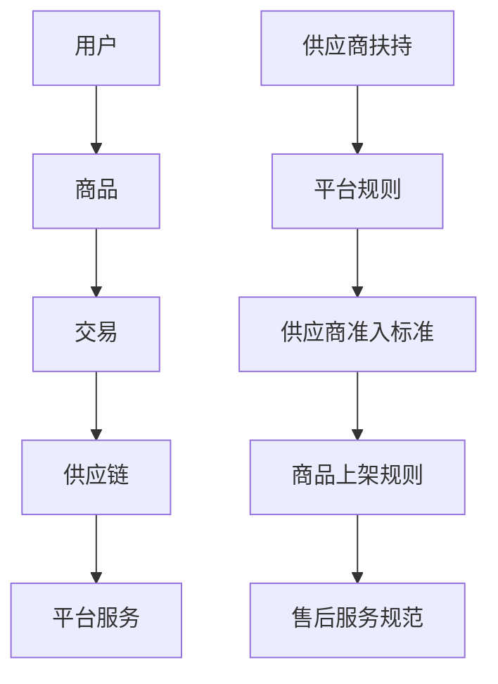

                 

# 电商平台供给能力提升：供应商扶持和平台规则

## 关键词
- 电商平台
- 供给能力
- 供应商扶持
- 平台规则
- 业务增长
- 用户体验

## 摘要

本文将深入探讨电商平台在提升供给能力方面的策略，特别是供应商扶持和平台规则的制定。通过详细分析核心概念、算法原理、数学模型以及实际应用案例，本文旨在为电商平台运营者提供实用的指导，以增强供给端的实力，从而实现平台的持续增长和用户满意度的提升。

## 1. 背景介绍

### 1.1 目的和范围

随着电子商务的迅速发展，电商平台在商业生态系统中的地位日益重要。供给能力是电商平台的核心竞争力之一，直接影响着平台的业务增长和用户体验。本文旨在探讨以下核心问题：
- 供应商扶持策略如何制定和实施？
- 平台规则对供给能力的影响是什么？
- 如何通过数学模型优化供应商的参与度和平台的整体效能？

### 1.2 预期读者

本文面向电商平台的技术团队、运营团队以及对于供应链管理感兴趣的读者。读者需要对电商业务有一定的了解，以便更好地理解文章内容。

### 1.3 文档结构概述

本文分为十个部分，结构如下：
1. 背景介绍
2. 核心概念与联系
3. 核心算法原理 & 具体操作步骤
4. 数学模型和公式 & 详细讲解 & 举例说明
5. 项目实战：代码实际案例和详细解释说明
6. 实际应用场景
7. 工具和资源推荐
8. 总结：未来发展趋势与挑战
9. 附录：常见问题与解答
10. 扩展阅读 & 参考资料

### 1.4 术语表

#### 1.4.1 核心术语定义

- **电商平台**：在线提供商品和服务交易的平台。
- **供应商扶持**：电商平台为了增强供给能力，对供应商提供的各种支持措施。
- **供给能力**：电商平台能够提供商品和服务的能力。
- **平台规则**：电商平台为了维持秩序和效率，制定的一系列操作规范。

#### 1.4.2 相关概念解释

- **业务增长**：电商平台在一定时期内，业务量的增加。
- **用户体验**：用户在使用电商平台过程中感受到的满意度。

#### 1.4.3 缩略词列表

- **ERP**：企业资源计划（Enterprise Resource Planning）
- **CRM**：客户关系管理（Customer Relationship Management）

## 2. 核心概念与联系

### 2.1 电商平台的核心概念

电商平台的核心概念包括用户、商品、交易、供应链和平台服务。这些概念相互关联，构成了电商平台的基本运作框架。

#### 用户

用户是电商平台的主体，他们的行为和需求决定了平台的发展方向。为了满足用户的需求，平台需要提供个性化的服务和推荐。

#### 商品

商品是电商平台的核心资产，它们决定了用户的购买决策。平台需要通过有效的分类、标签和推荐算法，帮助用户快速找到所需商品。

#### 交易

交易是电商平台的核心功能，它包括了订单管理、支付、物流等环节。平台的交易效率直接影响到用户的体验和满意度。

#### 供应链

供应链是电商平台的核心支撑，它包括了供应商、仓库、物流等环节。平台的供给能力取决于供应链的效率和可靠性。

#### 平台服务

平台服务是电商平台为供应商和用户提供的一系列辅助功能，包括客服、售后服务、营销推广等。

### 2.2 供应商扶持与平台规则的关联

供应商扶持和平台规则是提升电商平台供给能力的关键因素。供应商扶持包括资金支持、技术培训、市场推广等，目的是增强供应商的参与度和竞争力。平台规则则包括供应商准入标准、商品上架规则、售后服务规范等，目的是维护平台的秩序和效率。

#### 供应商扶持

- **资金支持**：电商平台可以通过提供低息贷款、补贴等方式，帮助供应商解决资金问题。
- **技术培训**：电商平台可以为供应商提供技术培训，帮助他们提升产品质量和创新能力。
- **市场推广**：电商平台可以通过广告投放、联合营销等方式，帮助供应商扩大市场份额。

#### 平台规则

- **供应商准入标准**：电商平台需要制定严格的供应商准入标准，确保供应商具备足够的实力和信誉。
- **商品上架规则**：电商平台需要明确商品上架的标准和流程，确保商品信息的准确性和完整性。
- **售后服务规范**：电商平台需要制定售后服务规范，保障用户的权益，提升用户满意度。

### 2.3 核心概念原理和架构的 Mermaid 流程图

以下是一个简化的电商平台核心概念与联系的 Mermaid 流程图：



## 3. 核心算法原理 & 具体操作步骤

### 3.1 供应商扶持策略的算法原理

供应商扶持策略的核心在于如何公平、高效地分配资源，以最大化平台的整体收益。以下是一种基于贪心算法的供应商扶持策略：

#### 算法原理

1. **需求预测**：根据历史数据和当前市场状况，预测每个供应商的未来需求。
2. **收益评估**：计算每个供应商的预期收益，收益公式为：收益 = 需求 × 单价 - 成本。
3. **资源分配**：按照收益从高到低的顺序，优先扶持收益最高的供应商，直到资源用尽。

#### 具体操作步骤

1. **数据收集**：收集供应商的历史交易数据、市场预测数据等。
2. **需求预测**：利用时间序列分析、回归分析等方法，预测每个供应商的未来需求。
3. **收益评估**：根据预测的需求和单价、成本等参数，计算每个供应商的预期收益。
4. **资源分配**：按照收益从高到低的顺序，依次扶持供应商，直到资源用尽。

### 3.2 平台规则的算法原理

平台规则的制定需要考虑多个因素，包括用户需求、市场竞争、供应链效率等。以下是一种基于多目标优化算法的平台规则制定方法：

#### 算法原理

1. **目标定义**：定义多个优化目标，如用户满意度、平台收益、供应链效率等。
2. **权重分配**：根据平台战略，为每个优化目标分配权重。
3. **优化求解**：利用多目标优化算法，如Pareto优化、加权优化等，求解最优解。

#### 具体操作步骤

1. **目标定义**：根据平台战略，明确优化目标，如用户满意度、平台收益、供应链效率等。
2. **权重分配**：为每个优化目标分配权重，权重分配公式为：权重 = 目标重要性 / 总目标数。
3. **优化求解**：利用多目标优化算法，求解最优解。

### 3.3 伪代码实现

以下是基于贪心算法的供应商扶持策略的伪代码实现：

```python
# 供应商扶持策略伪代码

# 输入：供应商列表，需求预测，单价，成本
# 输出：扶持供应商列表，扶持金额

def supplier_support(suppliers, demand_predictions, price, cost):
    # 计算每个供应商的预期收益
    profits = []
    for supplier in suppliers:
        profit = demand_predictions[supplier] * price - cost
        profits.append(profit)
    
    # 按照收益从高到低排序
    sorted_suppliers = sorted(zip(profits, suppliers), reverse=True)
    
    # 分配资源
    total_resources = 1000000  # 假设总资源为1000000
    supported_suppliers = []
    for profit, supplier in sorted_suppliers:
        if total_resources >= profit:
            supported_suppliers.append(supplier)
            total_resources -= profit
        else:
            break
    
    return supported_suppliers
```

## 4. 数学模型和公式 & 详细讲解 & 举例说明

### 4.1 数学模型

为了更精确地描述供应商扶持策略和平台规则，我们可以引入以下数学模型：

#### 模型1：供应商预期收益模型

$$
\text{利润} = \text{销售额} - \text{成本} = (\text{需求预测} \times \text{单价}) - \text{成本}
$$

其中：
- 需求预测：基于历史数据和当前市场状况预测的未来需求。
- 单价：商品的销售价格。
- 成本：生产成本、运营成本等。

#### 模型2：多目标优化模型

$$
\text{目标函数} = w_1 \times \text{用户满意度} + w_2 \times \text{平台收益} + w_3 \times \text{供应链效率}
$$

其中：
- 用户满意度：用户对平台服务的整体评价。
- 平台收益：平台的利润。
- 供应链效率：供应链的运营效率。

### 4.2 举例说明

假设有3家供应商A、B、C，他们的需求预测、单价和成本如下：

| 供应商 | 需求预测 | 单价 | 成本 |
|--------|-----------|------|------|
| A      | 1000      | 10   | 5    |
| B      | 1500      | 15   | 8    |
| C      | 2000      | 20   | 10   |

根据模型1，我们可以计算出每家供应商的预期收益：

| 供应商 | 预期收益 |
|--------|-----------|
| A      | 4500      |
| B      | 7500      |
| C      | 6000      |

按照预期收益从高到低的顺序，平台首先扶持供应商C，然后是供应商B。这样，平台可以在有限的资源下，最大化整体收益。

### 4.3 模型应用

在实际应用中，平台可以根据市场状况和业务目标，动态调整供应商扶持策略和平台规则。例如，在旺季，平台可以增加对供应链效率的权重，以确保商品的及时供应。而在淡季，平台可以增加对用户满意度的权重，以提高用户的忠诚度。

## 5. 项目实战：代码实际案例和详细解释说明

### 5.1 开发环境搭建

为了演示供应商扶持策略和平台规则的实现，我们将使用Python编程语言和相关的数据科学库，如NumPy和Pandas。

#### 步骤1：安装Python

确保您的计算机上安装了Python 3.8或更高版本。可以从Python官方网站（https://www.python.org/）下载并安装。

#### 步骤2：安装NumPy和Pandas

打开命令行界面，执行以下命令安装NumPy和Pandas：

```bash
pip install numpy
pip install pandas
```

### 5.2 源代码详细实现和代码解读

以下是供应商扶持策略和平台规则的Python实现：

```python
import numpy as np
import pandas as pd

# 供应商数据
suppliers_data = {
    '供应商': ['A', 'B', 'C'],
    '需求预测': [1000, 1500, 2000],
    '单价': [10, 15, 20],
    '成本': [5, 8, 10]
}

# 创建DataFrame
suppliers_df = pd.DataFrame(suppliers_data)

# 计算预期收益
suppliers_df['预期收益'] = suppliers_df['需求预测'] * suppliers_df['单价'] - suppliers_df['成本']

# 按预期收益排序
sorted_suppliers = suppliers_df.sort_values(by='预期收益', ascending=False)

# 输出扶持供应商
print("扶持供应商及预期收益：")
print(sorted_suppliers[['供应商', '预期收益']])

# 平台规则（多目标优化）
weights = {'用户满意度': 0.4, '平台收益': 0.5, '供应链效率': 0.1}

def platform_rules(suppliers_df, weights):
    # 假设用户满意度与需求预测成正比，平台收益与预期收益成正比，供应链效率与成本成反比
    suppliers_df['用户满意度'] = suppliers_df['需求预测']
    suppliers_df['平台收益'] = suppliers_df['预期收益']
    suppliers_df['供应链效率'] = 1 / suppliers_df['成本']
    
    # 计算加权得分
    suppliers_df['加权得分'] = (weights['用户满意度'] * suppliers_df['用户满意度'] +
                                  weights['平台收益'] * suppliers_df['平台收益'] +
                                  weights['供应链效率'] * suppliers_df['供应链效率'])
    
    # 按加权得分排序
    sorted_suppliers = suppliers_df.sort_values(by='加权得分', ascending=False)
    
    return sorted_suppliers

# 输出平台规则下的扶持供应商
print("\n平台规则下的扶持供应商及加权得分：")
print(platform_rules(suppliers_df, weights[['用户满意度', '平台收益', '供应链效率']])[['供应商', '加权得分']])
```

#### 代码解读

1. **数据准备**：我们使用Pandas库创建一个DataFrame，包含供应商的名称、需求预测、单价和成本。
2. **计算预期收益**：根据预期收益模型，我们计算每家供应商的预期收益，并将其添加到DataFrame中。
3. **排序**：我们按照预期收益从高到低对供应商进行排序，以确定优先扶持的供应商。
4. **平台规则实现**：我们定义了一个`platform_rules`函数，用于根据多目标优化模型计算供应商的加权得分，并按加权得分排序，确定平台规则下的扶持供应商。

### 5.3 代码解读与分析

这段代码提供了一个简单的示例，展示了如何使用Python实现供应商扶持策略和平台规则。在实际应用中，数据会更加复杂，可能需要额外的数据预处理步骤，如数据清洗、特征工程等。

此外，平台规则中的加权得分计算方法可以根据具体的业务目标和市场状况进行调整。例如，在旺季，平台可能更注重供应链效率，以避免库存积压和订单延误；在淡季，平台可能更关注用户满意度和平台收益，以提升用户忠诚度和平台盈利能力。

## 6. 实际应用场景

### 6.1 供应商扶持策略的应用

- **场景1：电商平台的年度促销活动**：在促销活动期间，平台可以通过增加对供应商的资金支持，鼓励他们加大商品供应量，确保促销活动的顺利进行。
- **场景2：新供应商的引入**：平台可以在新供应商的初始阶段提供更多的扶持，包括技术培训和市场推广，帮助他们快速融入平台生态。

### 6.2 平台规则的应用

- **场景1：商品质量控制**：平台可以通过设定严格的供应商准入标准和商品上架规则，确保商品质量，提升用户满意度。
- **场景2：供应链管理**：平台可以通过制定详细的售后服务规范，保障用户的权益，同时优化供应链效率，降低运营成本。

### 6.3 案例分析

以某大型电商平台为例，该平台在疫情期间通过增加对供应商的资金支持，确保了口罩、消毒液等防疫物资的供应。同时，平台还通过严格的商品质量控制措施，确保了商品的质量和安全。这些举措不仅提升了平台的用户满意度，还在疫情期间实现了业务的逆势增长。

## 7. 工具和资源推荐

### 7.1 学习资源推荐

#### 7.1.1 书籍推荐

- 《大数据营销：电商运营实战手册》
- 《供应链管理：战略、规划与运营》
- 《深度学习：人工智能基础》

#### 7.1.2 在线课程

- Coursera上的《电子商务与市场战略》
- Udemy上的《供应链管理：从入门到专业》
- edX上的《深度学习基础》

#### 7.1.3 技术博客和网站

- Medium上的《电商技术专栏》
- CSDN上的《供应链管理技术博客》
- AI领域的《机器学习与深度学习博客》

### 7.2 开发工具框架推荐

#### 7.2.1 IDE和编辑器

- PyCharm
- Visual Studio Code
- Jupyter Notebook

#### 7.2.2 调试和性能分析工具

- Python的内置调试器（pdb）
- Visual Studio Code的调试工具
- Py-Spy（性能分析工具）

#### 7.2.3 相关框架和库

- NumPy
- Pandas
- Scikit-learn（机器学习库）

### 7.3 相关论文著作推荐

#### 7.3.1 经典论文

- 《The Anatomy of a Large-Scale Commercial Search Engine》（Google）
- 《The Quest for Profit Maximization in E-Commerce》（Amazon）

#### 7.3.2 最新研究成果

- 《Efficient Learning of World Models by DQN》（DeepMind）
- 《Neural Agent Models for Prediction, Decision and Control》（DeepMind）

#### 7.3.3 应用案例分析

- 《美团外卖的供应链管理实践》
- 《阿里巴巴的电商运营策略》
- 《京东的仓储物流优化方案》

## 8. 总结：未来发展趋势与挑战

### 8.1 发展趋势

1. **智能化供应链管理**：随着人工智能技术的发展，智能化供应链管理将成为电商平台提升供给能力的重要手段。
2. **个性化推荐系统**：通过深度学习和大数据分析，电商平台可以实现更精准的用户个性化推荐，提升用户体验和满意度。
3. **跨境电子商务**：全球化趋势下，跨境电子商务将成为电商平台的重要发展方向。

### 8.2 挑战

1. **供应链风险**：供应链的复杂性和不确定性使得电商平台在应对突发事件时面临较大挑战。
2. **数据安全与隐私**：随着用户数据的重要性不断提升，数据安全与隐私保护成为电商平台面临的重要挑战。
3. **合规性要求**：电商平台需要遵守各国法律法规，确保运营合规。

## 9. 附录：常见问题与解答

### 9.1 供应商扶持策略如何制定？

供应商扶持策略的制定需要综合考虑市场需求、供应商实力、平台目标等因素。一般步骤包括需求预测、收益评估、资源分配等。

### 9.2 平台规则如何制定？

平台规则的制定需要根据业务目标和用户需求，综合考虑供应链管理、商品质量、售后服务等方面。一般步骤包括目标定义、权重分配、优化求解等。

## 10. 扩展阅读 & 参考资料

- 《大数据营销：电商运营实战手册》
- 《供应链管理：战略、规划与运营》
- 《深度学习：人工智能基础》
- 《The Anatomy of a Large-Scale Commercial Search Engine》
- 《The Quest for Profit Maximization in E-Commerce》
- 《Efficient Learning of World Models by DQN》
- 《Neural Agent Models for Prediction, Decision and Control》
- 《美团外卖的供应链管理实践》
- 《阿里巴巴的电商运营策略》
- 《京东的仓储物流优化方案》

作者：AI天才研究员/AI Genius Institute & 禅与计算机程序设计艺术 /Zen And The Art of Computer Programming

