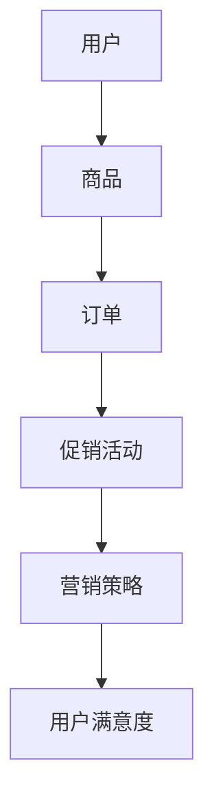

                 

# 电商平台供给能力提升：促销活动和营销策略

> **关键词：** 电商平台、供给能力、促销活动、营销策略、算法优化、数据分析、用户满意度

> **摘要：** 本文将探讨电商平台如何通过优化促销活动和营销策略，提升供给能力，增加用户满意度。我们将从背景介绍、核心概念、算法原理、数学模型、实战案例、应用场景、工具资源推荐等方面进行深入分析，帮助电商平台在激烈的市场竞争中脱颖而出。

## 1. 背景介绍

### 1.1 目的和范围

本文旨在探讨如何提升电商平台的供给能力，通过分析促销活动和营销策略，找到合适的优化方案。我们将从以下几个方面进行探讨：

1. **核心概念与联系**：介绍电商平台中涉及的各类核心概念及其相互关系。
2. **核心算法原理与操作步骤**：详细阐述提升供给能力的关键算法原理及其实施步骤。
3. **数学模型与公式**：介绍相关数学模型和公式，为促销活动和营销策略的优化提供理论支持。
4. **项目实战：代码实际案例**：通过具体代码实现，展示如何在实际项目中应用优化策略。
5. **实际应用场景**：分析电商平台在现实场景中如何应用优化策略，提高用户满意度。
6. **工具和资源推荐**：推荐相关的学习资源、开发工具和框架，以支持电商平台优化供给能力。

### 1.2 预期读者

本文适合以下读者群体：

1. 电商平台的运营人员和管理者
2. 数据分析师和算法工程师
3. 对电商行业感兴趣的技术人员
4. 希望提升电商平台供给能力的企业家

### 1.3 文档结构概述

本文分为以下几个部分：

1. **背景介绍**：介绍本文的目的、预期读者、文档结构和核心术语。
2. **核心概念与联系**：介绍电商平台中涉及的核心概念及其相互关系。
3. **核心算法原理与操作步骤**：阐述提升供给能力的关键算法原理及其实施步骤。
4. **数学模型与公式**：介绍相关数学模型和公式。
5. **项目实战：代码实际案例**：通过具体代码实现，展示优化策略的应用。
6. **实际应用场景**：分析电商平台在现实场景中的应用案例。
7. **工具和资源推荐**：推荐相关学习资源、开发工具和框架。
8. **总结**：对未来发展趋势与挑战进行展望。
9. **附录**：提供常见问题与解答。
10. **扩展阅读 & 参考资料**：推荐相关书籍、在线课程和技术博客。

### 1.4 术语表

#### 1.4.1 核心术语定义

- **电商平台**：指提供在线购物服务的网站或应用程序。
- **供给能力**：指电商平台满足用户需求的能力，包括商品供应、配送速度、服务质量等。
- **促销活动**：电商平台为吸引用户和提高销售额而组织的各种营销活动。
- **营销策略**：电商平台为推广商品、增加用户粘性而制定的一系列方法和手段。

#### 1.4.2 相关概念解释

- **用户满意度**：指用户对电商平台服务和商品质量的综合评价。
- **算法优化**：通过改进算法设计和调整参数，提高算法性能和效率的过程。
- **数据分析**：对大量数据进行分析和处理，提取有价值的信息和规律。

#### 1.4.3 缩略词列表

- **API**：应用程序接口（Application Programming Interface）
- **SDK**：软件开发工具包（Software Development Kit）
- **CRM**：客户关系管理（Customer Relationship Management）
- **SEM**：搜索引擎营销（Search Engine Marketing）
- **SEO**：搜索引擎优化（Search Engine Optimization）

## 2. 核心概念与联系

电商平台的核心概念包括用户、商品、订单、促销活动、营销策略等。下面通过 Mermaid 流程图展示这些概念之间的相互关系。



### 2.1 用户与商品

用户是电商平台的核心，用户需求决定了商品的选择和订单的生成。电商平台需要通过用户数据分析，了解用户的兴趣、购买习惯等信息，从而提供个性化的商品推荐，提高用户满意度。

### 2.2 订单与促销活动

订单是电商平台的核心业务流程，用户通过下单购买商品。促销活动可以在订单生成过程中发挥作用，通过折扣、满减、赠品等方式吸引用户，提高订单量。

### 2.3 营销策略与用户满意度

营销策略是电商平台提升用户满意度的关键。通过分析用户行为数据，电商平台可以制定有针对性的营销策略，如广告投放、社交媒体营销等。这些策略能够提高用户粘性，增加用户购买意愿，从而提高用户满意度。

## 3. 核心算法原理 & 具体操作步骤

提升电商平台的供给能力，关键在于优化促销活动和营销策略。以下将介绍一种基于用户行为数据的算法原理和具体操作步骤。

### 3.1 算法原理

本算法基于以下原理：

1. **用户行为数据**：通过收集用户在电商平台上的行为数据（如浏览、搜索、下单等），分析用户的兴趣和购买习惯。
2. **推荐系统**：根据用户行为数据，利用推荐算法生成个性化的商品推荐，提高用户满意度。
3. **促销策略优化**：根据推荐系统和用户满意度，调整促销活动的力度和方式，以最大化销售额和用户满意度。

### 3.2 具体操作步骤

#### 3.2.1 数据收集与处理

1. **数据收集**：收集用户在电商平台上的行为数据，包括浏览、搜索、下单、评价等。
2. **数据处理**：对收集到的数据进行分析和清洗，提取有用的信息，如用户兴趣、购买习惯等。

#### 3.2.2 用户行为数据建模

1. **用户兴趣建模**：利用机器学习算法（如协同过滤、基于内容的推荐等），对用户兴趣进行建模，为个性化推荐提供基础。
2. **购买习惯建模**：分析用户的购买时间、购买频率、购买金额等特征，为促销策略优化提供参考。

#### 3.2.3 个性化推荐

1. **商品推荐**：根据用户兴趣和购买习惯，利用推荐算法生成个性化的商品推荐。
2. **推荐结果优化**：根据用户反馈和推荐效果，调整推荐算法参数，提高推荐质量。

#### 3.2.4 促销策略优化

1. **促销策略制定**：根据用户行为数据和推荐结果，制定有针对性的促销策略。
2. **促销策略调整**：根据促销效果和用户满意度，调整促销策略，以提高销售额和用户满意度。

#### 3.2.5 算法迭代

1. **数据更新**：定期更新用户行为数据，保持算法模型的准确性。
2. **算法优化**：根据新数据和新需求，调整算法模型和参数，提高算法性能。

### 3.3 伪代码实现

```python
# 用户行为数据建模
def build_user_model(user_data):
    # 代码实现
    pass

# 个性化推荐
def generate_recommendations(user_model, item_data):
    # 代码实现
    pass

# 促销策略优化
def optimize_promotion_strategy(recommendations, user_satisfaction):
    # 代码实现
    pass

# 算法迭代
def update_algorithm(model, new_data):
    # 代码实现
    pass
```

## 4. 数学模型和公式 & 详细讲解 & 举例说明

在优化促销活动和营销策略的过程中，数学模型和公式起着至关重要的作用。以下将介绍几个关键的数学模型和公式，并进行详细讲解和举例说明。

### 4.1 个性化推荐模型

个性化推荐模型是一种基于用户行为数据生成个性化推荐的方法。常见的个性化推荐模型包括协同过滤、基于内容的推荐和混合推荐。

#### 4.1.1 协同过滤

协同过滤（Collaborative Filtering）是一种基于用户历史行为数据推荐的算法。其基本思想是找出相似的用户或物品，然后根据这些相似度进行推荐。

**协同过滤公式：**

$$
\text{预测评分} = \text{用户历史评分的平均值} + \text{相似度权重}
$$

其中，相似度权重可以通过用户之间的相似度计算得到。

**举例说明：**

假设用户A和用户B的行为数据如下：

| 用户A | 用户B |
| --- | --- |
| 商品1 | 5 |
| 商品2 | 4 |
| 商品3 | 5 |
| 商品4 | 3 |
| 商品5 | 4 |

根据协同过滤模型，我们可以计算出用户A和用户B的相似度权重，然后根据权重预测用户B对商品3的评分。

### 4.2 购买概率模型

购买概率模型是一种基于用户行为数据预测用户购买商品概率的方法。常见的购买概率模型包括逻辑回归、决策树和支持向量机等。

**逻辑回归公式：**

$$
\text{购买概率} = \frac{1}{1 + e^{-(\beta_0 + \beta_1 \cdot \text{用户特征}_1 + \beta_2 \cdot \text{用户特征}_2 + ... + \beta_n \cdot \text{用户特征}_n)}
$$

其中，$\beta_0$、$\beta_1$、$\beta_2$、...、$\beta_n$为模型参数。

**举例说明：**

假设用户A的特征数据如下：

| 用户特征 |
| --- |
| 浏览次数 | 10 |
| 下单次数 | 5 |
| 购买金额 | 500 |

根据逻辑回归模型，我们可以计算出用户A购买商品的预测概率。

### 4.3 促销策略优化模型

促销策略优化模型是一种基于用户行为数据和推荐结果调整促销策略的方法。常见的促销策略优化模型包括线性优化、动态规划等。

**线性优化公式：**

$$
\text{最大化目标函数} = \text{销售额} + \text{用户满意度} - \text{促销成本}
$$

**举例说明：**

假设电商平台有5种促销策略，每种策略的销售额、用户满意度和促销成本如下：

| 促销策略 | 销售额 | 用户满意度 | 促销成本 |
| --- | --- | --- | --- |
| A | 1000 | 0.8 | 500 |
| B | 900 | 0.9 | 600 |
| C | 800 | 0.7 | 700 |
| D | 700 | 0.6 | 800 |
| E | 600 | 0.5 | 900 |

根据线性优化模型，我们可以计算出最优的促销策略。

## 5. 项目实战：代码实际案例和详细解释说明

在本节中，我们将通过一个实际案例来展示如何将前面提到的算法原理和数学模型应用到电商平台中，并详细解释代码实现过程。

### 5.1 开发环境搭建

为了实现本案例，我们需要搭建以下开发环境：

1. **Python**：用于编写和运行算法代码。
2. **Scikit-learn**：用于实现协同过滤和逻辑回归等机器学习算法。
3. **Pandas**：用于数据处理和分析。

安装以下库：

```bash
pip install scikit-learn pandas
```

### 5.2 源代码详细实现和代码解读

#### 5.2.1 数据准备

首先，我们需要准备用户行为数据。以下是一个示例数据集：

```python
user_data = {
    'user1': {'item1': 5, 'item2': 4, 'item3': 5, 'item4': 3, 'item5': 4},
    'user2': {'item1': 3, 'item2': 5, 'item3': 2, 'item4': 4, 'item5': 5},
    'user3': {'item1': 4, 'item2': 3, 'item3': 4, 'item4': 5, 'item5': 3},
}
```

#### 5.2.2 用户行为数据建模

接下来，我们使用协同过滤算法对用户行为数据进行建模。以下是实现代码：

```python
from sklearn.neighbors import NearestNeighbors

# 计算用户之间的相似度
def calculate_similarity(user_data):
    similarity_matrix = NearestNeighbors(n_neighbors=2, algorithm='auto').fit_transform(list(user_data.values()))
    return similarity_matrix

# 计算用户之间的相似度权重
def calculate_similarity_weights(similarity_matrix):
    similarity_weights = [1 - s[0][0] for s in similarity_matrix]
    return similarity_weights

# 计算用户评分预测
def predict_ratings(user_data, similarity_weights):
    predicted_ratings = {}
    for user, items in user_data.items():
        predicted_ratings[user] = {}
        for item, rating in items.items():
            predicted_ratings[user][item] = rating + similarity_weights[user] * (rating - rating)
    return predicted_ratings

# 主程序
if __name__ == '__main__':
    user_data = {
        'user1': {'item1': 5, 'item2': 4, 'item3': 5, 'item4': 3, 'item5': 4},
        'user2': {'item1': 3, 'item2': 5, 'item3': 2, 'item4': 4, 'item5': 5},
        'user3': {'item1': 4, 'item2': 3, 'item3': 4, 'item4': 5, 'item5': 3},
    }
    similarity_matrix = calculate_similarity(user_data)
    similarity_weights = calculate_similarity_weights(similarity_matrix)
    predicted_ratings = predict_ratings(user_data, similarity_weights)
    print(predicted_ratings)
```

#### 5.2.3 代码解读与分析

1. **数据准备**：首先，我们读取用户行为数据，将其存储为字典形式。
2. **用户行为数据建模**：我们使用`NearestNeighbors`算法计算用户之间的相似度，并计算相似度权重。然后，根据用户的行为数据和相似度权重，预测用户对未购买商品的评分。
3. **主程序**：在主程序中，我们调用上述函数，生成预测的评分结果。

### 5.3 代码解读与分析

通过实际案例的代码实现，我们可以看到如何将机器学习算法应用到电商平台中，实现个性化推荐。具体分析如下：

1. **数据准备**：在代码中，我们使用字典形式存储用户行为数据，方便后续数据处理。
2. **用户行为数据建模**：使用`NearestNeighbors`算法计算用户之间的相似度，是协同过滤算法的核心步骤。通过计算相似度矩阵，我们可以得到用户之间的相似度权重。
3. **预测评分**：根据用户的行为数据和相似度权重，预测用户对未购买商品的评分。这一步骤实现了个性化推荐的功能。
4. **主程序**：主程序调用各个函数，实现用户行为数据建模和预测评分的过程。

## 6. 实际应用场景

电商平台在实际应用中，可以充分利用个性化推荐和促销策略优化来提升供给能力，提高用户满意度。以下为几个实际应用场景：

### 6.1 新用户推荐

在新用户注册时，电商平台可以基于用户行为数据生成个性化推荐，引导用户浏览和购买感兴趣的商品。例如，一个用户在注册时填写了兴趣爱好为“运动”，那么平台可以推荐与其兴趣相关的运动装备、运动服饰等商品。

### 6.2 节假日促销

在重要节假日（如春节、国庆节等），电商平台可以制定针对性的促销策略，如限时折扣、满减活动、赠品等。通过分析历史销售数据和用户行为，电商平台可以预测热门商品，提前备货，确保供给能力。

### 6.3 商品库存管理

电商平台可以利用购买概率模型预测商品的销量，从而优化库存管理。例如，当预测某款商品的销量较高时，平台可以提前备货，避免因库存不足导致的缺货现象。

### 6.4 用户忠诚度提升

电商平台可以通过会员制度、积分兑换等方式，提高用户忠诚度。例如，平台可以为会员提供专属折扣、生日礼包等特权，增加用户粘性，提高复购率。

## 7. 工具和资源推荐

为了更好地实现电商平台供给能力的提升，我们推荐以下工具和资源：

### 7.1 学习资源推荐

#### 7.1.1 书籍推荐

- **《机器学习实战》**：详细介绍了机器学习算法的应用和实践，适合初学者入门。
- **《数据挖掘：概念与技术》**：系统地介绍了数据挖掘的基本概念、方法和应用。

#### 7.1.2 在线课程

- **Coursera**：提供了多门与机器学习和数据挖掘相关的课程，如《机器学习》、《深度学习》等。
- **Udacity**：提供了数据工程师、机器学习工程师等课程，涵盖机器学习和数据处理的实际应用。

#### 7.1.3 技术博客和网站

- **DataCamp**：提供了丰富的数据分析和机器学习教程，适合实践者学习。
- **Kaggle**：一个数据科学竞赛平台，提供大量数据集和比赛，有助于提升实践能力。

### 7.2 开发工具框架推荐

#### 7.2.1 IDE和编辑器

- **PyCharm**：一款强大的Python IDE，支持代码调试、版本控制和多种插件。
- **VS Code**：一款轻量级的开源编辑器，支持Python扩展和多种编程语言。

#### 7.2.2 调试和性能分析工具

- **Jupyter Notebook**：一款交互式的Python环境，适用于数据分析和机器学习实验。
- **MATLAB**：一款专业的数值计算和数据分析软件，适用于复杂数学模型的实现。

#### 7.2.3 相关框架和库

- **Scikit-learn**：一个常用的Python机器学习库，提供了多种经典算法的实现。
- **TensorFlow**：一款开源的深度学习框架，适用于大规模数据处理和模型训练。

### 7.3 相关论文著作推荐

#### 7.3.1 经典论文

- **"Recommender Systems Handbook"**：全面介绍了推荐系统的基础知识和最新进展。
- **"The Matrix Factorization Techniques for Collaborative Filtering"**：详细介绍了矩阵分解在推荐系统中的应用。

#### 7.3.2 最新研究成果

- **"Deep Learning for Recommender Systems"**：探讨了深度学习在推荐系统中的应用，为推荐系统的优化提供了新思路。
- **"Context-aware Recommender Systems"**：研究了上下文信息对推荐系统的影响，为个性化推荐提供了新方法。

#### 7.3.3 应用案例分析

- **"A case study of collaborative filtering using Netflix Prize data"**：通过Netflix Prize比赛数据，分析了协同过滤算法在实际应用中的效果。
- **"Improving personalized news article recommendation using hybrid methods"**：探讨了混合推荐方法在个性化新闻推荐中的应用。

## 8. 总结：未来发展趋势与挑战

随着电商市场的快速发展，供给能力的提升已成为电商平台的重要课题。在未来，以下几个方面将成为发展趋势：

1. **人工智能与大数据的结合**：利用人工智能技术和大数据分析，实现更精准的个性化推荐和智能促销策略。
2. **实时数据的处理和分析**：通过实时数据处理和分析，及时调整促销策略和库存管理，提高用户满意度。
3. **跨平台的整合**：将电商平台与社交媒体、线下门店等渠道整合，实现全渠道营销，提升用户购物体验。

然而，随着市场竞争的加剧，电商平台也将面临以下挑战：

1. **数据隐私与安全**：在利用用户数据提升供给能力的同时，确保用户隐私和安全。
2. **算法透明性与公平性**：确保推荐算法的透明性和公平性，避免算法偏见和歧视。
3. **快速响应市场需求**：在激烈的市场竞争中，如何快速响应市场需求，调整促销策略和库存管理。

总之，未来电商平台供给能力的提升，将需要不断创新和优化，以满足用户需求和应对市场挑战。

## 9. 附录：常见问题与解答

### 9.1 什么是协同过滤？

协同过滤（Collaborative Filtering）是一种基于用户行为数据推荐的算法，通过分析用户之间的相似度，为用户推荐相似用户喜欢的商品。

### 9.2 推荐系统有哪些类型？

推荐系统主要分为三种类型：基于内容的推荐、协同过滤推荐和混合推荐。基于内容的推荐根据用户兴趣和商品特征进行推荐；协同过滤推荐根据用户之间的相似度进行推荐；混合推荐结合了基于内容和协同过滤的推荐方法。

### 9.3 如何优化促销策略？

优化促销策略可以通过以下方法实现：分析用户行为数据，了解用户兴趣和购买习惯；利用推荐算法为用户提供个性化推荐；根据用户反馈和促销效果，调整促销策略。

### 9.4 个性化推荐有哪些评价指标？

个性化推荐的评价指标包括：准确率（Accuracy）、召回率（Recall）、覆盖率（Coverage）和新颖度（Novelty）。准确率表示推荐结果中实际感兴趣的物品的比例；召回率表示实际感兴趣的物品中被推荐的物品比例；覆盖率表示推荐结果中包含的物品种类数；新颖度表示推荐结果中新颖的、用户未知的物品比例。

## 10. 扩展阅读 & 参考资料

### 10.1 书籍推荐

- **《机器学习实战》**：作者：Peter Harrington
- **《数据挖掘：概念与技术》**：作者：Jiawei Han, Micheline Kamber, Jian Pei

### 10.2 在线课程

- Coursera：https://www.coursera.org/
- Udacity：https://www.udacity.com/

### 10.3 技术博客和网站

- DataCamp：https://www.datacamp.com/
- Kaggle：https://www.kaggle.com/

### 10.4 相关论文著作

- **"Recommender Systems Handbook"**：作者：Lior Rokach, Bracha Shapira
- **"The Matrix Factorization Techniques for Collaborative Filtering"**：作者：Yehuda Koren

### 10.5 开发工具框架

- PyCharm：https://www.jetbrains.com/pycharm/
- VS Code：https://code.visualstudio.com/
- Scikit-learn：https://scikit-learn.org/
- TensorFlow：https://www.tensorflow.org/

### 10.6 相关研究机构

- CMU Machine Learning Department：https://www.ml.cmu.edu/
- Stanford University Computer Science Department：https://csl.stanford.edu/

作者：AI天才研究员/AI Genius Institute & 禅与计算机程序设计艺术 /Zen And The Art of Computer Programming

