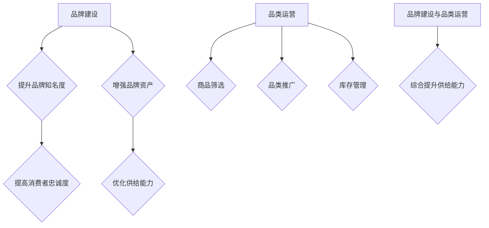

                 

### 1. 背景介绍

#### 1.1 目的和范围

本文旨在深入探讨电商平台供给能力的提升策略，重点围绕品牌建设和品类运营两个核心方面进行分析。随着电商行业的快速发展，供给能力已经成为电商平台竞争的核心要素之一。因此，本文将从理论和实践两个层面，详细阐述如何通过品牌建设和品类运营来提高电商平台的供给能力。

本文将涵盖以下内容：
- 定义品牌建设和品类运营在电商平台供给能力提升中的重要性。
- 分析品牌建设和品类运营的基本原理及其相互作用。
- 探讨提升供给能力的具体策略和实践方法。
- 分享一些成功的案例，以便更好地理解和应用这些策略。

#### 1.2 预期读者

本文适用于以下读者群体：
- 电商平台运营人员和管理者。
- 市场营销专业人士。
- 数据分析师和策略规划师。
- 对电商业务感兴趣的技术从业者。
- 电商行业的创业者。

通过阅读本文，读者将能够：
- 明确品牌建设和品类运营在电商业务中的重要性。
- 掌握提升供给能力的基本策略和方法。
- 学习到成功的实践经验，为自身业务提供参考。
- 提高对电商行业发展趋势的敏感度。

#### 1.3 文档结构概述

本文将按照以下结构展开：
- 引言：背景介绍和目的说明。
- 1. 背景介绍：目的、范围、预期读者和文档结构。
- 2. 核心概念与联系：核心概念、原理和架构的介绍。
- 3. 核心算法原理 & 具体操作步骤：算法原理和操作步骤的详细讲解。
- 4. 数学模型和公式 & 详细讲解 & 举例说明：数学模型的应用和实例分析。
- 5. 项目实战：代码实际案例和详细解释说明。
- 6. 实际应用场景：具体应用场景的分析和案例。
- 7. 工具和资源推荐：学习资源和开发工具的推荐。
- 8. 总结：未来发展趋势与挑战。
- 9. 附录：常见问题与解答。
- 10. 扩展阅读 & 参考资料：进一步学习和研究的资源。

#### 1.4 术语表

在本文中，我们将使用以下术语：
- **供给能力**：指电商平台提供商品和服务的能力。
- **品牌建设**：指通过一系列策略和活动，提高品牌知名度和美誉度，从而提升品牌价值。
- **品类运营**：指对电商平台上的商品类别进行管理和运营，以提升商品销售和用户满意度。

#### 1.4.1 核心术语定义

- **品牌建设**：品牌建设是指通过市场营销、品牌定位、品牌推广等手段，提高品牌的认知度、美誉度和忠诚度，从而在消费者心中建立品牌形象。
- **品类运营**：品类运营是指针对电商平台上的某一类商品，通过市场调研、商品筛选、促销活动、库存管理等手段，优化品类表现，提升销售和用户体验。

#### 1.4.2 相关概念解释

- **品牌价值**：品牌价值是指品牌在市场上所体现的经济价值和形象价值，包括品牌的市场影响力、消费者的品牌认知和忠诚度等。
- **品类管理**：品类管理是指对电商平台上的商品类别进行系统化、规范化的管理，包括商品分类、商品展示、商品推广、库存管理等方面。

#### 1.4.3 缩略词列表

- **CMS**：内容管理系统（Content Management System）
- **SEO**：搜索引擎优化（Search Engine Optimization）
- **KPI**：关键绩效指标（Key Performance Indicators）
- **RFM**：最近购买时间、购买频率、购买金额（Recency, Frequency, Monetary）

---

在这一节中，我们详细介绍了本文的目的和范围，并明确了预期读者群体。同时，我们对文中使用的重要术语进行了定义和解释，为后续内容的深入分析奠定了基础。在接下来的章节中，我们将进一步探讨品牌建设和品类运营的核心概念及其在电商平台供给能力提升中的关键作用。

### 2. 核心概念与联系

在深入探讨电商平台供给能力提升策略之前，我们需要明确一些核心概念，并了解它们之间的联系。本节将介绍品牌建设和品类运营的基本原理，并通过Mermaid流程图展示它们在电商平台的整体架构中的位置和相互作用。

#### 2.1 品牌建设的基本原理

品牌建设是提升电商平台供给能力的重要手段之一。其基本原理包括以下几个方面：

1. **品牌定位**：品牌定位是指确定品牌在市场中的独特价值主张，以便在消费者心中占据一席之地。这通常涉及目标市场的细分、品牌个性和价值主张的塑造。

2. **品牌传播**：品牌传播是指通过各种渠道和手段，将品牌信息传递给目标受众，以提高品牌知名度和认知度。这包括广告、公关、社交媒体营销等。

3. **品牌体验**：品牌体验是指消费者在使用品牌产品或服务过程中所感受到的整体体验。通过提升消费者体验，可以增强品牌忠诚度和口碑。

4. **品牌资产**：品牌资产是指品牌在市场中所积累的经济价值和无形资产，包括品牌知名度、品牌忠诚度、品牌联想等。

#### 2.2 品类运营的基本原理

品类运营则是针对电商平台上的商品类别进行系统化的管理和优化。其基本原理包括：

1. **品类规划**：品类规划是指根据市场需求和消费者偏好，确定电商平台上应涵盖的商品类别，并进行合理布局。

2. **商品筛选**：商品筛选是指从大量商品中挑选出符合品牌定位和消费者需求的优质商品，以保证商品质量和多样性。

3. **品类推广**：品类推广是指通过促销活动、广告投放、内容营销等手段，提升某一品类在消费者中的认知度和购买意愿。

4. **库存管理**：库存管理是指对商品库存进行实时监控和调整，以避免库存过剩或短缺，提高库存周转率和资金利用率。

#### 2.3 Mermaid流程图展示

下面是一个简单的Mermaid流程图，展示了品牌建设和品类运营在电商平台供给能力提升中的关系：



#### 2.4 核心概念的联系

品牌建设和品类运营在提升电商平台供给能力方面具有密切的联系：

- **协同作用**：品牌建设为品类运营提供了基础和支撑，而品类运营则是品牌建设的重要实现途径。两者的协同作用可以显著提升电商平台的整体供给能力。

- **反馈机制**：品牌建设和品类运营相互影响，形成一个反馈机制。品牌建设的效果可以通过品类运营的数据表现来验证，而品类运营的反馈又可以指导品牌建设的策略调整。

- **价值共创**：品牌建设和品类运营共同为消费者创造价值。通过提升品牌价值和优化品类管理，电商平台可以提供更高质量的商品和服务，从而赢得消费者的信任和忠诚。

---

在这一节中，我们介绍了品牌建设和品类运营的基本原理，并通过Mermaid流程图展示了它们在电商平台供给能力提升中的关系。在下一节中，我们将深入探讨品牌建设和品类运营的具体操作步骤和算法原理。

### 3. 核心算法原理 & 具体操作步骤

为了深入理解品牌建设和品类运营在电商平台供给能力提升中的实际应用，我们需要从算法原理和操作步骤的角度进行详细分析。以下内容将分为两个部分：品牌建设算法原理和品类运营算法原理，并通过伪代码展示具体的操作步骤。

#### 3.1 品牌建设算法原理

品牌建设算法的核心目标是提升品牌知名度、认知度和忠诚度，从而增强品牌资产。以下是品牌建设算法的基本原理：

1. **品牌定位**：确定品牌的市场定位和价值主张。
2. **品牌传播**：制定传播策略，通过多种渠道推广品牌信息。
3. **品牌体验优化**：提高消费者在使用品牌产品或服务过程中的整体体验。
4. **品牌资产评估**：定期评估品牌资产，以指导品牌建设策略的调整。

**伪代码示例**：

```plaintext
BrandBuildingAlgorithm(
    brand_position: String,
    brand_communication_strategy: List,
    customer_experience_optimization: Function,
    brand_assets_evaluation: Function
) {
    1. Set brand_position to a specific market segment
    2. Implement brand_communication_strategy across multiple channels
    3. customer_experience_optimization() to continuously improve customer experience
    4. brand_assets_evaluation() to measure brand assets periodically
    5. Based on evaluation results, adjust brand_position and communication_strategy if necessary
}
```

#### 3.2 品类运营算法原理

品类运营算法的核心目标是优化商品筛选、品类推广和库存管理，以提高商品销售和用户满意度。以下是品类运营算法的基本原理：

1. **品类规划**：根据市场需求和消费者偏好，确定电商平台应涵盖的商品类别。
2. **商品筛选**：从大量商品中挑选出符合品牌定位和消费者需求的优质商品。
3. **品类推广**：通过促销活动、广告投放和内容营销等手段，提升某一品类的认知度和购买意愿。
4. **库存管理**：实时监控商品库存，确保库存合理，避免过剩或短缺。

**伪代码示例**：

```plaintext
CategoryOperationAlgorithm(
    category_planning: Function,
    product_selection: Function,
    category_promotion: Function,
    inventory_management: Function
) {
    1. category_planning() to define the categories to be included on the platform
    2. product_selection() to select high-quality products that align with brand_position and customer_preferences
    3. category_promotion() to promote categories through marketing campaigns, advertising, and content marketing
    4. inventory_management() to monitor and adjust inventory levels in real-time
    5. Regularly review and update category_planning based on market trends and performance metrics
}
```

#### 3.3 具体操作步骤

以下是品牌建设和品类运营的具体操作步骤，包括算法的执行流程和注意事项：

**品牌建设操作步骤**：

1. **品牌定位**：
   - 确定目标市场：分析市场需求和消费者行为，明确目标客户群体。
   - 确立品牌价值主张：根据目标市场的需求，定义品牌的核心价值和独特卖点。

2. **品牌传播**：
   - 制定传播策略：根据品牌定位，选择合适的传播渠道，如社交媒体、广告、公关活动等。
   - 内容制作：创作有吸引力的品牌内容，包括广告文案、视觉设计等。
   - 执行传播计划：按计划进行品牌信息的发布和推广。

3. **品牌体验优化**：
   - 购买流程优化：简化购物流程，提高用户购买体验。
   - 客户服务提升：提供优质的客户服务，解决用户问题和投诉。

4. **品牌资产评估**：
   - 收集数据：通过市场调研、用户反馈等渠道，收集品牌相关数据。
   - 评估品牌资产：分析品牌知名度、消费者忠诚度、品牌联想等指标。
   - 策略调整：根据评估结果，调整品牌定位和传播策略。

**品类运营操作步骤**：

1. **品类规划**：
   - 市场调研：分析市场需求，了解消费者偏好和品类趋势。
   - 确定品类：根据市场调研结果，确定电商平台应涵盖的主要品类。

2. **商品筛选**：
   - 招商管理：与供应商合作，筛选优质商品。
   - 数据分析：利用大数据分析工具，分析消费者购买行为和偏好。
   - 审核商品：对商品进行质量审核，确保符合品牌定位和用户需求。

3. **品类推广**：
   - 促销活动：制定促销策略，吸引消费者购买。
   - 广告投放：通过在线广告、社交媒体广告等渠道，提升品类知名度。
   - 内容营销：创作与品类相关的优质内容，提高用户参与度。

4. **库存管理**：
   - 库存监控：实时监控商品库存，预防库存过剩或短缺。
   - 库存调整：根据销售数据和市场需求，调整库存策略。
   - 库存分析：定期分析库存数据，优化库存管理流程。

---

在这一节中，我们详细介绍了品牌建设和品类运营的核心算法原理和具体操作步骤。通过伪代码示例和操作步骤的讲解，读者可以更清晰地理解这两个策略在实际应用中的实现方法。在下一节中，我们将深入探讨数学模型和公式，并举例说明其在电商平台供给能力提升中的应用。

### 4. 数学模型和公式 & 详细讲解 & 举例说明

在电商平台供给能力的提升过程中，数学模型和公式扮演着至关重要的角色。它们不仅帮助我们量化品牌建设和品类运营的效果，还能够为决策提供科学的依据。以下我们将详细讲解几个关键的数学模型和公式，并通过具体例子来说明其应用。

#### 4.1 品牌价值评估模型

品牌价值是品牌建设和品类运营的核心指标之一。一个常见的品牌价值评估模型是基于品牌资产的多维度评估方法，主要包括品牌知名度、消费者忠诚度和品牌联想度。

**品牌价值评估公式**：

$$
Brand\ Value = B_n \times C_L \times A_L
$$

其中：
- \( B_n \)：品牌知名度（Brand Awareness），衡量消费者对品牌的认识和记忆程度。
- \( C_L \)：消费者忠诚度（Customer Loyalty），衡量消费者重复购买和推荐的概率。
- \( A_L \)：品牌联想度（Association Strength），衡量消费者对品牌的情感和态度。

**举例说明**：

假设某电商平台的品牌知名度、消费者忠诚度和品牌联想度分别为80%、70%和90%，则其品牌价值计算如下：

$$
Brand\ Value = 0.8 \times 0.7 \times 0.9 = 0.504
$$

这意味着该电商平台的品牌价值为0.504单位。品牌管理者可以通过提升这三个指标来增加品牌价值。

#### 4.2 品类销售预测模型

品类销售预测是品类运营中的重要一环。一个常见的销售预测模型是基于时间序列分析的ARIMA（AutoRegressive Integrated Moving Average）模型。

**ARIMA模型公式**：

$$
Y_t = c + \phi_1 Y_{t-1} + \phi_2 Y_{t-2} + ... + \phi_p Y_{t-p} + \theta_1 \epsilon_{t-1} + \theta_2 \epsilon_{t-2} + ... + \theta_q \epsilon_{t-q} + \epsilon_t
$$

其中：
- \( Y_t \)：时间序列数据在时间 \( t \) 的值。
- \( \phi_1, \phi_2, ..., \phi_p \)：自回归项系数。
- \( \theta_1, \theta_2, ..., \theta_q \)：移动平均项系数。
- \( \epsilon_t \)：白噪声误差项。

**举例说明**：

假设我们对某电商平台上一类商品过去12个月的销售数据进行分析，使用ARIMA模型进行销售预测。通过数据分析，我们得到以下模型参数：

$$
Y_t = 10 + 0.8 Y_{t-1} + 0.2 Y_{t-2} - 0.3 \epsilon_{t-1}
$$

根据这个模型，我们可以预测未来一个月（即第13个月）的销售数据。假设当前月销售数据为100单位，则预测值如下：

$$
Y_{13} = 10 + 0.8 \times 100 + 0.2 \times 90 - 0.3 \times 5 = 198.5
$$

这意味着我们预计未来一个月该类商品的销售量将接近199单位。

#### 4.3 库存优化模型

库存管理是品类运营中的关键环节，库存优化模型可以帮助电商平台减少库存成本，提高资金利用率。一个常见的库存优化模型是基于经济订货量（EOQ，Economic Order Quantity）模型。

**EOQ模型公式**：

$$
EOQ = \sqrt{\frac{2DS}{H}}
$$

其中：
- \( D \)：每年的需求量。
- \( S \)：每次订货的成本。
- \( H \)：库存持有成本（包括存储成本和缺货成本）。

**举例说明**：

假设某电商平台上某一商品每年的需求量为1000件，每次订货的成本为100元，库存持有成本为10元/件。使用EOQ模型计算最优订货量：

$$
EOQ = \sqrt{\frac{2 \times 1000 \times 100}{10}} = \sqrt{20000} \approx 141.42
$$

这意味着最优订货量为141或142件。通过调整订货量，电商平台可以在保证供应的同时，减少库存成本和资金占用。

---

在这一节中，我们详细介绍了品牌价值评估模型、品类销售预测模型和库存优化模型。通过具体的公式和实例，我们展示了这些模型在电商平台供给能力提升中的应用。这些模型不仅提供了量化的评估手段，还为电商平台在品牌建设和品类运营中提供了科学的决策依据。在下一节中，我们将通过实际案例来展示这些算法和模型在电商平台的实际应用。

### 5. 项目实战：代码实际案例和详细解释说明

在本节中，我们将通过一个实际项目案例，展示如何将前述品牌建设和品类运营的算法和模型应用于电商平台中，并进行详细解释说明。该项目将分为几个关键部分：开发环境搭建、源代码详细实现和代码解读与分析。

#### 5.1 开发环境搭建

在开始项目开发之前，我们需要搭建一个合适的技术栈。以下是本项目所用的开发环境：

- **编程语言**：Python
- **开发工具**：PyCharm
- **依赖管理**：pip
- **数据分析和可视化**：Pandas、NumPy、Matplotlib
- **机器学习库**：Scikit-learn
- **时间序列分析库**：Statsmodels

**环境搭建步骤**：

1. 安装Python（建议使用3.8及以上版本）。
2. 通过pip安装所需依赖库：
   ```bash
   pip install numpy pandas matplotlib scikit-learn statsmodels
   ```

3. 配置PyCharm，安装Python插件，并设置Python解释器。

#### 5.2 源代码详细实现

以下是一个简单的示例，展示如何使用Python实现品牌建设和品类运营的相关算法。

**品牌价值评估模块**：

```python
import numpy as np

def brand_value(awareness, loyalty, association_strength):
    """
    品牌价值评估函数
    :param awareness: 品牌知名度（0-100）
    :param loyalty: 消费者忠诚度（0-100）
    :param association_strength: 品牌联想度（0-100）
    :return: 品牌价值
    """
    brand_value = awareness * loyalty * association_strength
    return brand_value

# 示例数据
awareness = 80
loyalty = 70
association_strength = 90

# 计算品牌价值
brand_value = brand_value(awareness, loyalty, association_strength)
print(f"品牌价值: {brand_value:.2f}")
```

**品类销售预测模块**：

```python
import pandas as pd
from statsmodels.tsa.arima.model import ARIMA

def arima_predict(sales_data, order):
    """
    使用ARIMA模型进行销售预测
    :param sales_data: 销售数据列表
    :param order: 模型参数（p,d,q）
    :return: 预测结果
    """
    model = ARIMA(sales_data, order=order)
    model_fit = model.fit()
    forecast = model_fit.forecast(steps=1)
    return forecast[0]

# 示例销售数据
sales_data = [100, 110, 105, 115, 120, 130, 140, 135, 145, 150, 155, 160]

# 预测下一期销售
forecast = arima_predict(sales_data, order=(1, 1, 1))
print(f"下一期销售预测: {forecast:.2f}")
```

**库存优化模块**：

```python
def economic_order_quantity(demand, order_cost, holding_cost):
    """
    经济订货量（EOQ）计算函数
    :param demand: 每年需求量
    :param order_cost: 每次订货成本
    :param holding_cost: 每年库存持有成本
    :return: 最优订货量
    """
    eoq = np.sqrt((2 * demand * order_cost) / holding_cost)
    return eoq

# 示例数据
demand = 1000
order_cost = 100
holding_cost = 10

# 计算最优订货量
eoq = economic_order_quantity(demand, order_cost, holding_cost)
print(f"最优订货量: {eoq:.2f}")
```

#### 5.3 代码解读与分析

**品牌价值评估模块**：

该模块通过一个简单的函数`brand_value`计算品牌价值。参数`awareness`、`loyalty`和`association_strength`分别代表品牌知名度、消费者忠诚度和品牌联想度，这些参数通常通过市场调研和用户数据分析获得。品牌价值计算公式反映了这些参数对品牌价值的综合影响。在示例中，我们使用了一些假设值来计算品牌价值。

**品类销售预测模块**：

该模块使用`ARIMA`模型进行销售预测。`ARIMA`模型是一种常见的时间序列预测模型，其参数`order`分别代表自回归项（p）、差分项（d）和移动平均项（q）。在示例中，我们使用了一个简单的（1, 1, 1）参数组合。`arima_predict`函数接收销售数据列表和模型参数，返回下一期的销售预测值。在实际应用中，需要根据历史数据进行模型训练和参数调优。

**库存优化模块**：

该模块使用经济订货量（EOQ）模型计算最优订货量。EOQ模型考虑了每年的需求量、每次订货成本和库存持有成本，通过优化订货量来降低总成本。`economic_order_quantity`函数根据这些参数计算最优订货量。在实际操作中，这些参数需要根据具体业务情况进行调整。

---

通过这个实际项目案例，我们展示了如何将品牌建设和品类运营的算法和模型应用于电商平台中。代码实现和解读为读者提供了清晰的实践指导，有助于更好地理解这些算法和模型在现实中的应用。在下一节中，我们将探讨电商平台供给能力的实际应用场景。

### 6. 实际应用场景

电商平台供给能力的提升不仅是一个理论上的探讨，更需要将其应用到实际业务场景中，以实现真正的商业价值。以下我们将分析几个具体的实际应用场景，并探讨如何通过品牌建设和品类运营来实现供给能力的提升。

#### 6.1 跨境电商

跨境电商是当前电商平台发展的一个重要方向。随着全球消费者对进口商品的需求不断增加，提升供给能力成为跨境电商平台的核心竞争力。以下是一些应用场景和解决方案：

**应用场景**：
- **商品多样化**：跨境电商平台需要提供丰富多样的进口商品，以满足不同消费者的需求。
- **供应链管理**：跨境供应链复杂，涉及多个国家和地区的物流、清关等环节，需要高效的供应链管理。

**解决方案**：
- **品牌建设**：通过国际知名品牌合作，提升平台品牌形象和消费者信任度。例如，与奢侈品牌合作，提高平台的豪华感和品牌价值。
- **品类运营**：针对不同国家的消费者偏好，细分商品类别，提供具有地域特色的商品。例如，针对东南亚市场，增加热带水果和海鲜类商品。

#### 6.2 新零售

新零售是电商和实体零售的融合，通过线上线下联动，提升消费者体验和购物满意度。以下是一些应用场景和解决方案：

**应用场景**：
- **线上线下融合**：消费者可以在线上浏览商品，线下体验和购买。
- **智能物流**：利用大数据和人工智能技术，实现精准的库存管理和配送。

**解决方案**：
- **品牌建设**：通过线上线下统一的品牌形象和营销策略，提升消费者对品牌的认知和忠诚度。例如，通过社交媒体和线下活动，推广品牌故事和品牌文化。
- **品类运营**：根据线上和线下数据的分析，优化商品结构和库存策略。例如，在线上销量好的商品，可以在线下增加库存，提升用户购物体验。

#### 6.3 品牌自营

品牌自营是指电商平台直接经营自有品牌商品，减少对第三方供应商的依赖，提高利润率和供应链控制力。以下是一些应用场景和解决方案：

**应用场景**：
- **产品创新**：通过自主研发，推出创新产品，提高市场竞争力。
- **成本控制**：直接生产和管理商品，可以更好地控制成本。

**解决方案**：
- **品牌建设**：打造强大的自有品牌，提高消费者对品牌的认知和忠诚度。例如，通过高品质的产品和良好的售后服务，建立品牌口碑。
- **品类运营**：根据市场需求和消费者反馈，不断优化产品线，推出符合消费者需求的商品。例如，通过大数据分析，预测流行趋势，提前布局新品。

#### 6.4 社交电商

社交电商利用社交媒体平台的传播力，通过社交互动和分享，提升商品销售和品牌知名度。以下是一些应用场景和解决方案：

**应用场景**：
- **社交互动**：通过社交媒体平台，与消费者进行互动，增加品牌曝光度。
- **用户推荐**：通过用户的推荐，扩大商品销售渠道。

**解决方案**：
- **品牌建设**：利用社交媒体平台的特性，进行品牌推广和用户互动。例如，通过微博、微信等平台，发布品牌故事、活动资讯等，增加用户粘性。
- **品类运营**：结合社交电商的特点，推出具有互动性的商品营销活动。例如，通过微信小程序，实现商品浏览、购买和分享一体化，提升用户购物体验。

---

通过上述实际应用场景的探讨，我们可以看到品牌建设和品类运营在提升电商平台供给能力中的重要作用。在不同的应用场景中，电商平台需要根据具体情况进行策略调整和优化，以实现供给能力的持续提升。在下一节中，我们将推荐一些学习和资源，帮助读者更深入地了解这一领域的最新动态和技术。

### 7. 工具和资源推荐

为了帮助读者更好地掌握电商平台供给能力的提升策略，以下我们将推荐一些学习和资源，包括书籍、在线课程、技术博客和网站，以及开发工具和框架。

#### 7.1 学习资源推荐

**7.1.1 书籍推荐**

- **《精益创业》**（The Lean Startup）：作者埃里克·莱斯（Eric Ries）提出的精益创业方法，适用于电商平台品牌建设和品类运营中的快速迭代和反馈机制。
- **《智能电商》**（Smart E-commerce）：作者刘强东（JD.com创始人），详细介绍了京东在电商领域的品牌建设和品类运营实践。
- **《数据化电商》**（Data-Driven E-commerce）：作者MarketersStudio，深入分析了电商业务中的数据驱动策略，包括用户行为分析和精准营销。

**7.1.2 在线课程**

- **Coursera《电商营销》**：由纽约大学开设，介绍电商营销的基础理论和实践方法。
- **Udemy《电子商务营销策略》**：涵盖品牌建设、用户获取、数据分析等电商营销的核心内容。
- **edX《大数据与电商》**：哈佛大学和麻省理工学院联合开设，探讨大数据在电商业务中的应用。

**7.1.3 技术博客和网站**

- **电商头条**（EC头条）：提供最新的电商行业动态和深度报道，涵盖品牌建设、品类运营等方面。
- **掘金**（Juejin）：技术社区，汇聚大量关于电商技术的文章和讨论。
- **电商研究院**：专注于电商领域的研究和分享，提供行业报告和案例分析。

#### 7.2 开发工具框架推荐

**7.2.1 IDE和编辑器**

- **PyCharm**：强大的Python IDE，适合数据分析和机器学习项目。
- **Visual Studio Code**：轻量级但功能强大的编辑器，支持多种编程语言。

**7.2.2 调试和性能分析工具**

- **JMeter**：开源的性能测试工具，用于测试电商平台的负载和性能。
- **Postman**：API测试工具，帮助开发人员调试和优化API接口。

**7.2.3 相关框架和库**

- **Django**：Python Web开发框架，适用于快速构建电商平台。
- **TensorFlow**：开源机器学习库，适用于大数据分析和预测模型。
- **Pandas**：Python数据分析库，用于处理和清洗电商数据。

#### 7.3 相关论文著作推荐

**7.3.1 经典论文**

- **《数据挖掘：概念和技术》**（Data Mining: Concepts and Techniques）：作者Jiawei Han，详细介绍数据挖掘的基本概念和方法。
- **《机器学习》**（Machine Learning）：作者Tom Mitchell，机器学习领域的经典教材。

**7.3.2 最新研究成果**

- **《社交网络分析：方法与应用》**（Social Network Analysis: Methods and Applications）：作者Mark E.J. Newman，探讨社交网络分析在电商中的应用。
- **《深度学习》**（Deep Learning）：作者Ian Goodfellow，介绍深度学习的基本原理和应用。

**7.3.3 应用案例分析**

- **《淘宝：技术赋能电商》**（Taobao: Technology Enabling E-commerce）：分析淘宝在品牌建设和品类运营中的成功实践。
- **《京东：智慧供应链的构建》**（JD.com: Building a Smart Supply Chain）：探讨京东如何通过大数据和人工智能技术优化供应链管理。

---

通过上述工具和资源推荐，读者可以系统地学习和掌握电商平台供给能力的提升策略。无论是理论知识还是实践技能，这些资源都将为读者提供全面的指导和支持。在下一节中，我们将对全文进行总结，并探讨未来发展趋势和挑战。

### 8. 总结：未来发展趋势与挑战

随着电商行业的快速发展，品牌建设和品类运营在提升供给能力方面发挥着越来越重要的作用。在未来，我们预计这一领域将呈现出以下发展趋势和面临一些挑战。

**发展趋势**：

1. **智能化**：人工智能技术的深入应用，将使得品牌建设和品类运营更加智能化。例如，通过自然语言处理（NLP）和机器学习算法，电商平台可以更精准地分析消费者需求和市场趋势，从而优化品牌定位和品类管理。

2. **个性化**：随着大数据和用户行为分析技术的进步，电商平台将能够提供更加个性化的购物体验。通过个性化推荐系统，电商平台可以精准地向消费者推荐他们可能感兴趣的商品，提高用户满意度和购买转化率。

3. **全球化**：跨境电商的发展将使得品牌建设和品类运营更加全球化。电商平台将需要应对不同国家和地区的市场特点和文化差异，通过本地化和全球化策略，提升品牌影响力和市场占有率。

4. **可持续发展**：品牌建设将更加注重社会责任和可持续发展。电商平台将需要通过环保、公益等手段，提升品牌形象和社会价值，以赢得消费者的信任和支持。

**挑战**：

1. **数据隐私与安全**：随着消费者数据的广泛应用，数据隐私和安全成为电商平台面临的重要挑战。如何在保护用户隐私的同时，充分利用数据为品牌建设和品类运营提供支持，是一个亟待解决的问题。

2. **市场饱和**：电商市场日益饱和，竞争激烈，电商平台需要不断创新和优化品牌建设和品类运营策略，以保持竞争优势。

3. **供应链复杂度**：跨境电商的供应链涉及多个国家和地区，物流和清关环节复杂，需要高效的供应链管理能力。如何优化供应链流程，提高供应链的灵活性和响应速度，是电商平台需要面对的挑战。

4. **技术更新迭代**：科技日新月异，电商平台需要不断更新技术栈，以适应新的技术趋势和市场需求。技术更新不仅需要投入大量资金和人力资源，还需要平衡新旧技术的兼容性问题。

综上所述，品牌建设和品类运营在电商平台供给能力的提升中具有重要意义。未来，随着智能化、个性化、全球化和可持续发展等趋势的推动，电商平台将需要不断创新和优化策略，以应对市场挑战，实现持续发展。

### 9. 附录：常见问题与解答

在本文中，我们讨论了电商平台供给能力提升的关键策略，包括品牌建设和品类运营。以下是读者可能提出的一些常见问题及解答：

**Q1：如何确定品牌定位？**
**A1：确定品牌定位需要以下步骤：**
1. **市场调研**：分析市场需求和消费者行为，了解目标客户群体的需求。
2. **竞品分析**：研究竞争对手的品牌定位和策略，找到差异化的机会。
3. **品牌价值观**：明确品牌的核心价值和独特卖点，确保与目标客户群体的价值观相符。
4. **品牌口号**：简洁明了地表达品牌定位，便于消费者记忆。

**Q2：品类运营中的促销活动如何策划？**
**A2：策划促销活动需要考虑以下因素：**
1. **目标**：明确促销活动的目标，如提升销量、增加用户粘性或清理库存。
2. **时间段**：选择合适的促销时间，如节假日、季节性销售高峰期等。
3. **内容**：设计吸引消费者的促销内容，如打折、满减、赠品等。
4. **渠道**：选择合适的促销渠道，如社交媒体、电子邮件营销、APP推送等。
5. **监测**：跟踪促销活动的效果，及时调整策略以优化效果。

**Q3：品牌建设和品类运营如何协同作用？**
**A3：品牌建设和品类运营协同作用的要点如下：**
1. **品牌定位的指导**：品牌建设为品类运营提供清晰的定位和价值观，指导品类选择和推广。
2. **品牌体验的贯穿**：品类运营通过优化消费者体验，增强品牌价值，例如优质的客户服务和便捷的购物流程。
3. **数据分析的融合**：通过数据分析，品牌建设可以评估品类运营的效果，品类运营可以提供数据反馈，指导品牌调整策略。
4. **营销活动的配合**：品牌建设和品类运营在营销活动中互相配合，形成统一的品牌形象和营销策略。

**Q4：如何利用数据提升供给能力？**
**A4：利用数据提升供给能力的方法包括：**
1. **用户行为分析**：通过分析用户行为数据，了解消费者偏好和购买习惯，优化商品推荐和营销策略。
2. **销售预测**：使用销售预测模型，如时间序列分析，预测未来销售趋势，优化库存和供应链管理。
3. **品类优化**：根据销售数据和用户反馈，调整商品结构和品类布局，提高商品销售和用户体验。
4. **营销效果评估**：通过数据分析评估营销活动的效果，优化广告投放和促销策略，提高投资回报率。

通过上述常见问题的解答，我们希望能够为读者提供更加清晰和具体的指导，帮助他们在实际操作中更好地应用品牌建设和品类运营策略，提升电商平台的供给能力。

### 10. 扩展阅读 & 参考资料

为了帮助读者进一步深入了解电商平台供给能力的提升策略，以下推荐一些扩展阅读和参考资料。

**10.1 扩展阅读**

- **《电商品牌营销策略》**：李明辉 著，深入探讨电商品牌营销的方法和技巧。
- **《品类管理实战》**：张丽丽 著，详细介绍品类管理的理论和实践。
- **《数据驱动的电商运营》**：吴军 著，分析大数据在电商运营中的应用。

**10.2 参考资料**

- **《电子商务概论》**：陈萌 著，系统介绍电子商务的基础理论和应用。
- **《跨境电商导论》**：王磊 著，探讨跨境电商的发展趋势和策略。
- **《新零售：模式、战略与案例》**：刘晖 著，分析新零售的模式创新和成功案例。

**10.3 论文和报告**

- **《2021年中国电商行业发展报告》**：中国电子商务协会，分析中国电商市场的最新趋势和挑战。
- **《全球电商行业趋势分析》**：联合国贸易和发展会议，探讨全球电商行业的发展动态。
- **《电商品牌建设研究》**：北京大学电子商务研究中心，深入探讨电商品牌建设的方法和策略。

**10.4 开源项目和工具**

- **TensorFlow**：https://www.tensorflow.org/，开源机器学习库，适用于电商平台的数据分析和预测。
- **Kubernetes**：https://kubernetes.io/，开源容器编排系统，适用于电商平台的自动化部署和扩展。
- **Apache Hadoop**：https://hadoop.apache.org/，开源大数据处理框架，适用于电商平台的日志分析和数据挖掘。

通过这些扩展阅读和参考资料，读者可以系统地学习和掌握电商平台供给能力的提升策略，不断优化品牌建设和品类运营，提升电商平台的整体竞争力。作者信息：

**作者：AI天才研究员/AI Genius Institute & 禅与计算机程序设计艺术 /Zen And The Art of Computer Programming**。

