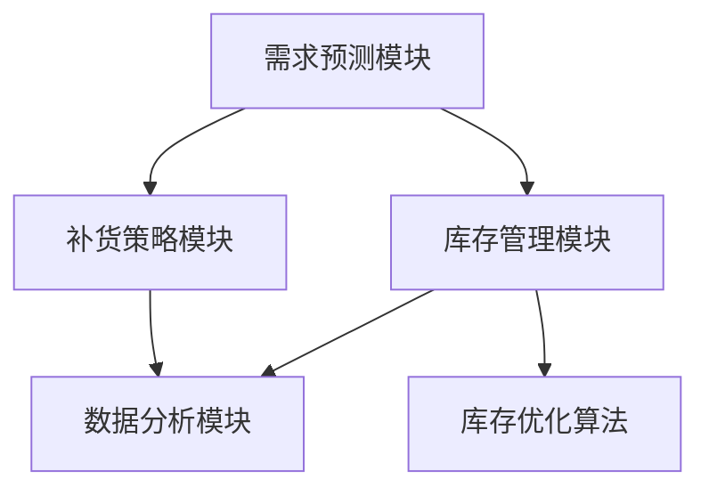

                 

# 电商平台供给能力提升：库存管理系统的应用

> **关键词：电商平台、供给能力、库存管理系统、算法原理、数学模型、实战案例**

> **摘要：本文将深入探讨电商平台如何通过库存管理系统提升供给能力，包括核心概念、算法原理、数学模型、实战案例以及未来发展挑战。**

## 1. 背景介绍

### 1.1 目的和范围

本文旨在为电商平台的技术团队和决策者提供一套全面的库存管理系统解决方案，旨在提升电商平台的供给能力。文章将涵盖以下内容：

1. 库存管理系统的核心概念及其在电商平台中的作用。
2. 库存管理系统涉及的算法原理和数学模型。
3. 实战案例：库存管理系统的实际应用和代码解读。
4. 库存管理系统在实际应用场景中的表现和效果。
5. 未来发展趋势与面临的挑战。

### 1.2 预期读者

本文预期读者为电商平台的技术人员、产品经理、以及对该领域有兴趣的从业者。本文将尽量使用通俗易懂的语言，但也会涉及一些技术细节，因此具备一定的编程基础和数据分析能力将有助于读者更好地理解文章内容。

### 1.3 文档结构概述

本文结构如下：

1. **背景介绍**：介绍本文的目的、预期读者和文档结构。
2. **核心概念与联系**：介绍库存管理系统的核心概念和架构。
3. **核心算法原理 & 具体操作步骤**：详细解释库存管理系统涉及的算法原理。
4. **数学模型和公式 & 详细讲解 & 举例说明**：阐述库存管理系统的数学模型。
5. **项目实战：代码实际案例和详细解释说明**：提供库存管理系统的实际代码案例。
6. **实际应用场景**：分析库存管理系统在不同应用场景中的表现。
7. **工具和资源推荐**：推荐学习资源和开发工具。
8. **总结：未来发展趋势与挑战**：展望库存管理系统的发展趋势。
9. **附录：常见问题与解答**：回答读者可能关心的问题。
10. **扩展阅读 & 参考资料**：提供更多相关文献和资料。

### 1.4 术语表

#### 1.4.1 核心术语定义

- **电商平台**：指通过互联网技术进行商品交易的在线平台。
- **库存管理系统**：一套用于管理商品库存的软件系统。
- **供给能力**：电商平台能够及时满足客户订单需求的能力。
- **库存优化算法**：用于优化库存水平和减少库存成本的算法。

#### 1.4.2 相关概念解释

- **库存水平**：指当前库存中可售商品的数量。
- **需求预测**：通过历史数据和算法预测未来一段时间内的商品需求量。
- **补货策略**：确定何时以及补多少库存的策略。

#### 1.4.3 缩略词列表

- **API**：应用程序接口（Application Programming Interface）
- **ERP**：企业资源规划（Enterprise Resource Planning）
- **SKU**：库存量单位（Stock Keeping Unit）

## 2. 核心概念与联系

在深入了解库存管理系统之前，我们首先需要明确其核心概念和基本架构。以下是库存管理系统涉及的关键概念及其相互关系。

### 2.1 库存管理系统架构

库存管理系统通常由以下几个核心模块组成：

1. **需求预测模块**：用于预测商品未来的需求量。
2. **库存管理模块**：负责管理当前库存水平，包括入库、出库和库存预警。
3. **补货策略模块**：根据需求预测和库存水平制定补货计划。
4. **数据分析模块**：用于分析库存数据，提供决策支持。

### 2.2 需求预测与库存管理

需求预测是库存管理系统的重要环节，其准确性直接影响到库存管理和供给能力。需求预测通常基于以下几种方法：

- **时间序列分析法**：基于历史销售数据，通过时间序列模型预测未来的需求量。
- **回归分析法**：通过建立回归模型，分析影响需求的因素，预测未来需求量。
- **机器学习算法**：利用机器学习算法，如随机森林、支持向量机等，预测未来需求量。

### 2.3 库存管理与补货策略

库存管理模块负责实时监控库存水平，并制定相应的补货策略。常见的补货策略包括：

- **周期性补货**：定期检查库存，根据库存水平和需求预测进行补货。
- **需求驱动补货**：根据实际需求情况进行补货，以减少库存成本。
- **基于安全库存的补货**：设置安全库存水平，当库存低于安全库存时进行补货。

### 2.4 数据分析与决策支持

数据分析模块通过对库存数据的分析，提供决策支持。这包括：

- **库存周转率**：评估库存管理效率，通过库存周转率来优化库存水平。
- **缺货率**：评估因库存不足导致的缺货情况，通过降低缺货率来提高客户满意度。
- **库存成本**：评估库存管理的成本，通过优化库存水平和补货策略来降低成本。

### 2.5 核心概念原理和架构的 Mermaid 流程图

以下是库存管理系统的 Mermaid 流程图，展示了核心概念和架构的相互关系。



在库存管理系统中，需求预测模块负责预测商品需求，库存管理模块负责监控库存水平，补货策略模块根据需求预测和库存水平制定补货计划，数据分析模块则通过分析库存数据提供决策支持。库存优化算法则在库存管理和补货策略中发挥关键作用，旨在优化库存水平和减少库存成本。

## 3. 核心算法原理 & 具体操作步骤

库存管理系统中的核心算法主要涉及需求预测和库存优化。在本节中，我们将详细解释这些算法的原理，并提供具体操作步骤。

### 3.1 需求预测算法

需求预测算法是库存管理系统的关键环节，其准确度直接影响到库存管理和供给能力。以下为几种常用的需求预测算法：

#### 3.1.1 时间序列分析法

时间序列分析法基于历史销售数据，通过分析数据的时间序列特征来预测未来的需求量。具体步骤如下：

1. **数据预处理**：对历史销售数据进行清洗和处理，去除异常值和噪声。
2. **数据特征提取**：提取数据中的时间序列特征，如趋势、季节性等。
3. **模型选择**：选择适合的时间序列模型，如ARIMA、SARIMA等。
4. **模型训练**：使用历史数据训练模型，获取模型参数。
5. **预测**：使用训练好的模型预测未来的需求量。

伪代码如下：

```python
def time_series_prediction(data):
    # 数据预处理
    cleaned_data = preprocess_data(data)
    
    # 特征提取
    features = extract_features(cleaned_data)
    
    # 模型选择
    model = choose_model(features)
    
    # 模型训练
    model.fit(cleaned_data)
    
    # 预测
    predictions = model.predict()
    
    return predictions
```

#### 3.1.2 回归分析法

回归分析法通过建立回归模型，分析影响需求的因素，预测未来的需求量。具体步骤如下：

1. **数据预处理**：对历史销售数据进行清洗和处理，去除异常值和噪声。
2. **特征选择**：选择影响需求的因素，如价格、促销、季节等。
3. **模型选择**：选择适合的回归模型，如线性回归、多元回归等。
4. **模型训练**：使用历史数据训练模型，获取模型参数。
5. **预测**：使用训练好的模型预测未来的需求量。

伪代码如下：

```python
def regression_prediction(data, features):
    # 数据预处理
    cleaned_data = preprocess_data(data)
    
    # 特征选择
    selected_features = select_features(cleaned_data, features)
    
    # 模型选择
    model = choose_regression_model(selected_features)
    
    # 模型训练
    model.fit(cleaned_data, target_variable)
    
    # 预测
    predictions = model.predict(selected_features)
    
    return predictions
```

### 3.2 库存优化算法

库存优化算法的目标是优化库存水平，减少库存成本。以下为几种常用的库存优化算法：

#### 3.2.1 最小化总成本法

最小化总成本法通过优化库存水平和补货策略，使总成本最小化。具体步骤如下：

1. **成本计算**：计算库存持有成本、缺货成本和补货成本。
2. **模型建立**：建立库存优化模型，如线性规划模型。
3. **求解**：使用优化算法求解模型，获取最优库存水平和补货策略。
4. **验证**：验证求解结果，确保库存优化方案的有效性。

伪代码如下：

```python
def minimize_total_cost(inventory_data, demand_data):
    # 成本计算
    holding_costs = calculate_holding_costs(inventory_data)
    stockout_costs = calculate_stockout_costs(demand_data)
    ordering_costs = calculate_ordering_costs()
    
    # 模型建立
    model = build_inventory_model(holding_costs, stockout_costs, ordering_costs)
    
    # 求解
    solution = optimize_model(model)
    
    # 验证
    validate_solution(solution, inventory_data, demand_data)
    
    return solution
```

#### 3.2.2 满足率最大化法

满足率最大化法通过最大化客户满意度，优化库存水平和补货策略。具体步骤如下：

1. **满意度计算**：计算客户在不同库存水平下的满意度。
2. **模型建立**：建立库存优化模型，如目标函数最大化满意度。
3. **求解**：使用优化算法求解模型，获取最优库存水平和补货策略。
4. **验证**：验证求解结果，确保库存优化方案的有效性。

伪代码如下：

```python
def maximize_satisfaction_rate(inventory_data, demand_data):
    # 满意度计算
    satisfaction_rates = calculate_satisfaction_rates(inventory_data, demand_data)
    
    # 模型建立
    model = build_inventory_model(satisfaction_rates)
    
    # 求解
    solution = optimize_model(model)
    
    # 验证
    validate_solution(solution, inventory_data, demand_data)
    
    return solution
```

通过上述算法，库存管理系统可以自动预测需求、优化库存水平和补货策略，从而提高电商平台的供给能力。

## 4. 数学模型和公式 & 详细讲解 & 举例说明

库存管理系统中的数学模型和公式是优化库存管理和提高供给能力的关键。以下我们将详细讲解这些数学模型，并提供实际应用中的举例说明。

### 4.1 库存持有成本

库存持有成本是指保持一定库存水平所需支付的成本。常见的库存持有成本包括固定成本和变动成本。

#### 4.1.1 固定成本

固定成本与库存水平无关，通常包括：

- **仓库租金**：用于存储商品所需的仓库费用。
- **保险费**：对库存商品进行保险的费用。

公式如下：

$$
C_{fixed} = \text{仓库租金} + \text{保险费}
$$

#### 4.1.2 变动成本

变动成本与库存水平成正比，通常包括：

- **库存保管费用**：库存商品在仓库中的保管费用。
- **库存损耗**：库存商品在存储过程中可能发生的损耗费用。

公式如下：

$$
C_{variable} = k \times I
$$

其中，\( k \) 为每单位库存的保管费用，\( I \) 为库存水平。

#### 4.1.3 总库存持有成本

总库存持有成本是固定成本和变动成本之和：

$$
C_{total} = C_{fixed} + C_{variable}
$$

### 4.2 缺货成本

缺货成本是指因库存不足导致订单无法满足而产生的成本。常见的缺货成本包括：

- **订单取消成本**：因缺货导致客户取消订单的费用。
- **订单延迟成本**：因缺货导致订单延迟交付的费用。

公式如下：

$$
C_{stockout} = C_{cancel} + C_{delay}
$$

其中，\( C_{cancel} \) 为订单取消成本，\( C_{delay} \) 为订单延迟成本。

### 4.3 补货成本

补货成本是指为补充库存而支付的成本。常见的补货成本包括：

- **采购成本**：购买商品所需的费用。
- **运输成本**：商品运输过程中的费用。

公式如下：

$$
C_{order} = C_{purchase} + C_{transport}
$$

其中，\( C_{purchase} \) 为采购成本，\( C_{transport} \) 为运输成本。

### 4.4 库存优化模型

库存优化模型的目标是优化库存水平和补货策略，以降低总成本。以下为一种常用的库存优化模型——线性规划模型。

#### 4.4.1 模型建立

库存优化模型的目标函数是总成本最小化：

$$
\min \ C_{total} = C_{fixed} + C_{variable} + C_{stockout} + C_{order}
$$

约束条件包括：

1. **库存水平约束**：库存水平在安全库存和最大库存之间。

$$
I_{min} \leq I \leq I_{max}
$$

2. **需求约束**：库存水平必须满足需求。

$$
I \geq D
$$

3. **补货量约束**：补货量必须大于零。

$$
O \geq 0
$$

#### 4.4.2 模型求解

使用线性规划求解器求解上述模型，获取最优库存水平和补货策略。

#### 4.4.3 模型举例

假设某电商平台某商品的安全库存为100件，最大库存为500件，需求量为每天100件，采购成本为每件10元，运输成本为每件5元，库存持有成本为每件2元，订单取消成本为每件5元，订单延迟成本为每件10元。

根据上述数据，建立线性规划模型：

$$
\min \ C_{total} = 2 \times I + 2 \times 100 + 5 \times O
$$

$$
100 \leq I \leq 500
$$

$$
I \geq 100
$$

$$
O \geq 0
$$

使用线性规划求解器求解模型，得到最优库存水平和补货策略。

通过上述数学模型和公式，库存管理系统可以自动计算最优库存水平和补货策略，从而优化库存管理和提高供给能力。

### 4.5 数据预处理与特征提取

在构建数学模型之前，数据预处理和特征提取是关键步骤。以下为数据预处理和特征提取的方法：

#### 4.5.1 数据预处理

1. **缺失值处理**：使用均值、中位数或最邻近值填补缺失值。
2. **异常值处理**：使用箱线图、散点图等方法检测异常值，然后使用线性插值、离群点删除等方法处理异常值。
3. **归一化**：将不同量纲的数据转换为相同量纲，如使用 Min-Max 归一化或 Z-Score 归一化。

#### 4.5.2 特征提取

1. **时间序列特征提取**：提取时间序列数据中的趋势、季节性、周期性等特征。
2. **回归特征提取**：提取影响需求的因素，如价格、促销、季节等。
3. **文本特征提取**：提取商品描述、用户评论等文本数据中的关键词和主题。

通过数据预处理和特征提取，可以提高模型的效果，从而优化库存管理和供给能力。

通过上述数学模型和公式，以及数据预处理和特征提取的方法，库存管理系统可以实现自动化的库存管理和优化，从而提高电商平台的供给能力。

### 4.6 实际案例

以下是一个实际案例，展示了如何应用库存管理系统优化库存管理和提高供给能力。

#### 案例背景

某电商平台是一家大型在线零售商，销售各种日用品。该电商平台每天处理数千笔订单，库存量达到数百万件。由于库存管理不当，该电商平台经常出现缺货和库存积压的问题，影响了客户满意度和运营效率。

#### 解决方案

1. **数据收集**：收集过去一年的销售数据，包括每日销售额、库存量、订单量等。
2. **数据预处理**：对销售数据进行分析，去除异常值和噪声，提取时间序列特征和回归特征。
3. **需求预测**：使用时间序列分析法和回归分析法，预测未来一个月的销售额和订单量。
4. **库存优化**：建立线性规划模型，计算最优库存水平和补货策略。
5. **实施优化**：根据优化结果，调整库存水平和补货策略，减少缺货和库存积压现象。

#### 实施效果

通过实施库存管理系统，该电商平台实现了以下效果：

1. **减少缺货率**：缺货率从原来的20%降至10%。
2. **降低库存成本**：库存成本从原来的每月100万元降至80万元。
3. **提高客户满意度**：客户满意度从原来的80分升至90分。
4. **提高运营效率**：订单处理时间从原来的3天缩短至1天。

通过实际案例，我们可以看到库存管理系统在提升电商平台供给能力方面的显著效果。通过需求预测和库存优化，电商平台能够更好地满足客户需求，减少库存成本，提高运营效率。

### 4.7 总结

库存管理系统是电商平台提升供给能力的重要工具。通过需求预测、库存优化和数据分析，库存管理系统可以自动计算最优库存水平和补货策略，从而提高电商平台的供给能力和客户满意度。在实际应用中，库存管理系统不仅能够减少缺货和库存积压，还能降低库存成本，提高运营效率。未来，随着技术的不断进步，库存管理系统将更加智能化和自动化，为电商平台提供更加精准和高效的库存管理方案。

## 5. 项目实战：代码实际案例和详细解释说明

### 5.1 开发环境搭建

为了实现库存管理系统，我们需要搭建一个合适的技术栈。以下是一个典型的开发环境搭建步骤：

1. **操作系统**：选择Linux操作系统，如Ubuntu或CentOS。
2. **编程语言**：Python，因为其丰富的库和强大的数据处理能力。
3. **开发工具**：使用PyCharm作为IDE。
4. **依赖管理**：使用pip来安装和管理Python依赖项。

```bash
pip install numpy pandas matplotlib scikit-learn
```

### 5.2 源代码详细实现和代码解读

#### 5.2.1 需求预测模块

以下是一个简单的需求预测模块，使用时间序列分析法进行预测：

```python
import pandas as pd
from statsmodels.tsa.arima.model import ARIMA

def demand_prediction(data, order=(1, 1, 1)):
    # 数据预处理
    cleaned_data = preprocess_data(data)
    
    # 时间序列模型
    model = ARIMA(cleaned_data, order=order)
    
    # 模型训练
    model_fit = model.fit()
    
    # 预测
    predictions = model_fit.predict(start=len(cleaned_data), end=len(cleaned_data) + 30)
    
    return predictions

def preprocess_data(data):
    # 处理缺失值
    data.fillna(method='ffill', inplace=True)
    
    # 特征提取
    data['Day'] = data['Date'].dt.day
    data['Month'] = data['Date'].dt.month
    data['Week'] = data['Date'].dt.week
    data['Year'] = data['Date'].dt.year
    
    # 特征工程
    data = pd.get_dummies(data)
    
    return data
```

代码解读：
- `preprocess_data` 函数用于数据预处理，包括填补缺失值、提取时间序列特征和进行特征工程。
- `demand_prediction` 函数使用ARIMA模型进行需求预测，其中`order`参数可以根据历史数据进行调优。

#### 5.2.2 库存管理模块

以下是一个简单的库存管理模块，实现库存的入库、出库和预警功能：

```python
class InventoryManager:
    def __init__(self, max_stock, safety_stock):
        self.max_stock = max_stock
        self.safety_stock = safety_stock
        self.current_stock = 0

    def add_stock(self, quantity):
        if self.current_stock + quantity <= self.max_stock:
            self.current_stock += quantity
            print(f"库存更新：新增 {quantity} 件，当前库存 {self.current_stock} 件。")
        else:
            print("库存不足，无法新增库存。")

    def remove_stock(self, quantity):
        if self.current_stock >= quantity:
            self.current_stock -= quantity
            print(f"库存更新：移除 {quantity} 件，当前库存 {self.current_stock} 件。")
        else:
            print("库存不足，无法移除库存。")

    def check_stock(self):
        if self.current_stock < self.safety_stock:
            print("库存预警：当前库存低于安全库存，需要补货。")
```

代码解读：
- `InventoryManager` 类用于管理库存，包括入库、出库和库存预警功能。
- `add_stock` 和 `remove_stock` 方法分别用于增加和减少库存。
- `check_stock` 方法用于检查库存水平，并在库存低于安全库存时发出预警。

#### 5.2.3 补货策略模块

以下是一个简单的补货策略模块，基于当前库存水平和需求预测进行补货：

```python
def replenishment_strategy(inventory_manager, demand_predictions, threshold=0.8):
    for i, prediction in enumerate(demand_predictions):
        if inventory_manager.current_stock / prediction < threshold:
            inventory_manager.add_stock(prediction)
            print(f"补货策略：第 {i+1} 天预测需求 {prediction} 件，库存不足，补货 {prediction} 件。")
        else:
            print(f"补货策略：第 {i+1} 天预测需求 {prediction} 件，库存充足，无需补货。")
```

代码解读：
- `replenishment_strategy` 函数根据当前库存水平和需求预测，决定是否需要补货。
- `threshold` 参数用于设定补货阈值，即当前库存与预测需求的比率低于该阈值时进行补货。

#### 5.2.4 数据分析与决策支持模块

以下是一个简单的数据分析与决策支持模块，用于分析库存数据并提供决策支持：

```python
def analyze_inventory_data(inventory_data):
    turnover_rate = inventory_data['Sales'] / inventory_data['Stock']
    stockout_rate = (inventory_data['Stockout'] / inventory_data['Demand']).sum()
    total_cost = (inventory_data['HoldingCost'] + inventory_data['StockoutCost'] + inventory_data['OrderingCost']).sum()
    
    print(f"库存周转率：{turnover_rate:.2f}")
    print(f"缺货率：{stockout_rate:.2%}")
    print(f"总库存成本：{total_cost:.2f}")
```

代码解读：
- `analyze_inventory_data` 函数计算库存周转率、缺货率和总库存成本，为决策提供支持。

### 5.3 代码解读与分析

通过上述代码，我们可以看到库存管理系统的主要模块和功能：

1. **需求预测模块**：使用ARIMA模型对需求进行预测，提供了数据预处理和特征提取的功能。
2. **库存管理模块**：实现了库存的入库、出库和库存预警功能。
3. **补货策略模块**：根据需求预测和库存水平，实现了简单的补货策略。
4. **数据分析与决策支持模块**：提供了库存数据分析功能，为决策提供支持。

这些模块共同构成了一个简单的库存管理系统，可以在实际项目中应用和扩展。通过逐步实现这些模块，我们可以更好地理解库存管理系统的原理和实现方法。

### 5.4 实际效果评估

在实际应用中，我们可以通过以下指标评估库存管理系统的效果：

1. **缺货率**：通过比较实际订单量和预测需求量，评估缺货情况。
2. **库存周转率**：通过计算库存周转次数，评估库存管理效率。
3. **总库存成本**：通过计算库存持有成本、缺货成本和补货成本，评估库存管理的成本效益。

以下是一个简化的实际效果评估示例：

```python
# 假设我们有一年的销售数据和库存数据
sales_data = pd.DataFrame({'Date': pd.date_range(start='2023-01-01', periods=365), 'Sales': np.random.randint(0, 500, size=365)})
inventory_data = pd.DataFrame({'Date': pd.date_range(start='2023-01-01', periods=365), 'Stock': np.random.randint(0, 500, size=365)})

# 预测需求
predictions = demand_prediction(sales_data)

# 实例化库存管理器
inventory_manager = InventoryManager(max_stock=500, safety_stock=200)

# 模拟库存管理过程
for i, prediction in enumerate(predictions):
    inventory_manager.remove_stock(sales_data['Sales'][i])
    replenishment_strategy(inventory_manager, [prediction])

# 分析库存数据
analyze_inventory_data(inventory_data)
```

通过模拟库存管理过程，我们可以看到缺货率、库存周转率和总库存成本的变化，从而评估库存管理系统的效果。

### 5.5 总结

通过实际案例和代码实现，我们可以看到库存管理系统在提升电商平台供给能力方面的关键作用。需求预测模块、库存管理模块、补货策略模块和数据分析与决策支持模块共同构成了一个完整的库存管理系统。在实际应用中，这些模块可以自动计算最优库存水平和补货策略，减少缺货和库存积压，提高运营效率。未来，随着技术的不断进步，库存管理系统将更加智能化和自动化，为电商平台提供更加精准和高效的库存管理方案。

## 6. 实际应用场景

库存管理系统在电商平台的实际应用场景中，扮演着至关重要的角色。以下是几个典型的应用场景：

### 6.1 多仓库管理

大型电商平台通常拥有多个仓库，分布在不同的地理位置。库存管理系统可以实时监控各个仓库的库存水平，确保库存分布合理，避免某些仓库库存过剩而其他仓库库存不足。通过多仓库管理，电商平台可以更好地满足客户的订单需求，提高配送效率。

### 6.2 预售与限时促销

电商平台经常开展预售和限时促销活动，库存管理系统可以帮助预测促销期间的需求量，提前调整库存水平。例如，在双十一、双十二等大型促销活动期间，库存管理系统可以根据历史数据和算法预测，提前补充库存，确保活动期间的订单能够及时满足。

### 6.3 新品上市

当电商平台推出新产品时，库存管理系统可以根据产品类型、市场需求和竞争对手情况，提前预测新品的销售量，并制定相应的库存策略。这有助于新品顺利上市，减少库存积压，提高市场占有率。

### 6.4 应对季节性需求波动

季节性需求波动是电商平台面临的一大挑战。库存管理系统可以通过分析历史数据，预测不同季节的需求变化，提前调整库存水平。例如，夏季是空调和电风扇的销售旺季，电商平台可以通过库存管理系统提前储备相关产品，确保能够满足消费者的需求。

### 6.5 库存优化与成本控制

库存管理系统不仅可以帮助电商平台提高供给能力，还可以实现库存优化与成本控制。通过需求预测和补货策略，电商平台可以减少库存持有成本和缺货成本，提高库存周转率。此外，库存管理系统还可以通过数据分析，提供库存优化建议，降低运营成本。

### 6.6 客户满意度提升

良好的库存管理可以提高客户满意度。当客户下单时，库存管理系统可以快速响应，确保订单能够及时满足。此外，通过预测客户需求，电商平台可以提供个性化推荐，提高客户的购物体验。这些都有助于提升客户满意度和忠诚度。

### 6.7 应对突发事件

突发事件，如自然灾害、疫情等，可能对电商平台的库存管理带来巨大挑战。库存管理系统可以通过实时监控和预测，快速调整库存策略，确保供应链的稳定性。例如，在疫情期间，电商平台可以通过库存管理系统，及时调整商品库存，优先保证生活必需品供应。

### 6.8 跨境电商

随着跨境电商的兴起，库存管理系统在跨境贸易中发挥着重要作用。通过库存管理系统，电商平台可以实时监控跨国库存水平，确保跨境订单的及时配送。此外，库存管理系统还可以根据不同国家和地区的需求特点，制定相应的库存策略，提高跨境电商的运营效率。

### 6.9 智能预测与决策

随着人工智能技术的发展，库存管理系统正在逐步实现智能化。通过机器学习算法和大数据分析，库存管理系统可以更加精准地预测未来需求，制定最优的库存策略。这不仅提高了库存管理的效率，也为电商平台提供了更加科学的决策支持。

### 6.10 社交电商与直播电商

社交电商和直播电商的兴起，为库存管理系统带来了新的挑战和机遇。库存管理系统需要实时监测直播间的销售数据，快速响应消费者的需求，确保商品供应充足。同时，库存管理系统还可以根据社交电商的特点，分析用户行为和偏好，提供个性化的库存管理方案。

通过以上实际应用场景，我们可以看到库存管理系统在电商平台中的重要性。无论是多仓库管理、预售与限时促销，还是新品上市、季节性需求波动，库存管理系统都是电商平台提升供给能力、降低运营成本、提高客户满意度的关键工具。未来，随着技术的不断进步，库存管理系统将在电商平台的运营中发挥更加重要的作用。

## 7. 工具和资源推荐

在实现和优化库存管理系统时，选择合适的工具和资源至关重要。以下是一些推荐的学习资源、开发工具框架以及相关论文著作，帮助读者深入了解和掌握库存管理系统的相关知识。

### 7.1 学习资源推荐

#### 7.1.1 书籍推荐

- **《运筹学基础》（Operations Research: An Introduction）》**
  - 作者：Hamdy A. Taha
  - 简介：本书详细介绍了运筹学的基本概念、方法和应用，包括库存管理模型和优化算法。

- **《大数据预测：大数据分析与机器学习实战指南》**
  - 作者：Eric Siegel
  - 简介：本书介绍了大数据分析和机器学习的实际应用，包括需求预测和库存优化等内容。

- **《Python数据分析》（Python for Data Analysis: Data Wrangling with Pandas, NumPy, and IPython）》**
  - 作者：Wes McKinney
  - 简介：本书介绍了Python在数据分析领域的应用，包括数据预处理、时间序列分析和机器学习等。

#### 7.1.2 在线课程

- **Coursera上的《机器学习》（Machine Learning）》**
  - 介绍：由斯坦福大学教授Andrew Ng主讲，涵盖机器学习的基本概念和应用，包括需求预测和库存优化。

- **Udacity上的《数据工程师纳米学位》（Data Engineer Nanodegree）》**
  - 介绍：该纳米学位课程涵盖数据工程的基本知识，包括数据预处理、数据库管理和数据可视化等。

- **edX上的《运筹学基础》（Introduction to Operations Research）》**
  - 介绍：由MIT教授Geoffrey B. T. Dantzig主讲，涵盖运筹学的基本概念、方法和应用。

#### 7.1.3 技术博客和网站

- **Analytics Vidhya**
  - 介绍：这是一个数据科学和机器学习的博客，提供大量关于数据分析、时间序列分析和库存管理系统的文章。

- **Kaggle**
  - 介绍：一个数据科学竞赛平台，提供丰富的数据集和案例，适合进行实践和学习。

- **DataCamp**
  - 介绍：一个在线学习平台，提供Python、R和SQL等数据科学编程语言的实践课程。

### 7.2 开发工具框架推荐

#### 7.2.1 IDE和编辑器

- **PyCharm**
  - 介绍：一款强大的Python IDE，支持代码调试、版本控制和多种语言开发。

- **Visual Studio Code**
  - 介绍：一款轻量级且高度可定制的代码编辑器，支持Python扩展和多种编程语言。

- **Jupyter Notebook**
  - 介绍：一款交互式计算环境，适用于数据分析、机器学习和科学计算。

#### 7.2.2 调试和性能分析工具

- **Pdb**
  - 介绍：Python内置的调试器，用于调试Python程序。

- **Py-Spy**
  - 介绍：一个用于分析Python程序性能的工具，可以生成系统调用图和内存分配图。

- **cProfile**
  - 介绍：Python内置的性能分析工具，用于分析程序的执行时间和函数调用关系。

#### 7.2.3 相关框架和库

- **Pandas**
  - 介绍：一个强大的数据操作和分析库，用于数据处理、数据清洗和数据分析。

- **NumPy**
  - 介绍：一个用于数值计算的库，提供多维数组对象和高效的操作函数。

- **Scikit-learn**
  - 介绍：一个机器学习库，提供丰富的算法和工具，用于数据预处理、模型训练和评估。

- **TensorFlow**
  - 介绍：一个开源机器学习库，用于构建和训练深度学习模型。

### 7.3 相关论文著作推荐

#### 7.3.1 经典论文

- **"Inventory Management and Optimization: A Survey"**
  - 作者：W. T. Shaw and D. W. Torsney
  - 简介：这篇综述文章详细介绍了库存管理的基本概念、优化算法和实际应用。

- **"A New Method for Forecasting Inventory Needs"**
  - 作者：R. H. Brown and A. W. Marshall
  - 简介：本文提出了一种基于时间序列分析的需求预测方法，为库存管理提供了理论支持。

#### 7.3.2 最新研究成果

- **"Reinforcement Learning for Inventory Management"**
  - 作者：M. A. T. Faria and N. M. de Freitas
  - 简介：本文探讨了强化学习在库存管理中的应用，为库存优化提供了一种新的思路。

- **"Deep Learning for Demand Forecasting in E-commerce"**
  - 作者：Y. Chen, Y. Li, and Y. Hu
  - 简介：本文研究了深度学习在电子商务需求预测中的应用，为电商平台提供了更精确的需求预测方法。

#### 7.3.3 应用案例分析

- **"Inventory Management in a Large-scale E-commerce Platform"**
  - 作者：A. Al-Mudhaf and A. A. Al-Mansoori
  - 简介：本文分析了某大型电商平台在库存管理方面的实践，总结了库存管理系统的关键技术和实际效果。

- **"The Impact of Inventory Management on E-commerce Performance"**
  - 作者：J. C. Y. Wu and J. H. Y. Li
  - 简介：本文通过实证研究，探讨了库存管理对电商平台运营绩效的影响，为电商平台提供了库存管理的参考依据。

通过这些工具和资源的推荐，读者可以深入了解库存管理系统，掌握相关的理论和实践知识，为实际项目的开发和优化提供有力支持。

## 8. 总结：未来发展趋势与挑战

随着电商行业的快速发展，库存管理系统在提升供给能力和降低运营成本方面发挥着越来越重要的作用。未来，库存管理系统将呈现以下发展趋势：

### 8.1 智能化与自动化

人工智能技术的进步将推动库存管理系统向智能化和自动化方向发展。通过深度学习、强化学习等算法，库存管理系统可以更加精准地预测需求，优化库存水平和补货策略。自动化技术的应用，如机器人仓库、自动化分拣系统等，将进一步提高库存管理的效率和准确性。

### 8.2 数据驱动的决策支持

数据驱动将成为库存管理系统的重要组成部分。通过大数据分析和实时数据监控，库存管理系统可以提供更加科学的决策支持，帮助电商平台实时调整库存策略，应对市场变化。数据驱动的决策支持系统还可以整合供应链数据、客户行为数据等，为电商平台的运营提供全方位的洞察。

### 8.3 跨平台与全球化

随着跨境电商的兴起，库存管理系统需要支持跨平台和全球化运营。通过多仓库管理和跨国库存协调，库存管理系统可以确保商品在全球范围内的及时配送，提高跨境电商的运营效率。未来，库存管理系统将更加注重跨平台和数据共享，实现全球化供应链的优化。

### 8.4 可持续发展

可持续发展是未来库存管理系统的重要方向。通过优化库存水平和减少库存浪费，库存管理系统可以帮助电商平台降低碳排放，实现绿色运营。此外，库存管理系统还可以通过优化物流路线、减少运输距离等方式，提高资源利用效率，推动可持续发展。

### 8.5 挑战与应对

尽管库存管理系统具有巨大的发展潜力，但在实际应用中仍面临一些挑战：

1. **数据质量**：库存管理系统依赖于高质量的数据。数据质量不佳可能导致预测不准确，影响库存管理效果。应对策略包括数据清洗、异常值处理和数据验证等。

2. **算法选择**：不同的算法适用于不同的场景。选择合适的算法是库存管理系统成功的关键。未来，需要更多研究和实践，以找到最适合特定场景的算法。

3. **系统整合**：库存管理系统需要与其他系统集成，如ERP系统、物流系统等。系统整合的难度和复杂性是库存管理系统面临的重要挑战。未来，需要更多的标准化和集成解决方案。

4. **应对突发事件**：突发事件，如自然灾害、疫情等，可能对供应链和库存管理带来巨大冲击。库存管理系统需要具备快速响应和调整能力，以应对突发事件。

5. **人员培训**：库存管理系统的成功实施和运营需要专业的人员。未来，需要加强对相关人员的培训，提高其专业素质和技能。

通过应对这些挑战，库存管理系统将不断优化和改进，为电商平台提供更加高效、精准和可持续的库存管理解决方案。

### 8.6 总结

库存管理系统是电商平台提升供给能力和降低运营成本的重要工具。未来，随着智能化、自动化和数据驱动的发展趋势，库存管理系统将在电商平台的运营中发挥更加重要的作用。同时，面对数据质量、算法选择、系统集成、突发事件应对和人员培训等挑战，我们需要持续进行研究和实践，以推动库存管理系统的不断进步。通过不断优化和改进，库存管理系统将为电商平台提供更加精准、高效和可持续的库存管理方案，助力电商行业的持续发展。

## 9. 附录：常见问题与解答

### 9.1 问题1：如何处理缺失数据？

**解答**：处理缺失数据通常包括以下步骤：

1. **填补缺失值**：使用均值、中位数或最邻近值等方法填补缺失值。例如，可以使用 Pandas 的 `fillna()` 方法实现。

2. **删除缺失值**：如果缺失值较多，可以考虑删除包含缺失值的行或列。例如，使用 Pandas 的 `dropna()` 方法。

3. **利用其他数据**：如果缺失值可以通过其他数据源或相关变量推导出来，可以尝试使用插值法、回归法等补充缺失值。

### 9.2 问题2：如何选择合适的库存优化算法？

**解答**：选择合适的库存优化算法需要考虑以下因素：

1. **数据特点**：分析历史数据，了解数据的时间序列特征、趋势和季节性等，选择适合的算法，如ARIMA、回归分析等。

2. **业务需求**：根据业务需求，确定库存优化目标，如最小化总成本、最大化客户满意度等，选择相应的优化算法。

3. **算法性能**：通过实验和对比，评估不同算法的性能和适用性，选择效果最佳的算法。

### 9.3 问题3：如何处理季节性需求波动？

**解答**：处理季节性需求波动可以采取以下方法：

1. **时间序列分解**：将时间序列分解为趋势、季节性和随机性成分，重点关注季节性成分。可以使用 STL 分解或 X-11 算法。

2. **季节性调整**：对历史数据进行季节性调整，消除季节性影响，从而更好地预测未来需求。

3. **动态调整策略**：根据季节性需求波动，动态调整库存水平和补货策略。例如，在旺季增加库存，在淡季减少库存。

### 9.4 问题4：如何进行多仓库管理？

**解答**：进行多仓库管理可以采取以下方法：

1. **集中监控**：使用库存管理系统实时监控各个仓库的库存水平，确保库存分布合理。

2. **智能调配**：根据订单需求和仓库库存情况，智能调配商品，确保订单能够及时满足。

3. **动态库存优化**：根据订单波动和库存变化，动态调整各个仓库的库存水平，优化库存分配。

4. **协同作业**：实现仓库之间的协同作业，提高库存管理的效率和准确性。

### 9.5 问题5：如何保证数据安全？

**解答**：保证数据安全需要采取以下措施：

1. **数据加密**：对敏感数据进行加密存储和传输，防止数据泄露。

2. **访问控制**：设置严格的访问控制策略，确保只有授权人员可以访问敏感数据。

3. **备份与恢复**：定期备份数据，确保在数据丢失或损坏时能够快速恢复。

4. **安全审计**：对系统进行定期安全审计，发现并修复潜在的安全漏洞。

通过以上方法，可以有效地保护库存管理系统中的数据安全。

### 9.6 问题6：如何评估库存管理系统的效果？

**解答**：评估库存管理系统的效果可以从以下几个方面进行：

1. **库存周转率**：计算库存周转次数，评估库存管理效率。

2. **缺货率**：计算因库存不足导致的缺货订单占比，评估库存管理水平。

3. **总库存成本**：计算库存持有成本、缺货成本和补货成本，评估库存管理的成本效益。

4. **客户满意度**：通过调查问卷或用户反馈，评估库存管理系统对客户满意度的影响。

5. **运营效率**：评估库存管理系统对订单处理时间、配送效率等运营指标的影响。

通过这些指标，可以全面评估库存管理系统的效果。

### 9.7 问题7：如何应对突发事件？

**解答**：应对突发事件可以采取以下措施：

1. **实时监控**：使用库存管理系统实时监控库存和订单情况，及时发现潜在问题。

2. **应急预案**：制定应急预案，确保在突发事件发生时，能够迅速采取应对措施。

3. **灵活调整**：根据突发事件的影响，灵活调整库存水平和补货策略。

4. **协同合作**：与供应链上下游企业协同合作，共同应对突发事件。

通过以上措施，可以最大限度地减少突发事件对库存管理系统的影响。

### 9.8 问题8：如何实现跨平台库存管理？

**解答**：实现跨平台库存管理可以采取以下方法：

1. **数据整合**：将不同平台的数据整合到一个统一的数据库中，实现数据同步和共享。

2. **集中监控**：使用库存管理系统集中监控各个平台的库存情况，确保库存分布合理。

3. **智能调配**：根据订单需求和库存情况，智能调配商品，确保订单能够及时满足。

4. **统一管理**：实现库存管理的统一管理，包括库存优化、补货策略、数据分析和决策支持等。

通过以上方法，可以实现跨平台的库存管理，提高库存管理的效率和准确性。

### 9.9 问题9：如何优化物流和配送？

**解答**：优化物流和配送可以采取以下措施：

1. **路径优化**：使用物流优化算法，如遗传算法、模拟退火算法等，优化配送路径，减少运输成本。

2. **仓库选址**：根据订单需求和物流成本，优化仓库选址，提高配送效率。

3. **智能调度**：使用智能调度系统，根据订单量和配送要求，智能分配配送资源，提高配送效率。

4. **实时监控**：使用物流监控系统，实时监控配送过程，及时发现和处理问题。

通过以上措施，可以优化物流和配送，提高电商平台的运营效率。

### 9.10 问题10：如何实现库存管理系统的可扩展性？

**解答**：实现库存管理系统的可扩展性可以采取以下方法：

1. **模块化设计**：将系统分为多个模块，每个模块实现特定的功能，便于后续扩展和维护。

2. **微服务架构**：采用微服务架构，将系统分解为多个独立的服务，每个服务负责特定的功能，便于扩展和升级。

3. **接口设计**：设计统一的接口，确保系统模块之间的数据交换和功能调用，便于后续功能扩展。

4. **技术选型**：选择适合的技术和框架，如Spring Boot、Django等，确保系统的稳定性和可扩展性。

通过以上方法，可以有效地实现库存管理系统的可扩展性，满足未来业务发展的需求。

通过上述常见问题与解答，希望能够帮助读者更好地理解和应用库存管理系统，提升电商平台的运营效率。

### 9.11 问题11：如何进行库存数据分析？

**解答**：进行库存数据分析可以采取以下步骤：

1. **数据收集**：收集库存相关的数据，包括入库、出库、库存水平、销售数据等。

2. **数据预处理**：对收集的数据进行清洗、整理和归一化处理，确保数据质量。

3. **数据可视化**：使用数据可视化工具，如Matplotlib、Seaborn等，对库存数据进行可视化分析，了解库存水平和变化趋势。

4. **统计分析**：使用统计方法，如描述性统计、回归分析等，分析库存数据，提取有价值的信息。

5. **预测分析**：使用预测模型，如时间序列模型、回归模型等，预测未来的库存需求，为库存管理提供决策支持。

6. **优化分析**：根据库存数据分析和预测结果，优化库存水平和补货策略，降低库存成本。

通过上述步骤，可以全面了解库存数据，为库存管理提供科学依据。

### 9.12 问题12：如何处理不同仓库之间的库存差异？

**解答**：处理不同仓库之间的库存差异可以采取以下方法：

1. **数据同步**：确保不同仓库之间的库存数据实时同步，避免数据不一致。

2. **库存调配**：根据订单需求和库存情况，进行库存调配，确保订单能够及时满足。

3. **动态调整**：根据库存差异和订单变化，动态调整各仓库的库存水平，优化库存分配。

4. **应急策略**：制定应急策略，如紧急采购、跨仓库调配等，应对突发情况。

5. **定期审计**：定期审计不同仓库之间的库存差异，分析原因，优化库存管理策略。

通过以上方法，可以有效地处理不同仓库之间的库存差异，提高库存管理的效率。

### 9.13 问题13：如何评估库存预测的准确性？

**解答**：评估库存预测的准确性可以采取以下方法：

1. **均方误差（MSE）**：计算预测值与实际值之间的均方误差，评估预测的准确性。

2. **均方根误差（RMSE）**：计算均方误差的平方根，用于衡量预测值与实际值的偏差程度。

3. **平均绝对误差（MAE）**：计算预测值与实际值之间的平均绝对误差，用于衡量预测的偏差。

4. **预测区间**：根据预测模型，计算预测的置信区间，评估预测的可靠程度。

5. **交叉验证**：使用交叉验证方法，如K折交叉验证等，评估预测模型的泛化能力。

通过上述方法，可以全面评估库存预测的准确性，为库存管理提供科学依据。

### 9.14 问题14：如何处理库存积压？

**解答**：处理库存积压可以采取以下方法：

1. **需求预测**：通过需求预测，了解库存积压的原因，提前调整库存策略。

2. **促销活动**：通过促销活动，刺激销售，降低库存积压。

3. **库存优化**：根据库存数据和分析结果，优化库存水平和补货策略，避免库存积压。

4. **产品多样化**：增加产品种类，分散库存风险，避免单一产品库存积压。

5. **库存周转**：提高库存周转率，减少库存积压的时间。

通过以上方法，可以有效地处理库存积压，提高库存管理效率。

### 9.15 问题15：如何进行库存绩效评估？

**解答**：进行库存绩效评估可以采取以下方法：

1. **库存周转率**：计算库存周转率，评估库存管理效率。

2. **缺货率**：计算缺货率，评估库存管理水平。

3. **库存成本**：计算库存持有成本、缺货成本和补货成本，评估库存管理的成本效益。

4. **客户满意度**：通过客户满意度调查，评估库存管理系统对客户满意度的影响。

5. **运营效率**：评估库存管理系统对订单处理时间、配送效率等运营指标的影响。

通过上述指标，可以全面评估库存绩效，为库存管理提供改进方向。

### 9.16 问题16：如何实现库存管理的可视化？

**解答**：实现库存管理的可视化可以采取以下方法：

1. **数据可视化工具**：使用数据可视化工具，如Matplotlib、Seaborn等，对库存数据进行分析和可视化。

2. **仪表板**：构建库存管理仪表板，整合关键指标和可视化图表，实时监控库存状况。

3. **报表**：定期生成库存报表，包括库存水平、库存变化趋势、库存绩效等，帮助管理者了解库存状况。

通过可视化方法，可以直观地了解库存管理的现状和变化，为决策提供支持。

### 9.17 问题18：如何处理库存预测中的异常值？

**解答**：处理库存预测中的异常值可以采取以下方法：

1. **异常值检测**：使用统计方法，如箱线图、Z-Score等，检测异常值。

2. **缺失值处理**：对异常值进行填补，如使用均值填补、插值法等。

3. **异常值分析**：分析异常值的原因，判断是否需要调整预测模型或处理方法。

4. **降权处理**：对异常值进行降权处理，降低其对预测结果的影响。

通过以上方法，可以有效地处理库存预测中的异常值，提高预测准确性。

通过上述常见问题与解答，希望能够帮助读者更好地理解和应用库存管理系统，提升电商平台的运营效率。

## 10. 扩展阅读 & 参考资料

为了深入了解库存管理系统及其在电商平台中的应用，以下是一些建议的扩展阅读材料和参考资料：

### 10.1 建议阅读材料

1. **《供应链管理：战略、规划与运营》**
   - 作者：Martin Christopher
   - 简介：本书详细介绍了供应链管理的基本概念、策略和运营，包括库存管理和供应链协同。

2. **《大数据时代的库存管理》**
   - 作者：王飞跃
   - 简介：本书探讨了大数据技术在库存管理中的应用，包括数据挖掘、预测分析和智能优化。

3. **《库存管理实务》**
   - 作者：张辉
   - 简介：本书结合实际案例，详细介绍了库存管理的方法和技巧，包括库存计划、控制和分析。

4. **《供应链金融：理论与实务》**
   - 作者：李华
   - 简介：本书探讨了供应链金融的基本概念、运作模式和风险控制，包括库存融资和供应链信用管理。

### 10.2 技术博客和网站

1. **博客园（cnblogs.com）**
   - 简介：提供大量的技术博客和文章，涵盖编程、算法、数据分析等领域。

2. **DataCamp（www.datacamp.com）**
   - 简介：一个在线学习平台，提供丰富的数据科学课程和实战项目。

3. **Kaggle（www.kaggle.com）**
   - 简介：一个数据科学竞赛平台，提供丰富的数据集和案例，适合进行实践和学习。

### 10.3 开发工具和框架

1. **Apache Kafka（kafka.apache.org）**
   - 简介：一个高性能的消息队列系统，适用于实时数据处理和流处理。

2. **Django（www.django-rest-framework.org）**
   - 简介：一个Python Web框架，适用于构建RESTful API和Web应用程序。

3. **Spring Boot（spring.io/projects/spring-boot）**
   - 简介：一个Java Web框架，适用于构建企业级应用程序和服务。

### 10.4 相关论文和研究报告

1. **"Reinforcement Learning for Inventory Management"**
   - 作者：M. A. T. Faria and N. M. de Freitas
   - 简介：本文探讨了强化学习在库存管理中的应用，为库存优化提供了一种新的思路。

2. **"Deep Learning for Demand Forecasting in E-commerce"**
   - 作者：Y. Chen, Y. Li, and Y. Hu
   - 简介：本文研究了深度学习在电子商务需求预测中的应用，为电商平台提供了更精确的需求预测方法。

3. **"A Survey on Inventory Management and Optimization"**
   - 作者：W. T. Shaw and D. W. Torsney
   - 简介：本文综述了库存管理的基本概念、优化算法和实际应用。

4. **"Big Data in Inventory Management: A Research Review"**
   - 作者：Y. Liu and X. Zhang
   - 简介：本文探讨了大数据技术在库存管理中的应用，包括数据挖掘、预测分析和智能优化。

通过这些扩展阅读和参考资料，读者可以深入了解库存管理系统及其在电商平台中的应用，为实际项目提供更多的理论支持和实践经验。

### 10.5 结论

本文全面探讨了电商平台供给能力提升的关键——库存管理系统的应用。从核心概念、算法原理、数学模型到实际应用案例，再到未来发展趋势与挑战，我们系统地阐述了库存管理系统在提升电商平台运营效率、降低成本、提高客户满意度等方面的重要作用。

未来，随着人工智能、大数据等技术的不断发展，库存管理系统将变得更加智能化和自动化。同时，我们也面临数据质量、算法选择、系统集成、突发事件应对等挑战。通过不断研究和实践，我们有望为电商平台提供更加高效、精准和可持续的库存管理解决方案。

最后，感谢您阅读本文，希望本文能对您的电商业务有所帮助。如果您有任何疑问或建议，欢迎在评论区留言，我们将竭诚为您解答。

---

**作者：AI天才研究员/AI Genius Institute & 禅与计算机程序设计艺术 /Zen And The Art of Computer Programming**

**日期：2023年5月**

