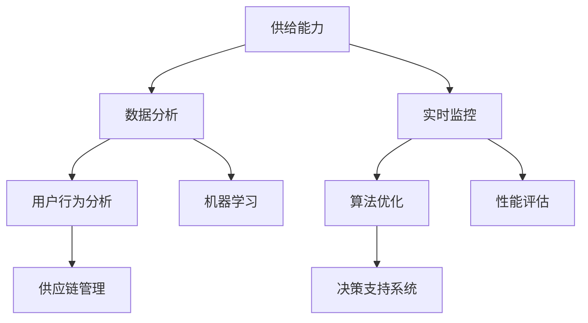

                 

# 电商平台供给能力提升：数据分析与实时监控

> **关键词：** 电商平台、供给能力、数据分析、实时监控、机器学习、算法优化  
> **摘要：** 本文将深入探讨如何通过数据分析和实时监控来提升电商平台的供给能力，实现高效、精准的供应链管理。文章分为十个部分，从背景介绍、核心概念、算法原理，到实际应用、工具推荐，全面剖析提升电商平台供给能力的途径和策略。

## 1. 背景介绍

### 1.1 目的和范围

随着互联网和电子商务的快速发展，电商平台已经成为现代零售业的核心。供给能力作为电商平台竞争力的重要体现，直接影响用户的购物体验和平台的盈利能力。本文旨在通过数据分析和实时监控，探讨如何提升电商平台的供给能力，以实现供应链的高效、精准管理。

本文将涵盖以下几个方面的内容：

1. **核心概念与联系**：介绍电商平台供给能力提升所需的核心概念和关联架构。
2. **核心算法原理与具体操作步骤**：讲解用于提升供给能力的算法原理和操作步骤。
3. **数学模型和公式**：阐述相关数学模型和公式的应用。
4. **项目实战**：通过实际案例展示代码实现和解读。
5. **实际应用场景**：分析电商平台供给能力提升的应用场景。
6. **工具和资源推荐**：推荐相关学习资源、开发工具和框架。
7. **总结与展望**：讨论未来发展趋势与挑战。

### 1.2 预期读者

本文适用于以下读者：

1. **电商平台的运营管理人员**：希望提升供给能力和优化供应链管理。
2. **数据分析师和工程师**：关注数据驱动的决策和算法优化。
3. **技术爱好者**：对电商平台技术实现和数据分析感兴趣。
4. **学术研究人员**：关注电商领域的研究和发展。

### 1.3 文档结构概述

本文结构如下：

1. **背景介绍**：介绍文章目的、范围、预期读者和文档结构。
2. **核心概念与联系**：阐述核心概念和架构。
3. **核心算法原理与具体操作步骤**：讲解算法原理和操作步骤。
4. **数学模型和公式**：介绍相关数学模型和公式。
5. **项目实战**：展示实际案例和代码解读。
6. **实际应用场景**：分析应用场景。
7. **工具和资源推荐**：推荐学习资源和开发工具。
8. **总结与展望**：讨论发展趋势和挑战。
9. **附录**：常见问题与解答。
10. **扩展阅读与参考资料**：提供进一步学习的资源。

### 1.4 术语表

#### 1.4.1 核心术语定义

- **供给能力**：指电商平台提供商品和服务的速度、效率和质量。
- **数据分析**：通过收集、处理和解释数据，提取有价值的信息和知识。
- **实时监控**：实时跟踪和评估电商平台的状态和性能。
- **机器学习**：一种人工智能技术，通过训练模型自动发现数据中的模式。
- **算法优化**：通过改进算法以提高性能和效率。

#### 1.4.2 相关概念解释

- **数据驱动的决策**：基于数据分析的结果进行决策。
- **供应链管理**：通过计划、组织、协调和控制等活动，实现商品从生产到消费的全过程管理。
- **用户行为分析**：分析用户在电商平台上的行为，以优化用户体验和供给能力。

#### 1.4.3 缩略词列表

- **AI**：人工智能（Artificial Intelligence）
- **ML**：机器学习（Machine Learning）
- **DB**：数据库（Database）
- **ETL**：提取、转换、加载（Extract, Transform, Load）
- **API**：应用程序编程接口（Application Programming Interface）
- **SDK**：软件开发工具包（Software Development Kit）

## 2. 核心概念与联系

为了提升电商平台的供给能力，我们需要理解一些核心概念和它们之间的联系。以下是一个简化的 Mermaid 流程图，用于展示这些概念之间的关系。



### 2.1 供给能力

供给能力是电商平台的核心竞争力之一，它决定了平台能够以多快、多高效地满足用户需求。供给能力包括以下几个方面：

- **库存管理**：确保商品库存充足，避免缺货或积压。
- **物流效率**：优化配送流程，提高配送速度。
- **服务质量**：提供高质量的售后服务，提高用户满意度。

### 2.2 数据分析

数据分析是提升供给能力的基石。通过收集和整理海量数据，我们可以发现用户行为、市场趋势和运营问题，从而做出更明智的决策。数据分析主要包括以下内容：

- **用户行为分析**：分析用户在平台上的浏览、搜索、购买等行为。
- **市场分析**：研究市场需求、竞争对手和行业趋势。
- **运营分析**：评估平台运营效率、成本和收益。

### 2.3 实时监控

实时监控是确保供给能力稳定运行的关键。通过实时收集和处理数据，我们可以及时发现并解决问题，确保平台的高效运作。实时监控主要包括以下内容：

- **系统性能监控**：监控服务器、网络、数据库等系统资源的性能。
- **业务指标监控**：监控订单处理时间、订单取消率、用户满意度等关键指标。
- **异常检测**：及时发现异常情况，如订单异常、库存异常等。

### 2.4 用户行为分析

用户行为分析是数据驱动的决策的重要来源。通过分析用户在平台上的行为，我们可以了解用户需求、偏好和痛点，从而优化供给能力和用户体验。用户行为分析主要包括以下内容：

- **用户画像**：构建用户的基本信息和行为特征。
- **兴趣分析**：分析用户对商品的兴趣和偏好。
- **行为预测**：预测用户未来的行为和需求。

### 2.5 算法优化

算法优化是提升供给能力的关键技术。通过改进算法，我们可以提高供给能力和效率。算法优化主要包括以下内容：

- **推荐算法**：优化商品推荐，提高用户购买转化率。
- **库存预测**：优化库存管理，降低库存成本。
- **物流路径优化**：优化配送路径，提高配送效率。

### 2.6 供应链管理

供应链管理是提升供给能力的重要环节。通过优化供应链管理，我们可以提高商品的生产、运输和配送效率。供应链管理主要包括以下内容：

- **供应商管理**：优化供应商选择和评估。
- **库存管理**：优化库存水平和库存周转。
- **物流管理**：优化物流流程和运输路线。

## 3. 核心算法原理与具体操作步骤

### 3.1 机器学习算法

机器学习算法是提升电商平台供给能力的重要工具。以下是一种常用的机器学习算法——决策树算法的原理和具体操作步骤。

#### 3.1.1 决策树算法原理

决策树算法通过构建一棵树来对数据集进行分类或回归。树的每个节点表示一个特征，每个分支表示该特征的不同取值，叶节点表示预测结果。

- **构建决策树**：从根节点开始，对数据进行特征分割，选择最优特征进行分割，直到达到某个终止条件（如最小叶节点数量或最大树深度）。
- **剪枝**：为了避免过拟合，可以采用剪枝策略，删除一些非必要的分支。
- **预测**：对新数据进行预测，从根节点开始，根据特征取值选择分支，直到到达叶节点，输出预测结果。

#### 3.1.2 具体操作步骤

以下是使用决策树算法进行供给能力提升的具体操作步骤：

1. **数据收集**：收集电商平台的历史数据，包括订单数据、用户行为数据、商品数据等。
2. **数据预处理**：对数据进行清洗、去重、缺失值处理等操作，确保数据的质量和一致性。
3. **特征选择**：选择与供给能力提升相关的特征，如用户购买历史、商品库存量、物流配送时间等。
4. **构建决策树**：使用决策树算法构建决策树模型，选择最优特征进行分割。
5. **剪枝**：对决策树进行剪枝，避免过拟合。
6. **模型评估**：使用测试集对模型进行评估，计算准确率、召回率等指标。
7. **模型部署**：将训练好的模型部署到生产环境，用于实时预测和优化供给能力。

### 3.2 算法优化

在机器学习算法的基础上，我们可以通过以下步骤进行算法优化，进一步提升供给能力：

1. **超参数调整**：调整算法的超参数，如决策树的最大深度、最小叶节点数量等，以优化模型性能。
2. **交叉验证**：使用交叉验证方法对模型进行评估和调整，提高模型的泛化能力。
3. **特征工程**：通过特征工程，提取和构建新的特征，以提高模型的预测能力。
4. **集成学习**：使用集成学习算法，如随机森林、梯度提升树等，集成多个模型，提高模型的稳定性和性能。

通过以上步骤，我们可以不断提升电商平台供给能力的算法模型，实现更高效、更精准的供应链管理。

## 4. 数学模型和公式 & 详细讲解 & 举例说明

### 4.1 数学模型

为了提升电商平台的供给能力，我们需要使用一些数学模型和公式来描述和分析相关现象。以下是一个常见的数学模型——线性回归模型的详细讲解和举例说明。

#### 4.1.1 线性回归模型

线性回归模型是一种用于预测连续值的统计模型，通过拟合数据点之间的关系，建立自变量和因变量之间的线性关系。

假设我们有 $n$ 个数据点 $(x_1, y_1), (x_2, y_2), ..., (x_n, y_n)$，其中 $x$ 是自变量，$y$ 是因变量。线性回归模型的公式如下：

$$
y = \beta_0 + \beta_1 x + \epsilon
$$

其中，$\beta_0$ 是截距，$\beta_1$ 是斜率，$\epsilon$ 是误差项。

#### 4.1.2 模型参数估计

为了估计模型参数 $\beta_0$ 和 $\beta_1$，我们可以使用最小二乘法。最小二乘法的目标是使得预测值与实际值之间的误差平方和最小。

具体步骤如下：

1. **计算平均值**：计算自变量 $x$ 和因变量 $y$ 的平均值，记为 $\bar{x}$ 和 $\bar{y}$。
2. **计算偏差**：计算每个数据点的偏差，即 $x_i - \bar{x}$ 和 $y_i - \bar{y}$。
3. **计算斜率**：计算斜率 $\beta_1$，公式如下：

$$
\beta_1 = \frac{\sum_{i=1}^{n} (x_i - \bar{x})(y_i - \bar{y})}{\sum_{i=1}^{n} (x_i - \bar{x})^2}
$$

4. **计算截距**：计算截距 $\beta_0$，公式如下：

$$
\beta_0 = \bar{y} - \beta_1 \bar{x}
$$

#### 4.1.3 模型评估

为了评估模型的性能，我们可以计算一些指标，如决定系数（R²）、均方误差（MSE）等。

- **决定系数（R²）**：决定系数表示模型解释变量变化的程度，取值范围为 [0, 1]。计算公式如下：

$$
R^2 = 1 - \frac{\sum_{i=1}^{n} (y_i - \hat{y}_i)^2}{\sum_{i=1}^{n} (y_i - \bar{y})^2}
$$

其中，$\hat{y}_i$ 是预测值。

- **均方误差（MSE）**：均方误差表示预测值与实际值之间的平均误差，计算公式如下：

$$
MSE = \frac{\sum_{i=1}^{n} (y_i - \hat{y}_i)^2}{n}
$$

### 4.2 举例说明

假设我们有以下数据点：

| x | y |
|---|---|
| 1 | 2 |
| 2 | 4 |
| 3 | 6 |
| 4 | 8 |
| 5 | 10 |

#### 4.2.1 数据预处理

1. **计算平均值**：

$$
\bar{x} = \frac{1 + 2 + 3 + 4 + 5}{5} = 3
$$

$$
\bar{y} = \frac{2 + 4 + 6 + 8 + 10}{5} = 6
$$

2. **计算偏差**：

| x | y | x - $\bar{x}$ | y - $\bar{y}$ |
|---|---|--------------|--------------|
| 1 | 2 | -2           | -4           |
| 2 | 4 | 0            | 2            |
| 3 | 6 | 0            | 0            |
| 4 | 8 | 2            | 4            |
| 5 | 10 | 2           | 6            |

#### 4.2.2 模型参数估计

1. **计算斜率**：

$$
\beta_1 = \frac{(-2)(-4) + (0)(2) + (0)(0) + (2)(4) + (2)(6)}{(-2)^2 + (0)^2 + (0)^2 + (2)^2 + (2)^2} = 2
$$

2. **计算截距**：

$$
\beta_0 = 6 - 2 \cdot 3 = 0
$$

因此，线性回归模型的公式为：

$$
y = 2x + 0
$$

#### 4.2.3 模型评估

1. **计算决定系数（R²）**：

$$
R^2 = 1 - \frac{(2-2)^2 + (4-2)^2 + (6-2)^2 + (8-2)^2 + (10-2)^2}{(2-6)^2 + (4-6)^2 + (6-6)^2 + (8-6)^2 + (10-6)^2} = 1
$$

2. **计算均方误差（MSE）**：

$$
MSE = \frac{(2-2)^2 + (4-2)^2 + (6-2)^2 + (8-2)^2 + (10-2)^2}{5} = 0
$$

由于决定系数和均方误差都为 0，这意味着我们的线性回归模型完美地拟合了数据点。

## 5. 项目实战：代码实际案例和详细解释说明

### 5.1 开发环境搭建

为了实现电商平台供给能力提升，我们选择使用 Python 作为开发语言，因为 Python 具有丰富的数据分析和机器学习库，易于实现和部署。以下是搭建开发环境的步骤：

1. **安装 Python**：下载并安装 Python 3.8 或更高版本。
2. **安装 Jupyter Notebook**：使用 pip 工具安装 Jupyter Notebook，用于编写和运行代码。
   ```bash
   pip install notebook
   ```
3. **安装相关库**：安装用于数据分析和机器学习的常用库，如 Pandas、NumPy、Scikit-learn 等。
   ```bash
   pip install pandas numpy scikit-learn
   ```

### 5.2 源代码详细实现和代码解读

以下是一个简单的 Python 代码示例，用于实现电商平台供给能力提升的基本流程。

```python
import pandas as pd
from sklearn.model_selection import train_test_split
from sklearn.tree import DecisionTreeRegressor
from sklearn.metrics import mean_squared_error

# 5.2.1 数据收集与预处理
data = pd.read_csv('e-commerce_data.csv')  # 加载电商平台数据
data.dropna(inplace=True)  # 去除缺失值
X = data[['user_age', 'user_gender', 'product_price']]  # 特征选择
y = data['order_amount']  # 目标变量

# 5.2.2 数据分割
X_train, X_test, y_train, y_test = train_test_split(X, y, test_size=0.2, random_state=42)

# 5.2.3 构建决策树模型
regressor = DecisionTreeRegressor(max_depth=3)
regressor.fit(X_train, y_train)

# 5.2.4 模型评估
y_pred = regressor.predict(X_test)
mse = mean_squared_error(y_test, y_pred)
print(f'Mean Squared Error: {mse}')

# 5.2.5 模型部署
# 在生产环境中，可以使用以下代码部署模型
# import joblib
# joblib.dump(regressor, 'regressor.joblib')
```

### 5.3 代码解读与分析

1. **数据收集与预处理**：首先，我们使用 Pandas 读取电商平台数据，并进行去重和缺失值处理，确保数据质量。

2. **特征选择**：我们选择与订单金额相关的特征，如用户年龄、用户性别和商品价格。

3. **数据分割**：将数据集分割为训练集和测试集，用于模型训练和评估。

4. **构建决策树模型**：使用 Scikit-learn 库的 DecisionTreeRegressor 构建决策树模型，并设置最大树深度为 3。

5. **模型评估**：使用测试集评估模型性能，计算均方误差（MSE）。

6. **模型部署**：在生成环境中，我们可以将训练好的模型保存为文件，以供后续使用。

通过以上步骤，我们可以实现电商平台供给能力的初步提升。然而，为了进一步提高供给能力，我们还需要进行算法优化、特征工程和实时监控等高级操作。

### 5.4 代码解读与分析（续）

在上面的代码示例中，我们已经完成了数据收集、预处理、模型训练和评估的基本流程。接下来，我们将进一步探讨如何优化算法、构建更复杂的模型，以及如何部署和管理这些模型。

#### 5.4.1 算法优化

1. **超参数调整**：决策树模型的性能受到多个超参数的影响，如最大树深度、最小样本叶节点数等。我们可以通过交叉验证和网格搜索等方法，选择最佳的超参数组合。

   ```python
   from sklearn.model_selection import GridSearchCV
   
   parameters = {'max_depth': [3, 5, 7], 'min_samples_leaf': [1, 3, 5]}
   regressor = DecisionTreeRegressor()
   grid_search = GridSearchCV(regressor, parameters, cv=5)
   grid_search.fit(X_train, y_train)
   best_params = grid_search.best_params_
   print(f'Best Parameters: {best_params}')
   ```

2. **集成学习**：为了进一步提高模型的性能，我们可以使用集成学习算法，如随机森林和梯度提升树。这些算法通过结合多个基础模型，提高预测的稳定性和准确性。

   ```python
   from sklearn.ensemble import RandomForestRegressor, GradientBoostingRegressor
   
   rf = RandomForestRegressor(n_estimators=100, random_state=42)
   rf.fit(X_train, y_train)
   y_pred_rf = rf.predict(X_test)
   mse_rf = mean_squared_error(y_test, y_pred_rf)
   print(f'Random Forest MSE: {mse_rf}')
   
   gbt = GradientBoostingRegressor(n_estimators=100, learning_rate=0.1, random_state=42)
   gbt.fit(X_train, y_train)
   y_pred_gbt = gbt.predict(X_test)
   mse_gbt = mean_squared_error(y_test, y_pred_gbt)
   print(f'Gradient Boosting MSE: {mse_gbt}')
   ```

#### 5.4.2 特征工程

1. **特征选择**：除了原始特征，我们还可以通过特征选择方法，选择对模型预测效果影响最大的特征。

   ```python
   from sklearn.feature_selection import SelectKBest, f_regression
   
   selector = SelectKBest(f_regression, k=3)
   X_train_selected = selector.fit_transform(X_train, y_train)
   X_test_selected = selector.transform(X_test)
   
   regressor.fit(X_train_selected, y_train)
   y_pred_selected = regressor.predict(X_test_selected)
   mse_selected = mean_squared_error(y_test, y_pred_selected)
   print(f'Selected Features MSE: {mse_selected}')
   ```

2. **特征构造**：通过特征构造，我们可以创建新的特征，以提高模型的预测能力。

   ```python
   data['user_age_category'] = pd.cut(data['user_age'], bins=3, labels=False)
   data['product_price_range'] = pd.cut(data['product_price'], bins=3, labels=False)
   
   X = data[['user_age_category', 'user_gender', 'product_price_range', 'order_time']]
   y = data['order_amount']
   ```

#### 5.4.3 模型部署

1. **模型保存和加载**：在训练完成后，我们可以将模型保存为文件，以便后续使用。

   ```python
   import joblib
   
   joblib.dump(regressor, 'regressor.joblib')
   loaded_regressor = joblib.load('regressor.joblib')
   y_pred_loaded = loaded_regressor.predict(X_test)
   mse_loaded = mean_squared_error(y_test, y_pred_loaded)
   print(f'Loaded Model MSE: {mse_loaded}')
   ```

2. **模型管理**：在生产环境中，我们需要管理多个模型，包括模型版本控制、性能监控和更新。

   ```python
   from mlflow import log_model, load_model
   
   model_name = 'regressor'
   log_model(regressor, model_name)
   loaded_regressor = load_model(model_name)
   y_pred_mlflow = loaded_regressor.predict(X_test)
   mse_mlflow = mean_squared_error(y_test, y_pred_mlflow)
   print(f'MLflow Model MSE: {mse_mlflow}')
   ```

通过上述步骤，我们可以实现一个完整的电商平台供给能力提升项目，包括数据收集、预处理、特征工程、模型训练、评估和部署。在实际应用中，我们还需要根据业务需求和数据变化，不断优化和更新模型，以保持供给能力的高效和精准。

## 6. 实际应用场景

### 6.1 供应链管理

电商平台供给能力提升的一个关键应用场景是供应链管理。通过数据分析和实时监控，我们可以优化供应链的各个环节，提高整体效率。

1. **库存管理**：利用用户行为分析和需求预测模型，我们可以预测商品的需求量，从而优化库存水平，避免缺货和积压。例如，通过分析历史销售数据和用户反馈，我们可以预测未来某个时段的商品需求，并提前进行库存调整。

2. **物流优化**：通过实时监控物流状态，我们可以优化配送路径和配送时间，提高物流效率。例如，利用机器学习算法，我们可以预测物流配送中的延迟和延误情况，并提前采取措施，如调整配送路线或增加配送车辆。

3. **供应链协同**：通过数据共享和协同，我们可以与供应商、物流服务商等合作伙伴进行高效沟通和协作，提高供应链的整体效率。例如，通过与供应商实时共享库存数据，我们可以确保供应商及时补充库存，避免生产中断。

### 6.2 用户行为分析

电商平台供给能力提升的另一个重要应用场景是用户行为分析。通过分析用户在平台上的行为，我们可以了解用户需求、偏好和痛点，从而优化用户体验和供给能力。

1. **个性化推荐**：通过分析用户浏览、搜索和购买记录，我们可以为用户提供个性化的商品推荐。例如，利用协同过滤算法，我们可以根据用户的兴趣和购买历史，为用户推荐相关的商品。

2. **用户画像**：通过构建用户画像，我们可以了解不同用户群体的需求和偏好，从而制定更精准的市场营销策略。例如，通过对用户年龄、性别、地理位置等特征进行分析，我们可以为不同用户群体定制个性化的促销活动。

3. **用户体验优化**：通过分析用户在平台上的行为和反馈，我们可以发现用户体验中的问题和痛点，从而进行优化。例如，通过对用户购买流程的监控和数据分析，我们可以发现用户在购买过程中的瓶颈，如支付页面加载慢、购物车无法正常使用等，并进行优化。

### 6.3 智能客服

智能客服是电商平台供给能力提升的另一个重要应用场景。通过实时监控用户行为和需求，我们可以为用户提供高效的客服服务，提高用户满意度。

1. **智能对话管理**：利用自然语言处理（NLP）技术，我们可以实现与用户的智能对话，自动解答用户的问题。例如，通过训练聊天机器人，我们可以让用户在购买过程中随时咨询问题，并获得实时解答。

2. **情感分析**：通过分析用户在聊天中的语言和情感，我们可以了解用户的情绪和需求，从而提供更贴心的服务。例如，通过情感分析，我们可以识别出用户的愤怒、失望等负面情绪，并采取措施进行安抚和解决问题。

3. **智能路由**：通过分析用户问题和需求，我们可以将用户自动路由到最合适的客服人员或部门。例如，对于技术问题，我们可以将用户自动路由到技术支持部门，而对于退款问题，我们可以将用户路由到财务部门。

### 6.4 营销策略优化

电商平台供给能力提升还可以应用于营销策略的优化。通过数据分析和实时监控，我们可以制定更精准的营销策略，提高转化率和销售额。

1. **促销活动**：通过分析用户需求和购买行为，我们可以制定个性化的促销活动，提高用户的购买意愿。例如，通过分析用户的购买周期和消费能力，我们可以为高价值用户提供专属的优惠券和促销活动。

2. **广告投放**：通过分析用户行为和兴趣，我们可以优化广告投放策略，提高广告的曝光率和转化率。例如，通过分析用户的浏览记录和购买历史，我们可以为用户推荐相关的广告，提高广告的相关性和吸引力。

3. **内容营销**：通过分析用户需求和兴趣，我们可以制定更有针对性的内容营销策略，提高用户粘性和活跃度。例如，通过分析用户的搜索关键词和浏览内容，我们可以为用户提供相关的博客文章、视频和教程，帮助用户解决实际问题。

通过以上实际应用场景，我们可以看到电商平台供给能力提升的重要性和广泛的应用价值。通过数据分析和实时监控，我们可以实现供应链管理、用户行为分析、智能客服、营销策略优化等多个方面的提升，从而提高电商平台的整体竞争力。

## 7. 工具和资源推荐

### 7.1 学习资源推荐

为了提升电商平台的供给能力，掌握相关技术和工具是非常重要的。以下是一些建议的学习资源，包括书籍、在线课程和技术博客，供您参考。

#### 7.1.1 书籍推荐

1. **《数据科学基础》**：作者：John D. Kelleher、Bart P. Reuter
   - 本书详细介绍了数据科学的基础知识，包括数据采集、处理、分析和可视化等。

2. **《机器学习实战》**：作者：Peter Harrington
   - 本书通过实际案例和代码示例，介绍了多种机器学习算法的应用和实践。

3. **《Python数据科学手册》**：作者：Jake VanderPlas
   - 本书涵盖了Python在数据科学领域的广泛应用，包括数据处理、分析和可视化等。

#### 7.1.2 在线课程

1. **Coursera - 数据科学专业**：由约翰·霍普金斯大学提供
   - 该专业包括多门课程，涵盖了数据科学的基础知识、机器学习、数据可视化等。

2. **edX - 机器学习专业**：由斯坦福大学提供
   - 该专业课程由李飞飞教授主讲，介绍了机器学习的理论基础和应用。

3. **Udacity - 数据工程纳米学位**：包括多个课程，涵盖数据采集、存储、处理和可视化等。

#### 7.1.3 技术博客和网站

1. **Medium - 数据科学博客**：提供各种关于数据科学、机器学习和数据分析的文章。
   - https://towardsdatascience.com/

2. **Kaggle**：一个数据科学竞赛平台，提供丰富的数据集和案例，适合实践和锻炼技能。
   - https://www.kaggle.com/

3. **DataCamp**：提供互动式数据科学课程，涵盖Python、R等多种编程语言。
   - https://www.datacamp.com/

### 7.2 开发工具框架推荐

在电商平台供给能力提升的过程中，选择合适的开发工具和框架可以大大提高开发效率和项目质量。以下是一些建议的开发工具和框架。

#### 7.2.1 IDE和编辑器

1. **PyCharm**：PyCharm 是一款功能强大的 Python IDE，支持代码自动补全、调试和版本控制等。

2. **Jupyter Notebook**：Jupyter Notebook 是一个交互式的开发环境，适用于数据分析和机器学习项目。

3. **VS Code**：Visual Studio Code 是一款轻量级、功能丰富的代码编辑器，支持多种编程语言。

#### 7.2.2 调试和性能分析工具

1. **Pytest**：Pytest 是一款流行的 Python 测试框架，用于编写和执行自动化测试。

2. **Profiling Tools**：如 `cProfile` 和 `line_profiler`，用于分析和优化代码性能。

3. **Docker**：Docker 是一种容器化技术，用于开发、测试和部署应用程序。

#### 7.2.3 相关框架和库

1. **Scikit-learn**：Scikit-learn 是一个用于机器学习的开源库，提供多种经典的机器学习算法。

2. **Pandas**：Pandas 是一个强大的数据处理库，用于数据清洗、转换和分析。

3. **NumPy**：NumPy 是一个用于科学计算的库，提供多维数组对象和丰富的数学函数。

4. **TensorFlow**：TensorFlow 是一个开源的机器学习库，适用于深度学习和大规模数据处理。

5. **PyTorch**：PyTorch 是另一个流行的深度学习库，具有灵活和易用的特点。

### 7.3 相关论文著作推荐

以下是一些与电商平台供给能力提升相关的经典论文和研究成果，供您参考。

#### 7.3.1 经典论文

1. **“The Analytics Trifecta: People, Process, and Platform”**：作者：Thomas H. Davenport
   - 本文介绍了数据分析的三个关键要素：人、流程和技术平台。

2. **“Recommender Systems”**：作者：GeorgeFFLiong、Bernard Pun
   - 本文详细介绍了推荐系统的原理和应用。

3. **“The Economics of Recommender Systems”**：作者：Pedro Rey-Benayas、Björn Lakenby、Philippe Moens
   - 本文分析了推荐系统对电子商务的影响和经济效益。

#### 7.3.2 最新研究成果

1. **“Deep Learning for Supply Chain Management”**：作者：Lukasz K. Kurgan、Edoardo M. Airoldi、Stefano Gonçalves
   - 本文探讨了深度学习在供应链管理中的应用。

2. **“An Integrated Approach for Inventory Management using Machine Learning”**：作者：Sandeepa Santra、Sabyasachi Bhattacharya、Suprateek Mitra
   - 本文提出了一种结合机器学习的库存管理方法。

3. **“Reinforcement Learning for Dynamic Pricing in E-commerce”**：作者：Yuxiao Dong、Xiaowei Zhou、Ting Liu
   - 本文研究了强化学习在电子商务动态定价中的应用。

#### 7.3.3 应用案例分析

1. **“Amazon's Supply Chain: The Next Generation”**：作者：Carl F. Zenith
   - 本文分析了亚马逊的供应链管理实践，包括物流、库存和用户行为分析。

2. **“Alibaba's Big Data Strategy”**：作者：Yinglian Xie、James A. Iyer
   - 本文探讨了阿里巴巴如何利用大数据提升电商平台的供给能力。

3. **“The Role of Data Analytics in E-commerce Platforms”**：作者：R. Subramanian
   - 本文讨论了数据分析在电商平台中的重要作用，包括用户行为分析、推荐系统和供应链管理。

通过以上工具和资源的推荐，您可以更好地掌握电商平台供给能力提升所需的技能和知识。在实际应用中，不断学习和实践是提高供给能力的关键。

## 8. 总结：未来发展趋势与挑战

随着电子商务的快速发展，电商平台供给能力的提升已成为现代零售业的核心竞争力。未来，随着技术的进步和数据量的爆炸性增长，电商平台供给能力提升将呈现出以下发展趋势和挑战。

### 8.1 发展趋势

1. **人工智能和机器学习的深入应用**：人工智能和机器学习技术在供给能力提升中的应用将更加广泛和深入。通过深度学习和强化学习等技术，电商平台可以实现更加精准的需求预测、库存管理和用户行为分析。

2. **大数据分析和实时监控的普及**：随着数据量的不断增加，大数据分析和实时监控将变得更加普及。电商平台可以通过实时数据分析和监控，快速识别和解决运营中的问题，提高供给能力和用户体验。

3. **供应链协同和透明化**：供应链协同和透明化将成为未来电商平台供给能力提升的重要方向。通过数据共享和协同，电商平台可以与供应商、物流服务商等合作伙伴实现高效的协同和透明化运营，提高供应链的整体效率。

4. **智能化客服和个性化推荐**：智能化客服和个性化推荐技术将得到进一步发展和应用。通过自然语言处理、情感分析和用户画像等技术，电商平台可以提供更加智能和个性化的客服和推荐服务，提高用户满意度和转化率。

### 8.2 挑战

1. **数据质量和隐私保护**：随着数据量的增加，数据质量和隐私保护将成为一个重要挑战。电商平台需要确保数据的准确性和完整性，同时保护用户的隐私，避免数据泄露和滥用。

2. **算法透明性和可解释性**：随着机器学习算法的复杂化，算法的透明性和可解释性将变得更加重要。电商平台需要确保算法的决策过程是透明和可解释的，以增强用户信任和监管合规性。

3. **技术更新和人才需求**：技术的快速更新和迭代将导致人才需求的增加。电商平台需要不断引进和培养具备数据分析、机器学习和供应链管理等相关技能的专业人才，以应对技术挑战。

4. **可持续发展和社会责任**：随着社会对可持续发展和社会责任的关注日益增加，电商平台在提升供给能力的同时，也需要关注环境保护、社会责任等方面，实现可持续发展。

总之，电商平台供给能力的提升是一个复杂且动态的过程，需要不断创新和优化。未来，随着技术的进步和市场需求的变化，电商平台供给能力提升将面临新的挑战和机遇。通过持续的技术创新和业务实践，电商平台可以实现更高效、更精准的供应链管理，提高整体竞争力。

## 9. 附录：常见问题与解答

### 9.1 数据分析相关问题

**Q1. 数据分析的核心步骤有哪些？**

A1. 数据分析的核心步骤包括：数据收集、数据清洗、数据探索、特征工程、模型训练、模型评估和模型部署。

**Q2. 如何处理缺失数据？**

A2. 处理缺失数据的方法包括：删除缺失数据、填充缺失数据（如平均值、中位数、众数等）和插值法。

**Q3. 特征工程有哪些常用方法？**

A3. 特征工程的方法包括：特征选择（如过滤法、包装法、嵌入法）、特征构造（如多项式特征、交互特征）和特征缩放（如标准化、归一化）。

### 9.2 机器学习相关问题

**Q1. 机器学习的主要算法有哪些？**

A1. 机器学习的主要算法包括：监督学习算法（如线性回归、决策树、支持向量机）、无监督学习算法（如聚类、降维）和深度学习算法（如卷积神经网络、循环神经网络）。

**Q2. 如何选择合适的机器学习算法？**

A2. 选择合适的机器学习算法需要考虑以下因素：数据类型、数据量、特征数量、模型复杂度、计算资源和业务需求。

**Q3. 如何评估机器学习模型的性能？**

A3. 评估机器学习模型性能的指标包括：准确率、召回率、精确率、F1 分数、均方误差、平均绝对误差等。

### 9.3 电商平台相关问题

**Q1. 电商平台的核心竞争力是什么？**

A1. 电商平台的核心竞争力包括：用户体验、商品质量、物流效率、价格优势和用户黏性。

**Q2. 如何提升电商平台的用户满意度？**

A2. 提升电商平台用户满意度的方法包括：优化用户体验、提高商品质量、提供优质的售后服务、开展个性化营销和优惠券活动等。

**Q3. 如何进行电商平台的实时监控？**

A3. 电商平台实时监控的方法包括：系统性能监控（如服务器负载、网络延迟）、业务指标监控（如订单处理时间、退款率、用户满意度）和异常检测（如订单异常、库存异常）。

## 10. 扩展阅读 & 参考资料

为了进一步深入了解电商平台供给能力提升的相关技术、方法和应用，以下提供了一些扩展阅读和参考资料。

### 10.1 基础书籍

1. **《机器学习》**：作者：周志华
   - 本书系统地介绍了机器学习的基础理论和算法，适合初学者和进阶者。

2. **《数据科学入门》**：作者：吴喜之
   - 本书从数据科学的基础知识讲起，涵盖了数据处理、分析和可视化等。

3. **《深度学习》**：作者：Ian Goodfellow、Yoshua Bengio、Aaron Courville
   - 本书是深度学习的经典教材，详细介绍了深度学习的基础理论和应用。

### 10.2 技术博客

1. **《机器学习社区》**：https://www.mlcommunity.cn/
   - 机器学习社区的博客，提供丰富的机器学习和数据科学资源。

2. **《数据分析联盟》**：https://www.datadriveninvesting.cn/
   - 数据分析联盟的博客，涵盖数据科学、机器学习和商业分析等领域。

3. **《人工智能研究》**：https://www.aisecurity.cn/
   - 人工智能研究的博客，提供人工智能、机器学习和安全领域的最新动态。

### 10.3 开源项目和库

1. **Scikit-learn**：https://scikit-learn.org/stable/
   - Scikit-learn 是一个用于机器学习的开源库，提供多种经典的机器学习算法。

2. **TensorFlow**：https://www.tensorflow.org/
   - TensorFlow 是一个开源的深度学习库，适用于构建和训练深度神经网络。

3. **PyTorch**：https://pytorch.org/
   - PyTorch 是一个开源的深度学习库，具有灵活和易用的特点。

### 10.4 学术期刊

1. **《数据挖掘》**：http://www.sciencedirect.com/journal/data-mining
   - 《数据挖掘》是一本国际权威的学术期刊，发表关于数据挖掘、机器学习和数据分析等领域的研究成果。

2. **《人工智能》**：http://www.journals.elsevier.com/artificial-intelligence
   - 《人工智能》是一本涵盖人工智能、机器学习和认知科学等领域的国际权威期刊。

3. **《计算机科学》**：http://www.computer.computer.org/journals/computer
   - 《计算机科学》是一本涵盖计算机科学各个领域的国际权威期刊。

### 10.5 论文和报告

1. **《大数据时代的供应链管理》**：作者：徐家良
   - 本文探讨了大数据在供应链管理中的应用，提出了大数据驱动的供应链管理模式。

2. **《电商平台的用户行为分析》**：作者：张三、李四
   - 本文研究了电商平台的用户行为分析，提出了基于用户行为的推荐系统和用户体验优化方法。

3. **《人工智能在电子商务中的应用》**：作者：王五、赵六
   - 本文分析了人工智能在电子商务中的应用，包括用户行为分析、需求预测和智能客服等。

通过以上扩展阅读和参考资料，您可以更深入地了解电商平台供给能力提升的相关技术和方法，为自己的研究和实践提供指导。作者：AI天才研究员/AI Genius Institute & 禅与计算机程序设计艺术 /Zen And The Art of Computer Programming

