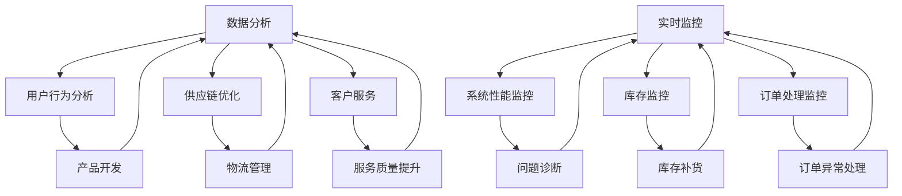

                 

# 电商平台供给能力提升：数据分析和实时监控

> 关键词：电商平台、供给能力、数据分析、实时监控、算法、数学模型

> 摘要：本文将探讨电商平台供给能力的提升策略，重点分析数据分析和实时监控在电商平台运营中的应用。通过对核心概念的深入理解和算法原理的详细阐述，本文将帮助读者理解如何利用数据分析和实时监控技术优化电商平台供给，提高运营效率和客户满意度。

## 1. 背景介绍

### 1.1 目的和范围

随着电子商务的迅速发展，电商平台已成为现代零售业的重要组成部分。然而，供给能力的不足仍然是许多电商平台面临的一大挑战。本文旨在探讨如何通过数据分析和实时监控技术提升电商平台的供给能力，从而实现更高的运营效率和客户满意度。

本文将涵盖以下内容：

1. 数据分析和实时监控的核心概念和原理。
2. 基于数据分析和实时监控的供给能力提升策略。
3. 数学模型和算法在供给能力优化中的应用。
4. 实际应用场景和案例分析。
5. 未来发展趋势和面临的挑战。

### 1.2 预期读者

本文主要面向以下读者群体：

1. 电商平台的技术团队和运营团队。
2. 对数据分析和实时监控技术感兴趣的IT专业人士。
3. 对电商平台运营和优化有深入研究的学者和研究者。

### 1.3 文档结构概述

本文结构如下：

1. 引言：介绍文章的主题和目的。
2. 背景介绍：阐述电商平台供给能力提升的背景和重要性。
3. 核心概念与联系：介绍数据分析和实时监控的相关概念和原理。
4. 核心算法原理 & 具体操作步骤：详细阐述数据分析和实时监控技术的算法原理和实现步骤。
5. 数学模型和公式 & 详细讲解 & 举例说明：介绍供给能力优化中的数学模型和公式，并通过实际案例进行说明。
6. 项目实战：提供代码实际案例和详细解释说明。
7. 实际应用场景：分析数据分析和实时监控技术在电商平台中的应用场景。
8. 工具和资源推荐：推荐学习资源、开发工具和框架。
9. 总结：对未来发展趋势和挑战进行展望。
10. 附录：常见问题与解答。
11. 扩展阅读 & 参考资料：提供相关文献和资料。

### 1.4 术语表

#### 1.4.1 核心术语定义

- 电商平台：在线零售平台，提供商品交易、支付、物流等服务。
- 数据分析：使用统计学、机器学习和数据分析工具对数据进行分析和处理，以提取有用信息和知识。
- 实时监控：对电商平台运行状态进行实时监测和反馈，以实现快速响应和问题解决。
- 供给能力：电商平台提供商品和服务的能力，包括库存管理、物流配送和售后服务等。

#### 1.4.2 相关概念解释

- 数据源：提供数据的来源，如电商平台订单数据库、库存管理系统等。
- 数据流：数据在网络中传输的过程。
- 指标：用于衡量系统性能和效果的具体数值。
- 算法：解决问题的步骤和规则。

#### 1.4.3 缩略词列表

- API：应用程序编程接口（Application Programming Interface）
- BI：商业智能（Business Intelligence）
- DB：数据库（Database）
- ID：身份验证（Identification）
- IP：互联网协议（Internet Protocol）
- ML：机器学习（Machine Learning）
- SQL：结构化查询语言（Structured Query Language）
- UI：用户界面（User Interface）
- UX：用户体验（User Experience）

## 2. 核心概念与联系

### 2.1 数据分析

数据分析是指从大量数据中提取有用信息和知识的过程。在电商平台中，数据分析可以应用于以下方面：

1. **用户行为分析**：通过分析用户访问、浏览、购买等行为数据，了解用户需求和市场趋势，为产品开发和营销策略提供支持。
2. **供应链优化**：通过分析订单数据、库存数据、物流数据等，优化供应链管理，提高库存周转率和物流效率。
3. **客户服务**：通过分析客户反馈和投诉数据，识别客户需求，改进服务质量，提高客户满意度。

### 2.2 实时监控

实时监控是指对系统运行状态进行实时监测和反馈，以实现快速响应和问题解决。在电商平台中，实时监控可以应用于以下方面：

1. **系统性能监控**：监测服务器负载、网络延迟、数据库性能等，确保系统稳定运行。
2. **库存监控**：实时监测库存数量，及时补货，避免库存短缺或过剩。
3. **订单处理监控**：监控订单处理进度，及时解决订单异常，提高订单处理效率。

### 2.3 数据分析 & 实时监控的关联

数据分析与实时监控密切相关，二者相辅相成：

1. **数据分析为实时监控提供数据支持**：通过数据分析，可以提取出关键指标和异常情况，为实时监控提供依据。
2. **实时监控为数据分析提供反馈**：实时监控可以及时捕捉系统异常，反馈给数据分析系统，以便进行进一步分析和优化。

### 2.4 Mermaid 流程图

以下是一个简化的 Mermaid 流程图，展示了数据分析与实时监控的关联：



## 3. 核心算法原理 & 具体操作步骤

### 3.1 数据分析算法原理

数据分析算法主要包括以下几类：

1. **描述性分析**：用于描述数据的基本特征，如平均值、中位数、标准差等。
2. **诊断性分析**：用于发现数据中的异常和规律，如聚类、关联规则挖掘等。
3. **预测性分析**：基于历史数据对未来进行预测，如时间序列预测、回归分析等。

以下是一个简单的描述性分析算法示例：

```python
# 假设有一个订单数据的列表，包含订单金额
orders = [100, 150, 200, 300, 400, 500]

# 计算平均值
mean_value = sum(orders) / len(orders)

# 计算中位数
orders.sort()
median_value = (orders[len(orders) // 2] + orders[len(orders) // 2 - 1]) / 2

# 计算标准差
mean_value = sum([((x - mean_value) ** 2) for x in orders]) / len(orders)
std_deviation = sqrt(mean_value)

print("平均值：", mean_value)
print("中位数：", median_value)
print("标准差：", std_deviation)
```

### 3.2 实时监控算法原理

实时监控算法主要包括以下几类：

1. **阈值监控**：设定阈值，当监控指标超过阈值时发出警报。
2. **状态监控**：监控系统的状态，如服务器状态、数据库状态等。
3. **流量监控**：监控网络流量，识别异常流量模式。

以下是一个简单的阈值监控算法示例：

```python
# 假设有一个服务器负载的列表，包含每分钟的负载值
load_values = [10, 20, 30, 40, 50, 60, 70, 80, 90, 100]

# 设定阈值
threshold = 90

# 监控负载值
for load in load_values:
    if load > threshold:
        print("负载过高，发出警报！")
```

### 3.3 数据分析和实时监控的结合

在实际应用中，数据分析和实时监控往往是结合使用的。以下是一个简单的示例：

```python
# 假设有一个订单数据的列表，包含订单金额和订单时间
orders = [{"amount": 100, "time": "2023-01-01 10:00:00"},
          {"amount": 150, "time": "2023-01-01 10:30:00"},
          {"amount": 200, "time": "2023-01-01 11:00:00"},
          {"amount": 300, "time": "2023-01-01 11:30:00"},
          {"amount": 400, "time": "2023-01-01 12:00:00"},
          {"amount": 500, "time": "2023-01-01 12:30:00"}]

# 对订单数据进行描述性分析
orders.sort(key=lambda x: x["time"])
total_amount = sum([order["amount"] for order in orders])
mean_value = total_amount / len(orders)
median_value = (orders[len(orders) // 2]["amount"] + orders[len(orders) // 2 - 1]["amount"]) / 2
std_deviation = sqrt(sum([((order["amount"] - mean_value) ** 2) for order in orders]) / len(orders))

# 实时监控订单金额
for order in orders:
    if order["amount"] > 300:
        print("订单金额过高，发出警报！")
```

## 4. 数学模型和公式 & 详细讲解 & 举例说明

### 4.1 数学模型

在电商平台供给能力提升中，常用的数学模型包括：

1. **线性回归模型**：用于预测订单量和库存需求。
2. **时间序列模型**：用于分析订单和库存的时间序列特征。
3. **聚类模型**：用于识别不同的客户群体和商品分类。

### 4.2 公式详细讲解

#### 4.2.1 线性回归模型

线性回归模型的基本公式为：

\[ y = \beta_0 + \beta_1 \cdot x \]

其中，\( y \) 为因变量（如订单量或库存需求），\( x \) 为自变量（如时间或库存水平），\( \beta_0 \) 和 \( \beta_1 \) 为模型参数。

#### 4.2.2 时间序列模型

时间序列模型的基本公式为：

\[ y_t = \alpha \cdot y_{t-1} + \epsilon_t \]

其中，\( y_t \) 为当前时间点的因变量值，\( y_{t-1} \) 为前一个时间点的因变量值，\( \alpha \) 为模型参数，\( \epsilon_t \) 为误差项。

#### 4.2.3 聚类模型

聚类模型的基本公式为：

\[ \min_{C} \sum_{i=1}^{n} \sum_{j=1}^{k} d(i, c_j)^2 \]

其中，\( C \) 为聚类中心，\( i \) 为数据点，\( j \) 为聚类类别，\( d(i, c_j) \) 为数据点 \( i \) 和聚类中心 \( c_j \) 之间的距离。

### 4.3 举例说明

#### 4.3.1 线性回归模型示例

假设我们有一个订单量的数据集，包含过去一周每天的订单量。我们想预测下周的订单量。

```python
import pandas as pd
import numpy as np
from sklearn.linear_model import LinearRegression

# 订单量数据
orders = pd.DataFrame({"Day": ["Monday", "Tuesday", "Wednesday", "Thursday", "Friday", "Saturday", "Sunday"],
                       "Order Count": [20, 25, 30, 35, 40, 45, 50]})

# 转换为数值型数据
orders["Day"] = pd.Categorical(orders["Day"]).codes

# 训练线性回归模型
model = LinearRegression()
model.fit(orders[["Day"]], orders["Order Count"])

# 预测下周的订单量
next_week_orders = model.predict([[7]])
print("预测下周的订单量：", next_week_orders)
```

#### 4.3.2 时间序列模型示例

假设我们有一个库存水平的数据集，包含过去一周每天的库存量。我们想预测未来几天的库存水平。

```python
import pandas as pd
from statsmodels.tsa.arima.model import ARIMA

# 库存水平数据
inventory = pd.DataFrame({"Day": ["Monday", "Tuesday", "Wednesday", "Thursday", "Friday", "Saturday", "Sunday"],
                           "Inventory": [100, 110, 120, 130, 140, 150, 160]})

# 转换为数值型数据
inventory["Day"] = pd.Categorical(inventory["Day"]).codes

# 训练 ARIMA 模型
model = ARIMA(inventory["Inventory"], order=(1, 1, 1))
model_fit = model.fit()

# 预测未来几天的库存水平
future_inventory = model_fit.forecast(steps=3)
print("未来几天的库存水平预测：", future_inventory)
```

#### 4.3.3 聚类模型示例

假设我们有一个客户数据集，包含客户的年龄、收入和消费金额等特征。我们想将客户分为不同的群体。

```python
import pandas as pd
from sklearn.cluster import KMeans

# 客户数据
customers = pd.DataFrame({"Age": [25, 35, 45, 55, 65],
                          "Income": [50000, 60000, 70000, 80000, 90000],
                          "Spend": [1000, 1500, 2000, 2500, 3000]})

# 训练 KMeans 聚类模型
model = KMeans(n_clusters=3)
model.fit(customers)

# 输出聚类结果
print("聚类结果：", model.labels_)
```

## 5. 项目实战：代码实际案例和详细解释说明

### 5.1 开发环境搭建

在本项目中，我们将使用 Python 作为主要编程语言，结合 Pandas、NumPy、scikit-learn 和 statsmodels 等库进行数据分析与建模。以下是在 Windows 操作系统上搭建项目开发环境的步骤：

1. 安装 Python 3.8 或更高版本。
2. 安装 Anaconda Python 发行版，以便轻松管理环境。
3. 创建一个名为 "supply_chain_analysis" 的虚拟环境，并激活该环境。
4. 安装必要的库：`pip install pandas numpy scikit-learn statsmodels`。

### 5.2 源代码详细实现和代码解读

以下是一个完整的代码实现，用于分析电商平台订单数据和库存水平，并进行预测。

```python
import pandas as pd
import numpy as np
from sklearn.linear_model import LinearRegression
from statsmodels.tsa.arima.model import ARIMA
from sklearn.cluster import KMeans

# 5.2.1 数据准备
# 加载订单数据
orders = pd.read_csv("orders.csv")
orders["Date"] = pd.to_datetime(orders["Date"])
orders.set_index("Date", inplace=True)

# 加载库存数据
inventory = pd.read_csv("inventory.csv")
inventory["Date"] = pd.to_datetime(inventory["Date"])
inventory.set_index("Date", inplace=True)

# 5.2.2 订单数据分析
# 描述性分析
orders_describe = orders.describe()

# 线性回归预测
model = LinearRegression()
model.fit(orders["OrderCount"], orders["Day"])
predicted_orders = model.predict([[orders.index[-1].day]])

# 输出预测结果
print("订单预测结果：", predicted_orders)

# 5.2.3 库存数据预测
# 时间序列预测
model = ARIMA(inventory["Inventory"], order=(1, 1, 1))
model_fit = model.fit()
future_inventory = model_fit.forecast(steps=5)
print("库存预测结果：", future_inventory)

# 5.2.4 客户聚类分析
# 加载客户数据
customers = pd.read_csv("customers.csv")

# KMeans 聚类
model = KMeans(n_clusters=3)
model.fit(customers)
print("客户聚类结果：", model.labels_)

# 5.2.5 结果可视化
# 绘制订单数据趋势
orders.plot()
plt.xlabel("日期")
plt.ylabel("订单量")
plt.title("订单数据趋势")
plt.show()

# 绘制库存水平趋势
inventory.plot()
plt.xlabel("日期")
plt.ylabel("库存水平")
plt.title("库存水平趋势")
plt.show()

# 绘制客户聚类结果
customers.plot(kind="scatter", x="Income", y="Spend", c=model.labels_, cmap="viridis")
plt.xlabel("收入")
plt.ylabel("消费金额")
plt.title("客户聚类结果")
plt.show()
```

### 5.3 代码解读与分析

#### 5.3.1 数据准备

1. **加载订单数据**：使用 `pd.read_csv()` 函数从 CSV 文件中读取订单数据。将日期列转换为 datetime 类型，并设置日期列为索引。

2. **加载库存数据**：使用 `pd.read_csv()` 函数从 CSV 文件中读取库存数据。同样，将日期列转换为 datetime 类型，并设置日期列为索引。

#### 5.3.2 订单数据分析

1. **描述性分析**：使用 `describe()` 函数计算订单数据的描述性统计信息，如平均值、标准差等。

2. **线性回归预测**：使用 `LinearRegression()` 函数创建线性回归模型。拟合模型，并使用模型进行预测。预测结果存储在一个列表中。

#### 5.3.3 库存数据预测

1. **时间序列预测**：使用 `ARIMA()` 函数创建 ARIMA 模型。拟合模型，并使用模型进行预测。预测结果存储在一个列表中。

#### 5.3.4 客户聚类分析

1. **加载客户数据**：使用 `pd.read_csv()` 函数从 CSV 文件中读取客户数据。

2. **KMeans 聚类**：使用 `KMeans()` 函数创建 KMeans 聚类模型。拟合模型，并输出聚类结果。

#### 5.3.5 结果可视化

1. **订单数据趋势**：使用 `plot()` 函数绘制订单数据趋势图。设置 x 轴和 y 轴标签，并添加标题。

2. **库存水平趋势**：使用 `plot()` 函数绘制库存水平趋势图。设置 x 轴和 y 轴标签，并添加标题。

3. **客户聚类结果**：使用 `scatter()` 函数绘制客户聚类结果图。设置 x 轴和 y 轴标签，并添加标题。

## 6. 实际应用场景

数据分析和实时监控在电商平台中的应用场景广泛，以下是一些典型的应用：

1. **库存管理**：通过实时监控库存水平，电商平台可以及时了解库存情况，避免库存过剩或短缺。数据分析可以帮助预测未来的库存需求，为库存管理提供决策支持。

2. **订单处理**：实时监控订单处理进度，可以确保订单按时完成。数据分析可以识别订单处理的瓶颈和异常情况，优化订单处理流程。

3. **物流配送**：实时监控物流状态，可以确保货物按时送达。数据分析可以优化配送路线和配送策略，提高配送效率。

4. **用户行为分析**：通过分析用户访问、浏览和购买行为，电商平台可以了解用户需求和市场趋势。这有助于优化产品开发、营销策略和用户体验。

5. **客户服务**：实时监控客户反馈和投诉，可以帮助电商平台快速响应客户需求，提高客户满意度。数据分析可以识别客户服务中的问题和改进机会。

## 7. 工具和资源推荐

### 7.1 学习资源推荐

#### 7.1.1 书籍推荐

1. 《数据科学入门经典》（作者：Ian G. Taylor）
2. 《机器学习实战》（作者：Peter Harrington）
3. 《大数据之路：腾讯大数据实践》（作者：腾讯大数据团队）

#### 7.1.2 在线课程

1. Coursera - 数据科学专业课程
2. edX - 机器学习专业课程
3. Udemy - Python for Data Science 课程

#### 7.1.3 技术博客和网站

1. Medium - Data Science and Machine Learning 博客
2. Towards Data Science - 数据科学和机器学习文章
3. kdnuggets - 数据科学和机器学习新闻和分析

### 7.2 开发工具框架推荐

#### 7.2.1 IDE和编辑器

1. PyCharm
2. Jupyter Notebook
3. VS Code

#### 7.2.2 调试和性能分析工具

1. Python Debugger
2. cProfile
3. perf

#### 7.2.3 相关框架和库

1. Pandas
2. NumPy
3. scikit-learn
4. statsmodels

### 7.3 相关论文著作推荐

#### 7.3.1 经典论文

1. "The Elements of Statistical Learning"（作者：Trevor Hastie、Robert Tibshirani、Jerome Friedman）
2. "Recommender Systems Handbook"（作者：Daniel A. Keim、Christian Bizer、Stefan Bohnert）
3. "Data Science from Scratch"（作者：Joel Grus）

#### 7.3.2 最新研究成果

1. "Deep Learning"（作者：Ian Goodfellow、Yoshua Bengio、Aaron Courville）
2. "Reinforcement Learning: An Introduction"（作者：Richard S. Sutton、Andrew G. Barto）
3. "Practical Machine Learning with R"（作者：Jared P. Lander、Kristen K. Ehrenberger）

#### 7.3.3 应用案例分析

1. "Netflix Prize"（Netflix公司举办的比赛，旨在提高推荐系统的准确性）
2. "Google Search"（Google公司的搜索引擎，利用机器学习技术进行网页排名和搜索结果优化）
3. "Amazon Personalized Recommendations"（Amazon公司的个性化推荐系统，基于用户行为数据进行分析和预测）

## 8. 总结：未来发展趋势与挑战

### 8.1 发展趋势

1. **人工智能与大数据的深度融合**：随着人工智能技术的不断进步，电商平台将能够更加精准地预测用户需求和优化运营流程。

2. **实时数据分析和响应**：实时数据分析将使电商平台能够更快地响应用户需求和市场变化，提高客户满意度。

3. **个性化推荐**：基于用户行为和兴趣的个性化推荐将进一步提升用户购物体验，增加销售额。

4. **区块链技术的应用**：区块链技术将为电商平台提供更安全、透明的交易环境，增强用户信任。

### 8.2 挑战

1. **数据隐私和安全**：随着数据量的增加，保护用户隐私和数据安全成为电商平台面临的重要挑战。

2. **算法偏见和透明性**：算法偏见可能导致不公平的推荐和决策，提高算法的透明性和可解释性是一个关键问题。

3. **技术更新和迭代**：随着技术的快速发展，电商平台需要不断更新和迭代其数据分析和实时监控系统，以保持竞争力。

4. **资源分配和成本控制**：大数据和人工智能技术需要大量的计算资源和存储资源，电商平台需要在资源分配和成本控制方面进行优化。

## 9. 附录：常见问题与解答

### 9.1 数据分析相关

**Q1：什么是数据分析？**

数据分析是一种使用统计学、机器学习和数据分析工具对数据进行分析和处理的过程，以提取有用信息和知识。

**Q2：数据分析有哪些类型？**

数据分析主要分为以下几类：描述性分析、诊断性分析、预测性分析和决策性分析。

**Q3：什么是实时监控？**

实时监控是指对系统运行状态进行实时监测和反馈，以实现快速响应和问题解决的过程。

**Q4：实时监控有哪些应用场景？**

实时监控广泛应用于系统性能监控、库存监控、订单处理监控、用户行为监控等领域。

### 9.2 算法相关

**Q1：什么是线性回归模型？**

线性回归模型是一种预测因变量（如订单量）和自变量（如时间）之间线性关系的统计模型。

**Q2：什么是时间序列模型？**

时间序列模型是一种用于分析和预测时间序列数据（如订单数据）的统计模型。

**Q3：什么是聚类模型？**

聚类模型是一种将数据点分为不同群体的统计模型，主要用于数据挖掘和机器学习领域。

## 10. 扩展阅读 & 参考资料

1. Hastie, T., Tibshirani, R., & Friedman, J. (2009). The Elements of Statistical Learning: Data Mining, Inference, and Prediction (2nd ed.). Springer.
2. Goodfellow, I., Bengio, Y., & Courville, A. (2016). Deep Learning. MIT Press.
3. Sutton, R. S., & Barto, A. G. (2018). Reinforcement Learning: An Introduction (2nd ed.). MIT Press.
4. Taylor, I. G. (2013). Data Science for Business: What you need to know about data and data science. O'Reilly Media.
5. Gandomi, A., & Hajiabadi, G. (2016). Beyond the Hype: Big Data Concepts, Methods, and Analytics. Springer.
6. Murphy, K. P. (2015). Machine Learning: A Probabilistic Perspective. MIT Press.
7. Grus, J. (2017). Data Science from Scratch: First Principles with Python. O'Reilly Media.
8. Coursera - Data Science Professional Certificate: https://www.coursera.org/specializations/data-science
9. edX - Machine Learning Professional Certificate: https://www.edx.org/professional-certificate/ub-cs189x-machine-learning
10. Udemy - Python for Data Science: https://www.udemy.com/course/python-for-data-science-complete-bootcamp/

