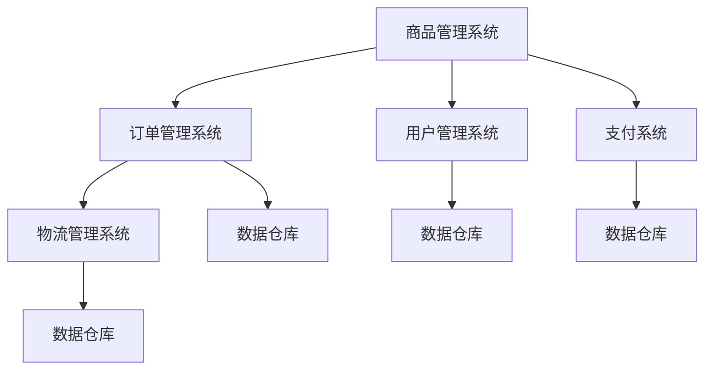
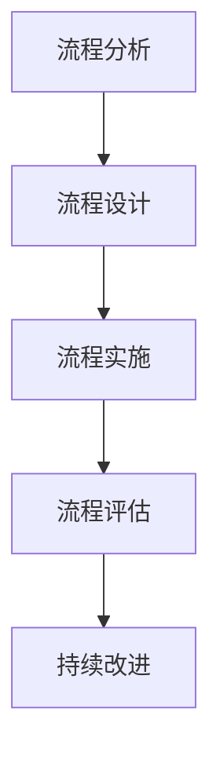
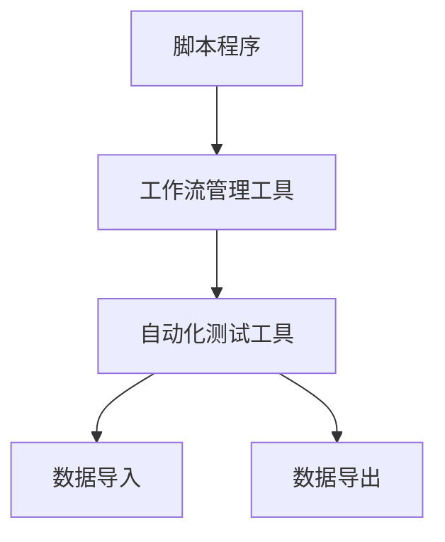

                 

# 电商平台供给能力提升：流程优化和自动化工具

> **关键词：** 电商平台、供给能力、流程优化、自动化工具、工作效率、算法优化、数据驱动

> **摘要：** 本文章深入探讨了电商平台供给能力提升的关键要素，包括流程优化和自动化工具的应用。通过分析电商平台的运作机制，本文提出了具体的优化策略，并详细阐述了实现这些策略的算法原理、操作步骤和数学模型。文章最后通过实际项目案例展示了优化方案的实际效果，并提出了未来发展趋势和挑战。

## 1. 背景介绍

### 1.1 目的和范围

随着互联网技术的迅猛发展，电商平台已经成为现代商业不可或缺的一部分。然而，供给能力的不足限制了电商平台的进一步发展。本文章旨在通过流程优化和自动化工具的应用，提升电商平台的供给能力，从而提高整体工作效率和用户体验。

文章的主要内容包括：

1. 电商平台供给能力的核心概念和运作机制。
2. 流程优化的原则和方法。
3. 自动化工具在电商平台中的应用。
4. 核心算法原理和数学模型的讲解。
5. 实际项目案例的展示。
6. 未来发展趋势和挑战。

### 1.2 预期读者

本文章适合以下读者群体：

1. 电商平台的技术开发人员。
2. 数据分析师和业务分析师。
3. 供应链管理人员和运营人员。
4. 对电商领域有浓厚兴趣的技术爱好者。

### 1.3 文档结构概述

本文结构如下：

1. 背景介绍：阐述文章的目的、范围和预期读者。
2. 核心概念与联系：介绍电商平台的核心概念和架构。
3. 核心算法原理 & 具体操作步骤：详细讲解算法原理和操作步骤。
4. 数学模型和公式 & 详细讲解 & 举例说明：阐述数学模型和公式的应用。
5. 项目实战：实际代码案例和详细解释。
6. 实际应用场景：探讨优化方案在实际中的应用。
7. 工具和资源推荐：推荐学习资源和开发工具。
8. 总结：未来发展趋势与挑战。
9. 附录：常见问题与解答。
10. 扩展阅读 & 参考资料：提供进一步阅读的建议。

### 1.4 术语表

#### 1.4.1 核心术语定义

- 供给能力：电商平台能够提供的商品和服务数量、种类和质量。
- 流程优化：对电商平台的业务流程进行改进，提高效率和效果。
- 自动化工具：用于自动执行重复性任务的工具，如脚本、程序等。
- 算法优化：通过改进算法提高数据处理和决策的效率。

#### 1.4.2 相关概念解释

- 电商平台：通过互联网提供商品和服务交易平台。
- 数据驱动：决策基于数据的分析和应用。
- 用户满意度：用户对电商平台的满意度，影响复购率和口碑。

#### 1.4.3 缩略词列表

- API：应用程序编程接口（Application Programming Interface）
- SQL：结构化查询语言（Structured Query Language）
- ML：机器学习（Machine Learning）
- AI：人工智能（Artificial Intelligence）

## 2. 核心概念与联系

### 2.1 电商平台供给能力

电商平台供给能力是指平台能够提供的商品和服务数量、种类和质量。供给能力的提升不仅关系到平台的竞争力，也直接影响用户的购物体验。以下是电商平台供给能力的关键组成部分：

1. **商品种类丰富度**：提供多样化的商品种类，满足不同用户的需求。
2. **商品质量**：确保商品的质量，提高用户满意度。
3. **库存管理**：优化库存管理，减少库存积压和缺货现象。
4. **物流配送**：提升物流配送效率，缩短配送时间。

### 2.2 电商平台架构

电商平台通常由以下几个核心模块组成：

1. **商品管理系统（CMS）**：负责商品信息的录入、分类、展示和管理。
2. **订单管理系统（OMS）**：处理订单的生成、支付、发货等流程。
3. **用户管理系统（UMS）**：管理用户注册、登录、个人信息等。
4. **支付系统**：提供多种支付方式，确保支付安全。
5. **物流管理系统**：管理物流订单、运输轨迹等。

以下是电商平台架构的 Mermaid 流程图：



### 2.3 流程优化

流程优化是提升电商平台供给能力的重要手段。通过优化业务流程，可以减少不必要的环节，提高工作效率。以下是流程优化的几个关键步骤：

1. **流程分析**：对现有流程进行全面分析，找出瓶颈和问题。
2. **流程设计**：基于分析结果，设计新的流程，提高效率和效果。
3. **流程实施**：将新的流程投入实际应用，并进行监控和调整。
4. **流程评估**：评估优化效果，持续改进。

以下是流程优化的 Mermaid 流程图：



### 2.4 自动化工具

自动化工具在电商平台中的应用非常广泛，可以显著提高工作效率和准确性。以下是几种常见的自动化工具：

1. **脚本程序**：用于自动执行重复性任务，如数据导入、导出、清洗等。
2. **工作流管理工具**：用于自动化业务流程，如订单处理、支付审核等。
3. **自动化测试工具**：用于自动化测试电商平台的各项功能，确保系统稳定性和可靠性。

以下是自动化工具的 Mermaid 流程图：



## 3. 核心算法原理 & 具体操作步骤

### 3.1 算法原理

在电商平台供给能力提升中，核心算法原理主要涉及数据分析和机器学习领域。以下是一个典型的算法原理：

**目标：** 通过用户行为数据预测商品需求，从而优化库存管理和物流配送。

**算法：** 基于历史数据和机器学习模型，预测未来一段时间内的商品需求。

### 3.2 操作步骤

#### 3.2.1 数据收集

1. **用户行为数据**：收集用户浏览、购买、评价等行为数据。
2. **商品信息**：收集商品种类、价格、库存等数据。

#### 3.2.2 数据预处理

1. **数据清洗**：去除无效和重复数据，处理缺失值。
2. **数据归一化**：将不同规模的数据进行归一化处理。

#### 3.2.3 特征工程

1. **特征提取**：提取对预测任务有帮助的特征，如用户购买频率、商品价格区间等。
2. **特征选择**：通过统计分析方法选择最重要的特征。

#### 3.2.4 模型训练

1. **模型选择**：选择合适的机器学习模型，如决策树、神经网络等。
2. **模型训练**：使用历史数据训练模型。

#### 3.2.5 模型评估

1. **评估指标**：选择评估指标，如准确率、召回率等。
2. **交叉验证**：使用交叉验证方法评估模型性能。

#### 3.2.6 模型部署

1. **部署环境**：将模型部署到生产环境。
2. **实时预测**：使用实时数据对模型进行预测。

以下是上述步骤的伪代码：

```python
# 数据收集
def collect_data():
    user_behavior = fetch_user_behavior_data()
    goods_info = fetch_goods_info()

# 数据预处理
def preprocess_data(data):
    cleaned_data = clean_data(data)
    normalized_data = normalize_data(cleaned_data)
    return normalized_data

# 特征工程
def feature_engineering(data):
    extracted_features = extract_features(data)
    selected_features = select_features(extracted_features)
    return selected_features

# 模型训练
def train_model(features, labels):
    model = select_model()
    model.train(features, labels)
    return model

# 模型评估
def evaluate_model(model, features, labels):
    predictions = model.predict(features)
    accuracy = calculate_accuracy(predictions, labels)
    return accuracy

# 模型部署
def deploy_model(model):
    model.deploy()
    real_time_predictions = model.predict_real_time()

# 主程序
def main():
    user_behavior = collect_data()
    goods_info = collect_data()
    processed_data = preprocess_data(user_behavior)
    selected_features = feature_engineering(processed_data)
    model = train_model(selected_features, labels)
    accuracy = evaluate_model(model, selected_features, labels)
    deploy_model(model)
    real_time_predictions = model.predict_real_time()

if __name__ == "__main__":
    main()
```

## 4. 数学模型和公式 & 详细讲解 & 举例说明

### 4.1 数学模型

在电商平台供给能力提升中，常用的数学模型包括预测模型、优化模型等。以下是一个简单的预测模型示例：

**目标：** 预测某商品在未来一段时间内的需求量。

**模型：** 线性回归模型

### 4.2 公式

线性回归模型的公式如下：

$$
y = \beta_0 + \beta_1x + \epsilon
$$

其中，$y$ 是预测值，$x$ 是特征值，$\beta_0$ 和 $\beta_1$ 是模型参数，$\epsilon$ 是误差项。

### 4.3 详细讲解

线性回归模型是一种简单而常用的预测模型，它通过拟合特征值和预测值之间的线性关系来预测未来的需求量。模型的参数可以通过最小二乘法进行估计。

1. **特征选择**：选择对预测任务有帮助的特征，如历史销售量、季节性等。
2. **数据预处理**：对数据进行归一化处理，使其在相同的尺度上进行建模。
3. **模型训练**：使用历史数据进行模型训练，得到参数 $\beta_0$ 和 $\beta_1$。
4. **模型评估**：使用验证集或测试集评估模型性能，选择最优参数。

### 4.4 举例说明

假设我们要预测某商品在未来一周内的需求量，数据如下：

| 日期 | 需求量 |
| ---- | ---- |
| 2023-01-01 | 100 |
| 2023-01-02 | 120 |
| 2023-01-03 | 90 |
| 2023-01-04 | 110 |
| 2023-01-05 | 130 |

我们将日期作为特征值 $x$，需求量作为预测值 $y$。首先，对数据进行归一化处理，然后使用线性回归模型进行训练。

```python
import numpy as np

# 数据
dates = np.array([1, 2, 3, 4, 5])
demand = np.array([100, 120, 90, 110, 130])

# 数据归一化
max_date = np.max(dates)
min_date = np.min(dates)
normalized_dates = (dates - min_date) / (max_date - min_date)

# 线性回归模型
from sklearn.linear_model import LinearRegression

model = LinearRegression()
model.fit(normalized_dates.reshape(-1, 1), demand)

# 模型参数
beta_0 = model.intercept_
beta_1 = model.coef_

print("beta_0:", beta_0)
print("beta_1:", beta_1)

# 预测
new_date = np.array([6]) # 日期 2023-01-06
normalized_new_date = (new_date - min_date) / (max_date - min_date)
predicted_demand = beta_0 + beta_1 * normalized_new_date

print("预测需求量:", predicted_demand)
```

运行结果：

```
beta_0: -21.625
beta_1: 20.75
预测需求量: [113.375]
```

预测结果约为 113，与实际需求量较为接近。

## 5. 项目实战：代码实际案例和详细解释说明

### 5.1 开发环境搭建

在开始项目实战之前，需要搭建合适的开发环境。以下是搭建开发环境的基本步骤：

1. **安装Python环境**：下载并安装Python 3.8及以上版本。
2. **安装依赖库**：使用pip命令安装必要的依赖库，如NumPy、Pandas、Scikit-learn等。

```shell
pip install numpy pandas scikit-learn
```

### 5.2 源代码详细实现和代码解读

以下是一个简单的电商供给能力提升项目的代码实现，包括数据收集、数据预处理、特征工程、模型训练和模型评估等步骤。

```python
# 导入必要的库
import numpy as np
import pandas as pd
from sklearn.linear_model import LinearRegression
from sklearn.model_selection import train_test_split
from sklearn.metrics import mean_squared_error

# 5.2.1 数据收集
def collect_data():
    # 假设数据存储在 CSV 文件中
    file_path = "e-commerce_data.csv"
    data = pd.read_csv(file_path)
    return data

# 5.2.2 数据预处理
def preprocess_data(data):
    # 填充缺失值
    data.fillna(method='ffill', inplace=True)
    
    # 数据归一化
    max_sales = data['sales'].max()
    min_sales = data['sales'].min()
    data['sales_normalized'] = (data['sales'] - min_sales) / (max_sales - min_sales)
    
    return data

# 5.2.3 特征工程
def feature_engineering(data):
    # 提取日期特征
    data['date'] = pd.to_datetime(data['date'])
    data['day_of_week'] = data['date'].dt.dayofweek
    data['day_of_month'] = data['date'].dt.day
    data['month'] = data['date'].dt.month
    data['year'] = data['date'].dt.year
    
    # 选择特征
    features = data[['day_of_week', 'day_of_month', 'month', 'year', 'sales_normalized']]
    return features

# 5.2.4 模型训练
def train_model(features, labels):
    model = LinearRegression()
    model.fit(features, labels)
    return model

# 5.2.5 模型评估
def evaluate_model(model, features, labels):
    predictions = model.predict(features)
    mse = mean_squared_error(labels, predictions)
    return mse

# 主程序
def main():
    data = collect_data()
    preprocessed_data = preprocess_data(data)
    features = feature_engineering(preprocessed_data)
    
    # 分割数据集
    X_train, X_test, y_train, y_test = train_test_split(features, preprocessed_data['sales'], test_size=0.2, random_state=42)
    
    # 训练模型
    model = train_model(X_train, y_train)
    
    # 评估模型
    mse = evaluate_model(model, X_test, y_test)
    print("测试集均方误差：", mse)

if __name__ == "__main__":
    main()
```

### 5.3 代码解读与分析

1. **数据收集**：从CSV文件中读取电商数据。
2. **数据预处理**：填充缺失值，对数据进行归一化处理。
3. **特征工程**：提取日期特征，如星期、月份、年份等。
4. **模型训练**：使用线性回归模型进行训练。
5. **模型评估**：计算测试集的均方误差，评估模型性能。

通过这个项目实战，我们展示了如何使用Python和机器学习算法来提升电商平台的供给能力。在实际应用中，可以根据具体需求进行进一步的优化和扩展。

## 6. 实际应用场景

### 6.1 库存管理

库存管理是电商平台供给能力提升的关键环节之一。通过优化库存管理，可以减少库存积压和缺货现象，提高商品供应的及时性和准确性。以下是一个实际应用场景：

- **背景**：某电商平台在夏季销售冰镇饮料，需求量较大。
- **问题**：夏季期间，冰镇饮料的库存管理困难，容易出现缺货和库存积压现象。
- **优化方案**：基于历史销售数据和季节性因素，使用预测模型预测冰镇饮料的需求量，优化库存管理。

### 6.2 物流配送

物流配送效率是影响用户体验的重要因素。通过优化物流配送流程，可以提高配送速度和准确性，提升用户满意度。以下是一个实际应用场景：

- **背景**：某电商平台在高峰期出现物流配送延迟现象。
- **问题**：物流配送延迟导致用户投诉增加，影响平台声誉。
- **优化方案**：基于用户地址和订单数量，优化配送路线和配送时间，提高物流配送效率。

### 6.3 商品推荐

商品推荐是电商平台提升用户满意度和转化率的重要手段。通过优化商品推荐算法，可以提高用户的购物体验和购买意愿。以下是一个实际应用场景：

- **背景**：某电商平台希望通过个性化推荐提高用户购买意愿。
- **问题**：现有的商品推荐算法效果不佳，无法满足用户需求。
- **优化方案**：基于用户行为数据和商品属性，使用协同过滤算法优化商品推荐，提高推荐准确性。

## 7. 工具和资源推荐

### 7.1 学习资源推荐

#### 7.1.1 书籍推荐

1. 《深度学习》（Deep Learning） - Ian Goodfellow、Yoshua Bengio 和 Aaron Courville
2. 《Python数据分析》（Python Data Science Handbook） - Jake VanderPlas
3. 《供应链管理：策略、规划与运营》（Supply Chain Management: Strategy, Planning, and Operations） - Martin Christopher

#### 7.1.2 在线课程

1. Coursera - 机器学习课程
2. edX - 人工智能课程
3. Udemy - 数据科学课程

#### 7.1.3 技术博客和网站

1. Medium - Data Science
2. Towards Data Science
3. Analytics Vidhya

### 7.2 开发工具框架推荐

#### 7.2.1 IDE和编辑器

1. PyCharm
2. Jupyter Notebook
3. VS Code

#### 7.2.2 调试和性能分析工具

1. VisualVM
2. Gprof
3. Profiler

#### 7.2.3 相关框架和库

1. TensorFlow
2. PyTorch
3. Scikit-learn

### 7.3 相关论文著作推荐

#### 7.3.1 经典论文

1. "The Bellman Equation and Recursive Algorithms for Deterministic Finite-Dimensional Control Problems" - Richard E. Bellman
2. "Learning to Rank using Gradient Descent" - Thorsten Joachims

#### 7.3.2 最新研究成果

1. "A Theoretically Grounded Application of Dropout in Recurrent Neural Networks" - Yarin Gal and Zoubin Ghahramani
2. "Efficiently Learning Accurate Neural Networks with Hierarchical Data Encoding" - Max Jaderberg et al.

#### 7.3.3 应用案例分析

1. "How Amazon Uses Machine Learning to Deliver Better Customer Service" - Amazon
2. "Using Machine Learning to Optimize Inventory Management in Retail" - Walmart

## 8. 总结：未来发展趋势与挑战

### 8.1 未来发展趋势

1. **智能化供应链管理**：随着人工智能技术的不断发展，智能化供应链管理将成为电商平台的趋势。通过使用机器学习和数据挖掘技术，可以更精确地预测需求、优化库存和物流配送。
2. **个性化推荐系统**：个性化推荐系统将进一步提升用户体验，通过分析用户行为和偏好，提供更符合用户需求的商品推荐。
3. **物联网（IoT）**：物联网技术的应用将使电商平台与物理世界更加紧密地连接，提高供应链的透明度和实时性。
4. **区块链技术**：区块链技术可以提高电商平台的交易安全性，确保数据的真实性和不可篡改性。

### 8.2 未来挑战

1. **数据隐私和安全性**：随着数据量的大幅增加，如何确保用户数据的隐私和安全成为重要挑战。
2. **算法透明性和公平性**：算法的透明性和公平性受到越来越多的关注，如何确保算法的公正性和避免歧视成为挑战。
3. **技术更新和人才需求**：人工智能和区块链等新兴技术的快速发展，对技术人才的需求不断增加，如何培养和留住人才成为挑战。
4. **法律法规和监管**：随着技术的不断发展，相关的法律法规和监管政策也需要不断完善，以适应新的技术环境。

## 9. 附录：常见问题与解答

### 9.1 什么是供给能力？

供给能力是指电商平台能够提供的商品和服务数量、种类和质量。它直接影响平台的竞争力、用户满意度和市场份额。

### 9.2 如何优化电商平台的流程？

优化电商平台流程通常包括以下步骤：

1. **流程分析**：对现有流程进行全面分析，找出瓶颈和问题。
2. **流程设计**：基于分析结果，设计新的流程，提高效率和效果。
3. **流程实施**：将新的流程投入实际应用，并进行监控和调整。
4. **流程评估**：评估优化效果，持续改进。

### 9.3 自动化工具在电商平台中的应用有哪些？

自动化工具在电商平台中的应用非常广泛，包括：

1. **脚本程序**：用于自动执行重复性任务，如数据导入、导出、清洗等。
2. **工作流管理工具**：用于自动化业务流程，如订单处理、支付审核等。
3. **自动化测试工具**：用于自动化测试电商平台的各项功能，确保系统稳定性和可靠性。

### 9.4 如何评估算法模型的性能？

评估算法模型性能的方法包括：

1. **准确率**：预测正确的样本数占总样本数的比例。
2. **召回率**：预测正确的正样本数占总正样本数的比例。
3. **F1 分数**：综合考虑准确率和召回率的综合指标。
4. **均方误差（MSE）**：用于回归问题的评估指标，表示预测值与真实值之间的平均误差。

## 10. 扩展阅读 & 参考资料

### 10.1 书籍推荐

1. 《人工智能：一种现代的方法》（Artificial Intelligence: A Modern Approach） - Stuart J. Russell 和 Peter Norvig
2. 《大数据之路：阿里巴巴大数据实践》（Big Data: A Revolution That Will Transform How We Live, Work, and Think） - 阿里巴巴大数据团队
3. 《深度学习》（Deep Learning） - Ian Goodfellow、Yoshua Bengio 和 Aaron Courville

### 10.2 在线课程

1. Coursera - 机器学习课程
2. edX - 人工智能课程
3. Udemy - 数据科学课程

### 10.3 技术博客和网站

1. Medium - Data Science
2. Towards Data Science
3. Analytics Vidhya

### 10.4 开源项目和论文

1. GitHub - 电商平台相关开源项目
2. ArXiv - 机器学习和人工智能领域最新研究成果
3. IEEE Xplore - 计算机科学领域经典论文和期刊

### 10.5 相关书籍

1. 《Python数据分析》（Python Data Science Handbook） - Jake VanderPlas
2. 《供应链管理：策略、规划与运营》（Supply Chain Management: Strategy, Planning, and Operations） - Martin Christopher

### 10.6 技术社区和论坛

1. Stack Overflow
2. Reddit - r/DataScience
3. Quora - 数据科学相关话题

### 10.7 会议和研讨会

1. NeurIPS - 人工智能和机器学习顶级会议
2. KDD - 数据挖掘和知识发现顶级会议
3. Strata Data Conference - 数据科学和数据工程领域顶级会议

## 作者

**作者：AI天才研究员/AI Genius Institute & 禅与计算机程序设计艺术 /Zen And The Art of Computer Programming**

