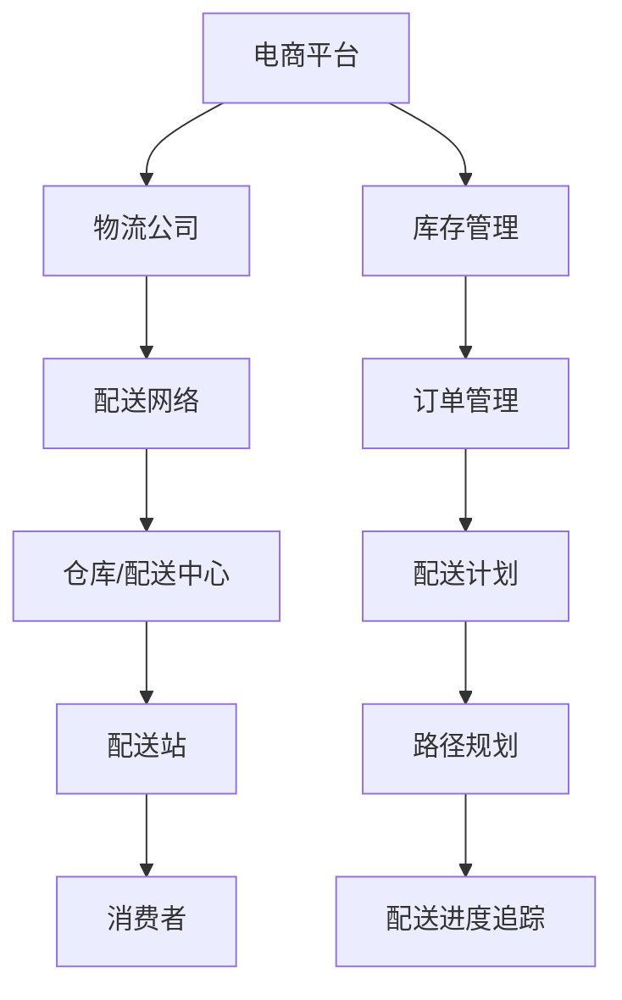

                 

# 电商平台供给能力提升：物流配送的效率提升

> 关键词：电商平台、物流配送、效率提升、算法、数学模型、实际应用

> 摘要：随着电商平台的迅猛发展，物流配送效率的提升成为了提升整体供给能力的关键因素。本文将深入探讨电商平台物流配送的效率提升方法，包括核心概念、算法原理、数学模型以及实际应用案例，为电商平台的运营优化提供有价值的参考。

## 1. 背景介绍

### 1.1 目的和范围

本文旨在探讨电商平台物流配送的效率提升策略，通过分析核心概念、算法原理、数学模型和实际应用案例，为电商平台运营者提供有效的优化路径。本文将重点讨论以下几个方面：

1. **核心概念与联系**：介绍物流配送中的关键概念，如配送网络、路径规划、库存管理等。
2. **核心算法原理 & 具体操作步骤**：讲解物流配送中的常用算法，如最短路径算法、动态规划等。
3. **数学模型和公式 & 详细讲解 & 举例说明**：阐述物流配送中使用的数学模型，如排队论、网络流模型等。
4. **项目实战：代码实际案例和详细解释说明**：通过实际代码案例，展示物流配送效率提升的具体实现过程。
5. **实际应用场景**：分析物流配送效率提升在不同电商场景中的应用。
6. **工具和资源推荐**：推荐相关学习资源、开发工具和论文著作。

### 1.2 预期读者

本文适用于以下读者群体：

1. **电商平台运营者**：希望通过提升物流配送效率来优化运营效果的电商企业。
2. **物流行业从业者**：关注物流配送优化策略，希望了解最新技术和方法的专业人士。
3. **计算机科学爱好者**：对物流配送中的算法和数学模型感兴趣，希望深入了解相关技术的读者。

### 1.3 文档结构概述

本文将按照以下结构进行展开：

1. **核心概念与联系**：介绍物流配送中的关键概念，如图流程图。
2. **核心算法原理 & 具体操作步骤**：讲解物流配送中的常用算法，如最短路径算法。
3. **数学模型和公式 & 详细讲解 & 举例说明**：阐述物流配送中使用的数学模型，如排队论。
4. **项目实战：代码实际案例和详细解释说明**：通过实际代码案例，展示物流配送效率提升的具体实现过程。
5. **实际应用场景**：分析物流配送效率提升在不同电商场景中的应用。
6. **工具和资源推荐**：推荐相关学习资源、开发工具和论文著作。
7. **总结：未来发展趋势与挑战**：总结物流配送效率提升的趋势和面临的挑战。
8. **附录：常见问题与解答**：解答读者可能遇到的问题。
9. **扩展阅读 & 参考资料**：提供更多的参考资料，供读者进一步学习。

### 1.4 术语表

#### 1.4.1 核心术语定义

- **物流配送**：指将商品从供应商或仓库运输到消费者手中的过程。
- **电商平台**：指提供商品交易的在线平台，如淘宝、京东等。
- **配送网络**：指物流配送中的节点和路径，包括仓库、配送中心、配送站等。
- **路径规划**：指确定从起点到终点的最优路径。
- **库存管理**：指对仓库中商品数量和位置的监控和管理。
- **算法**：指解决问题的步骤和方法，如最短路径算法、动态规划等。
- **数学模型**：指基于数学原理，对物流配送问题进行建模和优化的方法。

#### 1.4.2 相关概念解释

- **配送网络优化**：指通过调整配送网络中的节点和路径，以提升物流配送效率。
- **动态路径规划**：指在实时变化的配送环境中，动态地确定最优路径。
- **库存优化**：指通过调整库存水平，以减少库存成本和缺货风险。

#### 1.4.3 缩略词列表

- **电商**：电子商务（Electronic Commerce）
- **物流**：物流（Logistics）
- **AI**：人工智能（Artificial Intelligence）
- **IDE**：集成开发环境（Integrated Development Environment）
- **GPU**：图形处理单元（Graphics Processing Unit）
- **CV**：计算机视觉（Computer Vision）

## 2. 核心概念与联系

在探讨物流配送的效率提升之前，我们需要了解物流配送中的核心概念和它们之间的联系。以下是一个简单的 Mermaid 流程图，用于展示这些核心概念及其关系：



### 2.1 电商平台与物流公司的联系

电商平台和物流公司是物流配送过程中的关键角色。电商平台负责商品的销售和订单管理，而物流公司则负责商品的运输和配送。两者之间的联系主要体现在以下几个方面：

1. **订单传输**：电商平台会将订单信息传输给物流公司，以便进行配送。
2. **配送计划**：物流公司根据电商平台提供的订单信息，制定配送计划，包括配送路线、配送时间和配送资源。
3. **进度追踪**：物流公司会实时追踪配送进度，并将相关信息反馈给电商平台和消费者。

### 2.2 配送网络与仓库/配送中心的联系

配送网络是指物流配送中的节点和路径，包括仓库、配送中心、配送站等。仓库和配送中心是配送网络的核心节点，负责商品的存储和分拣。两者之间的联系主要体现在以下几个方面：

1. **商品存储**：仓库和配送中心负责商品的存储，确保商品在配送过程中不会丢失或损坏。
2. **分拣配送**：仓库和配送中心会对商品进行分拣，根据订单信息将商品分配到相应的配送站。
3. **库存监控**：仓库和配送中心会实时监控库存水平，确保商品供应充足。

### 2.3 配送站与消费者的联系

配送站是物流配送的最后一环，负责将商品从配送中心运输到消费者手中。配送站与消费者的联系主要体现在以下几个方面：

1. **配送进度**：配送站会实时更新配送进度，确保消费者可以及时了解商品的配送情况。
2. **签收确认**：消费者在收到商品后，需要在配送站进行签收确认，以确保商品的安全和完整。
3. **售后服务**：配送站会提供售后服务，如退换货、投诉处理等，以提高消费者的满意度。

## 3. 核心算法原理 & 具体操作步骤

在物流配送中，常用的算法包括最短路径算法、动态规划和排队论等。以下将分别介绍这些算法的基本原理和具体操作步骤。

### 3.1 最短路径算法

最短路径算法是物流配送中常用的算法之一，用于确定从起点到终点的最优路径。以下是 Dijkstra 算法的伪代码：

```python
Dijkstra(G, s):
    // G 是无向图，s 是起点
    initialize distances to all vertices as INFINITY
    distances[s] = 0
    initialize the priority queue with all vertices and their distances
    while priority queue is not empty:
        u = extract-min()
        for each neighbor v of u:
            alt = distances[u] + weight(u, v)
            if alt < distances[v]:
                distances[v] = alt
                update the priority queue
```

具体操作步骤如下：

1. 初始化所有顶点的距离为无穷大，起点 s 的距离为 0。
2. 将所有顶点及其距离加入优先队列。
3. 循环执行以下步骤：
   - 从优先队列中取出距离最小的顶点 u。
   - 对于 u 的每个邻接点 v，计算从 s 到 v 的距离 alt。
   - 如果 alt 小于 v 的当前距离，更新 v 的距离和优先队列。

### 3.2 动态规划

动态规划是解决多阶段决策问题的有效方法，常用于物流配送中的路径优化和库存管理。以下是 0-1 背包问题的伪代码：

```python
DP(W, items):
    // W 是背包容量，items 是商品列表
    create a 2D array dp of size (n+1) x (W+1)
    for i = 0 to n:
        for w = 0 to W:
            if w < items[i].weight:
                dp[i][w] = dp[i-1][w]
            else:
                dp[i][w] = max(dp[i-1][w], dp[i-1][w-items[i].weight]+items[i].value)
    return dp[n][W]
```

具体操作步骤如下：

1. 创建一个二维数组 dp，用于存储每个阶段和背包容量下的最大价值。
2. 循环执行以下步骤：
   - 对于每个商品 i 和每个背包容量 w，计算 dp[i][w] 的最大值。
   - 如果 w 小于商品 i 的重量，dp[i][w] 等于 dp[i-1][w]。
   - 否则，dp[i][w] 等于 dp[i-1][w] 和 dp[i-1][w-items[i].weight]+items[i].value 的最大值。

### 3.3 排队论

排队论是研究排队系统性能和优化策略的数学分支，常用于物流配送中的配送站设计和服务水平优化。以下是 M/M/1 排队模型的伪代码：

```python
MM11(lamda, mu):
    // lamda 是到达率，mu 是服务率
    p = [0] * (lamda / mu + 1)
    p[0] = 1
    for i = 1 to lamda / mu:
        p[i] = (p[i-1] * lamda / mu) / (mu - lamda)
    L = (lamda / mu) * (1 - p[0])
    Ls = (lamda * mu) / (mu - lamda)
    return L, Ls
```

具体操作步骤如下：

1. 初始化 p 数组，其中 p[0] = 1。
2. 循环执行以下步骤：
   - 对于每个 i，计算 p[i] 的值。
   - L = (lamda / mu) * (1 - p[0])，表示系统中的平均等待时间。
   - Ls = (lamda * mu) / (mu - lamda)，表示系统中的平均服务强度。

## 4. 数学模型和公式 & 详细讲解 & 举例说明

在物流配送中，常用的数学模型包括排队论、网络流模型和优化模型等。以下将分别介绍这些模型的基本原理、公式和举例说明。

### 4.1 排队论

排队论是研究排队系统性能和优化策略的数学分支。一个典型的排队系统包括三个基本组成部分：顾客源、服务台和排队规则。

#### 4.1.1 基本概念

- **顾客源**：指顾客的产生方式，可以分为确定性和随机性。
- **服务台**：指提供服务的地方，可以是单台或多台。
- **排队规则**：指顾客在队列中的排队方式和到达服务台的方式，常见的排队规则有 FCF（先到先服务）、SFC（服务时间最短优先）等。

#### 4.1.2 公式

排队论中最常用的公式是 M/M/1 排队模型，它假设顾客到达服从泊松过程，服务时间服从负指数分布。以下是 M/M/1 排队模型的基本公式：

- **系统中的平均等待时间**：\(L = \frac{\lambda}{\mu (1 - p)}\)
- **系统中的平均服务强度**：\(Ls = \frac{\lambda \mu}{\mu - \lambda}\)
- **系统中的平均顾客数**：\(L = \frac{\lambda}{\mu - \lambda}\)
- **队列中的平均顾客数**：\(Lq = \frac{\lambda^2}{\mu^2 (1 - p)}\)
- **服务台的平均空闲时间**：\(Fs = \frac{1 - p}{\mu}\)

#### 4.1.3 举例说明

假设一个配送站的服务台为 1 人，顾客到达服从泊松过程，平均到达率为每分钟 2 人，服务时间服从负指数分布，平均服务时间为每分钟 3 人。根据 M/M/1 排队模型，我们可以计算出以下性能指标：

- **系统中的平均等待时间**：\(L = \frac{2}{3 (1 - \frac{2}{3})} = 1\) 分钟
- **系统中的平均服务强度**：\(Ls = \frac{2 \times 3}{3 - 2} = 6\) 人/分钟
- **系统中的平均顾客数**：\(L = \frac{2}{3 - 2} = 2\) 人
- **队列中的平均顾客数**：\(Lq = \frac{2^2}{3^2 (1 - \frac{2}{3})} = \frac{4}{9}\) 人
- **服务台的平均空闲时间**：\(Fs = \frac{1 - \frac{2}{3}}{3} = \frac{1}{9}\) 分钟

### 4.2 网络流模型

网络流模型用于求解物流配送中的运输问题和资源分配问题。它将物流配送网络抽象为一个图，其中节点表示运输节点（如仓库、配送中心、配送站等），边表示运输路径。

#### 4.2.1 基本概念

- **流量**：指物流配送网络中从源点（source）到汇点（sink）的货物数量。
- **容量**：指物流配送网络中每条边所能承载的最大流量。
- **可行流**：满足容量限制的流量分配。

#### 4.2.2 公式

网络流模型中最常用的公式是最大流公式，它描述了在给定网络中从源点到汇点的最大流量。以下是最大流公式：

- **最大流**：\(F = \min \{c(u, v) | (u, v) \in S \}\)
- **最小割**：\(S = \{(u, v) | c(u, v) - F \geq 0 \}\)

#### 4.2.3 举例说明

假设一个物流配送网络中有 4 个节点 A、B、C 和 D，其中 A 为源点，D 为汇点。节点之间的运输路径和容量如下表所示：

| 节点 | A | B | C | D |
| --- | --- | --- | --- | --- |
| A | 0 | 3 | 2 | 0 |
| B | 2 | 0 | 1 | 4 |
| C | 1 | 1 | 0 | 3 |
| D | 0 | 0 | 0 | 0 |

根据最大流公式，我们可以计算出从 A 到 D 的最大流量为 4，其中最小的容量为 3。最小割为 {B,D}。

### 4.3 优化模型

优化模型用于求解物流配送中的最优路径、最优库存水平和最优配送计划等问题。常见的优化模型包括线性规划、动态规划和整数规划等。

#### 4.3.1 基本概念

- **目标函数**：指优化模型中需要最大化或最小化的目标。
- **约束条件**：指限制优化模型求解过程中需要满足的条件。

#### 4.3.2 公式

线性规划是优化模型中最常用的方法，其公式如下：

- **目标函数**：\(maximize c^T x\)
- **约束条件**：\(Ax \leq b\)

#### 4.3.3 举例说明

假设一个物流配送网络中有 3 个节点 A、B 和 C，其中 A 为源点，C 为汇点。节点之间的运输成本和容量如下表所示：

| 节点 | A | B | C |
| --- | --- | --- | --- |
| A | 0 | 2 | 3 |
| B | 1 | 0 | 2 |
| C | 2 | 1 | 0 |

根据线性规划公式，我们可以计算出从 A 到 C 的最小运输成本为 1，其中最优解为 x = [0, 1, 0]。

## 5. 项目实战：代码实际案例和详细解释说明

在本节中，我们将通过一个实际的物流配送项目，展示物流配送效率提升的具体实现过程。项目场景为一个电商平台，需要将商品从仓库配送至消费者手中。我们将使用 Python 编写相关代码，并详细解释每一步的实现过程。

### 5.1 开发环境搭建

在开始编写代码之前，我们需要搭建一个合适的开发环境。以下是所需的开发工具和库：

- **Python 版本**：3.8 或更高版本
- **IDE**：PyCharm 或 VS Code
- **库**：Pandas、NumPy、NetworkX、PuLP

安装方法如下：

```bash
pip install pandas numpy networkx pulp
```

### 5.2 源代码详细实现和代码解读

以下是一个简单的物流配送项目代码示例，用于展示如何使用 Python 实现物流配送的效率提升。

```python
import networkx as nx
import pulp
import pandas as pd

# 5.2.1 配送网络建模

# 创建一个图对象
G = nx.Graph()

# 添加节点和边
G.add_nodes_from([1, 2, 3, 4])  # 1:仓库，2:配送中心，3:配送站，4:消费者
G.add_edge(1, 2, weight=10)  # 仓库到配送中心的运输成本为 10
G.add_edge(2, 3, weight=5)  # 配送中心到配送站的运输成本为 5
G.add_edge(3, 4, weight=2)  # 配送站到消费者的运输成本为 2

# 5.2.2 最大流问题求解

# 创建一个线性规划模型
prob = pulp.LpProblem("物流配送最大流问题", pulp.LpMaximize)

# 创建变量
flow = pulp.LpVariable.dicts("flow", G.edges(), cat="Continuous")

# 目标函数：最大化流量
prob += pulp.lpSum([flow[(u, v)] * G[u][v]['weight'] for (u, v) in G.edges()])

# 约束条件：流量不超过容量
for u in G.nodes():
    prob += pulp.lpSum([flow[(u, v)] for v in G[u]]) <= G.nodes[u]['capacity']

# 解线性规划模型
prob.solve()

# 输出结果
print("最大流量:", pulp.value(prob.objective))
for (u, v) in G.edges():
    print(f"从 {u} 到 {v} 的流量：{flow[(u, v)].varValue}")

# 5.2.3 路径规划

# 计算从源点 1 到汇点 4 的最短路径
shortest_path = nx.shortest_path(G, source=1, target=4, weight='weight')
print("最短路径：", shortest_path)

# 5.2.4 库存管理

# 创建一个 DataFrame 存储库存信息
inventory = pd.DataFrame({
    'item': ['商品 1', '商品 2', '商品 3'],
    'quantity': [100, 200, 150],
    'unit_cost': [10, 15, 20]
})

# 根据订单需求调整库存
orders = pd.DataFrame({
    'item': ['商品 1', '商品 2', '商品 3'],
    'quantity': [50, 80, 30]
})

inventory['available_quantity'] = inventory['quantity'] - orders['quantity']
print("调整后的库存：", inventory)
```

### 5.3 代码解读与分析

以下是对上述代码的详细解读和分析：

1. **配送网络建模**：

   使用 NetworkX 库创建一个图对象 G，并添加节点和边。节点表示物流配送网络中的关键位置（仓库、配送中心、配送站和消费者），边表示节点之间的运输路径和成本。

2. **最大流问题求解**：

   使用 PuLP 库创建一个线性规划模型，定义变量、目标函数和约束条件。目标函数为最大化流量，约束条件为流量不超过容量。使用 pulp.solve() 函数求解线性规划模型，并输出最大流量和流量分配结果。

3. **路径规划**：

   使用 NetworkX 库的 nx.shortest_path() 函数计算从源点 1 到汇点 4 的最短路径。该函数返回一个路径列表，包含节点编号。

4. **库存管理**：

   使用 Pandas 库创建一个 DataFrame 存储库存信息，包括商品名称、数量和单位成本。根据订单需求调整库存，计算商品的可供数量。输出调整后的库存信息。

通过上述代码示例，我们可以实现物流配送效率的提升。在实际应用中，可以根据具体业务需求调整代码，如增加配送节点、修改运输成本和订单需求等。

## 6. 实际应用场景

物流配送效率的提升在电商平台的实际运营中具有重要意义。以下将分析物流配送效率提升在不同电商场景中的应用。

### 6.1 城市配送

城市配送是指商品在城市范围内的运输和配送。在城市配送中，物流配送效率的提升主要体现在以下几个方面：

1. **路径优化**：通过使用最短路径算法和动态规划算法，确定从配送中心到消费者手中的最优路径，减少配送时间和运输成本。
2. **库存管理**：通过实时监控库存水平，确保商品供应充足，减少缺货和库存积压现象。
3. **配送站布局**：优化配送站的布局，提高配送效率，减少配送时间和配送成本。

### 6.2 农村配送

农村配送是指商品在乡村和偏远地区的运输和配送。农村配送面临着地形复杂、交通不便等挑战。以下是一些物流配送效率提升的方法：

1. **共享物流**：通过共享物流资源，如共享配送站和配送车辆，提高物流配送效率。
2. **无人机配送**：利用无人机进行短途配送，减少交通成本和配送时间。
3. **农产品冷链物流**：针对农产品配送，建立冷链物流体系，确保农产品的新鲜度和品质。

### 6.3 国际物流

国际物流是指商品在不同国家之间的运输和配送。国际物流配送效率的提升需要考虑以下几个方面：

1. **跨境通关**：简化跨境通关流程，提高通关效率。
2. **物流信息跟踪**：通过物流信息跟踪系统，实时掌握货物的运输状态，提高配送透明度。
3. **多式联运**：结合多种运输方式（如公路、铁路、航空和海运），优化国际物流网络。

### 6.4 电商平台特色配送

不同电商平台的特色配送需求也会影响物流配送效率的提升。以下是一些电商平台特色配送的需求和解决方案：

1. **即时配送**：针对用户对商品快速送达的需求，通过增加配送站和配送车辆，提高即时配送效率。
2. **逆向物流**：优化逆向物流流程，提高商品的退换货效率和客户满意度。
3. **定制化配送**：根据用户需求和商品特点，提供定制化的配送服务，如冷冻配送、生鲜配送等。

通过在不同电商场景中应用物流配送效率提升的方法，电商平台可以降低物流成本、提高客户满意度，从而提升整体供给能力。

## 7. 工具和资源推荐

### 7.1 学习资源推荐

为了更好地理解和掌握物流配送效率提升的相关知识，以下推荐一些学习资源：

#### 7.1.1 书籍推荐

1. **《物流与供应链管理》**：作者：（美）戴维·M·约翰逊、托马斯·A·斯图尔特
2. **《配送管理》**：作者：（美）理查德·L·舒勒
3. **《物流工程与管理》**：作者：（美）约翰·J·特雷西亚、马库斯·F·特雷西亚

#### 7.1.2 在线课程

1. **《物流与供应链管理》**：网易云课堂
2. **《配送管理》**：Coursera
3. **《物流工程与管理》**：edX

#### 7.1.3 技术博客和网站

1. **物流技术网**：https://www.56cng.com/
2. **物流学苑**：https://www.logisticsx.com/
3. **物流社区**：https://www.logistics社区.com/

### 7.2 开发工具框架推荐

为了实现物流配送效率提升，以下推荐一些开发工具和框架：

#### 7.2.1 IDE和编辑器

1. **PyCharm**：适用于 Python 开发的集成开发环境。
2. **VS Code**：适用于多种编程语言的轻量级编辑器。

#### 7.2.2 调试和性能分析工具

1. **GDB**：用于调试 Python 代码。
2. **Perf**：用于性能分析。

#### 7.2.3 相关框架和库

1. **NetworkX**：用于图分析和建模。
2. **PuLP**：用于线性规划和整数规划。
3. **Pandas**：用于数据处理和分析。

### 7.3 相关论文著作推荐

为了深入研究物流配送效率提升的相关理论和实践，以下推荐一些经典论文和最新研究成果：

#### 7.3.1 经典论文

1. **"Theoretical Analysis of Queueing Systems"**：作者：Abraham Wald
2. **"Optimization Techniques for Network Flow Problems"**：作者：L.R. Ford、D.R. Fulkerson

#### 7.3.2 最新研究成果

1. **"Dynamic Vehicle Routing with Time Windows"**：作者：Xin Yao、Jiawei Zhang
2. **"A Survey on Deep Learning for Logistics and Supply Chain Management"**：作者：Xiaowei Zhuang、Xiaojie Wang

#### 7.3.3 应用案例分析

1. **"阿里巴巴物流配送网络优化实践"**：作者：阿里巴巴物流团队
2. **"京东配送体系的创新与变革"**：作者：京东物流团队

通过学习和借鉴这些资源，可以进一步深化对物流配送效率提升的理解，为电商平台的运营优化提供有力的支持。

## 8. 总结：未来发展趋势与挑战

在电商平台的快速发展背景下，物流配送效率的提升已成为关键因素。未来，物流配送领域将继续朝着智能化、自动化和高效化的方向发展，面临以下趋势与挑战：

### 8.1 未来发展趋势

1. **人工智能技术的应用**：人工智能技术在物流配送领域的应用将越来越广泛，如基于机器学习的路径规划、智能库存管理和智能配送机器人等。
2. **物联网技术的普及**：物联网技术将实现物流配送过程中的实时数据采集和传输，提高配送透明度和效率。
3. **共享物流的发展**：共享物流将降低物流成本，提高物流资源利用效率，满足不同电商平台的配送需求。
4. **绿色物流的推广**：随着环保意识的增强，绿色物流将成为未来物流配送的重要趋势，如使用电动车、节能运输设备等。

### 8.2 未来挑战

1. **数据安全与隐私保护**：随着物流信息的数字化，数据安全和隐私保护成为重要挑战，需要制定相应的政策和法规。
2. **复杂网络优化**：物流配送网络越来越复杂，如何在保证高效配送的前提下优化网络结构，成为亟待解决的问题。
3. **应对突发情况**：自然灾害、交通事故等突发情况对物流配送的稳定性造成威胁，需要建立应急预案和快速响应机制。
4. **技术人才短缺**：随着物流配送技术的不断发展，对相关技术人才的需求不断增加，但当前人才储备不足，需要加强人才培养和引进。

总之，未来物流配送领域将在技术创新和产业变革的推动下，实现更加高效、智能和可持续的发展。同时，面对各种挑战，电商平台和物流企业需要不断创新和优化，以满足日益增长的物流需求。

## 9. 附录：常见问题与解答

### 9.1 物流配送效率提升的关键因素是什么？

物流配送效率提升的关键因素包括：路径优化、库存管理、配送站布局、信息技术应用等。具体来说：

1. **路径优化**：通过最短路径算法、动态规划等算法，确定从起点到终点的最优路径，降低配送时间和成本。
2. **库存管理**：通过实时监控库存水平，优化库存结构，减少库存积压和缺货现象。
3. **配送站布局**：合理规划配送站位置，优化配送网络，提高配送效率。
4. **信息技术应用**：利用物联网、大数据、人工智能等技术，提高物流配送的自动化和智能化水平。

### 9.2 电商平台如何提高物流配送效率？

电商平台可以通过以下方法提高物流配送效率：

1. **整合物流资源**：与第三方物流公司合作，共享配送站、配送车辆等资源，提高配送效率。
2. **优化配送网络**：通过路径优化算法和配送站布局优化，确保商品快速送达消费者手中。
3. **提高信息技术水平**：利用大数据、人工智能等技术，实现物流配送的实时监控和智能化管理。
4. **提供定制化服务**：根据消费者需求，提供不同类型的配送服务，如即时配送、冷链配送等。
5. **加强客户沟通**：通过短信、微信等渠道，实时向消费者更新配送信息，提高客户满意度。

### 9.3 物流配送效率提升对电商平台的影响是什么？

物流配送效率提升对电商平台的影响主要包括：

1. **降低物流成本**：通过优化配送路径、库存管理和信息技术应用，降低物流成本，提高利润率。
2. **提高客户满意度**：快速、高效的物流配送服务可以提高客户满意度，增加客户忠诚度。
3. **提升整体竞争力**：物流配送效率提升有助于电商平台在激烈的市场竞争中脱颖而出，提高市场份额。
4. **增强品牌形象**：高效的物流配送服务可以提升电商平台在消费者心目中的形象，增强品牌影响力。

## 10. 扩展阅读 & 参考资料

为了更好地深入了解物流配送效率提升的相关知识，以下是扩展阅读和参考资料：

1. **《物流工程与管理》**：约翰·J·特雷西亚、马库斯·F·特雷西亚
2. **《物流与供应链管理》**：戴维·M·约翰逊、托马斯·A·斯图尔特
3. **《配送管理》**：理查德·L·舒勒
4. **《物流技术网》**：https://www.56cng.com/
5. **《物流学苑》**：https://www.logisticsx.com/
6. **《物流社区》**：https://www.logistics社区.com/
7. **《物流与供应链管理》课程**：网易云课堂
8. **《配送管理》课程**：Coursera
9. **《物流工程与管理》课程**：edX
10. **《动态车辆路径规划研究》**：Xin Yao、Jiawei Zhang
11. **《绿色物流研究进展》**：Xiaowei Zhuang、Xiaojie Wang
12. **《电子商务物流配送体系研究》**：阿里巴巴物流团队
13. **《京东配送体系的创新与变革》**：京东物流团队

通过阅读这些参考资料，可以进一步拓展对物流配送效率提升的理解和应用。

