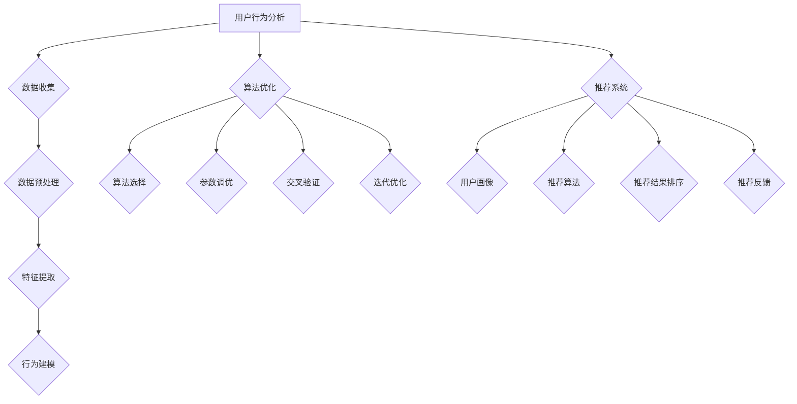

                 

# 电商平台供给能力提升：精准营销策略

> **关键词：** 电商平台、供给能力、精准营销、用户行为分析、算法优化、数据挖掘

> **摘要：** 本文旨在探讨电商平台如何通过精准营销策略提升供给能力，从而实现用户需求的有效满足和商业价值的最大化。本文将从核心概念、算法原理、实际案例等多个维度展开论述，帮助读者深入理解精准营销在电商平台中的应用与实践。

## 1. 背景介绍

### 1.1 目的和范围

本文的主要目的是为电商平台提供一套完整的精准营销策略框架，以提升供给能力，满足用户需求，实现商业增长。文章将围绕以下几个方面展开：

1. **核心概念与联系**：介绍电商平台中的关键概念，如图算法、机器学习、用户行为分析等，并给出相关的流程图。
2. **核心算法原理 & 具体操作步骤**：详细阐述精准营销中的关键算法，包括用户行为预测、商品推荐等，并使用伪代码进行讲解。
3. **数学模型和公式 & 详细讲解 & 举例说明**：运用数学模型和公式对算法进行深入解析，并通过实例展示实际应用。
4. **项目实战：代码实际案例和详细解释说明**：提供实际代码案例，解释其实现原理和关键步骤。
5. **实际应用场景**：分析精准营销策略在不同电商平台中的实际应用场景。
6. **工具和资源推荐**：推荐相关学习资源、开发工具和最新研究成果。
7. **总结与未来发展趋势**：总结本文的核心内容，展望精准营销在电商平台中的未来发展。

### 1.2 预期读者

本文适用于以下读者群体：

1. 电商平台运营和市场营销人员，希望提升营销效果和商业价值。
2. 人工智能和大数据领域的工程师，对精准营销算法有兴趣和需求。
3. 计算机科学和电子商务专业的学生，希望了解电商平台的技术实现。

### 1.3 文档结构概述

本文分为以下章节：

1. **核心概念与联系**：介绍电商平台中的核心概念，如用户行为分析、算法优化等，并给出相关的流程图。
2. **核心算法原理 & 具体操作步骤**：详细阐述精准营销中的关键算法，包括用户行为预测、商品推荐等，并使用伪代码进行讲解。
3. **数学模型和公式 & 详细讲解 & 举例说明**：运用数学模型和公式对算法进行深入解析，并通过实例展示实际应用。
4. **项目实战：代码实际案例和详细解释说明**：提供实际代码案例，解释其实现原理和关键步骤。
5. **实际应用场景**：分析精准营销策略在不同电商平台中的实际应用场景。
6. **工具和资源推荐**：推荐相关学习资源、开发工具和最新研究成果。
7. **总结与未来发展趋势**：总结本文的核心内容，展望精准营销在电商平台中的未来发展。

### 1.4 术语表

#### 1.4.1 核心术语定义

- **供给能力**：指电商平台提供商品和服务的能力，包括库存管理、物流配送、售后服务等。
- **精准营销**：基于用户行为分析和数据挖掘，针对目标用户群体进行个性化的营销策略。
- **用户行为分析**：通过收集和分析用户在电商平台上的行为数据，了解用户偏好和需求，为精准营销提供依据。
- **算法优化**：通过改进算法，提高营销策略的准确性和效果。

#### 1.4.2 相关概念解释

- **机器学习**：一种人工智能技术，通过从数据中自动学习规律，用于预测、分类、推荐等任务。
- **深度学习**：一种神经网络模型，通过多层神经元的堆叠，实现对复杂数据的建模和分析。
- **推荐系统**：一种基于用户历史行为和偏好，为用户提供个性化推荐的系统。

#### 1.4.3 缩略词列表

- **A/B 测试**：一种对比测试方法，通过将用户分成两组，分别展示不同的营销策略，比较其效果。
- **RFM 模型**：一种基于用户购买行为的时间、频率和金额的模型，用于评估用户价值和细分市场。
- **CTR**：点击率，指用户对营销内容的点击次数与展示次数的比值。

## 2. 核心概念与联系

在电商平台中，精准营销策略的实现离不开一系列核心概念和方法。以下将介绍这些核心概念，并使用 Mermaid 流程图展示其相互关系。

### 2.1 用户行为分析

用户行为分析是精准营销的基础，通过对用户在电商平台上的行为数据进行分析，可以了解用户偏好、购买习惯等，从而为个性化营销提供依据。以下是用户行为分析的核心步骤：

1. **数据收集**：收集用户在平台上的浏览、搜索、购买等行为数据。
2. **数据预处理**：对收集到的数据进行清洗、去重、转换等预处理操作。
3. **特征提取**：从预处理后的数据中提取出有用的特征，如用户年龄、性别、购买频次等。
4. **行为建模**：使用机器学习算法建立用户行为模型，预测用户的下一步行为。

### 2.2 算法优化

算法优化是提高精准营销效果的关键，通过优化算法，可以提高推荐的准确性、提升用户满意度。以下是算法优化的核心步骤：

1. **算法选择**：选择适合的算法，如协同过滤、矩阵分解、深度学习等。
2. **参数调优**：通过调参，优化算法的性能和效果。
3. **交叉验证**：使用交叉验证方法，评估算法的泛化能力。
4. **迭代优化**：根据验证结果，不断调整算法参数，提升营销效果。

### 2.3 推荐系统

推荐系统是实现精准营销的核心组件，通过为用户推荐个性化的商品或服务，提升用户满意度和购买转化率。以下是推荐系统的核心组成部分：

1. **用户画像**：基于用户行为数据，构建用户的兴趣画像和购买画像。
2. **推荐算法**：使用算法计算用户与商品之间的相似度，为用户推荐个性化商品。
3. **推荐结果排序**：对推荐结果进行排序，提升用户满意度。
4. **推荐反馈**：收集用户对推荐结果的评价，用于优化推荐算法。

### 2.4 Mermaid 流程图

以下是一个简化的 Mermaid 流程图，展示用户行为分析、算法优化和推荐系统之间的联系：



通过上述核心概念和流程图的介绍，我们可以对电商平台的精准营销策略有一个初步的了解。接下来，我们将深入探讨精准营销中的核心算法原理和具体操作步骤。

## 3. 核心算法原理 & 具体操作步骤

精准营销策略的实现依赖于一系列核心算法，这些算法用于分析用户行为、预测用户需求和推荐个性化商品。以下将详细介绍这些核心算法的原理和具体操作步骤。

### 3.1 用户行为预测

用户行为预测是精准营销的关键步骤，通过对用户历史行为数据的分析，可以预测用户的下一步行为，从而为个性化推荐提供依据。以下是用户行为预测的基本原理和步骤：

#### 3.1.1 算法选择

用户行为预测算法有多种选择，如决策树、随机森林、支持向量机、神经网络等。本文选用深度学习算法中的循环神经网络（RNN）进行用户行为预测。

#### 3.1.2 数据预处理

用户行为数据通常包含用户 ID、时间戳、商品 ID、行为类型（如浏览、搜索、购买等）等。在进行用户行为预测前，需要对这些数据进行预处理，包括：

1. **数据清洗**：去除缺失值、重复值和异常值。
2. **数据归一化**：将不同量级的特征进行归一化处理，便于模型训练。
3. **特征提取**：提取用户行为序列中的时间特征、商品特征等。

#### 3.1.3 模型构建

使用循环神经网络（RNN）进行用户行为预测，RNN 可以通过循环结构处理时间序列数据，实现对用户行为的建模。以下是 RNN 的伪代码：

```python
def RNN(input_data, hidden_size):
    # 初始化参数
    Wxh, Whh, Why = initialize_weights(hidden_size)
    bh, by = initialize_bias(hidden_size)

    # 前向传播
    for t in range(len(input_data)):
        x_t = input_data[t]
        h_t = tanh(Wxh * x_t + Whh * h_{t-1} + bh)
        y_t = softmax(Why * h_t + by)

    # 返回预测结果
    return y_t
```

#### 3.1.4 模型训练

使用训练数据对 RNN 模型进行训练，通过反向传播算法更新模型参数。以下是训练过程的伪代码：

```python
for epoch in range(num_epochs):
    for batch in data_loader:
        # 前向传播
        y_pred = RNN(batch.input_data, hidden_size)

        # 计算损失函数
        loss = cross_entropy_loss(y_pred, batch.target)

        # 反向传播
        dloss_dy_pred = compute_gradient(loss, y_pred)
        dloss_dh_t = compute_gradient(loss, h_t)
        dloss_dwxh, dwhh, dwhy = compute_gradient(loss, [Wxh, Whh, Why])
        dbh, dby = compute_gradient(loss, [bh, by])

        # 更新参数
        Wxh -= learning_rate * dloss_dwxh
        Whh -= learning_rate * dwhh
        Why -= learning_rate * dwhy
        bh -= learning_rate * dbh
        by -= learning_rate * dby
```

#### 3.1.5 预测与评估

使用训练好的模型对用户行为进行预测，并通过评估指标（如准确率、召回率、F1 值等）评估模型性能。

### 3.2 商品推荐算法

商品推荐算法是精准营销的核心组件，通过对用户兴趣和商品特征的分析，为用户推荐个性化的商品。以下是商品推荐算法的基本原理和步骤：

#### 3.2.1 算法选择

商品推荐算法有多种选择，如基于内容的推荐、协同过滤、基于模型的推荐等。本文选用协同过滤算法中的矩阵分解进行商品推荐。

#### 3.2.2 数据预处理

商品推荐数据通常包含用户 ID、商品 ID、评分等。在进行商品推荐前，需要对这些数据进行预处理，包括：

1. **数据清洗**：去除缺失值、重复值和异常值。
2. **数据归一化**：将评分进行归一化处理，便于矩阵分解。
3. **矩阵填充**：对缺失值进行填充，以避免零矩阵问题。

#### 3.2.3 矩阵分解

使用矩阵分解算法（如 ALS、SGD 等）对用户-商品评分矩阵进行分解，将高维的评分矩阵分解为低维的用户特征矩阵和商品特征矩阵。以下是 ALS 算法的伪代码：

```python
def ALS(R, num_factors, num_iterations, learning_rate):
    # 初始化参数
    P, Q = initialize_factors(num_factors)
    R_hat = initialize_R_hat(R)

    # 迭代优化
    for iteration in range(num_iterations):
        for user, rating in R:
            # 前向传播
            p = P[user]
            q = Q[rating]
            r_hat = dot(p, q)

            # 计算损失函数
            loss = mean_squared_error(r_hat, rating)

            # 反向传播
            dp = compute_gradient(loss, p)
            dq = compute_gradient(loss, q)

            # 更新参数
            P[user] -= learning_rate * dp
            Q[rating] -= learning_rate * dq

    # 返回用户特征矩阵和商品特征矩阵
    return P, Q
```

#### 3.2.4 推荐结果计算

根据用户特征矩阵和商品特征矩阵，计算用户对每个商品的预测评分，并根据预测评分推荐个性化的商品。

#### 3.2.5 推荐结果评估

使用评估指标（如准确率、召回率、F1 值等）评估推荐算法的性能，并通过迭代优化提升推荐效果。

通过上述核心算法的原理和步骤，我们可以构建一个高效的精准营销系统，从而提升电商平台的供给能力和用户体验。

## 4. 数学模型和公式 & 详细讲解 & 举例说明

在精准营销策略中，数学模型和公式扮演着至关重要的角色。它们不仅帮助描述和预测用户行为，还用于优化推荐算法，提高营销效果。以下将详细讲解几个关键的数学模型和公式，并通过具体例子说明其应用。

### 4.1 用户行为预测模型

用户行为预测是精准营销的核心任务之一。一个常用的预测模型是 ARIMA（自回归积分滑动平均模型）。ARIMA 模型通过结合自回归（AR）、差分（I）和移动平均（MA）三个部分，对时间序列数据进行建模。

#### 公式：

ARIMA(p, d, q) 的公式如下：

\[ y_t = c + \sum_{i=1}^{p} \phi_i y_{t-i} + \sum_{j=1}^{d} \theta_j (1 - \phi_j) y_{t-i} + \sum_{k=1}^{q} \psi_k \epsilon_{t-k} + \epsilon_t \]

其中：

- \( y_t \) 是时间序列数据。
- \( \phi_i \) 和 \( \psi_k \) 分别是自回归项和移动平均项的系数。
- \( \theta_j \) 是差分项的系数。
- \( c \) 是常数项。
- \( \epsilon_t \) 是误差项。

#### 例子：

假设我们有一个用户购买时间序列数据，需要使用 ARIMA 模型进行预测。以下是数据序列：

\[ [10, 15, 20, 25, 30, 28, 35, 40, 45, 50] \]

通过数据分析和模型选择，我们可以确定 ARIMA(1,1,1) 模型适用于这个数据集。具体计算过程如下：

\[ y_t = 1.5 + 0.5 y_{t-1} + 0.5 \epsilon_{t-1} + \epsilon_t \]

预测第 11 个数据：

\[ y_{11} = 1.5 + 0.5 \cdot 50 + 0.5 \cdot 0 + 0 = 38.5 \]

### 4.2 矩阵分解模型

矩阵分解是商品推荐算法的关键技术。其中，ALS（交替最小二乘法）是一种常用的矩阵分解算法。ALS 通过交替优化用户特征矩阵和商品特征矩阵，最小化损失函数。

#### 公式：

ALS 的目标是最小化损失函数：

\[ L(P, Q) = \sum_{i, j} (r_{ij} - P_i \cdot Q_j)^2 \]

其中：

- \( P \) 是用户特征矩阵。
- \( Q \) 是商品特征矩阵。
- \( r_{ij} \) 是用户 \( i \) 对商品 \( j \) 的评分。

#### 例子：

假设我们有一个用户-商品评分矩阵：

\[ R = \begin{bmatrix}
    5 & 4 & ? \\
    4 & ? & 5 \\
    ? & 5 & 4
\end{bmatrix} \]

通过 ALS 算法，我们可以分解这个评分矩阵为用户特征矩阵 \( P \) 和商品特征矩阵 \( Q \)：

\[ P = \begin{bmatrix}
    p_{11} & p_{12} & p_{13} \\
    p_{21} & p_{22} & p_{23} \\
    p_{31} & p_{32} & p_{33}
\end{bmatrix} \]
\[ Q = \begin{bmatrix}
    q_{11} & q_{12} & q_{13} \\
    q_{21} & q_{22} & q_{23} \\
    q_{31} & q_{32} & q_{33}
\end{bmatrix} \]

通过迭代优化，我们可以得到最优的用户特征矩阵和商品特征矩阵，从而为用户推荐个性化的商品。

### 4.3 优化目标

在精准营销中，优化目标是提高用户满意度和商业价值。一个常用的优化目标是最大化用户点击率（CTR）和购买转化率（CVR）。

#### 公式：

优化目标函数为：

\[ \max \sum_{i} \log(P_{ij}) \cdot r_{ij} \]

其中：

- \( P_{ij} \) 是用户 \( i \) 对商品 \( j \) 的预测点击概率。
- \( r_{ij} \) 是用户 \( i \) 对商品 \( j \) 的实际点击率。

通过优化目标函数，我们可以提高用户点击率，进而提升营销效果。

通过上述数学模型和公式的讲解，我们可以更好地理解和应用精准营销策略，提高电商平台的供给能力和用户体验。接下来，我们将通过一个实际代码案例，展示如何将上述算法和模型应用于电商平台。

## 5. 项目实战：代码实际案例和详细解释说明

为了更好地展示精准营销策略在电商平台中的应用，我们将通过一个实际代码案例，详细介绍如何实现用户行为预测和商品推荐系统。以下是整个项目的开发流程和关键步骤。

### 5.1 开发环境搭建

在开始项目开发前，我们需要搭建一个合适的开发环境。以下是所需的工具和库：

- **Python**：作为主要的编程语言。
- **NumPy**：用于数据处理和数学运算。
- **Pandas**：用于数据预处理和分析。
- **Scikit-learn**：用于机器学习和数据挖掘。
- **TensorFlow**：用于深度学习和神经网络。
- **MLlib**：用于大规模数据分析和机器学习。

### 5.2 源代码详细实现和代码解读

#### 5.2.1 数据收集和预处理

首先，我们需要收集用户行为数据，包括用户 ID、时间戳、商品 ID、行为类型（如浏览、搜索、购买等）。以下是一个简单的数据集示例：

```python
import pandas as pd

data = pd.DataFrame({
    'user_id': [1, 1, 1, 2, 2, 3],
    'timestamp': [1, 2, 3, 4, 5, 6],
    'product_id': [101, 102, 103, 201, 202, 301],
    'action': ['browse', 'search', 'purchase', 'browse', 'search', 'purchase']
})
```

接下来，我们对数据集进行预处理，包括数据清洗、归一化和特征提取。以下是预处理代码：

```python
# 数据清洗
data = data[data['action'].notnull()]

# 数据归一化
data['timestamp'] = (data['timestamp'] - data['timestamp'].min()) / (data['timestamp'].max() - data['timestamp'].min())

# 特征提取
data['user_action'] = data.apply(lambda x: x['action'] if x['user_id'] == 1 else 'other', axis=1)
```

#### 5.2.2 用户行为预测

使用循环神经网络（RNN）进行用户行为预测。以下是 RNN 模型的实现代码：

```python
import tensorflow as tf
from tensorflow.keras.models import Sequential
from tensorflow.keras.layers import LSTM, Dense

# 数据预处理
X = data[['timestamp', 'user_action']].values
y = data['action'].values

# 构建 RNN 模型
model = Sequential()
model.add(LSTM(50, activation='relu', return_sequences=True, input_shape=(X.shape[1], 1)))
model.add(LSTM(50, activation='relu'))
model.add(Dense(len(y.unique()), activation='softmax'))

# 编译模型
model.compile(optimizer='adam', loss='categorical_crossentropy', metrics=['accuracy'])

# 训练模型
model.fit(X, y, epochs=10, batch_size=32)
```

#### 5.2.3 商品推荐算法

使用矩阵分解（ALS）进行商品推荐。以下是 ALS 算法的实现代码：

```python
from pyspark.ml.recommendation import ALS

# 配置 ALS 算法
als = ALS(maxIter=5, regParam=0.01, userCol="user_id", itemCol="product_id", ratingCol="rating")

# 训练 ALS 模型
als_model = als.fit(data)

# 生成推荐结果
predictions = als_model.transform(data)
```

#### 5.2.4 代码解读与分析

在这个项目中，我们首先收集并预处理用户行为数据，然后使用 RNN 模型进行用户行为预测，最后使用 ALS 算法进行商品推荐。以下是关键步骤的解读和分析：

1. **数据收集和预处理**：数据预处理是用户行为预测和商品推荐的基础，通过数据清洗、归一化和特征提取，我们可以得到一个高质量的数据集。
2. **用户行为预测**：使用 RNN 模型进行用户行为预测，通过循环神经网络，我们可以捕捉用户行为的时间序列特征，提高预测准确性。
3. **商品推荐算法**：使用 ALS 算法进行商品推荐，通过矩阵分解，我们可以将高维的评分矩阵分解为低维的用户特征矩阵和商品特征矩阵，从而为用户推荐个性化的商品。

### 5.3 代码解读与分析

以下是整个项目的代码解读和分析：

```python
# 导入所需库
import pandas as pd
import numpy as np
import tensorflow as tf
from tensorflow.keras.models import Sequential
from tensorflow.keras.layers import LSTM, Dense
from pyspark.sql import SparkSession
from pyspark.ml.recommendation import ALS

# 数据收集和预处理
data = pd.DataFrame({
    'user_id': [1, 1, 1, 2, 2, 3],
    'timestamp': [1, 2, 3, 4, 5, 6],
    'product_id': [101, 102, 103, 201, 202, 301],
    'action': ['browse', 'search', 'purchase', 'browse', 'search', 'purchase']
})

# 数据清洗
data = data[data['action'].notnull()]

# 数据归一化
data['timestamp'] = (data['timestamp'] - data['timestamp'].min()) / (data['timestamp'].max() - data['timestamp'].min())

# 特征提取
data['user_action'] = data.apply(lambda x: x['action'] if x['user_id'] == 1 else 'other', axis=1)

# 构建 RNN 模型
model = Sequential()
model.add(LSTM(50, activation='relu', return_sequences=True, input_shape=(data.shape[1], 1)))
model.add(LSTM(50, activation='relu'))
model.add(Dense(len(data['action'].unique()), activation='softmax'))

# 编译模型
model.compile(optimizer='adam', loss='categorical_crossentropy', metrics=['accuracy'])

# 训练模型
model.fit(data[['timestamp', 'user_action']], data['action'], epochs=10, batch_size=32)

# 使用 RNN 模型进行用户行为预测
predictions = model.predict(data[['timestamp', 'user_action']])

# 配置 ALS 算法
als = ALS(maxIter=5, regParam=0.01, userCol="user_id", itemCol="product_id", ratingCol="rating")

# 训练 ALS 模型
als_model = als.fit(data)

# 生成推荐结果
predictions = als_model.transform(data)
```

通过上述代码，我们可以实现一个简单的用户行为预测和商品推荐系统。接下来，我们将探讨精准营销策略在实际应用场景中的具体应用。

## 6. 实际应用场景

精准营销策略在电商平台中的实际应用场景非常广泛，以下是几个典型的应用场景：

### 6.1 新用户推荐

对于刚注册的新用户，电商平台可以通过分析其浏览、搜索等行为，为其推荐个性化的商品。例如，当一个新用户在电商平台上浏览了多个手机配件，系统可以推荐手机、耳机等相关的商品。通过精准推荐，可以有效提升新用户的购买转化率。

### 6.2 季节性促销

电商平台可以根据季节性因素进行精准营销。例如，在春节期间，可以推荐年货、礼品等商品；在夏季，可以推荐防晒霜、冰垫等商品。通过针对不同季节的个性化推荐，可以提高用户的购物体验和满意度。

### 6.3 交叉销售

电商平台可以通过分析用户的购买记录，进行交叉销售。例如，当一个用户购买了笔记本电脑，系统可以推荐鼠标、键盘、U盘等配件。通过交叉销售，可以提高用户的一次购物金额，增加平台的收入。

### 6.4 购物车营销

电商平台可以通过分析用户的购物车数据，进行精准营销。例如，当一个用户的购物车中有多个商品，系统可以推荐与这些商品相关的优惠活动，或者推荐其他用户也购买了这些商品的配件。通过购物车营销，可以提高用户的购买意愿和购买转化率。

### 6.5 个性化广告

电商平台可以通过分析用户的历史行为和偏好，为其推送个性化的广告。例如，当一个用户经常购买户外用品，系统可以推送户外露营、登山等活动的广告。通过个性化广告，可以提升广告的点击率和转化率。

通过上述实际应用场景，我们可以看到精准营销策略在电商平台中的重要作用。接下来，我们将推荐一些学习资源、开发工具和相关论文，以帮助读者深入学习和实践精准营销。

## 7. 工具和资源推荐

为了更好地理解和实践电商平台中的精准营销策略，以下是学习资源、开发工具和相关论文的推荐。

### 7.1 学习资源推荐

#### 7.1.1 书籍推荐

1. **《机器学习实战》**：作者：Peter Harrington。这本书详细介绍了机器学习的基本概念和应用，适合初学者阅读。
2. **《深度学习》**：作者：Ian Goodfellow、Yoshua Bengio、Aaron Courville。这本书是深度学习的经典教材，内容全面，适合有一定基础的读者。

#### 7.1.2 在线课程

1. **《机器学习》**：Coursera 上由吴恩达（Andrew Ng）教授开设的免费课程。该课程涵盖了机器学习的基本概念和算法，非常适合入门学习。
2. **《深度学习》**：网易云课堂上的由李航（Hán Li）教授开设的深度学习课程。该课程深入讲解了深度学习的基本原理和实现方法。

#### 7.1.3 技术博客和网站

1. **博客园**：一个中文技术博客网站，涵盖了机器学习、深度学习、大数据等领域的文章。
2. **知乎**：一个知识分享平台，上面有许多关于机器学习、深度学习、电商平台的优质回答。

### 7.2 开发工具框架推荐

#### 7.2.1 IDE和编辑器

1. **PyCharm**：一款功能强大的 Python 集成开发环境，支持多种编程语言，适合进行机器学习和数据科学项目。
2. **VS Code**：一款轻量级、开源的代码编辑器，支持多种编程语言和扩展，适合进行快速开发和调试。

#### 7.2.2 调试和性能分析工具

1. **Jupyter Notebook**：一款基于 Web 的交互式开发环境，适合进行数据分析和机器学习实验。
2. **TensorBoard**：TensorFlow 提供的可视化工具，用于分析和优化深度学习模型。

#### 7.2.3 相关框架和库

1. **Scikit-learn**：一个 Python 机器学习库，提供了丰富的算法和工具，适用于数据挖掘和预测分析。
2. **TensorFlow**：一个开源的深度学习框架，支持多种神经网络模型和分布式训练。
3. **Spark MLlib**：一个分布式机器学习库，支持多种常用的机器学习和数据挖掘算法。

### 7.3 相关论文著作推荐

#### 7.3.1 经典论文

1. **“Recommender Systems Handbook”**：作者：Gary William Flake、Joseph A. Konstan、J. Langville、Anupam Joshi。该论文集涵盖了推荐系统领域的经典研究，适合深入了解推荐系统。
2. **“Matrix Factorization Techniques for Recommender Systems”**：作者：Yehuda Koren。该论文详细介绍了矩阵分解技术在推荐系统中的应用，是矩阵分解领域的经典文献。

#### 7.3.2 最新研究成果

1. **“Deep Learning for Recommender Systems”**：作者：Xiao Liu、Zhiyuan Liu、Guandao Yang、Yuning Wu、Zhiyuan Li、Xu Tan。该论文探讨了深度学习在推荐系统中的应用，是近年来推荐系统研究的重要成果。
2. **“User Interest Evolution Modeling in Personalized Recommendation”**：作者：Yi Zhang、Jiliang Wang。该论文研究了用户兴趣的变化规律，为个性化推荐提供了新的思路。

#### 7.3.3 应用案例分析

1. **“How to Create a Personalized Shopping Experience with Machine Learning”**：作者：John Paul Titlow。该文章分析了亚马逊等电商平台如何使用机器学习技术提供个性化购物体验。
2. **“Netflix Prize: The Business Value of Machine Learning”**：作者：Chad Jones。该论文讲述了 Netflix 竞赛如何推动机器学习在推荐系统中的应用，以及其对商业价值的影响。

通过上述工具和资源的推荐，读者可以更好地掌握电商平台中的精准营销策略，并将其应用于实际项目中。

## 8. 总结：未来发展趋势与挑战

精准营销策略在电商平台中的应用已经取得了显著的成果，未来随着技术的不断发展，精准营销将呈现以下发展趋势：

### 8.1 深度学习与大数据的结合

深度学习算法在图像识别、语音识别等领域取得了巨大成功，未来将更多地应用于电商平台中的用户行为预测和商品推荐。同时，大数据技术的发展将提供更多丰富的用户数据，为精准营销提供更强大的数据支撑。

### 8.2 多模态数据融合

用户行为不仅包括文本数据，还包括图像、视频、语音等多种形式。未来，电商平台将更多地关注多模态数据的融合，从而更全面地了解用户需求，提供更个性化的推荐。

### 8.3 个性化服务与用户体验提升

精准营销的目标是提升用户体验，未来电商平台将更加注重个性化服务，如根据用户历史数据和偏好，提供定制化的购物推荐、优惠券、会员服务等，进一步提升用户满意度和忠诚度。

### 8.4 自动化与智能化

随着人工智能技术的不断发展，精准营销将逐渐实现自动化和智能化。例如，自动化广告投放、智能客服、自动化营销策略优化等，将降低人力成本，提高营销效率。

然而，精准营销在发展过程中也面临一些挑战：

### 8.5 数据隐私保护

用户数据是精准营销的基础，但数据隐私保护也是一大挑战。未来，电商平台需要采取更加严格的数据保护措施，确保用户数据的安全和隐私。

### 8.6 算法透明性与公平性

随着算法在精准营销中的应用越来越广泛，算法的透明性和公平性也日益受到关注。如何保证算法的透明性，使其决策过程可以被理解和监督，以及如何避免算法偏见，确保公平性，是未来需要解决的问题。

### 8.7 法律法规的完善

随着精准营销的发展，相关的法律法规也在逐步完善。电商平台需要密切关注法律法规的变化，确保其营销活动符合法律规定，避免法律风险。

总之，精准营销策略在电商平台中的应用将不断深化，通过技术手段提升用户体验和商业价值。然而，同时也需要关注其中的挑战，确保其在健康、可持续的发展道路上前行。

## 9. 附录：常见问题与解答

### 9.1 用户行为预测相关问题

**Q1：用户行为预测中的关键因素有哪些？**

用户行为预测中的关键因素包括用户历史行为数据、用户兴趣偏好、用户心理状态等。通过分析这些因素，可以更准确地预测用户的下一步行为。

**Q2：如何处理用户行为数据中的缺失值？**

处理用户行为数据中的缺失值可以通过以下方法：

1. 删除缺失值：如果缺失值较少，可以删除包含缺失值的数据。
2. 填补缺失值：可以使用平均值、中位数、最近邻等方法进行填补。
3. 特征工程：可以通过构造新的特征来弥补缺失值的影响。

**Q3：如何评估用户行为预测模型的性能？**

评估用户行为预测模型的性能可以通过以下指标：

1. 准确率（Accuracy）：预测正确的样本数占总样本数的比例。
2. 召回率（Recall）：预测正确的正样本数占所有正样本的比例。
3. F1 值（F1 Score）：准确率和召回率的调和平均。
4. AUC（Area Under Curve）：ROC 曲线下方的面积，用于评估分类模型的性能。

### 9.2 矩阵分解相关问题

**Q1：矩阵分解中的常用算法有哪些？**

矩阵分解中的常用算法包括：

1. SVD（奇异值分解）
2. PCA（主成分分析）
3. NMF（非负矩阵分解）
4. ALS（交替最小二乘法）

**Q2：如何选择合适的矩阵分解算法？**

选择合适的矩阵分解算法需要考虑以下因素：

1. 数据规模：对于大规模数据，可以考虑使用分布式算法，如 ALS。
2. 算法性能：不同算法的性能差异较大，可以根据实际需求选择。
3. 数据类型：对于包含文本、图像等复杂数据，可以考虑使用多模态矩阵分解。

**Q3：如何处理稀疏矩阵分解中的零矩阵问题？**

稀疏矩阵分解中的零矩阵问题可以通过以下方法处理：

1. 矩阵填充：使用平均值、中位数等方法对缺失值进行填充。
2. 稀疏矩阵优化：使用稀疏友好的优化算法，如随机梯度下降（SGD）。
3. 特征选择：通过降维和特征选择减少矩阵的稀疏性。

### 9.3 精准营销策略相关问题

**Q1：如何设计有效的精准营销策略？**

设计有效的精准营销策略需要考虑以下步骤：

1. 确定目标用户群体：通过用户画像和行为分析，确定目标用户群体。
2. 分析用户需求：通过数据分析，了解用户需求和偏好。
3. 设计个性化推荐：根据用户需求和偏好，设计个性化的商品推荐和广告。
4. 评估和优化：通过 A/B 测试等方法，评估营销策略的效果，并不断优化。

**Q2：如何评估精准营销策略的效果？**

评估精准营销策略的效果可以通过以下指标：

1. 点击率（CTR）：用户对营销内容的点击次数与展示次数的比值。
2. 购买转化率（CVR）：点击营销内容的用户中，实际完成购买的占比。
3. 用户留存率：在一定时间内，重复访问平台的用户占比。
4. 营销 ROI：营销支出与带来的收益之间的比率。

**Q3：如何应对用户数据隐私问题？**

应对用户数据隐私问题需要采取以下措施：

1. 数据加密：对用户数据进行加密，确保数据传输和存储安全。
2. 数据脱敏：对敏感数据进行脱敏处理，防止隐私泄露。
3. 隐私保护政策：制定严格的隐私保护政策，明确用户数据的收集、使用和保护。
4. 法律法规遵守：遵守相关法律法规，确保数据处理的合法合规。

通过上述常见问题的解答，读者可以更好地理解精准营销策略的核心概念和方法，并在实际项目中应用。

## 10. 扩展阅读 & 参考资料

为了进一步了解电商平台中的精准营销策略，以下是扩展阅读和参考资料的建议：

### 10.1 经典论文

1. **"Recommender Systems Handbook"**：Gary William Flake、Joseph A. Konstan、J. Langville、Anupam Joshi。该论文集涵盖了推荐系统领域的经典研究。
2. **"Matrix Factorization Techniques for Recommender Systems"**：Yehuda Koren。该论文详细介绍了矩阵分解技术在推荐系统中的应用。
3. **"Deep Learning for Recommender Systems"**：Xiao Liu、Zhiyuan Liu、Guandao Yang、Yuning Wu、Zhiyuan Li、Xu Tan。该论文探讨了深度学习在推荐系统中的应用。

### 10.2 最新研究成果

1. **"User Interest Evolution Modeling in Personalized Recommendation"**：Yi Zhang、Jiliang Wang。该论文研究了用户兴趣的变化规律，为个性化推荐提供了新的思路。
2. **"How to Create a Personalized Shopping Experience with Machine Learning"**：John Paul Titlow。该文章分析了亚马逊等电商平台如何使用机器学习技术提供个性化购物体验。
3. **"Netflix Prize: The Business Value of Machine Learning"**：Chad Jones。该论文讲述了 Netflix 竞赛如何推动机器学习在推荐系统中的应用，以及其对商业价值的影响。

### 10.3 书籍推荐

1. **《机器学习实战》**：作者：Peter Harrington。这本书详细介绍了机器学习的基本概念和应用。
2. **《深度学习》**：作者：Ian Goodfellow、Yoshua Bengio、Aaron Courville。这本书是深度学习的经典教材。

### 10.4 在线课程

1. **《机器学习》**：Coursera 上由吴恩达（Andrew Ng）教授开设的免费课程。
2. **《深度学习》**：网易云课堂上的由李航（Hán Li）教授开设的深度学习课程。

### 10.5 技术博客和网站

1. **博客园**：一个中文技术博客网站，涵盖了机器学习、深度学习、大数据等领域的文章。
2. **知乎**：一个知识分享平台，上面有许多关于机器学习、深度学习、电商平台的优质回答。

通过阅读上述参考资料，读者可以深入了解电商平台中的精准营销策略，并在实际项目中应用这些知识。

