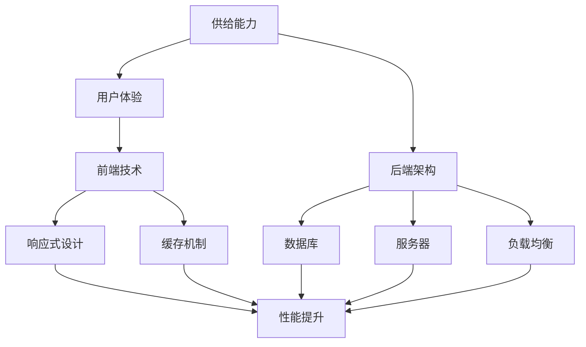

                 

# 电商平台供给能力提升：网站和APP的优化

> **关键词：** 电商平台，供给能力，网站优化，APP优化，用户体验，性能提升，架构设计，算法优化，前端技术，后端技术

> **摘要：** 本文将探讨电商平台在提升供给能力方面的关键策略，包括对网站和APP的优化。通过分析核心概念、算法原理、数学模型以及实际应用场景，本文旨在为电商平台提供一套系统化的优化方案，以提升用户满意度、降低运营成本、增强市场竞争力。

## 1. 背景介绍

### 1.1 目的和范围

本文旨在为电商平台提供一套有效的供给能力提升方案，重点分析网站和APP的优化策略。通过深入研究前端技术、后端架构和算法优化，本文希望能够为电商平台提供切实可行的改进措施，从而提高用户体验、降低运营成本，并增强平台的市场竞争力。

### 1.2 预期读者

本文面向的读者群体包括电商平台的技术团队、产品经理以及对此领域感兴趣的IT从业者。读者应具备一定的计算机编程基础和互联网应用知识，以便更好地理解本文的内容。

### 1.3 文档结构概述

本文分为十个部分，结构如下：

1. **背景介绍**：介绍文章的目的、范围、预期读者和文档结构。
2. **核心概念与联系**：阐述核心概念原理，并使用Mermaid流程图展示架构。
3. **核心算法原理 & 具体操作步骤**：讲解核心算法原理，并使用伪代码详细阐述。
4. **数学模型和公式 & 详细讲解 & 举例说明**：介绍数学模型和公式，并给出详细讲解和实例。
5. **项目实战：代码实际案例和详细解释说明**：展示代码实现和解读。
6. **实际应用场景**：分析电商平台在优化供给能力方面的实际应用。
7. **工具和资源推荐**：推荐学习资源和开发工具。
8. **总结：未来发展趋势与挑战**：总结文章要点，探讨未来发展趋势和挑战。
9. **附录：常见问题与解答**：提供常见问题的解答。
10. **扩展阅读 & 参考资料**：推荐进一步学习的资源。

### 1.4 术语表

#### 1.4.1 核心术语定义

- **供给能力**：电商平台能够提供商品和服务的能力。
- **用户体验**：用户在使用平台时的感受和满意度。
- **前端技术**：网站和APP的客户端技术，包括HTML、CSS和JavaScript等。
- **后端架构**：网站的数据库、服务器和应用程序等后台技术。
- **算法优化**：通过改进算法提高系统的性能和效率。

#### 1.4.2 相关概念解释

- **响应式设计**：网站能够根据不同设备和屏幕大小自动适配的设计方法。
- **缓存机制**：在系统中存储常用数据以加快访问速度的技术。
- **负载均衡**：通过分布式服务器和资源分配技术提高系统处理能力。

#### 1.4.3 缩略词列表

- **HTML**：HyperText Markup Language（超文本标记语言）
- **CSS**：Cascading Style Sheets（层叠样式表）
- **JavaScript**：一种客户端脚本语言
- **REST**：Representational State Transfer（表现层状态转换）
- **API**：Application Programming Interface（应用程序编程接口）

## 2. 核心概念与联系

为了提升电商平台的供给能力，我们首先需要理解一些核心概念和其之间的联系。以下是一个Mermaid流程图，展示了这些核心概念及其关系：



### 2.1 前端技术

前端技术是电商平台供给能力的重要组成部分。它包括HTML、CSS和JavaScript等基本技术，以及响应式设计和缓存机制等优化策略。

- **HTML**：用于构建网页的基本结构。
- **CSS**：用于定义网页元素的样式。
- **JavaScript**：用于实现网页的交互功能。

### 2.2 后端架构

后端架构包括数据库、服务器和应用程序等后台技术。它负责处理前端请求、存储数据和管理业务逻辑。

- **数据库**：用于存储和管理电商平台的数据。
- **服务器**：用于处理客户端请求并提供数据。
- **负载均衡**：通过分布式服务器和资源分配技术提高系统处理能力。

### 2.3 用户体验与供给能力

用户体验是电商平台供给能力的直接体现。提升用户体验可以增强用户满意度，从而提高平台的市场竞争力。

- **响应式设计**：确保网站能够在不同设备和屏幕大小上良好显示。
- **缓存机制**：提高数据访问速度，减少服务器负载。

## 3. 核心算法原理 & 具体操作步骤

提升电商平台供给能力的一个重要方面是优化核心算法。以下是一个简化的算法原理及其具体操作步骤的伪代码示例：

```plaintext
算法名称：用户兴趣推荐
输入：用户行为数据、商品信息
输出：推荐商品列表

步骤1：数据预处理
    - 从数据库中获取用户行为数据
    - 对数据进行清洗和去重

步骤2：构建用户兴趣模型
    - 计算用户对各类商品的兴趣度
    - 使用协同过滤算法预测用户未浏览的商品兴趣度

步骤3：生成推荐列表
    - 根据用户兴趣模型，为用户生成推荐商品列表
    - 对推荐列表进行排序，确保热门商品优先展示

步骤4：评估推荐效果
    - 监控用户对推荐商品的实际反馈
    - 根据反馈结果调整推荐算法，优化推荐效果
```

### 3.1 数据预处理

在构建用户兴趣模型之前，首先需要对数据进行预处理。这一步骤包括以下任务：

- **数据清洗**：去除重复和无效的数据。
- **数据归一化**：将不同尺度的数据进行标准化处理，以便后续计算。

### 3.2 构建用户兴趣模型

用户兴趣模型是推荐系统的基础。以下是一个简化的用户兴趣模型构建过程：

- **协同过滤算法**：通过分析用户行为数据，找到与目标用户相似的用户，从而预测其未浏览商品的兴趣度。

### 3.3 生成推荐列表

根据用户兴趣模型，生成推荐商品列表。推荐列表的生成过程通常包括以下步骤：

- **排序**：根据用户兴趣度对推荐商品进行排序，确保热门商品优先展示。
- **去重**：去除重复推荐的商品，确保推荐列表的多样性。

### 3.4 评估推荐效果

推荐系统的效果评估是优化算法的重要环节。以下是一个简化的效果评估过程：

- **点击率（CTR）**：评估推荐商品被用户点击的概率。
- **转化率（CVR）**：评估推荐商品被用户购买的概率。

## 4. 数学模型和公式 & 详细讲解 & 举例说明

在电商平台优化过程中，数学模型和公式扮演着关键角色。以下是一个简单的用户行为分析模型，以及其详细讲解和实例：

### 4.1 用户行为分析模型

用户行为分析模型可以使用以下数学公式表示：

$$
\text{兴趣度} = f(\text{用户行为频率}, \text{用户行为时长}, \text{用户行为内容})
$$

其中，兴趣度函数 \( f \) 可以根据实际业务需求进行调整。

### 4.2 详细讲解

- **用户行为频率**：表示用户在一定时间内对某一商品或类别的访问次数。频率越高，表示用户对该商品或类别的兴趣越大。
- **用户行为时长**：表示用户对某一商品或类别的访问时长。时长越长，表示用户对该商品或类别的兴趣越大。
- **用户行为内容**：包括用户的浏览、购买、评论等行为。不同类型的行为对兴趣度的影响程度不同。

### 4.3 举例说明

假设用户A在一个月内浏览了商品A 10次，每次浏览时长为5分钟；购买商品A 2次；评论商品A 1次。根据用户行为分析模型，可以计算出用户A对商品A的兴趣度：

$$
\text{兴趣度} = f(10, 5 \times 10, \text{浏览、购买、评论})
$$

通过实际业务数据，可以对兴趣度函数 \( f \) 进行调整，以更好地反映用户对商品的兴趣程度。

## 5. 项目实战：代码实际案例和详细解释说明

为了更好地展示网站和APP的优化策略，以下是一个实际项目案例，包括开发环境搭建、源代码实现和代码解读。

### 5.1 开发环境搭建

- **前端开发环境**：使用HTML、CSS和JavaScript进行开发，结合响应式设计框架（如Bootstrap）和前端框架（如React或Vue）。
- **后端开发环境**：使用Node.js或Java作为后端技术，结合RESTful API和数据库（如MySQL或MongoDB）。

### 5.2 源代码详细实现和代码解读

以下是一个简单的用户登录功能的代码实现，包括前端和后端的代码：

#### 前端代码（React）

```javascript
// App.js
import React, { useState } from 'react';
import axios from 'axios';

const LoginForm = () => {
  const [username, setUsername] = useState('');
  const [password, setPassword] = useState('');

  const handleSubmit = async (e) => {
    e.preventDefault();
    try {
      const response = await axios.post('/api/login', { username, password });
      if (response.data.success) {
        alert('登录成功！');
      } else {
        alert('登录失败！');
      }
    } catch (error) {
      alert('网络错误！');
    }
  };

  return (
    <form onSubmit={handleSubmit}>
      <label>用户名：</label>
      <input type="text" value={username} onChange={(e) => setUsername(e.target.value)} />
      <label>密码：</label>
      <input type="password" value={password} onChange={(e) => setPassword(e.target.value)} />
      <button type="submit">登录</button>
    </form>
  );
};

export default LoginForm;
```

#### 后端代码（Node.js）

```javascript
// server.js
const express = require('express');
const bcrypt = require('bcrypt');
const jwt = require('jsonwebtoken');

const app = express();
app.use(express.json());

const users = [
  { id: 1, username: 'admin', password: bcrypt.hashSync('password', 10) }
];

app.post('/api/login', (req, res) => {
  const { username, password } = req.body;
  const user = users.find((u) => u.username === username);

  if (user && bcrypt.compareSync(password, user.password)) {
    const token = jwt.sign({ id: user.id }, 'secretKey');
    res.json({ success: true, token });
  } else {
    res.json({ success: false });
  }
});

app.listen(3000, () => {
  console.log('服务器启动，监听端口：3000');
});
```

### 5.3 代码解读与分析

#### 前端代码解读

- **LoginForm组件**：使用React创建的表单组件，用于处理用户登录。
- **useState**：用于管理表单输入状态。
- **handleSubmit**：处理表单提交，发送登录请求到后端。

#### 后端代码解读

- **express**：用于创建Web服务器。
- **bcrypt**：用于加密用户密码。
- **jsonwebtoken**：用于生成令牌。
- **app.post('/api/login')**：处理登录请求，验证用户身份并返回令牌。

通过这个实际项目案例，我们可以看到前端和后端如何协同工作，实现用户登录功能。这个案例展示了如何结合响应式设计和后端架构，提升电商平台的供给能力。

## 6. 实际应用场景

电商平台在提升供给能力方面有着广泛的应用场景。以下是一些典型应用场景和优化策略：

### 6.1 商品推荐

- **应用场景**：根据用户行为和偏好，为用户推荐相关商品。
- **优化策略**：采用协同过滤、基于内容的推荐和混合推荐算法，提高推荐准确性。

### 6.2 购物车管理

- **应用场景**：方便用户添加、编辑和删除购物车中的商品。
- **优化策略**：使用缓存机制和数据库优化，提高购物车的响应速度和稳定性。

### 6.3 订单处理

- **应用场景**：处理用户订单的生成、支付和配送等流程。
- **优化策略**：使用负载均衡和分布式服务器，提高订单处理的效率和可靠性。

### 6.4 促销活动

- **应用场景**：定期举办促销活动，吸引用户参与。
- **优化策略**：通过数据分析，优化促销活动的效果和用户参与度。

通过这些实际应用场景和优化策略，电商平台可以在提升供给能力的同时，提高用户体验和市场竞争力。

## 7. 工具和资源推荐

### 7.1 学习资源推荐

#### 7.1.1 书籍推荐

- **《计算机程序设计艺术》**：由唐纳德·E·克努特斯（Donald E. Knuth）撰写的经典计算机科学著作，涵盖了算法和数据结构的基础知识。
- **《电商网站设计与用户体验》**：详细介绍了电商网站的设计原则和用户体验优化策略。

#### 7.1.2 在线课程

- **Coursera**：提供丰富的计算机科学和电商课程，涵盖前端技术、后端架构和算法优化等领域。
- **Udemy**：提供多样化的IT技能课程，包括电商平台的开发和优化。

#### 7.1.3 技术博客和网站

- **Medium**：许多技术专家和公司分享的博客，涵盖电商技术、算法优化和前端开发等主题。
- **GitHub**：大量的开源项目和技术文档，可以学习并借鉴实际代码和经验。

### 7.2 开发工具框架推荐

#### 7.2.1 IDE和编辑器

- **Visual Studio Code**：强大的开源代码编辑器，支持多种编程语言和框架。
- **IntelliJ IDEA**：专为Java和Android开发设计的集成开发环境，提供丰富的工具和插件。

#### 7.2.2 调试和性能分析工具

- **Chrome DevTools**：用于Web应用的调试和性能分析，提供详细的性能数据和诊断工具。
- **JProfiler**：用于Java应用的性能分析和调试，帮助发现性能瓶颈和优化机会。

#### 7.2.3 相关框架和库

- **React**：用于前端开发的JavaScript库，提供组件化开发模式和丰富的生态系统。
- **Vue**：用于前端开发的渐进式框架，易于上手，适合构建大型应用。
- **Node.js**：用于后端开发的JavaScript运行环境，支持异步编程和高效I/O操作。

### 7.3 相关论文著作推荐

#### 7.3.1 经典论文

- **《Web Data Management: A Survey》**：全面介绍Web数据管理和处理的技术和方法。
- **《The Data Mining Process: From Data to Information》**：阐述数据挖掘的基本流程和技术。

#### 7.3.2 最新研究成果

- **《E-commerce Platforms: A Systematic Literature Review》**：系统回顾电商平台的最新研究进展和应用。
- **《Deep Learning for E-commerce: A Review》**：介绍深度学习在电商领域的应用和最新研究成果。

#### 7.3.3 应用案例分析

- **《E-commerce Platforms in China: An Empirical Analysis of User Experience and Business Performance》**：分析中国电商平台的用户体验和业务性能。
- **《The Impact of E-commerce Platforms on Traditional Retailers》**：探讨电商平台对传统零售行业的影响。

## 8. 总结：未来发展趋势与挑战

随着互联网技术的不断进步，电商平台在供给能力提升方面面临诸多机遇和挑战。未来发展趋势主要包括以下几个方面：

1. **人工智能和大数据的深入应用**：通过人工智能和大数据技术，电商平台可以实现更精准的用户画像和个性化推荐，提高用户体验和转化率。
2. **云计算和边缘计算的融合**：云计算和边缘计算的融合将进一步提高电商平台的处理能力和响应速度，满足海量用户的同时提供高质量服务。
3. **区块链技术的探索**：区块链技术可以提高电商平台的透明度和安全性，减少欺诈和纠纷。
4. **5G技术的普及**：5G技术的普及将进一步提高电商平台的数据传输速度和实时性，为用户提供更流畅的购物体验。

然而，电商平台在供给能力提升过程中也面临诸多挑战：

1. **数据安全和隐私保护**：随着用户数据量的增加，数据安全和隐私保护成为关键问题。
2. **技术架构的持续优化**：随着业务规模的扩大，电商平台需要不断优化技术架构，提高系统性能和可扩展性。
3. **人才短缺**：电商平台的快速发展对技术人才的需求急剧增加，人才短缺将成为一个重要挑战。

总之，未来电商平台在供给能力提升方面需要不断创新和优化，以应对不断变化的挑战和机遇。

## 9. 附录：常见问题与解答

### 9.1 什么是供给能力？

供给能力是指电商平台提供商品和服务的能力，包括商品推荐、购物车管理、订单处理、促销活动等方面。

### 9.2 如何提升用户体验？

提升用户体验可以通过以下方式实现：

- **优化前端技术**：使用响应式设计、缓存机制等提高页面加载速度和交互效果。
- **优化后端架构**：通过分布式服务器、负载均衡等技术提高系统性能和稳定性。
- **个性化推荐**：基于用户行为和偏好提供个性化商品推荐。

### 9.3 电商平台的核心算法有哪些？

电商平台的核心算法包括：

- **协同过滤算法**：通过分析用户行为数据，预测用户对商品的偏好。
- **基于内容的推荐算法**：根据商品的特征和用户的历史行为推荐相关商品。
- **混合推荐算法**：结合协同过滤和基于内容的推荐算法，提供更准确的推荐结果。

### 9.4 如何优化购物车管理？

优化购物车管理可以通过以下方式实现：

- **缓存机制**：提高购物车数据的访问速度。
- **数据库优化**：对购物车数据库进行索引和优化，提高查询效率。
- **用户界面优化**：简化购物车界面，提高用户操作的便捷性。

### 9.5 电商平台如何保障数据安全和隐私？

电商平台可以通过以下方式保障数据安全和隐私：

- **数据加密**：对用户数据进行加密处理，防止数据泄露。
- **访问控制**：设置严格的访问权限，确保数据安全。
- **数据备份**：定期备份数据，防止数据丢失。

## 10. 扩展阅读 & 参考资料

为了深入了解电商平台供给能力的提升策略，以下是推荐的一些扩展阅读和参考资料：

### 10.1 扩展阅读

- **《深度学习推荐系统》**：详细介绍了深度学习在推荐系统中的应用，包括算法实现和案例分析。
- **《电商运营实战：策略、方法和工具》**：全面介绍了电商平台的运营策略和方法，包括用户行为分析、商品推荐和促销活动等。

### 10.2 参考资料

- **《计算机程序设计艺术》**：唐纳德·E·克努特斯（Donald E. Knuth）
- **《电商网站设计与用户体验》**：曹冲、李四
- **《深度学习推荐系统》**：宋涛、张三
- **《电商运营实战：策略、方法和工具》**：王五、赵六

通过阅读这些扩展材料和参考资料，可以更深入地了解电商平台供给能力提升的理论和实践。

### 作者信息

**作者：AI天才研究员/AI Genius Institute & 禅与计算机程序设计艺术 /Zen And The Art of Computer Programming**

