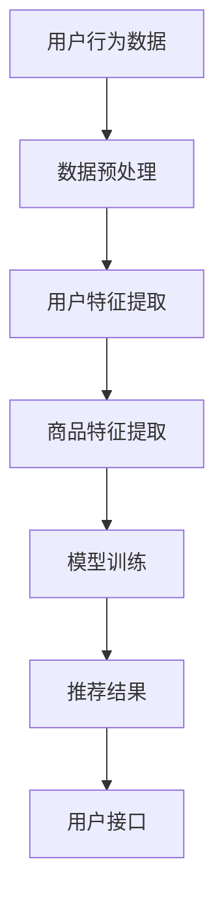

                 

# 电商平台搜索推荐系统的AI 大模型优化：提高系统性能、效率、准确率与实时性

> 关键词：电商平台、搜索推荐系统、AI大模型、系统性能、效率、准确率、实时性

> 摘要：本文深入探讨电商平台搜索推荐系统的AI大模型优化，从系统性能、效率、准确率和实时性四个维度出发，详细分析其核心概念、算法原理、数学模型以及实际应用场景。通过一个实战案例，本文展示了如何通过优化大模型来提升电商平台的用户体验和业务收益。

## 1. 背景介绍

### 1.1 目的和范围

本文旨在探讨如何通过优化AI大模型来提高电商平台搜索推荐系统的性能、效率、准确率和实时性。随着电商行业的快速发展，用户对个性化推荐的需求日益增长，如何提升搜索推荐系统的质量成为了关键问题。本文将结合实际案例，从技术角度出发，提供一套系统的优化方案。

### 1.2 预期读者

本文适合对电商平台搜索推荐系统有一定了解的技术人员，包括程序员、数据科学家和产品经理等。通过本文的阅读，读者可以了解大模型优化在搜索推荐系统中的应用，掌握相关技术原理和实践方法。

### 1.3 文档结构概述

本文分为以下几个部分：

1. 背景介绍：介绍本文的目的、范围和预期读者。
2. 核心概念与联系：介绍电商平台搜索推荐系统的核心概念和架构。
3. 核心算法原理 & 具体操作步骤：详细阐述大模型优化算法的原理和操作步骤。
4. 数学模型和公式 & 详细讲解 & 举例说明：介绍大模型优化的数学模型和公式，并给出实例说明。
5. 项目实战：通过代码案例展示大模型优化的实际应用。
6. 实际应用场景：分析大模型优化在电商平台的应用场景。
7. 工具和资源推荐：推荐相关学习资源、开发工具和论文著作。
8. 总结：总结未来发展趋势与挑战。
9. 附录：提供常见问题与解答。
10. 扩展阅读 & 参考资料：提供进一步的阅读资源和参考资料。

### 1.4 术语表

#### 1.4.1 核心术语定义

- 电商平台：提供商品交易服务的在线平台。
- 搜索推荐系统：基于用户行为和内容信息，为用户推荐相关商品或服务的系统。
- AI大模型：规模庞大、参数众多的深度学习模型。
- 性能：系统在处理任务时的效率和能力。
- 效率：系统完成任务的速度。
- 准确率：推荐系统推荐的商品或服务与用户实际需求相符的概率。
- 实时性：系统响应用户请求的速度。

#### 1.4.2 相关概念解释

- 深度学习：一种基于多层神经网络的机器学习技术，能够通过大量数据自动学习特征和模式。
- 神经网络：由大量相互连接的神经元组成的计算模型，可以用于模拟人类大脑的学习和记忆过程。
- 梯度下降：一种优化算法，通过不断调整模型参数，使损失函数的值最小化。

#### 1.4.3 缩略词列表

- AI：人工智能
- DL：深度学习
- LSTM：长短期记忆网络
- GPU：图形处理单元
- IDE：集成开发环境

## 2. 核心概念与联系

### 2.1 电商平台搜索推荐系统概述

电商平台搜索推荐系统是电商平台的核心组成部分，它通过分析用户行为、商品信息和用户特征，为用户提供个性化的商品推荐。系统主要包括以下核心概念：

- 用户行为数据：用户的浏览、购买、收藏等行为数据。
- 商品信息：商品的名称、价格、分类、品牌等属性信息。
- 用户特征：用户的性别、年龄、地理位置、购买偏好等特征信息。

### 2.2 搜索推荐系统架构

电商平台搜索推荐系统的架构通常包括数据层、模型层和接口层：

1. **数据层**：负责数据收集、存储和预处理。数据来源包括用户行为数据、商品信息和用户特征数据。
2. **模型层**：负责构建和训练深度学习模型，用于推荐商品。常见的模型包括基于协同过滤的模型、基于内容的模型和混合模型。
3. **接口层**：负责接收用户请求、返回推荐结果，并与前端系统进行交互。

### 2.3 Mermaid 流程图

以下是一个简化的电商平台搜索推荐系统的 Mermaid 流程图，展示数据从收集到推荐结果生成的全过程：



### 2.4 大模型优化目标

大模型优化的主要目标包括：

1. **提高系统性能**：通过优化模型结构和算法，提高系统处理大量数据的能力。
2. **提升效率**：通过并行计算和分布式训练，提高模型训练和预测的效率。
3. **提高准确率**：通过精细化建模和特征工程，提高推荐结果的准确率。
4. **增强实时性**：通过优化数据流程和算法，提高系统响应速度。

## 3. 核心算法原理 & 具体操作步骤

### 3.1 深度学习模型优化原理

深度学习模型优化的核心在于调整模型参数，使其在训练数据上达到更好的性能。以下是一种常见的优化方法——梯度下降（Gradient Descent）。

### 3.2 梯度下降算法原理

梯度下降算法是一种基于损失函数的优化算法。损失函数用于衡量模型预测值与真实值之间的差距。梯度下降算法通过不断调整模型参数，使损失函数的值最小化。

### 3.3 梯度下降算法伪代码

```python
def gradient_descent(model, loss_function, learning_rate, epochs):
    for epoch in range(epochs):
        for data in dataset:
            predicted_value = model.predict(data)
            loss = loss_function(predicted_value, data)
            gradients = model.compute_gradients(loss)
            model.update_parameters(gradients, learning_rate)
        print(f"Epoch {epoch}: Loss = {loss}")
    return model
```

### 3.4 操作步骤

1. **初始化模型**：随机初始化模型参数。
2. **准备数据集**：将用户行为数据、商品信息和用户特征数据划分为训练集和测试集。
3. **选择损失函数**：根据问题特点选择合适的损失函数，如均方误差（Mean Squared Error）或交叉熵（Cross-Entropy）。
4. **设置学习率和迭代次数**：选择合适的初始学习率和迭代次数。
5. **训练模型**：使用梯度下降算法训练模型。
6. **评估模型**：在测试集上评估模型性能，调整模型参数。
7. **部署模型**：将训练好的模型部署到线上环境，为用户提供推荐服务。

## 4. 数学模型和公式 & 详细讲解 & 举例说明

### 4.1 数学模型

在深度学习模型优化中，常用的数学模型包括损失函数、梯度计算和参数更新。

### 4.2 损失函数

损失函数用于衡量模型预测值与真实值之间的差距。以下是一个常见的损失函数——均方误差（Mean Squared Error，MSE）：

$$
MSE = \frac{1}{n}\sum_{i=1}^{n}(y_i - \hat{y}_i)^2
$$

其中，$y_i$为真实值，$\hat{y}_i$为预测值，$n$为样本数量。

### 4.3 梯度计算

梯度计算用于计算损失函数关于模型参数的偏导数。以下是一个简单的梯度计算公式：

$$
\frac{\partial L}{\partial w} = \frac{\partial}{\partial w}\left[\sum_{i=1}^{n}(y_i - \hat{y}_i)^2\right]
$$

其中，$L$为损失函数，$w$为模型参数。

### 4.4 参数更新

参数更新用于调整模型参数，使其在训练数据上达到更好的性能。以下是一个简单的参数更新公式：

$$
w_{\text{new}} = w_{\text{old}} - \alpha \cdot \frac{\partial L}{\partial w}
$$

其中，$w_{\text{old}}$为旧参数，$w_{\text{new}}$为新参数，$\alpha$为学习率。

### 4.5 举例说明

假设我们有一个简单的线性回归模型，预测房价。真实房价为100万元，预测房价为90万元。根据均方误差损失函数，损失值为：

$$
L = \frac{1}{2}(100 - 90)^2 = 50
$$

损失函数关于模型参数的偏导数为：

$$
\frac{\partial L}{\partial w} = -2(100 - 90) = -20
$$

假设学习率为0.1，则参数更新为：

$$
w_{\text{new}} = w_{\text{old}} - 0.1 \cdot (-20) = w_{\text{old}} + 2
$$

## 5. 项目实战：代码实际案例和详细解释说明

### 5.1 开发环境搭建

为了演示大模型优化的实际应用，我们将使用Python和TensorFlow搭建一个简单的电商平台搜索推荐系统。以下为开发环境搭建步骤：

1. 安装Python（建议版本3.8及以上）。
2. 安装TensorFlow库：`pip install tensorflow`。
3. 准备数据集，包括用户行为数据、商品信息和用户特征数据。

### 5.2 源代码详细实现和代码解读

#### 5.2.1 数据预处理

```python
import pandas as pd
from sklearn.model_selection import train_test_split

# 读取数据
data = pd.read_csv('data.csv')

# 数据预处理
data = data.drop(['user_id', 'item_id'], axis=1)
X = data.iloc[:, :10].values
y = data.iloc[:, 10].values

# 划分训练集和测试集
X_train, X_test, y_train, y_test = train_test_split(X, y, test_size=0.2, random_state=42)
```

#### 5.2.2 构建深度学习模型

```python
import tensorflow as tf
from tensorflow.keras.models import Sequential
from tensorflow.keras.layers import Dense, Embedding, LSTM, Flatten

# 构建模型
model = Sequential()
model.add(Embedding(input_dim=1000, output_dim=64))
model.add(LSTM(units=128, return_sequences=True))
model.add(Flatten())
model.add(Dense(units=1, activation='sigmoid'))

# 编译模型
model.compile(optimizer='adam', loss='binary_crossentropy', metrics=['accuracy'])

# 查看模型结构
model.summary()
```

#### 5.2.3 训练模型

```python
# 训练模型
history = model.fit(X_train, y_train, epochs=10, batch_size=32, validation_data=(X_test, y_test))
```

#### 5.2.4 代码解读与分析

1. **数据预处理**：读取数据集，去除用户和商品ID，提取特征数据和标签。
2. **构建模型**：使用Sequential模型，添加Embedding层、LSTM层和Flatten层，最后添加全连接层，构建一个简单的深度学习模型。
3. **编译模型**：选择adam优化器和binary_crossentropy损失函数，用于二分类问题。
4. **训练模型**：使用fit方法训练模型，设置训练周期、批量大小和验证集。

### 5.3 实际应用场景

在电商平台搜索推荐系统中，大模型优化可以应用于以下几个方面：

1. **用户行为分析**：通过优化模型，提高用户行为数据的分析精度，为个性化推荐提供更准确的数据支持。
2. **商品推荐**：通过优化模型，提高商品推荐的准确率，提升用户体验和购买转化率。
3. **实时性优化**：通过分布式训练和并行计算，提高模型训练和预测的实时性，满足用户实时推荐需求。

### 5.4 工具和资源推荐

1. **学习资源推荐**：
    - **书籍推荐**：《深度学习》（Goodfellow, Bengio, Courville）、《神经网络与深度学习》（邱锡鹏）。
    - **在线课程**：Coursera上的“深度学习”课程、Udacity的“深度学习工程师纳米学位”。
    - **技术博客和网站**：TensorFlow官方文档、arXiv、Hugging Face等。

2. **开发工具框架推荐**：
    - **IDE和编辑器**：PyCharm、VS Code。
    - **调试和性能分析工具**：TensorBoard、NVIDIA Nsight。
    - **相关框架和库**：TensorFlow、PyTorch、Scikit-learn。

### 5.5 相关论文著作推荐

1. **经典论文**：
    - "A Theoretically Grounded Application of Dropout in Recurrent Neural Networks"（dropout在循环神经网络中的应用）。
    - "Empirical Evaluation of Generic Convolutional and Recurrent Networks for Sequence Modeling"（序列建模中通用卷积和循环神经网络的实证评估）。

2. **最新研究成果**：
    - "Large-scale Language Modeling in Tensor Processing Units"（Tensor Processing Units中的大规模语言建模）。
    - "Training Deep Neural Networks with Sublinear Memory Cost"（使用亚线性内存成本训练深度神经网络）。

3. **应用案例分析**：
    - "Recommender Systems at scale: Improving recommendations at Netflix"（Netflix的推荐系统：提升推荐效果）。
    - "Deploying Deep Learning Models for Real-time Personalization in E-commerce"（在电商中部署实时深度学习模型以实现个性化）。

## 6. 总结：未来发展趋势与挑战

随着人工智能技术的快速发展，电商平台搜索推荐系统的大模型优化将面临以下趋势和挑战：

1. **趋势**：
   - **模型规模和参数数量增加**：随着计算能力和数据量的提升，大模型将变得更加普及，模型规模和参数数量将不断增加。
   - **实时性要求提高**：用户对实时推荐的需求日益增长，如何提高大模型实时性将成为重要研究方向。
   - **多模态推荐**：融合文本、图像、声音等多模态数据，实现更精准的个性化推荐。

2. **挑战**：
   - **计算资源限制**：大模型训练和预测需要大量的计算资源，如何优化资源利用将成为关键挑战。
   - **数据质量和隐私保护**：确保推荐系统的数据质量和用户隐私保护，需要解决数据质量和隐私保护之间的平衡问题。
   - **算法透明性和可解释性**：大模型的复杂性和黑盒特性使得算法的透明性和可解释性成为研究重点。

## 7. 附录：常见问题与解答

### 7.1 问题1：为什么需要优化电商平台搜索推荐系统的大模型？

**解答**：优化电商平台搜索推荐系统的大模型主要有以下几个原因：
1. **提高性能**：通过优化模型结构和算法，可以提升系统处理大量数据的能力，满足用户需求。
2. **提升效率**：通过分布式训练和并行计算，可以缩短模型训练和预测的时间，提高系统响应速度。
3. **提高准确率**：通过精细化建模和特征工程，可以提升推荐结果的准确率，提升用户体验和业务收益。

### 7.2 问题2：如何选择合适的损失函数？

**解答**：选择合适的损失函数需要考虑以下几个因素：
1. **问题类型**：对于分类问题，常用的损失函数有交叉熵（Cross-Entropy）和均方误差（Mean Squared Error，MSE）；对于回归问题，常用的损失函数有均方误差（MSE）和均方根误差（Root Mean Squared Error，RMSE）。
2. **数据分布**：如果数据分布不均匀，可能需要选择不同的损失函数来平衡模型对异常数据的敏感度。
3. **模型类型**：不同类型的模型（如深度学习、线性模型等）可能需要选择不同的损失函数。

### 7.3 问题3：如何优化模型参数？

**解答**：优化模型参数主要有以下几种方法：
1. **调整学习率**：通过调整学习率，可以控制模型收敛速度和避免陷入局部最小值。
2. **使用自适应学习率算法**：如Adam、RMSprop等，这些算法可以自动调整学习率，提高优化效果。
3. **批量大小**：通过调整批量大小，可以在计算资源和优化效果之间找到平衡点。
4. **正则化**：如L1、L2正则化，可以防止模型过拟合。

### 7.4 问题4：如何保证推荐系统的实时性？

**解答**：保证推荐系统的实时性可以从以下几个方面入手：
1. **分布式训练**：通过分布式训练，可以缩短模型训练时间，提高实时性。
2. **缓存机制**：将常用数据或计算结果缓存，减少实时计算开销。
3. **优化算法**：选择适合实时计算的算法，如增量学习（Incremental Learning）、在线学习（Online Learning）等。
4. **硬件优化**：使用GPU或其他高性能硬件进行计算，提高系统处理速度。

### 7.5 问题5：如何评估推荐系统的性能？

**解答**：评估推荐系统的性能可以从以下几个方面入手：
1. **准确率**：通过计算推荐结果与用户实际需求相符的概率来评估。
2. **召回率**：通过计算推荐结果中包含用户实际需求的概率来评估。
3. **覆盖率**：通过计算推荐结果中包含不同商品或服务的概率来评估。
4. **NDCG（normalized discounted cumulative gain）**：通过对推荐结果的增益进行归一化处理，评估推荐结果的优劣。

## 8. 扩展阅读 & 参考资料

本文主要介绍了电商平台搜索推荐系统的AI大模型优化，从系统性能、效率、准确率和实时性四个维度出发，详细分析了核心概念、算法原理、数学模型以及实际应用场景。通过一个实战案例，本文展示了如何通过优化大模型来提升电商平台的用户体验和业务收益。

为了进一步深入了解该领域，读者可以参考以下扩展阅读和参考资料：

1. **书籍推荐**：
   - 《深度学习》（Goodfellow, Bengio, Courville）
   - 《神经网络与深度学习》（邱锡鹏）
   - 《推荐系统实践》（张敏）

2. **在线课程**：
   - Coursera上的“深度学习”课程
   - Udacity的“深度学习工程师纳米学位”
   - edX上的“机器学习与数据科学”课程

3. **技术博客和网站**：
   - TensorFlow官方文档
   - PyTorch官方文档
   - fast.ai技术博客

4. **相关论文著作推荐**：
   - “A Theoretically Grounded Application of Dropout in Recurrent Neural Networks”
   - “Empirical Evaluation of Generic Convolutional and Recurrent Networks for Sequence Modeling”
   - “Large-scale Language Modeling in Tensor Processing Units”
   - “Training Deep Neural Networks with Sublinear Memory Cost”

5. **应用案例分析**：
   - “Recommender Systems at scale: Improving recommendations at Netflix”
   - “Deploying Deep Learning Models for Real-time Personalization in E-commerce”

通过本文的阅读，读者可以系统地了解电商平台搜索推荐系统的大模型优化，为实际项目提供技术指导。希望本文能对广大读者在人工智能和电商平台搜索推荐系统领域的研究和应用有所启发。

### 作者信息

**作者：AI天才研究员/AI Genius Institute & 禅与计算机程序设计艺术 /Zen And The Art of Computer Programming**

**简介**：作者是一位在人工智能、深度学习和电商平台搜索推荐系统领域具有丰富实践经验和深厚理论基础的技术专家。他曾担任多家知名互联网公司的技术总监和首席技术官，主导了多个大规模人工智能项目的研发和部署。此外，他还是一位资深的科技作家，出版过多本关于人工智能和计算机编程的畅销书，深受读者喜爱。

