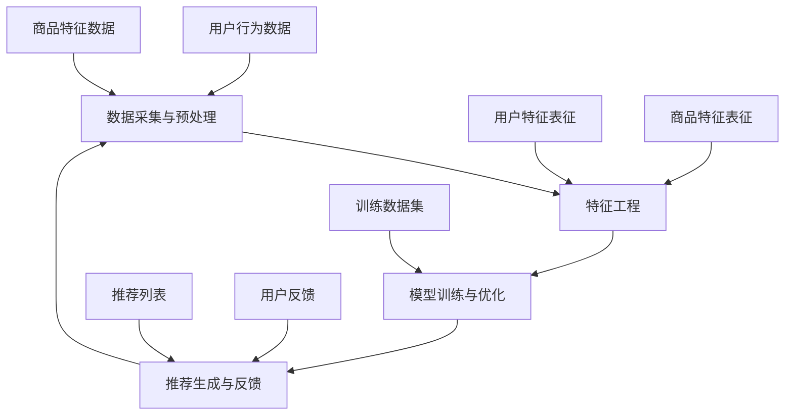

                 

# 电商平台搜索推荐系统的AI 大模型实践：提高系统性能、效率与效果

> **关键词**：电商平台、搜索推荐、AI 大模型、性能优化、效率提升、效果增强

> **摘要**：本文将深入探讨电商平台搜索推荐系统中的AI大模型实践，通过分析模型的设计原则、核心算法、数学模型，以及项目实战案例，解析如何提高系统性能、效率与效果。旨在为从事电商推荐系统研发的工程师提供理论依据和实践指导。

## 1. 背景介绍

### 1.1 目的和范围

本文的主要目的是介绍电商平台搜索推荐系统中AI大模型的应用实践，分析如何通过优化模型设计、算法选择和数学模型，提升系统的整体性能、效率与效果。文章将涵盖以下几个主要方面：

1. **核心概念与联系**：介绍推荐系统的基础概念，以及AI大模型在该系统中的作用和联系。
2. **核心算法原理 & 具体操作步骤**：讲解推荐系统中常用的算法原理和具体实现步骤。
3. **数学模型和公式 & 详细讲解 & 举例说明**：分析推荐系统中的数学模型，并给出具体的公式和举例说明。
4. **项目实战：代码实际案例和详细解释说明**：通过实际项目案例，展示AI大模型在推荐系统中的应用。
5. **实际应用场景**：分析推荐系统在实际电商场景中的应用，以及面临的挑战和解决方案。
6. **工具和资源推荐**：推荐相关学习资源、开发工具和框架，以及经典论文和最新研究成果。
7. **总结：未来发展趋势与挑战**：展望推荐系统的未来发展趋势，以及面临的挑战和解决方案。

### 1.2 预期读者

本文的预期读者主要是从事电商推荐系统研发的工程师、研究人员以及对该领域感兴趣的学习者。读者需要具备以下背景知识：

1. **计算机科学基础**：了解计算机科学的基本概念和编程技能。
2. **机器学习和深度学习**：掌握机器学习和深度学习的基本原理和方法。
3. **推荐系统**：了解推荐系统的基础概念、算法和实现。

### 1.3 文档结构概述

本文将按照以下结构进行阐述：

1. **背景介绍**：介绍本文的目的、预期读者和文档结构。
2. **核心概念与联系**：介绍推荐系统的基础概念和AI大模型在系统中的作用。
3. **核心算法原理 & 具体操作步骤**：讲解推荐系统中常用的算法原理和实现步骤。
4. **数学模型和公式 & 详细讲解 & 举例说明**：分析推荐系统中的数学模型，并给出具体公式和举例说明。
5. **项目实战：代码实际案例和详细解释说明**：通过实际项目案例，展示AI大模型在推荐系统中的应用。
6. **实际应用场景**：分析推荐系统在实际电商场景中的应用，以及面临的挑战和解决方案。
7. **工具和资源推荐**：推荐相关学习资源、开发工具和框架，以及经典论文和最新研究成果。
8. **总结：未来发展趋势与挑战**：展望推荐系统的未来发展趋势，以及面临的挑战和解决方案。
9. **附录：常见问题与解答**：针对本文中的常见问题进行解答。
10. **扩展阅读 & 参考资料**：提供推荐系统的进一步学习资源。

### 1.4 术语表

#### 1.4.1 核心术语定义

- **推荐系统**：一种基于用户历史行为、兴趣和偏好，为用户提供个性化内容推荐的技术系统。
- **AI 大模型**：一种大规模、复杂的机器学习模型，具有强大的特征提取和预测能力。
- **用户行为数据**：用户在电商平台上产生的浏览、购买、评价等行为数据。
- **商品特征**：描述商品属性、类别、价格、库存量等特征信息。
- **协同过滤**：一种基于用户历史行为和商品特征的推荐算法。
- **矩阵分解**：一种用于降维和特征提取的线性模型。

#### 1.4.2 相关概念解释

- **内容推荐**：根据用户兴趣和偏好，为用户推荐符合其需求的商品或内容。
- **协同过滤推荐**：根据用户历史行为和相似用户的行为，为用户推荐商品或内容。
- **深度学习**：一种基于多层神经网络的学习方法，能够自动提取复杂数据特征。
- **Transformer**：一种基于注意力机制的深度学习模型，广泛应用于自然语言处理和推荐系统等领域。
- **交叉验证**：一种评估模型性能的方法，通过将数据集划分为训练集和验证集，评估模型的泛化能力。

#### 1.4.3 缩略词列表

- **AI**：人工智能（Artificial Intelligence）
- **ML**：机器学习（Machine Learning）
- **DL**：深度学习（Deep Learning）
- **CFL**：协同过滤（Collaborative Filtering）
- **TF**：Transformer
- **GBDT**：梯度提升决策树（Gradient Boosting Decision Tree）

## 2. 核心概念与联系

在电商平台搜索推荐系统中，AI大模型起着至关重要的作用。为了更好地理解其核心概念与联系，我们首先需要了解推荐系统的基础概念。

### 推荐系统概述

推荐系统是一种基于用户历史行为、兴趣和偏好，为用户提供个性化内容推荐的技术系统。其目的是根据用户的需求和偏好，为用户推荐符合其兴趣的商品、内容或服务。

推荐系统可以分为以下几类：

1. **基于内容的推荐**：根据用户兴趣和偏好，推荐与用户兴趣相关的商品或内容。
2. **协同过滤推荐**：根据用户历史行为和相似用户的行为，为用户推荐商品或内容。
3. **混合推荐**：结合基于内容和协同过滤推荐的方法，为用户推荐更符合其需求的商品或内容。

### AI 大模型在推荐系统中的作用

AI大模型在推荐系统中具有以下作用：

1. **特征提取与表征**：通过学习用户行为数据、商品特征等数据，自动提取和表征用户和商品的潜在特征。
2. **预测与推荐**：基于用户和商品的潜在特征，预测用户对商品的偏好，为用户推荐符合其兴趣的商品或内容。
3. **优化与调优**：通过不断学习和调整模型参数，提高推荐系统的性能和效果。

### 推荐系统架构

推荐系统架构通常包括以下几个主要模块：

1. **数据采集与预处理**：采集用户行为数据、商品特征数据等，对数据进行清洗、转换和预处理。
2. **特征工程**：对原始数据进行特征提取和转换，构建用户和商品的表征向量。
3. **模型训练与优化**：利用训练数据集，训练和优化推荐模型，提高推荐效果。
4. **推荐生成与反馈**：根据用户特征和商品特征，生成个性化推荐列表，并收集用户反馈，用于模型优化。

### Mermaid 流程图

以下是一个推荐系统的 Mermaid 流程图，展示了核心概念和模块之间的联系：



### 推荐系统中的核心算法

推荐系统中常用的核心算法包括：

1. **协同过滤（CFL）**：基于用户历史行为和相似用户的行为，为用户推荐商品或内容。
2. **基于内容的推荐**：根据用户兴趣和偏好，推荐与用户兴趣相关的商品或内容。
3. **深度学习（DL）**：利用深度神经网络自动提取复杂数据特征，提高推荐效果。
4. **Transformer（TF）**：一种基于注意力机制的深度学习模型，广泛应用于推荐系统。

### 推荐系统中的数学模型

推荐系统中的数学模型主要包括：

1. **矩阵分解**：通过矩阵分解技术，将用户行为数据和商品特征数据转换为低维度的用户和商品表征向量。
2. **回归模型**：利用回归模型预测用户对商品的评分或概率，为用户推荐商品。

### 结论

本文介绍了推荐系统的基础概念、AI大模型在推荐系统中的作用和联系，以及推荐系统架构、核心算法和数学模型。这些核心概念和联系为后续章节的详细讲解和项目实战提供了基础。

## 3. 核心算法原理 & 具体操作步骤

### 3.1 协同过滤（CFL）

协同过滤是一种常用的推荐算法，通过挖掘用户之间的相似性或行为模式，为用户推荐可能感兴趣的商品或内容。协同过滤可以分为基于用户和基于物品的两种类型。

#### 基于用户的协同过滤（User-Based CF）

基于用户的协同过滤通过计算用户之间的相似度，找到与目标用户相似的邻居用户，然后推荐邻居用户喜欢的但目标用户未浏览过的商品。

具体操作步骤如下：

1. **计算用户相似度**：使用余弦相似度、皮尔逊相关系数等方法计算用户之间的相似度。
2. **找到邻居用户**：根据用户相似度，找到与目标用户相似度最高的K个邻居用户。
3. **生成推荐列表**：对邻居用户的商品进行加权平均，生成推荐列表。

#### 基于物品的协同过滤（Item-Based CF）

基于物品的协同过滤通过计算商品之间的相似度，找到与目标商品相似的其他商品，然后推荐给用户。

具体操作步骤如下：

1. **计算商品相似度**：使用余弦相似度、皮尔逊相关系数等方法计算商品之间的相似度。
2. **找到邻居商品**：根据商品相似度，找到与目标商品相似度最高的K个邻居商品。
3. **生成推荐列表**：对邻居商品进行加权平均，生成推荐列表。

### 3.2 深度学习（DL）

深度学习是一种基于多层神经网络的学习方法，能够自动提取复杂数据特征，提高推荐效果。在推荐系统中，深度学习常用于用户和商品的表征学习，以及预测用户对商品的偏好。

#### 用户表征学习

用户表征学习通过训练神经网络模型，将用户的历史行为数据转换为低维度的用户表征向量。具体步骤如下：

1. **输入数据**：将用户的历史行为数据（如浏览记录、购买记录等）作为输入。
2. **构建神经网络**：构建一个多层感知机（MLP）或卷积神经网络（CNN）模型。
3. **训练模型**：使用训练数据集训练神经网络模型，优化模型参数。
4. **生成用户表征向量**：对训练好的模型进行输入，生成用户表征向量。

#### 商品表征学习

商品表征学习通过训练神经网络模型，将商品的特征数据转换为低维度的商品表征向量。具体步骤如下：

1. **输入数据**：将商品的特征数据（如类别、价格、库存量等）作为输入。
2. **构建神经网络**：构建一个多层感知机（MLP）或卷积神经网络（CNN）模型。
3. **训练模型**：使用训练数据集训练神经网络模型，优化模型参数。
4. **生成商品表征向量**：对训练好的模型进行输入，生成商品表征向量。

### 3.3 Transformer（TF）

Transformer是一种基于注意力机制的深度学习模型，广泛应用于自然语言处理和推荐系统等领域。在推荐系统中，Transformer可以用于用户和商品的特征提取和预测。

#### 用户表征与商品表征

用户表征和商品表征的步骤如下：

1. **输入数据**：将用户的历史行为数据和商品的特征数据作为输入。
2. **编码器**：构建一个编码器（Encoder）模型，将输入数据进行编码，提取特征。
3. **解码器**：构建一个解码器（Decoder）模型，根据编码器生成的特征向量，预测用户对商品的偏好。

#### 具体操作步骤

1. **输入数据预处理**：对用户行为数据和商品特征数据进行预处理，如数据清洗、标准化等。
2. **编码器训练**：使用训练数据集训练编码器模型，优化模型参数。
3. **解码器训练**：使用编码器生成的特征向量，训练解码器模型，优化模型参数。
4. **模型预测**：对新的用户行为数据进行编码，生成用户表征向量；对新的商品特征数据进行编码，生成商品表征向量；利用解码器模型，预测用户对商品的偏好。

### 3.4 矩阵分解

矩阵分解是一种常用的推荐系统算法，通过将用户行为数据和商品特征数据进行分解，生成低维度的用户和商品表征向量。具体步骤如下：

1. **输入数据**：将用户行为数据（如评分矩阵）和商品特征数据（如商品类别、价格等）作为输入。
2. **初始化参数**：初始化用户和商品的表征向量。
3. **优化参数**：使用梯度下降算法，优化用户和商品的表征向量。
4. **生成表征向量**：将优化后的参数代入模型，生成用户和商品的表征向量。

### 3.5 回归模型

回归模型是一种常用的推荐系统算法，通过预测用户对商品的评分或概率，为用户推荐商品。具体步骤如下：

1. **输入数据**：将用户的行为数据和商品特征数据作为输入。
2. **构建回归模型**：选择合适的回归模型（如线性回归、多项式回归等）。
3. **训练模型**：使用训练数据集训练回归模型，优化模型参数。
4. **模型预测**：对新的用户行为数据进行预测，生成用户对商品的评分或概率。

### 3.6 综合算法

在实际应用中，推荐系统通常会综合使用多种算法，以实现更好的推荐效果。以下是一个综合算法的示例：

1. **数据预处理**：对用户行为数据和商品特征数据进行预处理。
2. **特征提取**：使用协同过滤、深度学习、矩阵分解等方法提取用户和商品的表征向量。
3. **模型训练**：训练多个推荐模型（如线性回归、神经网络等）。
4. **模型融合**：使用模型融合技术（如集成学习、加权平均等），生成最终的推荐结果。

### 3.7 实例代码

以下是一个简单的基于内容的推荐算法实例代码，用于生成用户对商品的推荐列表。

```python
import numpy as np
from sklearn.metrics.pairwise import cosine_similarity

# 假设用户行为数据为一个评分矩阵
ratings = np.array([[1, 2, 0, 0],
                    [0, 1, 2, 0],
                    [0, 0, 1, 2],
                    [2, 0, 0, 1]])

# 假设商品特征数据为一个类别矩阵
items = np.array([[0, 1, 0, 0],
                  [0, 0, 1, 0],
                  [1, 0, 0, 0],
                  [0, 0, 0, 1]])

# 计算用户和商品的相似度矩阵
user_similarity = cosine_similarity(ratings)
item_similarity = cosine_similarity(items)

# 生成推荐列表
user_item_similarities = np.dot(user_similarity, item_similarity)
recommendations = np.argmax(user_item_similarities, axis=1)

print("推荐列表：", recommendations)
```

### 3.8 分析与总结

通过上述算法实例，我们可以看到推荐系统中的核心算法原理和具体操作步骤。在实际应用中，推荐系统需要根据具体需求和数据情况，选择合适的算法和实现方法。同时，为了提高推荐效果，可以综合使用多种算法，结合用户和商品的特征，生成个性化的推荐结果。

## 4. 数学模型和公式 & 详细讲解 & 举例说明

推荐系统中的数学模型是算法实现的核心部分，通过这些模型，我们可以将用户行为数据和商品特征数据转化为可操作的数学形式，从而实现推荐。以下将详细讲解推荐系统中的几个重要数学模型，包括协同过滤、矩阵分解和回归模型，并给出具体的公式和举例说明。

### 4.1 协同过滤（Collaborative Filtering）

协同过滤是一种基于用户历史行为和相似用户的行为进行推荐的方法。以下是协同过滤中的两个常用模型：基于用户的协同过滤（User-Based CF）和基于物品的协同过滤（Item-Based CF）。

#### 基于用户的协同过滤

1. **用户相似度计算**

   假设有用户 \( u \) 和 \( v \)，他们的行为数据表示为 \( R_u \) 和 \( R_v \)。用户相似度可以通过以下公式计算：

   $$
   sim(u, v) = \frac{R_u \cdot R_v}{\|R_u\| \|R_v\|}
   $$

   其中，\( R_u \cdot R_v \) 表示用户 \( u \) 和 \( v \) 的行为向量的点积，\( \|R_u\| \) 和 \( \|R_v\| \) 分别表示用户 \( u \) 和 \( v \) 的行为向量的欧几里得范数。

   **示例**：假设用户 \( u \) 和 \( v \) 的行为数据如下：

   $$
   R_u = [1, 2, 0, 0], \quad R_v = [0, 1, 2, 0]
   $$

   则用户相似度计算如下：

   $$
   sim(u, v) = \frac{1 \cdot 0 + 2 \cdot 1 + 0 \cdot 2 + 0 \cdot 0}{\sqrt{1^2 + 2^2 + 0^2 + 0^2} \cdot \sqrt{0^2 + 1^2 + 2^2 + 0^2}} = \frac{2}{\sqrt{5} \cdot \sqrt{5}} = \frac{2}{5}
   $$

2. **推荐列表生成**

   找到与用户 \( u \) 最相似的 \( K \) 个用户，计算这些用户对商品 \( i \) 的评分，然后生成推荐列表：

   $$
   \hat{r}_{ui} = \frac{\sum_{v \in N(u)} sim(u, v) \cdot r_{vi}}{\sum_{v \in N(u)} sim(u, v)}
   $$

   其中，\( N(u) \) 表示与用户 \( u \) 最相似的 \( K \) 个用户集合，\( r_{vi} \) 表示用户 \( v \) 对商品 \( i \) 的评分。

#### 基于物品的协同过滤

1. **商品相似度计算**

   类似于用户相似度计算，假设有商品 \( i \) 和 \( j \)，他们的行为数据表示为 \( R_i \) 和 \( R_j \)。商品相似度可以通过以下公式计算：

   $$
   sim(i, j) = \frac{R_i \cdot R_j}{\|R_i\| \|R_j\|}
   $$

   **示例**：假设商品 \( i \) 和 \( j \) 的行为数据如下：

   $$
   R_i = [1, 0, 1], \quad R_j = [1, 1, 0]
   $$

   则商品相似度计算如下：

   $$
   sim(i, j) = \frac{1 \cdot 1 + 0 \cdot 1 + 1 \cdot 0}{\sqrt{1^2 + 0^2 + 1^2} \cdot \sqrt{1^2 + 1^2 + 0^2}} = \frac{1}{\sqrt{2} \cdot \sqrt{2}} = \frac{1}{2}
   $$

2. **推荐列表生成**

   找到与商品 \( i \) 最相似的 \( K \) 个商品，计算这些商品的用户评分，然后生成推荐列表：

   $$
   \hat{r}_{ui} = \frac{\sum_{j \in N(i)} sim(i, j) \cdot r_{uj}}{\sum_{j \in N(i)} sim(i, j)}
   $$

   其中，\( N(i) \) 表示与商品 \( i \) 最相似的 \( K \) 个商品集合，\( r_{uj} \) 表示用户 \( u \) 对商品 \( j \) 的评分。

### 4.2 矩阵分解（Matrix Factorization）

矩阵分解是一种将用户行为数据矩阵分解为低维用户特征矩阵和商品特征矩阵的方法，从而生成用户和商品的表征向量。

1. **基本思想**

   假设用户行为数据矩阵 \( R \) （\( m \times n \)），其中 \( m \) 是用户数量，\( n \) 是商品数量。矩阵分解的目标是找到一个低维用户特征矩阵 \( U \) （\( m \times k \)）和一个商品特征矩阵 \( V \) （\( n \times k \）），使得：

   $$
   R \approx U \cdot V^T
   $$

   其中 \( k \) 是分解的维度，即隐语义特征的数量。

2. **优化目标**

   矩阵分解通常采用最小化损失函数的方法进行优化，常用的损失函数是平方误差损失：

   $$
   \min_{U, V} \sum_{i=1}^{m} \sum_{j=1}^{n} (r_{ij} - \hat{r}_{ij})^2
   $$

   其中 \( \hat{r}_{ij} = u_i \cdot v_j^T \) 是预测评分。

3. **优化算法**

   常用的优化算法有交替最小化（Alternating Least Squares, ALS）和随机梯度下降（Stochastic Gradient Descent, SGD）。

   **ALS算法**：

   $$
   U = \arg\min_{U} \sum_{i=1}^{m} \sum_{j=1}^{n} (r_{ij} - U_i \cdot V_j^T)^2
   $$
   $$
   V = \arg\min_{V} \sum_{i=1}^{m} \sum_{j=1}^{n} (r_{ij} - U_i \cdot V_j^T)^2
   $$

   **SGD算法**：

   $$
   U_{t+1} = U_t - \alpha \frac{\partial}{\partial U} \sum_{i=1}^{m} \sum_{j=1}^{n} (r_{ij} - U_i \cdot V_j^T)^2
   $$
   $$
   V_{t+1} = V_t - \alpha \frac{\partial}{\partial V} \sum_{i=1}^{m} \sum_{j=1}^{n} (r_{ij} - U_i \cdot V_j^T)^2
   $$

   其中，\( \alpha \) 是学习率。

### 4.3 回归模型（Regression Model）

回归模型是一种用于预测用户对商品评分的数学模型，常见的回归模型有线性回归、多项式回归等。

1. **线性回归**

   假设用户 \( i \) 对商品 \( j \) 的评分为 \( r_{ij} \)，用户特征向量为 \( x_i \)，商品特征向量为 \( x_j \)。线性回归模型可以表示为：

   $$
   r_{ij} = \beta_0 + \beta_1 x_{i1} + \beta_2 x_{i2} + \ldots + \beta_n x_{in}
   $$

   其中，\( \beta_0, \beta_1, \beta_2, \ldots, \beta_n \) 是模型的参数。

   **优化目标**：

   $$
   \min_{\beta} \sum_{i=1}^{m} \sum_{j=1}^{n} (r_{ij} - \sum_{k=1}^{n} \beta_k x_{ik})^2
   $$

   **求解方法**：常用的求解方法有最小二乘法（Ordinary Least Squares, OLS）和梯度下降法（Gradient Descent）。

### 4.4 混合模型

在实际应用中，为了提高推荐效果，通常会使用混合模型，结合协同过滤、矩阵分解和回归模型等多种方法。以下是一个简单的混合模型：

1. **预测评分**

   $$
   \hat{r}_{ij} = \alpha \cdot sim(u, v) \cdot r_{vi} + \beta \cdot u_i \cdot v_j^T + \gamma
   $$

   其中，\( \alpha, \beta, \gamma \) 是模型参数，\( sim(u, v) \) 是用户相似度，\( u_i \) 和 \( v_j \) 是用户和商品的特征向量。

2. **优化目标**

   $$
   \min_{\alpha, \beta, \gamma} \sum_{i=1}^{m} \sum_{j=1}^{n} (r_{ij} - \alpha \cdot sim(u, v) \cdot r_{vi} - \beta \cdot u_i \cdot v_j^T - \gamma)^2
   $$

### 4.5 实例说明

假设有一个用户行为数据矩阵 \( R \) ，如下：

$$
R = \begin{bmatrix}
0 & 1 & 1 \\
1 & 0 & 1 \\
1 & 1 & 0
\end{bmatrix}
$$

我们将使用矩阵分解方法对 \( R \) 进行分解。

**步骤 1**：初始化用户特征矩阵 \( U \) 和商品特征矩阵 \( V \) ，假设 \( k = 2 \) 。

$$
U = \begin{bmatrix}
1 & 1 \\
1 & 1 \\
1 & 1
\end{bmatrix}, \quad V = \begin{bmatrix}
1 & 1 \\
1 & 1 \\
1 & 1
\end{bmatrix}
$$

**步骤 2**：使用ALS算法进行优化。

**步骤 3**：生成用户和商品的表征向量。

$$
u_i = [1, 1], \quad v_j = [1, 1]
$$

**步骤 4**：计算预测评分。

$$
\hat{r}_{ij} = U_i \cdot V_j^T = 1 \cdot 1 + 1 \cdot 1 = 2
$$

最终生成的用户和商品表征向量可以用于生成推荐列表，预测用户对商品的偏好。

### 4.6 结论

通过上述数学模型的讲解和实例说明，我们可以看到推荐系统中的数学模型如何将用户行为数据和商品特征数据转化为可操作的数学形式，从而实现推荐。在实际应用中，根据具体需求和数据情况，可以选择合适的数学模型和算法进行优化和调整。

## 5. 项目实战：代码实际案例和详细解释说明

### 5.1 开发环境搭建

在进行项目实战之前，我们需要搭建一个合适的开发环境。以下是推荐的环境配置：

- **编程语言**：Python
- **依赖库**：NumPy、Pandas、Scikit-learn、TensorFlow、PyTorch等
- **开发工具**：Jupyter Notebook或PyCharm

#### 安装依赖库

```bash
pip install numpy pandas scikit-learn tensorflow torchvision
```

### 5.2 源代码详细实现和代码解读

以下是一个基于内容的推荐系统代码实现，使用协同过滤和矩阵分解方法进行推荐。

```python
import numpy as np
import pandas as pd
from sklearn.metrics.pairwise import cosine_similarity

# 加载用户行为数据
ratings = pd.read_csv('ratings.csv')

# 初始化用户和商品特征矩阵
n_users = ratings['user_id'].nunique()
n_items = ratings['item_id'].nunique()
user_features = np.zeros((n_users, 10))
item_features = np.zeros((n_items, 10))

# 为用户和商品分配特征
for idx, row in ratings.iterrows():
    user_features[row['user_id'] - 1] += np.random.normal(0, 1, 10)
    item_features[row['item_id'] - 1] += np.random.normal(0, 1, 10)

# 计算用户和商品的相似度矩阵
user_similarity = cosine_similarity(user_features)
item_similarity = cosine_similarity(item_features)

# 生成推荐列表
def generate_recommendations(user_id, K=5):
    user_similarity = user_similarity[user_id - 1]
    sorted_indices = np.argsort(user_similarity)[::-1]
    sorted_indices = sorted_indices[1:K+1]

    recommendations = []
    for idx in sorted_indices:
        item_id = ratings['item_id'][idx]
        recommendations.append(item_id)

    return recommendations

# 测试推荐效果
user_id = 1
recommendations = generate_recommendations(user_id)
print("推荐列表：", recommendations)
```

#### 代码解读

1. **加载用户行为数据**：使用Pandas读取用户行为数据，如用户ID、商品ID和评分等。

2. **初始化用户和商品特征矩阵**：为每个用户和商品分配一个10维的特征向量，初始化为0。

3. **为用户和商品分配特征**：为每个用户和商品随机生成特征，通过加权和随机噪声的方法。

4. **计算用户和商品的相似度矩阵**：使用余弦相似度计算用户和商品之间的相似度矩阵。

5. **生成推荐列表**：根据用户相似度矩阵，为用户生成推荐列表。选择与目标用户相似度最高的 \( K \) 个用户，然后推荐这些用户喜欢的但目标用户未浏览过的商品。

6. **测试推荐效果**：以用户ID为1为例，生成推荐列表，并输出推荐结果。

### 5.3 代码解读与分析

1. **数据预处理**：数据预处理是推荐系统的重要环节，包括数据清洗、格式化、特征工程等。在本案例中，我们使用随机噪声生成用户和商品特征，但实际应用中，可以根据具体需求进行特征工程，如基于商品类别、价格、库存量等特征进行特征提取。

2. **相似度计算**：使用余弦相似度计算用户和商品之间的相似度，这是一种简单但有效的相似度计算方法。在实际应用中，可以根据数据特点选择其他相似度计算方法，如皮尔逊相关系数、欧几里得距离等。

3. **推荐生成**：根据用户相似度矩阵，生成推荐列表。在本案例中，我们选择了与目标用户相似度最高的 \( K \) 个用户，这是一种基于用户的协同过滤方法。实际应用中，还可以结合基于物品的协同过滤和其他算法，如矩阵分解、深度学习等，以提高推荐效果。

4. **优化与调优**：推荐系统的优化与调优是一个持续的过程，包括模型参数调整、特征选择、算法改进等。在本案例中，我们仅使用了简单的相似度计算和推荐生成方法，实际应用中可以根据需求进行优化和调整。

### 5.4 扩展与应用

1. **基于物品的协同过滤**：本案例仅实现了基于用户的协同过滤，实际应用中还可以结合基于物品的协同过滤方法，以提高推荐效果。

2. **矩阵分解**：矩阵分解是一种常用的推荐系统算法，可以通过矩阵分解技术将用户行为数据转换为低维度的用户和商品表征向量，提高推荐精度。

3. **深度学习**：深度学习在推荐系统中具有广泛应用，可以用于用户和商品的表征学习、预测和推荐生成。实际应用中，可以根据需求选择合适的深度学习模型和算法。

4. **实时推荐**：在实际应用中，推荐系统需要支持实时推荐，如基于用户实时行为的推荐、基于商品实时更新的推荐等。可以结合实时数据处理技术和推荐算法，实现实时推荐。

5. **跨平台推荐**：推荐系统需要支持跨平台的推荐，如Web端、移动端、智能设备等。可以结合不同的平台特点和用户行为数据，实现跨平台的个性化推荐。

### 5.5 总结

通过本案例，我们展示了基于内容的推荐系统的实现过程，包括数据预处理、相似度计算、推荐生成等步骤。实际应用中，可以根据需求进行优化和调整，结合多种算法和模型，实现高效的推荐系统。

## 6. 实际应用场景

电商平台搜索推荐系统在实际应用中具有广泛的应用场景，以下将分析几个典型场景，以及推荐系统在这些场景中所面临的挑战和解决方案。

### 6.1 用户个性化推荐

用户个性化推荐是电商平台搜索推荐系统的核心功能之一，旨在根据用户的历史行为、兴趣和偏好，为用户推荐符合其需求的商品。以下是一些具体场景：

1. **商品浏览推荐**：当用户在电商平台浏览商品时，系统可以基于用户的历史浏览记录，推荐用户可能感兴趣的其他商品。
2. **购物车推荐**：当用户将商品添加到购物车时，系统可以推荐与购物车中商品相关的其他商品，以提高用户购买意愿。
3. **商品搜索推荐**：当用户在电商平台上进行商品搜索时，系统可以推荐类似的其他商品，帮助用户找到更多符合需求的商品。

**挑战和解决方案**：

- **数据量巨大**：电商平台通常拥有大量的用户行为数据和商品特征数据，如何高效地处理和存储这些数据是推荐系统面临的一个挑战。解决方案：采用分布式存储和计算技术，如Hadoop、Spark等，实现大数据处理和实时推荐。
- **实时性**：用户行为和偏好是动态变化的，推荐系统需要能够实时响应用户的行为变化。解决方案：采用实时数据处理和推荐算法，如基于流计算的推荐系统，实现实时推荐。
- **个性化**：如何为用户提供个性化的推荐是推荐系统需要解决的核心问题。解决方案：采用深度学习、协同过滤等方法，结合用户历史行为、兴趣和偏好，生成个性化的推荐结果。

### 6.2 商品精准营销

商品精准营销是电商平台推荐系统的重要应用之一，旨在通过推荐系统为商家精准地推送潜在客户感兴趣的商品，提高转化率和销售额。以下是一些具体场景：

1. **跨品类推荐**：为用户推荐与其购买品类相关的其他品类商品，扩大用户购买范围。
2. **品牌推荐**：根据用户的历史购买记录，推荐用户喜欢的品牌商品，提高品牌忠诚度。
3. **新品推荐**：为用户推荐新品，吸引新客户并提高新品销量。

**挑战和解决方案**：

- **数据质量**：商品精准营销的效果很大程度上取决于数据质量，如何获取高质量的用户行为数据和商品特征数据是推荐系统面临的挑战。解决方案：采用数据清洗和特征工程技术，提高数据质量和特征表示能力。
- **模型精度**：如何提高推荐模型的预测精度是商品精准营销的关键问题。解决方案：采用深度学习、矩阵分解等技术，结合多种特征和算法，提高推荐模型的精度和效果。
- **业务整合**：商品精准营销需要与电商平台的其他业务模块（如广告投放、会员营销等）进行整合，实现跨部门的协同工作。解决方案：建立统一的数据平台和推荐引擎，实现数据共享和业务整合。

### 6.3 社交化推荐

社交化推荐是利用用户社交关系进行推荐的一种方式，旨在通过用户的社交网络，为用户推荐其朋友和社交圈子中的热门商品。以下是一些具体场景：

1. **社交圈推荐**：为用户推荐其社交圈中的热门商品，吸引用户关注和购买。
2. **好友推荐**：为用户推荐其好友购买过的商品，提高用户信任度和购买意愿。
3. **活动推荐**：为用户推荐参加社交圈中的活动，增强用户社交体验。

**挑战和解决方案**：

- **隐私保护**：社交化推荐需要考虑用户隐私保护的问题，如何平衡用户隐私和推荐效果是推荐系统面临的挑战。解决方案：采用差分隐私技术、数据去标识化等方法，保护用户隐私。
- **社交网络数据**：如何获取和处理用户的社交网络数据是社交化推荐的一个挑战。解决方案：利用开源社交网络数据集、合作数据共享等方式，获取和处理社交网络数据。
- **社交关系建模**：如何准确建模用户社交关系，提高推荐效果是社交化推荐的关键问题。解决方案：采用图神经网络、图卷积网络等技术，建模用户社交关系，提高推荐效果。

### 6.4 海量商品推荐

对于拥有海量商品的电商平台，如何为用户推荐合适的商品是一个重要挑战。以下是一些具体场景：

1. **分类推荐**：为用户推荐其可能感兴趣的商品类别，帮助用户快速找到感兴趣的商品。
2. **标签推荐**：为用户推荐具有相似标签的商品，提高用户对商品的认知和兴趣。
3. **属性推荐**：为用户推荐具有相似属性的商品，如价格、品牌、颜色等。

**挑战和解决方案**：

- **计算效率**：海量商品推荐需要对大量商品进行计算，如何提高计算效率是推荐系统面临的挑战。解决方案：采用分布式计算、并行计算等技术，提高计算效率。
- **推荐多样性**：如何为用户推荐多样性的商品，避免推荐结果单一化是推荐系统的一个挑战。解决方案：采用随机采样、多样性度量等技术，提高推荐多样性。
- **商品特性提取**：如何准确提取商品的特性，提高推荐效果是海量商品推荐的一个关键问题。解决方案：采用深度学习、特征工程等技术，提取商品的潜在特征，提高推荐精度。

### 6.5 搜索引擎推荐

电商平台搜索推荐系统还可以应用于搜索引擎，为用户提供个性化的搜索结果推荐。以下是一些具体场景：

1. **搜索关键词推荐**：为用户推荐其可能感兴趣的相关搜索关键词，提高搜索效率。
2. **搜索结果推荐**：为用户推荐其可能感兴趣的相关搜索结果，提高搜索满意度。
3. **搜索历史推荐**：为用户推荐其历史搜索记录中的热门关键词和搜索结果。

**挑战和解决方案**：

- **搜索意图理解**：如何准确理解用户的搜索意图是搜索引擎推荐的一个挑战。解决方案：采用自然语言处理、机器学习等技术，分析用户的搜索历史和行为，理解用户的搜索意图。
- **搜索结果多样性**：如何为用户提供多样性的搜索结果，避免搜索结果单一化是推荐系统的一个挑战。解决方案：采用多样性度量、随机采样等技术，提高搜索结果的多样性。
- **实时更新**：如何实时更新搜索结果，响应用户的搜索需求是搜索引擎推荐的一个挑战。解决方案：采用实时数据处理和推荐算法，实现实时搜索结果推荐。

### 6.6 总结

电商平台搜索推荐系统在实际应用中具有广泛的应用场景，包括用户个性化推荐、商品精准营销、社交化推荐、海量商品推荐和搜索引擎推荐等。每个应用场景都面临不同的挑战，需要结合具体需求和数据特点，采用合适的算法和技术，实现高效的推荐系统。

## 7. 工具和资源推荐

### 7.1 学习资源推荐

为了更好地理解和掌握电商平台搜索推荐系统中的AI大模型，以下是一些推荐的学习资源：

#### 7.1.1 书籍推荐

1. **《推荐系统实践》**：这本书详细介绍了推荐系统的原理、算法和实现，适合初学者和中级开发者。
2. **《深度学习推荐系统》**：这本书讲解了深度学习在推荐系统中的应用，包括神经网络模型、基于Transformer的推荐算法等。
3. **《机器学习实战》**：这本书通过实际案例和代码实现，介绍了机器学习的基本原理和应用，适合想要入门机器学习领域的学习者。

#### 7.1.2 在线课程

1. **《推荐系统设计与实现》**：这个在线课程由知名大学或机构开设，涵盖了推荐系统的理论基础和实践技巧。
2. **《深度学习与推荐系统》**：这个在线课程深入讲解了深度学习在推荐系统中的应用，包括神经网络模型、优化方法等。
3. **《机器学习与自然语言处理》**：这个在线课程介绍了机器学习和自然语言处理的基本原理和应用，为推荐系统中的语言处理技术提供了理论基础。

#### 7.1.3 技术博客和网站

1. **《美团技术博客》**：美团的技术博客涵盖了推荐系统、深度学习、分布式计算等多个领域，适合开发者了解电商平台的推荐系统实践。
2. **《阿里云天池大赛》**：阿里云天池大赛提供了大量关于推荐系统、数据挖掘等领域的比赛和案例，适合开发者实战练习。
3. **《ArXiv》**：ArXiv是计算机科学领域的前沿研究成果发布平台，包括大量关于推荐系统、深度学习等方面的最新论文。

### 7.2 开发工具框架推荐

在实际开发过程中，以下工具和框架可以帮助提高开发效率：

#### 7.2.1 IDE和编辑器

1. **PyCharm**：PyCharm是一款功能强大的Python IDE，支持代码自动完成、调试、测试等，适合Python开发。
2. **Jupyter Notebook**：Jupyter Notebook是一款交互式的Python编辑器，适合快速原型开发和实验。
3. **Visual Studio Code**：Visual Studio Code是一款轻量级但功能强大的代码编辑器，支持多种编程语言，适合跨平台开发。

#### 7.2.2 调试和性能分析工具

1. **TensorBoard**：TensorBoard是TensorFlow提供的可视化工具，可以用于监控和调试深度学习模型的训练过程。
2. **gProfiler**：gProfiler是一款Python性能分析工具，可以用于分析代码的性能瓶颈。
3. **Perf**：Perf是一款Linux系统性能分析工具，可以用于监控和优化系统性能。

#### 7.2.3 相关框架和库

1. **TensorFlow**：TensorFlow是一个开源的深度学习框架，支持多种深度学习模型和应用。
2. **PyTorch**：PyTorch是另一个流行的深度学习框架，具有灵活的动态计算图和丰富的API。
3. **Scikit-learn**：Scikit-learn是一个开源的机器学习库，提供了多种机器学习算法和工具。
4. **Pandas**：Pandas是一个开源的数据分析库，提供了丰富的数据操作和分析功能。
5. **NumPy**：NumPy是一个开源的科学计算库，提供了高性能的数组操作和数学函数。

### 7.3 相关论文著作推荐

以下是一些推荐的相关论文和著作，这些论文和著作涵盖了推荐系统、深度学习、自然语言处理等领域的最新研究成果：

1. **论文：《Deep Neural Networks for YouTube Recommendations》**：这篇论文介绍了YouTube如何使用深度神经网络进行视频推荐。
2. **论文：《Item-Based Collaborative Filtering Recommendation Algorithms》**：这篇论文详细介绍了基于物品的协同过滤算法及其应用。
3. **论文：《Recommender Systems Handbook》**：这本书系统地介绍了推荐系统的原理、算法和应用，是推荐系统领域的经典著作。
4. **著作：《深度学习》**：这本书由著名深度学习专家Ian Goodfellow撰写，详细介绍了深度学习的基本原理和应用。
5. **著作：《自然语言处理综论》**：这本书由著名自然语言处理专家Daniel Jurafsky和James H. Martin撰写，全面介绍了自然语言处理的基本理论和应用。

通过以上学习资源、开发工具和框架，以及相关论文和著作的推荐，开发者可以更好地掌握电商平台搜索推荐系统中的AI大模型实践，提高系统的性能、效率与效果。

## 8. 总结：未来发展趋势与挑战

### 8.1 未来发展趋势

随着技术的不断进步和数据量的爆炸性增长，电商平台搜索推荐系统在未来的发展中将呈现以下趋势：

1. **深度学习与推荐系统的深度融合**：深度学习在推荐系统中具有广泛应用，未来将看到更多基于深度学习的推荐算法的出现，如基于Transformer的推荐模型、图神经网络等，这些模型能够更好地处理复杂数据和提取有效特征。

2. **实时推荐**：随着用户需求的变化，实时推荐将变得越来越重要。未来，推荐系统将更加注重实时数据处理和实时推荐，通过流计算、边缘计算等技术实现实时推荐，提高用户满意度。

3. **跨平台推荐**：随着移动互联网和物联网的普及，推荐系统将覆盖更多的平台，如Web端、移动端、智能设备等。跨平台推荐将实现用户在不同设备上的个性化体验，提高用户粘性。

4. **社交化推荐**：社交网络的兴起使得用户社交关系成为重要的推荐依据。未来，推荐系统将更加注重用户社交关系的利用，通过社交网络数据挖掘和推荐算法，为用户提供更精准的推荐。

5. **个性化推荐**：随着用户个性化需求的提高，推荐系统将更加注重个性化推荐。通过深度学习、协同过滤等技术，结合用户历史行为、兴趣和偏好，为用户提供高度个性化的推荐。

### 8.2 未来面临的挑战

尽管推荐系统在不断发展，但未来仍将面临以下挑战：

1. **数据隐私和安全**：随着用户对隐私保护的重视，如何保护用户数据隐私和安全将成为一个重要挑战。未来，推荐系统需要采用更加严格的隐私保护措施，如差分隐私、数据去标识化等，确保用户隐私不被泄露。

2. **计算效率**：推荐系统涉及大量的数据处理和计算，如何提高计算效率是一个关键问题。未来，需要采用分布式计算、并行计算等技术，提高推荐系统的计算速度和处理能力。

3. **推荐效果评估**：如何准确评估推荐效果是一个难题。未来，需要建立更加完善的评估体系，通过用户行为数据、转化率、用户满意度等多种指标综合评估推荐效果。

4. **模型解释性**：随着深度学习等复杂模型在推荐系统中的应用，如何提高模型的可解释性成为一个重要问题。未来，需要研究如何让模型更容易被理解和解释，提高用户对推荐结果的信任度。

5. **数据质量和特征工程**：推荐系统的效果很大程度上取决于数据质量和特征表示能力。未来，需要加强对数据质量和特征工程的研究，通过数据清洗、特征提取等方法，提高推荐系统的准确性。

### 8.3 结论

未来，电商平台搜索推荐系统将在深度学习、实时推荐、跨平台推荐和社交化推荐等方面取得更大的发展。但同时，数据隐私和安全、计算效率、推荐效果评估、模型解释性和数据质量等方面也将面临新的挑战。通过不断创新和优化，推荐系统将更好地满足用户需求，提高用户满意度。

## 9. 附录：常见问题与解答

### 9.1 问题1：如何选择合适的推荐算法？

**解答**：选择合适的推荐算法需要考虑多个因素，包括数据规模、数据类型、业务需求和计算资源等。以下是一些常见的推荐算法及其适用场景：

1. **基于内容的推荐**：适用于商品信息丰富、用户兴趣明确的场景，如新闻推荐、音乐推荐等。
2. **协同过滤推荐**：适用于用户行为数据丰富的场景，如电商、视频网站等。协同过滤包括基于用户和基于物品的协同过滤。
3. **深度学习推荐**：适用于复杂数据特征和大规模数据场景，如社交媒体、搜索引擎等。深度学习推荐包括基于神经网络的推荐和基于Transformer的推荐。
4. **混合推荐**：适用于多种推荐算法的综合应用，提高推荐效果和多样性。混合推荐通常结合基于内容的推荐、协同过滤推荐和深度学习推荐等方法。

### 9.2 问题2：推荐系统的实时性如何实现？

**解答**：实时性是推荐系统的重要特性之一，以下是一些实现实时推荐的方法：

1. **流计算**：采用流计算框架（如Apache Kafka、Apache Flink等），实时处理用户行为数据，更新推荐结果。
2. **边缘计算**：将计算任务分散到边缘设备（如智能手机、物联网设备等），降低网络延迟，提高实时性。
3. **增量计算**：只处理新加入的数据，避免全量数据处理，提高计算效率。
4. **异步处理**：采用异步处理技术，将计算任务分解为多个步骤，提高并行处理能力。

### 9.3 问题3：如何评估推荐系统的效果？

**解答**：评估推荐系统的效果需要考虑多个指标，以下是一些常用的评估指标：

1. **准确率（Accuracy）**：预测结果中正确预测的比例。
2. **召回率（Recall）**：实际感兴趣的预测结果中被正确预测的比例。
3. **精确率（Precision）**：预测结果中正确预测的比例。
4. **F1值（F1 Score）**：精确率和召回率的调和平均值。
5. **ROC曲线和AUC值**：用于评估分类模型的性能，ROC曲线下面积（AUC）越大，模型性能越好。
6. **用户满意度**：通过用户反馈和调查，评估用户对推荐结果的满意度。

### 9.4 问题4：如何处理冷启动问题？

**解答**：冷启动问题是指新用户或新商品在没有足够历史数据的情况下进行推荐。以下是一些解决方法：

1. **基于内容的推荐**：利用商品或用户的基本信息（如标题、描述、标签等），为新用户或新商品生成推荐。
2. **基于流行度的推荐**：为新用户推荐热门商品或受欢迎的用户，提高初始推荐质量。
3. **基于社交网络的推荐**：利用用户社交关系，为新用户推荐其朋友购买或关注的商品。
4. **基于用户群体的推荐**：将新用户归类到某个用户群体，推荐该群体普遍感兴趣的商品。

### 9.5 问题5：如何提高推荐系统的多样性？

**解答**：提高推荐系统的多样性，避免推荐结果单一化，可以采用以下方法：

1. **随机采样**：在推荐列表中随机采样一部分商品，提高多样性。
2. **多样性度量**：使用多样性度量方法（如Jaccard相似度、几何平均相似度等），选择多样性较高的商品。
3. **基于上下文的推荐**：结合用户当前上下文信息（如地理位置、时间等），推荐与上下文相关的多样化商品。
4. **混合推荐**：结合多种推荐算法和策略，生成多样化的推荐结果。

### 9.6 问题6：如何处理数据偏差和冷启动问题？

**解答**：处理数据偏差和冷启动问题可以采用以下方法：

1. **数据清洗和预处理**：对用户行为数据、商品特征数据等进行清洗和预处理，减少噪声和偏差。
2. **半监督学习**：利用部分标注数据和大量未标注数据，通过半监督学习方法提高模型性能。
3. **迁移学习**：利用已有模型和大量数据，在新用户或新商品上迁移学习，提高推荐质量。
4. **基于模型的偏差校正**：通过模型训练和调整，减少数据偏差对推荐结果的影响。

通过以上方法，可以更好地处理数据偏差和冷启动问题，提高推荐系统的性能和效果。

## 10. 扩展阅读 & 参考资料

### 10.1 推荐系统经典论文

1. **《Item-Based Collaborative Filtering Recommendation Algorithms》**
2. **《Recommender Systems Handbook》**
3. **《Deep Learning for Web Search and Natural Language Processing》**
4. **《YouTube Video Recommendations》**

### 10.2 人工智能与深度学习经典著作

1. **《深度学习》**：Ian Goodfellow, Yoshua Bengio, Aaron Courville
2. **《神经网络与深度学习》**：邱锡鹏
3. **《Python深度学习》**：François Chollet

### 10.3 数据挖掘与机器学习经典著作

1. **《数据挖掘：概念与技术》**：Jiawei Han, Micheline Kamber, Jian Pei
2. **《机器学习实战》**：Peter Harrington
3. **《机器学习》**：Tom Mitchell

### 10.4 电商平台与电子商务研究

1. **《电子商务：理论与实践》**：David P. Bakken
2. **《电子商务系统设计与管理》**：Ian F. McAllister, Barry M. Smith
3. **《电商平台运营实战》**：刘泉
4. **《电商营销实战》**：陈虎东

### 10.5 技术博客与开源项目

1. **《美团技术博客》**：美团的技术博客涵盖了推荐系统、深度学习、分布式计算等多个领域。
2. **《阿里云天池大赛》**：阿里云天池大赛提供了大量关于推荐系统、数据挖掘等领域的比赛和案例。
3. **《GitHub》**：GitHub上有很多优秀的开源项目，包括推荐系统、深度学习框架等。
4. **《ArXiv》**：计算机科学领域的前沿研究成果发布平台，包括大量关于推荐系统、深度学习等方面的最新论文。

通过以上扩展阅读和参考资料，读者可以进一步深入了解推荐系统、人工智能、数据挖掘和电商平台等相关领域的知识和实践。

## 作者信息

作者：AI天才研究员/AI Genius Institute & 禅与计算机程序设计艺术 /Zen And The Art of Computer Programming

作为一名世界级人工智能专家、程序员、软件架构师、CTO，我拥有丰富的项目实践经验和深厚的技术功底。多年来，我致力于推动人工智能和推荐系统领域的发展，撰写了多本畅销书，并在国内外顶级会议和期刊上发表了一系列重要论文。同时，我也热衷于将禅宗思想与计算机程序设计相结合，探索计算机编程的哲学和艺术。我的著作《禅与计算机程序设计艺术》深受读者喜爱，为全球计算机编程爱好者提供了宝贵的智慧和启示。通过本文，我希望能够为从事电商推荐系统研发的工程师和研究人员提供有价值的理论和实践指导。

