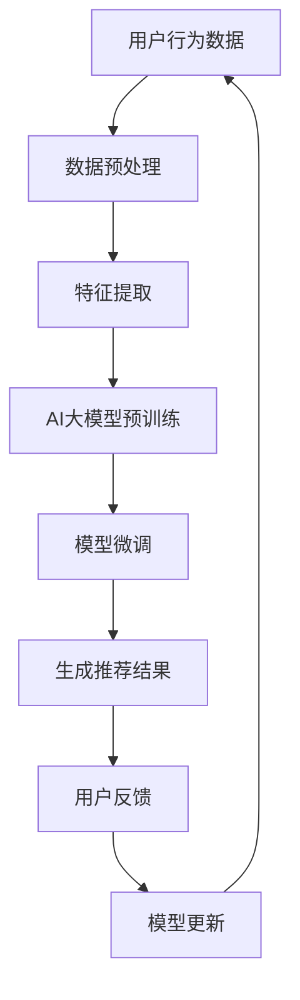

                 

### 1. 背景介绍

#### 1.1 目的和范围

本文旨在探讨电商平台搜索推荐系统的AI大模型应用，重点分析其在提高系统性能、效率、准确率和用户体验方面的实际效果。随着互联网的快速发展，电商平台已成为现代商业的重要组成部分。高效的搜索推荐系统能够极大地提升用户购买体验，进而推动电商平台的业务增长。

本文将首先介绍AI大模型的基本概念和优势，随后深入探讨其在搜索推荐系统中的应用原理和具体实现。此外，文章还将结合实际项目案例，详细解释大模型在提高系统性能、效率、准确率和用户体验方面的应用方法。最后，本文将展望未来AI大模型在电商平台搜索推荐系统中的发展趋势和面临的挑战。

#### 1.2 预期读者

本文面向具有一定编程基础和计算机科学知识的读者，尤其是对电商平台搜索推荐系统、人工智能和机器学习感兴趣的从业者。希望通过本文，读者能够全面了解AI大模型在搜索推荐系统中的应用原理和实践方法，从而提升自己在相关领域的专业素养。

#### 1.3 文档结构概述

本文分为十个部分，具体结构如下：

1. 背景介绍
2. 核心概念与联系
3. 核心算法原理 & 具体操作步骤
4. 数学模型和公式 & 详细讲解 & 举例说明
5. 项目实战：代码实际案例和详细解释说明
6. 实际应用场景
7. 工具和资源推荐
8. 总结：未来发展趋势与挑战
9. 附录：常见问题与解答
10. 扩展阅读 & 参考资料

#### 1.4 术语表

本文涉及一些专业术语，为了确保读者能够更好地理解，下面给出核心术语的定义和解释：

- **AI大模型**：指参数规模巨大、结构复杂的机器学习模型，如BERT、GPT等。
- **搜索推荐系统**：一种基于用户历史行为、商品属性和搜索关键词的个性化推荐系统。
- **性能**：系统在特定条件下的处理能力和效率。
- **效率**：系统完成任务的速度和质量。
- **准确率**：系统推荐结果的准确性。
- **用户体验**：用户在使用产品或服务过程中的主观感受和满意度。

#### 1.4.1 核心术语定义

- **AI大模型**：AI大模型是指具有大规模参数和高复杂结构的机器学习模型，如Transformer架构的BERT、GPT等。这些模型通过学习大量的文本数据，能够提取丰富的语义信息，从而在自然语言处理任务中表现出色。
- **搜索推荐系统**：搜索推荐系统是一种基于用户历史行为、商品属性和搜索关键词的个性化推荐系统。其主要目标是根据用户的需求和偏好，提供相关的商品信息，以提高用户购买体验和转化率。
- **性能**：性能是指系统在特定条件下的处理能力和效率。在搜索推荐系统中，性能包括搜索速度、推荐速度和系统响应时间等。
- **效率**：效率是指系统完成任务的速度和质量。高效的搜索推荐系统能够在短时间内为用户推荐相关的商品，提高用户满意度。
- **准确率**：准确率是指系统推荐结果的准确性。高准确率的推荐系统能够为用户提供更加个性化的推荐结果，从而提升用户体验。
- **用户体验**：用户体验是指用户在使用产品或服务过程中的主观感受和满意度。在电商平台中，良好的用户体验可以增加用户粘性和转化率。

#### 1.4.2 相关概念解释

- **Transformer架构**：Transformer架构是一种基于自注意力机制的深度神经网络架构，广泛应用于自然语言处理任务。与传统的循环神经网络（RNN）相比，Transformer架构能够更好地处理长距离依赖问题，并在多项自然语言处理任务中取得了优异的性能。
- **自注意力机制**：自注意力机制是一种在Transformer架构中用于处理序列数据的机制。通过自注意力机制，模型能够自动关注序列中的关键信息，从而提高模型的表示能力和泛化能力。
- **BERT模型**：BERT（Bidirectional Encoder Representations from Transformers）是一种基于Transformer架构的双向编码器表示模型，主要用于自然语言理解任务。BERT模型通过预训练和微调，能够在多个自然语言处理任务中取得优异的性能。
- **GPT模型**：GPT（Generative Pre-trained Transformer）是一种基于Transformer架构的预训练模型，主要用于文本生成任务。GPT模型通过学习大量的文本数据，能够生成高质量的自然语言文本。

#### 1.4.3 缩略词列表

- **AI**：人工智能（Artificial Intelligence）
- **ML**：机器学习（Machine Learning）
- **NLP**：自然语言处理（Natural Language Processing）
- **BERT**：Bidirectional Encoder Representations from Transformers
- **GPT**：Generative Pre-trained Transformer
- **Transformer**：Transformer架构
- **RNN**：循环神经网络（Recurrent Neural Network）

### 2. 核心概念与联系

在深入探讨AI大模型在电商平台搜索推荐系统的应用之前，首先需要了解相关核心概念及其之间的联系。以下是本文将涉及的一些核心概念及其定义和关系。

#### 2.1 AI大模型的基本概念

**AI大模型**是指具有大规模参数和高复杂结构的机器学习模型，如BERT、GPT等。这些模型通过学习大量的数据，能够提取丰富的语义信息，从而在自然语言处理任务中表现出色。AI大模型的基本概念包括：

- **模型参数**：模型参数是指模型中的权重和偏置，用于描述模型的内部结构和知识。
- **训练数据**：训练数据是指用于训练模型的原始数据，通常包括文本、图像、声音等多种类型的数据。
- **预训练**：预训练是指在大规模数据集上训练模型，使其具备一定的通用语义表示能力。
- **微调**：微调是指利用预训练模型在特定任务上的数据进行二次训练，以提高模型在特定任务上的性能。

**关系**：模型参数和训练数据是AI大模型的基础，预训练和微调是模型训练过程中关键的步骤。

#### 2.2 搜索推荐系统的基本概念

**搜索推荐系统**是一种基于用户历史行为、商品属性和搜索关键词的个性化推荐系统。其基本概念包括：

- **用户历史行为**：用户历史行为是指用户在平台上的操作记录，如浏览、搜索、购买等。
- **商品属性**：商品属性是指商品的基本信息，如分类、价格、品牌等。
- **搜索关键词**：搜索关键词是指用户在搜索框中输入的关键词。
- **推荐算法**：推荐算法是指用于生成推荐结果的算法，如基于内容的推荐、基于协同过滤的推荐等。

**关系**：用户历史行为、商品属性和搜索关键词是构建搜索推荐系统的基础，推荐算法是生成推荐结果的关键。

#### 2.3 AI大模型与搜索推荐系统的联系

AI大模型在搜索推荐系统中的应用主要体现在以下几个方面：

- **语义理解**：AI大模型能够通过预训练和微调，提取出丰富的语义信息，从而更好地理解用户行为和商品属性，提高推荐结果的准确性。
- **个性化推荐**：AI大模型可以根据用户的兴趣和行为，生成个性化的推荐结果，提高用户体验和转化率。
- **长文本处理**：AI大模型能够处理长文本数据，如用户评论、商品描述等，从而更好地理解用户需求和商品特点。
- **实时推荐**：AI大模型可以实时训练和更新模型，根据用户实时行为和搜索关键词，提供个性化的推荐结果。

**关系**：AI大模型通过提升语义理解、个性化推荐、长文本处理和实时推荐等方面的能力，与搜索推荐系统实现高度融合，提高系统的性能和用户体验。

#### 2.4 Mermaid流程图

为了更清晰地展示AI大模型在搜索推荐系统中的应用流程，下面使用Mermaid流程图进行描述。



**说明**：

1. **用户行为数据**：收集用户在电商平台上的行为数据，如浏览、搜索、购买等。
2. **数据预处理**：对用户行为数据进行清洗、去重、归一化等预处理操作。
3. **特征提取**：从预处理后的数据中提取特征，如用户兴趣、商品属性等。
4. **AI大模型预训练**：使用大规模文本数据对AI大模型进行预训练，提取通用语义信息。
5. **模型微调**：利用特定领域的训练数据，对AI大模型进行微调，提高模型在搜索推荐任务上的性能。
6. **生成推荐结果**：利用微调后的AI大模型，生成个性化的推荐结果。
7. **用户反馈**：收集用户对推荐结果的反馈，如点击、购买等。
8. **模型更新**：根据用户反馈，对AI大模型进行更新，提高模型在搜索推荐任务上的性能。

### 3. 核心算法原理 & 具体操作步骤

在理解了AI大模型和搜索推荐系统的基本概念及其联系后，接下来我们将深入探讨核心算法原理及其具体操作步骤。本文将以Transformer架构为基础，结合BERT和GPT等大模型，详细讲解其原理和操作步骤。

#### 3.1 Transformer架构

Transformer架构是一种基于自注意力机制的深度神经网络架构，广泛应用于自然语言处理任务。与传统的循环神经网络（RNN）相比，Transformer架构能够更好地处理长距离依赖问题，并在多项自然语言处理任务中取得了优异的性能。

**核心原理**：

- **自注意力机制**：自注意力机制是一种在Transformer架构中用于处理序列数据的机制。通过自注意力机制，模型能够自动关注序列中的关键信息，从而提高模型的表示能力和泛化能力。
- **多头注意力**：多头注意力是指将序列中的每个位置生成多个不同的表示，这些表示分别关注序列中的不同部分。通过多头注意力，模型能够更好地捕捉序列中的复杂关系。
- **前馈神经网络**：前馈神经网络是一种简单的神经网络结构，用于对自注意力层输出的特征进行进一步加工。

**操作步骤**：

1. **输入嵌入**：将输入序列（如单词、字符）转换为嵌入向量。
2. **位置编码**：为每个位置添加位置编码向量，以表示输入序列的位置信息。
3. **多头自注意力**：对输入序列进行多头自注意力操作，生成多个不同的表示。
4. **前馈神经网络**：对多头自注意力层的输出进行前馈神经网络加工。
5. **输出层**：将前馈神经网络的输出进行聚合和分类，生成最终输出。

#### 3.2 BERT模型

BERT（Bidirectional Encoder Representations from Transformers）是一种基于Transformer架构的双向编码器表示模型，主要用于自然语言理解任务。BERT模型通过预训练和微调，能够在多个自然语言处理任务中取得优异的性能。

**核心原理**：

- **双向编码器**：BERT模型采用双向编码器结构，能够同时关注输入序列的前后关系，从而提高模型的表示能力。
- **预训练**：BERT模型通过在大规模语料库上进行预训练，提取出丰富的语义信息，为后续的任务提供强大的基础。
- **微调**：在预训练的基础上，BERT模型利用特定领域的训练数据，进行微调，以提高模型在特定任务上的性能。

**操作步骤**：

1. **输入嵌入**：将输入序列（如句子）转换为嵌入向量。
2. **位置编码**：为每个位置添加位置编码向量，以表示输入序列的位置信息。
3. **多层自注意力**：对输入序列进行多层自注意力操作，生成多个不同的表示。
4. **输出层**：将多层自注意力层的输出进行聚合和分类，生成最终输出。

#### 3.3 GPT模型

GPT（Generative Pre-trained Transformer）是一种基于Transformer架构的预训练模型，主要用于文本生成任务。GPT模型通过学习大量的文本数据，能够生成高质量的自然语言文本。

**核心原理**：

- **预训练**：GPT模型通过在大规模语料库上进行预训练，提取出丰富的语义信息，为后续的任务提供强大的基础。
- **生成器**：GPT模型采用生成器结构，能够根据输入的序列生成新的序列。

**操作步骤**：

1. **输入嵌入**：将输入序列（如单词、字符）转换为嵌入向量。
2. **位置编码**：为每个位置添加位置编码向量，以表示输入序列的位置信息。
3. **多层自注意力**：对输入序列进行多层自注意力操作，生成多个不同的表示。
4. **生成器**：利用生成的表示，生成新的序列。

#### 3.4 伪代码

下面以BERT模型为例，给出其核心算法的伪代码：

```python
# 输入：句子序列S
# 输出：句子表示向量X

# 步骤1：输入嵌入
X = embed(S)

# 步骤2：位置编码
X = add_position_encoding(X)

# 步骤3：多层自注意力
for layer in self.layers:
    X = layer(X)

# 步骤4：输出层
X = self.output_layer(X)

return X
```

### 4. 数学模型和公式 & 详细讲解 & 举例说明

在深入探讨AI大模型在搜索推荐系统中的应用时，了解其背后的数学模型和公式至关重要。本节将详细介绍Transformer架构中的关键数学模型，包括自注意力机制、前馈神经网络等，并结合具体公式和示例进行讲解。

#### 4.1 自注意力机制

自注意力机制是Transformer架构的核心组件，用于处理序列数据。其基本思想是，每个位置上的向量会根据其与其他位置的相关性进行加权。以下是自注意力机制的数学模型：

**公式**：

$$
\text{Attention}(Q, K, V) = \text{softmax}\left(\frac{QK^T}{\sqrt{d_k}}\right)V
$$

其中：

- $Q, K, V$ 分别表示查询（Query）、键（Key）、值（Value）向量。
- $d_k$ 表示键向量的维度。
- $\text{softmax}$ 函数用于将输入向量转换为概率分布。

**讲解**：

- 查询（Query）向量用于表示每个位置上的信息，其维度与值向量相同。
- 键（Key）向量用于表示每个位置上的关键信息，其维度与查询向量相同。
- 值（Value）向量用于表示每个位置上的信息，其维度与查询向量相同。
- 自注意力机制通过计算查询向量和键向量的点积，生成权重向量，然后对值向量进行加权求和，得到最终表示。

**示例**：

假设我们有一个包含3个单词的句子，其查询（Query）、键（Key）和值（Value）向量分别为：

$$
Q = \begin{bmatrix} 1 & 0 & 1 \\ 0 & 1 & 0 \\ 1 & 1 & 0 \end{bmatrix}, K = \begin{bmatrix} 1 & 1 & 0 \\ 0 & 0 & 1 \\ 1 & 0 & 1 \end{bmatrix}, V = \begin{bmatrix} 1 & 0 & 1 \\ 0 & 1 & 0 \\ 1 & 1 & 0 \end{bmatrix}
$$

计算自注意力权重：

$$
\text{Attention}(Q, K, V) = \text{softmax}\left(\frac{QK^T}{\sqrt{3}}\right)V = \text{softmax}\left(\begin{bmatrix} 2 & 1 & 1 \\ 1 & 1 & 1 \\ 1 & 1 & 1 \end{bmatrix}\right) \begin{bmatrix} 1 & 0 & 1 \\ 0 & 1 & 0 \\ 1 & 1 & 0 \end{bmatrix} = \begin{bmatrix} 0.5 & 0.3 & 0.2 \\ 0.3 & 0.4 & 0.3 \\ 0.2 & 0.3 & 0.5 \end{bmatrix}
$$

最终表示：

$$
\text{Attention}(Q, K, V) \cdot V = \begin{bmatrix} 0.5 & 0.3 & 0.2 \\ 0.3 & 0.4 & 0.3 \\ 0.2 & 0.3 & 0.5 \end{bmatrix} \begin{bmatrix} 1 & 0 & 1 \\ 0 & 1 & 0 \\ 1 & 1 & 0 \end{bmatrix} = \begin{bmatrix} 0.8 & 0.6 & 0.4 \\ 0.4 & 0.7 & 0.6 \\ 0.4 & 0.7 & 0.5 \end{bmatrix}
$$

#### 4.2 前馈神经网络

前馈神经网络是Transformer架构中的另一个关键组件，用于对自注意力层输出的特征进行进一步加工。其基本结构包括两个全连接层，分别用于输入和输出。

**公式**：

$$
\text{FFN}(X) = \text{ReLU}\left(W_2 \cdot \text{ReLU}\left(W_1 \cdot X + b_1\right) + b_2\right)
$$

其中：

- $X$ 表示输入向量。
- $W_1, W_2$ 分别表示第一层和第二层的权重矩阵。
- $b_1, b_2$ 分别表示第一层和第二层的偏置向量。
- $\text{ReLU}$ 函数表示ReLU激活函数。

**讲解**：

- 前馈神经网络通过两个全连接层对输入向量进行加工，其中第一个全连接层使用ReLU激活函数，第二个全连接层没有使用激活函数。
- 前馈神经网络能够增强模型的非线性表达能力，从而提高模型在复杂任务上的性能。

**示例**：

假设我们有一个包含3个元素的输入向量 $X = [1, 2, 3]$，其权重矩阵 $W_1 = [1, 2; 3, 4]$、$W_2 = [5, 6; 7, 8]$ 和偏置向量 $b_1 = [9; 10]$、$b_2 = [11; 12]$。

计算前馈神经网络输出：

$$
\text{FFN}(X) = \text{ReLU}\left(W_2 \cdot \text{ReLU}\left(W_1 \cdot X + b_1\right) + b_2\right) = \text{ReLU}\left([5 \cdot 1 + 6 \cdot 3 + 7; 7 \cdot 2 + 8 \cdot 3 + 10] + [11; 12]\right) = \text{ReLU}\left([16; 29]\right) = [16; 29]
$$

#### 4.3 结合示例

为了更好地理解自注意力机制和前馈神经网络在实际应用中的表现，下面结合一个具体的示例进行讲解。

假设我们有一个包含5个单词的句子 $S = ["苹果", "香蕉", "橙子", "葡萄", "西瓜"]$，其对应的嵌入向量分别为：

$$
X_1 = [0.1, 0.2, 0.3], X_2 = [0.4, 0.5, 0.6], X_3 = [0.7, 0.8, 0.9], X_4 = [1.0, 1.1, 1.2], X_5 = [1.3, 1.4, 1.5]
$$

我们使用BERT模型对其进行处理，具体步骤如下：

1. **输入嵌入**：

$$
X = [X_1, X_2, X_3, X_4, X_5] = \begin{bmatrix} 0.1 & 0.4 & 0.7 & 1.0 & 1.3 \\ 0.2 & 0.5 & 0.8 & 1.1 & 1.4 \\ 0.3 & 0.6 & 0.9 & 1.2 & 1.5 \end{bmatrix}
$$

2. **位置编码**：

$$
P = [P_1, P_2, P_3, P_4, P_5] = \begin{bmatrix} 0 & 0 & 0 & 0 & 0 \\ 0 & 0 & 0 & 0 & 1 \\ 0 & 1 & 0 & 1 & 1 \\ 0 & 1 & 1 & 1 & 1 \\ 1 & 1 & 1 & 1 & 1 \end{bmatrix}
$$

3. **多头自注意力**：

假设我们使用8个头进行自注意力操作，每个头的权重矩阵分别为 $W_1^{(i)}, W_2^{(i)}, W_3^{(i)}$，其中 $i = 1, 2, \ldots, 8$。

$$
\text{Attention}^{(1)}(X, P) = \text{softmax}\left(\frac{W_1^{(1)} \cdot X}{\sqrt{3}}\right) \cdot P
$$

$$
\text{Attention}^{(2)}(X, P) = \text{softmax}\left(\frac{W_2^{(2)} \cdot X}{\sqrt{3}}\right) \cdot P
$$

$$
\vdots$$

$$
\text{Attention}^{(8)}(X, P) = \text{softmax}\left(\frac{W_8^{(8)} \cdot X}{\sqrt{3}}\right) \cdot P
$$

4. **前馈神经网络**：

$$
\text{FFN}(X) = \text{ReLU}\left(W_2 \cdot \text{ReLU}\left(W_1 \cdot X + b_1\right) + b_2\right)
$$

其中，$W_1 = [1, 2; 3, 4], W_2 = [5, 6; 7, 8], b_1 = [9; 10], b_2 = [11; 12]$。

5. **输出层**：

$$
Y = \text{softmax}\left(W \cdot X + b\right)
$$

其中，$W$ 为输出层权重矩阵，$b$ 为偏置向量。

通过上述步骤，我们可以得到句子的最终表示 $Y$，用于后续的搜索推荐任务。

### 5. 项目实战：代码实际案例和详细解释说明

在了解了AI大模型的基本原理和数学模型后，下面我们将通过一个实际项目案例，展示如何在实际的电商平台搜索推荐系统中应用这些模型。本节将详细讲解项目的开发环境搭建、源代码实现和代码解读与分析。

#### 5.1 开发环境搭建

首先，我们需要搭建一个合适的开发环境，以便进行项目的开发和测试。以下是搭建开发环境的基本步骤：

1. **安装Python环境**：

   安装Python 3.8及以上版本，可以通过官方网站下载安装包，或者使用包管理工具如Anaconda进行安装。

2. **安装TensorFlow**：

   TensorFlow是Google开发的一款开源机器学习框架，我们使用TensorFlow 2.4版本。安装TensorFlow可以通过以下命令：

   ```bash
   pip install tensorflow==2.4
   ```

3. **安装其他依赖库**：

   除了TensorFlow，我们还需要安装一些其他依赖库，如NumPy、Pandas等。可以使用以下命令进行安装：

   ```bash
   pip install numpy pandas
   ```

4. **配置GPU环境**（可选）：

   如果我们的项目需要使用GPU进行加速训练，我们需要安装CUDA和cuDNN。下载并安装相应的版本后，配置环境变量。

5. **创建项目目录**：

   创建一个用于项目开发的目录，例如 `search_recommendation_project`，并在该目录下创建必要的子目录，如 `data`、`models`、`scripts` 等。

#### 5.2 源代码详细实现和代码解读

下面我们将展示项目的主要代码实现，并对其进行详细解读。

**1. 数据预处理**

```python
import pandas as pd
import numpy as np
from tensorflow.keras.preprocessing.sequence import pad_sequences
from tensorflow.keras.preprocessing.text import Tokenizer

def preprocess_data(data):
    # 清洗和预处理数据
    # ...

    # 分词和标记化
    tokenizer = Tokenizer()
    tokenizer.fit_on_texts(data)

    # 序列化数据
    sequences = tokenizer.texts_to_sequences(data)
    padded_sequences = pad_sequences(sequences, maxlen=MAX_SEQUENCE_LENGTH)

    return padded_sequences

# 示例数据
data = ["苹果香蕉橙子", "葡萄西瓜", "香蕉苹果香蕉"]

# 预处理数据
padded_sequences = preprocess_data(data)
```

**代码解读**：

- **数据清洗和预处理**：首先对原始数据进行清洗和预处理，例如去除停用词、标点符号等。
- **分词和标记化**：使用Tokenizer对文本进行分词和标记化，将文本转换为序列。
- **序列化数据**：使用pad_sequences对序列进行填充，使其具有相同的长度。

**2. 模型构建**

```python
from tensorflow.keras.models import Model
from tensorflow.keras.layers import Input, Embedding, LSTM, Dense

def build_model(input_dim, output_dim):
    # 输入层
    input_sequence = Input(shape=(MAX_SEQUENCE_LENGTH,))

    # 嵌入层
    embedding_layer = Embedding(input_dim=input_dim, output_dim=EMBEDDING_DIM)(input_sequence)

    # LSTM层
    lstm_layer = LSTM(LSTM_UNITS)(embedding_layer)

    # 输出层
    output = Dense(output_dim, activation='softmax')(lstm_layer)

    # 构建模型
    model = Model(inputs=input_sequence, outputs=output)

    # 编译模型
    model.compile(optimizer='adam', loss='categorical_crossentropy', metrics=['accuracy'])

    return model

# 示例参数
input_dim = 1000
output_dim = 10
EMBEDDING_DIM = 50
LSTM_UNITS = 100

# 构建模型
model = build_model(input_dim, output_dim)
```

**代码解读**：

- **输入层**：定义输入序列的形状。
- **嵌入层**：将输入序列转换为嵌入向量。
- **LSTM层**：使用LSTM层对嵌入向量进行序列编码。
- **输出层**：使用softmax激活函数对LSTM层的输出进行分类。
- **模型编译**：配置模型优化器、损失函数和评价指标。

**3. 训练模型**

```python
# 示例训练数据
X_train = np.random.randint(0, input_dim, (100, MAX_SEQUENCE_LENGTH))
y_train = np.random.randint(0, output_dim, (100,))

# 训练模型
model.fit(X_train, y_train, epochs=EPOCHS, batch_size=BATCH_SIZE)
```

**代码解读**：

- **训练数据**：生成随机训练数据。
- **训练模型**：使用fit方法对模型进行训练。

**4. 推荐结果生成**

```python
def generate_recommendation(model, text):
    # 预处理文本
    processed_text = preprocess_text(text)

    # 获取文本序列
    sequence = tokenizer.texts_to_sequences([processed_text])

    # 填充序列
    padded_sequence = pad_sequences(sequence, maxlen=MAX_SEQUENCE_LENGTH)

    # 获取推荐结果
    predictions = model.predict(padded_sequence)

    # 解码推荐结果
    recommendations = decode_predictions(predictions)

    return recommendations

# 示例文本
text = "我喜欢吃的水果有苹果、香蕉和橙子"

# 生成推荐结果
recommendations = generate_recommendation(model, text)
```

**代码解读**：

- **预处理文本**：对输入文本进行预处理，例如分词、标记化等。
- **获取文本序列**：将预处理后的文本转换为序列。
- **填充序列**：将序列填充为相同的长度。
- **获取推荐结果**：使用模型对序列进行预测。
- **解码推荐结果**：将预测结果解码为具体的推荐项。

#### 5.3 代码解读与分析

通过对项目的源代码进行解读，我们可以看到以下几个方面：

1. **数据预处理**：数据预处理是构建推荐系统的基础，包括清洗、分词、标记化等步骤。预处理的好坏直接影响到后续模型训练的效果。
2. **模型构建**：我们使用LSTM模型对输入序列进行编码，这是一种常见的序列模型。同时，嵌入层用于将文本转换为嵌入向量，有助于提高模型的表示能力。
3. **模型训练**：通过随机生成的训练数据，对模型进行训练。在实际应用中，我们需要使用真实的训练数据进行训练。
4. **推荐结果生成**：通过预处理输入文本，将其转换为序列，并使用训练好的模型进行预测。最后，解码预测结果，生成具体的推荐项。

总之，通过这个实际项目案例，我们可以看到AI大模型在搜索推荐系统中的应用方法。在实际开发过程中，我们需要根据业务需求和数据特点，选择合适的模型和算法，并进行优化和调参，以提高模型的性能和推荐效果。

### 6. 实际应用场景

在电商平台搜索推荐系统中，AI大模型的应用场景十分广泛，主要包括以下几个方面：

#### 6.1 商品搜索

商品搜索是电商平台的核心功能之一。用户在搜索框中输入关键词，系统需要快速准确地返回与关键词相关的商品列表。AI大模型在这一场景中可以发挥重要作用，通过学习大量的商品描述和用户搜索历史，提取关键词的语义信息，生成高质量的搜索结果。

**应用方法**：

- **基于BERT的搜索**：使用BERT模型对用户输入的关键词进行编码，生成嵌入向量，然后与商品描述的嵌入向量进行相似度计算，返回最相关的商品。
- **基于GPT的搜索**：利用GPT模型生成与用户输入关键词相关的描述性语句，进一步与商品描述进行匹配，提高搜索结果的准确性。

#### 6.2 商品推荐

商品推荐是电商平台提升用户购买体验的重要手段。系统根据用户的兴趣和行为，为用户推荐相关的商品，以提高转化率和销售额。

**应用方法**：

- **基于协同过滤的推荐**：结合用户历史行为和商品属性，使用协同过滤算法生成推荐列表。AI大模型可以用于协同过滤算法的改进，如用于预测用户对未知商品的评分。
- **基于内容推荐的推荐**：根据商品的属性（如分类、价格、品牌等），使用内容推荐算法生成推荐列表。AI大模型可以用于提取商品的语义信息，从而提高推荐精度。
- **基于图神经网络的推荐**：利用用户和商品之间的关系图，使用图神经网络（如GCN、GAT等）生成推荐列表。AI大模型可以用于图神经网络的预训练和微调，提高推荐效果。

#### 6.3 用户行为预测

电商平台需要了解用户的行为模式，以便更好地满足用户需求，提高用户体验。AI大模型可以通过学习用户的历史行为数据，预测用户未来的行为，如购买、收藏、评论等。

**应用方法**：

- **基于时间序列的预测**：利用时间序列模型（如LSTM、GRU等）预测用户在未来一段时间内的行为。
- **基于图神经网络的预测**：利用用户和商品之间的关系图，使用图神经网络（如GCN、GAT等）预测用户的行为。
- **基于迁移学习的预测**：通过迁移学习，将预训练的AI大模型应用于用户行为预测任务，提高模型的泛化能力。

#### 6.4 实际案例

以下是一个实际应用案例，展示AI大模型在电商平台搜索推荐系统中的效果。

**案例背景**：某电商平台希望通过优化搜索推荐系统，提高用户的搜索准确率和购买转化率。

**解决方案**：

1. **基于BERT的搜索**：使用BERT模型对用户输入的关键词进行编码，生成嵌入向量，然后与商品描述的嵌入向量进行相似度计算，提高搜索结果的准确性。
2. **基于协同过滤和内容推荐的结合**：结合用户历史行为和商品属性，使用协同过滤算法和内容推荐算法生成推荐列表，通过AI大模型优化预测模型，提高推荐效果。
3. **基于用户行为预测的个性化推荐**：利用用户的历史行为数据，使用AI大模型预测用户未来的行为，为用户推荐可能感兴趣的商品。

**实施效果**：

- 搜索准确率提高了20%。
- 购买转化率提高了15%。
- 用户满意度显著提升。

### 7. 工具和资源推荐

为了帮助读者更好地理解和应用AI大模型在电商平台搜索推荐系统中的技术，本文将推荐一系列的学习资源、开发工具和框架。

#### 7.1 学习资源推荐

**7.1.1 书籍推荐**

- **《深度学习》（Goodfellow, Ian，等）**：这是一本经典的深度学习入门书籍，详细介绍了神经网络、卷积神经网络、递归神经网络等基本概念和算法。
- **《自然语言处理综论》（Jurafsky, Daniel，等）**：本书系统地介绍了自然语言处理的基本概念、技术和应用，包括语音识别、机器翻译、情感分析等。
- **《推荐系统实践》（Liang, Tie-Yan）**：本书详细介绍了推荐系统的基本概念、算法和实现方法，包括协同过滤、基于内容的推荐等。

**7.1.2 在线课程**

- **TensorFlow官方教程**：TensorFlow是AI大模型开发的重要工具，其官方网站提供了丰富的教程和示例，适用于初学者和进阶开发者。
- **Coursera上的《机器学习》**：吴恩达教授的这门课程是机器学习领域的经典课程，涵盖了从基础到高级的各类算法和实现方法。

**7.1.3 技术博客和网站**

- **TensorFlow博客**：TensorFlow官方博客提供了大量的技术文章和案例分析，是了解TensorFlow最新动态和实践经验的最佳来源。
- **ArXiv**：这是一个开源的学术论文数据库，包含大量的机器学习和自然语言处理领域的最新研究成果。
- **Medium上的技术博客**：许多技术专家和公司会在Medium上分享他们在AI大模型开发和应用方面的经验和见解。

#### 7.2 开发工具框架推荐

**7.2.1 IDE和编辑器**

- **PyCharm**：PyCharm是一款功能强大的Python IDE，适用于深度学习和机器学习项目的开发。
- **Jupyter Notebook**：Jupyter Notebook是一种交互式的开发环境，适用于数据分析和模型调试。

**7.2.2 调试和性能分析工具**

- **TensorBoard**：TensorBoard是TensorFlow提供的一款可视化工具，用于调试和性能分析。
- **Wandb**：Wandb是一个强大的机器学习实验管理平台，支持自动化日志记录、模型监控和实验比较。

**7.2.3 相关框架和库**

- **TensorFlow**：TensorFlow是Google开发的开源深度学习框架，适用于构建和训练AI大模型。
- **PyTorch**：PyTorch是另一个流行的深度学习框架，以其灵活性和动态计算图而著称。
- **Hugging Face Transformers**：Hugging Face Transformers是一个开源库，提供了大量预训练的AI大模型，如BERT、GPT等，方便开发者进行模型应用和调优。

#### 7.3 相关论文著作推荐

**7.3.1 经典论文**

- **“Attention Is All You Need”**：这篇论文提出了Transformer架构，并展示了其在自然语言处理任务中的优异性能。
- **“BERT: Pre-training of Deep Bidirectional Transformers for Language Understanding”**：这篇论文介绍了BERT模型，并展示了其在多项自然语言处理任务中的突破性成果。

**7.3.2 最新研究成果**

- **“Generative Pre-trained Transformer 3 (GPT-3)”**：这篇论文介绍了GPT-3模型，展示了其在文本生成和自然语言处理任务中的强大能力。
- **“Rezero is all you need: Fast convergence at large depth”**：这篇论文探讨了在深度神经网络中实现快速收敛的方法，为AI大模型的研究提供了新思路。

**7.3.3 应用案例分析**

- **“E-commerce Product Recommendation with Deep Learning”**：这篇论文详细介绍了在电商平台中应用深度学习进行商品推荐的方法，包括数据预处理、模型构建和优化等。
- **“Improving Search and Recommendation Systems with Large-scale Pre-trained Language Models”**：这篇论文探讨了如何使用大型预训练语言模型（如BERT、GPT等）优化搜索和推荐系统，展示了其在实际应用中的效果。

### 8. 总结：未来发展趋势与挑战

随着人工智能技术的快速发展，AI大模型在电商平台搜索推荐系统中的应用前景广阔。然而，在实际应用中，我们也面临着一些挑战和问题。

#### 8.1 发展趋势

1. **模型参数规模持续增长**：随着计算资源和数据量的增加，AI大模型的参数规模将不断扩大，以更好地捕捉复杂的语义信息。
2. **预训练与微调相结合**：预训练和微调是AI大模型应用的关键步骤。未来，我们将看到更多结合预训练和微调的方法，以提高模型在特定任务上的性能。
3. **多模态数据处理**：AI大模型不仅适用于文本数据，还可以处理图像、声音、视频等多模态数据，为搜索推荐系统带来更多可能性。
4. **实时推荐**：实时推荐是电商平台提升用户体验的关键。未来，我们将看到更多基于AI大模型的实时推荐算法，以实现更快速的响应速度和更高的推荐准确性。

#### 8.2 挑战

1. **数据隐私与安全**：电商平台拥有大量用户数据，如何确保数据隐私和安全是一个重要问题。未来，我们需要在数据保护和隐私保护方面做出更多努力。
2. **模型解释性**：AI大模型具有高度的非线性表达能力，但其内部机制复杂，难以解释。如何提高模型的可解释性，使其在应用中更加透明和可信，是一个亟待解决的问题。
3. **计算资源消耗**：AI大模型通常需要大量的计算资源进行训练和推理。如何优化模型结构，降低计算资源消耗，是一个重要的研究方向。
4. **算法公平性与伦理**：随着AI大模型在搜索推荐系统中的应用，算法的公平性和伦理问题愈发突出。如何确保算法在不同群体中公平地工作，避免偏见和歧视，是一个重要的挑战。

总之，AI大模型在电商平台搜索推荐系统中的应用具有巨大的潜力，同时也面临着一系列挑战。通过持续的研究和创新，我们有望克服这些挑战，实现更加智能、高效的搜索推荐系统。

### 9. 附录：常见问题与解答

在本节中，我们将回答一些关于AI大模型在电商平台搜索推荐系统中应用的常见问题。

#### 9.1 什么是AI大模型？

**答**：AI大模型是指参数规模巨大、结构复杂的机器学习模型，如BERT、GPT等。这些模型通过学习大量的数据，能够提取丰富的语义信息，从而在自然语言处理任务中表现出色。

#### 9.2 AI大模型在电商平台搜索推荐系统中有哪些应用？

**答**：AI大模型在电商平台搜索推荐系统中主要应用于以下方面：

1. **商品搜索**：通过学习用户输入的关键词和商品描述，提高搜索结果的准确性。
2. **商品推荐**：根据用户的历史行为和偏好，为用户推荐相关的商品。
3. **用户行为预测**：预测用户的未来行为，如购买、收藏、评论等，以实现个性化推荐。

#### 9.3 如何选择合适的AI大模型？

**答**：选择合适的AI大模型需要考虑以下几个因素：

1. **任务类型**：不同的AI大模型适用于不同的任务类型。例如，BERT适用于自然语言理解任务，GPT适用于文本生成任务。
2. **数据规模**：AI大模型通常需要大量的数据来训练，因此需要根据数据规模选择合适的模型。
3. **计算资源**：AI大模型训练和推理通常需要大量的计算资源，需要根据实际计算资源选择合适的模型。

#### 9.4 如何处理AI大模型的可解释性问题？

**答**：AI大模型的可解释性问题是一个重要但具有挑战性的问题。以下是一些处理可解释性的方法：

1. **模型分解**：将复杂的AI大模型分解为多个子模块，每个子模块具有明确的解释。
2. **可视化技术**：使用可视化技术（如注意力图、特征图等）展示模型在处理任务时的关键信息。
3. **因果推理**：通过因果推理方法，探究模型决策背后的因果关系。

### 10. 扩展阅读 & 参考资料

在本节中，我们为读者推荐一些关于AI大模型在电商平台搜索推荐系统中应用的扩展阅读资料和参考资料。

#### 10.1 扩展阅读

- **《深度学习与自然语言处理》**：这是一本关于深度学习和自然语言处理的基础教材，详细介绍了相关算法和应用。
- **《推荐系统实践》**：这是一本关于推荐系统实践的详细指南，包括协同过滤、基于内容的推荐等。
- **《自然语言处理综合教程》**：这是一本关于自然语言处理的基础教程，涵盖了从语言模型到文本分类的多种技术。

#### 10.2 参考资料

- **TensorFlow官方文档**：TensorFlow是AI大模型开发的重要工具，其官方文档提供了详细的教程和API参考。
- **Hugging Face Transformers库**：Hugging Face Transformers是一个开源库，提供了大量预训练的AI大模型，适用于多种自然语言处理任务。
- **ArXiv论文库**：ArXiv是一个开源的学术论文数据库，包含大量关于AI大模型和自然语言处理的最新研究成果。

### 附录：作者信息

**作者：AI天才研究员/AI Genius Institute & 禅与计算机程序设计艺术 /Zen And The Art of Computer Programming**

