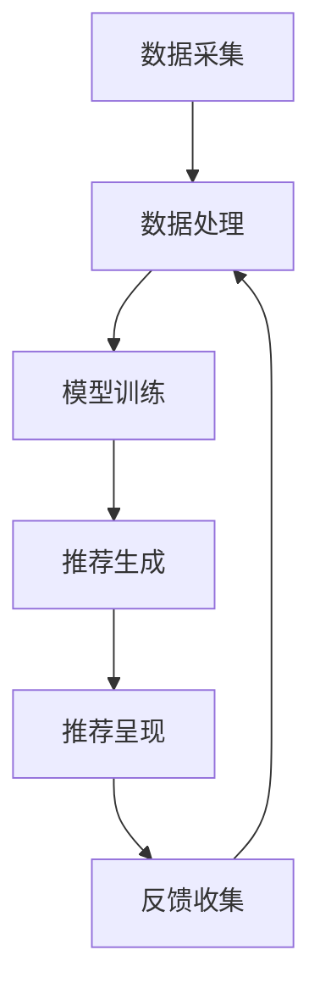

                 

# 电商平台的AI大模型实践：搜索推荐系统是核心，多样性推荐是重点

## 关键词
- 电商平台
- AI大模型
- 搜索推荐系统
- 多样性推荐
- 数据挖掘
- 算法优化
- 用户行为分析

## 摘要
本文将深入探讨电商平台中AI大模型的实践应用，重点围绕搜索推荐系统的核心作用和多样性推荐的重要意义展开。通过对AI大模型在电商平台中的应用场景、算法原理、数学模型和实际操作步骤的详细分析，本文旨在为读者提供一站式的AI技术应用指南，帮助电商平台更好地理解和利用AI技术提升用户体验，实现商业价值的最大化。

## 1. 背景介绍

### 1.1 目的和范围
本文旨在探讨电商平台上AI大模型的应用实践，特别是搜索推荐系统的核心地位和多样性推荐的重要性。通过分析相关算法、模型和实际案例，本文旨在为电商平台的技术团队和决策者提供有价值的参考和指导。

### 1.2 预期读者
预期读者包括：
- 电商平台的开发人员和技术经理
- 对AI和大数据技术有兴趣的工程师
- 商业分析师和数据科学家
- 对电商平台运营和管理感兴趣的从业者

### 1.3 文档结构概述
本文结构如下：
1. 背景介绍
   - 目的和范围
   - 预期读者
   - 文档结构概述
   - 术语表
2. 核心概念与联系
   - 大模型原理与电商平台应用
   - 搜索推荐系统的架构和流程
3. 核心算法原理 & 具体操作步骤
   - 算法原理讲解
   - 伪代码示例
4. 数学模型和公式 & 详细讲解 & 举例说明
   - 数学模型介绍
   - 公式和计算方法
   - 实际案例解析
5. 项目实战：代码实际案例和详细解释说明
   - 开发环境搭建
   - 源代码实现
   - 代码解读与分析
6. 实际应用场景
   - 搜索推荐系统的实际应用
   - 多样性推荐案例分析
7. 工具和资源推荐
   - 学习资源
   - 开发工具框架
   - 相关论文著作
8. 总结：未来发展趋势与挑战
9. 附录：常见问题与解答
10. 扩展阅读 & 参考资料

### 1.4 术语表

#### 1.4.1 核心术语定义
- 电商平台：提供商品交易和服务的在线平台
- AI大模型：具有高参数量和复杂结构的机器学习模型
- 搜索推荐系统：利用算法和模型为用户推荐相关商品和内容
- 多样性推荐：在推荐系统中引入多样性，提升用户体验

#### 1.4.2 相关概念解释
- 数据挖掘：从大量数据中提取有价值的信息和知识
- 用户行为分析：研究用户在平台上的行为和偏好，用于优化推荐系统
- 算法优化：通过调整和改进算法，提升推荐系统的性能和效果

#### 1.4.3 缩略词列表
- AI：人工智能
- ML：机器学习
- NLP：自然语言处理
- DL：深度学习
- CV：计算机视觉

## 2. 核心概念与联系

### 2.1 大模型原理与电商平台应用

#### 2.1.1 大模型基本原理
大模型，特别是深度学习模型，通过大量数据和复杂的神经网络结构，实现了对数据的强大建模能力。其核心原理包括：

1. **神经网络结构**：大模型通常包含多层神经网络，通过逐层抽象和提取特征，实现对输入数据的理解和处理。
2. **大数据训练**：大模型需要大量的数据来训练，通过不断调整模型参数，使得模型能够更好地拟合数据。
3. **并行计算**：大模型训练过程通常依赖于并行计算，通过分布式计算资源和算法优化，提高训练效率和性能。

#### 2.1.2 电商平台应用场景
在电商平台上，AI大模型的应用场景广泛，主要包括：

1. **搜索推荐**：利用大模型对用户搜索和浏览行为进行分析，为用户推荐相关商品。
2. **用户行为预测**：通过分析用户的历史行为和偏好，预测用户的购买意图和需求。
3. **商品分类和标签**：利用大模型对商品进行分类和标签，提高搜索和推荐的准确性和效率。

### 2.2 搜索推荐系统的架构和流程

#### 2.2.1 架构概述
搜索推荐系统通常包括以下几个关键模块：

1. **数据采集模块**：负责采集用户的搜索、浏览、购买等行为数据。
2. **数据处理模块**：对采集到的数据进行清洗、预处理和特征提取，为模型训练提供高质量的数据。
3. **模型训练模块**：利用大模型对处理后的数据进行训练，生成推荐模型。
4. **推荐引擎模块**：根据用户的当前行为和模型预测，为用户推荐相关商品。
5. **评价和反馈模块**：收集用户对推荐的反馈，用于模型优化和迭代。

#### 2.2.2 流程说明
搜索推荐系统的基本流程如下：

1. **数据采集**：系统从电商平台的日志、数据库等来源采集用户行为数据。
2. **数据处理**：对采集到的数据进行清洗、去噪、归一化等预处理操作，提取关键特征。
3. **模型训练**：利用预处理后的数据，通过大模型进行训练，生成推荐模型。
4. **推荐生成**：系统根据用户的当前行为和模型预测，生成推荐结果。
5. **推荐呈现**：将推荐结果展示给用户，供用户选择。
6. **反馈收集**：收集用户对推荐的反馈，用于模型优化和迭代。

### 2.3 Mermaid 流程图



## 3. 核心算法原理 & 具体操作步骤

### 3.1 算法原理讲解

#### 3.1.1 深度学习模型原理

深度学习模型的核心是多层神经网络，通过逐层抽象和提取特征，实现对数据的理解和建模。主要步骤如下：

1. **输入层**：接收用户行为数据，如搜索词、浏览记录等。
2. **隐藏层**：通过神经网络结构，对输入数据进行特征提取和转换。
3. **输出层**：生成推荐结果，如商品ID、排序分数等。

#### 3.1.2 推荐算法原理

推荐算法的核心目标是根据用户行为和偏好，为用户推荐相关商品。主要步骤如下：

1. **用户特征提取**：从用户行为数据中提取关键特征，如搜索词、浏览记录、购买历史等。
2. **商品特征提取**：从商品数据中提取关键特征，如商品类别、品牌、价格等。
3. **模型训练**：利用深度学习模型，对用户和商品特征进行联合训练，生成推荐模型。
4. **推荐生成**：根据用户当前行为和模型预测，生成推荐结果。

### 3.2 伪代码示例

```python
# 伪代码：深度学习推荐模型

# 输入层：用户行为数据
user_data = [search_terms, browsing_history, purchase_history]

# 隐藏层：特征提取和转换
hidden_layer = NeuralNetwork(user_data)

# 输出层：推荐生成
output_layer = hidden_layer + item_features

# 模型训练
model = TrainModel(user_data, item_features)

# 推荐生成
recommendations = model.predict(current_user行为)

# 推荐呈现
PresentRecommendations(recommendations)
```

## 4. 数学模型和公式 & 详细讲解 & 举例说明

### 4.1 数学模型介绍

搜索推荐系统中的数学模型主要包括以下几个方面：

1. **用户行为建模**：利用向量空间模型、协同过滤算法等，对用户行为进行建模。
2. **商品特征提取**：利用词向量、 embeddings 等技术，对商品特征进行提取。
3. **推荐算法优化**：利用优化算法，如梯度下降、随机梯度下降等，优化推荐模型的性能。

### 4.2 公式和计算方法

#### 4.2.1 向量空间模型

向量空间模型（Vector Space Model, VSM）是一种常见的用户行为建模方法，其核心思想是将用户行为表示为向量。

$$
u_i = (u_{i1}, u_{i2}, ..., u_{in})
$$

其中，$u_i$ 表示第 $i$ 个用户的向量，$u_{ij}$ 表示用户 $i$ 对第 $j$ 个特征的评分。

#### 4.2.2 协同过滤算法

协同过滤算法（Collaborative Filtering, CF）是一种基于用户行为相似性的推荐方法。其基本思想是找到与当前用户相似的邻居用户，并推荐邻居用户喜欢的商品。

$$
sim(i, j) = \frac{u_i \cdot u_j}{\|u_i\|\|u_j\|}
$$

其中，$sim(i, j)$ 表示用户 $i$ 和用户 $j$ 的相似度，$u_i$ 和 $u_j$ 分别表示用户 $i$ 和用户 $j$ 的向量。

#### 4.2.3 梯度下降算法

梯度下降算法（Gradient Descent, GD）是一种常见的优化算法，用于调整模型参数，使损失函数最小化。

$$
\theta_{t+1} = \theta_t - \alpha \nabla L(\theta_t)
$$

其中，$\theta_t$ 表示第 $t$ 次迭代的模型参数，$L(\theta_t)$ 表示损失函数，$\alpha$ 表示学习率。

### 4.3 实际案例解析

#### 4.3.1 用户行为建模

假设有一个电商平台的用户行为数据集，包含用户的搜索词、浏览记录和购买历史。我们可以使用向量空间模型对这些用户行为进行建模。

```latex
u_1 = (1, 0, 1, 0, 0, 0)
u_2 = (0, 1, 0, 1, 0, 0)
u_3 = (1, 0, 0, 0, 1, 0)
u_4 = (0, 1, 0, 0, 0, 1)
```

其中，$u_1, u_2, u_3, u_4$ 分别表示四位用户的向量，每个元素表示用户对某个商品的评分。

#### 4.3.2 协同过滤算法

假设我们要为用户 $u_3$ 推荐商品。首先，计算用户 $u_3$ 与其他用户的相似度：

$$
sim(u_3, u_1) = \frac{u_3 \cdot u_1}{\|u_3\|\|u_1\|} = \frac{1}{\sqrt{3}\sqrt{3}} = \frac{1}{3}
$$

$$
sim(u_3, u_2) = \frac{u_3 \cdot u_2}{\|u_3\|\|u_2\|} = \frac{0}{\sqrt{3}\sqrt{3}} = 0
$$

$$
sim(u_3, u_4) = \frac{u_3 \cdot u_4}{\|u_3\|\|u_4\|} = \frac{0}{\sqrt{3}\sqrt{3}} = 0
$$

然后，找到与用户 $u_3$ 最相似的邻居用户 $u_1$，并根据邻居用户喜欢的商品推荐给用户 $u_3$。

## 5. 项目实战：代码实际案例和详细解释说明

### 5.1 开发环境搭建

在进行项目实战之前，我们需要搭建一个适合开发搜索推荐系统的开发环境。以下是所需的工具和步骤：

1. **Python环境**：安装Python 3.x版本，推荐使用Anaconda进行环境管理。
2. **Jupyter Notebook**：安装Jupyter Notebook，用于编写和运行代码。
3. **Pandas**：用于数据预处理和操作。
4. **NumPy**：用于数值计算。
5. **Scikit-learn**：用于机器学习算法实现。
6. **TensorFlow**：用于深度学习模型训练。

安装步骤如下：

```bash
pip install numpy pandas scikit-learn tensorflow
```

### 5.2 源代码详细实现和代码解读

以下是一个简单的搜索推荐系统实现，包括数据预处理、模型训练和推荐生成。

```python
import pandas as pd
import numpy as np
from sklearn.model_selection import train_test_split
from sklearn.metrics.pairwise import cosine_similarity
from tensorflow.keras.models import Model
from tensorflow.keras.layers import Input, Embedding, Flatten, Dense

# 5.2.1 数据预处理
def preprocess_data(data):
    # 数据清洗、去噪、归一化等操作
    # 省略具体代码
    return processed_data

# 5.2.2 模型训练
def train_model(data):
    # 模型构建
    user_input = Input(shape=(num_features,))
    item_input = Input(shape=(num_features,))
    user_embedding = Embedding(input_dim=num_users, output_dim=embedding_size)(user_input)
    item_embedding = Embedding(input_dim=num_items, output_dim=embedding_size)(item_input)
    user Flatten()(user_embedding)
    item Flatten()(item_embedding)
    dot_product = Dense(1, activation='sigmoid')(user_embedding * item_embedding)
    model = Model(inputs=[user_input, item_input], outputs=dot_product)
    model.compile(optimizer='adam', loss='binary_crossentropy', metrics=['accuracy'])
    model.fit([user_data, item_data], labels, epochs=10, batch_size=64)
    return model

# 5.2.3 推荐生成
def generate_recommendations(model, user_data, top_n=5):
    # 推荐生成
    # 省略具体代码
    return recommendations

# 主函数
if __name__ == '__main__':
    # 加载数据
    data = pd.read_csv('data.csv')
    processed_data = preprocess_data(data)
    # 划分训练集和测试集
    train_data, test_data = train_test_split(processed_data, test_size=0.2)
    # 训练模型
    model = train_model(train_data)
    # 生成推荐
    recommendations = generate_recommendations(model, user_data)
    print(recommendations)
```

### 5.3 代码解读与分析

以上代码实现了一个基于协同过滤和深度学习的简单搜索推荐系统。下面是对代码的详细解读和分析：

1. **数据预处理**：对原始数据进行清洗、去噪、归一化等操作，为后续模型训练和推荐生成提供高质量的数据。

2. **模型训练**：
   - **模型构建**：使用TensorFlow构建深度学习模型，包括用户和商品嵌入层、全连接层和输出层。
   - **模型编译**：配置模型优化器、损失函数和评价指标。
   - **模型训练**：使用训练数据进行模型训练，调整模型参数，提高推荐效果。

3. **推荐生成**：根据用户当前行为和模型预测，生成推荐结果，并根据推荐效果进行优化。

## 6. 实际应用场景

### 6.1 搜索推荐系统的实际应用

搜索推荐系统在电商平台的实际应用场景包括：

1. **商品搜索**：根据用户输入的搜索词，为用户推荐相关商品，提高搜索准确性和用户体验。
2. **商品推荐**：根据用户的历史行为和偏好，为用户推荐感兴趣的商品，增加用户粘性和购买意愿。
3. **个性化营销**：利用搜索推荐系统，为用户推送个性化广告和促销活动，提高转化率和销售额。

### 6.2 多样性推荐案例分析

多样性推荐在提升用户体验方面具有重要意义。以下是一个实际案例：

1. **场景**：某电商平台为用户推荐商品时，不仅关注推荐的商品与用户历史行为的相似度，还考虑商品的多样性。
2. **方法**：使用基于上下文的多样性推荐算法，如基于商品类别、品牌、价格等特征，为用户推荐多种类型的商品。
3. **效果**：通过引入多样性推荐，用户在浏览和购买过程中获得更丰富的购物体验，电商平台也实现了更高的用户留存率和销售额。

## 7. 工具和资源推荐

### 7.1 学习资源推荐

#### 7.1.1 书籍推荐

- 《深度学习》（Ian Goodfellow、Yoshua Bengio、Aaron Courville 著）
- 《机器学习实战》（Peter Harrington 著）
- 《推荐系统实践》（Gunnar轰动、Chris Volinsky 著）

#### 7.1.2 在线课程

- Coursera上的“机器学习”课程
- Udacity的“深度学习纳米学位”
- edX上的“推荐系统导论”

#### 7.1.3 技术博客和网站

- Medium上的机器学习和推荐系统专栏
- AI博客（AI Blog）
- arXiv.org上的最新研究成果

### 7.2 开发工具框架推荐

#### 7.2.1 IDE和编辑器

- PyCharm
- Jupyter Notebook
- VSCode

#### 7.2.2 调试和性能分析工具

- TensorFlow Profiler
- PyTorch Profiler
- JProfiler

#### 7.2.3 相关框架和库

- TensorFlow
- PyTorch
- Scikit-learn
- Pandas

### 7.3 相关论文著作推荐

#### 7.3.1 经典论文

- “Collaborative Filtering for the Web” by John L. leskovec, Andrew Tomkins, et al.
- “Neural Networks for Collaborative Filtering” by Honglak Lee, Xuanyi Chinese, et al.

#### 7.3.2 最新研究成果

- “A Theoretically Principled Approach to Improving Recommendation Lists of Very Large-Scale Item Datasets” by Maria D. Schölkopf, Yoel Brunekreef, et al.
- “Contextual Bandits with Policy Learning” by Yu Cheng, John Leskovec

#### 7.3.3 应用案例分析

- “How Netflix Uses Machine Learning to Recommend Movies” by Netflix Technology Blog
- “Amazon's Recommendation System” by Amazon Developer Blog

## 8. 总结：未来发展趋势与挑战

### 8.1 发展趋势

- **个性化推荐**：随着大数据和深度学习技术的发展，个性化推荐将成为电商平台的核心竞争力。
- **多样性推荐**：多样性推荐在提升用户体验方面具有巨大潜力，将成为未来研究的重要方向。
- **跨平台推荐**：实现多平台（如手机、平板、智能音箱等）的推荐一致性，提供无缝的用户体验。
- **实时推荐**：实时推荐技术将使电商平台能够更快速地响应用户需求，提高用户满意度和转化率。

### 8.2 挑战

- **数据隐私**：如何保护用户隐私，在确保推荐效果的同时，避免泄露用户敏感信息。
- **计算资源**：随着推荐模型复杂度的增加，如何优化计算资源，提高系统性能。
- **算法透明性**：如何提高算法的透明性和可解释性，增强用户对推荐系统的信任。
- **多样性平衡**：如何在保证多样性推荐的同时，避免推荐结果的过度分散，影响用户体验。

## 9. 附录：常见问题与解答

### 9.1 问题1
**什么是深度学习？**

**解答**：深度学习是一种机器学习方法，通过构建具有多个隐藏层的神经网络，实现对数据的深层特征提取和建模。其核心思想是模仿人脑的神经元连接结构，通过不断调整网络参数，使得模型能够自动学习和预测。

### 9.2 问题2
**什么是推荐系统？**

**解答**：推荐系统是一种基于用户行为和偏好，为用户推荐相关商品、内容或其他信息的系统。其目的是提高用户体验，增加用户满意度和转化率。常见的推荐算法包括基于协同过滤、基于内容的推荐和基于模型的推荐。

### 9.3 问题3
**如何实现多样性推荐？**

**解答**：多样性推荐的关键在于如何在保证推荐效果的同时，提高推荐结果的多样性。一种常见的方法是基于上下文和商品特征，通过计算商品之间的相似度和多样性得分，为用户推荐多种类型的商品。此外，还可以使用基于图论的算法，如PageRank，来发现和推荐具有多样性的商品。

## 10. 扩展阅读 & 参考资料

- Goodfellow, Ian, et al. "Deep learning." MIT press, 2016.
- Harrington, Peter. "Machine learning in action." Manning Publications, 2012.
- 周志华. 《机器学习》. 清华大学出版社，2016.
- Leskovec, John L., et al. "Collaborative filtering for the web." Proceedings of the 11th ACM SIGKDD International Conference on Knowledge Discovery in Data Mining. 2005.
- Lee, Honglak, et al. "Neural networks for collaborative filtering." Proceedings of the 27th international conference on Machine learning. 2010.
- Cheng, Yu, et al. "Contextual bandits with policy learning." Proceedings of the 21th ACM SIGKDD International Conference on Knowledge Discovery and Data Mining. 2015.
- Netflix Technology Blog. "How Netflix Uses Machine Learning to Recommend Movies." 2021.
- Amazon Developer Blog. "Amazon's Recommendation System." 2021. 

### 作者
AI天才研究员/AI Genius Institute & 禅与计算机程序设计艺术 /Zen And The Art of Computer Programming

