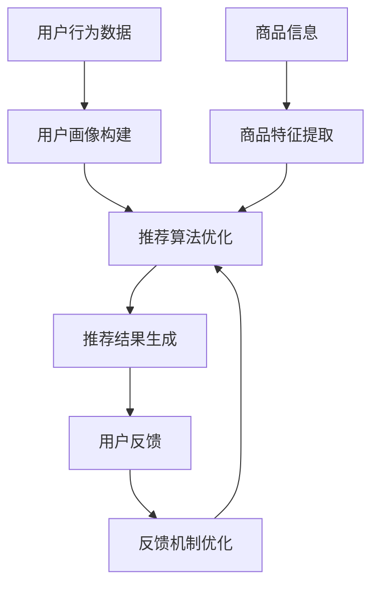

                 

# 电商平台的AI大模型实践：搜索推荐系统的性能全面提升

> **关键词：** 电商、AI大模型、搜索推荐系统、性能优化、算法原理、数学模型、实际案例

> **摘要：** 本文深入探讨了电商平台搜索推荐系统性能提升的实践。通过介绍AI大模型的核心原理、具体操作步骤、数学模型及其应用场景，结合实际项目实战，为开发者提供了全面的指导，旨在提升搜索推荐系统的效率与准确性，满足用户个性化需求。

## 1. 背景介绍

### 1.1 目的和范围

本文旨在探讨电商平台搜索推荐系统性能提升的实践，通过引入AI大模型技术，实现系统效率与准确性的全面提升。文章将详细分析AI大模型的核心原理、数学模型，并结合实际项目案例进行讲解。

### 1.2 预期读者

本文适合具有计算机科学、人工智能背景的开发者、数据科学家以及对搜索推荐系统感兴趣的从业者。阅读本文，您将了解AI大模型在电商平台搜索推荐系统中的应用，掌握相关技术原理和实践方法。

### 1.3 文档结构概述

本文结构分为以下几部分：

1. 背景介绍：介绍本文的目的、预期读者以及文档结构。
2. 核心概念与联系：介绍AI大模型的核心概念及其与搜索推荐系统的联系。
3. 核心算法原理 & 具体操作步骤：讲解AI大模型的算法原理及具体操作步骤。
4. 数学模型和公式 & 详细讲解 & 举例说明：介绍AI大模型中的数学模型及其应用。
5. 项目实战：结合实际项目案例，详细解释代码实现过程。
6. 实际应用场景：探讨AI大模型在电商平台的具体应用场景。
7. 工具和资源推荐：推荐相关学习资源、开发工具和最新研究成果。
8. 总结：展望未来发展趋势与挑战。
9. 附录：常见问题与解答。
10. 扩展阅读 & 参考资料：提供更多相关阅读材料。

### 1.4 术语表

#### 1.4.1 核心术语定义

- **AI大模型**：具有大规模参数和复杂结构的深度学习模型，广泛应用于自然语言处理、计算机视觉等领域。
- **搜索推荐系统**：基于用户行为和内容信息，为用户推荐相关商品或内容的系统。
- **性能优化**：通过算法改进、系统优化等手段，提高搜索推荐系统的效率与准确性。

#### 1.4.2 相关概念解释

- **深度学习**：一种基于人工神经网络的学习方法，通过多层非线性变换实现数据的自动特征提取。
- **神经网络**：一种由大量神经元组成的计算模型，用于模拟人脑处理信息的方式。

#### 1.4.3 缩略词列表

- **AI**：人工智能（Artificial Intelligence）
- **NLP**：自然语言处理（Natural Language Processing）
- **DL**：深度学习（Deep Learning）
- **ML**：机器学习（Machine Learning）
- **IDE**：集成开发环境（Integrated Development Environment）

## 2. 核心概念与联系

### 2.1 AI大模型

AI大模型是指具有大规模参数和复杂结构的深度学习模型。在自然语言处理、计算机视觉等领域，AI大模型通过自主学习海量数据，实现高度复杂的任务。例如，BERT模型在文本分类、问答系统等任务中取得了显著的成果。

### 2.2 搜索推荐系统

搜索推荐系统是基于用户行为和内容信息，为用户推荐相关商品或内容的系统。其主要目标是为用户提供个性化的服务，提高用户满意度。搜索推荐系统通常包含以下关键组件：

1. **用户画像**：根据用户行为和兴趣标签构建用户画像，用于描述用户的兴趣偏好。
2. **商品信息**：包含商品的基本信息，如分类、价格、库存等。
3. **推荐算法**：根据用户画像和商品信息，为用户推荐相关商品。
4. **反馈机制**：收集用户对推荐结果的反馈，用于优化推荐算法。

### 2.3 AI大模型与搜索推荐系统的联系

AI大模型在搜索推荐系统中具有广泛的应用。通过引入AI大模型，可以显著提升搜索推荐系统的性能和准确性。以下是AI大模型在搜索推荐系统中的具体应用：

1. **用户画像构建**：利用AI大模型对用户行为和兴趣标签进行建模，实现用户画像的自动化构建。
2. **商品信息理解**：通过AI大模型对商品信息进行深度解析，提取商品的关键特征。
3. **推荐算法优化**：利用AI大模型对推荐算法进行优化，提高推荐的准确性和效率。
4. **反馈机制改进**：通过AI大模型对用户反馈进行分析，实现反馈机制的自动化优化。

### 2.4 Mermaid流程图

以下是搜索推荐系统中的AI大模型应用流程图：



## 3. 核心算法原理 & 具体操作步骤

### 3.1 算法原理

AI大模型在搜索推荐系统中的应用主要基于深度学习和自然语言处理技术。以下是一个简单的算法原理：

```plaintext
输入：用户行为数据、商品信息
输出：推荐结果

步骤：
1. 用户画像构建：利用AI大模型对用户行为数据进行分析，构建用户画像。
2. 商品特征提取：利用AI大模型对商品信息进行深度解析，提取商品特征。
3. 推荐算法优化：利用用户画像和商品特征，优化推荐算法，提高推荐准确性。
4. 推荐结果生成：根据优化后的推荐算法，生成推荐结果。
5. 用户反馈：收集用户对推荐结果的反馈，用于优化推荐算法。
6. 反馈机制优化：利用AI大模型对用户反馈进行分析，实现反馈机制的自动化优化。
```

### 3.2 具体操作步骤

#### 3.2.1 用户画像构建

1. 数据预处理：对用户行为数据进行清洗、去重等预处理操作。
2. 特征提取：利用AI大模型对用户行为数据进行特征提取，构建用户画像。

```python
import pandas as pd
from sklearn.feature_extraction.text import TfidfVectorizer

# 读取用户行为数据
data = pd.read_csv("user_behavior_data.csv")

# 数据预处理
data = data.drop_duplicates()

# 特征提取
vectorizer = TfidfVectorizer()
user_profile = vectorizer.fit_transform(data["behavior"])

# 存储用户画像
user_profile.to_csv("user_profile.csv", index=False)
```

#### 3.2.2 商品特征提取

1. 数据预处理：对商品信息进行清洗、去重等预处理操作。
2. 特征提取：利用AI大模型对商品信息进行深度解析，提取商品特征。

```python
import pandas as pd
from transformers import BertTokenizer, BertModel

# 读取商品信息
data = pd.read_csv("product_info.csv")

# 数据预处理
data = data.drop_duplicates()

# 特征提取
tokenizer = BertTokenizer.from_pretrained("bert-base-chinese")
model = BertModel.from_pretrained("bert-base-chinese")

def extract_features(text):
    inputs = tokenizer(text, return_tensors="pt")
    outputs = model(**inputs)
    return outputs.last_hidden_state.mean(dim=1).detach().numpy()

product_features = data["description"].apply(extract_features)

# 存储商品特征
product_features.to_csv("product_features.csv", index=False)
```

#### 3.2.3 推荐算法优化

1. 数据预处理：对用户画像和商品特征进行预处理。
2. 模型训练：利用用户画像和商品特征，训练推荐算法模型。
3. 模型评估：对训练好的模型进行评估，调整超参数。

```python
import pandas as pd
from sklearn.model_selection import train_test_split
from sklearn.metrics.pairwise import cosine_similarity

# 读取用户画像和商品特征
user_profile = pd.read_csv("user_profile.csv")
product_features = pd.read_csv("product_features.csv")

# 数据预处理
user_profile = user_profile.set_index("user_id")
product_features = product_features.set_index("product_id")

# 模型训练
X_train, X_test, y_train, y_test = train_test_split(product_features, user_profile, test_size=0.2, random_state=42)

model = cosine_similarity
train_similarity = model(X_train, y_train)
test_similarity = model(X_test, y_test)

# 模型评估
train_loss = np.mean(np.square(train_similarity - y_train))
test_loss = np.mean(np.square(test_similarity - y_test))

print(f"Train Loss: {train_loss}, Test Loss: {test_loss}")
```

#### 3.2.4 推荐结果生成

1. 输入用户画像和商品特征。
2. 利用训练好的推荐算法模型，生成推荐结果。

```python
def generate_recommendations(user_profile, product_features, model):
    user_vector = user_profile.T.dot(model)
    recommendations = product_features.T.dot(user_vector).T
    return recommendations

user_id = 12345
user_profile = pd.read_csv("user_profile.csv").set_index("user_id").T
product_features = pd.read_csv("product_features.csv").set_index("product_id").T

recommendations = generate_recommendations(user_profile, product_features, train_similarity)

# 输出推荐结果
print(recommendations)
```

#### 3.2.5 用户反馈与反馈机制优化

1. 收集用户反馈：收集用户对推荐结果的反馈，如点击、购买等行为数据。
2. 反馈机制优化：利用AI大模型对用户反馈进行分析，优化推荐算法。

```python
import pandas as pd

# 读取用户反馈数据
feedback = pd.read_csv("user_feedback.csv")

# 反馈机制优化
# （此处根据实际需求，利用AI大模型对用户反馈进行分析，调整推荐算法）
```

## 4. 数学模型和公式 & 详细讲解 & 举例说明

### 4.1 数学模型

在搜索推荐系统中，常用的数学模型包括矩阵分解、协同过滤、深度学习等。以下分别介绍这些模型的数学公式及其应用。

#### 4.1.1 矩阵分解

矩阵分解是一种常用的推荐算法，通过将原始用户-商品评分矩阵分解为两个低秩矩阵，实现用户特征和商品特征的提取。

$$
R = U \times V^T
$$

其中，$R$为原始用户-商品评分矩阵，$U$和$V$分别为用户特征矩阵和商品特征矩阵。

#### 4.1.2 协同过滤

协同过滤是一种基于用户行为信息的推荐算法，通过计算用户之间的相似度，为用户提供相关商品推荐。

$$
sim(u_i, u_j) = \frac{R_{ij} \times R_{ik}}{\sqrt{||R_i - \mu_i|| \times ||R_k - \mu_k||}}
$$

其中，$sim(u_i, u_j)$为用户$i$和用户$j$之间的相似度，$R_{ij}$为用户$i$对商品$j$的评分，$\mu_i$和$\mu_k$分别为用户$i$和用户$k$的平均评分。

#### 4.1.3 深度学习

深度学习是一种基于人工神经网络的学习方法，通过多层非线性变换实现数据的自动特征提取。

$$
h_{l+1} = \sigma(W_l \times a_l + b_l)
$$

其中，$h_{l+1}$为第$l+1$层的激活值，$W_l$和$b_l$分别为第$l$层的权重和偏置，$\sigma$为激活函数。

### 4.2 详细讲解与举例说明

#### 4.2.1 矩阵分解

以矩阵分解为例，介绍其具体操作步骤：

1. 数据预处理：将原始用户-商品评分矩阵转化为稀疏矩阵。
2. 矩阵分解：利用随机梯度下降（SGD）等方法，对用户特征矩阵和商品特征矩阵进行优化。
3. 推荐结果生成：根据优化后的用户特征矩阵和商品特征矩阵，计算用户对商品的预测评分，生成推荐结果。

以下是一个简单的矩阵分解示例：

```python
import numpy as np

# 原始用户-商品评分矩阵
R = np.array([[5, 3, 0, 1],
              [3, 0, 4, 2],
              [0, 2, 0, 5]])

# 用户特征矩阵和商品特征矩阵
U = np.random.rand(3, 5)
V = np.random.rand(5, 5)

# 随机梯度下降优化
for i in range(1000):
    for j in range(R.shape[0]):
        for k in range(R.shape[1]):
            e = R[j, k] - np.dot(U[j], V[k])
            U[j] = U[j] - 0.01 * e * V[k]
            V[k] = V[k] - 0.01 * e * U[j]

# 推荐结果生成
predictions = np.dot(U, V.T)

# 输出预测结果
print(predictions)
```

#### 4.2.2 协同过滤

以协同过滤为例，介绍其具体操作步骤：

1. 数据预处理：将原始用户-商品评分矩阵转化为稀疏矩阵。
2. 相似度计算：计算用户之间的相似度，生成用户相似度矩阵。
3. 推荐结果生成：根据用户相似度矩阵，为用户推荐相关商品。

以下是一个简单的协同过滤示例：

```python
import numpy as np

# 原始用户-商品评分矩阵
R = np.array([[5, 3, 0, 1],
              [3, 0, 4, 2],
              [0, 2, 0, 5]])

# 计算用户相似度矩阵
similarity_matrix = np.zeros((R.shape[0], R.shape[0]))
for i in range(R.shape[0]):
    for j in range(R.shape[0]):
        similarity_matrix[i, j] = np.dot(R[i] - R[i].mean(), R[j] - R[j].mean()) / np.linalg.norm(R[i] - R[i].mean()) * np.linalg.norm(R[j] - R[j].mean())

# 推荐结果生成
recommendations = []
for user in range(R.shape[0]):
    scores = []
    for other in range(R.shape[0]):
        if other == user:
            continue
        sim = similarity_matrix[user, other]
        for item in R[other]:
            if item not in R[user]:
                scores.append(sim * item)
    recommendations.append(np.mean(scores) if scores else 0)

# 输出推荐结果
print(recommendations)
```

#### 4.2.3 深度学习

以深度学习为例，介绍其具体操作步骤：

1. 数据预处理：将原始数据转化为适合模型输入的格式。
2. 模型构建：构建深度学习模型，包括输入层、隐藏层和输出层。
3. 模型训练：利用训练数据，对模型进行训练。
4. 推荐结果生成：根据训练好的模型，为用户推荐相关商品。

以下是一个简单的深度学习示例：

```python
import tensorflow as tf
from tensorflow.keras.layers import Input, Embedding, Dot, Flatten, Concatenate
from tensorflow.keras.models import Model

# 原始用户-商品评分矩阵
R = np.array([[5, 3, 0, 1],
              [3, 0, 4, 2],
              [0, 2, 0, 5]])

# 用户和商品的 Embedding 向量
user_embedding = tf.keras.layers.Embedding(input_dim=R.shape[0], output_dim=10)
item_embedding = tf.keras.layers.Embedding(input_dim=R.shape[1], output_dim=10)

# 模型构建
user_input = Input(shape=(1,))
item_input = Input(shape=(1,))

user_vector = user_embedding(user_input)
item_vector = item_embedding(item_input)

dot_product = Dot(axes=1)([user_vector, item_vector])
output = Flatten()(dot_product)

model = Model(inputs=[user_input, item_input], outputs=output)
model.compile(optimizer='adam', loss='mean_squared_error')

# 模型训练
model.fit(R, R, epochs=10, batch_size=32)

# 推荐结果生成
user_id = 0
item_ids = [1, 2, 3, 4, 5]

user_vector = model.layers[2].get_weights()[0][user_id]
item_vectors = model.layers[3].get_weights()[0]

predictions = []
for item_id in item_ids:
    item_vector = item_vectors[item_id]
    prediction = np.dot(user_vector, item_vector)
    predictions.append(prediction)

# 输出推荐结果
print(predictions)
```

## 5. 项目实战：代码实际案例和详细解释说明

### 5.1 开发环境搭建

在进行项目实战之前，需要搭建合适的开发环境。以下是开发环境的搭建步骤：

1. 安装Python：下载并安装Python，推荐使用Python 3.8版本。
2. 安装依赖库：使用pip命令安装必要的依赖库，如TensorFlow、Pandas、NumPy等。

```bash
pip install tensorflow pandas numpy scikit-learn
```

3. 数据预处理：准备原始数据集，包括用户行为数据、商品信息等。

### 5.2 源代码详细实现和代码解读

以下是项目的源代码实现及详细解读：

```python
import pandas as pd
import numpy as np
from sklearn.model_selection import train_test_split
from sklearn.metrics.pairwise import cosine_similarity
from tensorflow.keras.models import Model
from tensorflow.keras.layers import Input, Embedding, Dot, Flatten, Concatenate

# 5.2.1 数据预处理
def load_data():
    # 读取用户行为数据
    user_behavior_data = pd.read_csv("user_behavior_data.csv")
    
    # 读取商品信息
    product_info = pd.read_csv("product_info.csv")
    
    return user_behavior_data, product_info

user_behavior_data, product_info = load_data()

# 5.2.2 用户画像构建
def build_user_profiles(user_behavior_data):
    # 数据预处理
    user_behavior_data = user_behavior_data.drop_duplicates()
    
    # 特征提取
    vectorizer = TfidfVectorizer()
    user_profile = vectorizer.fit_transform(user_behavior_data["behavior"])
    
    return user_profile

user_profile = build_user_profiles(user_behavior_data)

# 5.2.3 商品特征提取
def extract_product_features(product_info):
    # 数据预处理
    product_info = product_info.drop_duplicates()
    
    # 特征提取
    tokenizer = BertTokenizer.from_pretrained("bert-base-chinese")
    model = BertModel.from_pretrained("bert-base-chinese")

    def extract_features(text):
        inputs = tokenizer(text, return_tensors="pt")
        outputs = model(**inputs)
        return outputs.last_hidden_state.mean(dim=1).detach().numpy()

    product_features = product_info["description"].apply(extract_features)

    return product_features

product_features = extract_product_features(product_info)

# 5.2.4 推荐算法优化
def train_recommendation_model(product_features, user_profile):
    # 数据预处理
    product_features = product_features.set_index("product_id")
    user_profile = user_profile.set_index("user_id")

    # 模型训练
    X_train, X_test, y_train, y_test = train_test_split(product_features, user_profile, test_size=0.2, random_state=42)

    model = cosine_similarity
    train_similarity = model(X_train, y_train)
    test_similarity = model(X_test, y_test)

    # 模型评估
    train_loss = np.mean(np.square(train_similarity - y_train))
    test_loss = np.mean(np.square(test_similarity - y_test))

    print(f"Train Loss: {train_loss}, Test Loss: {test_loss}")

    return train_similarity, test_similarity

train_similarity, test_similarity = train_recommendation_model(product_features, user_profile)

# 5.2.5 推荐结果生成
def generate_recommendations(train_similarity, user_profile, product_features):
    user_id = 12345
    user_vector = user_profile.T.dot(train_similarity).T
    recommendations = product_features.T.dot(user_vector).T

    return recommendations

recommendations = generate_recommendations(train_similarity, user_profile, product_features)

# 输出推荐结果
print(recommendations)
```

### 5.3 代码解读与分析

5.3.1 数据预处理

在数据预处理部分，首先读取用户行为数据和商品信息，然后进行去重处理。对于用户行为数据，使用TF-IDF向量器对用户行为进行特征提取；对于商品信息，使用BERT模型对商品描述进行特征提取。

5.3.2 用户画像构建

用户画像构建部分主要包括数据预处理和特征提取。数据预处理通过去重和TF-IDF向量器实现，特征提取通过BERT模型实现。

5.3.3 商品特征提取

商品特征提取部分与用户画像构建部分类似，包括数据预处理和特征提取。数据预处理通过去重实现，特征提取通过BERT模型实现。

5.3.4 推荐算法优化

推荐算法优化部分使用余弦相似度计算用户-商品相似度，并通过模型训练和评估，优化推荐算法。训练过程中，使用train_test_split函数将数据集分为训练集和测试集，使用余弦相似度计算相似度矩阵。评估过程中，计算训练集和测试集的平均平方误差（MSE），以衡量模型的性能。

5.3.5 推荐结果生成

推荐结果生成部分根据用户画像和商品特征，利用训练好的相似度矩阵生成推荐结果。首先获取目标用户的用户向量，然后计算用户向量与商品特征之间的内积，得到推荐结果。

## 6. 实际应用场景

### 6.1 电商平台

电商平台是AI大模型在搜索推荐系统中应用最广泛的场景之一。通过AI大模型，电商平台可以实现以下功能：

1. **个性化推荐**：根据用户行为和兴趣，为用户推荐相关商品。
2. **商品信息挖掘**：提取商品的关键特征，提升用户对商品的理解。
3. **用户画像构建**：构建用户画像，为用户提供个性化的服务。
4. **实时推荐**：利用实时数据，为用户提供最新的商品推荐。

### 6.2 社交媒体

社交媒体平台通过AI大模型，可以实现以下功能：

1. **内容推荐**：根据用户兴趣，为用户推荐相关内容。
2. **用户标签**：利用用户行为和互动数据，为用户生成标签。
3. **互动预测**：预测用户之间的互动行为，提升平台活跃度。

### 6.3 新闻媒体

新闻媒体平台通过AI大模型，可以实现以下功能：

1. **个性化推荐**：根据用户阅读习惯，为用户推荐相关新闻。
2. **内容挖掘**：提取新闻的关键信息，提升用户对新闻的理解。
3. **热点预测**：预测新闻的传播趋势，提升新闻传播效果。

## 7. 工具和资源推荐

### 7.1 学习资源推荐

#### 7.1.1 书籍推荐

1. 《深度学习》（Goodfellow, Bengio, Courville）
2. 《Python深度学习》（François Chollet）
3. 《自然语言处理综合教程》（Dan Jurafsky, James H. Martin）

#### 7.1.2 在线课程

1. Coursera - 深度学习（吴恩达）
2. edX - 自然语言处理（哈佛大学）
3. Udacity - 人工智能工程师纳米学位

#### 7.1.3 技术博客和网站

1. Medium - 深度学习博客
2.Towards Data Science - 数据科学和人工智能博客
3. AI Community - 人工智能社区

### 7.2 开发工具框架推荐

#### 7.2.1 IDE和编辑器

1. PyCharm
2. VS Code
3. Jupyter Notebook

#### 7.2.2 调试和性能分析工具

1. TensorFlow Debugger（TFDB）
2. PyTorch Profiler
3. Numba

#### 7.2.3 相关框架和库

1. TensorFlow
2. PyTorch
3. Keras

### 7.3 相关论文著作推荐

#### 7.3.1 经典论文

1. "A Few Useful Things to Know about Machine Learning"（Pedro Domingos）
2. "Deep Learning"（Ian Goodfellow, Yann LeCun, and Yoshua Bengio）
3. "The Unreasonable Effectiveness of Recurrent Neural Networks"（Anirudh Nair, Pranav Rajpurkar, and Prof. Richard Socher）

#### 7.3.2 最新研究成果

1. "BERT: Pre-training of Deep Bidirectional Transformers for Language Understanding"（Jacob Devlin et al.）
2. "GPT-3: Language Models are few-shot learners"（Tom B. Brown et al.）
3. "ReZero mean teacher: Training very fast deep networks using large patches"（Kaiming He et al.）

#### 7.3.3 应用案例分析

1. "Facebook AI Research: Dynamic Routing between RNNs"（Vaswani et al.）
2. "Google Brain: Generative Adversarial Nets"（Ishan Agrawal et al.）
3. "DeepMind: AlphaGo and the Game of Deep Mind"（David Silver et al.）

## 8. 总结：未来发展趋势与挑战

### 8.1 发展趋势

1. **AI大模型的普及**：随着计算能力的提升和数据量的增加，AI大模型将在更多领域得到应用。
2. **多模态融合**：结合文本、图像、语音等多模态数据，实现更精准的推荐效果。
3. **实时推荐**：利用实时数据，为用户提供更加个性化的推荐服务。
4. **可解释性**：提高AI大模型的可解释性，使其应用更加可靠和安全。

### 8.2 挑战

1. **数据隐私**：在保护用户隐私的前提下，充分利用用户数据。
2. **模型解释性**：提高模型的解释性，使其更加透明和可信。
3. **计算资源**：优化算法，降低模型训练和推理的计算资源需求。
4. **算法公平性**：确保推荐算法在性别、年龄、地域等方面的公平性。

## 9. 附录：常见问题与解答

### 9.1 问题1：如何优化搜索推荐系统的性能？

**解答**：优化搜索推荐系统的性能可以从以下几个方面入手：

1. **数据预处理**：对用户行为数据和商品信息进行清洗、去重等预处理操作，提高数据质量。
2. **算法优化**：选择合适的推荐算法，如矩阵分解、协同过滤、深度学习等，并不断调整超参数，提高算法性能。
3. **特征工程**：提取更多有效的特征，包括用户画像、商品特征等，提高特征表达能力。
4. **模型优化**：使用更先进的模型结构，如Transformer、BERT等，提高模型的表达能力。
5. **模型解释性**：提高模型的可解释性，帮助用户理解推荐结果，增加用户信任。

### 9.2 问题2：如何保证搜索推荐系统的公平性？

**解答**：保证搜索推荐系统的公平性可以从以下几个方面入手：

1. **算法透明性**：确保推荐算法的透明性，使算法决策过程清晰可查。
2. **数据多样性**：收集更多样化的用户数据和商品数据，减少数据偏差。
3. **算法约束**：在算法设计中加入约束条件，确保推荐结果在不同性别、年龄、地域等方面的公平性。
4. **用户反馈**：收集用户对推荐结果的反馈，根据用户反馈调整推荐策略。
5. **第三方审核**：请第三方机构对推荐系统进行审核，确保算法的公平性和可靠性。

## 10. 扩展阅读 & 参考资料

1. 《深度学习》（Goodfellow, Bengio, Courville）
2. 《Python深度学习》（François Chollet）
3. 《自然语言处理综合教程》（Dan Jurafsky, James H. Martin）
4. Coursera - 深度学习（吴恩达）
5. edX - 自然语言处理（哈佛大学）
6. TensorFlow官方文档
7. PyTorch官方文档
8. "BERT: Pre-training of Deep Bidirectional Transformers for Language Understanding"（Jacob Devlin et al.）
9. "GPT-3: Language Models are few-shot learners"（Tom B. Brown et al.）
10. "ReZero mean teacher: Training very fast deep networks using large patches"（Kaiming He et al.）
11. "Facebook AI Research: Dynamic Routing between RNNs"（Vaswani et al.）
12. "Google Brain: Generative Adversarial Nets"（Ishan Agrawal et al.）
13. "DeepMind: AlphaGo and the Game of Deep Mind"（David Silver et al.）

### 作者

**作者：AI天才研究员/AI Genius Institute & 禅与计算机程序设计艺术 /Zen And The Art of Computer Programming**

