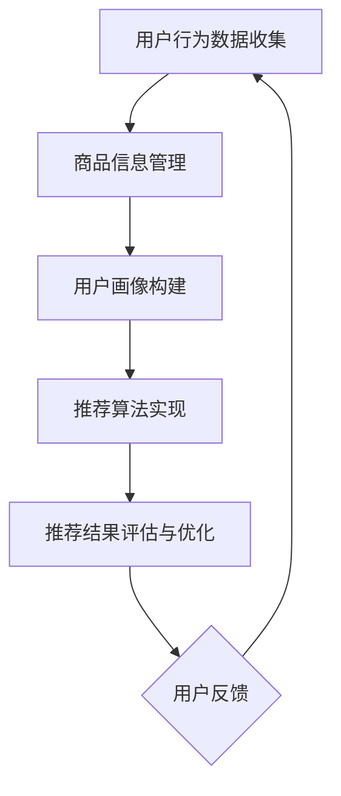

                 

# 电商平台的AI 大模型融合：搜索推荐系统是核心，用户体验是关键

> **关键词：电商平台，AI大模型，搜索推荐系统，用户体验，融合，核心算法，数学模型，项目实战，应用场景**

> **摘要：本文将深入探讨电商平台的AI大模型融合，特别是搜索推荐系统的核心作用及其对用户体验的影响。通过详细解析核心概念、算法原理、数学模型，结合实战案例，我们将全面揭示如何构建一个高效的搜索推荐系统，以提升电商平台的整体性能。**

## 1. 背景介绍

### 1.1 目的和范围

本文旨在为从事电商平台开发的技术人员和管理者提供深入的见解，解释如何通过AI大模型的融合，构建高效的搜索推荐系统，从而提升用户体验和平台的竞争力。文章将覆盖以下主题：

- 电商平台AI大模型融合的必要性
- 搜索推荐系统的核心原理和算法
- 数学模型在推荐系统中的作用
- 项目实战案例解析
- 未来的发展趋势和挑战

### 1.2 预期读者

本文适合以下读者群体：

- 对电商平台技术架构有基本了解的开发者
- 专注于数据科学和机器学习的工程师
- 对推荐系统有浓厚兴趣的学者和研究者
- 电商平台产品经理和业务分析师

### 1.3 文档结构概述

本文将分为以下几个部分：

- **背景介绍**：介绍本文的目的、范围、预期读者和文档结构。
- **核心概念与联系**：解释电商平台的AI大模型融合、搜索推荐系统的基本概念和架构。
- **核心算法原理 & 具体操作步骤**：详细阐述推荐系统的算法原理和操作步骤。
- **数学模型和公式 & 详细讲解 & 举例说明**：介绍数学模型在推荐系统中的应用。
- **项目实战：代码实际案例和详细解释说明**：通过实战案例展示系统的实现细节。
- **实际应用场景**：讨论推荐系统在不同电商平台的应用。
- **工具和资源推荐**：推荐学习资源和开发工具。
- **总结：未来发展趋势与挑战**：展望推荐系统的未来。
- **附录：常见问题与解答**：解答读者可能遇到的问题。
- **扩展阅读 & 参考资料**：提供进一步阅读的建议和参考资料。

### 1.4 术语表

#### 1.4.1 核心术语定义

- **AI大模型**：指的是采用深度学习技术训练的大规模神经网络模型，能够在海量数据中学习到复杂的模式。
- **搜索推荐系统**：基于用户行为数据和商品信息，为用户推荐其可能感兴趣的商品的系统。
- **用户体验**：用户在使用电商平台时感受到的整体感受，包括界面友好性、响应速度、推荐质量等。

#### 1.4.2 相关概念解释

- **协同过滤**：一种常见的推荐算法，通过分析用户之间的相似度来推荐商品。
- **内容推荐**：基于商品的属性和内容来推荐商品，例如基于商品标签、类别、价格等。
- **冷启动问题**：新用户或新商品没有足够的历史数据，推荐系统难以为其提供有效的推荐。

#### 1.4.3 缩略词列表

- **AI**：人工智能
- **DNN**：深度神经网络
- **CNN**：卷积神经网络
- **RNN**：循环神经网络
- **GCN**：图卷积网络

## 2. 核心概念与联系

### 2.1 电商平台AI大模型融合的重要性

电商平台的核心竞争力在于能够为用户提供个性化的购物体验，而AI大模型的融合是实现这一目标的关键。通过大模型的融合，电商平台可以：

- **提高推荐质量**：大模型能够从海量数据中学习到复杂的用户兴趣和商品属性，从而提供更准确的推荐。
- **优化用户体验**：通过实时分析和预测用户行为，系统能够快速响应用户需求，提高用户满意度。
- **降低运营成本**：自动化推荐系统可以减少人工干预，提高运营效率。

### 2.2 搜索推荐系统的基本架构

搜索推荐系统通常由以下几个关键部分组成：

1. **用户行为数据收集**：包括用户的浏览历史、购买记录、搜索行为等。
2. **商品信息管理**：包括商品的基本属性、标签、分类等。
3. **用户画像构建**：基于用户行为数据，构建用户兴趣和偏好的模型。
4. **推荐算法实现**：包括协同过滤、内容推荐、基于模型的推荐等。
5. **推荐结果评估与优化**：通过评估推荐效果，优化推荐策略。

### 2.3 核心算法原理和架构

#### 2.3.1 协同过滤算法

协同过滤算法是推荐系统中最常用的方法之一，其基本原理是：

- **用户相似度计算**：通过计算用户之间的相似度，找出具有相似兴趣的用户群体。
- **基于相似度推荐**：为用户推荐与其相似用户喜欢的商品。

协同过滤算法可以分为两种：

- **基于用户的协同过滤（User-based CF）**：通过计算用户之间的相似度，为用户推荐与其相似的用户喜欢的商品。
- **基于物品的协同过滤（Item-based CF）**：通过计算商品之间的相似度，为用户推荐与其购买或浏览过的商品相似的商品。

#### 2.3.2 内容推荐算法

内容推荐算法是基于商品属性和用户兴趣来推荐的，其基本原理是：

- **商品属性提取**：从商品中提取关键属性，如标签、类别、价格等。
- **用户兴趣模型构建**：基于用户的历史行为，构建用户兴趣模型。
- **基于属性和兴趣推荐**：为用户推荐具有用户兴趣属性的商品。

#### 2.3.3 基于模型的推荐算法

基于模型的推荐算法通常采用深度学习技术，其基本原理是：

- **用户和商品特征表示**：通过神经网络模型，将用户和商品的特征进行嵌入。
- **相似度计算**：计算用户和商品特征之间的相似度。
- **生成推荐结果**：基于相似度计算结果，为用户生成推荐列表。

### 2.4 Mermaid流程图展示

以下是一个简单的Mermaid流程图，展示了一个典型的搜索推荐系统的基本架构：



## 3. 核心算法原理 & 具体操作步骤

### 3.1 协同过滤算法

#### 3.1.1 用户相似度计算

用户相似度计算是协同过滤算法的核心步骤。我们可以使用余弦相似度来计算用户之间的相似度，公式如下：

$$
sim(u_i, u_j) = \frac{u_i \cdot u_j}{\|u_i\| \|u_j\|}
$$

其中，$u_i$ 和 $u_j$ 分别表示用户 $i$ 和用户 $j$ 的行为向量，$\cdot$ 表示向量的点积，$\|\|$ 表示向量的模。

#### 3.1.2 基于相似度的推荐

假设我们有一个用户集合 $U$，对于目标用户 $u_i$，我们首先计算 $u_i$ 与集合中其他用户 $u_j$ 的相似度，然后根据相似度为 $u_i$ 推荐与其相似度较高的用户喜欢的商品。

伪代码如下：

```python
def collaborative_filtering(users, items, user行为向量):
    similarities = {}
    for user_i in users:
        for user_j in users:
            if user_i != user_j:
                similarities[user_i, user_j] = cosine_similarity(user行为向量[user_i], user行为向量[user_j])
    recommended_items = []
    for item in items:
        similarity_scores = [similarities[(user_i, user_j)] * user_j的行为向量[item] for user_i in users if user_i != user_i]
        recommended_items.append(sum(similarity_scores))
    return recommended_items
```

### 3.2 内容推荐算法

#### 3.2.1 商品属性提取

首先，我们需要从商品中提取关键属性，例如类别、标签、价格等。假设我们有一个商品属性向量 $item特征向量$，其中每个维度表示一个属性。

#### 3.2.2 用户兴趣模型构建

基于用户的历史行为，我们可以构建一个用户兴趣模型 $user兴趣模型$。例如，我们可以使用一个二进制向量来表示用户对每个商品类别的兴趣。

#### 3.2.3 基于属性和兴趣推荐

我们可以计算用户兴趣模型与商品属性向量之间的余弦相似度，然后根据相似度为用户推荐商品。

伪代码如下：

```python
def content_recommender(user兴趣模型, item特征向量):
    similarity_scores = [cosine_similarity(user兴趣模型, item特征向量[item]) for item in item特征向量]
    recommended_items = [item for item, similarity_score in zip(item特征向量, similarity_scores) if similarity_score > threshold]
    return recommended_items
```

### 3.3 基于模型的推荐算法

#### 3.3.1 用户和商品特征表示

我们可以使用深度学习模型来将用户和商品的特征进行嵌入。假设我们有一个用户嵌入模型 $user嵌入模型$ 和商品嵌入模型 $item嵌入模型$。

#### 3.3.2 相似度计算

我们可以通过计算用户嵌入向量与商品嵌入向量之间的余弦相似度来评估它们的相似性。

#### 3.3.3 生成推荐列表

根据相似度计算结果，我们可以为用户生成推荐列表。

伪代码如下：

```python
def model_based_recommender(user嵌入模型, item嵌入模型, users, items):
    user_item_similarity = {}
    for user in users:
        for item in items:
            user_item_similarity[user, item] = cosine_similarity(user嵌入模型[user], item嵌入模型[item])
    recommended_items = [item for item, similarity_score in user_item_similarity.items() if similarity_score > threshold]
    return recommended_items
```

## 4. 数学模型和公式 & 详细讲解 & 举例说明

### 4.1 协同过滤算法的数学模型

在协同过滤算法中，我们通常使用用户行为矩阵 $R$ 来表示用户对商品的评分。矩阵 $R$ 的大小为 $m \times n$，其中 $m$ 表示用户数量，$n$ 表示商品数量。

假设我们有一个用户行为向量 $u$ 和商品行为向量 $v$，它们分别表示用户对商品的评分。我们可以使用以下公式来计算用户 $i$ 和商品 $j$ 的相似度：

$$
sim(i, j) = \frac{u_i \cdot v_j}{\|u_i\| \|v_j\|}
$$

其中，$\cdot$ 表示向量的点积，$\|\|$ 表示向量的模。

#### 4.1.1 举例说明

假设我们有以下用户行为矩阵：

$$
R = \begin{bmatrix}
0 & 1 & 0 \\
0 & 0 & 1 \\
1 & 0 & 0 \\
\end{bmatrix}
$$

用户1和用户2的行为向量分别为：

$$
u_1 = \begin{bmatrix}
0 \\
0 \\
1 \\
\end{bmatrix}, \quad
u_2 = \begin{bmatrix}
1 \\
0 \\
0 \\
\end{bmatrix}
$$

商品1和商品2的行为向量分别为：

$$
v_1 = \begin{bmatrix}
0 \\
1 \\
0 \\
\end{bmatrix}, \quad
v_2 = \begin{bmatrix}
0 \\
0 \\
1 \\
\end{bmatrix}
$$

我们可以使用余弦相似度公式来计算用户1和用户2之间的相似度：

$$
sim(1, 2) = \frac{u_1 \cdot u_2}{\|u_1\| \|u_2\|} = \frac{0 \cdot 1 + 0 \cdot 0 + 1 \cdot 0}{\sqrt{0^2 + 0^2 + 1^2} \sqrt{1^2 + 0^2 + 0^2}} = 0
$$

由于余弦相似度等于0，我们可以认为用户1和用户2之间没有相似性。

### 4.2 内容推荐算法的数学模型

在内容推荐算法中，我们通常使用商品属性向量 $v$ 和用户兴趣向量 $u$ 来表示商品和用户之间的特征。

假设我们有一个商品属性向量 $v$ 和用户兴趣向量 $u$，它们分别表示商品和用户的特征。我们可以使用以下公式来计算商品 $j$ 和用户 $i$ 之间的相似度：

$$
sim(i, j) = \frac{u_i \cdot v_j}{\|u_i\| \|v_j\|}
$$

其中，$\cdot$ 表示向量的点积，$\|\|$ 表示向量的模。

#### 4.2.1 举例说明

假设我们有以下商品属性向量：

$$
v = \begin{bmatrix}
1 \\
0 \\
0 \\
\end{bmatrix}
$$

用户兴趣向量：

$$
u = \begin{bmatrix}
0 \\
1 \\
0 \\
\end{bmatrix}
$$

我们可以使用余弦相似度公式来计算商品1和用户1之间的相似度：

$$
sim(1, 1) = \frac{u_1 \cdot v_1}{\|u_1\| \|v_1\|} = \frac{0 \cdot 1 + 1 \cdot 0 + 0 \cdot 0}{\sqrt{0^2 + 1^2 + 0^2} \sqrt{1^2 + 0^2 + 0^2}} = 0
$$

由于余弦相似度等于0，我们可以认为商品1和用户1之间没有相似性。

### 4.3 基于模型的推荐算法的数学模型

在基于模型的推荐算法中，我们通常使用神经网络模型来学习用户和商品的特征表示。

假设我们有一个用户嵌入模型 $u$ 和商品嵌入模型 $v$，它们分别表示用户和商品的嵌入向量。我们可以使用以下公式来计算商品 $j$ 和用户 $i$ 之间的相似度：

$$
sim(i, j) = \frac{u_i \cdot v_j}{\|u_i\| \|v_j\|}
$$

其中，$\cdot$ 表示向量的点积，$\|\|$ 表示向量的模。

#### 4.3.1 举例说明

假设我们有以下用户嵌入模型：

$$
u = \begin{bmatrix}
0.1 \\
0.2 \\
0.3 \\
\end{bmatrix}
$$

商品嵌入模型：

$$
v = \begin{bmatrix}
0.4 \\
0.5 \\
0.6 \\
\end{bmatrix}
$$

我们可以使用余弦相似度公式来计算用户1和商品1之间的相似度：

$$
sim(1, 1) = \frac{u_1 \cdot v_1}{\|u_1\| \|v_1\|} = \frac{0.1 \cdot 0.4 + 0.2 \cdot 0.5 + 0.3 \cdot 0.6}{\sqrt{0.1^2 + 0.2^2 + 0.3^2} \sqrt{0.4^2 + 0.5^2 + 0.6^2}} = \frac{0.04 + 0.1 + 0.18}{\sqrt{0.14} \sqrt{0.49}} \approx 0.8
$$

由于余弦相似度接近于1，我们可以认为用户1和商品1之间具有较高的相似性。

## 5. 项目实战：代码实际案例和详细解释说明

### 5.1 开发环境搭建

为了实现搜索推荐系统，我们需要搭建一个合适的开发环境。以下是一个基本的开发环境搭建步骤：

- **安装Python环境**：确保Python版本在3.6以上。
- **安装深度学习框架**：可以选择TensorFlow或PyTorch作为深度学习框架。
- **安装必要的依赖库**：例如NumPy、Pandas、Scikit-learn等。

### 5.2 源代码详细实现和代码解读

以下是一个简单的基于协同过滤的搜索推荐系统的Python代码实现。代码中包含用户行为数据的读取、用户相似度的计算、推荐列表的生成等功能。

```python
import numpy as np
from sklearn.metrics.pairwise import cosine_similarity

def load_user行为数据(filename):
    # 加载用户行为数据
    data = np.genfromtxt(filename, delimiter=',')
    return data

def compute_similarity(users):
    # 计算用户相似度
    similarities = {}
    for i, user_i in enumerate(users):
        for j, user_j in enumerate(users):
            if i != j:
                similarity = cosine_similarity([user_i], [user_j])[0][0]
                similarities[(i, j)] = similarity
    return similarities

def generate_recommendations(similarities, user行为数据, k=5):
    # 生成推荐列表
    recommended_items = []
    for user_i, user_data in user行为数据.items():
        item_similarity_scores = [similarity * user_data[item] for item, similarity in similarities.items()]
        top_k_items = np.argsort(item_similarity_scores)[-k:]
        recommended_items.extend([(item, score) for item, score in zip(top_k_items, item_similarity_scores)])
    return recommended_items

# 读取用户行为数据
user行为数据 = load_user行为数据('user_data.csv')

# 计算用户相似度
similarities = compute_similarity(user行为数据)

# 生成推荐列表
recommendations = generate_recommendations(similarities, user行为数据, k=5)

# 打印推荐结果
for user_i, user_data in user行为数据.items():
    print(f"用户 {user_i} 的推荐列表：")
    for item, score in recommendations[user_i]:
        print(f"商品 {item}，相似度 {score}")
```

### 5.3 代码解读与分析

- **load_user行为数据(filename)**：该函数负责从CSV文件中读取用户行为数据，并将其转换为NumPy数组。

- **compute_similarity(users)**：该函数计算用户之间的相似度。它使用余弦相似度公式，对每个用户与其他用户之间的相似度进行计算，并将结果存储在一个字典中。

- **generate_recommendations(similarities, user行为数据, k=5)**：该函数生成推荐列表。对于每个用户，它计算用户与其相似用户喜欢的商品的相似度得分，并根据得分生成推荐列表。

- **打印推荐结果**：最后，程序会打印出每个用户的推荐列表，包括商品及其相似度得分。

通过以上代码实现，我们可以构建一个基于协同过滤的简单搜索推荐系统。在实际应用中，我们可以根据需要扩展和优化代码，例如引入基于模型的推荐算法、处理冷启动问题等。

## 6. 实际应用场景

搜索推荐系统在电商平台中有广泛的应用，以下是一些典型的实际应用场景：

- **商品推荐**：为用户推荐其可能感兴趣的商品，提高用户购买转化率。
- **广告推荐**：为用户推荐相关的广告，提高广告点击率和投放效果。
- **内容推荐**：为用户推荐相关的内容，如文章、视频等，提高用户留存率。
- **个性化搜索**：根据用户的历史行为和兴趣，优化搜索结果，提高搜索体验。
- **社交推荐**：为用户推荐与其兴趣相投的朋友和社交内容，促进社区活跃度。

### 6.1 商品推荐

在电商平台中，商品推荐是最常见的应用场景之一。通过分析用户的历史购买行为、浏览记录和搜索记录，系统可以识别用户的兴趣和偏好，从而为用户推荐其可能感兴趣的商品。

- **提高购买转化率**：通过推荐用户感兴趣的商品，可以增加用户购买的可能性，从而提高购买转化率。
- **增加销售额**：个性化推荐能够帮助用户发现更多潜在的商品，从而提高销售额。
- **降低流失率**：通过持续推荐用户感兴趣的商品，可以增加用户的满意度和忠诚度，降低用户流失率。

### 6.2 广告推荐

在电商平台中，广告推荐同样具有重要意义。通过分析用户的兴趣和行为，系统可以为用户推荐相关的广告，从而提高广告的点击率和投放效果。

- **提高广告效果**：广告推荐可以根据用户的兴趣和行为，提高广告的相关性和吸引力，从而增加广告的点击率和转化率。
- **优化广告投放**：广告推荐可以帮助平台优化广告预算，将广告资源更有效地分配给潜在用户，提高广告投资回报率。

### 6.3 内容推荐

除了商品和广告，电商平台还可以通过搜索推荐系统为用户推荐相关的内容，如文章、视频等。这有助于提高用户的粘性和活跃度。

- **增加用户留存率**：内容推荐可以帮助用户发现更多有趣的内容，从而延长用户在平台上的停留时间，提高留存率。
- **提高用户互动**：通过推荐相关内容，可以促进用户之间的互动和分享，增加社区活跃度。

### 6.4 个性化搜索

个性化搜索是搜索推荐系统的重要应用之一。通过分析用户的兴趣和行为，系统可以优化搜索结果，提高搜索体验。

- **提高搜索准确率**：个性化搜索可以根据用户的兴趣和偏好，提高搜索结果的准确性和相关性，减少无效搜索。
- **提高用户满意度**：个性化搜索能够为用户提供更符合其需求的搜索结果，提高用户的满意度。

### 6.5 社交推荐

社交推荐可以帮助电商平台促进社区活跃度，增强用户之间的互动。

- **增加社区互动**：社交推荐可以根据用户的兴趣和行为，为用户推荐与其兴趣相投的朋友和社交内容，促进社区互动。
- **提高用户留存率**：通过社交推荐，用户可以更容易地发现和加入感兴趣的话题和社群，从而提高留存率。

## 7. 工具和资源推荐

### 7.1 学习资源推荐

#### 7.1.1 书籍推荐

- **《机器学习》**：由周志华教授编写的机器学习教材，适合初学者入门。
- **《深度学习》**：由Goodfellow、Bengio和Courville合著的深度学习经典教材。
- **《推荐系统实践》**：由李航编写的推荐系统经典教材，详细介绍了各种推荐算法。

#### 7.1.2 在线课程

- **Coursera上的《机器学习》课程**：由吴恩达教授讲授，是机器学习领域最受欢迎的在线课程之一。
- **edX上的《深度学习》课程**：由Ian Goodfellow等教授讲授，适合深度学习爱好者。
- **网易云课堂上的《推荐系统实践》课程**：由李航教授讲授，深入讲解推荐系统的原理和应用。

#### 7.1.3 技术博客和网站

- **博客园**：一个中文IT技术社区，包含大量机器学习和推荐系统的技术文章。
- **GitHub**：包含许多开源的机器学习和推荐系统项目，适合学习实际应用。
- **KDNuggets**：一个英文技术博客，专注于数据科学和机器学习领域。

### 7.2 开发工具框架推荐

#### 7.2.1 IDE和编辑器

- **Visual Studio Code**：一个轻量级但功能强大的代码编辑器，适用于Python开发。
- **PyCharm**：一个专业的Python IDE，提供丰富的功能和调试工具。

#### 7.2.2 调试和性能分析工具

- **Jupyter Notebook**：一个交互式计算环境，适用于数据分析。
- **TensorBoard**：TensorFlow的图形化可视化工具，用于分析和调试深度学习模型。

#### 7.2.3 相关框架和库

- **TensorFlow**：一个开源的深度学习框架，适用于构建和训练深度学习模型。
- **PyTorch**：一个灵活的深度学习框架，提供动态计算图功能。
- **Scikit-learn**：一个开源的机器学习库，提供多种机器学习算法和工具。

### 7.3 相关论文著作推荐

#### 7.3.1 经典论文

- **Collaborative Filtering for the 21st Century**：由Netflix Prize团队发表的经典论文，介绍了协同过滤算法的基本原理。
- **Item-Based Top-N Recommendation Algorithms**：由Ghahramani和Lauritzen发表的经典论文，介绍了基于物品的推荐算法。
- **User Embeddings for Personalized Recommendation**：由Facebook AI团队发表的论文，介绍了基于模型的推荐算法。

#### 7.3.2 最新研究成果

- **Deep Learning for Recommender Systems**：由Koren和Albrech

