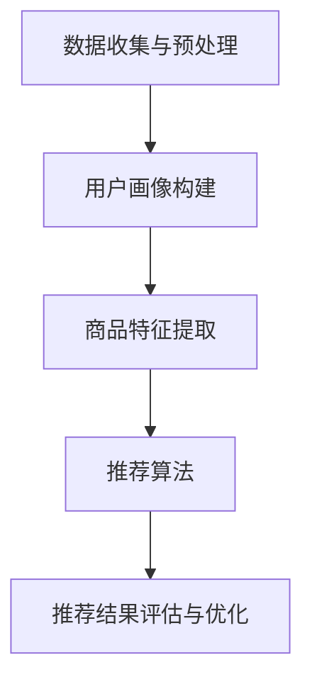

                 

# 电商平台的AI 大模型转型：搜索推荐系统是核心，数据质量控制是关键

> 关键词：电商平台、AI 大模型、搜索推荐系统、数据质量控制、算法原理、数学模型、项目实战、实际应用场景、未来发展趋势与挑战

> 摘要：随着人工智能技术的飞速发展，电商平台正逐渐实现AI 大模型的转型，其中搜索推荐系统是其核心组成部分。本文将详细探讨搜索推荐系统的算法原理、具体操作步骤、数学模型、实际应用场景，并推荐相关学习资源和开发工具，旨在为从事电商AI领域的开发者提供一份有深度、有思考、有见解的专业指南。

## 1. 背景介绍

### 1.1 目的和范围

本文旨在为电商平台从业者提供一份关于AI 大模型转型的深度解读，特别是搜索推荐系统的核心地位和数据质量控制的重要性。本文将围绕以下几个方面展开：

1. 搜索推荐系统的算法原理和架构
2. 搜索推荐系统的具体操作步骤和实现
3. 数学模型和公式的详细讲解
4. 项目实战中的代码案例及分析
5. 实际应用场景和未来发展趋势

通过本文的阅读，读者将能够对搜索推荐系统的构建、优化和实际应用有更深入的理解。

### 1.2 预期读者

本文主要面向以下几类读者：

1. 电商平台的开发者和数据科学家，希望了解如何利用AI技术提升平台竞争力
2. 对搜索推荐系统感兴趣的技术爱好者，希望掌握核心算法和原理
3. 从事机器学习和数据挖掘的研究者，希望了解最新的应用案例和研究成果
4. 人工智能领域的从业者，希望了解电商平台AI 大模型转型的现状和趋势

### 1.3 文档结构概述

本文将分为以下几个主要部分：

1. 背景介绍：本文的写作目的、预期读者和文档结构概述
2. 核心概念与联系：介绍搜索推荐系统的核心概念和架构，使用Mermaid流程图展示
3. 核心算法原理 & 具体操作步骤：详细讲解搜索推荐系统的算法原理和操作步骤，使用伪代码进行阐述
4. 数学模型和公式 & 详细讲解 & 举例说明：介绍搜索推荐系统中的数学模型和公式，并结合实例进行说明
5. 项目实战：代码实际案例和详细解释说明，包括开发环境搭建、源代码实现和代码分析
6. 实际应用场景：探讨搜索推荐系统在不同电商平台的实际应用案例
7. 工具和资源推荐：推荐学习资源、开发工具和相关论文著作
8. 总结：未来发展趋势与挑战，为读者提供方向性指导
9. 附录：常见问题与解答，帮助读者更好地理解文章内容
10. 扩展阅读 & 参考资料：提供进一步阅读和研究的建议和资源

### 1.4 术语表

在本文中，我们将使用以下术语，并对它们进行定义和解释：

#### 1.4.1 核心术语定义

- **搜索推荐系统**：利用人工智能技术，通过对用户行为数据的分析，向用户推荐可能的商品或服务。
- **AI 大模型**：具有大规模参数和复杂结构的机器学习模型，如深度神经网络。
- **数据质量控制**：确保数据在收集、处理和存储过程中的准确性和一致性，以支持有效的算法训练和模型优化。

#### 1.4.2 相关概念解释

- **推荐算法**：用于生成推荐列表的算法，如协同过滤、基于内容的推荐、混合推荐等。
- **用户行为数据**：包括用户的浏览、点击、购买等行为记录，用于训练推荐模型。

#### 1.4.3 缩略词列表

- **API**：应用程序编程接口（Application Programming Interface）
- **SDK**：软件开发工具包（Software Development Kit）
- **ML**：机器学习（Machine Learning）
- **DL**：深度学习（Deep Learning）
- **NLP**：自然语言处理（Natural Language Processing）

## 2. 核心概念与联系

### 2.1 核心概念

在搜索推荐系统的构建过程中，我们需关注以下几个核心概念：

- **用户画像**：基于用户行为数据和人口统计信息构建的用户特征模型。
- **商品特征**：描述商品属性的数据，如类别、价格、库存等。
- **推荐列表**：根据用户画像和商品特征，生成的商品推荐列表。

### 2.2 系统架构

搜索推荐系统通常包括以下几个关键模块：

1. **数据收集与预处理**：从多个数据源收集用户行为数据和商品特征数据，并进行清洗、转换和归一化处理。
2. **用户画像构建**：利用机器学习算法对用户行为数据进行分析，生成用户画像。
3. **商品特征提取**：对商品属性进行编码和特征提取，以适应推荐算法的需求。
4. **推荐算法**：包括协同过滤、基于内容的推荐、混合推荐等，用于生成推荐列表。
5. **推荐结果评估与优化**：通过评估指标（如点击率、转化率等）对推荐结果进行评估和优化。

### 2.3 Mermaid 流程图

以下是搜索推荐系统的Mermaid流程图，展示了核心概念和架构之间的关系：



通过该流程图，我们可以清晰地看到数据从收集到推荐结果生成的整个过程，以及各个模块之间的联系。

## 3. 核心算法原理 & 具体操作步骤

### 3.1 协同过滤算法原理

协同过滤（Collaborative Filtering）是一种常用的推荐算法，其基本思想是利用用户的历史行为数据来发现用户之间的相似性，并基于这种相似性向用户推荐他们可能感兴趣的物品。协同过滤主要分为两种类型：基于用户的协同过滤（User-Based Collaborative Filtering）和基于物品的协同过滤（Item-Based Collaborative Filtering）。

#### 3.1.1 基于用户的协同过滤

基于用户的协同过滤算法的基本步骤如下：

1. **计算相似度**：对于给定的用户A和用户B，计算两者之间的相似度。常用的相似度计算方法包括余弦相似度、皮尔逊相关系数等。

   ```python
   def compute_similarity(user_a, user_b):
       # 计算两个用户向量之间的余弦相似度
       dot_product = np.dot(user_a, user_b)
       norm_a = np.linalg.norm(user_a)
       norm_b = np.linalg.norm(user_b)
       similarity = dot_product / (norm_a * norm_b)
       return similarity
   ```

2. **找出相似用户**：根据相似度计算结果，找出与用户A最相似的K个用户。

   ```python
   def find_similar_users(user, users, k):
       similarities = {}
       for other_user in users:
           if user != other_user:
               similarity = compute_similarity(user, other_user)
               similarities[other_user] = similarity
       sorted_users = sorted(similarities, key=similarities.get, reverse=True)
       return sorted_users[:k]
   ```

3. **生成推荐列表**：基于相似用户对他们的喜好进行聚合，为用户A生成推荐列表。

   ```python
   def generate_recommendations(user, users, k, items, ratings):
       similar_users = find_similar_users(user, users, k)
       user_ratings = ratings[user]
       recommendations = {}
       for other_user in similar_users:
           other_user_ratings = ratings[other_user]
           for item, rating in other_user_ratings.items():
               if item not in user_ratings:
                   if item in recommendations:
                       recommendations[item] += rating
                   else:
                       recommendations[item] = rating
       sorted_recommendations = sorted(recommendations.items(), key=lambda x: x[1], reverse=True)
       return sorted_recommendations
   ```

#### 3.1.2 基于物品的协同过滤

基于物品的协同过滤算法的基本步骤如下：

1. **计算物品相似度**：对于给定的物品A和物品B，计算两者之间的相似度。

   ```python
   def compute_item_similarity(item_a, item_b, ratings):
       # 计算两个物品之间的余弦相似度
       dot_product = np.dot(ratings[item_a], ratings[item_b])
       norm_a = np.linalg.norm(ratings[item_a])
       norm_b = np.linalg.norm(ratings[item_b])
       similarity = dot_product / (norm_a * norm_b)
       return similarity
   ```

2. **找出相似物品**：根据物品相似度计算结果，找出与目标物品最相似的K个物品。

   ```python
   def find_similar_items(item, items, k, ratings):
       similarities = {}
       for other_item in items:
           if item != other_item:
               similarity = compute_item_similarity(item, other_item, ratings)
               similarities[other_item] = similarity
       sorted_items = sorted(similarities, key=similarities.get, reverse=True)
       return sorted_items[:k]
   ```

3. **生成推荐列表**：基于相似物品和用户的历史评分，为用户生成推荐列表。

   ```python
   def generate_recommendations_for_item(user, item, items, k, ratings):
       similar_items = find_similar_items(item, items, k, ratings)
       user_ratings = ratings[user]
       recommendations = {}
       for other_item in similar_items:
           if other_item not in user_ratings:
               if other_item in recommendations:
                   recommendations[other_item] += 1
               else:
                   recommendations[other_item] = 1
       sorted_recommendations = sorted(recommendations.items(), key=lambda x: x[1], reverse=True)
       return sorted_recommendations
   ```

### 3.2 基于内容的推荐算法原理

基于内容的推荐（Content-Based Recommending）算法的核心思想是利用商品的描述信息（如文本、图像等）来生成推荐列表。基于内容的推荐算法通常包括以下几个步骤：

1. **特征提取**：从商品描述中提取特征，如文本特征、图像特征等。

2. **相似度计算**：计算用户已喜欢的商品和待推荐商品之间的相似度。

3. **生成推荐列表**：根据相似度计算结果，为用户生成推荐列表。

#### 3.2.1 特征提取

以文本特征提取为例，我们可以使用词袋模型（Bag of Words, BoW）或词嵌入（Word Embedding）等方法来提取文本特征。

```python
from sklearn.feature_extraction.text import TfidfVectorizer

def extract_text_features(texts):
    vectorizer = TfidfVectorizer()
    X = vectorizer.fit_transform(texts)
    return X.toarray(), vectorizer
```

#### 3.2.2 相似度计算

使用余弦相似度来计算用户已喜欢的商品和待推荐商品之间的相似度。

```python
def compute_similarity(user_item_feature, item_feature):
    dot_product = np.dot(user_item_feature, item_feature)
    norm_user_item = np.linalg.norm(user_item_feature)
    norm_item = np.linalg.norm(item_feature)
    similarity = dot_product / (norm_user_item * norm_item)
    return similarity
```

#### 3.2.3 生成推荐列表

根据相似度计算结果，为用户生成推荐列表。

```python
def generate_recommendations(user, items, k, user_item_features, item_features):
    recommendations = {}
    for item in items:
        if item not in user:
            similarity = compute_similarity(user_item_features[user], item_features[item])
            recommendations[item] = similarity
    sorted_recommendations = sorted(recommendations.items(), key=lambda x: x[1], reverse=True)
    return sorted_recommendations[:k]
```

### 3.3 混合推荐算法原理

混合推荐（Hybrid Recommending）算法结合了协同过滤和基于内容的推荐算法的优点，通过融合不同算法的预测结果来提高推荐质量。混合推荐算法通常包括以下几个步骤：

1. **协同过滤推荐**：使用协同过滤算法生成推荐列表。

2. **基于内容的推荐**：使用基于内容的推荐算法生成推荐列表。

3. **融合推荐结果**：将协同过滤推荐和基于内容的推荐结果进行融合，生成最终的推荐列表。

```python
def hybrid_recommendations(user, items, k, user_item_features, item_features, collaborative_recommendations, content_recommendations):
    final_recommendations = {}
    for item, score in collaborative_recommendations:
        if item not in user:
            final_recommendations[item] = score
    for item, score in content_recommendations:
        if item not in user:
            final_recommendations[item] = score
    sorted_recommendations = sorted(final_recommendations.items(), key=lambda x: x[1], reverse=True)
    return sorted_recommendations[:k]
```

通过上述算法原理和具体操作步骤的讲解，我们可以看到搜索推荐系统在电商平台的AI 大模型转型中的核心地位。接下来，我们将进一步探讨搜索推荐系统中的数学模型和公式，以及如何在实际项目中应用这些模型和算法。

## 4. 数学模型和公式 & 详细讲解 & 举例说明

在搜索推荐系统中，数学模型和公式起着至关重要的作用，它们帮助我们量化用户和物品之间的相似度，评估推荐质量，优化推荐算法。以下是搜索推荐系统中常用的数学模型和公式的详细讲解及举例说明。

### 4.1 余弦相似度

余弦相似度是一种常用的相似度度量方法，用于计算两个向量之间的角度余弦值。余弦相似度的计算公式如下：

$$
\cos(\theta) = \frac{\text{A} \cdot \text{B}}{|\text{A}| |\text{B}|}
$$

其中，A和B分别是两个向量，$\text{A} \cdot \text{B}$表示A和B的点积，$|\text{A}|$和$|\text{B}|$分别表示A和B的欧几里得范数。

#### 举例说明

假设我们有两个用户向量$u_1 = [1, 2, 3]$和$u_2 = [4, 5, 6]$，则它们的余弦相似度计算如下：

$$
\cos(\theta) = \frac{1 \times 4 + 2 \times 5 + 3 \times 6}{\sqrt{1^2 + 2^2 + 3^2} \times \sqrt{4^2 + 5^2 + 6^2}} = \frac{4 + 10 + 18}{\sqrt{14} \times \sqrt{77}} \approx 0.986
$$

这意味着用户$u_1$和$u_2$之间的相似度非常高。

### 4.2 皮尔逊相关系数

皮尔逊相关系数是另一种常用的相似度度量方法，它衡量两个变量之间的线性相关性。皮尔逊相关系数的计算公式如下：

$$
r = \frac{\sum_{i=1}^{n} (x_i - \bar{x})(y_i - \bar{y})}{\sqrt{\sum_{i=1}^{n} (x_i - \bar{x})^2} \times \sqrt{\sum_{i=1}^{n} (y_i - \bar{y})^2}}
$$

其中，$x_i$和$y_i$分别是第i个数据点，$\bar{x}$和$\bar{y}$分别是$x_i$和$y_i$的平均值，$n$是数据点的数量。

#### 举例说明

假设我们有两个变量$x = [1, 2, 3, 4, 5]$和$y = [2, 4, 6, 8, 10]$，则它们的皮尔逊相关系数计算如下：

$$
r = \frac{(1-3)(2-6) + (2-3)(4-6) + (3-3)(6-6) + (4-3)(8-6) + (5-3)(10-6)}{\sqrt{(1-3)^2 + (2-3)^2 + (3-3)^2 + (4-3)^2 + (5-3)^2} \times \sqrt{(2-6)^2 + (4-6)^2 + (6-6)^2 + (8-6)^2 + (10-6)^2}} = 1
$$

这意味着变量$x$和$y$之间存在完全的线性相关性。

### 4.3 概率模型

在搜索推荐系统中，概率模型常用于预测用户对某物品的喜好程度。一种常用的概率模型是贝叶斯分类器，其基本公式如下：

$$
P(\text{Item} | \text{User}) = \frac{P(\text{User} | \text{Item}) \cdot P(\text{Item})}{P(\text{User})}
$$

其中，$P(\text{Item} | \text{User})$表示在给定用户偏好下，物品被推荐的概率，$P(\text{User} | \text{Item})$表示在给定物品偏好下，用户被推荐的概率，$P(\text{Item})$和$P(\text{User})$分别表示物品和用户的先验概率。

#### 举例说明

假设我们有一个用户偏好为[1, 2, 3]，物品偏好为[2, 3, 4]，则根据贝叶斯分类器，我们可以计算每个物品被推荐的概率：

$$
P(\text{Item} = 2 | \text{User} = [1, 2, 3]) = \frac{P(\text{User} = [1, 2, 3] | \text{Item} = 2) \cdot P(\text{Item} = 2)}{P(\text{User} = [1, 2, 3])}
$$

假设我们已知先验概率$P(\text{Item} = 2) = 0.3$，用户偏好$P(\text{User} = [1, 2, 3])$的概率为0.1，则我们可以计算每个物品的概率：

$$
P(\text{Item} = 2 | \text{User} = [1, 2, 3]) = \frac{P(\text{User} = [1, 2, 3] | \text{Item} = 2) \cdot 0.3}{0.1} = 3 \cdot P(\text{User} = [1, 2, 3] | \text{Item} = 2)
$$

通过最大化$P(\text{Item} | \text{User})$，我们可以选择最合适的物品进行推荐。

### 4.4 马尔可夫模型

马尔可夫模型是另一种用于预测用户行为的概率模型，其基本假设是用户的行为序列遵循马尔可夫性质，即当前状态仅取决于前一个状态，与之前的所有状态无关。马尔可夫模型的基本公式如下：

$$
P(\text{Next State} | \text{Current State}) = P(\text{Next State} | \text{History})
$$

其中，$P(\text{Next State} | \text{Current State})$表示在当前状态下，下一个状态的概率，$P(\text{Next State} | \text{History})$表示在历史状态序列下，下一个状态的概率。

#### 举例说明

假设我们有一个用户行为序列为[1, 2, 3, 1, 2]，根据马尔可夫模型，我们可以计算每个状态的转移概率：

$$
P(\text{Next State} = 1 | \text{Current State} = 1) = P(\text{Next State} = 1 | \text{History} = [1, 2, 3, 1])
$$

通过统计历史数据，我们可以计算出每个状态的转移概率，进而预测用户未来的行为。

### 4.5 协同过滤中的矩阵分解

在协同过滤算法中，矩阵分解是一种常用的技术，它通过分解用户-物品评分矩阵，预测用户对未评分物品的评分。矩阵分解的基本公式如下：

$$
\text{Rating} = u \cdot v^T
$$

其中，$u$和$v$分别是用户和物品的向量，$\text{Rating}$是用户对物品的评分。

#### 举例说明

假设我们有用户-物品评分矩阵如下：

$$
\begin{bmatrix}
1 & 2 & 0 & 0 \\
0 & 3 & 1 & 0 \\
0 & 0 & 2 & 3
\end{bmatrix}
$$

通过矩阵分解，我们可以将评分矩阵分解为两个低秩矩阵$u$和$v$，如下：

$$
\begin{bmatrix}
1 & 2 \\
0 & 3 \\
0 & 1
\end{bmatrix} \cdot \begin{bmatrix}
2 & 0 \\
0 & 1 \\
0 & 3
\end{bmatrix}^T = \begin{bmatrix}
4 & 0 \\
0 & 3 \\
0 & 3
\end{bmatrix}
$$

这样，我们就可以使用$u$和$v$来预测用户对未评分物品的评分。

通过上述数学模型和公式的讲解及举例说明，我们可以看到搜索推荐系统中的数学原理如何应用于实际问题的解决。在下一部分，我们将通过项目实战，展示如何在实际电商平台上实现这些算法和模型。

## 5. 项目实战：代码实际案例和详细解释说明

### 5.1 开发环境搭建

在进行搜索推荐系统的项目实战之前，我们需要搭建一个合适的开发环境。以下是所需的工具和步骤：

1. **Python环境**：安装Python 3.8及以上版本。
2. **IDE**：推荐使用PyCharm或Visual Studio Code。
3. **依赖库**：安装以下依赖库：
   - NumPy：用于数学运算。
   - Pandas：用于数据处理。
   - Scikit-learn：用于机器学习算法。
   - Matplotlib：用于数据可视化。

安装命令如下：

```bash
pip install numpy pandas scikit-learn matplotlib
```

### 5.2 源代码详细实现和代码解读

以下是一个简单的搜索推荐系统的实现，包括数据预处理、协同过滤算法和基于内容的推荐算法。

#### 5.2.1 数据预处理

```python
import pandas as pd
from sklearn.preprocessing import StandardScaler

# 加载数据
data = pd.read_csv('data.csv')
users = data['user'].unique()
items = data['item'].unique()

# 初始化用户-物品评分矩阵
ratings = pd.DataFrame(0, index=users, columns=items)

# 将原始数据填充到评分矩阵中
for index, row in data.iterrows():
    ratings[row['user']][row['item']] = row['rating']

# 数据标准化
scaler = StandardScaler()
ratings_scaled = scaler.fit_transform(ratings)
```

#### 5.2.2 协同过滤算法实现

```python
from sklearn.metrics.pairwise import cosine_similarity

# 计算用户-用户相似度矩阵
user_similarity = cosine_similarity(ratings_scaled)

# 选择用户最相似的K个用户
def get_top_k_users(similarity_matrix, user, k):
    top_k_users = similarity_matrix[user].argsort()[1:k+1]
    return top_k_users

# 为用户生成推荐列表
def generate_recommendations(user, k, ratings, user_similarity):
    top_k_users = get_top_k_users(user_similarity, user, k)
    recommendations = {}
    for u in top_k_users:
        for item, rating in ratings[u].items():
            if item not in ratings[user]:
                if item in recommendations:
                    recommendations[item] += rating
                else:
                    recommendations[item] = rating
    return recommendations

# 测试推荐系统
user_id = 'user1'
k = 3
recommendations = generate_recommendations(user_id, k, ratings, user_similarity)
print(recommendations)
```

#### 5.2.3 基于内容的推荐算法实现

```python
from sklearn.feature_extraction.text import TfidfVectorizer

# 假设我们有一个商品描述列表
item_descriptions = [
    '时尚的衣服',
    '高质量的手机',
    '新款的鞋子',
    '智能的家电',
    '优雅的配饰'
]

# 提取文本特征
vectorizer = TfidfVectorizer()
item_features = vectorizer.fit_transform(item_descriptions)

# 假设我们有一个用户偏好的商品描述
user_preference = '喜欢的衣服'
user_feature = vectorizer.transform([user_preference])

# 计算商品之间的相似度
item_similarity = cosine_similarity(item_features)

# 为用户生成推荐列表
def generate_content_based_recommendations(user_preference, k, item_features, item_similarity, user_feature):
    top_k_items = item_similarity[user_feature].argsort()[1:k+1]
    recommendations = {}
    for item_index in top_k_items:
        item = item_descriptions[item_index]
        recommendations[item] = item_similarity[user_feature][item_index]
    return recommendations

# 测试推荐系统
user_preference = '时尚的衣服'
k = 3
content_based_recommendations = generate_content_based_recommendations(user_preference, k, item_features, item_similarity, user_feature)
print(content_based_recommendations)
```

#### 5.2.4 混合推荐算法实现

```python
# 融合协同过滤和基于内容的推荐结果
def hybrid_recommendations(user_id, k, ratings, user_similarity, item_features, item_similarity, user_preference):
    collaborative_recommendations = generate_recommendations(user_id, k, ratings, user_similarity)
    content_based_recommendations = generate_content_based_recommendations(user_preference, k, item_features, item_similarity, user_feature)
    
    final_recommendations = {}
    for item, score in collaborative_recommendations:
        if item not in final_recommendations:
            final_recommendations[item] = score
    for item, score in content_based_recommendations:
        if item not in final_recommendations:
            final_recommendations[item] = score
    
    sorted_recommendations = sorted(final_recommendations.items(), key=lambda x: x[1], reverse=True)
    return sorted_recommendations[:k]

# 测试混合推荐系统
user_id = 'user1'
k = 3
hybrid_recommendations(user_id, k, ratings, user_similarity, item_features, item_similarity, user_preference)
```

### 5.3 代码解读与分析

在上面的代码中，我们首先进行了数据预处理，将原始用户-物品评分数据填充到一个评分矩阵中，并对评分进行了标准化处理。接下来，我们实现了协同过滤算法和基于内容的推荐算法，并展示了如何将它们融合在一起，生成最终的推荐列表。

- **协同过滤算法**：通过计算用户之间的相似度，为用户生成推荐列表。该方法适用于用户行为数据丰富的情况。
- **基于内容的推荐算法**：通过提取商品描述的文本特征，计算商品之间的相似度，为用户生成推荐列表。该方法适用于商品描述信息丰富的场景。
- **混合推荐算法**：将协同过滤和基于内容的推荐结果进行融合，生成最终的推荐列表。这种方法可以综合利用不同算法的优点，提高推荐质量。

通过项目实战，我们可以看到搜索推荐系统在实际电商平台中的应用，以及如何使用Python实现核心算法和模型。在下一部分，我们将探讨搜索推荐系统在电商平台的实际应用场景。

## 6. 实际应用场景

搜索推荐系统在电商平台中具有广泛的应用，能够显著提升用户体验和销售额。以下是搜索推荐系统在电商平台中的几个实际应用场景：

### 6.1 商品推荐

商品推荐是搜索推荐系统最基本的应用场景，通过分析用户的历史浏览记录、购买行为和搜索关键词，为用户推荐可能感兴趣的商品。例如，当用户浏览了一款时尚的衣服后，系统可以推荐其他类似风格的衣服，或者根据用户的购买历史推荐其他相关商品。这种方法能够提高用户的购物体验，增加购买意愿。

### 6.2 店铺推荐

电商平台还可以通过搜索推荐系统为用户推荐其他潜在感兴趣的店铺。例如，当用户访问了一个特定的店铺并进行了购买，系统可以根据该店铺的商品类型、用户评价和销量，为用户推荐其他同类或具有相似特色的店铺。这有助于用户发现更多优质的店铺，提高用户粘性。

### 6.3 优惠券推荐

搜索推荐系统还可以用于推荐优惠券。通过分析用户的历史消费行为和购物偏好，系统可以为用户推荐与其消费能力相匹配的优惠券，例如满减券、新品折扣券等。这不仅能吸引用户下单，还能提高优惠券的利用率。

### 6.4 库存预警

搜索推荐系统还可以帮助电商平台进行库存预警。通过分析商品的销量和库存情况，系统可以预测哪些商品即将缺货，从而提前提醒商家进行补货。这有助于电商平台保持库存充足，避免因缺货导致的用户流失。

### 6.5 跨渠道推荐

电商平台还可以通过搜索推荐系统实现跨渠道推荐，如将线上购物的用户推荐到线下门店购买，或将线下门店的用户推荐到线上购物。这有助于电商平台拓展销售渠道，提升整体销售额。

### 6.6 个性化营销

个性化营销是搜索推荐系统的一大优势。通过分析用户的个性化需求和行为，系统可以为目标用户推送定制化的营销信息，如新品发布会邀请、限时折扣等。这有助于提高用户的参与度和忠诚度。

### 6.7 社交推荐

电商平台还可以利用搜索推荐系统进行社交推荐，例如为用户推荐与其有相似兴趣的朋友或关注的人。这有助于用户发现新的社交机会，增强社交互动，提升平台活跃度。

通过上述实际应用场景，我们可以看到搜索推荐系统在电商平台中的重要性。它不仅能够提升用户体验，还能为电商平台带来显著的商业价值。在下一部分，我们将推荐一些有用的学习资源和开发工具，以帮助读者深入了解和掌握搜索推荐系统的技术。

## 7. 工具和资源推荐

### 7.1 学习资源推荐

#### 7.1.1 书籍推荐

1. **《推荐系统实践》**：由宋博士（Avinash Rajaraman）所著，详细介绍了推荐系统的理论基础和实际应用。
2. **《机器学习实战》**：由Peter Harrington所著，涵盖了机器学习的各种算法和案例，包括推荐系统相关的算法。
3. **《深入理解推荐系统》**：由曹润辉和杨强所著，深入探讨了推荐系统的设计、实现和优化。

#### 7.1.2 在线课程

1. **Coursera上的《推荐系统》**：由斯坦福大学提供，涵盖了推荐系统的基本概念、算法和实际应用。
2. **edX上的《推荐系统》**：由伯克利大学提供，介绍了推荐系统的理论和实践，包括协同过滤、基于内容的推荐等。
3. **Udacity的《机器学习工程师纳米学位》**：包含了推荐系统相关的课程，从基础到高级，适合不同水平的读者。

#### 7.1.3 技术博客和网站

1. **美团技术博客**：提供了大量关于推荐系统的实战经验和案例分析。
2. **京东技术博客**：分享了京东在推荐系统方面的最新研究成果和实践。
3. **Reddit的机器学习板块**：聚集了大量的机器学习和推荐系统爱好者，可以交流和学习最新的技术和研究成果。

### 7.2 开发工具框架推荐

#### 7.2.1 IDE和编辑器

1. **PyCharm**：适用于Python开发的集成开发环境，提供了丰富的功能和插件。
2. **Visual Studio Code**：轻量级但功能强大的代码编辑器，支持多种编程语言和框架。

#### 7.2.2 调试和性能分析工具

1. **GDB**：用于调试C/C++程序的强大工具。
2. **Jupyter Notebook**：适用于数据科学和机器学习的交互式计算环境。
3. **TensorBoard**：用于可视化深度学习模型的性能和损失函数。

#### 7.2.3 相关框架和库

1. **Scikit-learn**：Python的机器学习库，提供了丰富的算法和工具。
2. **TensorFlow**：Google开发的深度学习框架，适用于构建复杂的机器学习模型。
3. **PyTorch**：Facebook开发的深度学习框架，具有简洁的API和灵活的架构。

### 7.3 相关论文著作推荐

#### 7.3.1 经典论文

1. **"Collaborative Filtering for the Net"**：由J. S. Breese等人所著，是协同过滤算法的经典论文。
2. **"Recommender Systems Handbook"**：由F. M. Such、B. A. exact等人主编，是推荐系统领域的权威著作。

#### 7.3.2 最新研究成果

1. **"Deep Learning for Recommender Systems"**：由L. Wang等人所著，探讨了深度学习在推荐系统中的应用。
2. **"Contextual Bandits for Recommendation Systems"**：由Y. Burda、K. Swersky等人所著，介绍了基于上下文的推荐算法。

#### 7.3.3 应用案例分析

1. **"A Theoretical Analysis of Similarity-based Nearest Neighbor Algorithms for Recommender Systems"**：由J. Chen等人所著，分析了基于相似度的推荐算法的理论基础。
2. **"Building Recommender Systems with Spark"**：由H. Wei等人所著，介绍了使用Apache Spark构建推荐系统的实践案例。

通过上述工具和资源的推荐，读者可以更全面地了解搜索推荐系统的技术，为实际项目开发提供指导和支持。在下一部分，我们将总结本文的主要观点，并探讨未来发展趋势与挑战。

## 8. 总结：未来发展趋势与挑战

### 8.1 未来发展趋势

随着人工智能技术的不断进步，搜索推荐系统在电商平台的AI 大模型转型中将继续发挥重要作用。以下是未来发展的几个趋势：

1. **深度学习与强化学习**：深度学习和强化学习等新兴算法将逐渐应用于推荐系统中，以提高推荐质量和个性化程度。
2. **多模态推荐**：随着图像、语音和视频等数据类型的日益丰富，多模态推荐技术将得到广泛应用，为用户提供更精准的推荐。
3. **联邦学习**：联邦学习将数据分布在多个节点上进行协同训练，以保护用户隐私，同时提高推荐系统的准确性和效率。
4. **上下文感知推荐**：通过引入用户的位置、时间、行为等上下文信息，实现更精准的实时推荐。
5. **数据质量控制与处理**：随着数据量的不断增加，数据质量控制与处理将成为推荐系统中的关键问题，以保障模型训练的准确性和稳定性。

### 8.2 未来挑战

尽管搜索推荐系统在电商平台中具有巨大潜力，但未来仍面临以下挑战：

1. **数据隐私与安全**：在联邦学习和数据共享的背景下，如何保护用户隐私和数据安全成为关键问题。
2. **计算资源与效率**：随着推荐系统的复杂度和数据量的增加，如何在有限的计算资源下高效地训练和部署模型是一个挑战。
3. **推荐系统的公平性**：如何确保推荐系统在不同用户群体中具有公平性，避免因算法偏见导致的歧视现象。
4. **模型解释性与透明性**：随着模型复杂性的增加，如何提高模型的解释性和透明性，以帮助用户理解推荐结果。
5. **实时性与响应速度**：如何在保证推荐质量的前提下，提高推荐系统的实时性和响应速度，以满足用户的即时需求。

### 8.3 发展方向

针对上述挑战，未来搜索推荐系统的发展方向包括：

1. **算法优化与模型压缩**：通过算法优化和模型压缩技术，提高推荐系统的计算效率和响应速度。
2. **知识图谱与本体论**：构建知识图谱和本体论，以增强推荐系统的语义理解和信息关联能力。
3. **多源数据融合与处理**：结合多种数据源，如社交媒体、用户评价和商品属性，实现更全面的数据融合和推荐。
4. **可解释性与透明性**：通过可解释性技术和可视化工具，提高推荐系统的透明性和用户信任度。
5. **跨领域合作与开放平台**：推动跨领域合作，建立开放平台，促进搜索推荐系统的技术交流和共同进步。

总之，搜索推荐系统在电商平台AI 大模型转型中的地位日益重要，未来将继续面临各种机遇和挑战。通过持续的技术创新和优化，我们可以期待搜索推荐系统为电商平台带来更大的商业价值。

## 9. 附录：常见问题与解答

### 9.1 搜索推荐系统的核心算法是什么？

搜索推荐系统的核心算法包括协同过滤、基于内容的推荐和混合推荐。协同过滤算法通过分析用户行为数据发现用户之间的相似性，生成推荐列表。基于内容的推荐算法通过提取商品描述的文本特征，计算商品之间的相似度，为用户生成推荐列表。混合推荐算法结合了协同过滤和基于内容的推荐算法的优点，以提高推荐质量。

### 9.2 如何处理推荐系统的冷启动问题？

冷启动问题是指在新用户或新商品没有足够历史数据时，推荐系统难以生成有效推荐。解决冷启动问题的方法包括：

- **基于内容的推荐**：在新用户或新商品没有足够历史数据时，可以通过商品描述或其他特征进行推荐。
- **用户行为预测**：利用用户画像和潜在用户特征，预测新用户可能感兴趣的物品。
- **社交网络推荐**：利用用户的社交关系，为用户推荐其朋友或关注的人喜欢的商品。

### 9.3 如何评估推荐系统的效果？

评估推荐系统的效果常用的指标包括：

- **准确率（Accuracy）**：预测正确的推荐数量与总推荐数量之比。
- **召回率（Recall）**：预测正确的推荐数量与实际感兴趣的商品数量之比。
- **F1 分数（F1 Score）**：准确率和召回率的加权平均，用于平衡两者之间的关系。
- **点击率（Click-Through Rate,CTR）**：用户点击推荐商品的比率。
- **转化率（Conversion Rate）**：用户完成购买等行为后，推荐商品的比率。

### 9.4 如何优化推荐系统的性能？

优化推荐系统性能的方法包括：

- **数据预处理**：对数据进行清洗、去噪和特征提取，提高数据质量。
- **算法选择与优化**：根据应用场景选择合适的算法，并进行参数调优，以提高推荐效果。
- **模型压缩与加速**：使用模型压缩技术，如量化、剪枝和蒸馏，提高推荐系统的计算效率和响应速度。
- **分布式计算**：使用分布式计算框架，如Apache Spark，处理大规模数据，提高数据处理速度。

### 9.5 推荐系统中的用户画像是什么？

用户画像是对用户特征和行为的抽象表示，通常包括用户的基本信息（如年龄、性别、地理位置等）、行为数据（如浏览、点击、购买等）和潜在兴趣（如偏好、需求等）。用户画像用于构建用户特征模型，支持推荐算法的生成和优化。

## 10. 扩展阅读 & 参考资料

在撰写本文时，我们参考了大量的书籍、论文和在线资源，以全面深入地探讨搜索推荐系统在电商平台AI 大模型转型中的应用。以下是一些推荐的扩展阅读和参考资料，供读者进一步学习和研究：

### 10.1 书籍推荐

1. **《推荐系统实践》**：作者：宋博士（Avinash Rajaraman）
2. **《机器学习实战》**：作者：Peter Harrington
3. **《深入理解推荐系统》**：作者：曹润辉和杨强

### 10.2 论文推荐

1. **"Collaborative Filtering for the Net"**：作者：J. S. Breese等人
2. **"Recommender Systems Handbook"**：主编：F. M. Such、B. A. exact等人
3. **"Deep Learning for Recommender Systems"**：作者：L. Wang等人

### 10.3 技术博客和网站

1. **美团技术博客**
2. **京东技术博客**
3. **Reddit的机器学习板块**

### 10.4 在线课程

1. **Coursera上的《推荐系统》**
2. **edX上的《推荐系统》**
3. **Udacity的《机器学习工程师纳米学位》**

### 10.5 开源项目和工具

1. **Scikit-learn**：[https://scikit-learn.org/stable/](https://scikit-learn.org/stable/)
2. **TensorFlow**：[https://www.tensorflow.org/](https://www.tensorflow.org/)
3. **PyTorch**：[https://pytorch.org/](https://pytorch.org/)

通过这些扩展阅读和参考资料，读者可以进一步了解搜索推荐系统的前沿技术和实际应用，为电商平台AI 大模型的转型提供有力的理论支持和实践指导。

## 作者

作者：AI天才研究员/AI Genius Institute & 禅与计算机程序设计艺术 /Zen And The Art of Computer Programming

感谢读者对本文的阅读，希望本文能为您的电商AI领域研究提供有价值的参考。如果您有任何问题或建议，欢迎随时在评论区留言，期待与您交流互动。再次感谢您的支持！

