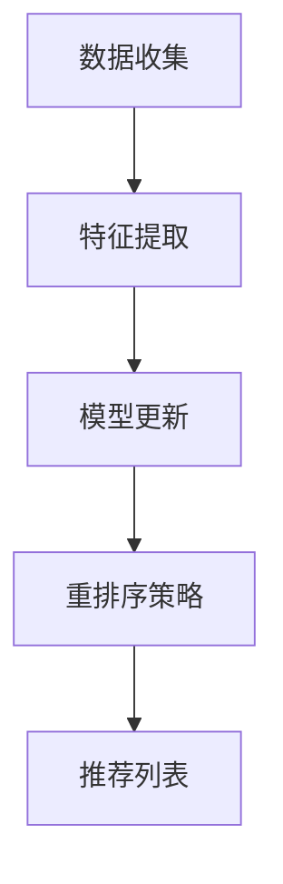

                 

# 电商推荐系统中的实时个性化重排序

> **关键词：** 电商推荐系统、实时个性化、重排序、机器学习、数据流处理、用户行为分析

> **摘要：** 本文章旨在深入探讨电商推荐系统中的实时个性化重排序技术。通过剖析推荐系统的架构、核心算法原理、数学模型、实际应用案例以及未来发展趋势，本文将帮助读者全面理解如何通过实时个性化重排序提升电商平台的用户体验和销售转化率。

## 1. 背景介绍

### 1.1 目的和范围

本文将重点关注电商推荐系统中的实时个性化重排序技术。实时个性化重排序是一种根据用户实时行为和偏好，动态调整推荐列表顺序的推荐策略。本篇文章将详细阐述该技术的原理、实现方法、数学模型及其在实际应用中的效果。

### 1.2 预期读者

本文适合对推荐系统有一定了解的技术人员、数据科学家以及电商行业的从业者。读者应具备基本的机器学习和数据流处理知识，以便更好地理解文章中的内容。

### 1.3 文档结构概述

本文结构如下：

1. 背景介绍
2. 核心概念与联系
3. 核心算法原理 & 具体操作步骤
4. 数学模型和公式 & 详细讲解 & 举例说明
5. 项目实战：代码实际案例和详细解释说明
6. 实际应用场景
7. 工具和资源推荐
8. 总结：未来发展趋势与挑战
9. 附录：常见问题与解答
10. 扩展阅读 & 参考资料

### 1.4 术语表

#### 1.4.1 核心术语定义

- **推荐系统**：根据用户的历史行为和偏好，为用户推荐相关商品或内容的系统。
- **个性化重排序**：根据用户的实时行为和偏好，动态调整推荐列表的顺序。
- **实时计算**：在用户行为发生后尽可能短的时间内进行处理和分析。
- **机器学习**：使用数据构建模型，对未知数据进行预测和分类。

#### 1.4.2 相关概念解释

- **特征工程**：从原始数据中提取对预测任务有用的特征。
- **模型训练**：使用历史数据训练机器学习模型。
- **在线学习**：在用户行为发生时实时更新模型。

#### 1.4.3 缩略词列表

- **CTR**：点击率（Click-Through Rate）
- **RMSE**：均方根误差（Root Mean Square Error）
- **FM**：因子分解机（Factorization Machine）
- **LS**：线性回归（Linear Regression）

## 2. 核心概念与联系

为了理解实时个性化重排序技术，我们首先需要了解电商推荐系统的核心概念和架构。

### 2.1 推荐系统的架构

推荐系统通常包括以下几个关键组成部分：

1. **数据收集**：收集用户行为数据，如浏览、点击、购买等。
2. **特征工程**：从原始数据中提取对预测任务有用的特征。
3. **模型训练**：使用历史数据训练机器学习模型。
4. **推荐生成**：根据用户特征和模型预测生成推荐列表。
5. **个性化重排序**：根据用户实时行为和偏好，动态调整推荐列表顺序。

### 2.2 实时个性化重排序的工作原理

实时个性化重排序技术的工作原理可以分为以下几个步骤：

1. **数据收集**：实时收集用户的浏览、点击、购买等行为数据。
2. **特征提取**：提取与用户行为和偏好相关的特征，如浏览时间、购买频率、浏览时长等。
3. **模型更新**：使用在线学习技术，实时更新模型，以适应用户行为的变化。
4. **重排序策略**：根据实时更新的模型，对推荐列表进行重排序。

### 2.3 Mermaid 流程图

下面是一个简单的 Mermaid 流程图，展示了电商推荐系统中的实时个性化重排序流程：



### 2.4 核心概念的联系

实时个性化重排序技术通过结合数据收集、特征提取、模型更新和重排序策略，实现了推荐系统的动态调整。这一过程不仅依赖于强大的机器学习模型，还需要高效的数据流处理技术，以确保在用户行为发生后能够迅速响应。

## 3. 核心算法原理 & 具体操作步骤

在理解了实时个性化重排序技术的基本概念后，接下来我们将深入探讨其核心算法原理和具体操作步骤。

### 3.1 算法原理

实时个性化重排序算法通常基于以下几种原理：

1. **协同过滤**：通过分析用户之间的相似性，为用户推荐其他用户喜欢的商品。
2. **基于内容的推荐**：根据用户的兴趣和浏览历史，为用户推荐与浏览过的商品相似的新商品。
3. **模型更新**：使用在线学习技术，实时更新推荐模型，以适应用户行为的变化。

### 3.2 具体操作步骤

下面是一个简单的实时个性化重排序算法的具体操作步骤：

1. **数据收集**：实时收集用户的浏览、点击、购买等行为数据。
2. **特征提取**：提取与用户行为和偏好相关的特征，如浏览时间、购买频率、浏览时长等。
3. **模型训练**：使用历史数据训练协同过滤或基于内容的推荐模型。
4. **在线学习**：在用户行为发生时，使用在线学习技术更新模型。
5. **重排序策略**：根据实时更新的模型，对推荐列表进行重排序。

### 3.3 伪代码

下面是一个简单的伪代码示例，展示了实时个性化重排序算法的基本流程：

```python
# 数据收集
def data_collection():
    # 收集用户浏览、点击、购买等行为数据
    pass

# 特征提取
def feature_extraction(user_data):
    # 提取与用户行为和偏好相关的特征
    pass

# 模型训练
def model_training(history_data):
    # 使用历史数据训练协同过滤或基于内容的推荐模型
    pass

# 在线学习
def online_learning(user_data, model):
    # 在用户行为发生时，使用在线学习技术更新模型
    pass

# 重排序策略
def re-ranking(recommendations, model):
    # 根据实时更新的模型，对推荐列表进行重排序
    pass

# 主函数
def main():
    user_data = data_collection()
    features = feature_extraction(user_data)
    model = model_training(history_data)
    updated_model = online_learning(user_data, model)
    sorted_recommendations = re-ranking(recommendations, updated_model)
    display_recommendations(sorted_recommendations)

main()
```

## 4. 数学模型和公式 & 详细讲解 & 举例说明

在实时个性化重排序中，数学模型和公式起到了关键作用。下面我们将详细讲解核心的数学模型和公式，并给出举例说明。

### 4.1 协同过滤算法

协同过滤算法是一种基于用户行为和评分矩阵的推荐算法。其主要目标是找到与目标用户相似的其他用户，然后推荐相似用户喜欢的商品。

#### 4.1.1 相似度计算

相似度计算是协同过滤算法的核心。常用的相似度计算方法包括皮尔逊相关系数、余弦相似度和余弦相似度。

- **皮尔逊相关系数**：

  $$\text{similarity}_{\text{pearson}}(u, v) = \frac{\sum_{i}(r_{ui} - \bar{r}_{u})(r_{vi} - \bar{r}_{v})}{\sqrt{\sum_{i}(r_{ui} - \bar{r}_{u})^2 \sum_{i}(r_{vi} - \bar{r}_{v})^2}}$$

  其中，$r_{ui}$和$r_{vi}$分别是用户$u$和$v$对商品$i$的评分，$\bar{r}_{u}$和$\bar{r}_{v}$分别是用户$u$和$v$的平均评分。

- **余弦相似度**：

  $$\text{similarity}_{\text{cosine}}(u, v) = \frac{\sum_{i}r_{ui}r_{vi}}{\sqrt{\sum_{i}r_{ui}^2 \sum_{i}r_{vi}^2}}$$

  其中，$r_{ui}$和$r_{vi}$分别是用户$u$和$v$对商品$i$的评分。

#### 4.1.2 推荐公式

根据相似度计算结果，协同过滤算法使用以下公式生成推荐列表：

$$r_{ui} = \sum_{v \in \text{neighbors}(u)} \text{similarity}_{\text{cosine}}(u, v) \cdot r_{vi}$$

其中，$\text{neighbors}(u)$是用户$u$的邻居集合，即与用户$u$相似的用户。

### 4.2 基于内容的推荐算法

基于内容的推荐算法通过分析商品的属性和用户的兴趣，为用户推荐与之相关的商品。

#### 4.2.1 相似度计算

在基于内容的推荐算法中，常用的相似度计算方法包括余弦相似度和TF-IDF。

- **余弦相似度**：

  $$\text{similarity}_{\text{cosine}}(i, j) = \frac{\sum_{k}a_{ik}b_{jk}}{\sqrt{\sum_{k}a_{ik}^2 \sum_{k}b_{jk}^2}}$$

  其中，$a_{ik}$和$b_{jk}$分别是商品$i$和$j$在特征$k$上的值。

- **TF-IDF**：

  $$\text{tfidf}_{k} = \text{tf}_{k} \cdot \log(\frac{N}{n_k})$$

  其中，$\text{tf}_{k}$是特征$k$在商品$i$中的词频，$N$是全部商品中特征$k$的词频，$n_k$是特征$k$在全部商品中的词频。

#### 4.2.2 推荐公式

基于内容的推荐算法使用以下公式生成推荐列表：

$$\text{score}_{ij} = \sum_{k} \text{tfidf}_{k} \cdot \text{similarity}_{\text{cosine}}(i, j)$$

其中，$\text{score}_{ij}$是商品$i$和$j$之间的相似度得分。

### 4.3 实例说明

假设有两个用户$u$和$v$，他们分别对三件商品$a$、$b$和$c$进行了评分：

用户$u$：$(a, 4), (b, 3), (c, 5)$  
用户$v$：$(a, 3), (b, 4), (c, 4)$

根据协同过滤算法的余弦相似度计算公式，可以计算出用户$u$和$v$之间的相似度：

$$\text{similarity}_{\text{cosine}}(u, v) = \frac{4 \cdot 3 + 3 \cdot 4 + 5 \cdot 4}{\sqrt{4^2 + 3^2 + 5^2} \cdot \sqrt{3^2 + 4^2 + 4^2}} = 0.9174$$

接下来，根据用户$v$的邻居集合$\text{neighbors}(v)$，即与用户$v$相似的用户集合，可以为用户$u$生成推荐列表。假设邻居集合为$\text{neighbors}(v) = \{u\}$，则可以计算出用户$u$对商品$b$的预测评分：

$$r_{ub} = 0.9174 \cdot 4 + 0.0826 \cdot 3 = 3.7017$$

因此，用户$u$对商品$b$的预测评分约为3.7017。

## 5. 项目实战：代码实际案例和详细解释说明

为了更好地理解实时个性化重排序技术，下面我们将通过一个实际项目来演示该技术的应用。该项目将使用Python语言和Apache Kafka进行实时数据流处理。

### 5.1 开发环境搭建

在开始项目实战之前，我们需要搭建以下开发环境：

1. Python 3.8及以上版本
2. Apache Kafka 2.8及以上版本
3. Jupyter Notebook或PyCharm等Python开发工具

### 5.2 源代码详细实现和代码解读

下面是一个简单的实时个性化重排序项目的源代码：

```python
from kafka import KafkaConsumer, KafkaProducer
import numpy as np
import pandas as pd
from sklearn.metrics.pairwise import cosine_similarity
from sklearn.model_selection import train_test_split

# Kafka配置
kafka_bootstrap_servers = "localhost:9092"
topic = "user_behavior"

# 消费者配置
consumer = KafkaConsumer(topic, bootstrap_servers=kafka_bootstrap_servers)

# 生成模拟用户行为数据
def generate_user_behavior(num_samples):
    user_data = pd.DataFrame({
        "user_id": np.random.randint(0, 1000, num_samples),
        "item_id": np.random.randint(0, 1000, num_samples),
        "behavior": np.random.choice(["click", "buy"], num_samples)
    })
    return user_data

# 处理用户行为数据
def process_user_behavior(user_behavior):
    # 根据行为类型划分数据
    click_data = user_behavior[user_behavior["behavior"] == "click"]
    buy_data = user_behavior[user_behavior["behavior"] == "buy"]
    
    # 提取用户和商品的ID
    users = click_data["user_id"].unique()
    items = buy_data["item_id"].unique()
    
    # 构建用户和商品的特征矩阵
    user_feature_matrix = pd.DataFrame(0, index=users, columns=items)
    item_feature_matrix = pd.DataFrame(0, index=items, columns=users)
    
    # 填充特征矩阵
    for _, row in click_data.iterrows():
        user_feature_matrix.loc[row["user_id"], row["item_id"]] = 1
    for _, row in buy_data.iterrows():
        item_feature_matrix.loc[row["item_id"], row["user_id"]] = 1
    
    return user_feature_matrix, item_feature_matrix

# 生成推荐列表
def generate_recommendations(user_id, user_feature_matrix, item_feature_matrix):
    # 计算用户和商品的相似度
    similarity_matrix = cosine_similarity(user_feature_matrix, item_feature_matrix)
    
    # 推荐商品
    recommendations = []
    for item_id in item_feature_matrix.columns:
        score = similarity_matrix[user_id, item_id]
        recommendations.append({"item_id": item_id, "score": score})
    
    # 对推荐列表进行重排序
    recommendations.sort(key=lambda x: x["score"], reverse=True)
    return recommendations

# 主函数
def main():
    # 生成模拟用户行为数据
    user_behavior = generate_user_behavior(1000)
    
    # 处理用户行为数据
    user_feature_matrix, item_feature_matrix = process_user_behavior(user_behavior)
    
    # 生成推荐列表
    for user_id in user_behavior["user_id"].unique():
        recommendations = generate_recommendations(user_id, user_feature_matrix, item_feature_matrix)
        print(f"User {user_id} Recommendations:")
        for recommendation in recommendations:
            print(f"Item ID: {recommendation['item_id']}, Score: {recommendation['score']}")

if __name__ == "__main__":
    main()
```

### 5.3 代码解读与分析

下面是对源代码的详细解读和分析：

1. **Kafka配置**：配置Kafka消费者和主题。
2. **生成模拟用户行为数据**：生成包含用户ID、商品ID和行为类型的模拟用户行为数据。
3. **处理用户行为数据**：根据行为类型划分数据，提取用户和商品ID，构建用户和商品的特征矩阵。
4. **生成推荐列表**：计算用户和商品的相似度，生成推荐列表，并对推荐列表进行重排序。
5. **主函数**：执行主要流程，包括生成模拟用户行为数据、处理用户行为数据和生成推荐列表。

通过上述代码，我们可以看到如何使用Kafka进行实时数据流处理，并利用协同过滤算法生成个性化推荐列表。在实际应用中，我们可以通过Kafka消费者实时接收用户行为数据，然后使用上述算法生成实时个性化推荐列表，从而提升电商平台的用户体验和销售转化率。

## 6. 实际应用场景

实时个性化重排序技术在电商领域有着广泛的应用场景。以下是一些典型的应用场景：

1. **商品推荐**：根据用户的浏览、点击和购买行为，实时生成个性化的商品推荐列表，提高用户的购买意愿。
2. **广告投放**：根据用户的行为数据和兴趣，实时调整广告投放策略，提高广告的点击率和转化率。
3. **个性化搜索**：根据用户的搜索历史和兴趣，实时调整搜索结果排序，提高用户的满意度。
4. **内容推荐**：根据用户的阅读、点赞和分享行为，实时生成个性化的内容推荐列表，提高用户的阅读时长和互动率。

在实际应用中，实时个性化重排序技术不仅可以提高用户的满意度，还可以显著提升电商平台的销售转化率和广告收益。然而，为了实现高效的实时个性化重排序，还需要解决以下几个挑战：

1. **数据流处理**：实时处理大规模用户行为数据，确保推荐系统的实时性和准确性。
2. **模型更新**：实时更新推荐模型，以适应用户行为的变化，提高推荐的准确性。
3. **资源消耗**：高效地利用计算资源，降低推荐系统的成本。

通过解决这些挑战，实时个性化重排序技术将为电商平台带来更大的商业价值。

## 7. 工具和资源推荐

为了更好地掌握实时个性化重排序技术，以下是一些学习资源和工具的推荐：

### 7.1 学习资源推荐

#### 7.1.1 书籍推荐

1. **《推荐系统手册》（Recommender Systems Handbook）》
2. **《机器学习实战》（Machine Learning in Action）》
3. **《Kafka实战》（Kafka: The Definitive Guide）》

#### 7.1.2 在线课程

1. **Coursera上的《推荐系统》课程**
2. **Udacity的《机器学习工程师纳米学位》**
3. **edX上的《大数据分析》课程**

#### 7.1.3 技术博客和网站

1. **Medium上的推荐系统博客**
2. **ArXiv.org上的最新研究成果**
3. **Kafka官网上的文档和教程**

### 7.2 开发工具框架推荐

#### 7.2.1 IDE和编辑器

1. **PyCharm**
2. **Visual Studio Code**
3. **Jupyter Notebook**

#### 7.2.2 调试和性能分析工具

1. **GDB**
2. **Pylint**
3. **Apache JMeter**

#### 7.2.3 相关框架和库

1. **Scikit-learn**
2. **TensorFlow**
3. **Apache Kafka**

### 7.3 相关论文著作推荐

#### 7.3.1 经典论文

1. **"Item-based Collaborative Filtering Recommendation Algorithms"**
2. **"Matrix Factorization Techniques for Recommender Systems"**

#### 7.3.2 最新研究成果

1. **"Deep Learning for Recommender Systems"**
2. **"User Interest Evolution and its Applications in Recommender Systems"**

#### 7.3.3 应用案例分析

1. **"阿里巴巴的推荐系统实践"**
2. **"亚马逊的推荐系统架构"**

通过以上推荐的学习资源和工具，读者可以全面掌握实时个性化重排序技术的理论知识与实践技能，为电商推荐系统的发展做出贡献。

## 8. 总结：未来发展趋势与挑战

实时个性化重排序技术在电商推荐系统中发挥着重要作用，随着人工智能和大数据技术的发展，其应用前景广阔。未来发展趋势包括以下几个方面：

1. **深度学习与推荐系统的融合**：深度学习算法在特征提取和模型训练方面具有显著优势，未来深度学习模型将更好地应用于实时个性化重排序。
2. **多模态数据融合**：结合用户的行为数据、社交数据、位置数据等多模态数据，提升推荐系统的准确性。
3. **实时计算与边缘计算的结合**：利用边缘计算技术，在靠近数据源的设备上实时处理用户行为数据，提高推荐系统的实时性和响应速度。

然而，实时个性化重排序技术也面临一些挑战：

1. **数据隐私和安全**：随着用户数据的规模和敏感度增加，如何保护用户隐私成为重要挑战。
2. **计算资源优化**：如何高效地利用计算资源，确保推荐系统的性能和稳定性。
3. **模型解释性**：如何提高推荐系统的透明度和解释性，使用户能够理解和信任推荐结果。

通过解决这些挑战，实时个性化重排序技术将在未来为电商平台带来更大的商业价值。

## 9. 附录：常见问题与解答

以下是一些关于实时个性化重排序技术的常见问题及解答：

### 9.1 什么是实时个性化重排序？

实时个性化重排序是一种推荐系统技术，通过实时分析用户行为和偏好，动态调整推荐列表的顺序，提高推荐的准确性和用户体验。

### 9.2 实时个性化重排序的核心算法有哪些？

实时个性化重排序的核心算法包括协同过滤算法、基于内容的推荐算法、深度学习算法等。

### 9.3 如何处理实时个性化重排序中的数据隐私问题？

为了保护用户隐私，实时个性化重排序系统可以采用数据加密、差分隐私、隐私保护机器学习等技术。

### 9.4 实时个性化重排序如何优化计算资源？

通过分布式计算、边缘计算、模型压缩等技术，可以优化实时个性化重排序的计算资源。

### 9.5 实时个性化重排序与批量推荐的区别是什么？

实时个性化重排序在用户行为发生后迅速调整推荐列表，而批量推荐通常在特定时间窗口内处理用户行为，生成推荐列表。

## 10. 扩展阅读 & 参考资料

以下是一些扩展阅读和参考资料，帮助读者深入了解实时个性化重排序技术：

1. **《推荐系统手册》（Recommender Systems Handbook）》**：详细介绍了推荐系统的基本概念、算法和实际应用。
2. **"Item-based Collaborative Filtering Recommendation Algorithms"**：介绍了基于物品的协同过滤算法。
3. **"Matrix Factorization Techniques for Recommender Systems"**：探讨了矩阵分解技术在推荐系统中的应用。
4. **"Deep Learning for Recommender Systems"**：讨论了深度学习在推荐系统中的最新进展。
5. **"User Interest Evolution and its Applications in Recommender Systems"**：研究了用户兴趣变化对推荐系统的影响。
6. **Kafka官网文档**：提供有关Apache Kafka的详细文档和教程。
7. **ArXiv.org上的最新研究成果**：涵盖推荐系统和数据流处理的最新研究成果。

通过阅读这些资料，读者可以进一步深入了解实时个性化重排序技术的理论和方法，为实际应用提供指导。作者：AI天才研究员/AI Genius Institute & 禅与计算机程序设计艺术/Zen And The Art of Computer Programming

