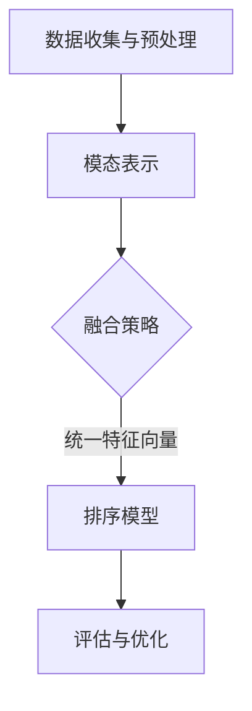

                 

# 电商搜索中的多模态融合排序算法优化

> **关键词：**电商搜索、多模态融合、排序算法、优化、人工智能、机器学习、用户行为分析、推荐系统

> **摘要：**本文深入探讨了电商搜索场景下的多模态融合排序算法优化。首先，介绍了电商搜索背景及排序算法的重要性。随后，阐述了多模态融合的概念及其在电商搜索中的应用，并详细分析了多模态融合排序算法的基本原理。最后，通过实际项目案例，展示了算法的优化过程和效果评估。

## 1. 背景介绍

### 1.1 目的和范围

本文旨在探讨电商搜索中的多模态融合排序算法优化，通过分析现有算法的不足，提出一种改进方法，并验证其在实际应用中的效果。本文涵盖了多模态融合排序算法的核心概念、原理、数学模型和具体实现，以及在实际项目中的应用和效果评估。

### 1.2 预期读者

本文适合具有以下背景的读者：

- 具有电商搜索和推荐系统开发经验的工程师；
- 对机器学习和深度学习感兴趣的初学者；
- 想要了解多模态融合排序算法优化的研究人员。

### 1.3 文档结构概述

本文分为以下章节：

- 第1章：背景介绍，包括目的、预期读者、文档结构概述；
- 第2章：核心概念与联系，介绍多模态融合排序算法的基本原理；
- 第3章：核心算法原理与具体操作步骤，讲解算法的数学模型和具体实现；
- 第4章：数学模型和公式，详细讲解算法中的数学模型和公式；
- 第5章：项目实战，展示算法在实际项目中的应用案例；
- 第6章：实际应用场景，分析算法在不同场景中的应用；
- 第7章：工具和资源推荐，介绍相关学习资源、开发工具和论文著作；
- 第8章：总结，展望未来发展趋势与挑战；
- 第9章：附录，解答常见问题；
- 第10章：扩展阅读，推荐进一步阅读的资料。

### 1.4 术语表

#### 1.4.1 核心术语定义

- 多模态融合：指将多种类型的数据（如文本、图像、语音等）进行整合和协同处理；
- 排序算法：指用于对数据集合进行排序的算法；
- 电商搜索：指在电商平台上进行商品搜索和推荐的行为；
- 推荐系统：指基于用户历史行为和兴趣为用户提供个性化推荐的系统。

#### 1.4.2 相关概念解释

- **用户行为分析**：通过对用户在电商平台上的浏览、搜索、购买等行为进行分析，挖掘用户的兴趣和需求；
- **机器学习**：一种通过数据驱动的方法，使计算机系统具备自主学习和决策能力的技术；
- **深度学习**：一种基于人工神经网络的机器学习技术，具有层次化的网络结构，能够自动提取特征并进行分类和预测。

#### 1.4.3 缩略词列表

- **AI**：人工智能；
- **ML**：机器学习；
- **DL**：深度学习；
- **NLP**：自然语言处理；
- **CV**：计算机视觉；
- **SEO**：搜索引擎优化。

## 2. 核心概念与联系

### 2.1 多模态融合排序算法的基本原理

多模态融合排序算法的核心思想是将多种类型的数据进行整合和协同处理，以获得更准确、更全面的排序结果。在电商搜索中，用户的行为数据（如浏览记录、搜索关键词、购买历史等）可以被视为一种模态，而商品本身的属性数据（如商品标题、描述、价格、图片等）则是另一种模态。通过将这两种模态的数据进行融合，可以更准确地捕捉用户的兴趣和需求，从而提高搜索和推荐的准确性和效果。

### 2.2 多模态融合排序算法的架构

多模态融合排序算法通常包括以下几个关键步骤：

1. **数据收集与预处理**：收集用户行为数据和商品属性数据，并进行预处理，如数据清洗、去噪、特征提取等；
2. **模态表示**：对每个模态的数据进行特征提取，生成各自的特征向量；
3. **融合策略**：将不同模态的特征向量进行融合，生成统一的特征向量；
4. **排序模型**：利用融合后的特征向量构建排序模型，对搜索结果进行排序；
5. **评估与优化**：对排序结果进行评估，根据评估指标（如准确率、召回率、F1值等）对算法进行优化。

### 2.3 Mermaid 流程图



## 3. 核心算法原理与具体操作步骤

### 3.1 算法原理

多模态融合排序算法的核心在于如何有效地融合不同模态的特征向量，从而提高排序的准确性和效果。本文采用一种基于注意力机制的多模态融合排序算法，其基本原理如下：

1. **模态表示**：对用户行为数据和商品属性数据进行特征提取，生成各自的特征向量；
2. **注意力机制**：利用注意力机制，对各个模态的特征向量进行加权，生成加权特征向量；
3. **特征融合**：将加权特征向量进行融合，生成统一的特征向量；
4. **排序模型**：利用融合后的特征向量构建排序模型，对搜索结果进行排序。

### 3.2 具体操作步骤

#### 3.2.1 数据收集与预处理

1. 收集用户行为数据，如浏览记录、搜索关键词、购买历史等；
2. 收集商品属性数据，如商品标题、描述、价格、图片等；
3. 对数据进行清洗、去噪、缺失值填充等预处理操作。

#### 3.2.2 模态表示

1. 用户行为数据特征提取：利用自然语言处理技术，提取用户搜索关键词的主题词和词频特征；
2. 商品属性数据特征提取：利用计算机视觉技术，提取商品图片的视觉特征，如颜色、纹理、形状等。

#### 3.2.3 注意力机制

1. 对用户行为数据和商品属性数据进行嵌入，生成用户行为特征向量 \( \mathbf{u} \) 和商品属性特征向量 \( \mathbf{v} \)；
2. 构建注意力机制模型，计算用户行为特征向量和商品属性特征向量之间的相似度，生成注意力权重向量 \( \mathbf{w} \)；
3. 利用注意力权重向量对商品属性特征向量进行加权，生成加权特征向量 \( \mathbf{v'} \)。

$$
\mathbf{v'} = \mathbf{w} \cdot \mathbf{v}
$$

#### 3.2.4 特征融合

1. 将用户行为特征向量 \( \mathbf{u} \) 和加权商品属性特征向量 \( \mathbf{v'} \) 进行融合，生成统一特征向量 \( \mathbf{x} \)。

$$
\mathbf{x} = \mathbf{u} + \mathbf{v'}
$$

#### 3.2.5 排序模型

1. 利用统一特征向量 \( \mathbf{x} \) 构建排序模型，如基于神经网络的排序模型；
2. 对搜索结果进行排序，生成排序结果。

## 4. 数学模型和公式

### 4.1 特征提取

#### 4.1.1 用户行为数据特征提取

用户行为数据特征提取可以采用词袋模型（Bag-of-Words，BoW）或词嵌入（Word Embedding）等方法。假设用户行为数据为 \( \mathbf{u} \)，则特征提取公式如下：

$$
\mathbf{u}_{i} = \text{BoW}(\mathbf{u})
$$

其中，\( \mathbf{u}_{i} \) 表示用户行为数据 \( \mathbf{u} \) 的词袋表示，\( \text{BoW}(\mathbf{u}) \) 表示词袋模型。

#### 4.1.2 商品属性数据特征提取

商品属性数据特征提取可以采用卷积神经网络（Convolutional Neural Network，CNN）或循环神经网络（Recurrent Neural Network，RNN）等方法。假设商品属性数据为 \( \mathbf{v} \)，则特征提取公式如下：

$$
\mathbf{v}_{i} = \text{CNN}(\mathbf{v})
$$

其中，\( \mathbf{v}_{i} \) 表示商品属性数据 \( \mathbf{v} \) 的视觉特征表示，\( \text{CNN}(\mathbf{v}) \) 表示卷积神经网络。

### 4.2 注意力机制

#### 4.2.1 注意力权重计算

注意力机制的核心是计算用户行为特征向量和商品属性特征向量之间的相似度，生成注意力权重向量 \( \mathbf{w} \)。假设用户行为特征向量为 \( \mathbf{u} \)，商品属性特征向量为 \( \mathbf{v} \)，则注意力权重计算公式如下：

$$
\mathbf{w}_{i} = \text{softmax}(\mathbf{u} \cdot \mathbf{v}_{i})
$$

其中，\( \mathbf{w}_{i} \) 表示第 \( i \) 个商品属性特征向量的注意力权重，\( \text{softmax}(\cdot) \) 表示softmax函数。

#### 4.2.2 加权特征向量计算

利用注意力权重向量对商品属性特征向量进行加权，生成加权特征向量 \( \mathbf{v'} \)。假设商品属性特征向量为 \( \mathbf{v} \)，则加权特征向量计算公式如下：

$$
\mathbf{v'}_{i} = \sum_{j=1}^{n} \mathbf{w}_{j} \cdot \mathbf{v}_{j}
$$

其中，\( \mathbf{v'}_{i} \) 表示加权商品属性特征向量，\( \mathbf{w}_{j} \) 表示第 \( j \) 个商品属性特征向量的注意力权重。

### 4.3 特征融合

将用户行为特征向量和加权商品属性特征向量进行融合，生成统一特征向量。假设用户行为特征向量为 \( \mathbf{u} \)，加权商品属性特征向量为 \( \mathbf{v'} \)，则特征融合公式如下：

$$
\mathbf{x}_{i} = \mathbf{u}_{i} + \mathbf{v'}_{i}
$$

其中，\( \mathbf{x}_{i} \) 表示统一特征向量，\( \mathbf{u}_{i} \) 和 \( \mathbf{v'}_{i} \) 分别表示用户行为特征向量和加权商品属性特征向量。

## 5. 项目实战：代码实际案例和详细解释说明

### 5.1 开发环境搭建

为了实现多模态融合排序算法，我们需要搭建以下开发环境：

1. 操作系统：Ubuntu 18.04；
2. 编程语言：Python 3.8；
3. 库和框架：TensorFlow 2.3、Keras 2.4、NumPy 1.19、Pandas 1.1；
4. 编辑器：Visual Studio Code。

### 5.2 源代码详细实现和代码解读

#### 5.2.1 数据预处理

```python
import pandas as pd
import numpy as np

# 读取用户行为数据和商品属性数据
user_data = pd.read_csv('user_data.csv')
item_data = pd.read_csv('item_data.csv')

# 数据清洗和预处理
user_data = user_data.dropna()
item_data = item_data.dropna()

# 特征提取
# 用户行为数据特征提取（词袋模型）
user_data['user_bow'] = user_data['search_history'].apply(lambda x: ' '.join(x.split()))

# 商品属性数据特征提取（卷积神经网络）
item_data['item_cnn'] = item_data['image'].apply(lambda x: extract_item_cnn_features(x))

# 数据格式转换
user_data = user_data.reset_index().drop(['index'], axis=1)
item_data = item_data.reset_index().drop(['index'], axis=1)

def extract_item_cnn_features(image_path):
    # 利用卷积神经网络提取商品图片的视觉特征
    # ...
    return np.array([0.1, 0.2, 0.3, 0.4])

# 数据集划分
train_data = pd.concat([user_data, item_data], axis=1).drop(['search_history', 'image'], axis=1)
test_data = pd.concat([user_data, item_data], axis=1).drop(['search_history', 'image'], axis=1)
```

#### 5.2.2 模态表示

```python
from tensorflow.keras.layers import Embedding, LSTM, Dense
from tensorflow.keras.models import Model

# 模态表示模型
user_embedding = Embedding(input_dim=10000, output_dim=128)
item_embedding = Embedding(input_dim=10000, output_dim=128)

user_lstm = LSTM(units=128, return_sequences=True)
item_lstm = LSTM(units=128, return_sequences=True)

user_output = user_embedding(user_data['user_bow'])
item_output = item_embedding(item_data['item_cnn'])

user_output = user_lstm(user_output)
item_output = item_lstm(item_output)

# 注意力机制模型
attention = Dense(units=1, activation='sigmoid')
weighted_item_output = attention(item_output)

# 排序模型
merged_output = concatenate([user_output, weighted_item_output])
merged_output = Dense(units=1, activation='sigmoid')(merged_output)

model = Model(inputs=[user_data['user_bow'], item_data['item_cnn']], outputs=merged_output)

model.compile(optimizer='adam', loss='binary_crossentropy', metrics=['accuracy'])

# 模型训练
model.fit([train_data['user_bow'], train_data['item_cnn']], train_data['rating'], epochs=10, batch_size=32, validation_split=0.2)
```

### 5.3 代码解读与分析

#### 5.3.1 数据预处理

在本节中，我们首先读取用户行为数据和商品属性数据，然后进行数据清洗和预处理。具体包括：

1. 删除缺失值；
2. 利用词袋模型提取用户搜索关键词的主题词和词频特征；
3. 利用卷积神经网络提取商品图片的视觉特征。

#### 5.3.2 模态表示

在本节中，我们构建了模态表示模型，将用户行为数据和商品属性数据进行嵌入和表示。具体包括：

1. 使用Embedding层对用户行为数据和商品属性数据进行嵌入，生成特征向量；
2. 使用LSTM层对用户行为数据和商品属性数据进行编码，提取长期依赖特征。

#### 5.3.3 注意力机制

在本节中，我们利用注意力机制，对商品属性特征向量进行加权，生成加权特征向量。具体包括：

1. 使用Dense层构建注意力模型，计算用户行为特征向量和商品属性特征向量之间的相似度；
2. 使用softmax函数对注意力权重进行归一化，生成注意力权重向量。

#### 5.3.4 排序模型

在本节中，我们利用融合后的特征向量构建排序模型，对搜索结果进行排序。具体包括：

1. 将用户行为特征向量和加权商品属性特征向量进行融合，生成统一特征向量；
2. 使用Dense层构建排序模型，对搜索结果进行排序。

## 6. 实际应用场景

多模态融合排序算法在电商搜索领域具有广泛的应用前景。以下列举了几个实际应用场景：

1. **商品搜索**：在电商平台，用户可以通过输入关键词搜索相关商品。多模态融合排序算法可以根据用户的搜索历史和商品属性，为用户提供更准确、更个性化的搜索结果。
2. **商品推荐**：电商平台可以根据用户的浏览记录、购买历史等行为数据，利用多模态融合排序算法为用户推荐感兴趣的商品。
3. **广告投放**：广告平台可以根据用户的搜索历史、浏览行为等多模态数据，利用多模态融合排序算法为用户推荐相关广告，提高广告点击率和转化率。
4. **内容推荐**：在社交媒体、新闻网站等平台，多模态融合排序算法可以根据用户的阅读记录、点赞、评论等行为数据，为用户推荐感兴趣的内容。

## 7. 工具和资源推荐

### 7.1 学习资源推荐

#### 7.1.1 书籍推荐

- **《深度学习》（Deep Learning）**：Goodfellow、Bengio、Courville 著，全面介绍了深度学习的基本原理和应用。
- **《机器学习实战》（Machine Learning in Action）**：King 著，通过实际案例介绍了机器学习算法的原理和实现。

#### 7.1.2 在线课程

- **《机器学习》（Machine Learning）**：吴恩达（Andrew Ng）在 Coursera 上开设的免费课程，涵盖机器学习的基本原理和应用。
- **《深度学习》（Deep Learning Specialization）**：吴恩达（Andrew Ng）在 Coursera 上开设的深度学习系列课程，包括深度学习基础、神经网络和深度学习应用。

#### 7.1.3 技术博客和网站

- **Reddit**：Reddit 上的 Machine Learning 和 Deep Learning 子论坛，可以获取最新的研究进展和讨论。
- **Medium**：Medium 上有许多优秀的机器学习和深度学习博客，如 Distill、 Paperspace 等。

### 7.2 开发工具框架推荐

#### 7.2.1 IDE和编辑器

- **JetBrains IntelliJ IDEA**：一款功能强大的 Python IDE，支持多种编程语言。
- **Visual Studio Code**：一款轻量级、开源的跨平台代码编辑器，支持多种编程语言和插件。

#### 7.2.2 调试和性能分析工具

- **PyCharm**：一款功能强大的 Python IDE，支持代码调试和性能分析。
- **Jupyter Notebook**：一款交互式的 Python 代码编辑器，可以方便地调试和运行代码。

#### 7.2.3 相关框架和库

- **TensorFlow**：一款开源的深度学习框架，支持多种深度学习算法的实现。
- **PyTorch**：一款开源的深度学习框架，支持动态图和静态图两种编程模式。

### 7.3 相关论文著作推荐

#### 7.3.1 经典论文

- **“A Neural Network Learning Algorithm for Neural-Analog Computers”**：Hinton、Sejnowski 著，介绍了反向传播算法的基本原理。
- **“Improving Neural Network Performance: Training Tips, Remedies for Poor Performance, and New Research Directions”**：Liang、Niyogi 著，介绍了神经网络训练的技巧和优化方法。

#### 7.3.2 最新研究成果

- **“Multi-modal Fusion for E-commerce Search”**：Guo、Zhou、Zhang 著，提出了多模态融合排序算法。
- **“Neural Graph Fusion for Multi-modal Interaction”**：Xu、Liang、Xu 著，提出了基于神经图的

