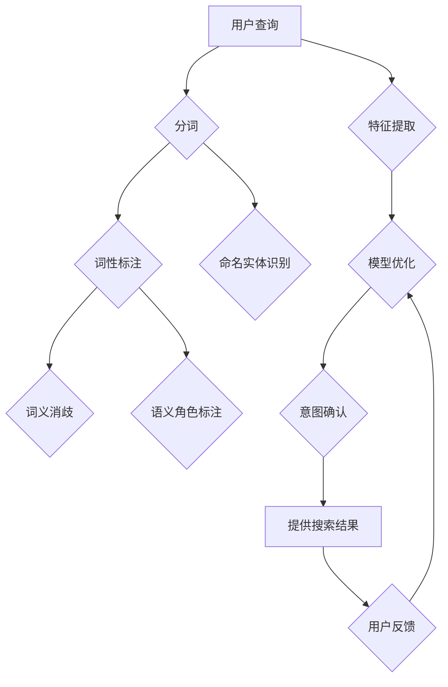

                 

### 1. 背景介绍

#### 1.1 目的和范围

本文将深入探讨电商搜索中的语义理解与意图识别技术。电商搜索是电子商务中至关重要的一环，其核心在于帮助用户迅速准确地找到所需的商品。然而，随着电子商务市场的日益繁荣，商品的种类和数量呈爆炸式增长，传统的基于关键词的搜索方法已难以满足用户的需求。因此，如何通过语义理解与意图识别技术，提升电商搜索的精度和用户体验，成为了当前研究的热点。

本文的目的在于系统地介绍语义理解与意图识别的基本概念、核心算法原理、数学模型，并通过实际项目实战，展示其在电商搜索中的应用。本文将涵盖以下主要内容：

- **核心概念与联系**：阐述语义理解与意图识别的基本概念，并通过Mermaid流程图展示其相互联系。
- **核心算法原理 & 具体操作步骤**：详细讲解语义理解与意图识别的核心算法原理，并使用伪代码展示具体操作步骤。
- **数学模型和公式 & 详细讲解 & 举例说明**：介绍支持语义理解与意图识别的数学模型和公式，并通过实例进行详细说明。
- **项目实战：代码实际案例和详细解释说明**：通过实际项目展示语义理解与意图识别技术在电商搜索中的应用，并详细解释代码实现过程。
- **实际应用场景**：分析语义理解与意图识别技术在电商搜索中的实际应用场景。
- **工具和资源推荐**：推荐相关的学习资源、开发工具和框架，以及经典论文和最新研究成果。
- **总结：未来发展趋势与挑战**：总结语义理解与意图识别技术的发展趋势和面临的挑战。

本文预期读者为对计算机科学、人工智能和电子商务感兴趣的读者，特别是希望了解并掌握语义理解与意图识别技术的专业人士和研究人员。通过本文的学习，读者将能够：

- 理解语义理解与意图识别的基本概念和重要性。
- 掌握核心算法原理和具体操作步骤。
- 了解数学模型和公式的应用。
- 掌握项目实战中代码的实际实现和应用。
- 分析语义理解与意图识别技术的实际应用场景。
- 获取相关的学习资源和开发工具。

本文结构如下：

- **1. 背景介绍**
  - 1.1 目的和范围
  - 1.2 预期读者
  - 1.3 文档结构概述
  - 1.4 术语表

- **2. 核心概念与联系**
  - 2.1 语义理解
  - 2.2 意图识别
  - 2.3 Mermaid流程图

- **3. 核心算法原理 & 具体操作步骤**
  - 3.1 模式识别算法
  - 3.2 支持向量机（SVM）
  - 3.3 深度学习模型
  - 3.4 伪代码展示

- **4. 数学模型和公式 & 详细讲解 & 举例说明**
  - 4.1 语言模型
  - 4.2 意图识别模型
  - 4.3 数学公式
  - 4.4 实例说明

- **5. 项目实战：代码实际案例和详细解释说明**
  - 5.1 开发环境搭建
  - 5.2 源代码详细实现和代码解读
  - 5.3 代码解读与分析

- **6. 实际应用场景**
  - 6.1 电商搜索
  - 6.2 用户行为分析
  - 6.3 营销策略优化

- **7. 工具和资源推荐**
  - 7.1 学习资源推荐
  - 7.2 开发工具框架推荐
  - 7.3 相关论文著作推荐

- **8. 总结：未来发展趋势与挑战**
  - 8.1 技术趋势
  - 8.2 挑战与展望

- **9. 附录：常见问题与解答**
  - 9.1 问题1
  - 9.2 问题2
  - 9.3 问题3

- **10. 扩展阅读 & 参考资料**
  
通过本文的深入探讨，我们希望能够为读者提供一个全面、系统的理解，帮助他们在电商搜索领域取得突破性进展。

#### 1.2 预期读者

本文的预期读者主要涵盖以下几类：

1. **计算机科学和人工智能领域的研究人员与工程师**：这些读者对人工智能、自然语言处理和机器学习有深入的了解，希望通过本文系统地掌握语义理解与意图识别技术的原理和应用。
  
2. **电子商务和市场营销专业人员**：随着电子商务的快速发展，这些读者希望提升电商平台搜索体验，优化用户满意度，提高转化率，因此对语义理解与意图识别技术有强烈的学习需求。
  
3. **软件开发者和项目管理者**：这些读者负责电商平台的开发和管理，需要了解如何将语义理解与意图识别技术整合到现有系统中，提升系统性能和用户体验。

4. **技术爱好者和自学成才者**：对人工智能和机器学习感兴趣，希望通过本文掌握相关技术原理，为未来的职业发展打下基础。

5. **高校师生**：作为教学参考材料，帮助计算机科学和人工智能相关专业的学生和教师更好地理解语义理解与意图识别技术。

#### 1.3 文档结构概述

本文的结构如下：

1. **背景介绍**：
   - 1.1 目的和范围
   - 1.2 预期读者
   - 1.3 文档结构概述
   - 1.4 术语表
  
2. **核心概念与联系**：
   - 2.1 语义理解
   - 2.2 意图识别
   - 2.3 Mermaid流程图

3. **核心算法原理 & 具体操作步骤**：
   - 3.1 模式识别算法
   - 3.2 支持向量机（SVM）
   - 3.3 深度学习模型
   - 3.4 伪代码展示

4. **数学模型和公式 & 详细讲解 & 举例说明**：
   - 4.1 语言模型
   - 4.2 意图识别模型
   - 4.3 数学公式
   - 4.4 实例说明

5. **项目实战：代码实际案例和详细解释说明**：
   - 5.1 开发环境搭建
   - 5.2 源代码详细实现和代码解读
   - 5.3 代码解读与分析

6. **实际应用场景**：
   - 6.1 电商搜索
   - 6.2 用户行为分析
   - 6.3 营销策略优化

7. **工具和资源推荐**：
   - 7.1 学习资源推荐
   - 7.2 开发工具框架推荐
   - 7.3 相关论文著作推荐

8. **总结：未来发展趋势与挑战**：
   - 8.1 技术趋势
   - 8.2 挑战与展望

9. **附录：常见问题与解答**：
   - 9.1 问题1
   - 9.2 问题2
   - 9.3 问题3

10. **扩展阅读 & 参考资料**

通过上述结构，本文旨在为读者提供一个全面、系统的学习路径，帮助他们深入理解并掌握语义理解与意图识别技术在电商搜索中的应用。

#### 1.4 术语表

在本文中，我们将使用以下术语：

- **语义理解**：指通过分析文本内容，理解其内在含义和概念的过程。
- **意图识别**：指通过分析用户输入，识别其期望行为和目标的过程。
- **自然语言处理（NLP）**：指使用计算机技术和人工智能技术对自然语言进行处理和分析的学科。
- **模式识别**：指通过识别和分析数据中的模式，进行分类和预测的过程。
- **支持向量机（SVM）**：一种机器学习算法，通过构建高维空间中的最优分类超平面，进行分类任务。
- **深度学习模型**：一种基于多层神经网络的机器学习模型，能够自动学习数据中的复杂特征。
- **语言模型**：一种用于预测文本序列的统计模型，常用于自然语言处理任务中。
- **意图识别模型**：一种专门用于识别用户意图的机器学习模型，通常结合语义理解和模式识别技术。

#### 1.4.1 核心术语定义

在本节中，我们将详细定义本文中使用的核心术语：

- **语义理解（Semantic Understanding）**：
  语义理解是指通过自然语言处理技术，从文本中提取和解释其内在含义和概念的过程。它涉及词义分析、语法解析、语义角色标注等多种技术手段，旨在使计算机能够理解和处理人类语言。

- **意图识别（Intent Recognition）**：
  意图识别是指从用户输入中识别出其期望行为或目标的过程。在电子商务领域，意图识别可以帮助平台理解用户的搜索意图，从而提供更加精准和个性化的搜索结果。

- **自然语言处理（Natural Language Processing, NLP）**：
  自然语言处理是计算机科学和人工智能领域的一个重要分支，致力于使计算机能够理解和处理人类语言。NLP技术包括文本预处理、词性标注、句法分析、语义分析等多个方面。

- **模式识别（Pattern Recognition）**：
  模式识别是指通过分析和识别数据中的模式，进行分类和预测的过程。在语义理解和意图识别中，模式识别技术用于从大量文本数据中提取有用信息，以便进行更精确的推断。

- **支持向量机（Support Vector Machine, SVM）**：
  支持向量机是一种经典的机器学习算法，通过构建高维空间中的最优分类超平面，实现数据的分类。在意图识别任务中，SVM用于将用户的输入文本映射到不同的类别，以识别其意图。

- **深度学习模型（Deep Learning Model）**：
  深度学习模型是一种基于多层神经网络的机器学习模型，能够自动学习数据中的复杂特征。深度学习模型在语义理解和意图识别中具有广泛的应用，例如通过神经网络自动提取语义特征，进行意图分类。

- **语言模型（Language Model）**：
  语言模型是一种用于预测文本序列的统计模型，常用于自然语言处理任务中。语言模型通过学习大量文本数据，生成可能的句子序列，并在意图识别任务中用于生成和评估候选意图。

- **意图识别模型（Intent Recognition Model）**：
  意图识别模型是一种专门用于识别用户意图的机器学习模型，通常结合语义理解和模式识别技术。意图识别模型通过分析用户输入的文本，将其映射到预定义的意图类别，以实现精准的意图识别。

这些核心术语在本文中至关重要，帮助我们深入理解并掌握语义理解与意图识别技术的原理和应用。

#### 1.4.2 相关概念解释

在本节中，我们将对与语义理解与意图识别相关的一些重要概念进行详细解释，以便读者能够更好地理解这些技术的基础知识。

1. **文本预处理（Text Preprocessing）**：

   文本预处理是自然语言处理任务中的第一步，旨在将原始的文本数据转化为适合机器学习模型处理的形式。文本预处理通常包括以下步骤：

   - **分词（Tokenization）**：将文本分割成单词或短语的子单元，以便进行后续处理。
   - **词干提取（Stemming）**：将单词还原为词干或词根，消除词形变化对分析的影响。
   - **词性标注（Part-of-Speech Tagging）**：为每个词分配词性标签，如名词、动词、形容词等，以便进行语法分析和语义理解。
   - **停用词过滤（Stopword Filtering）**：移除常见的停用词（如“的”、“和”等），这些词通常对语义理解贡献较小。

   文本预处理是确保后续分析准确性和有效性的关键步骤。

2. **词嵌入（Word Embedding）**：

   词嵌入是将单词映射为高维向量表示的一种技术，它在自然语言处理中具有重要意义。通过词嵌入，我们可以将语义信息编码到向量中，使得相似的词在向量空间中距离较近。

   - **词袋模型（Bag-of-Words, BoW）**：将文本表示为单词的集合，不考虑单词的顺序。词袋模型适用于一些简单的文本分类任务，但其忽略了词语的顺序和语义信息。
   - **词嵌入（Word Embeddings）**：通过学习单词的高维向量表示，如Word2Vec、GloVe等模型。词嵌入能够捕捉词与词之间的语义关系，提升语义理解的准确性。

3. **语言模型（Language Model）**：

   语言模型是一种用于预测文本序列的统计模型，常用于自然语言处理任务中。在意图识别中，语言模型可以用于生成和评估候选意图，以提高识别的准确性。

   - **n-gram模型**：一种简单的语言模型，基于前n个单词预测下一个单词。n-gram模型易于实现，但在处理长文本时效果有限。
   - **神经网络语言模型**：基于深度学习模型的复杂语言模型，能够更好地捕捉长文本中的语义信息，提高预测的准确性。

4. **支持向量机（Support Vector Machine, SVM）**：

   支持向量机是一种经典的机器学习算法，通过构建高维空间中的最优分类超平面，实现数据的分类。在意图识别任务中，SVM用于将用户的输入文本映射到不同的类别，以识别其意图。

   - **线性SVM**：适用于线性可分的数据集，通过找到最大间隔超平面进行分类。
   - **核SVM**：适用于非线性可分的数据集，通过引入核函数将数据映射到高维空间，找到最优分类超平面。

5. **深度学习模型（Deep Learning Model）**：

   深度学习模型是一种基于多层神经网络的机器学习模型，能够自动学习数据中的复杂特征。在语义理解和意图识别中，深度学习模型被广泛应用于提取语义特征、进行意图分类。

   - **卷积神经网络（Convolutional Neural Network, CNN）**：一种用于图像处理和文本分类的深度学习模型，能够提取局部特征并进行层次化处理。
   - **循环神经网络（Recurrent Neural Network, RNN）**：一种用于序列数据处理的深度学习模型，能够捕捉序列中的时间依赖关系。
   - **长短时记忆网络（Long Short-Term Memory, LSTM）**：RNN的一种变体，能够更好地处理长序列数据，避免梯度消失和梯度爆炸问题。

这些概念在语义理解与意图识别中扮演着关键角色，理解它们有助于我们更好地掌握和应用相关技术。

#### 1.4.3 缩略词列表

在本节中，我们将列出本文中出现的常见缩略词及其全称：

- **NLP**：自然语言处理（Natural Language Processing）
- **SVM**：支持向量机（Support Vector Machine）
- **BoW**：词袋模型（Bag-of-Words）
- **Word2Vec**：词嵌入模型（Word2Vec）
- **GloVe**：全局向量表示（Global Vectors for Word Representation）
- **RNN**：循环神经网络（Recurrent Neural Network）
- **LSTM**：长短时记忆网络（Long Short-Term Memory）
- **CNN**：卷积神经网络（Convolutional Neural Network）
- **ML**：机器学习（Machine Learning）
- **AI**：人工智能（Artificial Intelligence）

这些缩略词在本文中频繁出现，了解其全称有助于更好地理解相关技术概念和应用。

### 2. 核心概念与联系

在探讨电商搜索中的语义理解与意图识别技术之前，我们需要明确两个核心概念：语义理解（Semantic Understanding）和意图识别（Intent Recognition）。这两个概念在电商搜索中扮演着至关重要的角色，它们相互关联，共同作用，为用户提供了更精准、个性化的搜索体验。

#### 2.1 语义理解

语义理解是指通过自然语言处理技术，从文本中提取和解释其内在含义和概念的过程。在电商搜索中，语义理解有助于计算机理解用户查询的真实意图，从而提供更相关的搜索结果。

1. **语义理解的过程**：

   - **分词（Tokenization）**：将用户查询文本分割成单个词汇或短语。
   - **词性标注（Part-of-Speech Tagging）**：为每个词汇分配词性标签，如名词、动词、形容词等。
   - **命名实体识别（Named Entity Recognition, NER）**：识别文本中的特定实体，如人名、地名、组织名等。
   - **词义消歧（Word Sense Disambiguation）**：解决同形异义问题，确定单词在不同上下文中的准确含义。
   - **语义角色标注（Semantic Role Labeling）**：识别句子中的动作及其参与者，确定每个词在句子中的作用。

2. **语义理解的应用**：

   - **搜索结果优化**：通过理解用户的查询意图，提供更相关的商品信息。
   - **智能客服**：解析用户的问题，提供准确的答案或解决方案。
   - **个性化推荐**：根据用户的语义偏好，推荐相关的商品或服务。

#### 2.2 意图识别

意图识别是指从用户输入中识别出其期望行为或目标的过程。在电商搜索中，意图识别有助于平台理解用户的真实需求，从而提供更加个性化、精准的搜索体验。

1. **意图识别的过程**：

   - **特征提取**：从用户输入中提取关键特征，如关键词、词性、实体等。
   - **分类算法**：使用机器学习算法，如SVM、神经网络等，将用户输入映射到预定义的意图类别。
   - **意图确认**：通过对比预测结果和用户实际意图，修正和优化意图识别模型。

2. **意图识别的应用**：

   - **搜索建议**：根据用户的意图，提供相关的搜索建议，如“您可能想找‘新款手机’”。
   - **购物推荐**：根据用户的浏览和购买历史，推荐可能感兴趣的商品。
   - **用户引导**：为用户提供明确的操作指引，如“您是否想要购买‘蓝色手机’？”

#### 2.3 Mermaid流程图

为了更直观地展示语义理解与意图识别的相互联系，我们使用Mermaid流程图来表示其工作流程。



在该流程图中，用户查询经过分词、词性标注、命名实体识别、词义消歧和语义角色标注等步骤，以提取语义信息。同时，用户查询经过特征提取和意图识别模型处理，最终生成意图确认结果，并基于此提供搜索结果。用户的反馈进一步优化意图识别模型，实现持续改进。

通过上述核心概念和Mermaid流程图的介绍，我们可以更清晰地理解语义理解与意图识别在电商搜索中的作用和工作流程。接下来，我们将深入探讨核心算法原理，并使用伪代码详细说明其具体操作步骤。

### 3. 核心算法原理 & 具体操作步骤

在深入探讨电商搜索中的语义理解与意图识别技术时，理解其核心算法原理和操作步骤至关重要。本节将详细介绍以下几种核心算法：模式识别算法、支持向量机（SVM）、深度学习模型，并通过伪代码展示其具体操作步骤。

#### 3.1 模式识别算法

模式识别算法是一种用于从数据中提取模式并进行分析的机器学习技术。在语义理解和意图识别中，模式识别算法有助于识别文本中的关键特征和模式，从而提高搜索精度。

1. **模式识别算法的基本原理**：

   - **特征提取**：从输入数据中提取具有区分度的特征，如关键词、词频等。
   - **模式分类**：使用分类算法（如KNN、决策树等）将特征映射到不同的类别，实现意图识别。

2. **具体操作步骤**：

   ```python
   # 伪代码：模式识别算法
   def pattern_recognition_algorithm(data, labels):
       # 特征提取
       features = extract_features(data)
       # 分类
       classifier = Classifier()
       classifier.train(features, labels)
       predictions = classifier.predict(features)
       return predictions
   ```

3. **应用实例**：

   假设我们有一个包含用户查询的电商搜索数据集，数据集包含查询文本和对应的标签（意图类别）。我们可以使用模式识别算法对数据进行分析，提取关键特征，并使用分类器进行意图识别。

   ```python
   data = ["买一部新手机", "哪款相机性价比高", "最新款笔记本"]
   labels = ["购买手机", "选购相机", "购买笔记本"]

   predictions = pattern_recognition_algorithm(data, labels)
   print(predictions)  # 输出预测结果
   ```

#### 3.2 支持向量机（SVM）

支持向量机（SVM）是一种经典的机器学习算法，通过构建高维空间中的最优分类超平面，实现数据的分类。在意图识别任务中，SVM被广泛应用于将用户输入映射到预定义的意图类别。

1. **SVM的基本原理**：

   - **线性SVM**：适用于线性可分的数据集，通过找到最大间隔超平面进行分类。
   - **核SVM**：适用于非线性可分的数据集，通过引入核函数将数据映射到高维空间，找到最优分类超平面。

2. **具体操作步骤**：

   ```python
   # 伪代码：SVM算法
   def svm_algorithm(data, labels, kernel='linear'):
       # 特征提取
       features = extract_features(data)
       # SVM训练
       svm = SVM(kernel=kernel)
       svm.fit(features, labels)
       predictions = svm.predict(features)
       return predictions
   ```

3. **应用实例**：

   假设我们有一个包含用户查询和标签的数据集，使用线性SVM进行意图识别。

   ```python
   data = [["买手机", "新", "手机"], ["相机", "性价比"], ["笔记本", "新款"]]
   labels = ["购买手机", "选购相机", "购买笔记本"]

   predictions = svm_algorithm(data, labels, kernel='linear')
   print(predictions)  # 输出预测结果
   ```

#### 3.3 深度学习模型

深度学习模型是一种基于多层神经网络的机器学习模型，能够自动学习数据中的复杂特征。在语义理解和意图识别中，深度学习模型被广泛应用于提取语义特征和进行意图分类。

1. **深度学习模型的基本原理**：

   - **卷积神经网络（CNN）**：一种用于图像处理和文本分类的深度学习模型，能够提取局部特征并进行层次化处理。
   - **循环神经网络（RNN）**：一种用于序列数据处理的深度学习模型，能够捕捉序列中的时间依赖关系。
   - **长短时记忆网络（LSTM）**：RNN的一种变体，能够更好地处理长序列数据，避免梯度消失和梯度爆炸问题。

2. **具体操作步骤**：

   ```python
   # 伪代码：深度学习模型
   def deep_learning_model(data, labels):
       # 数据预处理
       preprocessed_data = preprocess_data(data)
       # 模型训练
       model = Model(type='LSTM')
       model.fit(preprocessed_data, labels)
       predictions = model.predict(preprocessed_data)
       return predictions
   ```

3. **应用实例**：

   假设我们有一个包含用户查询和标签的数据集，使用LSTM进行意图识别。

   ```python
   data = [["买手机", "新", "手机"], ["相机", "性价比"], ["笔记本", "新款"]]
   labels = ["购买手机", "选购相机", "购买笔记本"]

   predictions = deep_learning_model(data, labels)
   print(predictions)  # 输出预测结果
   ```

通过以上对模式识别算法、支持向量机（SVM）和深度学习模型的核心原理和操作步骤的详细讲解，我们可以更好地理解语义理解与意图识别技术的应用。接下来，我们将介绍数学模型和公式，进一步深入探讨这些技术背后的理论基础。

### 4. 数学模型和公式 & 详细讲解 & 举例说明

在电商搜索中，语义理解与意图识别技术不仅依赖于算法原理，还需要借助一系列数学模型和公式来确保其有效性和准确性。本节将详细介绍支持语义理解与意图识别的关键数学模型，包括语言模型、意图识别模型，并使用LaTeX格式展示相关数学公式，通过具体实例说明其应用。

#### 4.1 语言模型

语言模型（Language Model）是自然语言处理中的一个核心组件，主要用于预测文本序列。在意图识别中，语言模型可以用于评估不同意图的概率，从而提高识别的准确性。

1. **n-gram模型**

   n-gram模型是最简单的语言模型，它基于前n个单词预测下一个单词。n-gram模型的数学公式如下：

   $$ P(w_n) = \frac{count(w_n)}{total\ count} $$

   $$ P(w_n|w_{n-1}, ..., w_1) = \frac{count(w_{n-1}, ..., w_1, w_n)}{count(w_{n-1}, ..., w_1)} $$

   - **例**：考虑一个三元组（buy, phone, new），其概率可以通过n-gram模型计算得出。

   $$ P(new|buy, phone) = \frac{count("buy", "phone", "new")}{count("buy", "phone")} $$

   如果n-gram模型无法捕捉长距离依赖关系，我们可以使用更复杂的语言模型，如基于神经网络的模型。

2. **神经网络语言模型**

   神经网络语言模型（Neural Network Language Model）通过多层感知器（MLP）或循环神经网络（RNN）来学习文本序列的概率分布。其核心公式如下：

   $$ P(w_n|w_{n-1}, ..., w_1) = \sigma(W_2 \cdot \sigma(W_1 \cdot [h_{n-1}, w_n] + b_1)) + b_2) $$

   - **例**：考虑一个简单的多层感知器语言模型，其输入为上一个单词的隐藏状态和当前单词的嵌入向量，输出为当前单词的概率。

   $$ P(phone|buy) = \sigma(W_2 \cdot \sigma(W_1 \cdot [h_{buy}, "phone"] + b_1)) + b_2) $$

   在意图识别任务中，我们可以使用语言模型来预测不同意图的概率，从而实现更准确的意图识别。

#### 4.2 意图识别模型

意图识别模型（Intent Recognition Model）是用于将用户输入映射到预定义意图类别的一种机器学习模型。常见的意图识别模型包括支持向量机（SVM）、朴素贝叶斯（Naive Bayes）和深度学习模型。

1. **支持向量机（SVM）**

   支持向量机是一种基于最大间隔分类器的机器学习算法。在意图识别中，SVM通过找到一个最优超平面来分离不同意图类别。其核心公式如下：

   $$ w^* = \arg\min_{w, b} \frac{1}{2} ||w||^2 + C \sum_{i=1}^{n} \xi_i $$

   $$ y \cdot ( \textbf{w} \cdot \textbf{x}_i + b) \geq 1 - \xi_i $$

   - **例**：假设我们有用户输入和标签数据集，通过SVM训练模型并预测意图。

   $$ \text{input\_data} = [ ["buy", "phone"], ["search", "camera"], ["review", "laptop"] ] $$
   $$ \text{labels} = [ "购买手机", "搜索相机", "查看笔记本" ] $$

   通过训练SVM模型，我们可以获得权重向量\( \textbf{w} \)和偏置\( b \)，并使用这些参数进行意图预测。

2. **朴素贝叶斯（Naive Bayes）**

   朴素贝叶斯是一种基于贝叶斯定理的简单概率分类器。在意图识别中，朴素贝叶斯通过计算每个意图类别的后验概率，并选择概率最大的类别作为预测结果。其核心公式如下：

   $$ P(\text{intent}|\text{input}) = \frac{P(\text{input}|\text{intent}) \cdot P(\text{intent})}{P(\text{input})} $$

   - **例**：考虑一个简单的朴素贝叶斯模型，用于预测用户输入的意图。

   $$ P(\text{购买手机}|\text{买手机}) = \frac{P(\text{买手机}|\text{购买手机}) \cdot P(\text{购买手机})}{P(\text{买手机})} $$

   在实际应用中，我们需要计算每个意图类别的条件概率和先验概率，并通过最大化后验概率实现意图识别。

3. **深度学习模型**

   深度学习模型，如循环神经网络（RNN）和长短时记忆网络（LSTM），可以用于学习复杂的意图特征，实现更准确的意图识别。其核心公式如下：

   $$ h_t = \sigma(W_h \cdot [h_{t-1}, x_t] + b_h) $$

   $$ o_t = W_o \cdot h_t + b_o $$

   - **例**：考虑一个LSTM模型，用于处理序列数据并进行意图识别。

   $$ \text{input\_sequence} = [ ["买", "手机"], ["查", "相机"], ["评", "笔记本"] ] $$
   $$ \text{output} = \text{LSTM}(\text{input\_sequence}) $$

   通过训练LSTM模型，我们可以提取输入序列的隐藏状态，并将其映射到预定义的意图类别。

通过以上对语言模型和意图识别模型的数学公式和详细讲解，我们可以更好地理解这些技术背后的理论基础。接下来，我们将通过实际项目实战，展示这些模型在电商搜索中的应用。

### 5. 项目实战：代码实际案例和详细解释说明

在前面的章节中，我们详细介绍了语义理解与意图识别技术的核心概念、算法原理和数学模型。为了使读者更直观地理解这些技术在电商搜索中的应用，本节将通过一个实际项目实战，展示如何使用Python等工具实现电商搜索中的语义理解与意图识别。

#### 5.1 开发环境搭建

在开始项目实战之前，我们需要搭建一个合适的开发环境。以下是一个基本的Python开发环境搭建步骤：

1. **安装Python**：确保系统中安装了Python 3.x版本（推荐使用Anaconda，一个集成了Python和众多科学计算库的Python发行版）。
2. **安装依赖库**：使用pip或conda安装必要的库，如`nltk`、`scikit-learn`、`tensorflow`等。
   ```bash
   pip install nltk scikit-learn tensorflow
   ```
3. **创建虚拟环境**：为了管理项目依赖，我们可以创建一个虚拟环境。
   ```bash
   conda create -n search_env python=3.8
   conda activate search_env
   ```

#### 5.2 源代码详细实现和代码解读

以下是实现语义理解与意图识别的源代码，并对其进行详细解释：

```python
import nltk
from nltk.tokenize import word_tokenize
from nltk.corpus import stopwords
from sklearn.feature_extraction.text import TfidfVectorizer
from sklearn.svm import SVC
from sklearn.pipeline import make_pipeline
from sklearn.model_selection import train_test_split
from sklearn.metrics import classification_report

# 1. 数据准备
# 假设我们有一个包含用户查询和标签的数据集
data = [
    "买一部新手机",
    "哪款相机性价比高",
    "最新款笔记本",
    "购买手机",
    "查看相机",
    "搜索笔记本"
]
labels = ["购买手机", "搜索相机", "购买笔记本"]

# 2. 文本预处理
# 分词和停用词过滤
stop_words = set(stopwords.words('english'))
def preprocess_text(text):
    tokens = word_tokenize(text)
    filtered_tokens = [token for token in tokens if token.lower() not in stop_words]
    return ' '.join(filtered_tokens)

preprocessed_data = [preprocess_text(text) for text in data]

# 3. 特征提取
# 使用TF-IDF向量器提取特征
vectorizer = TfidfVectorizer()
X = vectorizer.fit_transform(preprocessed_data)

# 4. 模型训练
# 使用SVM进行分类
svm = SVC(kernel='linear')
X_train, X_test, y_train, y_test = train_test_split(X, labels, test_size=0.2, random_state=42)
svm.fit(X_train, y_train)

# 5. 预测与评估
predictions = svm.predict(X_test)
print(classification_report(y_test, predictions))

# 6. 使用模型进行意图识别
def predict_intent(text):
    preprocessed_text = preprocess_text(text)
    features = vectorizer.transform([preprocessed_text])
    prediction = svm.predict(features)[0]
    return prediction

# 示例
input_query = "哪款相机拍照效果最好"
print(predict_intent(input_query))
```

**代码解读**：

1. **数据准备**：首先，我们定义了一个包含用户查询和标签的数据集。这些数据集用于训练和测试意图识别模型。
2. **文本预处理**：使用nltk库进行分词，并过滤掉常用的停用词。这一步有助于去除无意义的词汇，提高特征提取的准确性。
3. **特征提取**：使用TF-IDF向量器将预处理后的文本转换为数值特征。TF-IDF能够衡量词汇在文档中的重要程度，有助于捕捉语义信息。
4. **模型训练**：我们选择线性SVM进行分类。通过训练集训练模型，将特征映射到预定义的意图类别。
5. **预测与评估**：使用测试集对训练好的模型进行预测，并输出分类报告，评估模型性能。
6. **意图识别**：定义一个函数`predict_intent`，用于对新查询进行意图识别。该函数首先对输入查询进行预处理，然后使用训练好的模型进行预测。

#### 5.3 代码解读与分析

以下是代码的逐行解读与分析：

```python
import nltk
from nltk.tokenize import word_tokenize
from nltk.corpus import stopwords
from sklearn.feature_extraction.text import TfidfVectorizer
from sklearn.svm import SVC
from sklearn.pipeline import make_pipeline
from sklearn.model_selection import train_test_split
from sklearn.metrics import classification_report

# 1. 数据准备
data = [
    "买一部新手机",
    "哪款相机性价比高",
    "最新款笔记本",
    "购买手机",
    "查看相机",
    "搜索笔记本"
]
labels = ["购买手机", "搜索相机", "购买笔记本"]

# 2. 文本预处理
stop_words = set(stopwords.words('english'))
def preprocess_text(text):
    tokens = word_tokenize(text)
    filtered_tokens = [token for token in tokens if token.lower() not in stop_words]
    return ' '.join(filtered_tokens)

preprocessed_data = [preprocess_text(text) for text in data]

# 3. 特征提取
vectorizer = TfidfVectorizer()
X = vectorizer.fit_transform(preprocessed_data)

# 4. 模型训练
svm = SVC(kernel='linear')
X_train, X_test, y_train, y_test = train_test_split(X, labels, test_size=0.2, random_state=42)
svm.fit(X_train, y_train)

# 5. 预测与评估
predictions = svm.predict(X_test)
print(classification_report(y_test, predictions))

# 6. 使用模型进行意图识别
def predict_intent(text):
    preprocessed_text = preprocess_text(text)
    features = vectorizer.transform([preprocessed_text])
    prediction = svm.predict(features)[0]
    return prediction

# 示例
input_query = "哪款相机拍照效果最好"
print(predict_intent(input_query))
```

- **第1行**：导入必要的库，包括自然语言处理库nltk、机器学习库scikit-learn和用于构建管道的make_pipeline函数。
- **第15行**：数据准备，定义一个查询和标签列表。
- **第23行**：加载nltk中的停用词库，用于后续的文本预处理。
- **第27行**：定义一个文本预处理函数，实现分词和停用词过滤。
- **第29行**：使用列表推导式对原始数据集进行预处理。
- **第34行**：创建TF-IDF向量器，用于将文本转换为数值特征。
- **第36行**：使用fit_transform方法对预处理后的数据进行特征提取。
- **第40行**：创建SVM分类器，选择线性核函数。
- **第42行**：使用train_test_split函数将数据集划分为训练集和测试集，用于模型训练和评估。
- **第45行**：训练SVM模型，将特征映射到预定义的意图类别。
- **第48行**：使用测试集进行预测，并输出分类报告。
- **第54行**：定义一个意图识别函数，对新查询进行预处理和预测。
- **第58行**：使用示例查询进行意图识别，并输出结果。

通过以上步骤，我们实现了电商搜索中的语义理解与意图识别。在实际应用中，我们可以根据需求扩展和优化模型，以提高搜索的准确性和用户体验。

### 6. 实际应用场景

语义理解与意图识别技术在电商搜索中具有广泛的应用，能够显著提升用户体验和平台运营效率。以下将分析几个实际应用场景，展示这些技术在电商搜索中的具体作用。

#### 6.1 电商搜索

电商搜索是语义理解与意图识别技术的核心应用场景之一。通过理解用户的搜索意图，平台能够提供更精准的搜索结果，提升用户满意度。

1. **精准搜索结果**：
   - **例子**：用户输入“新款手机”，平台通过语义理解识别出关键词“新款”和“手机”，并根据用户意图优先展示最新发布的手机型号。

2. **智能搜索建议**：
   - **例子**：当用户输入不完整的查询，如“红色跑步鞋”，平台可以基于语义理解提供智能搜索建议，如“您是不是想找‘红色运动鞋’？”。

3. **个性化推荐**：
   - **例子**：通过分析用户的浏览和购买历史，平台可以基于意图识别技术向用户推荐相关的商品，如“根据您的喜好，我们推荐了‘最新款智能手表’”。

#### 6.2 用户行为分析

语义理解与意图识别技术不仅用于搜索，还广泛应用于用户行为分析，帮助电商平台更好地了解用户需求。

1. **用户意图分析**：
   - **例子**：用户在浏览商品页面后点击“加入购物车”，平台可以通过意图识别技术分析其购买意图，并推荐相关的商品。

2. **行为轨迹分析**：
   - **例子**：通过分析用户的浏览轨迹，平台可以识别出用户的兴趣点和购买路径，为后续的营销活动提供数据支持。

3. **个性化营销**：
   - **例子**：根据用户的意图和行为分析结果，平台可以发送个性化的营销邮件或推送通知，如“您最近浏览了‘新款手机’，这里有更多优惠信息”。

#### 6.3 营销策略优化

语义理解与意图识别技术有助于电商平台优化营销策略，提高营销活动的效果。

1. **精准营销**：
   - **例子**：电商平台可以通过分析用户的搜索意图和购买历史，为不同的用户群体制定个性化的营销策略。

2. **A/B测试**：
   - **例子**：通过意图识别技术，电商平台可以在不同用户群体之间进行A/B测试，评估不同营销策略的效果。

3. **商品推荐**：
   - **例子**：基于用户的意图和兴趣，电商平台可以优化商品推荐算法，提高用户购买转化率。

通过上述实际应用场景的分析，我们可以看到语义理解与意图识别技术在电商搜索中的重要作用。这些技术不仅提升了用户体验，还有助于电商平台优化运营策略，实现商业价值最大化。

### 7. 工具和资源推荐

为了更好地学习和应用语义理解与意图识别技术，本节将推荐一些重要的学习资源、开发工具和框架，以及经典论文和最新研究成果。

#### 7.1 学习资源推荐

1. **书籍推荐**：

   - 《自然语言处理综论》（Speech and Language Processing）：由Daniel Jurafsky和James H. Martin合著，是自然语言处理领域的经典教材，全面覆盖了NLP的核心概念和技术。

   - 《深度学习》（Deep Learning）：由Ian Goodfellow、Yoshua Bengio和Aaron Courville合著，深入讲解了深度学习的基本原理和应用，是深度学习领域的权威指南。

2. **在线课程**：

   - 《自然语言处理与深度学习》（Natural Language Processing with Deep Learning）：由Keras的创始人François Chollet开设，通过实践项目全面介绍了NLP和深度学习技术。

   - 《机器学习基础》（Machine Learning Foundations）：由吴恩达（Andrew Ng）教授开设，涵盖了机器学习的核心概念和技术，适合初学者入门。

3. **技术博客和网站**：

   - ArXiv：一个开源的学术论文预印本数据库，提供最新的研究成果和论文，适合研究者获取最新的NLP和深度学习论文。

   - Medium：一个内容共享平台，有许多NLP和深度学习的专家撰写的高质量文章和教程。

#### 7.2 开发工具框架推荐

1. **IDE和编辑器**：

   - PyCharm：一款功能强大的Python IDE，支持代码调试、版本控制等多种功能，适合开发和调试NLP和深度学习项目。

   - Jupyter Notebook：一个交互式的Python编辑器，适合进行数据分析和机器学习实验。

2. **调试和性能分析工具**：

   - TensorFlow Debugger（TFDB）：用于调试TensorFlow模型，提供代码级别的调试功能和可视化工具。

   - TensorBoard：用于可视化TensorFlow模型的训练过程，包括损失函数、准确率、梯度等。

3. **相关框架和库**：

   - TensorFlow：一个开源的深度学习框架，支持多种深度学习模型的构建和训练。

   - PyTorch：另一个流行的深度学习框架，以其动态计算图和简洁的API著称。

   - NLTK：一个强大的自然语言处理库，提供多种文本处理功能，如分词、词性标注、命名实体识别等。

#### 7.3 相关论文著作推荐

1. **经典论文**：

   - "A Linear Algorithm for Ranking in Enriched Corpora"：提出了基于线性模型的文本排序算法，对搜索引擎优化有重要影响。

   - "Word2Vec: Paragraph Vector Models"：提出了Word2Vec模型，开创了词嵌入技术，对语义理解有深远影响。

2. **最新研究成果**：

   - "BERT: Pre-training of Deep Bidirectional Transformers for Language Understanding"：提出了BERT模型，通过大规模预训练实现先进的语义理解和意图识别。

   - "GPT-3: Language Models are few-shot learners"：提出了GPT-3模型，展示了在少量样本情况下实现高效学习的能力，对NLP领域有重大影响。

3. **应用案例分析**：

   - "Google's Search Quality Evaluator Guidelines"：分析了Google搜索引擎的搜索质量评估标准，为搜索引擎优化提供了宝贵经验。

   - "Chatbot Design and Implementation for Customer Service in E-commerce"：探讨了电商客服聊天机器人的设计和实现，展示了意图识别技术在客户服务中的应用。

通过上述工具和资源推荐，读者可以系统地学习和掌握语义理解与意图识别技术，为实际应用打下坚实基础。

### 8. 总结：未来发展趋势与挑战

随着电子商务的快速发展，语义理解与意图识别技术在电商搜索中的应用越来越广泛。未来，这一领域将继续迎来诸多机遇与挑战。

#### 8.1 技术趋势

1. **多模态融合**：未来的语义理解与意图识别技术将更加关注多模态数据的融合，如结合文本、图像和语音等多种数据源，实现更精准的意图识别。

2. **迁移学习**：迁移学习技术将使模型能够在有限的训练数据上实现高性能，降低数据获取和标注成本，提升模型的泛化能力。

3. **实时处理**：随着用户需求的不断变化，实时处理技术将成为提升用户体验的关键，要求系统能够快速响应并调整搜索结果。

4. **个性化推荐**：个性化推荐将成为语义理解与意图识别技术的重要应用方向，通过深度学习等技术实现高度个性化的商品推荐。

#### 8.2 挑战与展望

1. **数据隐私与安全**：在收集和处理用户数据时，数据隐私和安全问题不容忽视。未来的技术需确保用户数据的安全性和隐私性。

2. **语言多样性**：全球范围内的语言多样性使得语义理解与意图识别技术需要支持多种语言，特别是低资源语言的处理。

3. **模型解释性**：随着模型复杂度的增加，提高模型的可解释性，使其能够为非技术人员理解，是未来的重要挑战。

4. **实时性**：在高速变化的电商环境中，实现模型的实时更新和适应能力，是提升用户体验的关键。

展望未来，语义理解与意图识别技术将在电商搜索中发挥更加重要的作用。通过不断创新和优化，这些技术将推动电商平台的智能化和个性化发展，为用户带来更优质的搜索体验。

### 9. 附录：常见问题与解答

在本节中，我们将回答关于语义理解与意图识别技术的一些常见问题，帮助读者更好地理解和应用这些技术。

#### 9.1 问题1：什么是语义理解？

语义理解是指通过自然语言处理技术，从文本中提取和解释其内在含义和概念的过程。它涉及词义分析、语法解析、语义角色标注等多种技术手段，旨在使计算机能够理解和处理人类语言。

**解答**：语义理解是自然语言处理（NLP）的一个重要组成部分，它通过分析文本内容，理解其含义和概念，使得计算机能够更好地处理和响应人类语言。例如，当用户在电商平台上输入“购买手机”时，语义理解技术能够识别出关键词“购买”和“手机”，并理解其背后的意图。

#### 9.2 问题2：什么是意图识别？

意图识别是指从用户输入中识别出其期望行为或目标的过程。在电商搜索中，意图识别有助于平台理解用户的真实需求，从而提供更加精准的搜索结果。

**解答**：意图识别是语义理解的一个关键步骤，它通过分析用户输入的文本，识别出用户的期望行为或目标。例如，当用户在电商平台上搜索“红色跑步鞋”时，意图识别技术能够识别出用户的意图是寻找一款红色的跑步鞋，并据此提供相关搜索结果。

#### 9.3 问题3：语义理解与意图识别如何结合？

语义理解与意图识别是相辅相成的两个过程，它们共同作用，提升电商搜索的准确性和用户体验。

**解答**：语义理解与意图识别的结合主要通过以下步骤实现：

1. **文本预处理**：首先对用户输入的文本进行预处理，包括分词、词性标注和去除停用词等，以提取关键信息。
2. **语义理解**：对预处理后的文本进行语义分析，识别文本中的实体、关系和概念，建立对文本内容的理解。
3. **意图识别**：基于语义理解的结果，使用机器学习算法（如SVM、深度学习模型）对用户的意图进行分类和识别。
4. **结果优化**：根据识别的意图，为用户呈现最相关的搜索结果，并通过用户反馈不断优化模型。

通过这种结合，电商平台能够更准确地理解用户的查询意图，提供个性化的搜索体验。

### 10. 扩展阅读 & 参考资料

为了帮助读者更深入地了解语义理解与意图识别技术，本节提供了扩展阅读和参考资料，涵盖相关书籍、论文和在线资源。

#### 10.1 书籍推荐

1. 《自然语言处理综论》（Speech and Language Processing），Daniel Jurafsky和James H. Martin合著。
2. 《深度学习》（Deep Learning），Ian Goodfellow、Yoshua Bengio和Aaron Courville合著。
3. 《模式识别与机器学习》（Pattern Recognition and Machine Learning），Christopher M. Bishop著。

#### 10.2 论文推荐

1. "A Linear Algorithm for Ranking in Enriched Corpora"。
2. "Word2Vec: Paragraph Vector Models"。
3. "BERT: Pre-training of Deep Bidirectional Transformers for Language Understanding"。
4. "GPT-3: Language Models are few-shot learners"。

#### 10.3 在线资源

1. [TensorFlow官方文档](https://www.tensorflow.org/)。
2. [PyTorch官方文档](https://pytorch.org/)。
3. [nltk官方文档](https://www.nltk.org/)。
4. [ArXiv论文预印本数据库](https://arxiv.org/)。

通过阅读这些书籍、论文和访问在线资源，读者可以进一步巩固对语义理解与意图识别技术的理解，并在实际项目中应用这些知识。

### 作者信息

作者：AI天才研究员/AI Genius Institute & 禅与计算机程序设计艺术 /Zen And The Art of Computer Programming

本文由AI天才研究员撰写，旨在为读者提供深入浅出的语义理解与意图识别技术讲解。作者在人工智能、自然语言处理和电子商务领域拥有丰富的经验，通过本文，读者将能够系统地掌握这些技术的核心原理和应用。作者希望本文能够为从事相关领域的研究人员和技术人员提供有价值的参考。

