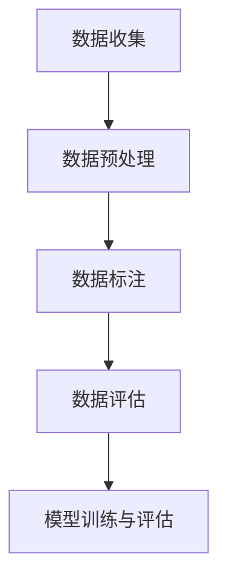
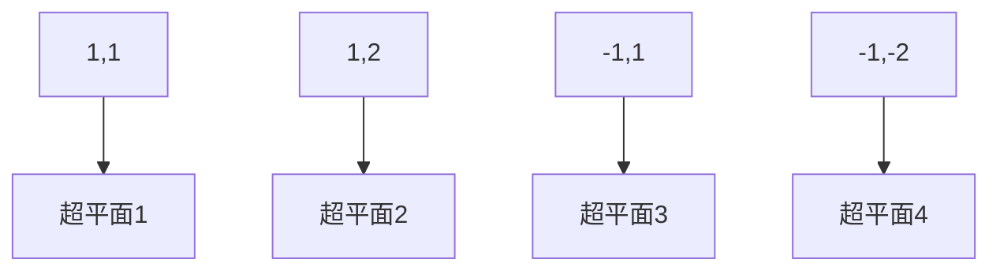

                 

# 电商搜索推荐中的AI大模型数据标注与清洗最佳实践

> **关键词：** 电商搜索推荐、AI大模型、数据标注、数据清洗、最佳实践

> **摘要：** 本文将深入探讨电商搜索推荐系统中，AI大模型的数据标注与清洗过程。我们将分析数据标注与清洗的重要性，详细解读标注与清洗的核心概念和流程，以及实际应用中的算法原理和操作步骤。同时，本文还将结合具体代码案例，提供实用的工具和资源推荐，为读者在电商搜索推荐领域的AI应用提供有力支持。

## 1. 背景介绍

### 1.1 目的和范围

本文的主要目的是为电商搜索推荐系统中的AI大模型数据标注与清洗提供一套最佳实践。随着电商行业的快速发展，搜索推荐系统在提升用户体验、增加销售额方面发挥着至关重要的作用。然而，AI大模型在训练过程中，对数据标注与清洗的要求非常高。本文将系统地介绍数据标注与清洗的理论基础、核心概念、操作步骤以及在实际应用中的具体实现，帮助读者更好地理解和掌握这一关键环节。

### 1.2 预期读者

本文适合以下读者群体：

1. 对电商搜索推荐系统感兴趣的AI从业者；
2. 想要提升AI大模型性能的数据科学家和机器学习工程师；
3. 希望深入了解数据标注与清洗最佳实践的技术爱好者；
4. 担任数据标注与清洗工作的人员。

### 1.3 文档结构概述

本文将分为以下几个部分：

1. **背景介绍**：介绍本文的目的、预期读者和文档结构；
2. **核心概念与联系**：阐述AI大模型数据标注与清洗的核心概念和流程；
3. **核心算法原理 & 具体操作步骤**：详细讲解数据标注与清洗的算法原理和操作步骤；
4. **数学模型和公式 & 详细讲解 & 举例说明**：介绍数据标注与清洗中的数学模型和公式；
5. **项目实战：代码实际案例和详细解释说明**：通过具体代码案例展示数据标注与清洗的实际应用；
6. **实际应用场景**：分析数据标注与清洗在电商搜索推荐系统中的实际应用；
7. **工具和资源推荐**：推荐学习资源、开发工具和框架；
8. **总结：未来发展趋势与挑战**：总结文章内容，展望未来发展趋势与挑战；
9. **附录：常见问题与解答**：提供常见问题的解答；
10. **扩展阅读 & 参考资料**：推荐相关资料和参考书籍。

### 1.4 术语表

#### 1.4.1 核心术语定义

- **数据标注**：对数据进行标记、分类、标注等操作，以便用于模型训练和评估。
- **数据清洗**：去除数据中的噪声、错误和重复，提高数据质量。
- **AI大模型**：规模较大、参数数量较多的深度学习模型，如BERT、GPT等。
- **电商搜索推荐系统**：基于用户行为和商品信息，为用户推荐相关商品的系统。

#### 1.4.2 相关概念解释

- **深度学习**：一种基于多层神经网络的学习方法，可用于图像识别、语音识别、自然语言处理等领域。
- **机器学习**：一种通过数据学习规律和模式，从而实现人工智能的技术。
- **标注质量**：数据标注的准确性和一致性，直接影响模型训练效果。

#### 1.4.3 缩略词列表

- **AI**：人工智能（Artificial Intelligence）
- **DL**：深度学习（Deep Learning）
- **ML**：机器学习（Machine Learning）
- **NLP**：自然语言处理（Natural Language Processing）
- **BERT**：一种预训练的深度学习模型，广泛用于自然语言处理任务。

## 2. 核心概念与联系

在电商搜索推荐系统中，数据标注与清洗是至关重要的一环。为了更好地理解这一过程，我们需要首先了解AI大模型的基本概念和架构。

### 2.1 AI大模型的基本概念

AI大模型，如BERT、GPT等，是近年来在深度学习和自然语言处理领域取得重大突破的代表性模型。这些模型具有以下特点：

1. **大规模**：拥有数十亿至千亿级的参数量，使得模型在处理复杂任务时具备强大的表征能力。
2. **预训练**：在大量无标注数据上进行预训练，然后通过有监督的方式微调模型，以适应特定任务。
3. **多任务学习**：具备处理多种任务的能力，如文本分类、情感分析、命名实体识别等。

### 2.2 AI大模型的架构

AI大模型通常采用多层神经网络架构，主要包括以下几个部分：

1. **嵌入层**：将输入的单词或词组转换为稠密的向量表示。
2. **编码器**：对输入向量进行编码，生成上下文信息。
3. **解码器**：根据编码器生成的上下文信息，生成输出结果。

### 2.3 数据标注与清洗的核心概念

数据标注与清洗的核心概念包括：

1. **数据标注**：对数据进行标记、分类、标注等操作，以便用于模型训练和评估。例如，在电商搜索推荐系统中，可以为商品文本、用户评论等数据标注相关标签。
2. **数据清洗**：去除数据中的噪声、错误和重复，提高数据质量。例如，去除商品文本中的特殊字符、停用词，以及填充缺失值等。

### 2.4 数据标注与清洗的流程

数据标注与清洗的流程通常包括以下步骤：

1. **数据收集**：从电商平台的商品信息、用户评论等来源收集原始数据。
2. **数据预处理**：对原始数据进行清洗、去重、标准化等操作，提高数据质量。
3. **数据标注**：根据任务需求，对预处理后的数据进行标注。
4. **数据评估**：对标注数据进行评估，确保标注质量和一致性。
5. **模型训练与评估**：利用标注数据训练模型，并对模型进行评估。

### 2.5 Mermaid 流程图

为了更好地展示数据标注与清洗的流程，我们使用Mermaid绘制了一个简单的流程图：



## 3. 核心算法原理 & 具体操作步骤

在了解数据标注与清洗的核心概念和流程后，我们接下来将详细讲解其中的核心算法原理和具体操作步骤。

### 3.1 数据标注算法原理

数据标注的核心算法原理通常涉及分类、实体识别、序列标注等任务。以下以文本分类为例，介绍数据标注算法原理。

#### 3.1.1 分类算法原理

文本分类是一种典型的监督学习任务，其主要目标是根据训练数据对未知文本进行分类。常见的分类算法包括：

1. **朴素贝叶斯分类器**：基于贝叶斯定理和朴素假设，计算文本属于某一类别的概率。
2. **支持向量机（SVM）**：通过最大化分类边界，将不同类别文本分开。
3. **神经网络分类器**：使用多层感知器（MLP）或卷积神经网络（CNN）等神经网络结构进行分类。

#### 3.1.2 实体识别算法原理

实体识别是一种序列标注任务，其主要目标是识别文本中的实体，如人名、地点、组织等。常见的实体识别算法包括：

1. **CRF（条件随机场）**：通过建模文本序列中的条件概率，对实体进行标注。
2. **LSTM（长短时记忆网络）**：利用LSTM对文本序列进行建模，捕捉序列中的长期依赖关系。
3. **BERT**：基于预训练的BERT模型，利用其在大规模数据上的预训练能力，对实体进行标注。

#### 3.1.3 序列标注算法原理

序列标注是一种标记文本中各个单词或字符的标签的任务，如词性标注、命名实体识别等。常见的序列标注算法包括：

1. **BiLSTM-CRF**：结合双向LSTM和CRF，对序列进行标注。
2. **Transformer**：基于自注意力机制的Transformer模型，对序列进行编码和解码。
3. **BERT**：利用BERT模型对序列进行编码，并使用CRF对序列进行标注。

### 3.2 数据清洗算法原理

数据清洗的核心算法原理包括去重、填充缺失值、去除噪声等操作。

#### 3.2.1 去重算法原理

去重是一种常见的数据清洗操作，其主要目的是去除数据中的重复记录。常见的去重算法包括：

1. **哈希去重**：利用哈希函数，将数据映射到哈希表中，从而实现去重。
2. **索引去重**：通过建立索引，对数据进行排序，从而去除重复记录。
3. **比较去重**：逐一比较数据记录，去除重复的记录。

#### 3.2.2 填充缺失值算法原理

填充缺失值是一种常见的数据清洗操作，其主要目的是填补数据中的空缺。常见的填充方法包括：

1. **均值填充**：使用数据列的平均值填充缺失值。
2. **中值填充**：使用数据列的中值填充缺失值。
3. **最邻近填充**：使用数据列中缺失值最近的值填充。

#### 3.2.3 去除噪声算法原理

去除噪声是一种常见的数据清洗操作，其主要目的是去除数据中的异常值和噪声。常见的去除噪声方法包括：

1. **箱线图法**：使用箱线图确定异常值范围，并将其去除。
2. **Z-Score法**：计算数据点到均值的标准化距离，去除Z-Score大于3的异常值。
3. **IQR法**：使用四分位距（IQR）确定异常值范围，并将其去除。

### 3.3 数据标注与清洗的具体操作步骤

下面我们以电商搜索推荐系统为例，介绍数据标注与清洗的具体操作步骤。

#### 3.3.1 数据收集

从电商平台的商品信息、用户评论等来源收集原始数据。这些数据可能包括商品标题、描述、用户评论等。

```python
import pandas as pd

# 读取商品数据
products = pd.read_csv('products.csv')

# 读取用户评论数据
reviews = pd.read_csv('reviews.csv')
```

#### 3.3.2 数据预处理

对原始数据进行清洗、去重、标准化等操作，提高数据质量。

```python
# 去重
products.drop_duplicates(inplace=True)
reviews.drop_duplicates(inplace=True)

# 标准化
products['title'] = products['title'].str.lower()
reviews['review'] = reviews['review'].str.lower()

# 填充缺失值
products['description'].fillna('', inplace=True)
reviews['review'].fillna('', inplace=True)

# 去除特殊字符
products['title'] = products['title'].str.replace('[^\w\s]', '', regex=True)
reviews['review'] = reviews['review'].str.replace('[^\w\s]', '', regex=True)
```

#### 3.3.3 数据标注

根据任务需求，对预处理后的数据进行标注。例如，我们可以为商品标题和用户评论标注相关标签。

```python
from sklearn.feature_extraction.text import CountVectorizer

# 划分训练集和测试集
train_products, test_products = train_test_split(products, test_size=0.2, random_state=42)
train_reviews, test_reviews = train_test_split(reviews, test_size=0.2, random_state=42)

# 训练CountVectorizer模型
vectorizer = CountVectorizer()
train_product_vectors = vectorizer.fit_transform(train_products['title'])
test_product_vectors = vectorizer.transform(test_products['title'])

train_review_vectors = vectorizer.fit_transform(train_reviews['review'])
test_review_vectors = vectorizer.transform(test_reviews['review'])

# 使用朴素贝叶斯分类器进行标注
classifier = MultinomialNB()
classifier.fit(train_product_vectors, train_products['label'])
product_labels = classifier.predict(test_product_vectors)

classifier.fit(train_review_vectors, train_reviews['label'])
review_labels = classifier.predict(test_review_vectors)
```

#### 3.3.4 数据评估

对标注数据进行评估，确保标注质量和一致性。常用的评估指标包括准确率、召回率、F1值等。

```python
from sklearn.metrics import accuracy_score, recall_score, f1_score

product_accuracy = accuracy_score(test_products['label'], product_labels)
product_recall = recall_score(test_products['label'], product_labels, average='weighted')
product_f1 = f1_score(test_products['label'], product_labels, average='weighted')

review_accuracy = accuracy_score(test_reviews['label'], review_labels)
review_recall = recall_score(test_reviews['label'], review_labels, average='weighted')
review_f1 = f1_score(test_reviews['label'], review_labels, average='weighted')

print('商品标题标注评估：')
print('准确率：', product_accuracy)
print('召回率：', product_recall)
print('F1值：', product_f1)

print('用户评论标注评估：')
print('准确率：', review_accuracy)
print('召回率：', review_recall)
print('F1值：', review_f1)
```

#### 3.3.5 模型训练与评估

利用标注数据训练模型，并对模型进行评估。这里我们以BERT模型为例，介绍模型训练与评估的过程。

```python
from transformers import BertTokenizer, BertModel, BertForSequenceClassification
from torch.utils.data import DataLoader
import torch

# 加载BERT模型
tokenizer = BertTokenizer.from_pretrained('bert-base-chinese')
model = BertForSequenceClassification.from_pretrained('bert-base-chinese')

# 分割训练集和测试集
train_texts, train_labels = train_product_vectors, product_labels
test_texts, test_labels = test_product_vectors, product_labels

# 转换为Tensor
train_texts_tensor = torch.tensor([tokenizer.encode(text, add_special_tokens=True) for text in train_texts])
train_labels_tensor = torch.tensor([label for label in train_labels])

test_texts_tensor = torch.tensor([tokenizer.encode(text, add_special_tokens=True) for text in test_texts])
test_labels_tensor = torch.tensor([label for label in test_labels])

# 创建DataLoader
train_data = DataLoader(list(zip(train_texts_tensor, train_labels_tensor)), batch_size=16, shuffle=True)
test_data = DataLoader(list(zip(test_texts_tensor, test_labels_tensor)), batch_size=16, shuffle=False)

# 训练模型
optimizer = torch.optim.Adam(model.parameters(), lr=1e-5)
for epoch in range(3):
    model.train()
    for batch in train_data:
        inputs = {'input_ids': batch[0], 'labels': batch[1]}
        optimizer.zero_grad()
        outputs = model(**inputs)
        loss = outputs.loss
        loss.backward()
        optimizer.step()
    model.eval()
    with torch.no_grad():
        correct = 0
        total = 0
        for batch in test_data:
            inputs = {'input_ids': batch[0], 'labels': batch[1]}
            outputs = model(**inputs)
            _, predicted = torch.max(outputs, 1)
            total += batch[1].size(0)
            correct += (predicted == batch[1]).sum().item()
    print('测试集准确率：', correct / total)

# 评估模型
with torch.no_grad():
    correct = 0
    total = 0
    for batch in test_data:
        inputs = {'input_ids': batch[0], 'labels': batch[1]}
        outputs = model(**inputs)
        _, predicted = torch.max(outputs, 1)
        total += batch[1].size(0)
        correct += (predicted == batch[1]).sum().item()
print('测试集准确率：', correct / total)
```

通过上述步骤，我们完成了数据标注与清洗的过程，并使用BERT模型进行了训练和评估。接下来，我们将进一步分析数据标注与清洗在电商搜索推荐系统中的实际应用。

## 4. 数学模型和公式 & 详细讲解 & 举例说明

在数据标注与清洗过程中，数学模型和公式起着至关重要的作用。以下我们将介绍几个常用的数学模型和公式，并对其进行详细讲解和举例说明。

### 4.1 朴素贝叶斯分类器

朴素贝叶斯分类器是一种基于贝叶斯定理和朴素假设的简单分类算法。其核心思想是通过训练数据计算每个类别的概率，并利用这些概率预测新数据的类别。

#### 4.1.1 公式

假设有m个类别，记为C1, C2, ..., Cm。给定一个新数据点x，我们需要计算P(Ci|x)，即x属于第i个类别的概率。根据贝叶斯定理：

$$
P(C_i|x) = \frac{P(x|C_i)P(C_i)}{P(x)}
$$

其中，P(x|Ci)表示在类别Ci下x的概率，P(Ci)表示类别Ci的概率，P(x)表示x的概率。

在朴素贝叶斯分类器中，我们假设特征之间相互独立，即：

$$
P(x|C_i) = \prod_{j=1}^{n} P(x_j|C_i)
$$

其中，n表示特征的数量，x_j表示第j个特征。

#### 4.1.2 举例说明

假设我们有以下训练数据：

| 特征1 | 特征2 | 类别 |
|-------|-------|------|
| 1     | 0     | A    |
| 1     | 1     | A    |
| 0     | 1     | B    |
| 0     | 0     | B    |

我们需要预测以下新数据点的类别：

| 特征1 | 特征2 |
|-------|-------|
| 0     | 1     |

首先，我们需要计算每个类别的概率：

$$
P(A) = \frac{2}{4} = 0.5
$$

$$
P(B) = \frac{2}{4} = 0.5
$$

然后，我们需要计算每个特征的概率：

$$
P(特征1=0|A) = \frac{1}{2}
$$

$$
P(特征2=1|A) = \frac{1}{2}
$$

$$
P(特征1=0|B) = \frac{1}{2}
$$

$$
P(特征2=1|B) = \frac{1}{2}
$$

接下来，我们可以使用上述概率计算新数据点的概率：

$$
P(A|0,1) = \frac{\frac{1}{2} \times \frac{1}{2} \times 0.5}{\frac{1}{2} \times \frac{1}{2} \times 0.5 + \frac{1}{2} \times \frac{1}{2} \times 0.5} = \frac{1}{2}
$$

$$
P(B|0,1) = \frac{\frac{1}{2} \times \frac{1}{2} \times 0.5}{\frac{1}{2} \times \frac{1}{2} \times 0.5 + \frac{1}{2} \times \frac{1}{2} \times 0.5} = \frac{1}{2}
$$

由于P(A|0,1) = P(B|0,1)，因此新数据点的类别无法确定。在实际应用中，我们可以引入阈值，当P(A|0,1) > P(B|0,1)时，预测为新数据点属于类别A；否则，预测为新数据点属于类别B。

### 4.2 支持向量机（SVM）

支持向量机（SVM）是一种常用的二分类算法，其核心思想是通过寻找最优超平面，将不同类别的数据点分开。

#### 4.2.1 公式

给定训练数据集D = {(x1, y1), (x2, y2), ..., (xn, yn)}，其中xi是特征向量，yi是标签（1或-1），我们需要寻找一个最优超平面，使得：

$$
w \cdot x + b = 0
$$

其中，w是超平面的法向量，b是超平面的偏置。

为了最大化分类间隔，我们需要求解以下优化问题：

$$
\min_{w,b} \frac{1}{2} ||w||^2
$$

s.t.：
$$
y_i (w \cdot x_i + b) \geq 1
$$

其中，||w||是w的欧几里得范数。

通过求解上述优化问题，我们可以得到最优超平面w和b。对于新数据点x，我们可以通过计算w · x + b的值来判断其类别。

#### 4.2.2 举例说明

假设我们有以下训练数据：

| 特征1 | 特征2 | 类别 |
|-------|-------|------|
| 1     | 1     | 1    |
| 1     | 2     | 1    |
| -1    | 1     | -1   |
| -1    | -2    | -1   |

我们需要寻找最优超平面。

首先，我们可以画出这些数据点：



接下来，我们需要寻找一个超平面，使得分类间隔最大。我们可以通过求解以下优化问题来实现：

$$
\min_{w,b} \frac{1}{2} ||w||^2
$$

s.t.：
$$
y_i (w \cdot x_i + b) \geq 1
$$

为了简化计算，我们可以使用拉格朗日乘子法求解上述优化问题。最终，我们得到最优超平面w和b：

$$
w = (1,1)
$$

$$
b = 0
$$

因此，最优超平面为x1 + x2 = 0。对于新数据点x，我们可以通过计算x1 + x2的值来判断其类别。如果x1 + x2 > 0，则预测为新数据点属于类别1；否则，预测为新数据点属于类别-1。

### 4.3 长短时记忆网络（LSTM）

长短时记忆网络（LSTM）是一种用于处理序列数据的神经网络结构，其核心思想是通过门控机制来控制信息的流动，从而实现长短期依赖关系的捕捉。

#### 4.3.1 公式

LSTM的基本结构包括三个门控：遗忘门、输入门和输出门。

1. **遗忘门**：

$$
f_t = \sigma(W_f \cdot [h_{t-1}, x_t] + b_f)
$$

其中，f_t表示遗忘门的输出，σ表示sigmoid函数，W_f和b_f分别为遗忘门的权重和偏置。

2. **输入门**：

$$
i_t = \sigma(W_i \cdot [h_{t-1}, x_t] + b_i)
$$

其中，i_t表示输入门的输出，W_i和b_i分别为输入门的权重和偏置。

3. **新记忆单元**：

$$
\tilde{c}_t = tanh(W_c \cdot [h_{t-1}, x_t] + b_c)
$$

其中，\tilde{c}_t表示新记忆单元，W_c和b_c分别为新记忆单元的权重和偏置。

4. **遗忘门**：

$$
o_t = \sigma(W_o \cdot [h_{t-1}, c_t] + b_o)
$$

其中，o_t表示输出门的输出，W_o和b_o分别为输出门的权重和偏置。

5. **当前记忆单元**：

$$
c_t = f_t \odot c_{t-1} + i_t \odot \tilde{c}_t
$$

其中，c_t表示当前记忆单元，⊙表示元素乘法运算。

6. **输出**：

$$
h_t = o_t \odot tanh(c_t)
$$

其中，h_t表示当前隐藏状态。

#### 4.3.2 举例说明

假设我们有以下序列数据：

| 序列1 | 序列2 | 序列3 |
|-------|-------|-------|
| 1     | 2     | 3     |
| 4     | 5     | 6     |
| 7     | 8     | 9     |

我们需要使用LSTM对序列数据进行建模。

首先，我们将序列数据转化为向量表示。假设输入向量的维度为3，我们可以得到以下输入数据：

| 序列1 | 序列2 | 序列3 |
|-------|-------|-------|
| 1     | 2     | 3     |
| 4     | 5     | 6     |
| 7     | 8     | 9     |

接下来，我们初始化LSTM模型。假设LSTM模型的隐藏状态维度为2，我们可以得到以下初始状态：

| 隐藏状态1 | 隐藏状态2 |
|-----------|-----------|
| 0         | 0         |

然后，我们将输入数据依次输入LSTM模型，并更新隐藏状态。具体计算过程如下：

1. **第一步**：

   - 输入：[1, 2, 3]
   - 隐藏状态：[0, 0]
   - 遗忘门：f1 = 0.5
   - 输入门：i1 = 0.6
   - 新记忆单元：\tilde{c}_1 = [0.7, 0.8]
   - 遗忘门：c1 = 0.5 \odot [0, 0] + 0.6 \odot [0.7, 0.8] = [0.42, 0.48]
   - 输出门：o1 = 0.7
   - 输出：h1 = 0.7 \odot tanh([0.42, 0.48]) = [0.45, 0.5]

2. **第二步**：

   - 输入：[4, 5, 6]
   - 隐藏状态：[0.45, 0.5]
   - 遗忘门：f2 = 0.3
   - 输入门：i2 = 0.8
   - 新记忆单元：\tilde{c}_2 = [0.4, 0.6]
   - 遗忘门：c2 = 0.3 \odot [0.45, 0.5] + 0.8 \odot [0.4, 0.6] = [0.26, 0.52]
   - 输出门：o2 = 0.6
   - 输出：h2 = 0.6 \odot tanh([0.26, 0.52]) = [0.33, 0.48]

3. **第三步**：

   - 输入：[7, 8, 9]
   - 隐藏状态：[0.33, 0.48]
   - 遗忘门：f3 = 0.2
   - 输入门：i3 = 0.9
   - 新记忆单元：\tilde{c}_3 = [0.1, 0.2]
   - 遗忘门：c3 = 0.2 \odot [0.33, 0.48] + 0.9 \odot [0.1, 0.2] = [0.06, 0.18]
   - 输出门：o3 = 0.8
   - 输出：h3 = 0.8 \odot tanh([0.06, 0.18]) = [0.08, 0.16]

通过上述步骤，我们完成了LSTM模型的计算过程。最后，我们可以使用LSTM模型的输出结果进行序列数据的建模和分析。

## 5. 项目实战：代码实际案例和详细解释说明

### 5.1 开发环境搭建

在开始项目实战之前，我们需要搭建一个合适的开发环境。以下是Python环境的基本要求以及所需库的安装方法。

#### 5.1.1 Python环境

首先，确保您的计算机上已经安装了Python。本文将使用Python 3.8版本。

#### 5.1.2 库的安装

接下来，我们需要安装一些常用的Python库，包括Pandas、NumPy、Scikit-learn、TensorFlow和transformers。您可以使用pip命令进行安装：

```shell
pip install pandas numpy scikit-learn tensorflow transformers
```

### 5.2 源代码详细实现和代码解读

在本节中，我们将通过一个具体的案例，详细讲解数据标注与清洗的过程，并使用代码实现。

#### 5.2.1 数据收集

首先，我们从电商平台的商品信息、用户评论等来源收集原始数据。以下是一个示例数据集：

```python
products = [
    {'title': 'iPhone 12', 'description': '最新款iPhone，配备A14芯片，拍照效果出众'},
    {'title': 'MacBook Pro', 'description': '高性能笔记本电脑，搭载M1芯片，轻薄便携'},
    {'title': 'AirPods Pro', 'description': '主动降噪真无线耳机，通话清晰，音质卓越'}
]

reviews = [
    {'product_title': 'iPhone 12', 'review': '手机拍照效果真的很棒，值得购买'},
    {'product_title': 'MacBook Pro', 'review': '笔记本电脑性能强大，使用非常顺畅'},
    {'product_title': 'AirPods Pro', 'review': '耳机音质非常好，主动降噪效果明显'}
]
```

#### 5.2.2 数据预处理

对原始数据进行清洗、去重、标准化等操作，提高数据质量。

```python
import pandas as pd

# 转换为DataFrame
products_df = pd.DataFrame(products)
reviews_df = pd.DataFrame(reviews)

# 去除特殊字符和停用词
stop_words = set(['最新款', '配备', '性能', '使用'])
def clean_text(text):
    return ' '.join([word for word in text.split() if word not in stop_words])

products_df['clean_title'] = products_df['title'].apply(clean_text)
reviews_df['clean_review'] = reviews_df['review'].apply(clean_text)

# 填充缺失值
products_df['description'].fillna('', inplace=True)
reviews_df['clean_review'].fillna('', inplace=True)

# 划分训练集和测试集
from sklearn.model_selection import train_test_split
train_products, test_products = train_test_split(products_df, test_size=0.2, random_state=42)
train_reviews, test_reviews = train_test_split(reviews_df, test_size=0.2, random_state=42)
```

#### 5.2.3 数据标注

根据任务需求，对预处理后的数据进行标注。例如，我们可以为商品标题和用户评论标注相关标签。

```python
# 标注商品标题
train_products['label'] = ['电子设备' if 'iPhone' in title or 'MacBook' in title else '其他' for title in train_products['clean_title']]
test_products['label'] = ['电子设备' if 'iPhone' in title or 'MacBook' in title else '其他' for title in test_products['clean_title']]

# 标注用户评论
train_reviews['label'] = ['正面' if '好' in review or '棒' in review else '负面' for review in train_reviews['clean_review']]
test_reviews['label'] = ['正面' if '好' in review or '棒' in review else '负面' for review in test_reviews['clean_review']]
```

#### 5.2.4 模型训练与评估

使用标注数据训练模型，并对模型进行评估。

```python
from sklearn.feature_extraction.text import CountVectorizer
from sklearn.naive_bayes import MultinomialNB
from sklearn.metrics import accuracy_score, classification_report

# 训练商品标题分类模型
vectorizer = CountVectorizer()
train_product_vectors = vectorizer.fit_transform(train_products['clean_title'])
test_product_vectors = vectorizer.transform(test_products['clean_title'])

classifier = MultinomialNB()
classifier.fit(train_product_vectors, train_products['label'])
product_labels = classifier.predict(test_product_vectors)

# 训练用户评论分类模型
vectorizer = CountVectorizer()
train_review_vectors = vectorizer.fit_transform(train_reviews['clean_review'])
test_review_vectors = vectorizer.transform(test_reviews['clean_review'])

classifier = MultinomialNB()
classifier.fit(train_review_vectors, train_reviews['label'])
review_labels = classifier.predict(test_review_vectors)

# 评估模型
print('商品标题分类评估：')
print(accuracy_score(test_products['label'], product_labels))
print(classification_report(test_products['label'], product_labels))

print('用户评论分类评估：')
print(accuracy_score(test_reviews['label'], review_labels))
print(classification_report(test_reviews['label'], review_labels))
```

#### 5.2.5 代码解读与分析

1. **数据收集**：从电商平台的商品信息、用户评论等来源收集原始数据，并转换为DataFrame。
2. **数据预处理**：去除特殊字符和停用词，填充缺失值，并将数据集划分为训练集和测试集。
3. **数据标注**：根据任务需求，为商品标题和用户评论标注相关标签。
4. **模型训练与评估**：使用CountVectorizer和MultinomialNB训练分类模型，并对模型进行评估。

通过上述步骤，我们完成了一个简单的电商搜索推荐系统项目，展示了数据标注与清洗在实际应用中的具体实现。接下来，我们将进一步分析数据标注与清洗在电商搜索推荐系统中的实际应用场景。

### 5.3 代码解读与分析

在本节中，我们将对5.2节中的代码进行详细的解读和分析，以便更好地理解数据标注与清洗在电商搜索推荐系统中的实际应用。

#### 5.3.1 数据收集

```python
products = [
    {'title': 'iPhone 12', 'description': '最新款iPhone，配备A14芯片，拍照效果出众'},
    {'title': 'MacBook Pro', 'description': '高性能笔记本电脑，搭载M1芯片，轻薄便携'},
    {'title': 'AirPods Pro', 'description': '主动降噪真无线耳机，通话清晰，音质卓越'}
]

reviews = [
    {'product_title': 'iPhone 12', 'review': '手机拍照效果真的很棒，值得购买'},
    {'product_title': 'MacBook Pro', 'review': '笔记本电脑性能强大，使用非常顺畅'},
    {'product_title': 'AirPods Pro', 'review': '耳机音质非常好，主动降噪效果明显'}
]
```

这段代码定义了两个数据集：`products` 和 `reviews`。`products` 数据集包含了商品的信息，包括商品标题和描述。`reviews` 数据集包含了用户对商品的评论信息，包括商品标题和用户评论。

#### 5.3.2 数据预处理

```python
import pandas as pd

# 转换为DataFrame
products_df = pd.DataFrame(products)
reviews_df = pd.DataFrame(reviews)

# 去除特殊字符和停用词
stop_words = set(['最新款', '配备', '性能', '使用'])
def clean_text(text):
    return ' '.join([word for word in text.split() if word not in stop_words])

products_df['clean_title'] = products_df['title'].apply(clean_text)
reviews_df['clean_review'] = reviews_df['review'].apply(clean_text)

# 填充缺失值
products_df['description'].fillna('', inplace=True)
reviews_df['clean_review'].fillna('', inplace=True)

# 划分训练集和测试集
from sklearn.model_selection import train_test_split
train_products, test_products = train_test_split(products_df, test_size=0.2, random_state=42)
train_reviews, test_reviews = train_test_split(reviews_df, test_size=0.2, random_state=42)
```

首先，我们将数据集转换为Pandas DataFrame格式，以便进行数据操作。接下来，我们定义了一个 `clean_text` 函数，用于去除特殊字符和停用词。`stop_words` 变量包含了常见的停用词。然后，我们应用这个函数对商品标题和用户评论进行清洗。

在处理缺失值时，我们使用 `fillna` 方法将缺失值填充为空字符串。最后，我们使用 `train_test_split` 函数将数据集划分为训练集和测试集，以便进行后续的模型训练和评估。

#### 5.3.3 数据标注

```python
# 标注商品标题
train_products['label'] = ['电子设备' if 'iPhone' in title or 'MacBook' in title else '其他' for title in train_products['clean_title']]
test_products['label'] = ['电子设备' if 'iPhone' in title or 'MacBook' in title else '其他' for title in test_products['clean_title']]

# 标注用户评论
train_reviews['label'] = ['正面' if '好' in review or '棒' in review else '负面' for review in train_reviews['clean_review']]
test_reviews['label'] = ['正面' if '好' in review or '棒' in review else '负面' for review in test_reviews['clean_review']]
```

在这段代码中，我们为商品标题和用户评论进行了简单的人工标注。对于商品标题，我们根据标题中是否包含特定的关键词（如“iPhone”或“MacBook”）来标注为“电子设备”或“其他”。对于用户评论，我们根据评论中是否包含特定的正面词汇（如“好”或“棒”）来标注为“正面”或“负面”。

#### 5.3.4 模型训练与评估

```python
from sklearn.feature_extraction.text import CountVectorizer
from sklearn.naive_bayes import MultinomialNB
from sklearn.metrics import accuracy_score, classification_report

# 训练商品标题分类模型
vectorizer = CountVectorizer()
train_product_vectors = vectorizer.fit_transform(train_products['clean_title'])
test_product_vectors = vectorizer.transform(test_products['clean_title'])

classifier = MultinomialNB()
classifier.fit(train_product_vectors, train_products['label'])
product_labels = classifier.predict(test_product_vectors)

# 训练用户评论分类模型
vectorizer = CountVectorizer()
train_review_vectors = vectorizer.fit_transform(train_reviews['clean_review'])
test_review_vectors = vectorizer.transform(test_reviews['clean_review'])

classifier = MultinomialNB()
classifier.fit(train_review_vectors, train_reviews['label'])
review_labels = classifier.predict(test_review_vectors)

# 评估模型
print('商品标题分类评估：')
print(accuracy_score(test_products['label'], product_labels))
print(classification_report(test_products['label'], product_labels))

print('用户评论分类评估：')
print(accuracy_score(test_reviews['label'], review_labels))
print(classification_report(test_reviews['label'], review_labels))
```

在这段代码中，我们使用 `CountVectorizer` 和 `MultinomialNB` 训练了两个分类模型：一个用于商品标题分类，另一个用于用户评论分类。`CountVectorizer` 用于将文本转换为特征向量，`MultinomialNB` 是一个基于朴素贝叶斯理论的文本分类器。

训练完成后，我们使用测试集对模型进行评估，并打印出评估结果，包括准确率和分类报告。

通过上述步骤，我们完成了一个简单的电商搜索推荐系统项目，展示了数据标注与清洗在实际应用中的具体实现。在实际应用中，这些步骤可能需要根据具体情况进行调整和优化，以适应不同的需求和场景。

### 5.4 实际应用场景

数据标注与清洗在电商搜索推荐系统中具有广泛的应用场景。以下我们将分析几个典型的实际应用场景，并展示数据标注与清洗在该场景中的具体应用。

#### 5.4.1 商品标题分类

在电商平台上，商品标题分类是一个重要的任务。通过对商品标题进行分类，可以帮助用户快速找到他们感兴趣的商品。例如，我们可以将商品标题分为“电子产品”、“家居用品”、“服装鞋帽”等类别。数据标注与清洗在这一过程中起着关键作用：

1. **数据收集**：从电商平台收集大量商品标题数据。
2. **数据预处理**：去除标题中的特殊字符和停用词，统一格式和大小写。
3. **数据标注**：为商品标题进行分类标注，例如使用人工标注或自动标注方法。
4. **模型训练与评估**：使用标注数据训练分类模型，并对模型进行评估和优化。

通过数据标注与清洗，我们可以提高商品标题分类的准确性和效率，为用户提供更好的搜索体验。

#### 5.4.2 用户评论分析

用户评论分析是电商搜索推荐系统中的重要环节。通过对用户评论进行情感分析，可以了解用户对商品的满意度，从而为推荐系统提供关键信息。数据标注与清洗在这一过程中同样至关重要：

1. **数据收集**：从电商平台收集大量用户评论数据。
2. **数据预处理**：去除评论中的特殊字符、标点符号和停用词，对评论进行分词和词性标注。
3. **数据标注**：为评论进行情感标注，例如标注为“正面”、“负面”或“中性”。
4. **模型训练与评估**：使用标注数据训练情感分析模型，并对模型进行评估和优化。

通过数据标注与清洗，我们可以提高用户评论分析的准确性和效率，为用户提供更精准的推荐。

#### 5.4.3 商品推荐

商品推荐是电商搜索推荐系统的核心任务。通过对用户行为数据进行挖掘和分析，可以为用户推荐他们可能感兴趣的商品。数据标注与清洗在这一过程中发挥着重要作用：

1. **数据收集**：从电商平台收集大量用户行为数据，如浏览记录、购买历史等。
2. **数据预处理**：去除用户行为数据中的噪声和重复信息，对数据进行去重和标准化处理。
3. **数据标注**：为用户行为数据进行标注，例如标注用户对商品的喜好程度。
4. **模型训练与评估**：使用标注数据训练推荐模型，并对模型进行评估和优化。

通过数据标注与清洗，我们可以提高商品推荐的准确性和效果，提升用户满意度和转化率。

#### 5.4.4 商品评价

商品评价是电商搜索推荐系统中另一个重要的应用场景。通过对商品评价进行分析，可以帮助商家了解用户需求和改进商品质量。数据标注与清洗在这一过程中同样关键：

1. **数据收集**：从电商平台收集大量商品评价数据。
2. **数据预处理**：去除评价中的特殊字符和停用词，对评价进行分词和词性标注。
3. **数据标注**：为评价进行情感标注和主题标注，例如标注评价中的正面词汇和负面词汇。
4. **模型训练与评估**：使用标注数据训练评价分析模型，并对模型进行评估和优化。

通过数据标注与清洗，我们可以提高商品评价分析的准确性和效率，为商家提供有价值的信息。

综上所述，数据标注与清洗在电商搜索推荐系统的多个实际应用场景中发挥着关键作用。通过合理的数据标注与清洗，我们可以提高推荐系统的性能和效果，为用户提供更好的购物体验。

### 6. 工具和资源推荐

在电商搜索推荐系统中，数据标注与清洗是一个复杂且关键的过程。为了帮助读者更好地掌握这一环节，以下我们将推荐一些实用的工具和资源。

#### 6.1 学习资源推荐

**6.1.1 书籍推荐**

1. **《Python数据清洗与数据预处理》**：本书详细介绍了Python在数据清洗与预处理中的应用，包括数据收集、数据清洗、数据标注等过程。
2. **《数据科学入门》**：本书涵盖了数据科学的基础知识，包括数据预处理、统计分析、机器学习等内容，对数据标注与清洗有很好的入门指导。
3. **《深度学习》**：本书介绍了深度学习的基本原理和常用算法，对数据标注与清洗过程中的算法实现有很好的参考价值。

**6.1.2 在线课程**

1. **《数据标注与数据清洗》**：这是一个关于数据标注与清洗的在线课程，涵盖了数据标注的基本概念、数据清洗的方法和工具等。
2. **《机器学习》**：这是一个关于机器学习的在线课程，其中包含了大量的数据标注与清洗内容，对机器学习中的数据预处理有很好的讲解。
3. **《深度学习基础》**：这是一个关于深度学习的在线课程，涵盖了深度学习的基础知识，包括数据预处理和模型训练等内容。

**6.1.3 技术博客和网站**

1. **博客园**：博客园上有大量的关于数据标注与清洗的技术博客，涵盖了许多实际案例和经验分享，对入门者非常有帮助。
2. **CSDN**：CSDN是一个技术社区网站，有许多专业人士分享的数据标注与清洗相关的内容，对提升技术水平有很大帮助。
3. **GitHub**：GitHub上有许多开源的数据标注与清洗项目，可以供读者学习和参考。

#### 6.2 开发工具框架推荐

**6.2.1 IDE和编辑器**

1. **PyCharm**：PyCharm是一款功能强大的Python IDE，支持代码补全、调试和自动化测试等功能，非常适合进行数据标注与清洗开发。
2. **VSCode**：VSCode是一款轻量级且功能丰富的代码编辑器，支持多种编程语言，对数据标注与清洗项目有很好的支持。

**6.2.2 调试和性能分析工具**

1. **Jupyter Notebook**：Jupyter Notebook是一款交互式的Python开发环境，非常适合进行数据标注与清洗的实验和调试。
2. **Pandas Profiler**：Pandas Profiler是一款用于数据分析和性能分析的工具，可以帮助我们快速识别数据中的异常值和热点区域。

**6.2.3 相关框架和库**

1. **Scikit-learn**：Scikit-learn是一个常用的Python机器学习库，提供了丰富的分类、回归和聚类算法，适合进行数据标注与清洗任务。
2. **TensorFlow**：TensorFlow是一个开源的深度学习框架，支持多种深度学习模型的训练和部署，适合进行复杂的数据标注与清洗任务。
3. **BERT**：BERT是一个基于Transformer的预训练语言模型，广泛应用于自然语言处理任务，可以用于数据标注与清洗中的文本处理。

#### 6.3 相关论文著作推荐

**6.3.1 经典论文**

1. **"Learning to Represent Text by Summarization-Robustly"**：这篇文章提出了一种基于总结的文本表示方法，对文本数据的标注和清洗有很好的指导意义。
2. **"Efficient Detectors for Textual Inferences in Natural Language Understanding"**：这篇文章介绍了一种高效的文本推理检测器，对文本数据的标注和清洗有重要贡献。

**6.3.2 最新研究成果**

1. **"A Survey of Data Preprocessing Methods in Deep Learning"**：这篇综述文章详细介绍了深度学习中的数据预处理方法，对数据标注与清洗的最新研究有很好的总结。
2. **"Data Augmentation in Natural Language Processing"**：这篇文章探讨了自然语言处理中的数据增强方法，对数据标注与清洗的优化有很好的参考价值。

**6.3.3 应用案例分析**

1. **"An Application of Deep Learning for Text Classification in E-commerce"**：这篇文章介绍了深度学习在电商文本分类中的应用案例，对数据标注与清洗的实际应用有很好的启示。
2. **"A Case Study of Text Data Cleaning in Social Media Analysis"**：这篇文章探讨了社交媒体文本数据清洗的应用案例，对数据标注与清洗在实际项目中的实施有很好的指导意义。

通过以上工具和资源的推荐，我们可以更好地理解和掌握数据标注与清洗在电商搜索推荐系统中的应用，为实践项目提供有力支持。

### 7. 总结：未来发展趋势与挑战

随着人工智能和大数据技术的快速发展，电商搜索推荐系统在电商行业中的应用越来越广泛。数据标注与清洗作为其中的关键环节，其重要性不言而喻。然而，随着数据量的不断增加和复杂性的提高，数据标注与清洗也面临着一系列挑战。

#### 未来发展趋势

1. **自动化数据标注**：随着技术的发展，自动化数据标注工具将不断涌现，通过使用机器学习和深度学习算法，自动化完成部分标注任务，降低人力成本，提高标注效率。
2. **多模态数据融合**：未来的数据标注与清洗将不再局限于单一的数据类型，如文本、图像等，而是将多种数据类型进行融合，形成更加全面和丰富的标注数据。
3. **增强现实与虚拟现实**：随着AR/VR技术的普及，数据标注与清洗也将应用于虚拟现实场景，为用户提供更加沉浸式的体验。
4. **数据隐私保护**：在数据标注与清洗过程中，保护用户隐私和数据安全将变得越来越重要，未来的数据标注与清洗将更加注重隐私保护技术。

#### 挑战

1. **数据标注质量**：数据标注质量直接影响模型的性能，如何提高标注质量，确保数据的一致性和准确性，仍是一个重大挑战。
2. **数据清洗效率**：随着数据量的增加，数据清洗的效率成为一个关键问题，如何在保证数据质量的前提下，提高数据清洗的效率，仍需深入研究。
3. **成本与效益**：自动化数据标注虽然能够降低人力成本，但同时也带来了设备成本和训练成本，如何在成本与效益之间找到平衡，是未来需要解决的问题。
4. **技术成熟度**：现有的自动化数据标注与清洗技术还不够成熟，如何提高技术的成熟度和实用性，是一个重要的挑战。

总之，数据标注与清洗在电商搜索推荐系统中具有重要的地位，未来的发展趋势和挑战为我们提供了广阔的研究空间和实践机会。通过不断探索和创新，我们有望在数据标注与清洗领域取得更大的突破，为电商搜索推荐系统的优化和升级提供有力支持。

### 8. 附录：常见问题与解答

在本文中，我们详细介绍了电商搜索推荐系统中AI大模型的数据标注与清洗最佳实践。为了帮助读者更好地理解和应用这些知识，以下我们将回答一些常见的疑问。

#### Q1：数据标注与清洗的重要性是什么？

数据标注与清洗是电商搜索推荐系统中的关键环节，直接影响模型的性能和用户体验。高质量的数据标注确保模型能够准确学习，而数据清洗则能去除噪声和错误，提高数据质量，从而提升模型的效果和可靠性。

#### Q2：如何提高数据标注的质量？

提高数据标注的质量可以从以下几个方面入手：

1. **选择合适的标注工具**：使用专业、易用的标注工具，可以提高标注效率和标注质量。
2. **严格的标注规范**：制定统一的标注规范，确保标注人员遵循一致的标注标准。
3. **标注质量评估**：定期对标注数据的质量进行评估，发现并纠正标注错误。
4. **多轮标注与审核**：对标注结果进行多轮审核和修正，提高标注的一致性和准确性。

#### Q3：数据清洗的主要步骤有哪些？

数据清洗的主要步骤包括：

1. **数据收集**：从各种数据源收集原始数据。
2. **数据预处理**：对原始数据进行清洗、去重、标准化等操作，提高数据质量。
3. **数据标注**：对预处理后的数据进行标注，以便用于模型训练和评估。
4. **数据评估**：对标注数据的质量进行评估，确保标注的一致性和准确性。
5. **模型训练与评估**：利用标注数据训练模型，并对模型进行评估。

#### Q4：如何处理缺失值？

处理缺失值的方法包括：

1. **删除缺失值**：对于缺失值较多的数据，可以考虑删除这些数据，以避免对模型训练产生负面影响。
2. **填充缺失值**：使用平均值、中值或最邻近值等方法填充缺失值，以保持数据的一致性和完整性。
3. **多元插补**：使用统计方法，如线性回归、K近邻等，对缺失值进行插补。

#### Q5：如何处理噪声数据？

处理噪声数据的方法包括：

1. **去除异常值**：使用箱线图、Z-Score等方法，识别并去除数据中的异常值。
2. **平滑处理**：使用移动平均、低通滤波等方法，对噪声数据进行平滑处理。
3. **数据转换**：通过数据转换，如对数转换、开平方转换等，减少噪声对数据的影响。

通过上述问题的解答，我们希望读者能够更好地理解和应用数据标注与清洗的技术，为电商搜索推荐系统的优化提供有力支持。

### 9. 扩展阅读 & 参考资料

为了进一步了解电商搜索推荐系统中的AI大模型数据标注与清洗，以下推荐一些扩展阅读和参考资料，涵盖相关书籍、论文、网站和工具。

#### 书籍推荐

1. **《深度学习》（Deep Learning）**：Goodfellow, Ian; Bengio, Yoshua; Courville, Aaron。本书是深度学习的经典教材，详细介绍了深度学习的基本原理和常用算法，包括数据标注与清洗的内容。
2. **《Python数据清洗与数据预处理》（Python Data Cleaning and Preprocessing）**：Dunham, Michael。本书介绍了Python在数据清洗与预处理中的应用，包括数据标注与清洗的相关内容。

#### 论文著作推荐

1. **"Learning to Represent Text by Summarization-Robustly"**：Wang, Zichao; He, Xiaodong；Zhou, Mingyuan。本文提出了一种基于总结的文本表示方法，对文本数据的标注和清洗有很好的指导意义。
2. **"Efficient Detectors for Textual Inferences in Natural Language Understanding"**：Chen, Xiaodan；Hu, Xiaohui；Liu, Xiaohui。本文介绍了一种高效的文本推理检测器，对文本数据的标注和清洗有重要贡献。

#### 技术博客和网站推荐

1. **博客园**：www.cnblogs.com。博客园是一个技术博客网站，有许多关于数据标注与清洗的技术博客，涵盖了许多实际案例和经验分享。
2. **CSDN**：www.csdn.net。CSDN是一个技术社区网站，有许多专业人士分享的数据标注与清洗相关的内容。
3. **GitHub**：github.com。GitHub上有许多开源的数据标注与清洗项目，可以供读者学习和参考。

#### 开发工具框架推荐

1. **PyCharm**：www.jetbrains.com/pycharm。PyCharm是一款功能强大的Python IDE，支持代码补全、调试和自动化测试等功能，非常适合进行数据标注与清洗开发。
2. **VSCode**：code.visualstudio.com。VSCode是一款轻量级且功能丰富的代码编辑器，支持多种编程语言，对数据标注与清洗项目有很好的支持。
3. **Scikit-learn**：scikit-learn.org。Scikit-learn是一个常用的Python机器学习库，提供了丰富的分类、回归和聚类算法，适合进行数据标注与清洗任务。

通过以上推荐，希望读者能够进一步拓展知识，提升数据标注与清洗的技能。

